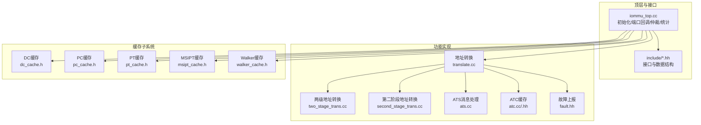
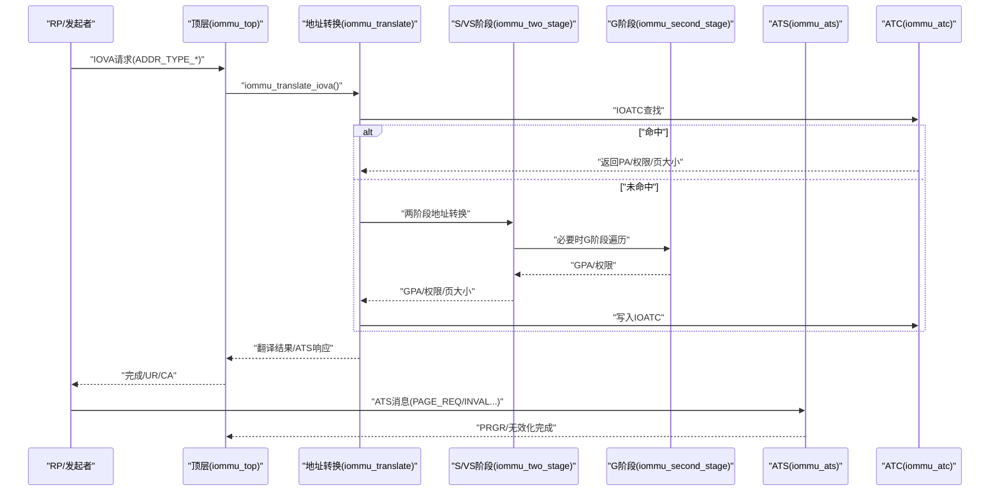
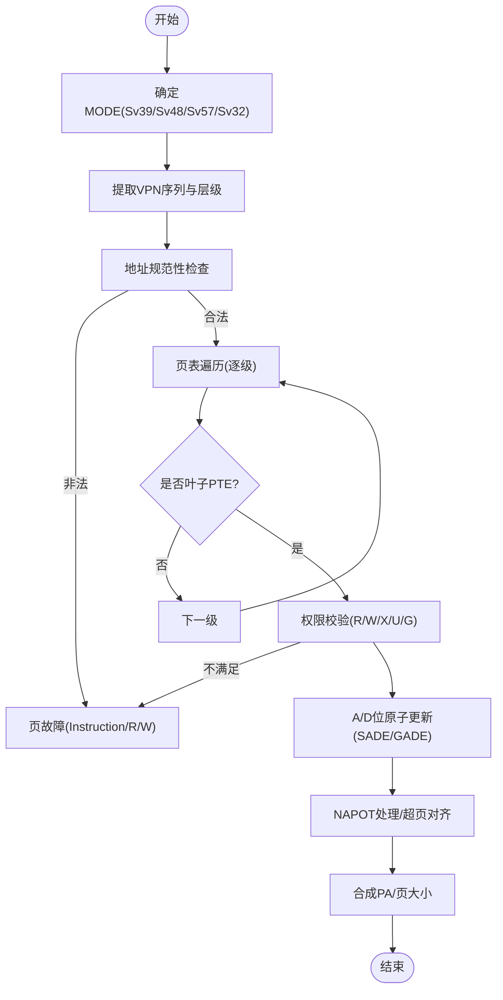
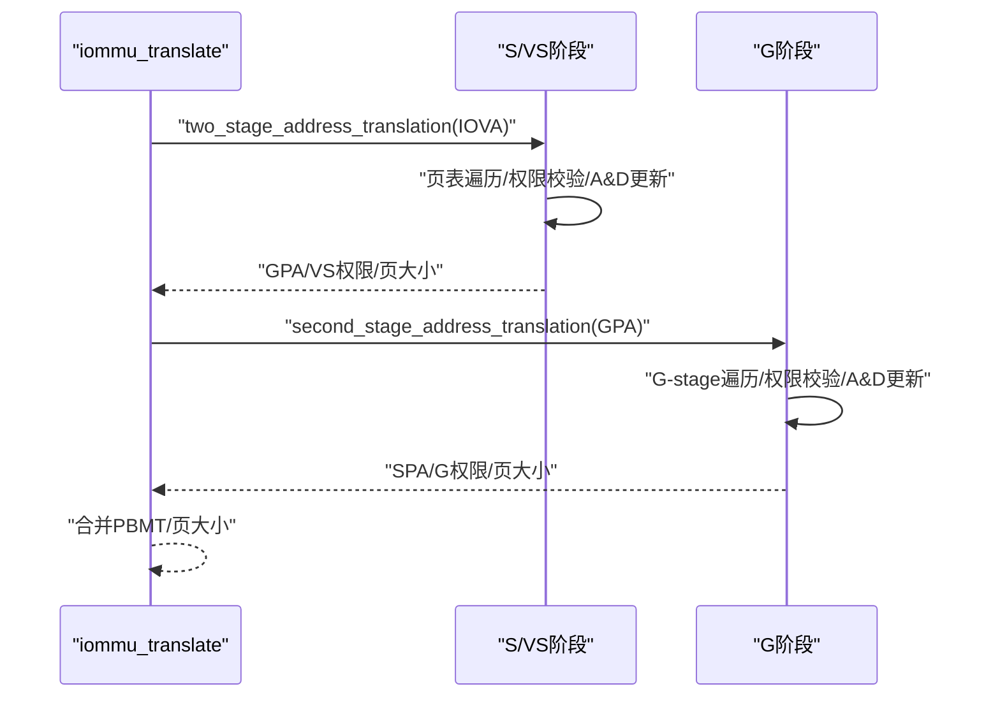
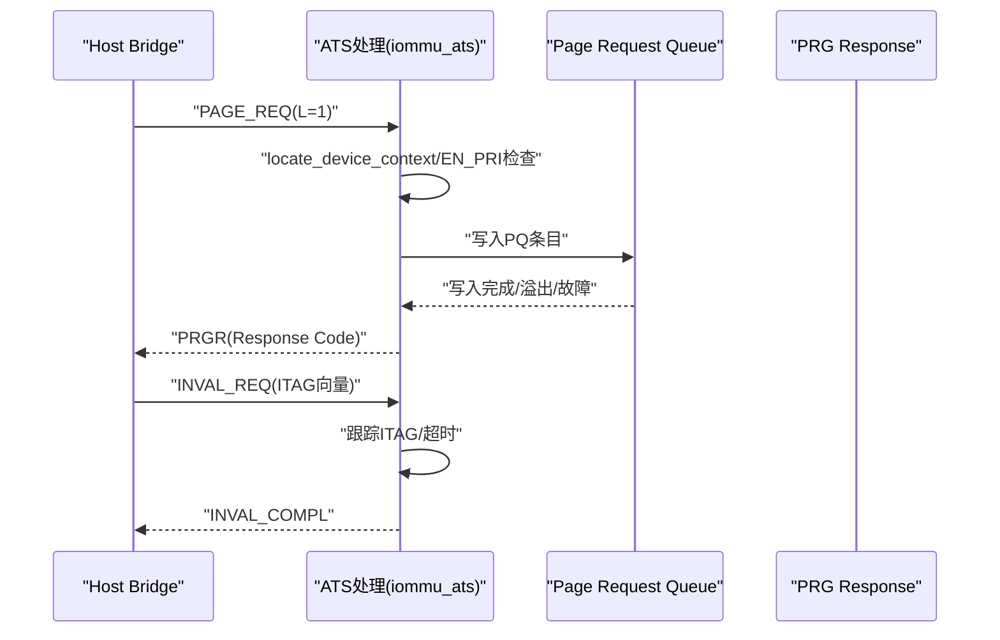
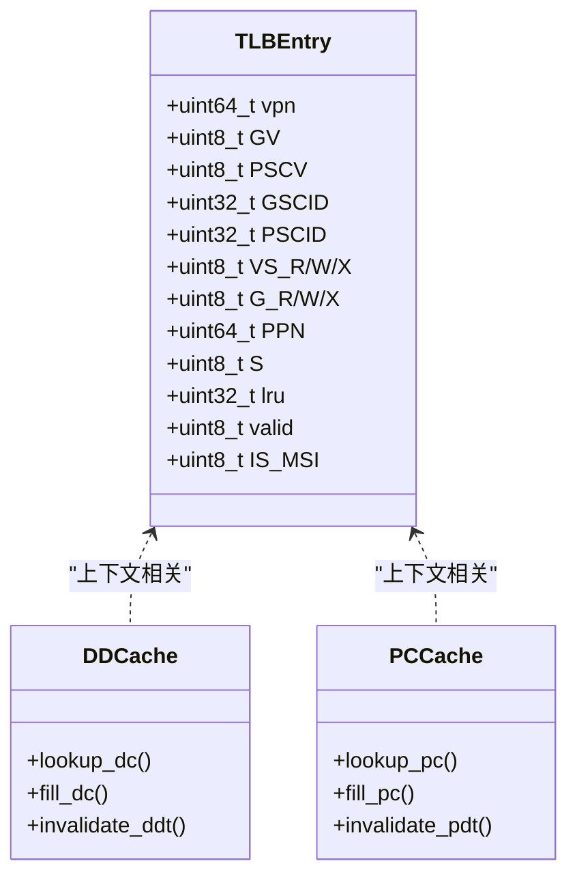
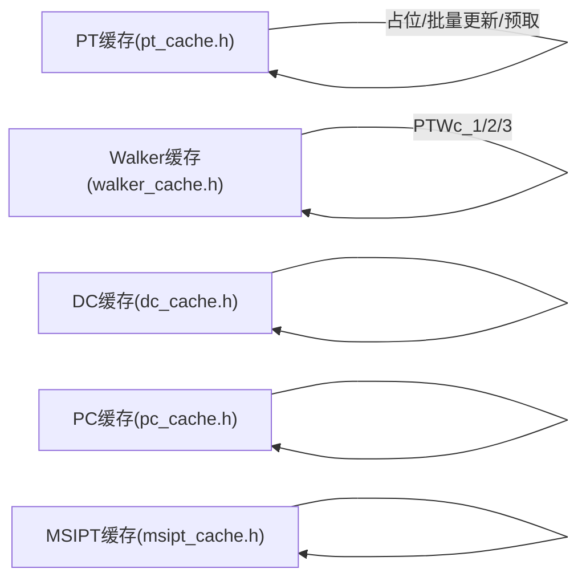
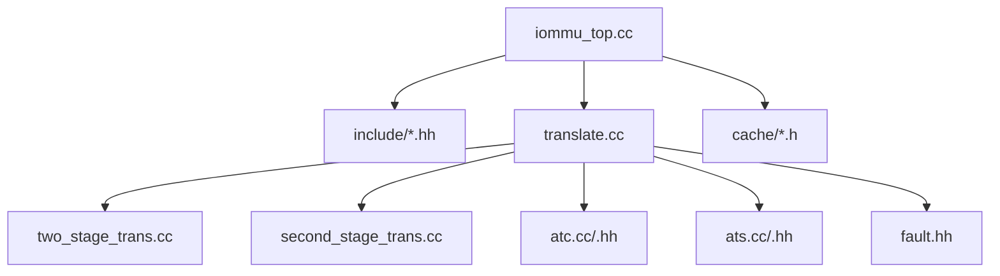
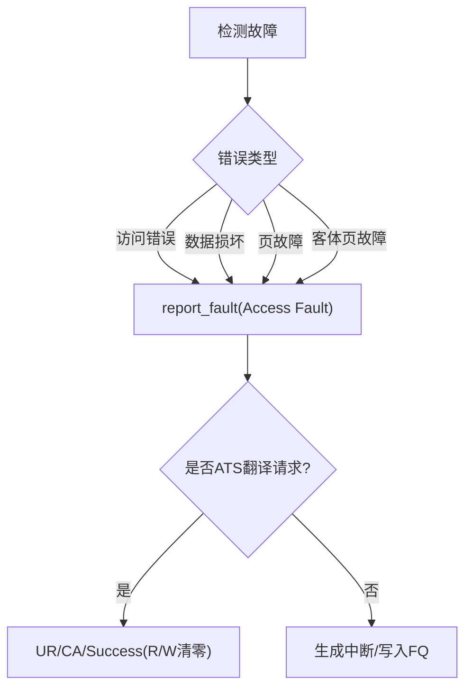

# IOMMU核心功能

<cite>
**本文引用的文件**
- [iommu_top.cc](file://iommu/iommu_top.cc)
- [iommu_translate.hh](file://iommu/include/iommu_translate.hh)
- [iommu_translate.cc](file://iommu/iommu_fun_model/iommu_translate.cc)
- [iommu_two_stage_trans.cc](file://iommu/iommu_fun_model/iommu_two_stage_trans.cc)
- [iommu_second_stage_trans.cc](file://iommu/iommu_fun_model/iommu_second_stage_trans.cc)
- [iommu_atc.hh](file://iommu/include/iommu_atc.hh)
- [iommu_atc.cc](file://iommu/iommu_fun_model/iommu_atc.cc)
- [iommu_ats.hh](file://iommu/include/iommu_ats.hh)
- [iommu_ats.cc](file://iommu/iommu_fun_model/iommu_ats.cc)
- [iommu_fault.hh](file://iommu/include/iommu_fault.hh)
- [dc_cache.h](file://iommu/cache_src/cache/dc_cache.h)
- [pc_cache.h](file://iommu/cache_src/cache/pc_cache.h)
- [pt_cache.h](file://iommu/cache_src/cache/pt_cache.h)
- [msipt_cache.h](file://iommu/cache_src/cache/msipt_cache.h)
- [walker_cache.h](file://iommu/cache_src/cache/walker_cache.h)
</cite>

## 目录
1. [简介](#简介)
2. [项目结构](#项目结构)
3. [核心组件](#核心组件)
4. [架构总览](#架构总览)
5. [详细组件分析](#详细组件分析)
6. [依赖关系分析](#依赖关系分析)
7. [性能考虑](#性能考虑)
8. [故障检测与处理](#故障检测与处理)
9. [使用模式与示例](#使用模式与示例)
10. [结论](#结论)

## 简介
本文件面向IOMMU核心功能的综合技术文档，围绕地址转换引擎、两级地址转换机制、PCIe ATS支持、地址转换缓存（ATC）设计与实现、故障检测与处理机制进行深入解析，并提供性能优化建议与最佳实践。文档以代码为依据，结合图示化描述，帮助读者快速理解IOMMU在多级页表（SV39/SV48/SV57/Sv32等）下的工作原理、缓存策略与失效机制，以及ATS消息处理流程。

## 项目结构
IOMMU模块采用分层组织方式：
- 接口与数据结构：位于 include 目录，定义了地址转换、ATS、故障、寄存器等接口与数据结构。
- 功能实现：位于 iommu_fun_model 目录，包含地址转换、两级页表遍历、ATS消息处理、中断与故障上报等实现。
- 性能模型与统计：位于 iommu_perf_model 目录，提供性能收集、参数解析、事件计数等能力。
- 缓存体系：位于 cache_src/cache 与 cache_src/subsystem，提供DC/PC/PT/MSIPT/Walker等缓存子系统及替换策略。
- 顶层控制：iommu_top.cc 提供系统初始化、端口回调、仲裁与统计输出等顶层逻辑。

**图表来源**
- [iommu_top.cc:1-780](file://iommu/iommu_top.cc#L1-L780)
- [iommu_translate.hh:1-132](file://iommu/include/iommu_translate.hh#L1-L132)
- [iommu_translate.cc:1-732](file://iommu/iommu_fun_model/iommu_translate.cc#L1-L732)
- [iommu_two_stage_trans.cc:1-600](file://iommu/iommu_fun_model/iommu_two_stage_trans.cc#L1-L600)
- [iommu_second_stage_trans.cc:1-424](file://iommu/iommu_fun_model/iommu_second_stage_trans.cc#L1-L424)
- [iommu_atc.hh:1-98](file://iommu/include/iommu_atc.hh#L1-L98)
- [iommu_atc.cc:1-233](file://iommu/iommu_fun_model/iommu_atc.cc#L1-L233)
- [iommu_ats.hh:1-98](file://iommu/include/iommu_ats.hh#L1-L98)
- [iommu_ats.cc:1-374](file://iommu/iommu_fun_model/iommu_ats.cc#L1-L374)
- [iommu_fault.hh:1-90](file://iommu/include/iommu_fault.hh#L1-L90)
- [dc_cache.h:1-36](file://iommu/cache_src/cache/dc_cache.h#L1-L36)
- [pc_cache.h:1-38](file://iommu/cache_src/cache/pc_cache.h#L1-L38)
- [pt_cache.h:1-85](file://iommu/cache_src/cache/pt_cache.h#L1-L85)
- [msipt_cache.h:1-32](file://iommu/cache_src/cache/msipt_cache.h#L1-L32)
- [walker_cache.h:1-141](file://iommu/cache_src/cache/walker_cache.h#L1-L141)

**章节来源**
- [iommu_top.cc:1-780](file://iommu/iommu_top.cc#L1-L780)

## 核心组件
- 地址转换引擎：负责从IOVA到PA的两阶段地址转换，支持SV39/SV48/SV57/Sv32等多级页表模式，处理权限检查、A/D位原子更新、NAPOT PTE、超页等特性。
- 两级地址转换（S/VS + G）：分别在第一阶段（S/VS）与第二阶段（G）执行页表遍历，支持Bare模式与非Bare模式，处理隐式访问与权限校验。
- PCIe ATS支持：处理ATS翻译请求、页面请求（PRI）与无效化请求，支持PRG响应、ITAG跟踪与超时处理。
- 地址转换缓存（ATC）：包含IOATC（TLB）、DC缓存、PC缓存，支持LRU替换、范围匹配、权限校验与失效。
- 故障检测与处理：统一的故障记录结构与队列，区分访问错误、数据损坏、页故障与客体页故障，支持ATS专用响应策略。

**章节来源**
- [iommu_translate.cc:1-732](file://iommu/iommu_fun_model/iommu_translate.cc#L1-L732)
- [iommu_two_stage_trans.cc:1-600](file://iommu/iommu_fun_model/iommu_two_stage_trans.cc#L1-L600)
- [iommu_second_stage_trans.cc:1-424](file://iommu/iommu_fun_model/iommu_second_stage_trans.cc#L1-L424)
- [iommu_atc.cc:1-233](file://iommu/iommu_fun_model/iommu_atc.cc#L1-L233)
- [iommu_ats.cc:1-374](file://iommu/iommu_fun_model/iommu_ats.cc#L1-L374)
- [iommu_fault.hh:1-90](file://iommu/include/iommu_fault.hh#L1-L90)

## 架构总览
IOMMU核心由“顶层控制 + 地址转换引擎 + ATS处理 + 缓存子系统 + 故障上报”构成。顶层负责端口回调、仲裁与统计；地址转换引擎完成两阶段页表遍历与权限校验；ATS处理PCIe消息；缓存子系统加速上下文与页表查询；故障模块统一记录与上报。

**图表来源**
- [iommu_top.cc:137-201](file://iommu/iommu_top.cc#L137-L201)
- [iommu_translate.cc:8-732](file://iommu/iommu_fun_model/iommu_translate.cc#L8-L732)
- [iommu_two_stage_trans.cc:8-600](file://iommu/iommu_fun_model/iommu_two_stage_trans.cc#L8-L600)
- [iommu_second_stage_trans.cc:7-424](file://iommu/iommu_fun_model/iommu_second_stage_trans.cc#L7-L424)
- [iommu_ats.cc:96-374](file://iommu/iommu_fun_model/iommu_ats.cc#L96-L374)
- [iommu_atc.cc:149-233](file://iommu/iommu_fun_model/iommu_atc.cc#L149-L233)

## 详细组件分析

### 地址转换引擎（两阶段）
- 多级页表支持：根据iosatp/iohgatp MODE选择SV39/SV48/SV57/Sv32等，计算VPN序列与层级数，执行页表遍历。
- 权限与属性：严格校验R/W/X/U/G/权限位，SUM与MXR规则，SADE/GADE控制A/D位原子更新。
- NAPOT与超页：支持NAPOT编码与各级超页（2MiB/1GiB/512GiB/256TiB），页大小与PPN组合决定最终PA。
- 隐式访问：在S/VS阶段访问PTE地址时可能触发G阶段隐式访问，确保A/D位更新一致性。

**图表来源**
- [iommu_two_stage_trans.cc:8-600](file://iommu/iommu_fun_model/iommu_two_stage_trans.cc#L8-L600)
- [iommu_second_stage_trans.cc:7-424](file://iommu/iommu_fun_model/iommu_second_stage_trans.cc#L7-L424)

**章节来源**
- [iommu_translate.cc:332-440](file://iommu/iommu_fun_model/iommu_translate.cc#L332-L440)
- [iommu_two_stage_trans.cc:8-600](file://iommu/iommu_fun_model/iommu_two_stage_trans.cc#L8-L600)
- [iommu_second_stage_trans.cc:7-424](file://iommu/iommu_fun_model/iommu_second_stage_trans.cc#L7-L424)

### 两级地址转换机制（S/VS + G）
- S/VS阶段：根据设备/进程上下文选择IOSATP，执行第一阶段页表遍历，返回GPA与VS级权限。
- G阶段：若启用G-stage，则对S/VS返回的GPA再进行G-stage遍历，返回SPA与G级权限。
- Bare模式：当MODE为Bare时，直接透传或按Bare页大小返回，不进行页表遍历。
- 隐式访问与A/D更新：在S/VS访问PTE地址时可能触发G阶段隐式访问，确保A/D位更新一致。

**图表来源**
- [iommu_translate.cc:376-440](file://iommu/iommu_fun_model/iommu_translate.cc#L376-L440)
- [iommu_two_stage_trans.cc:8-600](file://iommu/iommu_fun_model/iommu_two_stage_trans.cc#L8-L600)
- [iommu_second_stage_trans.cc:7-424](file://iommu/iommu_fun_model/iommu_second_stage_trans.cc#L7-L424)

**章节来源**
- [iommu_translate.cc:332-440](file://iommu/iommu_fun_model/iommu_translate.cc#L332-L440)

### PCIe ATS支持
- ATS翻译请求：支持ATS翻译请求的权限裁剪与ATS响应格式生成，区分R/W/X权限与Priv/N/CXL.IO/AMA字段。
- 页面请求（PRI）：将Page Request消息入队到PQ，支持溢出与内存访问故障处理，自动生成PRG Response。
- 无效化请求：跟踪ITAG状态，处理无效化完成与超时，支持IOFENCE等待无效化的协调。

**图表来源**
- [iommu_ats.cc:96-374](file://iommu/iommu_fun_model/iommu_ats.cc#L96-L374)
- [iommu_ats.hh:1-98](file://iommu/include/iommu_ats.hh#L1-L98)

**章节来源**
- [iommu_ats.cc:1-374](file://iommu/iommu_fun_model/iommu_ats.cc#L1-L374)
- [iommu_ats.hh:1-98](file://iommu/include/iommu_ats.hh#L1-L98)

### 地址转换缓存（ATC）设计与实现
- IOATC（TLB）：缓存IOVA->PA映射，支持范围NAPOT编码、权限位、页大小标记S，按LRU替换。
- DC/PC缓存：缓存设备/进程上下文，加速locate_device_context/locate_process_context。
- 查找算法：基于标签（GV/PSCV/GSCID/PSCID/vpn）匹配，范围匹配函数支持NAPOT。
- 失效机制：支持按VMA/GVMA/全局失效，以及级联失效（如DDT/PDT变更影响上下文）。

**图表来源**
- [iommu_atc.hh:9-36](file://iommu/include/iommu_atc.hh#L9-L36)
- [iommu_atc.cc:95-147](file://iommu/iommu_fun_model/iommu_atc.cc#L95-L147)
- [dc_cache.h:8-31](file://iommu/cache_src/cache/dc_cache.h#L8-L31)
- [pc_cache.h:8-33](file://iommu/cache_src/cache/pc_cache.h#L8-L33)

**章节来源**
- [iommu_atc.hh:1-98](file://iommu/include/iommu_atc.hh#L1-L98)
- [iommu_atc.cc:1-233](file://iommu/iommu_fun_model/iommu_atc.cc#L1-L233)
- [dc_cache.h:1-36](file://iommu/cache_src/cache/dc_cache.h#L1-L36)
- [pc_cache.h:1-38](file://iommu/cache_src/cache/pc_cache.h#L1-L38)

### 缓存子系统（DC/PC/PT/MSIPT/Walker）
- PT缓存：按gscid/pscid/iova维度缓存页表中间结果，支持占位CL、批量更新与预取，提供精确VMA/GVMA失效。
- Walker缓存：三层子表（PTWc_1/2/3）分别缓存不同级页表中间结果，支持更新统计与冗余更新跳过。
- MSIPT缓存：缓存MSI页表项，支持按设备失效。
- DC/PC缓存：上下文缓存，支持按设备/进程ID失效。

**图表来源**
- [pt_cache.h:1-85](file://iommu/cache_src/cache/pt_cache.h#L1-L85)
- [walker_cache.h:1-141](file://iommu/cache_src/cache/walker_cache.h#L1-L141)
- [dc_cache.h:1-36](file://iommu/cache_src/cache/dc_cache.h#L1-L36)
- [pc_cache.h:1-38](file://iommu/cache_src/cache/pc_cache.h#L1-L38)
- [msipt_cache.h:1-32](file://iommu/cache_src/cache/msipt_cache.h#L1-L32)

**章节来源**
- [pt_cache.h:1-85](file://iommu/cache_src/cache/pt_cache.h#L1-L85)
- [walker_cache.h:1-141](file://iommu/cache_src/cache/walker_cache.h#L1-L141)
- [dc_cache.h:1-36](file://iommu/cache_src/cache/dc_cache.h#L1-L36)
- [pc_cache.h:1-38](file://iommu/cache_src/cache/pc_cache.h#L1-L38)
- [msipt_cache.h:1-32](file://iommu/cache_src/cache/msipt_cache.h#L1-L32)

## 依赖关系分析
- iommu_top.cc 作为顶层，依赖各功能模块的接口与实现，负责端口回调、仲裁与统计。
- 地址转换模块相互协作：translate依赖two_stage与second_stage，同时与ATC/ATS/Fault交互。
- 缓存子系统与地址转换解耦，通过接口访问，支持替换策略与失效传播。

**图表来源**
- [iommu_top.cc:1-780](file://iommu/iommu_top.cc#L1-L780)
- [iommu_translate.cc:1-732](file://iommu/iommu_fun_model/iommu_translate.cc#L1-L732)
- [iommu_two_stage_trans.cc:1-600](file://iommu/iommu_fun_model/iommu_two_stage_trans.cc#L1-L600)
- [iommu_second_stage_trans.cc:1-424](file://iommu/iommu_fun_model/iommu_second_stage_trans.cc#L1-L424)
- [iommu_atc.cc:1-233](file://iommu/iommu_fun_model/iommu_atc.cc#L1-L233)
- [iommu_ats.cc:1-374](file://iommu/iommu_fun_model/iommu_ats.cc#L1-L374)
- [iommu_fault.hh:1-90](file://iommu/include/iommu_fault.hh#L1-L90)
- [dc_cache.h:1-36](file://iommu/cache_src/cache/dc_cache.h#L1-L36)
- [pc_cache.h:1-38](file://iommu/cache_src/cache/pc_cache.h#L1-L38)
- [pt_cache.h:1-85](file://iommu/cache_src/cache/pt_cache.h#L1-L85)
- [msipt_cache.h:1-32](file://iommu/cache_src/cache/msipt_cache.h#L1-L32)
- [walker_cache.h:1-141](file://iommu/cache_src/cache/walker_cache.h#L1-L141)

**章节来源**
- [iommu_top.cc:1-780](file://iommu/iommu_top.cc#L1-L780)

## 性能考虑
- 缓存层次与命中率：通过IOATC、DC/PC缓存与PT/Walker缓存降低页表遍历开销；统计接口可评估命中率与延迟。
- 预取与去重：PT缓存支持占位CL与批量更新，结合VA去重减少重复页表遍历。
- 流控与仲裁：顶层实现DDR仲裁与带宽控制，避免拥塞与饥饿。
- 统计与瓶颈定位：提供IOPS、平均延迟、峰值占用等指标，便于性能分析与优化。

[本节为通用性能讨论，不直接分析具体文件]

## 故障检测与处理
- 故障分类：访问错误、数据损坏、页故障（指令/读/写）、客体页故障（指令/读/写），以及ATS专用错误码。
- ATS响应策略：对于ATS翻译请求，部分永久错误返回UR，部分返回CA；未授权权限返回Success但清零相应权限位。
- 故障上报：统一fault_rec结构，包含CAUSE、PID、PV、PRIV、TTYP、DID、iotval/iotval2，写入故障队列并触发中断。

**图表来源**
- [iommu_fault.hh:63-77](file://iommu/include/iommu_fault.hh#L63-L77)
- [iommu_translate.cc:620-731](file://iommu/iommu_fun_model/iommu_translate.cc#L620-L731)
- [iommu_ats.cc:117-130](file://iommu/iommu_fun_model/iommu_ats.cc#L117-L130)

**章节来源**
- [iommu_fault.hh:1-90](file://iommu/include/iommu_fault.hh#L1-L90)
- [iommu_translate.cc:620-731](file://iommu/iommu_fun_model/iommu_translate.cc#L620-L731)
- [iommu_ats.cc:117-130](file://iommu/iommu_fun_model/iommu_ats.cc#L117-L130)

## 使用模式与示例
以下为常见调用模式与路径参考（不包含具体代码内容）：

- 调用地址转换主流程
  - 路径参考：[iommu_translate_iova:8-732](file://iommu/iommu_fun_model/iommu_translate.cc#L8-L732)
  - 步骤要点：设备/进程上下文定位、IOATC查找、两阶段地址转换、MSI地址转换、权限裁剪与缓存写入。

- 两阶段地址转换（S/VS）
  - 路径参考：[two_stage_address_translation:8-600](file://iommu/iommu_fun_model/iommu_two_stage_trans.cc#L8-L600)
  - 步骤要点：MODE判定（SV39/SV48/SV57/Sv32）、VPN提取、页表遍历、权限校验、A/D原子更新、NAPOT与超页处理。

- 第二阶段地址转换（G）
  - 路径参考：[second_stage_address_translation:7-424](file://iommu/iommu_fun_model/iommu_second_stage_trans.cc#L7-L424)
  - 步骤要点：G-stage根表对齐要求、遍历与权限校验、A/D原子更新、隐式访问与客体页故障处理。

- ATS翻译请求处理
  - 路径参考：[handle_invalidation_completion:56-82](file://iommu/iommu_fun_model/iommu_ats.cc#L56-L82)
  - 步骤要点：ITAG状态管理、超时处理、与IOFENCE等待的协调。

- ATS页面请求（PRI）处理
  - 路径参考：[handle_page_request:96-374](file://iommu/iommu_fun_model/iommu_ats.cc#L96-L374)
  - 步骤要点：设备上下文定位、PQ入队、溢出/故障处理、PRG响应生成。

- IOATC查找与缓存
  - 路径参考：[lookup_ioatc_iotlb:149-233](file://iommu/iommu_fun_model/iommu_atc.cc#L149-L233)
  - 步骤要点：标签匹配、范围匹配、权限校验、A/D位与写访问失效处理。

- PT缓存占位与批量更新（预取）
  - 路径参考：[insert_placeholder/batch_update_placeholders:51-59](file://iommu/cache_src/cache/pt_cache.h#L51-L59)
  - 步骤要点：占位CL插入、批量更新、head_index与is_req更新。

- Walker缓存更新策略
  - 路径参考：[update(ptwc_1/2/3):48-52](file://iommu/cache_src/cache/walker_cache.h#L48-L52)
  - 步骤要点：按需更新子表、统计冗余更新、跳过无变化更新。

**章节来源**
- [iommu_translate.cc:8-732](file://iommu/iommu_fun_model/iommu_translate.cc#L8-L732)
- [iommu_two_stage_trans.cc:8-600](file://iommu/iommu_fun_model/iommu_two_stage_trans.cc#L8-L600)
- [iommu_second_stage_trans.cc:7-424](file://iommu/iommu_fun_model/iommu_second_stage_trans.cc#L7-L424)
- [iommu_ats.cc:56-82](file://iommu/iommu_fun_model/iommu_ats.cc#L56-L82)
- [iommu_ats.cc:96-374](file://iommu/iommu_fun_model/iommu_ats.cc#L96-L374)
- [iommu_atc.cc:149-233](file://iommu/iommu_fun_model/iommu_atc.cc#L149-L233)
- [pt_cache.h:51-59](file://iommu/cache_src/cache/pt_cache.h#L51-L59)
- [walker_cache.h:48-52](file://iommu/cache_src/cache/walker_cache.h#L48-L52)

## 结论
IOMMU核心通过清晰的分层设计实现了高性能的两阶段地址转换与PCIe ATS支持。地址转换引擎严格遵循RISC-V页表规范，支持多级页表与NAPOT/超页；ATC与多级缓存显著降低页表遍历开销；ATS处理完善地覆盖了翻译请求、页面请求与无效化流程；故障模块提供细粒度的错误分类与响应策略。结合统计与性能模型，可进一步优化缓存策略、预取深度与流控参数，以获得更优的吞吐与延迟表现。