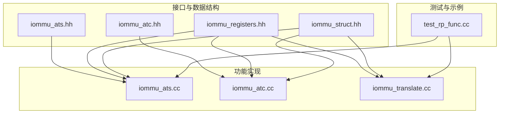
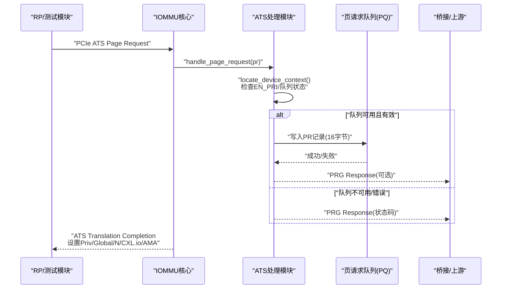
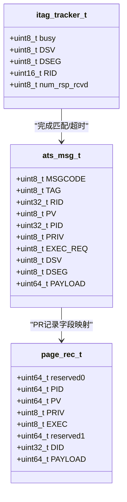
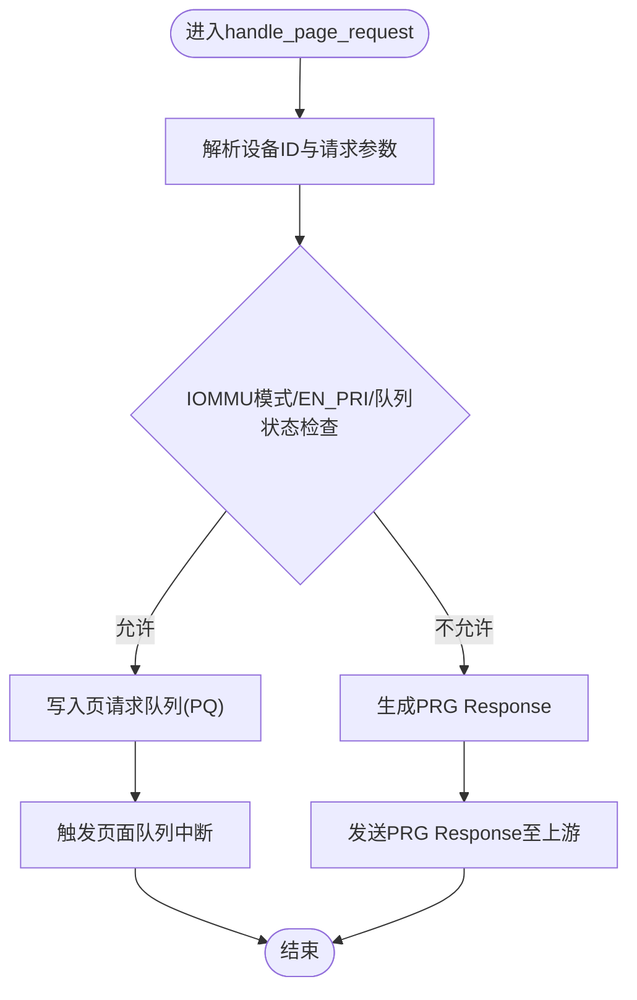
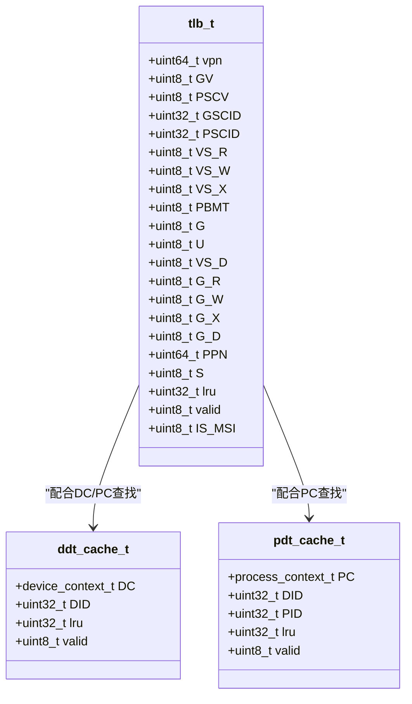
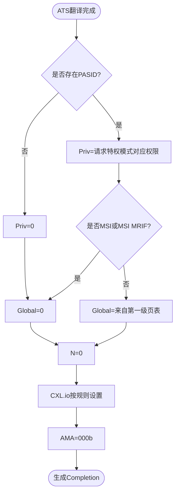
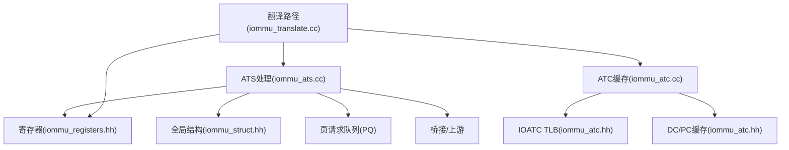

# PCIe ATS支持

<cite>
**本文引用的文件**
- [iommu_ats.hh](file://iommu/include/iommu_ats.hh)
- [iommu_atc.hh](file://iommu/include/iommu_atc.hh)
- [iommu_ats.cc](file://iommu/iommu_fun_model/iommu_ats.cc)
- [iommu_atc.cc](file://iommu/iommu_fun_model/iommu_atc.cc)
- [iommu_translate.cc](file://iommu/iommu_fun_model/iommu_translate.cc)
- [iommu_struct.hh](file://iommu/include/iommu_struct.hh)
- [iommu_registers.hh](file://iommu/include/iommu_registers.hh)
- [test_rp_func.cc](file://rp/test_rp_func.cc)
</cite>

## 目录
1. [引言](#引言)
2. [项目结构](#项目结构)
3. [核心组件](#核心组件)
4. [架构总览](#架构总览)
5. [详细组件分析](#详细组件分析)
6. [依赖关系分析](#依赖关系分析)
7. [性能考虑](#性能考虑)
8. [故障排查指南](#故障排查指南)
9. [结论](#结论)
10. [附录](#附录)

## 引言
本文件系统性阐述PCIe ATS（Address Translation Services）在该IOMMU实现中的支持与行为，覆盖ATS翻译请求的接收、解析与响应流程；ATS Translation Completion消息的生成规则（Priv、Global、N、CXL.io、AMA等字段）；ATS缓存（ATC）的特殊处理机制（MRIF模式、缓存策略）；以及ATS功能的配置选项与使用示例。同时对比ATS与传统地址转换的差异与优势。

## 项目结构
该仓库采用分层模块化组织，ATS相关能力主要分布在以下位置：
- 接口与数据结构定义：iommu/include/iommu_ats.hh、iommu/include/iommu_atc.hh
- 功能实现：iommu/iommu_fun_model/iommu_ats.cc、iommu/iommu_fun_model/iommu_atc.cc、iommu/iommu_fun_model/iommu_translate.cc
- 全局结构与寄存器：iommu/include/iommu_struct.hh、iommu/include/iommu_registers.hh
- 测试与配置示例：rp/test_rp_func.cc

**图表来源**
- [iommu_ats.hh:1-98](file://iommu/include/iommu_ats.hh#L1-L98)
- [iommu_atc.hh:1-98](file://iommu/include/iommu_atc.hh#L1-L98)
- [iommu_ats.cc:1-374](file://iommu/iommu_fun_model/iommu_ats.cc#L1-L374)
- [iommu_atc.cc:1-233](file://iommu/iommu_fun_model/iommu_atc.cc#L1-L233)
- [iommu_translate.cc:1-200](file://iommu/iommu_fun_model/iommu_translate.cc#L1-L200)
- [iommu_struct.hh:1-102](file://iommu/include/iommu_struct.hh#L1-L102)
- [iommu_registers.hh:1-200](file://iommu/include/iommu_registers.hh#L1-L200)
- [test_rp_func.cc:210-299](file://rp/test_rp_func.cc#L210-L299)

**章节来源**
- [iommu_ats.hh:1-98](file://iommu/include/iommu_ats.hh#L1-L98)
- [iommu_atc.hh:1-98](file://iommu/include/iommu_atc.hh#L1-L98)
- [iommu_ats.cc:1-374](file://iommu/iommu_fun_model/iommu_ats.cc#L1-L374)
- [iommu_atc.cc:1-233](file://iommu/iommu_fun_model/iommu_atc.cc#L1-L233)
- [iommu_translate.cc:1-200](file://iommu/iommu_fun_model/iommu_translate.cc#L1-L200)
- [iommu_struct.hh:1-102](file://iommu/include/iommu_struct.hh#L1-L102)
- [iommu_registers.hh:1-200](file://iommu/include/iommu_registers.hh#L1-L200)
- [test_rp_func.cc:210-299](file://rp/test_rp_func.cc#L210-L299)

## 核心组件
- ATS消息与状态机
  - 定义ATS消息格式、PRG响应码、ITAG跟踪器等，支撑ATS请求队列与完成处理。
- ATS功能实现
  - 处理PCIe Page Request消息、生成PRG Response、管理ATS无效化请求与超时、分配ITAG等。
- ATS缓存（ATC）
  - IOATC TLB、设备上下文缓存、进程上下文缓存，支持快速查找与缓存替换策略。
- 地址翻译与ATS集成
  - 在统一翻译路径中识别ATS请求类型，生成ATS Translation Completion消息并设置Priv/Global/N/CXL.io/AMA等字段。
- 寄存器与全局状态
  - 提供ATS/PRI使能、页请求队列控制、中断、命令队列挂起等状态管理。

**章节来源**
- [iommu_ats.hh:47-96](file://iommu/include/iommu_ats.hh#L47-L96)
- [iommu_ats.cc:7-374](file://iommu/iommu_fun_model/iommu_ats.cc#L7-L374)
- [iommu_atc.hh:85-96](file://iommu/include/iommu_atc.hh#L85-L96)
- [iommu_atc.cc:7-233](file://iommu/iommu_fun_model/iommu_atc.cc#L7-L233)
- [iommu_translate.cc:85-568](file://iommu/iommu_fun_model/iommu_translate.cc#L85-L568)
- [iommu_struct.hh:42-99](file://iommu/include/iommu_struct.hh#L42-L99)

## 架构总览
下图展示了ATS在IOMMU中的端到端交互：上游PCIe ATS请求经由IOMMU进入ATS处理模块，随后根据设备上下文与页请求队列进行处理，必要时生成PRG Response或ATS Translation Completion消息返回给上游。

**图表来源**
- [iommu_ats.cc:96-373](file://iommu/iommu_fun_model/iommu_ats.cc#L96-L373)
- [iommu_translate.cc:533-568](file://iommu/iommu_fun_model/iommu_translate.cc#L533-L568)

**章节来源**
- [iommu_ats.cc:96-373](file://iommu/iommu_fun_model/iommu_ats.cc#L96-L373)
- [iommu_translate.cc:533-568](file://iommu/iommu_fun_model/iommu_translate.cc#L533-L568)

## 详细组件分析

### ATS消息与状态机
- ATS消息结构
  - 包含MSGCODE、TAG、RID、PV、PID、PRIV、EXEC_REQ、DSV/DSEG、PAYLOAD等字段，用于描述请求来源与权限要求。
- PRG响应码
  - 定义Success、Invalid Request、Response Failure等状态码，用于PRG Response的消息体编码。
- ITAG跟踪器
  - 记录每个ITAG的忙碌状态、DSV/DSEG/RID、已接收响应计数，支持ATS无效化请求的完成匹配与超时处理。

**图表来源**
- [iommu_ats.hh:47-96](file://iommu/include/iommu_ats.hh#L47-L96)

**章节来源**
- [iommu_ats.hh:47-96](file://iommu/include/iommu_ats.hh#L47-L96)

### ATS功能实现：请求处理与PRG响应
- Page Request处理流程
  - 解析设备ID、检查IOMMU模式与设备上下文、验证EN_PRI、检查页请求队列状态（启用、溢出、内存访问故障），在满足条件时将请求记录写入PQ，否则按错误类型生成PRG Response。
- PRG Response生成规则
  - 根据Cause码选择Success/Invalid Request/Response Failure等状态码；当PRPR为1且请求携带PASID时，PRG Response中包含PV/PID；否则清零。
- ATS无效化请求与完成
  - 分配ITAG、发送ATS INVAL_REQ、跟踪完成向量与CC值，支持定时器到期释放ITAG并继续待处理的IOFENCE。

**图表来源**
- [iommu_ats.cc:96-373](file://iommu/iommu_fun_model/iommu_ats.cc#L96-L373)

**章节来源**
- [iommu_ats.cc:96-373](file://iommu/iommu_fun_model/iommu_ats.cc#L96-L373)

### ATS缓存（ATC）与MRIF模式
- IOATC TLB
  - 缓存虚拟页号、全局/进程上下文标签、VS/G阶段权限属性、PPN与页大小、MSI标记等；支持按VPN范围匹配与权限校验，未命中则回退页表遍历。
- 设备/进程上下文缓存
  - 缓存DC与PC以减少重复查找开销，采用LRU更新策略。
- MRIF模式与MSI处理
  - 在翻译结果中标记is_mrif与dest_mrif_addr/mrif_nid，用于指示目标为内存注册中断文件（MRIF）场景，便于后续路径优化。

**图表来源**
- [iommu_atc.hh:9-51](file://iommu/include/iommu_atc.hh#L9-L51)

**章节来源**
- [iommu_atc.hh:9-51](file://iommu/include/iommu_atc.hh#L9-L51)
- [iommu_atc.cc:96-233](file://iommu/iommu_fun_model/iommu_atc.cc#L96-L233)

### ATS Translation Completion消息生成规则
- Priv字段
  - 当请求无PASID时始终为0；当存在PASID时，Priv反映请求方所请求的特权模式对应的权限授予。
- Global字段
  - 成功完成且请求携带PASID时，Global由第一级页表决定；其他情况（如MSI）均置0。
- N字段
  - ATS Translation Completion的N字段始终为0；设备可通过其他方式确定No-snoop标志。
- CXL.io字段
  - 非CXL设备：置0；
  - CXL类型1/2设备：若地址为MSI或DC.t2gpa为1或内存类型为NC/IO，则置1；否则为“未指定”。
- AMA字段
  - 默认为000b，可由实现提供其他编码方式。
- S与PPN/页大小
  - 若S=1表示范围大于4096字节；PPN与S的计算遵循ATS NAPOT格式。

**图表来源**
- [iommu_translate.cc:533-568](file://iommu/iommu_fun_model/iommu_translate.cc#L533-L568)

**章节来源**
- [iommu_translate.cc:533-568](file://iommu/iommu_fun_model/iommu_translate.cc#L533-L568)

### ATS与传统地址转换的区别与优势
- 区别
  - 传统地址转换通常面向单次访存或事务，而ATS通过Page Request机制允许上游设备请求将特定页置为驻留，从而降低延迟与带宽占用。
  - ATS Completion消息携带更丰富的权限与属性信息（Priv/Global/N/CXL.io/AMA），便于设备侧缓存与优化。
- 优势
  - 减少缺页抖动：PRI机制可提前将页置驻留，避免反复缺页。
  - 更细粒度的权限控制：Priv字段与PASID结合，精确反映不同特权模式下的权限授予。
  - 与MRIF/MSI集成：支持MSI MRIF场景，便于中断路径优化。

[本节为概念性总结，无需具体文件分析]

## 依赖关系分析
- ATS处理依赖设备上下文与页请求队列状态，同时与命令队列、中断控制器协同工作。
- ATC缓存与页表遍历相互补充：命中TLB直接返回，未命中触发页表遍历并回填ATC。
- 寄存器文件提供ATS/PRI使能、队列控制、中断状态等关键参数。

**图表来源**
- [iommu_ats.cc:1-374](file://iommu/iommu_fun_model/iommu_ats.cc#L1-L374)
- [iommu_atc.cc:1-233](file://iommu/iommu_fun_model/iommu_atc.cc#L1-L233)
- [iommu_translate.cc:1-200](file://iommu/iommu_fun_model/iommu_translate.cc#L1-L200)
- [iommu_struct.hh:42-99](file://iommu/include/iommu_struct.hh#L42-L99)
- [iommu_registers.hh:1-200](file://iommu/include/iommu_registers.hh#L1-L200)

**章节来源**
- [iommu_ats.cc:1-374](file://iommu/iommu_fun_model/iommu_ats.cc#L1-L374)
- [iommu_atc.cc:1-233](file://iommu/iommu_fun_model/iommu_atc.cc#L1-L233)
- [iommu_translate.cc:1-200](file://iommu/iommu_fun_model/iommu_translate.cc#L1-L200)
- [iommu_struct.hh:42-99](file://iommu/include/iommu_struct.hh#L42-L99)
- [iommu_registers.hh:1-200](file://iommu/include/iommu_registers.hh#L1-L200)

## 性能考虑
- ATS队列与中断
  - PQ满或内存访问故障会触发中断并可能丢弃后续请求；应合理配置队列大小与内存访问路径，避免频繁溢出。
- ATC缓存策略
  - TLB/DC/PC缓存采用LRU替换，命中率直接影响翻译延迟；可根据设备访问模式调整缓存规模。
- 命令队列挂起
  - ATS无效化请求需等待ITAG空闲，ITAG耗尽会导致命令队列挂起；应确保超时机制与资源回收及时生效。

[本节提供通用指导，无需具体文件分析]

## 故障排查指南
- ATS请求被静默丢弃
  - 检查EN_PRI是否开启、队列是否启用、是否发生PQMF/PQOF；确认PRG Last Request标志与错误处理逻辑。
- PRG Response状态异常
  - 根据Cause码判断是“All inbound transactions disallowed”、“Transaction type disallowed”还是“Response Failure”，分别检查IOMMU模式、设备上下文配置与队列状态。
- ATS无效化完成未达预期
  - 检查ITAG分配与完成匹配、DSV/DSEG/RID一致性、CC计数与超时标志；确认待处理IOFENCE链路是否被阻塞。

**章节来源**
- [iommu_ats.cc:57-94](file://iommu/iommu_fun_model/iommu_ats.cc#L57-L94)
- [iommu_ats.cc:212-231](file://iommu/iommu_fun_model/iommu_ats.cc#L212-L231)

## 结论
该实现完整覆盖了PCIe ATS的关键能力：请求接收与解析、PRG响应生成、ATS无效化与超时处理、ATS Translation Completion消息的字段设置规则，以及与ATC缓存、MRIF/MSI路径的协同。通过合理的配置与调优，可在保证正确性的前提下显著提升设备侧的内存访问性能与中断处理效率。

[本节为总结性内容，无需具体文件分析]

## 附录

### ATS配置选项与使用示例
- 设备上下文配置要点
  - EN_ATS/EN_PRI/T2GPA/PRPR/DTF等字段直接影响ATS行为与PRG Response策略。
- 示例流程
  - 在测试模块中添加设备上下文时，设置EN_ATS/EN_PRI等位，随后建立页表与G-stage映射，最后发起ATS翻译请求并验证Completion字段。

**章节来源**
- [test_rp_func.cc:210-299](file://rp/test_rp_func.cc#L210-L299)