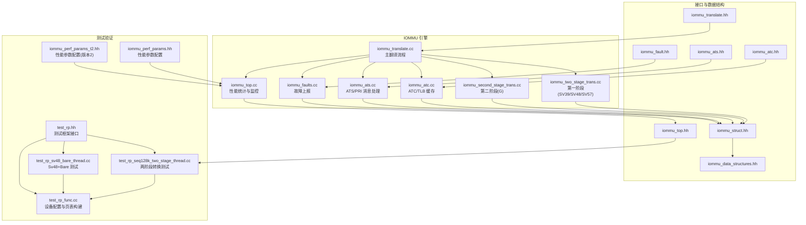
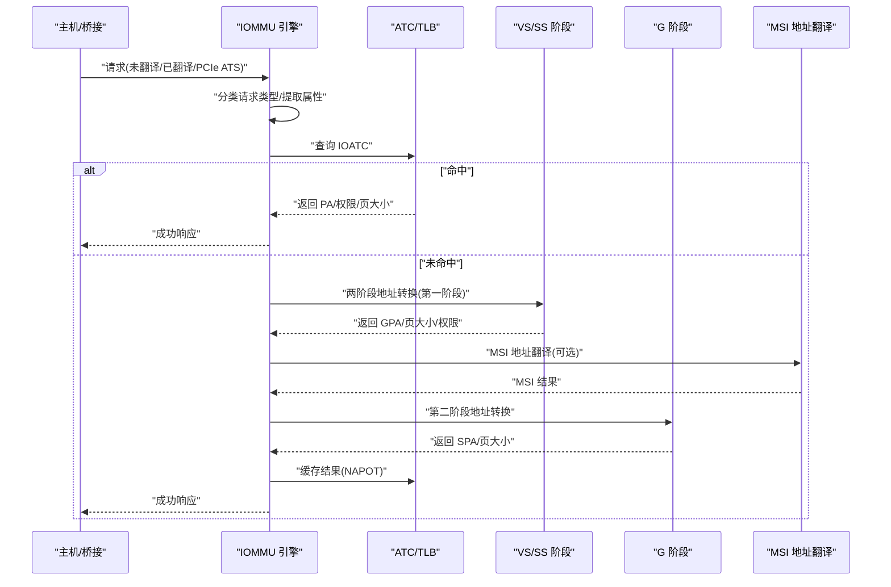
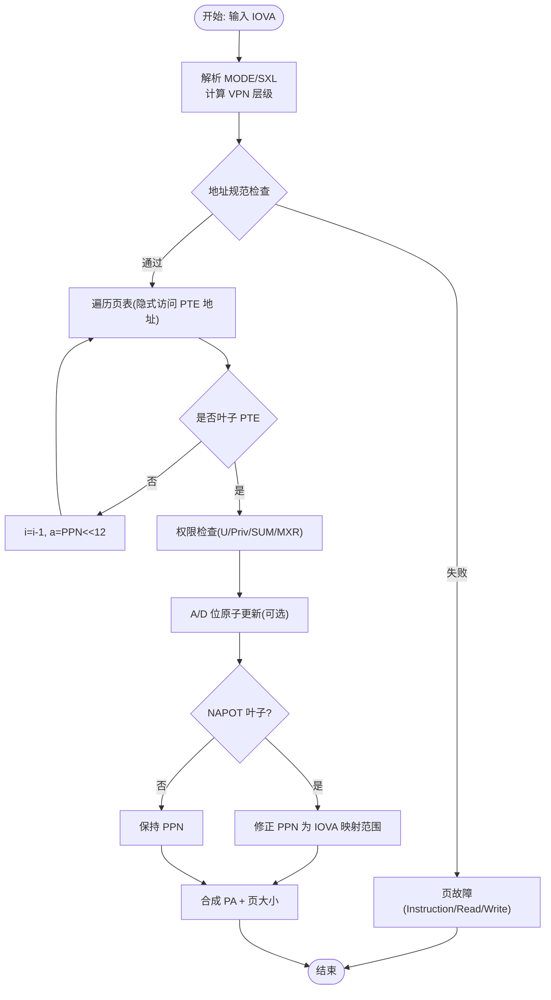
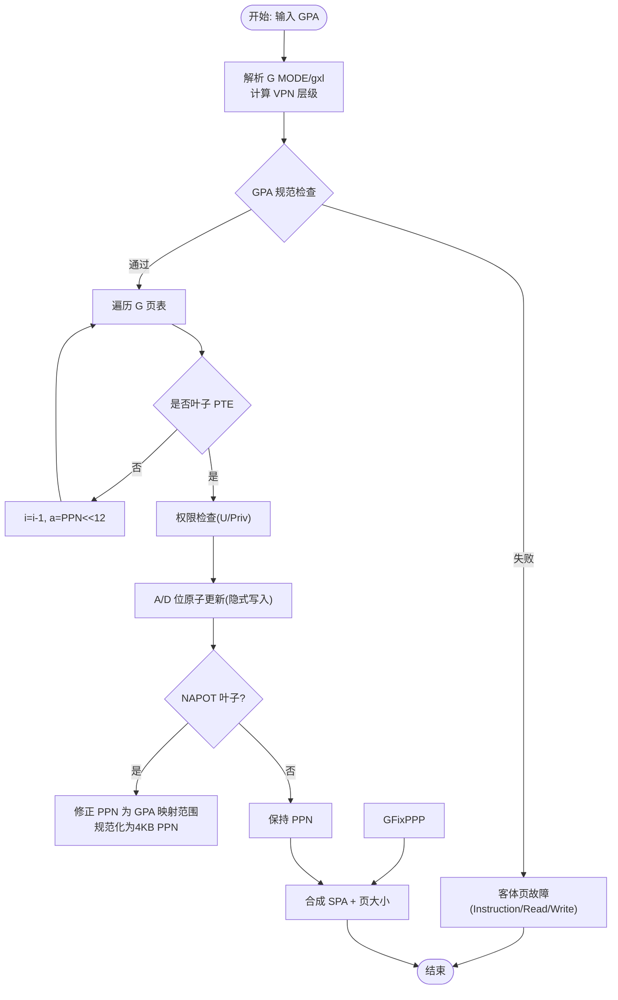
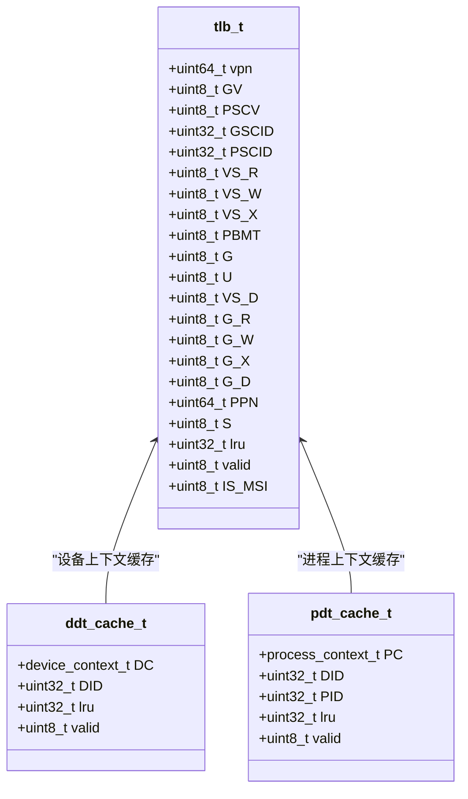
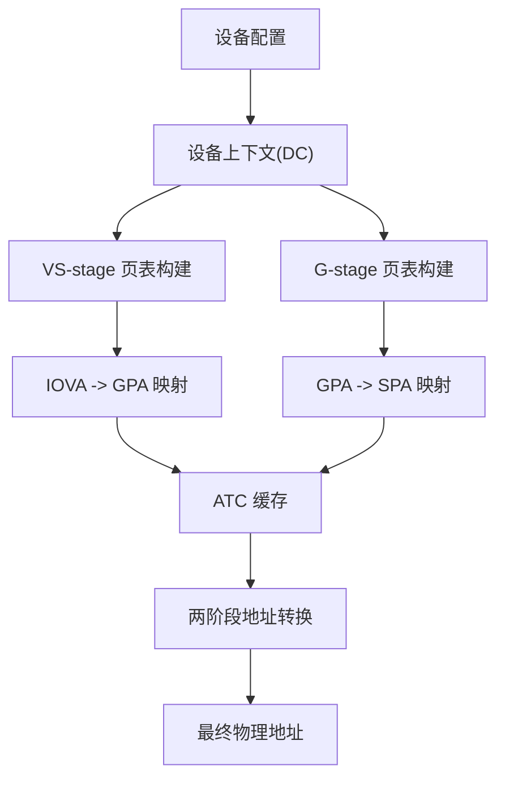
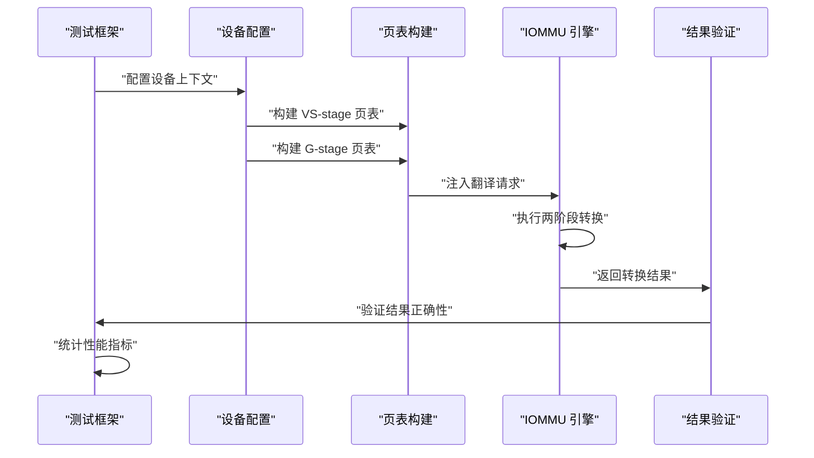
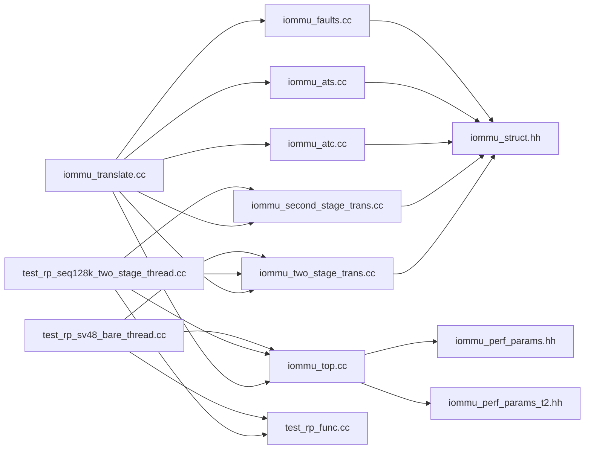

# 地址转换引擎

<cite>
**本文档引用的文件**
- [iommu_translate.hh](file://iommu/include/iommu_translate.hh)
- [iommu_translate.cc](file://iommu/iommu_fun_model/iommu_translate.cc)
- [iommu_atc.hh](file://iommu/include/iommu_atc.hh)
- [iommu_atc.cc](file://iommu/iommu_fun_model/iommu_atc.cc)
- [iommu_ats.hh](file://iommu/include/iommu_ats.hh)
- [iommu_ats.cc](file://iommu/iommu_fun_model/iommu_ats.cc)
- [iommu_two_stage_trans.cc](file://iommu/iommu_fun_model/iommu_two_stage_trans.cc)
- [iommu_second_stage_trans.cc](file://iommu/iommu_fun_model/iommu_second_stage_trans.cc)
- [iommu_fault.hh](file://iommu/include/iommu_fault.hh)
- [iommu_faults.cc](file://iommu/iommu_fun_model/iommu_faults.cc)
- [iommu_struct.hh](file://iommu/include/iommu_struct.hh)
- [iommu_data_structures.hh](file://iommu/include/iommu_data_structures.hh)
- [test_rp_seq128k_two_stage_thread.cc](file://rp/test_rp_seq128k_two_stage_thread.cc)
- [test_rp_sv48_bare_thread.cc](file://rp/test_rp_sv48_bare_thread.cc)
- [test_rp_func.cc](file://rp/test_rp_func.cc)
- [test_rp.hh](file://rp/test_rp.hh)
- [param_trans_def.hh](file://iommu/include\param_trans_def.hh)
- [default_config.json](file://iommu/cache_config/default_config.json)
- [iommu_top.cc](file://iommu/iommu_top.cc)
- [iommu_top.hh](file://iommu/iommu_top.hh)
- [iommu_perf_params.hh](file://iommu/iommu_perf_model/iommu_perf_params.hh)
- [iommu_perf_params_t2.hh](file://iommu/iommu_perf_model/iommu_perf_params_t2.hh)
</cite>

## 更新摘要
**所做更改**
- 更新了G阶段大页叶子处理的关键bug修复说明
- 修正了g_pte.PPN字段规范化处理的文档描述
- 增强了两阶段地址转换验证的故障排查指南
- 更新了NAPOT格式存储的处理逻辑说明

## 目录
1. [简介](#简介)
2. [项目结构](#项目结构)
3. [核心组件](#核心组件)
4. [架构总览](#架构总览)
5. [详细组件分析](#详细组件分析)
6. [两阶段地址转换测试验证](#两阶段地址转换测试验证)
7. [依赖关系分析](#依赖关系分析)
8. [性能考虑](#性能考虑)
9. [故障排查指南](#故障排查指南)
10. [结论](#结论)
11. [附录](#附录)

## 简介
本文件为 IOMMU 地址转换引擎的详细技术文档，聚焦两阶段地址转换（SV39/SV48/SV57）的完整实现，涵盖：
- 第一阶段（VS/SS）与第二阶段（G）地址转换算法与流程
- 地址转换缓存（ATC）工作机制：查找、命中处理、失效策略与 NAPOT 格式存储
- 不同地址类型（未翻译、已翻译、PCIe ATS）的转换逻辑差异
- 两阶段地址转换测试验证：包括 iosatp=Sv48 和 iohgatp=Sv48x4 配置、VS 阶段和 G 阶段翻译验证、设备上下文配置等
- 错误处理与故障恢复机制
- 性能优化建议与缓存策略最佳实践
- **新增**：完整的128KB顺序读取测试框架，支持详细的性能指标统计
- **更新**：测试规模从2000个请求扩展到5000个请求，支持自适应页表大小计算
- **关键修复**：G阶段大页叶子处理中g_pte.PPN字段的正确规范化，解决两阶段转换验证失败问题

## 项目结构
该工程采用模块化设计，地址转换相关代码主要位于 iommu/iommu_fun_model 目录下，接口定义在 iommu/include 目录中，缓存配置在 iommu/cache_config 中，测试验证在 rp 目录中。



**图表来源**
- [iommu_translate.cc:1-732](file://iommu/iommu_fun_model/iommu_translate.cc#L1-L732)
- [iommu_two_stage_trans.cc:1-600](file://iommu/iommu_fun_model/iommu_two_stage_trans.cc#L1-L600)
- [iommu_second_stage_trans.cc:1-424](file://iommu/iommu_fun_model/iommu_second_stage_trans.cc#L1-L424)
- [iommu_atc.cc:1-233](file://iommu/iommu_fun_model/iommu_atc.cc#L1-L233)
- [iommu_ats.cc:1-374](file://iommu/iommu_fun_model/iommu_ats.cc#L1-L374)
- [iommu_faults.cc:1-160](file://iommu/iommu_fun_model/iommu_faults.cc#L1-L160)
- [iommu_top.cc:550-749](file://iommu/iommu_top.cc#L550-L749)
- [iommu_translate.hh:1-132](file://iommu/include/iommu_translate.hh#L1-L132)
- [iommu_atc.hh:1-98](file://iommu/include/iommu_atc.hh#L1-L98)
- [iommu_ats.hh:1-98](file://iommu/include/iommu_ats.hh#L1-L98)
- [iommu_fault.hh:1-90](file://iommu/include/iommu_fault.hh#L1-L90)
- [iommu_struct.hh:1-102](file://iommu/include/iommu_struct.hh#L1-L102)
- [iommu_data_structures.hh:140-339](file://iommu/include/iommu_data_structures.hh#L140-L339)
- [iommu_top.hh:60-70](file://iommu/iommu_top.hh#L60-L70)
- [test_rp_seq128k_two_stage_thread.cc:1-418](file://rp/test_rp_seq128k_two_stage_thread.cc#L1-L418)
- [test_rp_sv48_bare_thread.cc:1-230](file://rp/test_rp_sv48_bare_thread.cc#L1-L230)
- [test_rp_func.cc:211-399](file://rp/test_rp_func.cc#L211-L399)
- [test_rp.hh:1-184](file://rp/test_rp.hh#L1-L184)
- [iommu_perf_params.hh:172-173](file://iommu/iommu_perf_model/iommu_perf_params.hh#L172-L173)
- [iommu_perf_params_t2.hh:144-145](file://iommu/iommu_perf_model/iommu_perf_params_t2.hh#L144-L145)

**章节来源**
- [iommu_translate.cc:1-732](file://iommu/iommu_fun_model/iommu_translate.cc#L1-L732)
- [iommu_struct.hh:1-102](file://iommu/include/iommu_struct.hh#L1-L102)

## 核心组件
- 主翻译流程：负责根据请求类型与上下文选择路径，协调 ATC 查找、两阶段页表遍历、MSI 地址翻译与最终响应生成。
- 两阶段地址转换：实现 VS/SS 阶段（SV39/SV48/SV57）与 G 阶段（SV32x4/SV39x4/SV48x4/SV57x4）的页表遍历、权限检查、A/D 位原子更新与 NAPOT 处理。
- ATC/TLB：设备上下文缓存、进程上下文缓存与 IOTLB（TLB），支持 NAPOT 范围匹配与权限校验。
- ATS/PRI：PCIe ATS 翻译请求、Page Request 消息队列与无效化跟踪。
- 故障上报：统一故障记录入队、溢出与内存访问错误处理。
- **新增**：两阶段地址转换测试验证框架，支持多种配置组合的自动化测试。
- **新增**：性能统计与监控系统，提供详细的缓存命中率、PTW DDR访问统计和吞吐量分析。
- **更新**：自适应页表大小计算功能，根据测试请求数量动态调整页表范围。
- **关键修复**：G阶段大页叶子处理中g_pte.PPN字段的正确规范化，确保包含最终的4KB PPN而非原始的大页对齐PPN。

**章节来源**
- [iommu_translate.hh:95-130](file://iommu/include/iommu_translate.hh#L95-L130)
- [iommu_atc.hh:70-96](file://iommu/include/iommu_atc.hh#L70-L96)
- [iommu_ats.hh:7-98](file://iommu/include/iommu_ats.hh#L7-L98)
- [iommu_fault.hh:52-90](file://iommu/include/iommu_fault.hh#L52-L90)
- [iommu_top.cc:550-749](file://iommu/iommu_top.cc#L550-L749)

## 架构总览
两阶段地址转换的核心流程如下：



**图表来源**
- [iommu_translate.cc:352-492](file://iommu/iommu_fun_model/iommu_translate.cc#L352-L492)
- [iommu_two_stage_trans.cc:8-502](file://iommu/iommu_fun_model/iommu_two_stage_trans.cc#L8-L502)
- [iommu_second_stage_trans.cc:8-422](file://iommu/iommu_fun_model/iommu_second_stage_trans.cc#L8-L422)
- [iommu_atc.cc:150-225](file://iommu/iommu_fun_model/iommu_atc.cc#L150-L225)

## 详细组件分析

### 两阶段地址转换（SV39/SV48/SV57）
- 第一阶段（VS/SS）支持 SV39/SV48/SV57，根据 MODE 与 SXL 计算 VPN 分段与层级数，执行页表遍历与权限检查；当需要时通过 G 阶段隐式访问 PTE 地址以完成 A/D 位原子更新。
- 支持 NAPOT 叶子 PTE 的特殊编码与隐式读取，确保范围映射正确性。
- 对非叶子 PTE 进行保留位校验与全局位传播。



**图表来源**
- [iommu_two_stage_trans.cc:8-502](file://iommu/iommu_fun_model/iommu_two_stage_trans.cc#L8-L502)

**章节来源**
- [iommu_two_stage_trans.cc:8-502](file://iommu/iommu_fun_model/iommu_two_stage_trans.cc#L8-L502)

### 第二阶段地址转换（G 阶段）
- G 阶段支持 SV32x4/SV39x4/SV48x4/SV57x4，根据 MODE 与 gxl 计算 VPN 分段与层级数，进行页表遍历与权限检查。
- 支持 NAPOT 叶子 PTE 的特殊编码与隐式读取。
- 对隐式写入场景（如 VS 阶段 A/D 更新触发 G 阶段写）进行原子更新与一致性保证。
- **关键修复**：在NAPOT叶子处理中，g_pte.PPN字段现在被正确规范化为包含最终的4KB PPN，而不是保留原始的大页对齐PPN，解决了两阶段转换验证失败的问题。



**图表来源**
- [iommu_second_stage_trans.cc:8-422](file://iommu/iommu_fun_model/iommu_second_stage_trans.cc#L8-L422)

**章节来源**
- [iommu_second_stage_trans.cc:8-422](file://iommu/iommu_fun_model/iommu_second_stage_trans.cc#L8-L422)

### 地址转换缓存（ATC/TLB）与 NAPOT 存储
- ATC 包含设备目录缓存（DDT）、进程目录缓存（PDT）与 IOTLB（TLB）。IOTLB 使用 NAPOT（NAPOT Address Translation) 格式存储 VPN 与 PPN 的范围映射，支持按页大小标志 S 表示超页范围。
- 查找流程：比较 GV/GSCID/PSCV/PSCID 标签，使用 match_address_range 判断 VPN 是否落入范围掩码内，命中后进行权限校验与 A/D 位检查，必要时失效条目触发回退到页表遍历。
- 缓存策略：LRU 替换，命中后更新 LRU 时间戳；对于 G 阶段权限故障或写入导致的 D 位清零，会主动失效条目以确保一致性。
- **更新**：NAPOT格式存储现在正确处理g_pte.PPN字段的规范化，确保缓存中的PPN值与实际的4KB物理页号一致。



**图表来源**
- [iommu_atc.hh:9-51](file://iommu/include/iommu_atc.hh#L9-L51)

**章节来源**
- [iommu_atc.cc:96-147](file://iommu/iommu_fun_model/iommu_atc.cc#L96-L147)
- [iommu_atc.cc:150-225](file://iommu/iommu_fun_model/iommu_atc.cc#L150-L225)
- [iommu_translate.cc:458-492](file://iommu/iommu_fun_model/iommu_translate.cc#L458-L492)

### 不同地址类型的转换逻辑差异
- 未翻译请求（Untranslated）：直接进行两阶段转换，支持缓存 IOVA->SPA 映射。
- 已翻译请求（Translated）：若 DC.tc.T2GPA=0，直接透传；若 T2GPA=1，则 IOVA 即为 GPA，进入 G 阶段转换。
- PCIe ATS 翻译请求：支持 ATS 特定字段（Priv/N/CXL.io/AMA/Global/U/R/W/X）填充规则，且存在专用缓存策略（可配置是否缓存 T2GPA 模式下的 GPA->SPA）。

```mermaid
flowchart TD
Req["输入请求"] --> Type{"请求类型"}
Type --> |未翻译| UT["两阶段转换(IOVA->GPA->SPA)"]
Type --> |已翻译(T2GPA=0)| TR0["透传(不走页表)"]
Type --> |已翻译(T2GPA=1)| TR1["G 阶段转换(GPA->SPA)"]
Type --> |PCIe ATS| ATS["两阶段转换并填充 ATS 字段"]
UT --> Cache["缓存 IOVA->SPA"]
TR1 --> Cache
ATS --> CacheATS["条件缓存(可配置)"]
Cache --> Resp["返回响应"]
CacheATS --> Resp
```

**图表来源**
- [iommu_translate.cc:46-86](file://iommu/iommu_fun_model/iommu_translate.cc#L46-L86)
- [iommu_translate.cc:238-246](file://iommu/iommu_fun_model/iommu_translate.cc#L238-L246)
- [iommu_translate.cc:254-259](file://iommu/iommu_fun_model/iommu_translate.cc#L254-L259)
- [iommu_translate.cc:471-492](file://iommu/iommu_fun_model/iommu_translate.cc#L471-L492)

**章节来源**
- [iommu_translate.cc:46-86](file://iommu/iommu_fun_model/iommu_translate.cc#L46-L86)
- [iommu_translate.cc:238-246](file://iommu/iommu_fun_model/iommu_translate.cc#L238-L246)
- [iommu_translate.cc:254-259](file://iommu/iommu_fun_model/iommu_translate.cc#L254-L259)
- [iommu_translate.cc:471-492](file://iommu/iommu_fun_model/iommu_translate.cc#L471-L492)

### MSI 地址翻译与 MRIF 模式
- 在两阶段转换后，若 GPA 指向 MSI 页面表，则进一步判断是否为 MRIF（Message Redirection Interrupt File）模式。
- MRIF 模式通常不缓存于 ATC，且存在"禁止缓存"的策略以避免 MRIF 特殊处理与常规地址转换混用带来的复杂性。

**章节来源**
- [iommu_translate.cc:388-418](file://iommu/iommu_fun_model/iommu_translate.cc#L388-L418)
- [iommu_translate.cc:462-467](file://iommu/iommu_fun_model/iommu_translate.cc#L462-L467)

### ATS/PRI 消息处理
- Page Request 消息进入 PQ（Page Request Queue），支持溢出与内存访问错误处理；PRG Response（PRGR）消息按状态码返回。
- ATS 无效化请求通过 itag 跟踪，支持超时与挂起队列管理。

**章节来源**
- [iommu_ats.cc:96-373](file://iommu/iommu_fun_model/iommu_ats.cc#L96-L373)
- [iommu_ats.hh:47-91](file://iommu/include/iommu_ats.hh#L47-L91)

### 性能统计与监控系统
- **新增**：提供详细的缓存命中率统计，包括 PT Cache、DC Cache、PC Cache 的命中/未命中计数。
- **新增**：PTW（Page Table Walk）任务统计，包括总任务数、平均DDR读取次数、最大/最小读取次数。
- **新增**：稳态IOPS分析，支持跳过预热和尾部阶段，只统计中间稳定期的吞吐量。
- **新增**：端口平均带宽统计，包括入口、出口和DDR端口的峰值和利用率分析。
- **新增**：性能监控参数配置，支持稳态统计窗口的百分比设置。
- **更新**：支持更大规模的测试场景，NUM_REQUESTS 从 2000 增加到 5000。

**章节来源**
- [iommu_top.cc:550-749](file://iommu/iommu_top.cc#L550-L749)
- [iommu_top.hh:220-230](file://iommu/iommu_top.hh#L220-L230)

## 两阶段地址转换测试验证

### 测试框架概述
系统提供了完整的两阶段地址转换测试验证框架，支持多种配置组合的自动化测试，包括：

- **两阶段转换测试**：验证 iosatp=Sv48 和 iohgatp=Sv48x4 的完整配置
- **Sv48+Bare 测试**：验证单阶段转换场景
- **设备配置与页表构建**：提供灵活的设备上下文配置和页表映射功能
- **性能指标统计**：提供详细的PTW DDR访问统计和缓存命中率分析
- **自适应页表大小计算**：根据测试请求数量动态调整页表范围
- **关键修复验证**：验证G阶段大页叶子处理中g_pte.PPN字段的正确规范化

### iosatp=Sv48 与 iohgatp=Sv48x4 配置验证

#### 设备上下文配置
测试使用 `add_device` 函数配置设备上下文，支持以下参数：
- `iohgatp_mode`: 设置为 IOHGATP_Sv48x4
- `iosatp_mode`: 设置为 IOSATP_Sv48  
- `pdt_mode`: 设置为 PDTP_Bare
- 其他控制参数：EN_ATS、EN_PRI、T2GPA、DTF 等

#### 页表映射策略
测试采用 1MB VS-stage 页表和对应的 G-stage 映射：
- VS-stage: IOVA -> GPA (身份映射)
- G-stage: GPA -> SPA (固定偏移映射 SPA = GPA + 0x10000)
- 支持 256 个页面的完整覆盖



**图表来源**
- [test_rp_seq128k_two_stage_thread.cc:48-120](file://rp/test_rp_seq128k_two_stage_thread.cc#L48-L120)
- [test_rp_func.cc:211-299](file://rp/test_rp_func.cc#L211-L299)

### VS 阶段和 G 阶段翻译验证

#### VS 阶段验证
- 验证 4 级页表结构（Sv48）的正确性
- 检查 VPN 分解：VPN[3]=0, VPN[2]=0, VPN[1]=0, VPN[0]=256..383
- 确保每页映射的正确性和完整性

#### G 阶段验证  
- 验证 4 级 G 页表结构（Sv48x4）的正确性
- 检查 GPA 到 SPA 的映射关系
- 验证页表遍历的完整性和准确性
- **关键修复验证**：确认g_pte.PPN字段在NAPOT叶子处理中被正确规范化为4KB PPN

### 测试场景与验证指标

#### 128KB 顺序读取测试
- **场景描述**：10000 个连续 512B 读请求，顺序步长 512B
- **验证目标**：两阶段转换的正确性和性能
- **预期结果**：所有请求成功转换，PA 正确匹配
- **性能指标**：PTW DDR 读取次数、缓存命中率统计、稳态IOPS分析
- **自适应页表计算**：根据 NUM_REQUESTS 动态计算所需页表范围，向上取整到MB

#### 1000 连续写入测试
- **场景描述**：1000 个连续写请求，Sv48+Bare 配置
- **验证目标**：单阶段转换的正确性
- **预期结果**：所有请求成功转换，PA = IOVA + 0x100000

### 自动化测试流程



**图表来源**
- [test_rp_seq128k_two_stage_thread.cc:130-325](file://rp/test_rp_seq128k_two_stage_thread.cc#L130-L325)
- [test_rp_sv48_bare_thread.cc:109-210](file://rp/test_rp_sv48_bare_thread.cc#L109-L210)

### 测试配置与参数

#### 关键测试参数
- **页表大小**：1MB VS-stage + 完整 G-stage 映射
- **请求数量**：10000 个（两阶段测试） vs 1000 个（Sv48+Bare 测试）
- **数据大小**：512B 顺序步长
- **缓存策略**：禁用预取和 Walker Cache
- **验证方式**：逐请求验证 PA 正确性
- **自适应计算**：根据 NUM_REQUESTS 动态计算页表范围

#### 设备上下文配置参数
- `iohgatp_MODE`: IOHGATP_Sv48x4
- `iosatp_MODE`: IOSATP_Sv48  
- `PDTV`: 0（使用 iosatp）
- `GADE/SADE`: 启用 A/D 位更新
- `SXL`: 0（标准长度地址）

#### 性能统计配置
- **稳态统计窗口**：起始 10%，结束 90%
- **PTW 统计**：总任务数、平均DDR读取次数、最大/最小读取次数
- **缓存统计**：PT Cache、DC Cache、PC Cache 命中率分析
- **吞吐量分析**：IOMMU 和 PTW 的 IOPS 统计

#### 自适应页表计算逻辑
- **计算公式**：`PAGES_NEEDED = (NUM_REQUESTS + 1 + 7) / 8`
- **范围计算**：`RANGE = ((uint64_t)((PAGES_NEEDED * 0x1000 + 0xFFFFF) / 0x100000) * 0x100000)`
- **页面数量**：`TOTAL_PAGES_IN_RANGE = (int)(RANGE / 0x1000)`

**章节来源**
- [test_rp_seq128k_two_stage_thread.cc:10-418](file://rp/test_rp_seq128k_two_stage_thread.cc#L10-L418)
- [test_rp_sv48_bare_thread.cc:10-230](file://rp/test_rp_sv48_bare_thread.cc#L10-L230)
- [test_rp_func.cc:211-399](file://rp/test_rp_func.cc#L211-L399)
- [test_rp.hh:1-184](file://rp/test_rp.hh#L1-L184)

## 依赖关系分析
- iommu_translate.cc 作为入口，依赖两阶段转换模块、ATC/TLB、ATS/PRI 与故障上报模块。
- 两阶段转换模块相互独立但共享通用页表遍历与权限检查逻辑。
- ATC/TLB 依赖 iommu_struct.hh 中的全局参数（如页大小、bare 模式页大小等）。
- **新增**：测试框架依赖设备配置函数和页表构建工具。
- **新增**：性能统计系统依赖 iommu_top 中的统计变量和配置参数。
- **更新**：自适应页表计算功能依赖 iommu_perf_params.hh 中的稳态统计配置。



**图表来源**
- [iommu_translate.cc:1-732](file://iommu/iommu_fun_model/iommu_translate.cc#L1-L732)
- [iommu_two_stage_trans.cc:1-600](file://iommu/iommu_fun_model/iommu_two_stage_trans.cc#L1-L600)
- [iommu_second_stage_trans.cc:1-424](file://iommu/iommu_fun_model/iommu_second_stage_trans.cc#L1-L424)
- [iommu_atc.cc:1-233](file://iommu/iommu_fun_model/iommu_atc.cc#L1-L233)
- [iommu_ats.cc:1-374](file://iommu/iommu_fun_model/iommu_ats.cc#L1-L374)
- [iommu_faults.cc:1-160](file://iommu/iommu_fun_model/iommu_faults.cc#L1-L160)
- [iommu_top.cc:550-749](file://iommu/iommu_top.cc#L550-L749)
- [iommu_struct.hh:42-99](file://iommu/include/iommu_struct.hh#L42-L99)
- [test_rp_seq128k_two_stage_thread.cc:1-418](file://rp/test_rp_seq128k_two_stage_thread.cc#L1-L418)
- [test_rp_sv48_bare_thread.cc:1-230](file://rp/test_rp_sv48_bare_thread.cc#L1-L230)
- [test_rp_func.cc:211-399](file://rp/test_rp_func.cc#L211-L399)
- [test_rp.hh:1-184](file://rp/test_rp.hh#L1-L184)
- [iommu_perf_params.hh:172-173](file://iommu/iommu_perf_model/iommu_perf_params.hh#L172-L173)
- [iommu_perf_params_t2.hh:144-145](file://iommu/iommu_perf_model/iommu_perf_params_t2.hh#L144-L145)

**章节来源**
- [iommu_struct.hh:42-99](file://iommu/include/iommu_struct.hh#L42-L99)

## 性能考虑
- ATC 命中率优化：合理设置 TLB 尺寸与替换策略（默认 PLRU），优先缓存高频访问的 IOVA->SPA 映射；对 MRIF 模式不缓存以减少污染。
- 两阶段转换性能：利用隐式访问与原子 A/D 更新减少重复页表遍历；在允许范围内增大 bare 模式页大小（Sv39/Sv48/Sv57）以降低页表层级。
- ATS 缓存策略：根据 fill_ats_trans_in_ioatc 配置决定是否缓存 ATS 请求的最终映射（T2GPA 模式下缓存 GPA->SPA）。
- 缓存子系统：参考 default_config.json 中的缓存参数（sets/ways/replacement/srrip_m_bits），结合统计输出进行调优。
- **新增**：测试场景优化：禁用预取和 Walker Cache 以获得更准确的基准测试结果。
- **新增**：性能统计分析：利用稳态IOPS统计窗口，跳过预热和尾部阶段，获得更真实的性能指标。
- **更新**：更大规模测试场景的性能优化：NUM_REQUESTS 从 2000 增加到 5000，需要更高效的页表管理和缓存策略。
- **关键修复影响**：g_pte.PPN字段的正确规范化减少了因PPN值不正确导致的缓存失效和重新遍历，提升了整体性能。

**章节来源**
- [iommu_translate.cc:471-492](file://iommu/iommu_fun_model/iommu_translate.cc#L471-L492)
- [default_config.json:20-68](file://iommu/cache_config/default_config.json#L20-L68)
- [iommu_top.cc:650-667](file://iommu/iommu_top.cc#L650-L667)

## 故障排查指南
- 故障上报：统一通过 report_fault 写入故障队列，支持溢出与内存访问错误处理；DTF 控制是否上报地址转换相关故障。
- ATS 特殊处理：ATS 翻译请求遇到配置错误时返回 Completer Abort（CA），其他错误返回 Unsupported Request（UR）。
- 常见原因定位：
  - 页故障：Instruction/Read/Write 页故障（12/13/15 或 20/21/23）
  - 权限故障：访问故障（1/5/7）
  - 数据损坏：页表数据损坏（274）
  - 配置错误：事务类型不允许（260）、MSI/页表/寄存器配置错误等
- **新增**：两阶段转换测试故障排查：
  - 验证设备上下文配置是否正确设置 iosatp 和 iohgatp 模式
  - 检查页表构建过程中 VPN 分解和 PPN 设置
  - 确认请求地址范围与页表映射的一致性
  - 分析性能统计中的异常模式，如PTW DDR读取次数异常增加
  - **更新**：验证自适应页表计算逻辑，确保 PAGES_NEEDED 和 RANGE 计算正确
  - **关键修复验证**：检查G阶段大页叶子处理中g_pte.PPN字段是否正确规范化为4KB PPN，避免两阶段转换验证失败

**章节来源**
- [iommu_faults.cc:8-159](file://iommu/iommu_fun_model/iommu_faults.cc#L8-L159)
- [iommu_fault.hh:52-90](file://iommu/include/iommu_fault.hh#L52-L90)
- [iommu_translate.cc:620-731](file://iommu/iommu_fun_model/iommu_translate.cc#L620-L731)

## 结论
本地址转换引擎完整实现了两阶段（SV39/SV48/SV57）地址转换，结合 ATC/TLB 的高效缓存与 ATS/PRI 的消息处理，提供了高吞吐与低延迟的地址转换能力。通过 NAPOT 范围映射与原子 A/D 更新，确保了大页与一致性的平衡。配合完善的错误处理与性能参数配置，可在实际部署中获得稳定可靠的性能表现。

**新增**：两阶段地址转换测试验证框架的引入，为系统提供了全面的功能验证和性能评估能力，支持多种配置组合的自动化测试，确保两阶段转换在各种场景下的正确性和可靠性。性能统计与监控系统的集成，使得开发者能够深入分析系统行为，优化缓存策略和转换效率。

**更新**：测试规模从2000个请求扩展到5000个请求，支持自适应页表大小计算功能，为更全面的性能回归测试提供了基础。更大的测试规模有助于发现潜在的性能瓶颈和内存泄漏问题，提高系统的稳定性和可靠性。

**关键修复**：G阶段大页叶子处理中g_pte.PPN字段的正确规范化解决了两阶段转换验证失败的问题，确保了NAPOT格式存储的一致性和准确性，提升了系统的可靠性和性能。

## 附录
- 代码示例路径（不含具体代码内容）：
  - 主翻译流程入口：[iommu_translate.cc:8-731](file://iommu/iommu_fun_model/iommu_translate.cc#L8-L731)
  - 两阶段转换（VS/SS）：[iommu_two_stage_trans.cc:8-502](file://iommu/iommu_fun_model/iommu_two_stage_trans.cc#L8-L502)
  - 两阶段转换（G）：[iommu_second_stage_trans.cc:8-422](file://iommu/iommu_fun_model/iommu_second_stage_trans.cc#L8-L422)
  - ATC 查询与缓存：[iommu_atc.cc:150-225](file://iommu/iommu_fun_model/iommu_atc.cc#L150-L225)
  - ATS 消息处理：[iommu_ats.cc:96-373](file://iommu/iommu_fun_model/iommu_ats.cc#L96-L373)
  - 故障上报：[iommu_faults.cc:8-159](file://iommu/iommu_fun_model/iommu_faults.cc#L8-L159)
  - **新增**：两阶段转换测试验证：
    - [test_rp_seq128k_two_stage_thread.cc:10-418](file://rp/test_rp_seq128k_two_stage_thread.cc#L10-L418)
    - [test_rp_sv48_bare_thread.cc:10-230](file://rp/test_rp_sv48_bare_thread.cc#L10-L230)
    - [test_rp_func.cc:211-399](file://rp/test_rp_func.cc#L211-L399)
    - [test_rp.hh:1-184](file://rp/test_rp.hh#L1-L184)
  - **新增**：性能统计与监控：
    - [iommu_top.cc:550-749](file://iommu/iommu_top.cc#L550-L749)
    - [iommu_top.hh:60-70](file://iommu/iommu_top.hh#L60-L70)
  - **新增**：性能参数配置：
    - [iommu_perf_params.hh:172-173](file://iommu/iommu_perf_model/iommu_perf_params.hh#L172-L173)
    - [iommu_perf_params_t2.hh:144-145](file://iommu/iommu_perf_model/iommu_perf_params_t2.hh#L144-L145)
  - 接口定义：
    - [iommu_translate.hh:95-130](file://iommu/include/iommu_translate.hh#L95-L130)
    - [iommu_atc.hh:70-96](file://iommu/include/iommu_atc.hh#L70-L96)
    - [iommu_ats.hh:7-98](file://iommu/include/iommu_ats.hh#L7-L98)
    - [iommu_fault.hh:52-90](file://iommu/include/iommu_fault.hh#L52-L90)
    - [iommu_struct.hh:42-99](file://iommu/include/iommu_struct.hh#L42-L99)
    - [iommu_data_structures.hh:140-339](file://iommu/include/iommu_data_structures.hh#L140-L339)
    - [param_trans_def.hh:12-130](file://iommu/include\param_trans_def.hh#L12-L130)
  - 缓存配置参考：[default_config.json:1-69](file://iommu/cache_config/default_config.json#L1-L69)