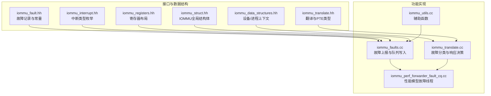
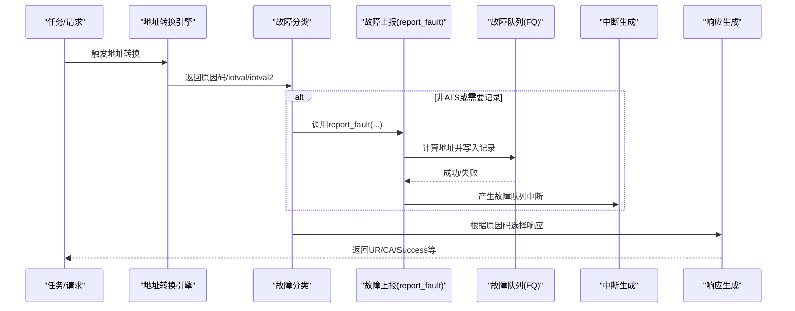
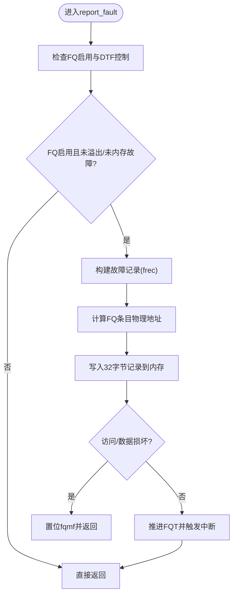
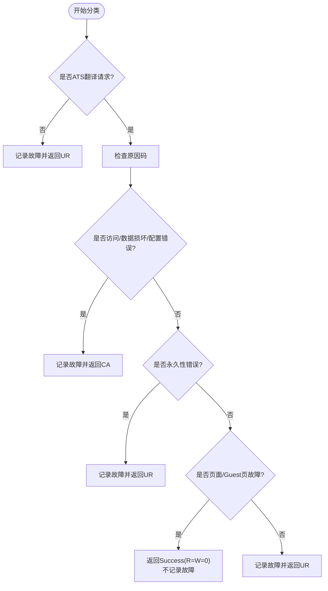
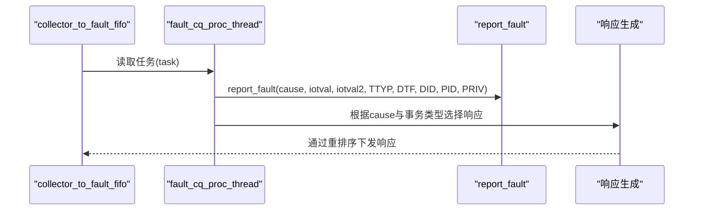
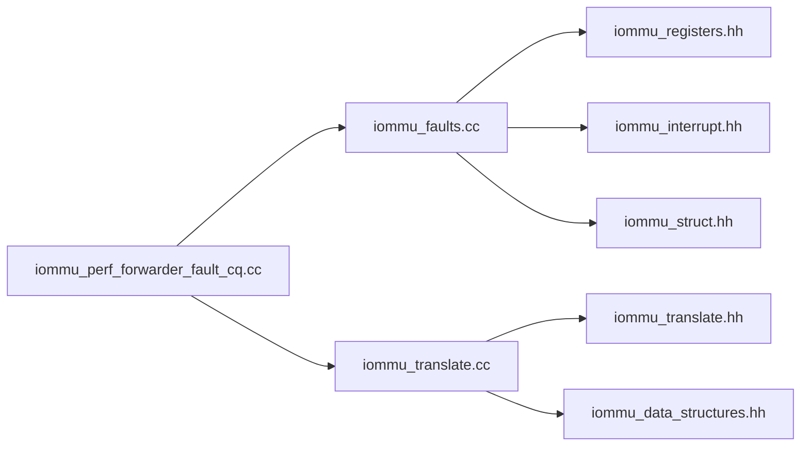

# 故障处理系统

<cite>
**本文引用的文件**
- [iommu_fault.hh](file://iommu/include/iommu_fault.hh)
- [iommu_faults.cc](file://iommu/iommu_fun_model/iommu_faults.cc)
- [iommu_interrupt.hh](file://iommu/include/iommu_interrupt.hh)
- [iommu_perf_forwarder_fault_cq.cc](file://iommu/iommu_perf_model/iommu_perf_forwarder_fault_cq.cc)
- [iommu_translate.hh](file://iommu/include/iommu_translate.hh)
- [iommu_translate.cc](file://iommu/iommu_fun_model/iommu_translate.cc)
- [iommu_registers.hh](file://iommu/include/iommu_registers.hh)
- [iommu_data_structures.hh](file://iommu/include/iommu_data_structures.hh)
- [iommu_struct.hh](file://iommu/include/iommu_struct.hh)
- [iommu_utils.cc](file://iommu/iommu_fun_model/iommu_utils.cc)
- [README.md](file://README.md)
</cite>

## 目录
1. [简介](#简介)
2. [项目结构](#项目结构)
3. [核心组件](#核心组件)
4. [架构总览](#架构总览)
5. [详细组件分析](#详细组件分析)
6. [依赖关系分析](#依赖关系分析)
7. [性能考量](#性能考量)
8. [故障排查指南](#故障排查指南)
9. [结论](#结论)
10. [附录](#附录)

## 简介
本文件面向IOMMU故障处理系统，围绕故障检测、分类、报告与记录、队列管理以及处理策略展开，结合代码级实现细节，给出系统性技术说明与工程实践建议。内容覆盖：
- 故障类型识别与分类（页面故障、访问故障、权限故障、Guest页故障等）
- 故障报告与记录机制（故障队列、寄存器状态、内存写入流程）
- 处理策略（立即响应、延迟处理、恢复机制）
- 性能模型中的故障处理流水线
- 诊断与调试方法及工具使用

## 项目结构
IOMMU故障处理系统位于iommu子模块中，主要涉及以下层次：
- 接口与数据结构层：定义故障记录格式、寄存器布局、中断类型等
- 功能实现层：故障上报、地址转换与故障分类、性能模型线程
- 顶层集成：SystemC模型中的线程协作与任务调度

**图表来源**
- [iommu_fault.hh:63-77](file://iommu/include/iommu_fault.hh#L63-L77)
- [iommu_interrupt.hh:16-23](file://iommu/include/iommu_interrupt.hh#L16-L23)
- [iommu_translate.hh:23-92](file://iommu/include/iommu_translate.hh#L23-L92)
- [iommu_registers.hh:374-415](file://iommu/include/iommu_registers.hh#L374-L415)
- [iommu_data_structures.hh:324-335](file://iommu/include/iommu_data_structures.hh#L324-L335)
- [iommu_struct.hh:42-99](file://iommu/include/iommu_struct.hh#L42-L99)
- [iommu_faults.cc:8-159](file://iommu/iommu_fun_model/iommu_faults.cc#L8-L159)
- [iommu_translate.cc:654-732](file://iommu/iommu_fun_model/iommu_translate.cc#L654-L732)
- [iommu_perf_forwarder_fault_cq.cc:121-178](file://iommu/iommu_perf_model/iommu_perf_forwarder_fault_cq.cc#L121-L178)
- [iommu_utils.cc:7-17](file://iommu/iommu_fun_model/iommu_utils.cc#L7-L17)

**章节来源**
- [README.md:63-76](file://README.md#L63-L76)

## 核心组件
- 故障记录与类型
  - 故障记录为固定长度的四元组字段，包含原因码、设备ID、进程ID、事务类型、iotval/iotval2等
  - 原因码涵盖访问故障、数据损坏、Guest页故障等标准与自定义范围
- 故障上报与队列
  - 上报函数在满足启用条件、未溢出、未内存故障的前提下，将故障记录写入内存中的故障队列
  - 队列满或内存访问异常会设置对应标志位并触发中断
- 故障分类与响应
  - 在地址转换过程中根据原因码分类，决定是否记录故障以及返回何种响应（UR/CA/Success等）
- 中断与状态
  - 不同单元（命令队列、故障队列、HPM、页面队列）通过中断向量区分
  - 寄存器提供队列启用、溢出、内存故障、挂起等状态

**章节来源**
- [iommu_fault.hh:52-88](file://iommu/include/iommu_fault.hh#L52-L88)
- [iommu_faults.cc:8-159](file://iommu/iommu_fun_model/iommu_faults.cc#L8-L159)
- [iommu_translate.cc:654-732](file://iommu/iommu_fun_model/iommu_translate.cc#L654-L732)
- [iommu_interrupt.hh:16-23](file://iommu/include/iommu_interrupt.hh#L16-L23)
- [iommu_registers.hh:374-415](file://iommu/include/iommu_registers.hh#L374-L415)

## 架构总览
IOMMU故障处理贯穿“地址转换—故障分类—故障上报—响应生成—中断通知”的链路。在性能模型中，故障处理与转发线程协同工作，确保故障路径与正常路径共享重排序资源。

**图表来源**
- [iommu_translate.cc:654-732](file://iommu/iommu_fun_model/iommu_translate.cc#L654-L732)
- [iommu_faults.cc:8-159](file://iommu/iommu_fun_model/iommu_faults.cc#L8-L159)
- [iommu_perf_forwarder_fault_cq.cc:121-178](file://iommu/iommu_perf_model/iommu_perf_forwarder_fault_cq.cc#L121-L178)

## 详细组件分析

### 组件A：故障记录与上报（report_fault）
- 功能要点
  - 检查故障队列启用与内存可用性，避免溢出与内存故障
  - 根据DTF控制位过滤部分翻译过程中的故障
  - 将故障记录写入FQB基址加索引计算的内存位置
  - 更新FQT并触发中断
- 关键字段与约束
  - 设备ID、进程ID、特权级别、事务类型、iotval/iotval2
  - 队列大小由FQB的log2szm1决定，满/空判定基于环形缓冲索引掩码
- 错误处理
  - 内存访问失败或越界导致的访问故障/数据损坏，置位fqmf并停止后续记录
  - 队列满置位fqof并触发中断

**图表来源**
- [iommu_faults.cc:8-159](file://iommu/iommu_fun_model/iommu_faults.cc#L8-L159)
- [iommu_registers.hh:374-415](file://iommu/include/iommu_registers.hh#L374-L415)

**章节来源**
- [iommu_faults.cc:8-159](file://iommu/iommu_fun_model/iommu_faults.cc#L8-L159)
- [iommu_fault.hh:63-77](file://iommu/include/iommu_fault.hh#L63-L77)
- [iommu_registers.hh:374-415](file://iommu/include/iommu_registers.hh#L374-L415)

### 组件B：故障分类与响应（地址转换阶段）
- 分类规则
  - ATS翻译请求：对特定原因码返回Completer Abort；对另一些返回Unsupported Request；对部分原因码不记录故障并返回Success（R=W=0）
  - 非ATS请求：统一记录故障并返回Unsupported Request
- 原因码分组
  - 访问/数据损坏类：返回CA
  - 配置错误类：返回CA
  - 页面故障类（含Guest页）：不记录故障，返回Success（R=W=0）
  - 其他永久性错误：返回UR

**图表来源**
- [iommu_translate.cc:654-732](file://iommu/iommu_fun_model/iommu_translate.cc#L654-L732)

**章节来源**
- [iommu_translate.cc:654-732](file://iommu/iommu_fun_model/iommu_translate.cc#L654-L732)

### 组件C：性能模型中的故障处理线程
- 线程职责
  - 从收集器读取任务，调用report_fault记录故障
  - 根据原因码与事务类型决定响应（UR/CA/Success）
  - 统一通过重排序机制下发响应
- 与真实硬件的对应
  - 对应硬件中的“故障记录+命令队列处理”阶段
  - 内存写入路径经由引用API路由到DDR/控制器

**图表来源**
- [iommu_perf_forwarder_fault_cq.cc:121-178](file://iommu/iommu_perf_model/iommu_perf_forwarder_fault_cq.cc#L121-L178)

**章节来源**
- [iommu_perf_forwarder_fault_cq.cc:121-178](file://iommu/iommu_perf_model/iommu_perf_forwarder_fault_cq.cc#L121-L178)

### 组件D：中断与状态寄存器
- 中断类型
  - 命令队列、故障队列、HPM、页面队列等
- 故障队列状态
  - fqen/fqon/fqmf/fqof等位用于控制与状态反馈
  - fip用于指示新故障或FQ变化导致的中断挂起
- 队列寄存器
  - FQB/FQH/FQT分别承载基址、软件读取头、硬件写入尾

**章节来源**
- [iommu_interrupt.hh:16-23](file://iommu/include/iommu_interrupt.hh#L16-L23)
- [iommu_registers.hh:374-415](file://iommu/include/iommu_registers.hh#L374-L415)
- [iommu_registers.hh:550-564](file://iommu/include/iommu_registers.hh#L550-L564)

## 依赖关系分析
- 数据结构与接口
  - 故障记录结构依赖于寄存器布局与端序定义
  - 地址转换模块提供PTE类型与权限位，影响故障分类
- 实现耦合
  - report_fault依赖寄存器文件、内存写入接口、中断生成接口
  - 故障分类依赖地址转换结果与事务类型
- 性能模型
  - 故障线程与转发线程共享重排序缓冲，保证写保序、读乱序

**图表来源**
- [iommu_faults.cc:8-159](file://iommu/iommu_fun_model/iommu_faults.cc#L8-L159)
- [iommu_registers.hh:374-415](file://iommu/include/iommu_registers.hh#L374-L415)
- [iommu_interrupt.hh:23-25](file://iommu/include/iommu_interrupt.hh#L23-L25)
- [iommu_struct.hh:42-99](file://iommu/include/iommu_struct.hh#L42-L99)
- [iommu_translate.cc:654-732](file://iommu/iommu_fun_model/iommu_translate.cc#L654-L732)
- [iommu_translate.hh:23-92](file://iommu/include/iommu_translate.hh#L23-L92)
- [iommu_data_structures.hh:324-335](file://iommu/include/iommu_data_structures.hh#L324-L335)
- [iommu_perf_forwarder_fault_cq.cc:121-178](file://iommu/iommu_perf_model/iommu_perf_forwarder_fault_cq.cc#L121-L178)

**章节来源**
- [iommu_faults.cc:8-159](file://iommu/iommu_fun_model/iommu_faults.cc#L8-L159)
- [iommu_translate.cc:654-732](file://iommu/iommu_fun_model/iommu_translate.cc#L654-L732)
- [iommu_perf_forwarder_fault_cq.cc:121-178](file://iommu/iommu_perf_model/iommu_perf_forwarder_fault_cq.cc#L121-L178)

## 性能考量
- 队列容量与对齐
  - 队列容量由FQB的log2szm1决定，基址与容量对齐要求影响内存布局
- 写入路径
  - 性能模型中内存写入通过控制路径转发，注意与重排序缓冲的交互
- 中断开销
  - 频繁溢出/内存故障会频繁触发中断，需评估系统中断负载
- 并发与保序
  - 故障路径与正常路径共享重排序，有助于维持一致性但可能带来额外排队延迟

## 故障排查指南
- 快速定位
  - 检查FQCSR寄存器：fqof/fqmf位指示溢出/内存故障；fqen/fqon确认队列启用状态
  - 检查FQB/FQH/FQT寄存器：确认队列基址、软件读取头、硬件写入尾
- 常见问题
  - 队列溢出：fqof置位，需提升队列容量或加快消费速度
  - 内存故障：fqmf置位，检查FQB基址对齐与可访问性
  - DTF导致的漏报：确认DTF位设置与期望的故障类型
- 调试工具
  - 使用GDB调试器配合项目提供的调试指南进行断点与变量检查
  - 性能模型线程打印可用于观察故障路径与响应生成

**章节来源**
- [iommu_registers.hh:374-415](file://iommu/include/iommu_registers.hh#L374-L415)
- [iommu_registers.hh:550-564](file://iommu/include/iommu_registers.hh#L550-L564)
- [README.md:77-86](file://README.md#L77-L86)

## 结论
该IOMMU故障处理系统通过标准化的故障记录格式、严格的队列管理与状态寄存器控制，实现了对多种故障类型的可靠检测与上报。在地址转换阶段进行细粒度分类，结合性能模型的线程化处理，既保证了功能正确性，也兼顾了系统吞吐。工程实践中应重点关注队列容量规划、内存访问可靠性与中断负载平衡，并利用调试工具与性能模型输出进行快速定位与优化。

## 附录
- 最佳实践
  - 合理配置FQB容量与对齐，避免溢出
  - 监控FQCSR状态，及时处理fqof/fqmf
  - 明确DTF用途，避免误屏蔽关键故障
  - 在性能模型中关注重排序缓冲与线程间交互
- 代码示例路径
  - 故障上报：[iommu_faults.cc:8-159](file://iommu/iommu_fun_model/iommu_faults.cc#L8-L159)
  - 故障分类：[iommu_translate.cc:654-732](file://iommu/iommu_fun_model/iommu_translate.cc#L654-L732)
  - 性能模型线程：[iommu_perf_forwarder_fault_cq.cc:121-178](file://iommu/iommu_perf_model/iommu_perf_forwarder_fault_cq.cc#L121-L178)