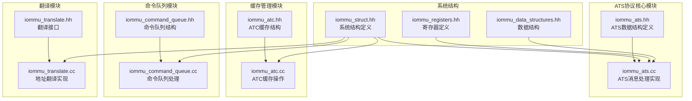
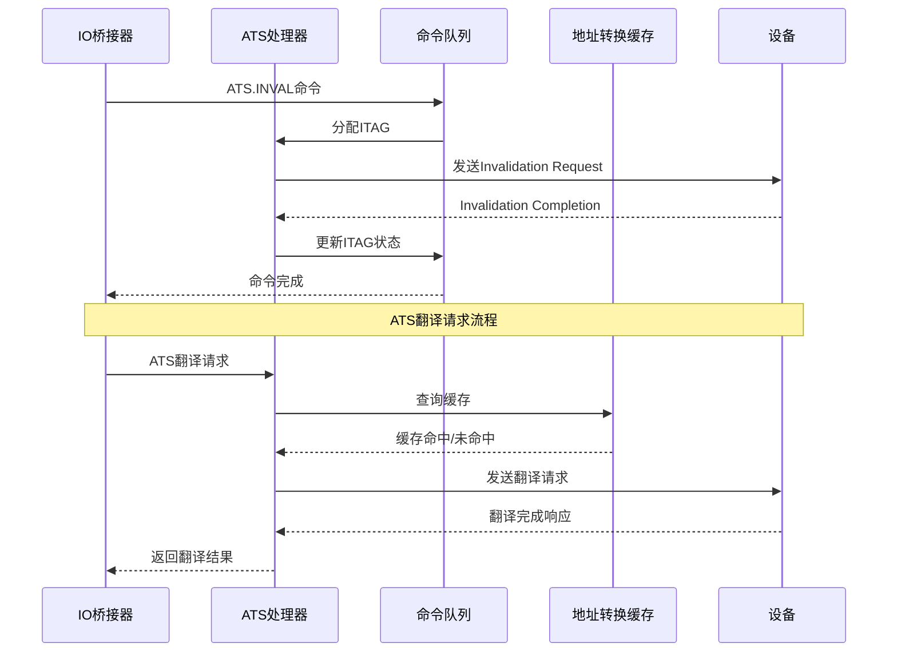
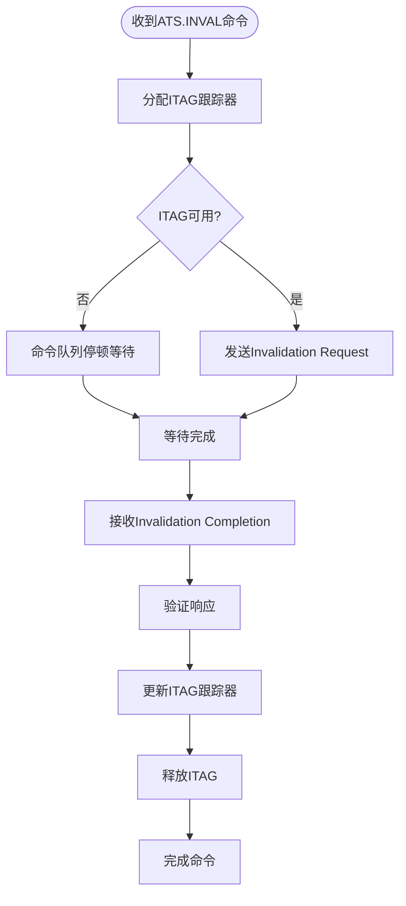
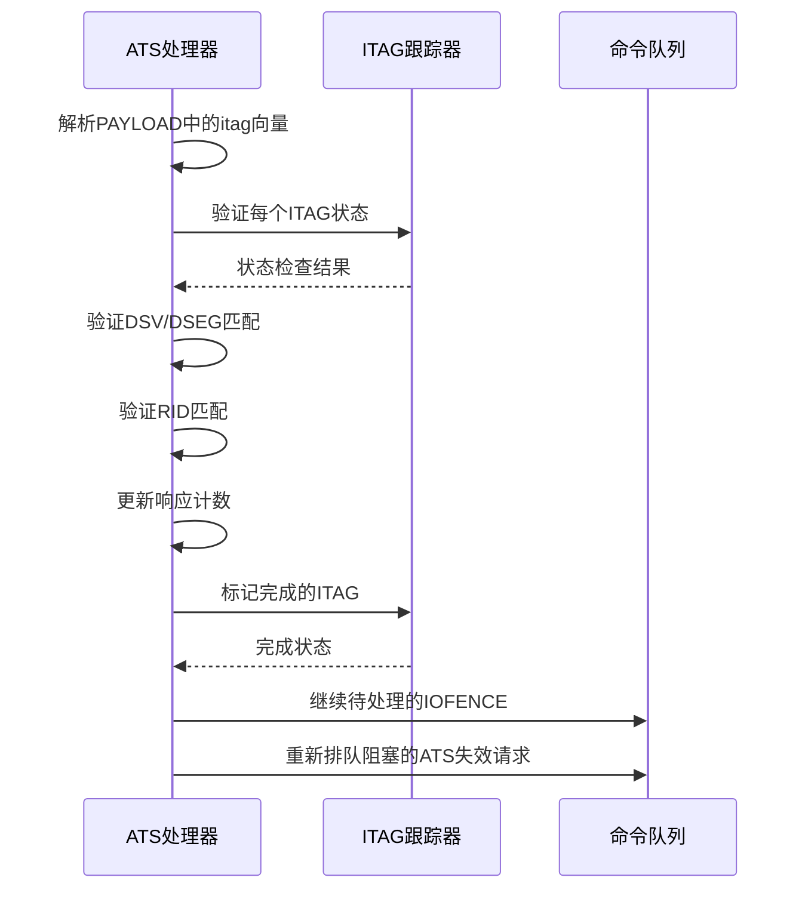
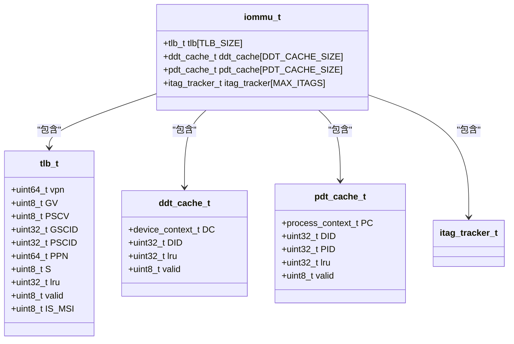
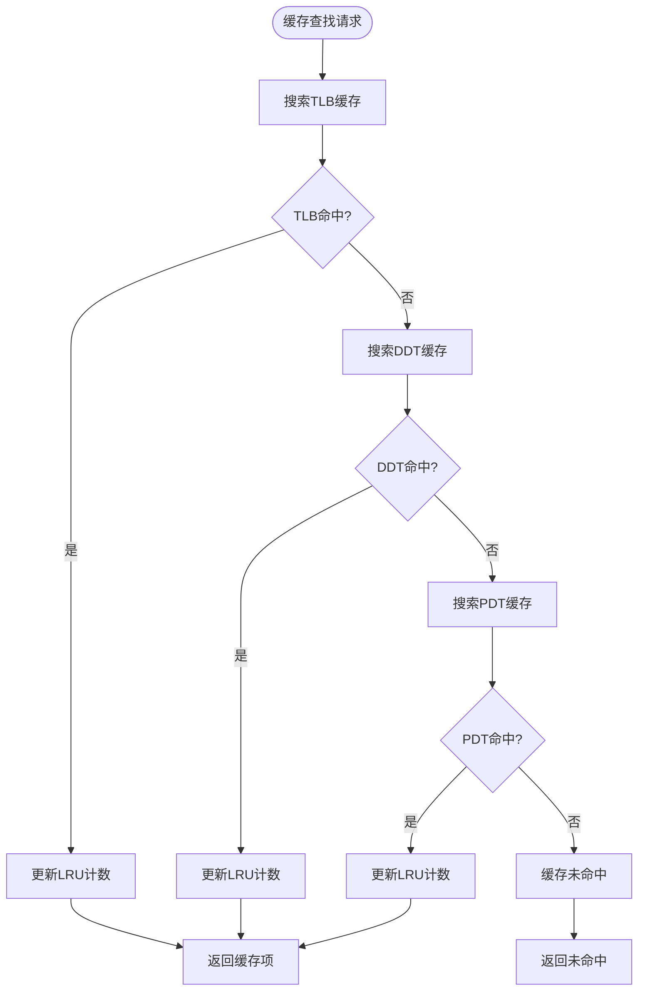
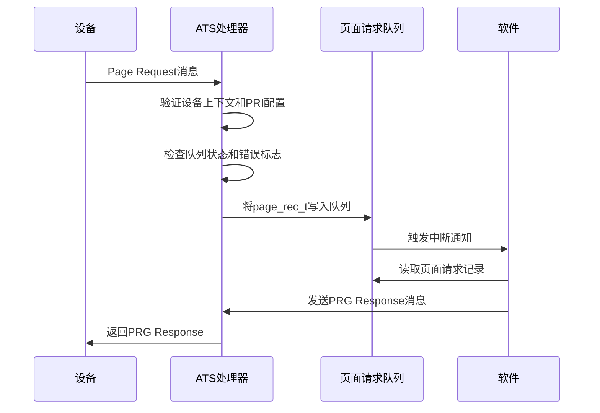
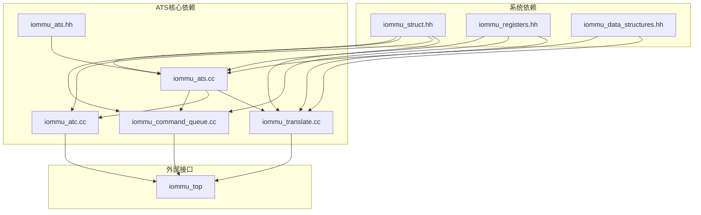

# ATS协议实现

<cite>
**本文档引用的文件**
- [iommu_ats.hh](file://iommu/iommu_ats.hh)
- [iommu_ats.cc](file://iommu/iommu_ats.cc)
- [iommu_atc.hh](file://iommu/iommu_atc.hh)
- [iommu_atc.cc](file://iommu/iommu_atc.cc)
- [iommu_command_queue.hh](file://iommu/iommu_command_queue.hh)
- [iommu_command_queue.cc](file://iommu/iommu_command_queue.cc)
- [iommu_translate.hh](file://iommu/iommu_translate.hh)
- [iommu_translate.cc](file://iommu/iommu_translate.cc)
- [iommu_struct.hh](file://iommu/iommu_struct.hh)
- [iommu_registers.hh](file://iommu/iommu_registers.hh)
- [iommu_data_structures.hh](file://iommu/iommu_data_structures.hh)
</cite>

## 目录
1. [简介](#简介)
2. [项目结构](#项目结构)
3. [核心组件](#核心组件)
4. [架构概览](#架构概览)
5. [详细组件分析](#详细组件分析)
6. [依赖关系分析](#依赖关系分析)
7. [性能考虑](#性能考虑)
8. [故障排除指南](#故障排除指南)
9. [结论](#结论)

## 简介

本文档详细介绍了IOMMU中ATS（Address Translation Services）协议的完整实现。ATS协议是PCIe规范中的关键功能，为设备提供地址转换服务和页面失效通知机制。该实现涵盖了ATS消息的数据结构定义、消息处理机制、设备地址转换缓存（ATC）管理以及完整的协议状态转换流程。

本实现支持PCIe ATS规范的所有核心功能，包括：
- ATS翻译请求消息的生成和处理
- ATS页面失效请求消息的发送和完成响应
- ATS页面请求接口（PRI）的消息队列管理
- 设备地址转换缓存的高效管理
- 多级地址转换的完整实现

## 项目结构

该项目采用模块化设计，将ATS协议实现分解为多个专门的功能模块：

**图表来源**
- [iommu_ats.hh:1-98](file://iommu/iommu_ats.hh#L1-L98)
- [iommu_atc.hh:1-98](file://iommu/iommu_atc.hh#L1-L98)
- [iommu_command_queue.hh:1-125](file://iommu/iommu_command_queue.hh#L1-L125)
- [iommu_translate.hh:1-132](file://iommu/iommu_translate.hh#L1-L132)

**章节来源**
- [iommu_ats.hh:1-98](file://iommu/iommu_ats.hh#L1-L98)
- [iommu_atc.hh:1-98](file://iommu/iommu_atc.hh#L1-L98)
- [iommu_command_queue.hh:1-125](file://iommu/iommu_command_queue.hh#L1-L125)
- [iommu_translate.hh:1-132](file://iommu/iommu_translate.hh#L1-L132)

## 核心组件

### ATS消息数据结构

ATS协议实现定义了三个核心数据结构：

#### page_rec_t 页记录格式
页记录结构用于PCIe ATS页面请求消息的队列存储，包含以下关键字段：
- **DID**: 设备标识符（24位）
- **PID**: 进程标识符（20位）
- **PV**: 进程有效标志（1位）
- **PRIV**: 特权模式请求（1位）
- **EXEC**: 执行权限请求（1位）
- **PAYLOAD**: 页面地址信息

#### ats_msg_t ATS消息结构
ATS消息结构定义了所有ATS协议消息的统一格式：
- **MSGCODE**: 消息类型代码
- **TAG**: 标记字段
- **RID**: 请求者标识符
- **PV/PID**: PASID信息
- **PRIV/EXEC_REQ**: 权限请求信息
- **DSV/DSEG**: 目标段信息
- **PAYLOAD**: 消息载荷

#### itag_tracker_t ITAG跟踪器
ITAG跟踪器管理ATS消息的生命周期：
- **busy**: 忙碌状态标志
- **DSV/DSEG/RID**: 目标设备信息
- **num_rsp_rcvd**: 已接收响应计数

**章节来源**
- [iommu_ats.hh:7-91](file://iommu/iommu_ats.hh#L7-L91)

### 命令队列结构

命令队列支持多种ATS相关命令：
- **IOTINVAL**: 地址范围失效命令
- **IOFENCE**: 内存栅栏命令
- **IODIR**: 目录表失效命令
- **ATS**: ATS消息命令

每种命令都有特定的操作码和功能编码。

**章节来源**
- [iommu_command_queue.hh:23-98](file://iommu/iommu_command_queue.hh#L23-L98)

## 架构概览

ATS协议实现采用分层架构设计，确保各组件间的清晰分离和高内聚性：

**图表来源**
- [iommu_command_queue.cc:214-246](file://iommu/iommu_command_queue.cc#L214-L246)
- [iommu_ats.cc:57-82](file://iommu/iommu_ats.cc#L57-L82)

**章节来源**
- [iommu_command_queue.cc:1-676](file://iommu/iommu_command_queue.cc#L1-L676)
- [iommu_ats.cc:1-374](file://iommu/iommu_ats.cc#L1-L374)

## 详细组件分析

### ATS消息处理机制

#### Invalidate Request消息处理

ATS失效请求消息的处理流程如下：

**图表来源**
- [iommu_command_queue.cc:214-246](file://iommu/iommu_command_queue.cc#L214-L246)
- [iommu_ats.cc:57-82](file://iommu/iommu_ats.cc#L57-L82)

#### Invalidate Completion消息响应流程

无效化完成消息的处理包含严格的验证逻辑：

**图表来源**
- [iommu_ats.cc:57-82](file://iommu/iommu_ats.cc#L57-L82)
- [iommu_command_queue.cc:641-675](file://iommu/iommu_command_queue.cc#L641-L675)

**章节来源**
- [iommu_ats.cc:34-94](file://iommu/iommu_ats.cc#L34-L94)
- [iommu_command_queue.cc:574-675](file://iommu/iommu_command_queue.cc#L574-L675)

### 设备地址转换缓存（ATC）管理

#### 缓存结构设计

ATC实现采用多级缓存架构，支持不同类型的缓存需求：

**图表来源**
- [iommu_atc.hh:9-51](file://iommu/iommu_atc.hh#L9-L51)
- [iommu_struct.hh:90-98](file://iommu/iommu_struct.hh#L90-L98)

#### 缓存查找算法

ATC使用LRU（最近最少使用）替换算法：

**图表来源**
- [iommu_atc.cc:149-232](file://iommu/iommu_atc.cc#L149-L232)

#### 缓存失效策略

缓存失效采用精确匹配和条件匹配相结合的策略：

**章节来源**
- [iommu_atc.cc:7-233](file://iommu/iommu_atc.cc#L7-L233)

### ATS页面请求接口（PRI）处理

#### 页面请求消息队列管理

PRI接口实现了完整的页面请求消息队列管理：

**图表来源**
- [iommu_ats.cc:96-373](file://iommu/iommu_ats.cc#L96-L373)

#### PRG响应消息生成

PRG响应消息根据不同的错误条件生成相应的状态码：

| 状态码 | 含义 | 生成条件 |
|--------|------|----------|
| 0x0 | 成功 | 所有页面成功驻留 |
| 0x1 | 无效请求 | 页面不存在或权限不足 |
| 0xF | 响应失败 | 接口灾难性错误 |

**章节来源**
- [iommu_ats.cc:96-373](file://iommu/iommu_ats.cc#L96-L373)

## 依赖关系分析

ATS协议实现的依赖关系体现了清晰的模块化设计：

**图表来源**
- [iommu_struct.hh:24-38](file://iommu/iommu_struct.hh#L24-L38)

**章节来源**
- [iommu_struct.hh:1-102](file://iommu/iommu_struct.hh#L1-L102)

## 性能考虑

### 缓存优化策略

1. **多级缓存架构**：实现TLB、DDT缓存和PDT缓存的分层设计
2. **LRU替换算法**：确保缓存空间的有效利用
3. **条件缓存**：仅在必要时缓存翻译结果，避免不必要的内存占用

### 命令队列优化

1. **异步处理**：命令队列处理与消息发送并行进行
2. **资源管理**：ITAG资源的动态分配和回收
3. **错误恢复**：超时检测和自动重试机制

### 内存访问优化

1. **队列对齐**：页面请求队列按4KB边界对齐
2. **批量操作**：支持地址范围失效的批量处理
3. **端序处理**：根据系统配置选择合适的字节序

## 故障排除指南

### 常见问题及解决方案

#### ATS消息处理问题

**问题1：ITAG资源不足**
- **症状**：ATS.INVAL命令被阻塞
- **原因**：所有ITAG跟踪器都在使用中
- **解决方案**：等待现有失效请求完成或增加ITAG数量

**问题2：Invalidation Completion验证失败**
- **症状**：返回Unexpected completion错误
- **原因**：响应消息与请求不匹配
- **解决方案**：检查DSV/DSEG/RID字段的一致性

#### 缓存相关问题

**问题3：ATC缓存命中率低**
- **症状**：频繁的页面表遍历
- **原因**：缓存大小不足或替换策略不当
- **解决方案**：调整缓存大小或优化访问模式

**问题4：PRI队列溢出**
- **症状**：页面请求被丢弃
- **原因**：软件处理速度跟不上硬件生成速度
- **解决方案**：优化软件队列处理逻辑或增加队列容量

**章节来源**
- [iommu_ats.cc:57-82](file://iommu/iommu_ats.cc#L57-L82)
- [iommu_command_queue.cc:574-675](file://iommu/iommu_command_queue.cc#L574-L675)

## 结论

ATS协议实现提供了完整的PCIe地址转换服务支持，具有以下特点：

1. **完整性**：实现了ATS规范的所有核心功能
2. **可靠性**：包含完善的错误检测和恢复机制
3. **性能**：通过多级缓存和优化算法确保高性能
4. **可扩展性**：模块化设计便于功能扩展和维护

该实现为系统提供了高效的地址转换服务，支持现代PCIe设备的复杂内存访问需求，同时保持了良好的性能和可靠性。