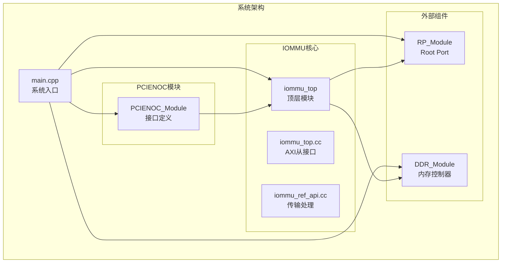
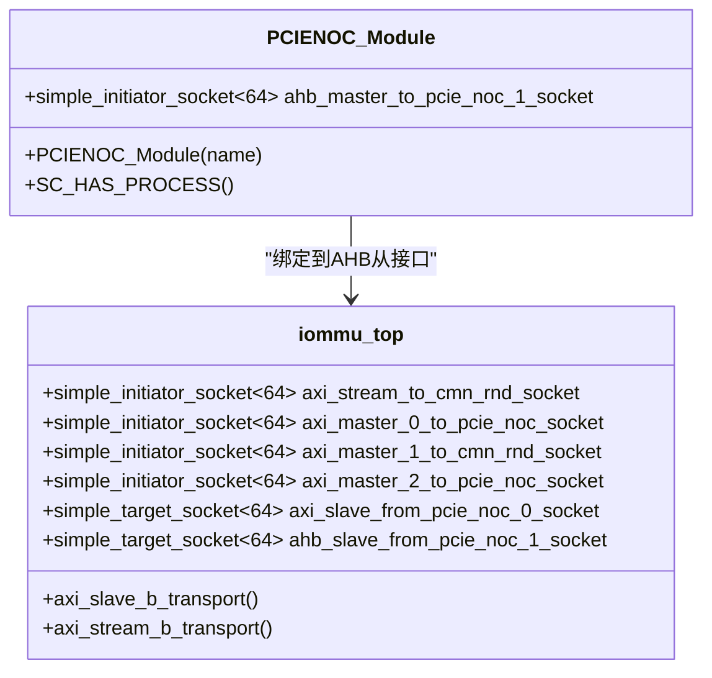
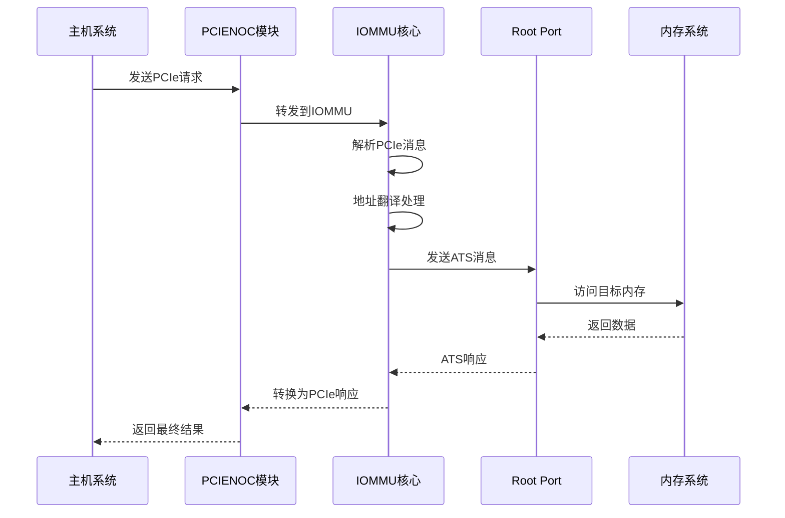
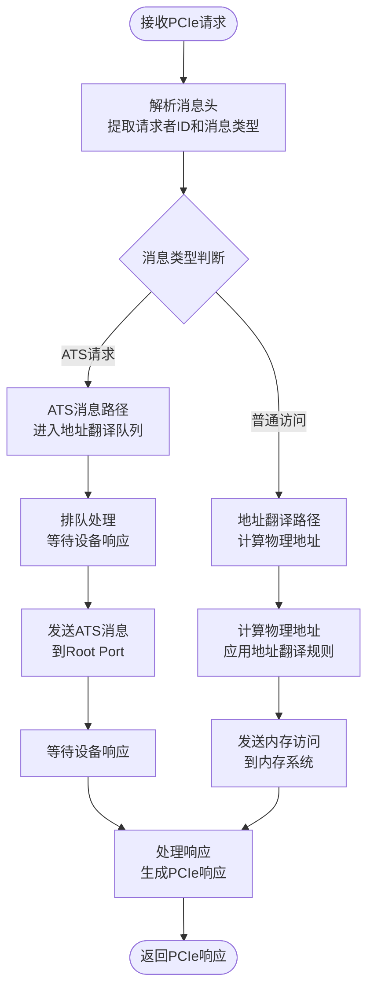
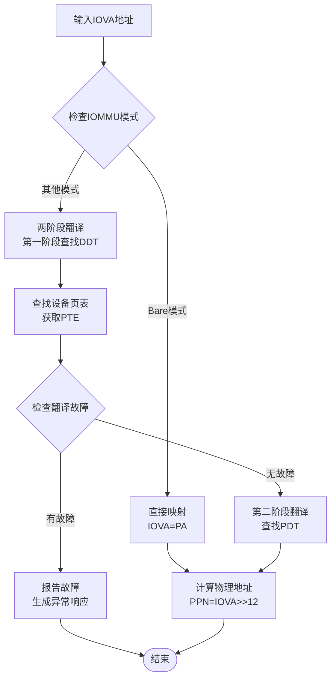
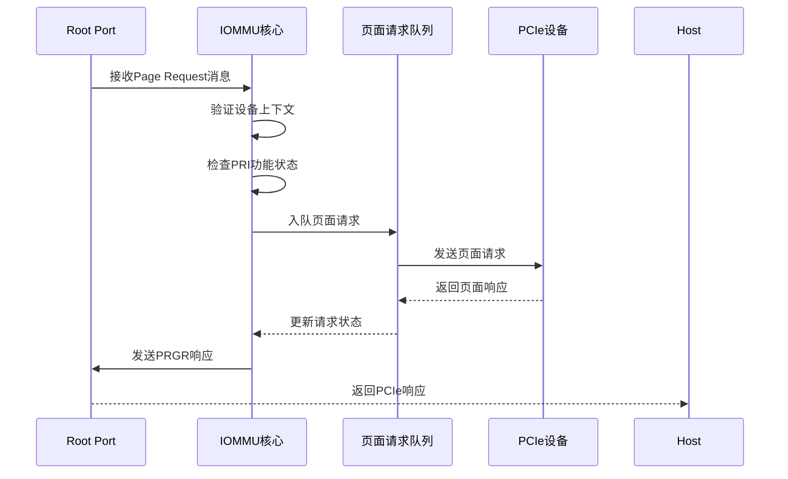
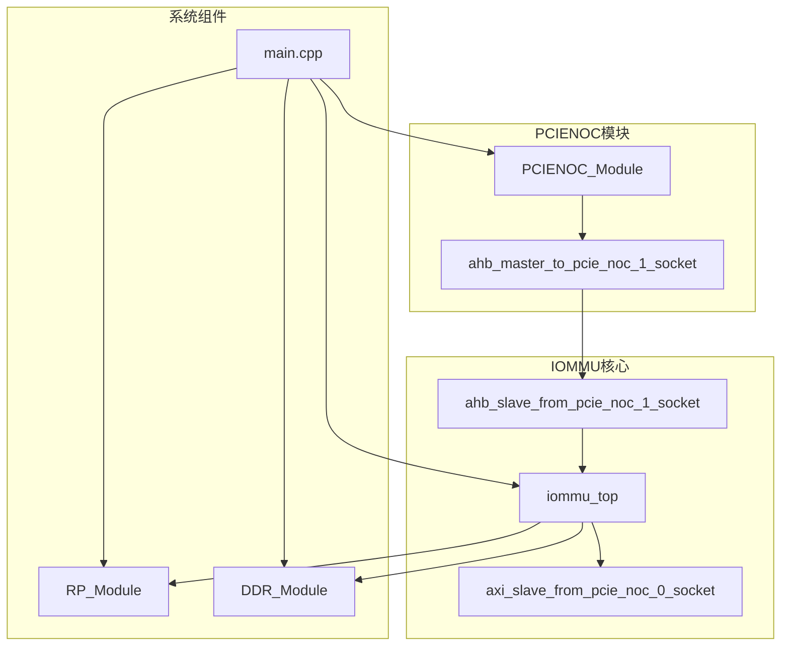

# PCIENOC接口模块

<cite>
**本文档引用的文件**
- [test_pcienoc.hh](file://pcienoc/test_pcienoc.hh)
- [test_pcienoc.cc](file://pcienoc/test_pcienoc.cc)
- [main.cpp](file://main.cpp)
- [iommu_top.hh](file://iommu/iommu_top.hh)
- [iommu_top.cc](file://iommu/iommu_top.cc)
- [param_trans_def.hh](file://iommu/param_trans_def.hh)
- [iommu_ref_api.cc](file://iommu/iommu_ref_api.cc)
- [iommu_ats.cc](file://iommu/iommu_ats.cc)
- [GDB_DEBUG_GUIDE.md](file://GDB_DEBUG_GUIDE.md)
</cite>

## 目录
1. [简介](#简介)
2. [项目结构](#项目结构)
3. [核心组件](#核心组件)
4. [架构概览](#架构概览)
5. [详细组件分析](#详细组件分析)
6. [依赖关系分析](#依赖关系分析)
7. [性能考虑](#性能考虑)
8. [故障排除指南](#故障排除指南)
9. [结论](#结论)

## 简介

PCIENOC（PCIe Network）接口模块是RISC-V IOMMU系统中的关键组件，负责在PCIe总线和网络交换机之间进行消息传递和协议转换。该模块实现了SystemC/TLM（Transaction Level Modeling）接口，为PCIe网络提供透明的地址翻译和消息路由服务。

在当前的代码库中，PCIENOC模块主要作为一个接口定义存在，其核心功能通过IOMMU模块的PCIe网络接口来实现。该模块支持64位总线宽度，采用TLM简单发起者套接字连接到PCIe网络。

## 项目结构

PCIENOC模块位于独立的目录中，与IOMMU核心功能分离，体现了模块化设计原则：



**图表来源**
- [main.cpp:38-87](file://main.cpp#L38-L87)
- [test_pcienoc.hh:10-19](file://pcienoc/test_pcienoc.hh#L10-L19)
- [iommu_top.hh:19-56](file://iommu/iommu_top.hh#L19-L56)

**章节来源**
- [main.cpp:38-87](file://main.cpp#L38-L87)
- [test_pcienoc.hh:1-21](file://pcienoc/test_pcienoc.hh#L1-L21)

## 核心组件

### PCIENOC_Module类

PCIENOC模块的核心是一个SystemC模块类，提供PCIe网络接口：



**图表来源**
- [test_pcienoc.hh:10-19](file://pcienoc/test_pcienoc.hh#L10-L19)
- [iommu_top.hh:22-28](file://iommu/iommu_top.hh#L22-L28)

### TLM传输定义

系统使用自定义的Payload扩展来携带PCIe消息元数据：

| 字段名称 | 位宽 | 描述 | 用途 |
|---------|------|------|-----|
| msg_type | 8位 | 消息类型标识 | 区分ATS请求和普通内存访问 |
| tag | 10位 | 请求标签 | 跟踪事务对应关系 |
| requester_id | 16位 | 请求者ID | PCIe设备标识符 |
| pid_valid | 1位 | PASID有效标志 | 指示进程ID有效性 |
| process_id | 28位 | 进程ID | ATS消息的PASID |
| exec_req | 1位 | 执行权限请求 | 决定页面属性 |
| priv_req | 1位 | 特权模式请求 | 控制访问权限 |

**章节来源**
- [test_pcienoc.hh:10-19](file://pcienoc/test_pcienoc.hh#L10-L19)
- [param_trans_def.hh:12-97](file://iommu/param_trans_def.hh#L12-L97)

## 架构概览

PCIENOC模块在整个系统架构中扮演着PCIe网络接口的角色：



**图表来源**
- [main.cpp:60-73](file://main.cpp#L60-L73)
- [iommu_top.cc:96-208](file://iommu/iommu_top.cc#L96-L208)

## 详细组件分析

### PCIe消息处理流程

PCIENOC模块接收来自主机系统的PCIe请求，并将其转换为IOMMU能够理解的消息格式：



**图表来源**
- [iommu_top.cc:96-208](file://iommu/iommu_top.cc#L96-L208)
- [iommu_ats.cc:162-373](file://iommu/iommu_ats.cc#L162-L373)

### 地址翻译机制

IOMMU模块实现了复杂的两级地址翻译机制：



**图表来源**
- [iommu_top.cc:176-199](file://iommu/iommu_top.cc#L176-L199)

### ATS消息处理

PCIe地址转换服务（ATS）消息的处理流程：



**图表来源**
- [iommu_ats.cc:162-373](file://iommu/iommu_ats.cc#L162-L373)
- [iommu_ref_api.cc:149-200](file://iommu/iommu_ref_api.cc#L149-L200)

**章节来源**
- [iommu_top.cc:96-208](file://iommu/iommu_top.cc#L96-L208)
- [iommu_ats.cc:162-373](file://iommu/iommu_ats.cc#L162-L373)
- [iommu_ref_api.cc:149-200](file://iommu/iommu_ref_api.cc#L149-L200)

## 依赖关系分析

PCIENOC模块与系统其他组件的依赖关系：



**图表来源**
- [main.cpp:57-73](file://main.cpp#L57-L73)
- [test_pcienoc.hh:13](file://pcienoc/test_pcienoc.hh#L13)
- [iommu_top.hh:27-28](file://iommu/iommu_top.hh#L27-L28)

**章节来源**
- [main.cpp:57-73](file://main.cpp#L57-L73)
- [test_pcienoc.hh:13](file://pcienoc/test_pcienoc.hh#L13)

## 性能考虑

### 带宽管理

PCIENOC模块支持64位总线宽度，能够提供高吞吐量的数据传输能力。系统通过以下机制优化带宽使用：

- **流水线处理**：多个事务可以并行处理，提高总线利用率
- **队列管理**：使用FIFO队列管理请求，避免阻塞
- **优先级调度**：根据事务类型和紧急程度进行调度

### 延迟优化

系统采用了多种技术来减少PCIe通信延迟：

- **零拷贝传输**：通过TLM接口实现数据的直接传输
- **硬件加速**：IOMMU硬件单元加速地址翻译过程
- **缓存优化**：利用TLB和ATC缓存减少重复翻译开销

### QoS支持

系统支持服务质量（QoS）机制：

- **RCID/MCID标记**：区分不同请求源的优先级
- **事件计数器**：监控系统性能指标
- **中断管理**：异步通知机制

## 故障排除指南

### 调试方法

使用GDB进行系统级调试：

```bash
# 编译调试版本
make clean
make DEBUG=1

# 启动GDB调试
gdb ./iommu_model
(gdb) break iommu_translate_iova
(gdb) break locate_device_context
(gdb) run
```

### 常见问题诊断

**地址翻译失败**
- 检查IOMMU模式配置
- 验证设备上下文设置
- 确认页表项有效性

**PCIe消息超时**
- 检查Root Port连接状态
- 验证设备响应时间
- 监控队列长度

**内存访问错误**
- 检查物理地址范围
- 验证内存权限设置
- 确认DMA操作完整性

### 性能监控指标

系统提供多种性能监控能力：

- **HPM计数器**：硬件性能监控计数器
- **事件过滤器**：选择性监控特定事件
- **中断向量**：性能事件中断通知
- **周期计数**：系统运行时间统计

**章节来源**
- [GDB_DEBUG_GUIDE.md:1-206](file://GDB_DEBUG_GUIDE.md#L1-L206)

## 结论

PCIENOC接口模块作为PCIe网络与IOMMU系统之间的桥梁，在整个RISC-V IOMMU架构中发挥着关键作用。虽然当前实现相对简洁，但通过SystemC/TLM框架提供了良好的可扩展性和模块化特性。

该模块的主要优势包括：
- **模块化设计**：清晰的接口定义便于集成和测试
- **高性能实现**：基于TLM的事务级建模提供高效仿真
- **灵活配置**：支持多种PCIe消息类型和地址翻译模式
- **完整调试支持**：提供全面的调试工具和性能监控

未来可以考虑的功能增强包括更丰富的PCIe协议支持、更精细的QoS控制以及更完善的错误恢复机制。