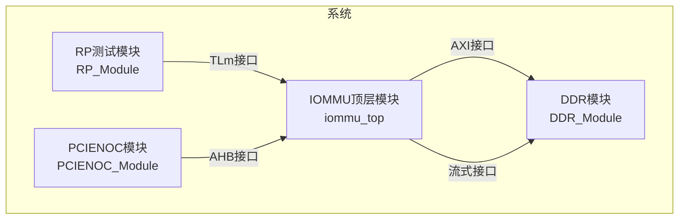
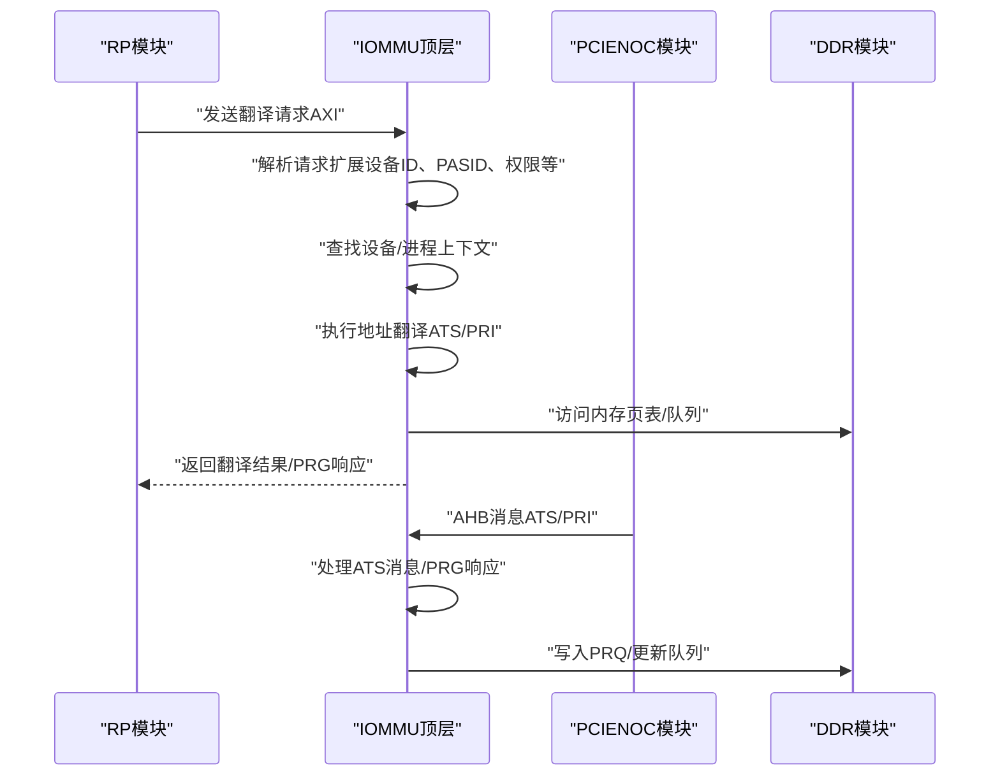
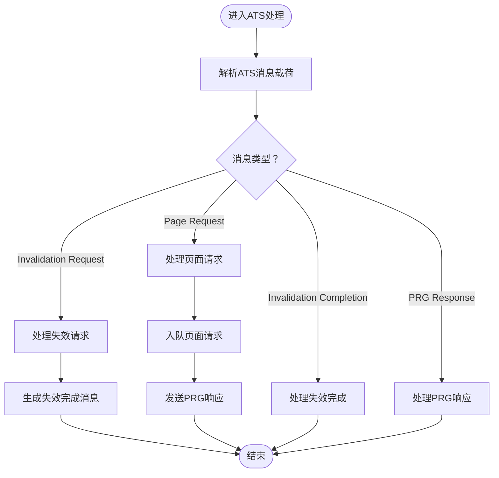
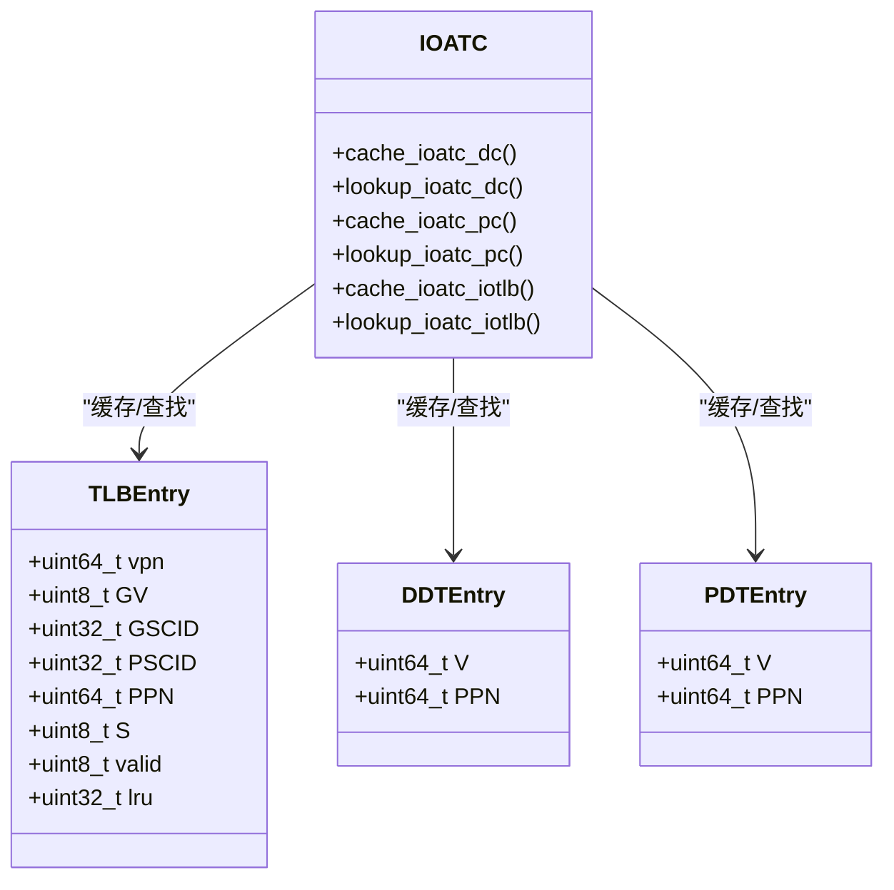
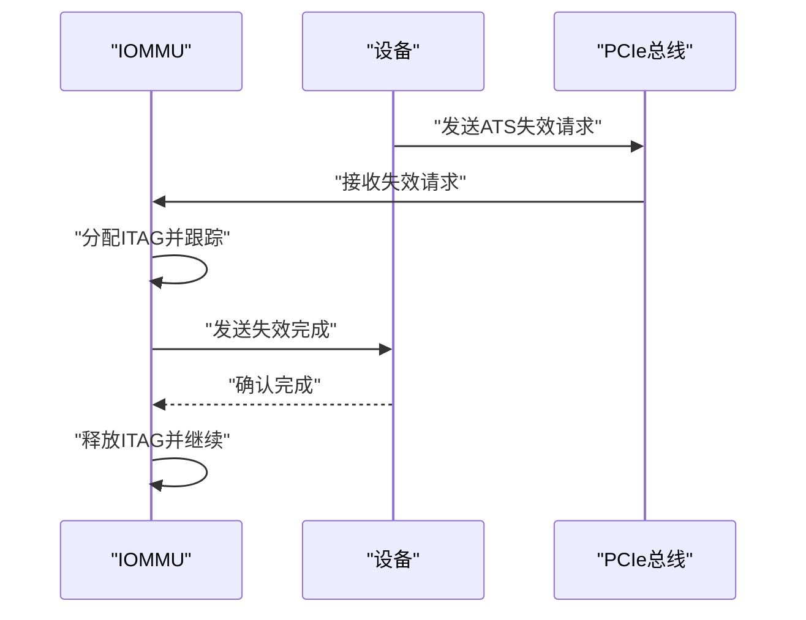
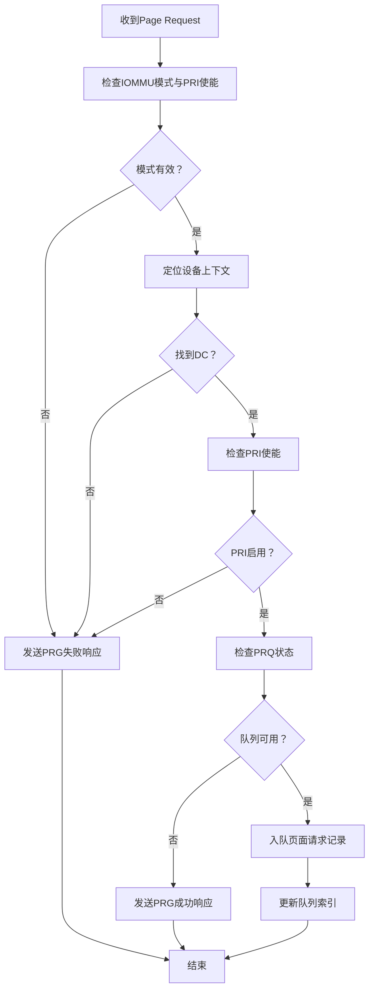
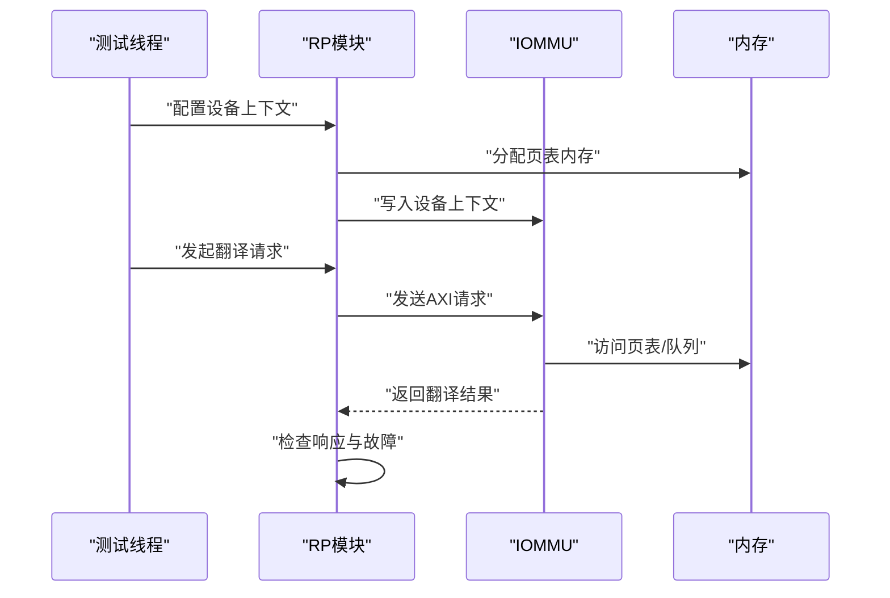
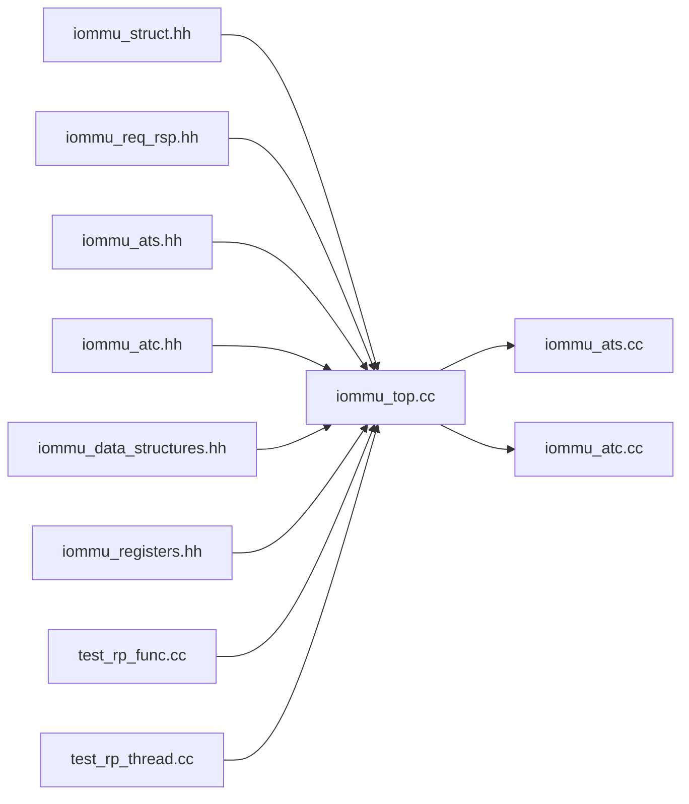

# PCIe协议支持

<cite>
**本文档引用的文件**
- [main.cpp](file://main.cpp)
- [iommu_top.cc](file://iommu/iommu_top.cc)
- [iommu_ats.cc](file://iommu/iommu_ats.cc)
- [iommu_atc.cc](file://iommu/iommu_atc.cc)
- [test_rp_func.cc](file://rp/test_rp_func.cc)
- [test_rp_thread.cc](file://rp/test_rp_thread.cc)
- [test_pcienoc.cc](file://pcienoc/test_pcienoc.cc)
- [iommu_struct.hh](file://iommu/iommu_struct.hh)
- [iommu_req_rsp.hh](file://iommu/iommu_req_rsp.hh)
- [iommu_ats.hh](file://iommu/iommu_ats.hh)
- [iommu_atc.hh](file://iommu/iommu_atc.hh)
- [iommu_data_structures.hh](file://iommu/iommu_data_structures.hh)
- [iommu_registers.hh](file://iommu/iommu_registers.hh)
- [test_rp.hh](file://rp/test_rp.hh)
- [test_pcienoc.hh](file://pcienoc/test_pcienoc.hh)
</cite>

## 目录
1. [引言](#引言)
2. [项目结构](#项目结构)
3. [核心组件](#核心组件)
4. [架构总览](#架构总览)
5. [详细组件分析](#详细组件分析)
6. [依赖关系分析](#依赖关系分析)
7. [性能考虑](#性能考虑)
8. [故障排查指南](#故障排查指南)
9. [结论](#结论)
10. [附录](#附录)

## 引言
本文件面向PCIe协议支持的综合技术文档，重点覆盖以下内容：
- ATS（Address Translation Services）协议实现：ATS消息处理机制、设备地址转换缓存管理、ATS消息生成流程
- PRI（Page Request Interface）协议支持：页面请求处理、页面请求队列管理、PRG响应机制
- PCIe根复合体（RP）模块功能：测试环境搭建、请求生成机制、响应验证逻辑
- PCIe网络接口模块（PCIENOC）作用与实现
- 协议交互示例、消息格式定义与状态转换图
- ATS/PRI协议的性能优化建议与常见问题解决方案

## 项目结构
该代码库采用SystemC建模，主要模块包括：
- IOMMU顶层模块：负责AXI/AHB接口、寄存器读写、ATS/PRI消息处理、地址翻译
- RP测试模块：构建测试环境、配置设备上下文、发起翻译请求、校验响应与故障
- PCIENOC模块：提供PCIe网络接口抽象
- DDR模块：提供内存存储与访问接口

**图表来源**
- [main.cpp:38-87](file://main.cpp#L38-L87)
- [iommu_top.cc:41-210](file://iommu/iommu_top.cc#L41-L210)
- [test_rp.hh:54-112](file://rp/test_rp.hh#L54-L112)
- [test_pcienoc.hh:10-21](file://pcienoc/test_pcienoc.hh#L10-L21)

**章节来源**
- [main.cpp:38-87](file://main.cpp#L38-L87)
- [iommu_top.cc:41-210](file://iommu/iommu_top.cc#L41-L210)
- [test_rp.hh:54-112](file://rp/test_rp.hh#L54-L112)
- [test_pcienoc.hh:10-21](file://pcienoc/test_pcienoc.hh#L10-L21)

## 核心组件
- IOMMU顶层模块（iommu_top）：实现AXI/AHB接口、寄存器读写、ATS消息处理、地址翻译与PRG响应生成
- ATS子系统（iommu_ats）：实现ATS消息解析、PRG响应生成、ITAG跟踪与失效完成处理
- ATC缓存（iommu_atc）：实现设备上下文缓存、进程上下文缓存、TLB缓存与查找
- RP测试模块（RP_Module）：提供设备上下文配置、页表建立、翻译请求发送与故障记录检查
- PCIENOC模块（PCIENOC_Module）：提供PCIe网络接口抽象，当前实现为空

**章节来源**
- [iommu_top.cc:6-36](file://iommu/iommu_top.cc#L6-L36)
- [iommu_ats.cc:96-374](file://iommu/iommu_ats.cc#L96-L374)
- [iommu_atc.cc:7-233](file://iommu/iommu_atc.cc#L7-L233)
- [test_rp_func.cc:28-78](file://rp/test_rp_func.cc#L28-L78)
- [test_rp_thread.cc:60-372](file://rp/test_rp_thread.cc#L60-L372)
- [test_pcienoc.cc:1-3](file://pcienoc/test_pcienoc.cc#L1-L3)

## 架构总览
IOMMU通过SystemC TLM接口与RP和PCIENOC模块交互，同时连接DDR模块进行内存访问。RP模块负责构造设备上下文与页表，发起翻译请求；PCIENOC提供AHB接口抽象；IOMMU完成ATS/PRI消息处理与地址翻译。

**图表来源**
- [iommu_top.cc:77-210](file://iommu/iommu_top.cc#L77-L210)
- [test_rp_func.cc:28-78](file://rp/test_rp_func.cc#L28-L78)
- [test_rp_thread.cc:115-372](file://rp/test_rp_thread.cc#L115-L372)

## 详细组件分析

### ATS消息处理机制
- ATS消息解析：从扩展载荷中提取MSGCODE、TAG、RID、PV、PID、PRIV、EXEC_REQ、DSV、DSEG、PAYLOAD
- ATS消息类型识别：区分Invalidation Request、Invalidation Completion、Page Request、PRG Response
- ATS消息生成：根据处理结果生成PRG Response消息，填充响应码、PRGI、RID等字段

**图表来源**
- [iommu_ats.cc:96-374](file://iommu/iommu_ats.cc#L96-L374)
- [iommu_ats.hh:47-58](file://iommu/iommu_ats.hh#L47-L58)

**章节来源**
- [iommu_ats.cc:96-374](file://iommu/iommu_ats.cc#L96-L374)
- [iommu_ats.hh:47-58](file://iommu/iommu_ats.hh#L47-L58)

### 设备地址转换缓存管理
- IOATC DC缓存：缓存设备上下文，支持LRU替换策略
- IOATC PC缓存：缓存进程上下文，支持LRU替换策略
- IOATC TLB缓存：缓存翻译结果，支持权限检查与LRU替换
- 缓存查找与填充：按VPN/GSCID/PSCID匹配，检查权限与访问属性

**图表来源**
- [iommu_atc.cc:7-233](file://iommu/iommu_atc.cc#L7-L233)
- [iommu_atc.hh:9-98](file://iommu/iommu_atc.hh#L9-L98)

**章节来源**
- [iommu_atc.cc:7-233](file://iommu/iommu_atc.cc#L7-L233)
- [iommu_atc.hh:9-98](file://iommu/iommu_atc.hh#L9-L98)

### ATS消息生成流程
- ITAG分配：为失效请求分配唯一ITAG，跟踪完成状态
- 失效请求处理：处理Invalidation Request消息，更新ITAG跟踪器
- 失效完成处理：处理Invalidation Completion消息，清理ITAG
- 超时处理：ITAG超时后自动释放，继续后续操作

**图表来源**
- [iommu_ats.cc:7-94](file://iommu/iommu_ats.cc#L7-L94)
- [iommu_ats.hh:85-91](file://iommu/iommu_ats.hh#L85-L91)

**章节来源**
- [iommu_ats.cc:7-94](file://iommu/iommu_ats.cc#L7-L94)
- [iommu_ats.hh:85-91](file://iommu/iommu_ats.hh#L85-L91)

### PRI（页面请求）协议支持
- 页面请求处理：解析Page Request消息，检查设备上下文与PRI使能状态
- 页面请求队列（PRQ）管理：入队页面请求记录，支持溢出与内存访问错误处理
- PRG响应机制：根据处理结果生成PRG响应，填充响应码与PASID要求

**图表来源**
- [iommu_ats.cc:96-374](file://iommu/iommu_ats.cc#L96-L374)
- [iommu_registers.hh:419-454](file://iommu/iommu_registers.hh#L419-L454)

**章节来源**
- [iommu_ats.cc:96-374](file://iommu/iommu_ats.cc#L96-L374)
- [iommu_registers.hh:419-454](file://iommu/iommu_registers.hh#L419-L454)

### PCIe根复合体（RP）模块功能
- 测试环境搭建：初始化IOMMU模式、分配内存、配置设备上下文与页表
- 请求生成机制：构造hb_to_iommu_req_t请求，设置设备ID、PASID、权限、地址类型等
- 响应验证逻辑：检查iommu_to_hb_rsp_t状态，读取故障队列并验证故障记录

**图表来源**
- [test_rp_func.cc:28-78](file://rp/test_rp_func.cc#L28-L78)
- [test_rp_thread.cc:115-372](file://rp/test_rp_thread.cc#L115-L372)

**章节来源**
- [test_rp_func.cc:28-78](file://rp/test_rp_func.cc#L28-L78)
- [test_rp_thread.cc:115-372](file://rp/test_rp_thread.cc#L115-L372)

### PCIe网络接口模块（PCIENOC）作用与实现
- 作用：提供PCIe网络接口抽象，当前实现为空，预留AHB接口
- 实现：定义AHB主接口socket，等待绑定至IOMMU的AHB从接口

**章节来源**
- [test_pcienoc.cc:1-3](file://pcienoc/test_pcienoc.cc#L1-L3)
- [test_pcienoc.hh:10-21](file://pcienoc/test_pcienoc.hh#L10-L21)

## 依赖关系分析
IOMMU模块依赖于多个子系统与数据结构：
- 结构定义：iommu_struct.hh、iommu_req_rsp.hh、iommu_ats.hh、iommu_atc.hh、iommu_data_structures.hh、iommu_registers.hh
- 功能实现：iommu_top.cc、iommu_ats.cc、iommu_atc.cc
- 测试验证：test_rp_func.cc、test_rp_thread.cc

**图表来源**
- [iommu_struct.hh:24-99](file://iommu/iommu_struct.hh#L24-L99)
- [iommu_top.cc:1-36](file://iommu/iommu_top.cc#L1-L36)
- [iommu_ats.cc:1-374](file://iommu/iommu_ats.cc#L1-L374)
- [iommu_atc.cc:1-233](file://iommu/iommu_atc.cc#L1-L233)
- [test_rp_func.cc:1-800](file://rp/test_rp_func.cc#L1-L800)
- [test_rp_thread.cc:1-372](file://rp/test_rp_thread.cc#L1-L372)

**章节来源**
- [iommu_struct.hh:24-99](file://iommu/iommu_struct.hh#L24-L99)
- [iommu_top.cc:1-36](file://iommu/iommu_top.cc#L1-L36)
- [iommu_ats.cc:1-374](file://iommu/iommu_ats.cc#L1-L374)
- [iommu_atc.cc:1-233](file://iommu/iommu_atc.cc#L1-L233)
- [test_rp_func.cc:1-800](file://rp/test_rp_func.cc#L1-L800)
- [test_rp_thread.cc:1-372](file://rp/test_rp_thread.cc#L1-L372)

## 性能考虑
- ATS/PRI消息处理优化
  - 使用ITAG跟踪器减少重复处理，避免队列拥塞
  - 合理配置PRQ大小，平衡内存占用与吞吐
  - 优先处理高优先级设备的页面请求
- 缓存优化
  - IOATC DC/PC/TLB采用LRU策略，合理设置缓存大小
  - 在高频访问场景下，预热关键设备上下文
- 地址翻译优化
  - 利用TLB缓存减少页表遍历开销
  - 对于大页（2MB）与小页（4KB）混合场景，优化页大小选择
- 并发与中断
  - 合理配置命令队列与故障队列，避免阻塞
  - 使用中断聚合减少中断处理开销

## 故障排查指南
- ATS相关故障
  - 检查ATS消息类型与参数是否正确
  - 确认ITAG分配与释放逻辑，避免资源泄漏
  - 关注失效完成超时与队列溢出情况
- PRI相关故障
  - 检查PRQ启用状态与内存访问权限
  - 验证设备上下文中的PRI使能位
  - 关注PRQ溢出与内存访问错误标志
- 翻译相关故障
  - 检查设备上下文与进程上下文配置
  - 验证页表项有效性与权限位设置
  - 使用故障队列记录与分析故障原因

**章节来源**
- [iommu_ats.cc:26-94](file://iommu/iommu_ats.cc#L26-L94)
- [iommu_ats.cc:204-298](file://iommu/iommu_ats.cc#L204-L298)
- [test_rp_func.cc:81-121](file://rp/test_rp_func.cc#L81-L121)
- [test_rp_func.cc:123-168](file://rp/test_rp_func.cc#L123-L168)

## 结论
本项目实现了PCIe ATS/PRI协议的关键功能，包括ATS消息处理、设备地址转换缓存管理、PRI页面请求队列与PRG响应机制。RP模块提供了完善的测试环境与验证逻辑，PCIENOC模块预留了PCIe网络接口抽象。通过合理的缓存策略、队列配置与中断处理，系统能够在保证正确性的同时获得良好的性能表现。

## 附录
- 协议交互示例
  - ATS失效请求与完成：设备发送失效请求，IOMMU分配ITAG并跟踪，最终发送完成消息
  - PRI页面请求：设备发送Page Request，IOMMU检查上下文与队列状态，必要时生成PRG响应
- 消息格式定义
  - ATS消息结构：包含MSGCODE、TAG、RID、PV、PID、PRIV、EXEC_REQ、DSV、DSEG、PAYLOAD
  - PRQ记录结构：包含DID、PID、PV、PRIV、EXEC、PAYLOAD等字段
- 状态转换图
  - ATS消息处理状态机：解析→类型识别→处理→生成响应→结束
  - PRQ处理状态机：接收→检查→入队→更新索引→发送PRG→结束