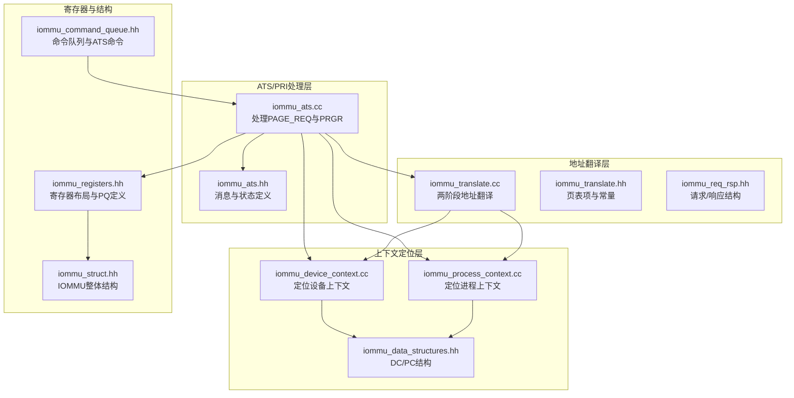
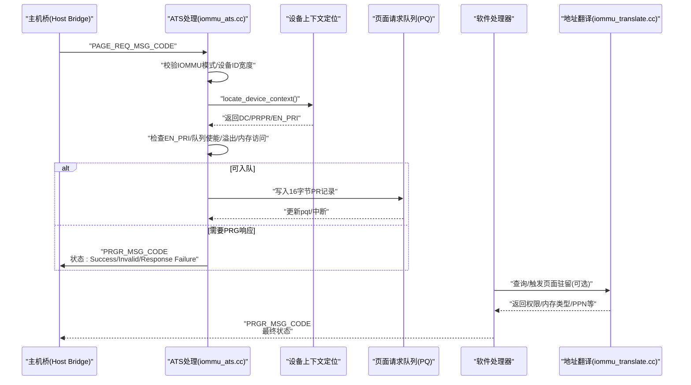
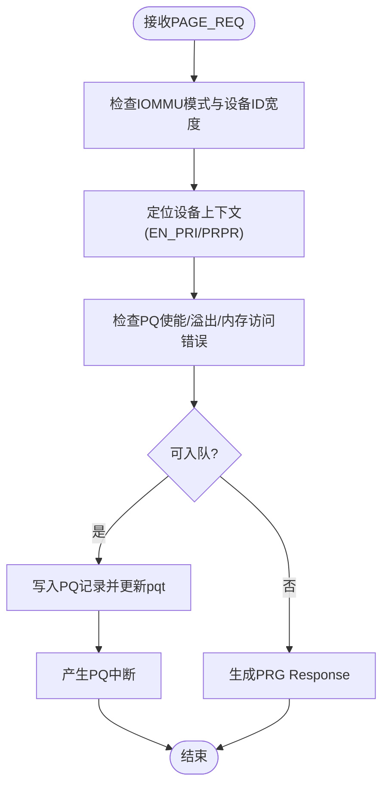
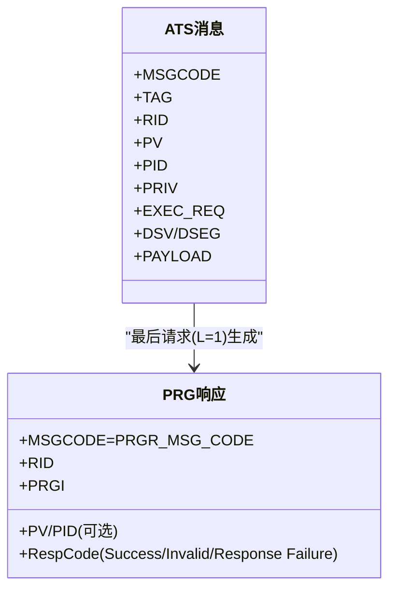
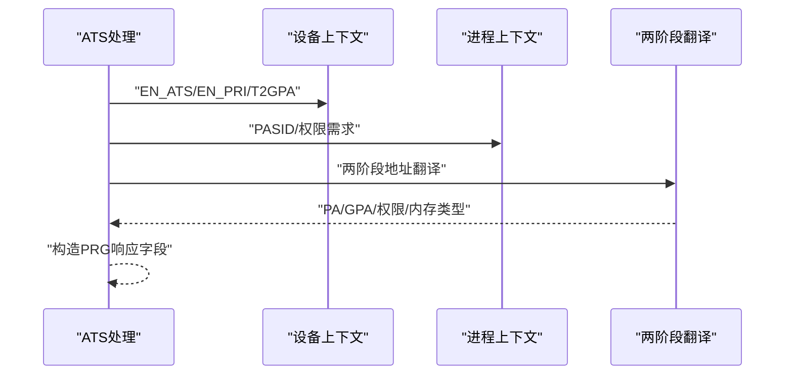
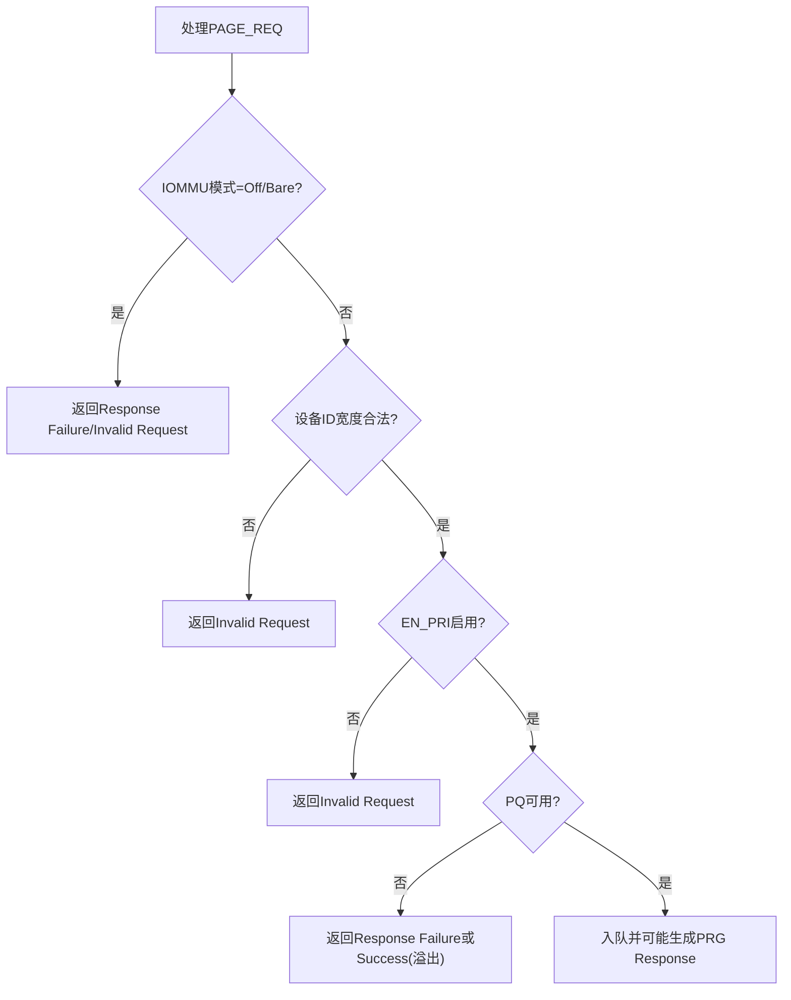
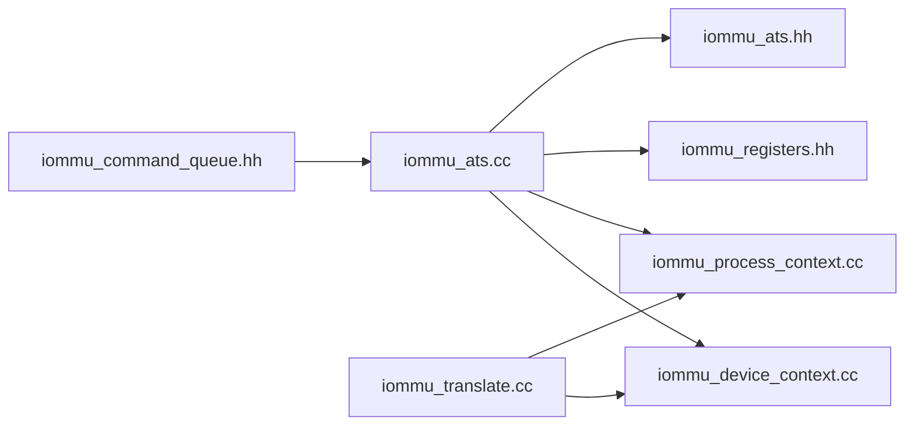

# PRI协议支持

<cite>
**本文档引用的文件**
- [iommu_req_rsp.hh](file://iommu/iommu_req_rsp.hh)
- [iommu_translate.hh](file://iommu/iommu_translate.hh)
- [iommu_translate.cc](file://iommu/iommu_translate.cc)
- [iommu_process_context.cc](file://iommu/iommu_process_context.cc)
- [iommu_device_context.cc](file://iommu/iommu_device_context.cc)
- [iommu_ats.hh](file://iommu/iommu_ats.hh)
- [iommu_ats.cc](file://iommu/iommu_ats.cc)
- [iommu_command_queue.hh](file://iommu/iommu_command_queue.hh)
- [iommu_data_structures.hh](file://iommu/iommu_data_structures.hh)
- [iommu_registers.hh](file://iommu/iommu_registers.hh)
- [iommu_struct.hh](file://iommu/iommu_struct.hh)
</cite>

## 目录
1. [简介](#简介)
2. [项目结构](#项目结构)
3. [核心组件](#核心组件)
4. [架构总览](#架构总览)
5. [详细组件分析](#详细组件分析)
6. [依赖关系分析](#依赖关系分析)
7. [性能考虑](#性能考虑)
8. [故障排查指南](#故障排查指南)
9. [结论](#结论)

## 简介
本文件系统性阐述PRI（Page Request Interface，页面请求接口）在IOMMU中的实现与使用，重点覆盖以下内容：
- 页面请求消息（PAGE_REQ_MSG_CODE）的接收、解析与响应生成流程
- 页面请求组（PRG）的管理：队列组织、请求分组策略与PRG响应机制
- PRG响应消息（PRGR_MSG_CODE）的状态编码：success、invalid request、response failure等含义及处理逻辑
- PRI协议的错误处理机制与性能优化建议
- 完整的页面请求处理流程图，涵盖请求接收、页面查找、内存访问与响应发送各阶段

## 项目结构
该IOMMU实现采用模块化设计，PRI相关功能主要分布在ATS/PRI处理模块、地址翻译模块、设备/进程上下文定位模块以及寄存器与数据结构定义模块中。

**图表来源**
- [iommu_ats.cc:96-373](file://iommu/iommu_ats.cc#L96-L373)
- [iommu_translate.cc:8-731](file://iommu/iommu_translate.cc#L8-L731)
- [iommu_device_context.cc:9-418](file://iommu/iommu_device_context.cc#L9-L418)
- [iommu_process_context.cc:11-235](file://iommu/iommu_process_context.cc#L11-L235)
- [iommu_registers.hh:416-454](file://iommu/iommu_registers.hh#L416-L454)
- [iommu_ats.hh:41-98](file://iommu/iommu_ats.hh#L41-L98)
- [iommu_command_queue.hh:19-124](file://iommu/iommu_command_queue.hh#L19-L124)
- [iommu_data_structures.hh:29-335](file://iommu/iommu_data_structures.hh#L29-L335)
- [iommu_struct.hh:42-102](file://iommu/iommu_struct.hh#L42-L102)

**章节来源**
- [iommu_ats.cc:96-373](file://iommu/iommu_ats.cc#L96-L373)
- [iommu_translate.cc:8-731](file://iommu/iommu_translate.cc#L8-L731)
- [iommu_device_context.cc:9-418](file://iommu/iommu_device_context.cc#L9-L418)
- [iommu_process_context.cc:11-235](file://iommu/iommu_process_context.cc#L11-L235)
- [iommu_registers.hh:416-454](file://iommu/iommu_registers.hh#L416-L454)
- [iommu_ats.hh:41-98](file://iommu/iommu_ats.hh#L41-L98)
- [iommu_command_queue.hh:19-124](file://iommu/iommu_command_queue.hh#L19-L124)
- [iommu_data_structures.hh:29-335](file://iommu/iommu_data_structures.hh#L29-L335)
- [iommu_struct.hh:42-102](file://iommu/iommu_struct.hh#L42-L102)

## 核心组件
- 页面请求处理（ATS/PRI）
  - 接收PCIe Page Request消息，校验IOMMU模式与DC配置，入队到PQ，必要时生成PRG Response
  - 关键入口：handle_page_request
  - 相关状态码：PRGR_SUCCESS、PRGR_INVALID_REQUEST、PRGR_RESPONSE_FAILURE
- 地址翻译
  - 两阶段地址翻译（S/VS → G），支持ATS翻译请求与MSI地址翻译
  - 支持IOATC缓存与TLB统计
- 设备/进程上下文
  - 定位DC/PC，执行PDT/GDT遍历，进行配置检查与缓存
- 寄存器与队列
  - PQ基址、头尾指针、CSR控制位；PQ满/溢出/内存访问错误的处理

**章节来源**
- [iommu_ats.cc:96-373](file://iommu/iommu_ats.cc#L96-L373)
- [iommu_translate.cc:8-731](file://iommu/iommu_translate.cc#L8-L731)
- [iommu_device_context.cc:9-418](file://iommu/iommu_device_context.cc#L9-L418)
- [iommu_process_context.cc:11-235](file://iommu/iommu_process_context.cc#L11-L235)
- [iommu_registers.hh:416-454](file://iommu/iommu_registers.hh#L416-L454)

## 架构总览
PRI处理路径从PCIe ATS消息进入，经由ATS处理模块完成设备上下文校验与队列入队，随后由软件或IOMMU根据策略生成PRG响应。地址翻译模块贯穿于请求处理与响应生成过程，确保权限与内存类型正确返回。

**图表来源**
- [iommu_ats.cc:96-373](file://iommu/iommu_ats.cc#L96-L373)
- [iommu_device_context.cc:9-418](file://iommu/iommu_device_context.cc#L9-L418)
- [iommu_registers.hh:416-454](file://iommu/iommu_registers.hh#L416-L454)
- [iommu_translate.cc:8-731](file://iommu/iommu_translate.cc#L8-L731)

## 详细组件分析

### 页面请求消息（PAGE_REQ_MSG_CODE）处理
- 入口函数：handle_page_request
- 主要步骤
  - 检查IOMMU模式（Off/Bare）、设备ID宽度与DC配置
  - 校验DC.tc.EN_PRI是否启用
  - 校验PQ使能、溢出标志、内存访问错误标志
  - 将Page Request记录写入PQ（16字节/条目），更新pqt并产生中断
  - 对需要响应的PRG（L=1且非Stop Marker）生成PRG Response，状态依据错误原因选择

**图表来源**
- [iommu_ats.cc:96-373](file://iommu/iommu_ats.cc#L96-L373)
- [iommu_registers.hh:416-454](file://iommu/iommu_registers.hh#L416-L454)

**章节来源**
- [iommu_ats.cc:96-373](file://iommu/iommu_ats.cc#L96-L373)
- [iommu_registers.hh:416-454](file://iommu/iommu_registers.hh#L416-L454)

### 页面请求组（PRG）管理与PRG响应
- PRG组织
  - 同一PRG内的多个Page Request共享PRGI字段标识
  - 最后一个需要响应的请求（L=1且非Stop Marker）触发PRG响应
- PRG响应状态编码
  - Success（0x0）：组内所有页面已成功驻留
  - Invalid Request（0x1）：存在不存在或权限不足的页面
  - Response Failure（0xF）：发生灾难性错误，禁用PRI
- PASID处理
  - PRPR位决定PRG响应是否携带PV/PID

**图表来源**
- [iommu_ats.hh:41-98](file://iommu/iommu_ats.hh#L41-L98)
- [iommu_ats.cc:300-373](file://iommu/iommu_ats.cc#L300-L373)

**章节来源**
- [iommu_ats.hh:60-98](file://iommu/iommu_ats.hh#L60-L98)
- [iommu_ats.cc:300-373](file://iommu/iommu_ats.cc#L300-L373)

### 地址翻译与权限计算（用于PRG响应）
- 两阶段地址翻译：S/VS → G，支持权限与内存类型（PBMT）合并
- ATS翻译响应字段（Priv/N/CXL_IO/AMA/Global/U/R/W/X）按请求与页表权限计算
- 支持Bare模式（IOVA=PA）与NAPOT格式返回

**图表来源**
- [iommu_translate.cc:8-731](file://iommu/iommu_translate.cc#L8-L731)
- [iommu_process_context.cc:11-235](file://iommu/iommu_process_context.cc#L11-L235)
- [iommu_device_context.cc:9-418](file://iommu/iommu_device_context.cc#L9-L418)

**章节来源**
- [iommu_translate.cc:8-731](file://iommu/iommu_translate.cc#L8-L731)
- [iommu_process_context.cc:11-235](file://iommu/iommu_process_context.cc#L11-L235)
- [iommu_device_context.cc:9-418](file://iommu/iommu_device_context.cc#L9-L418)

### 错误处理与状态映射
- IOMMU模式为Off或Bare时，直接返回Invalid Request或Response Failure
- 设备ID宽度超限、DC未找到、EN_PRI未启用、PQ未使能/溢出/内存访问错误均影响PRG响应
- ATS翻译请求在Off模式下返回Unsupported Request；其他模式下根据cause映射至UR/CA

**图表来源**
- [iommu_ats.cc:117-231](file://iommu/iommu_ats.cc#L117-L231)

**章节来源**
- [iommu_ats.cc:117-231](file://iommu/iommu_ats.cc#L117-L231)

## 依赖关系分析
- ATS处理模块依赖设备/进程上下文定位模块与寄存器定义
- 地址翻译模块依赖上下文定位与页表结构
- PRG响应生成依赖ATS消息结构与状态码定义
- 命令队列与ATS命令在统一的命令结构下协同

**图表来源**
- [iommu_ats.cc:96-373](file://iommu/iommu_ats.cc#L96-L373)
- [iommu_translate.cc:8-731](file://iommu/iommu_translate.cc#L8-L731)
- [iommu_device_context.cc:9-418](file://iommu/iommu_device_context.cc#L9-L418)
- [iommu_process_context.cc:11-235](file://iommu/iommu_process_context.cc#L11-L235)
- [iommu_command_queue.hh:19-124](file://iommu/iommu_command_queue.hh#L19-L124)
- [iommu_ats.hh:41-98](file://iommu/iommu_ats.hh#L41-L98)
- [iommu_registers.hh:416-454](file://iommu/iommu_registers.hh#L416-L454)

**章节来源**
- [iommu_ats.cc:96-373](file://iommu/iommu_ats.cc#L96-L373)
- [iommu_translate.cc:8-731](file://iommu/iommu_translate.cc#L8-L731)
- [iommu_device_context.cc:9-418](file://iommu/iommu_device_context.cc#L9-L418)
- [iommu_process_context.cc:11-235](file://iommu/iommu_process_context.cc#L11-L235)
- [iommu_command_queue.hh:19-124](file://iommu/iommu_command_queue.hh#L19-L124)
- [iommu_ats.hh:41-98](file://iommu/iommu_ats.hh#L41-L98)
- [iommu_registers.hh:416-454](file://iommu/iommu_registers.hh#L416-L454)

## 性能考虑
- IOATC缓存与TLB命中率
  - IOATC命中可跳过页表遍历，显著降低延迟
  - ATS翻译请求命中时可直接返回，避免G-stage翻译
- PQ吞吐优化
  - 合理设置PQ大小（log2szm1）与对齐，减少溢出概率
  - 使用中断通知与批量处理提升吞吐
- 两阶段翻译优化
  - 利用NAPOT格式与页大小合并，减少缓存条目数量
  - 在Bare模式下避免页表遍历，直接返回PPN

[本节为通用指导，无需特定文件引用]

## 故障排查指南
- 常见错误与处理
  - IOMMU模式为Off：返回Response Failure（URI 256）
  - IOMMU模式为Bare：返回Invalid Request（URI 260）
  - 设备ID宽度不合法：返回Invalid Request（URI 260）
  - DC未找到/配置错误：返回Response Failure（URI 257/258/259）
  - EN_PRI未启用：返回Invalid Request（URI 260）
  - PQ未使能/溢出/内存访问错误：返回Response Failure或Success（溢出）
  - ATS翻译请求在Off模式：返回Unsupported Request（URI 256）
- 状态码映射要点
  - Response Failure（0xF）：URI 256/257/258/259/260/268/269/270/271/272/274
  - Invalid Request（0x1）：URI 260
  - Success（0x0）：PQ满但允许后续处理的情况

**章节来源**
- [iommu_ats.cc:117-231](file://iommu/iommu_ats.cc#L117-L231)
- [iommu_ats.cc:317-373](file://iommu/iommu_ats.cc#L317-L373)

## 结论
PRI协议在该IOMMU实现中通过ATS处理模块与PQ协作完成页面请求的接收、入队与响应生成，并结合两阶段地址翻译模块提供精确的权限与内存类型信息。通过合理的队列配置、上下文缓存与错误状态映射，系统能够在保证安全性的前提下实现高吞吐与低延迟的页面驻留处理。