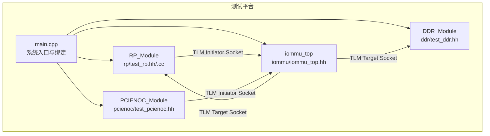
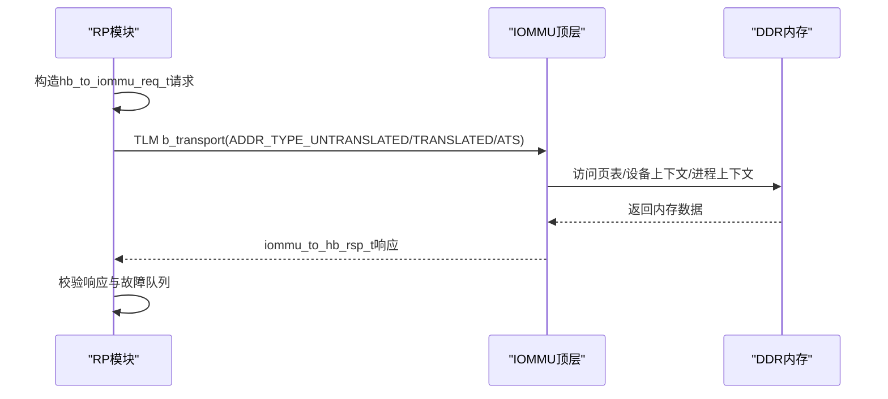
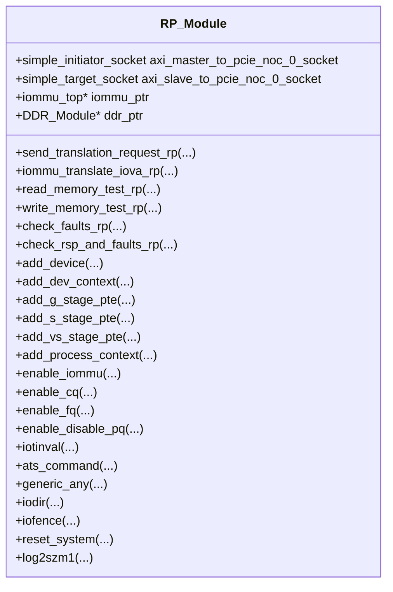
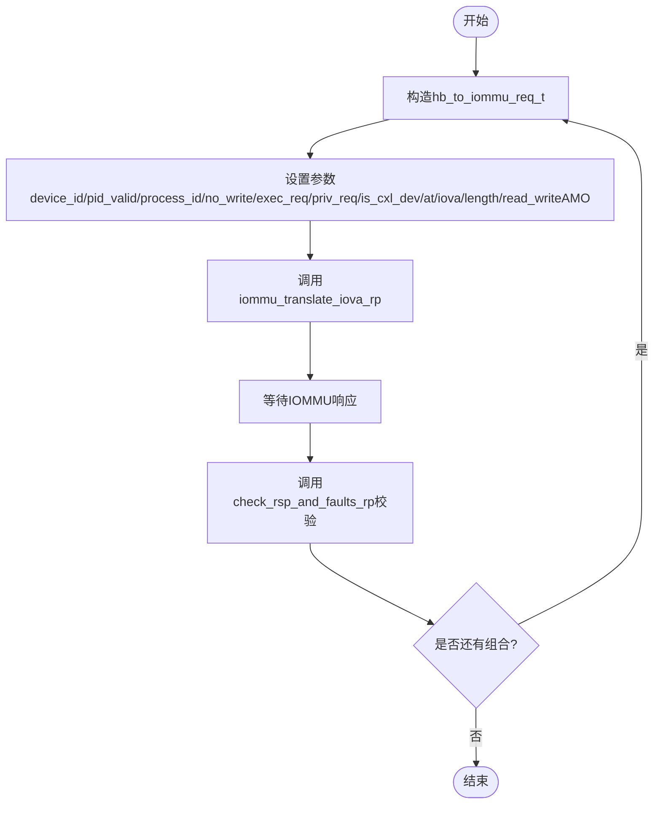
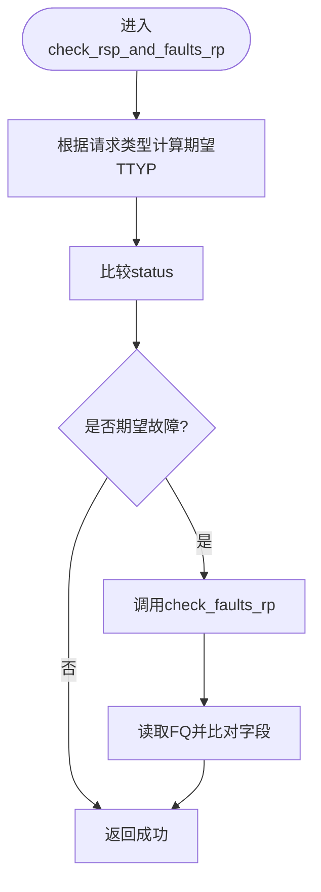
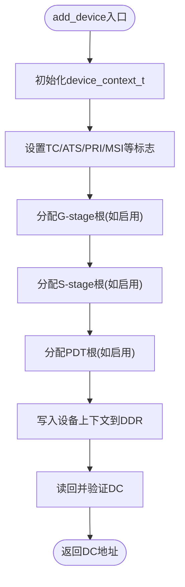
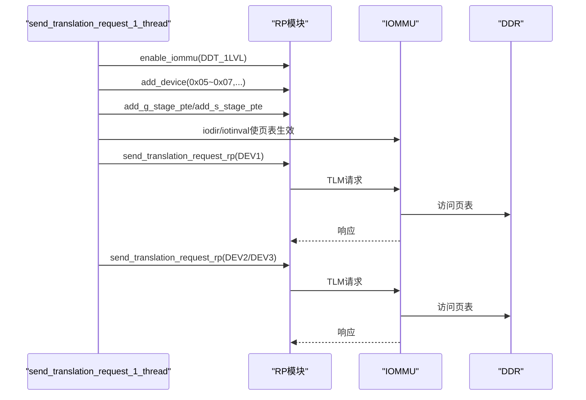
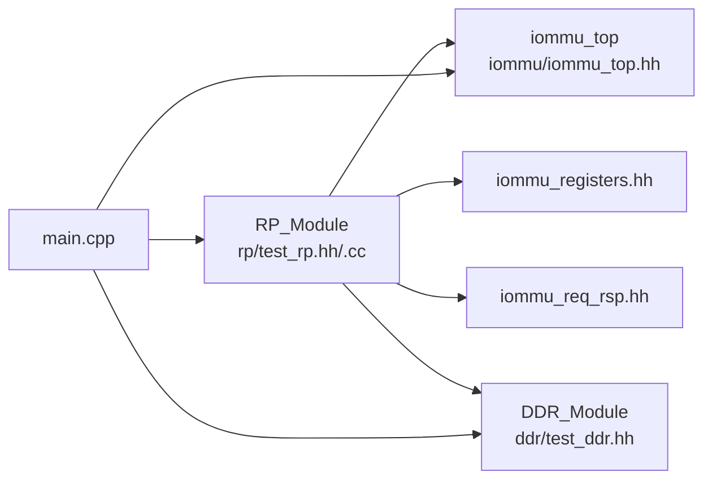

# RP测试模块

<cite>
**本文档引用的文件**
- [rp/test_rp.hh](file://rp/test_rp.hh)
- [rp/test_rp_func.cc](file://rp/test_rp_func.cc)
- [rp/test_rp_thread.cc](file://rp/test_rp_thread.cc)
- [main.cpp](file://main.cpp)
- [iommu/iommu_struct.hh](file://iommu/iommu_struct.hh)
- [iommu/iommu_registers.hh](file://iommu/iommu_registers.hh)
- [iommu/iommu_req_rsp.hh](file://iommu/iommu_req_rsp.hh)
- [ddr/test_ddr.hh](file://ddr/test_ddr.hh)
</cite>

## 目录
1. [简介](#简介)
2. [项目结构](#项目结构)
3. [核心组件](#核心组件)
4. [架构总览](#架构总览)
5. [详细组件分析](#详细组件分析)
6. [依赖关系分析](#依赖关系分析)
7. [性能考虑](#性能考虑)
8. [故障排查指南](#故障排查指南)
9. [结论](#结论)
10. [附录](#附录)

## 简介
本文件面向RP（Root Complex）测试模块，系统化阐述其在IOMMU测试环境中的作用与实现细节。RP模块通过SystemC与TLM接口，模拟PCIe根复合体行为，向IOMMU发起各类PCIe地址转换请求，并验证IOMMU的响应与异常记录。文档涵盖：
- 请求生成机制：不同PCIe请求类型的构造、参数设置与序列控制
- 响应验证逻辑：IOMMU响应校验、错误检测与测试结果评估
- 配置选项与使用示例：测试环境搭建、用例设计与自动化测试
- 调试技巧与常见问题排查

## 项目结构
RP模块位于独立目录，与IOMMU、PCIENOC、DDR等模块协同工作，通过SystemC/TLM进行连接与通信。

图表来源
- [main.cpp:38-77](file://main.cpp#L38-L77)
- [rp/test_rp.hh:54-74](file://rp/test_rp.hh#L54-L74)
- [ddr/test_ddr.hh:15-36](file://ddr/test_ddr.hh#L15-L36)

章节来源
- [main.cpp:38-77](file://main.cpp#L38-L77)
- [rp/test_rp.hh:54-74](file://rp/test_rp.hh#L54-L74)
- [ddr/test_ddr.hh:15-36](file://ddr/test_ddr.hh#L15-L36)

## 核心组件
- RP_Module：RP测试模块主体，负责构造PCIe请求、发起地址转换、读写内存、检查故障队列与响应状态。
- iommu_top：IOMMU顶层模块，接收来自RP的TLM事务，执行地址翻译与状态返回。
- DDR_Module：模拟物理内存，提供TLM目标端口，支持读写与边界检查。
- 主程序main.cpp：创建各模块实例并建立TLM连接，启动仿真。

章节来源
- [rp/test_rp.hh:54-110](file://rp/test_rp.hh#L54-L110)
- [iommu/iommu_struct.hh:42-102](file://iommu/iommu_struct.hh#L42-L102)
- [ddr/test_ddr.hh:15-96](file://ddr/test_ddr.hh#L15-L96)
- [main.cpp:38-77](file://main.cpp#L38-L77)

## 架构总览
RP模块通过TLM接口与IOMMU交互，同时维护对DDR的直接内存读写能力，用于构建页表、设备上下文与进程上下文，以及验证读写结果。

图表来源
- [rp/test_rp_func.cc:28-78](file://rp/test_rp_func.cc#L28-L78)
- [rp/test_rp_func.cc:170-198](file://rp/test_rp_func.cc#L170-L198)
- [ddr/test_ddr.hh:38-94](file://ddr/test_ddr.hh#L38-L94)

## 详细组件分析

### RP模块类与接口
RP_Module封装了RP测试所需的所有功能，包括：
- 请求构造与发送：send_translation_request_rp
- IOMMU交互：iommu_translate_iova_rp
- 内存读写：read_memory_test_rp/write_memory_test_rp
- 故障检查：check_faults_rp/check_rsp_and_faults_rp
- 设备/进程上下文与页表管理：add_device/add_dev_context/add_g_stage_pte/add_s_stage_pte/add_vs_stage_pte/add_process_context
- IOMMU寄存器与队列控制：enable_iommu/enable_cq/enable_fq/enable_disable_pq/iotinval/ats_command/generic_any/iodir/iofence
- 辅助工具：reset_system/log2szm1

图表来源
- [rp/test_rp.hh:54-110](file://rp/test_rp.hh#L54-L110)

章节来源
- [rp/test_rp.hh:54-110](file://rp/test_rp.hh#L54-L110)

### 请求生成机制
RP模块支持多种PCIe请求类型与参数组合，通过宏FOR_ALL_TRANSACTION_TYPES遍历所有组合，确保全面覆盖不同场景。

- 请求类型枚举：ADDR_TYPE_UNTRANSLATED、ADDR_TYPE_PCIE_ATS_TRANSLATION_REQUEST、ADDR_TYPE_TRANSLATED
- 请求参数：
  - device_id：设备标识
  - pid_valid/process_id：进程ID有效性与值
  - no_write/exec_req/priv_req：访问类型、执行请求、特权请求
  - is_cxl_dev：CXL设备标记
  - at：地址类型
  - iova/length/read_writeAMO：IOVA、长度、读/写/AMO
- 序列控制：通过SC_THREAD线程驱动，按顺序执行多设备、多模式的地址转换测试。

图表来源
- [rp/test_rp_func.cc:170-198](file://rp/test_rp_func.cc#L170-L198)
- [rp/test_rp_func.cc:28-78](file://rp/test_rp_func.cc#L28-L78)
- [rp/test_rp.hh:37-48](file://rp/test_rp.hh#L37-L48)

章节来源
- [rp/test_rp_func.cc:170-198](file://rp/test_rp_func.cc#L170-L198)
- [rp/test_rp_func.cc:28-78](file://rp/test_rp_func.cc#L28-L78)
- [rp/test_rp.hh:37-48](file://rp/test_rp.hh#L37-L48)

### 响应验证逻辑
RP模块提供两层验证：
- 响应状态校验：check_rsp_and_faults_rp根据请求类型推导期望TTYP，比较IOMMU返回status
- 故障记录校验：check_faults_rp读取FQ队列，弹出一条故障记录并比对CAUSE/DID/iotval/iotval2/TTYP/PV/PID/PRIV等字段

图表来源
- [rp/test_rp_func.cc:123-168](file://rp/test_rp_func.cc#L123-L168)
- [rp/test_rp_func.cc:81-121](file://rp/test_rp_func.cc#L81-L121)

章节来源
- [rp/test_rp_func.cc:123-168](file://rp/test_rp_func.cc#L123-L168)
- [rp/test_rp_func.cc:81-121](file://rp/test_rp_func.cc#L81-L121)

### 设备/进程上下文与页表管理
RP模块通过add_device/add_dev_context/add_g_stage_pte/add_s_stage_pte/add_vs_stage_pte/add_process_context等函数，构建IOMMU所需的设备上下文与页表结构，支持Bare/Sv39/Sv48/Sv57等模式组合。

- add_device：配置设备上下文TC/ATS/PRI/MSI等特性，分配并初始化G-stage/S-stage/PDT页表根
- add_dev_context：根据DDT模式（1/2/3级）定位设备目录索引，写入设备上下文并验证
- add_g_stage_pte/add_s_stage_pte/add_vs_stage_pte：按地址类型与页表级别递归构建页表项
- add_process_context：为设备下的进程创建进程上下文

图表来源
- [rp/test_rp_func.cc:200-288](file://rp/test_rp_func.cc#L200-L288)
- [rp/test_rp_func.cc:391-464](file://rp/test_rp_func.cc#L391-L464)

章节来源
- [rp/test_rp_func.cc:200-288](file://rp/test_rp_func.cc#L200-L288)
- [rp/test_rp_func.cc:391-464](file://rp/test_rp_func.cc#L391-L464)

### IOMMU寄存器与队列控制
RP模块提供对IOMMU关键寄存器的配置与查询能力，包括：
- enable_iommu：设置DDTP并初始化DDT根页
- enable_cq/enable_fq/enable_disable_pq：配置命令队列、故障队列与页面队列
- iotinval/ats_command/generic_any/iodir/iofence：发送各种IOMMU命令

章节来源
- [rp/test_rp_func.cc:840-863](file://rp/test_rp_func.cc#L840-L863)
- [rp/test_rp_func.cc:744-773](file://rp/test_rp_func.cc#L744-L773)
- [rp/test_rp_func.cc:775-800](file://rp/test_rp_func.cc#L775-L800)
- [rp/test_rp_func.cc:804-837](file://rp/test_rp_func.cc#L804-L837)
- [rp/test_rp_func.cc:886-900](file://rp/test_rp_func.cc#L886-L900)

### 线程驱动与测试序列
RP模块通过SC_THREAD线程send_translation_request_1_thread驱动完整测试流程：
- 使能IOMMU并初始化DDT
- 添加多个设备，配置不同模式组合（Bare/Bare、Bare/Sv48x4、Sv39/Bare）
- 构建相应页表并使页表生效
- 分别对三个设备发起地址转换请求，验证响应与故障

图表来源
- [rp/test_rp_thread.cc:60-370](file://rp/test_rp_thread.cc#L60-L370)

章节来源
- [rp/test_rp_thread.cc:60-370](file://rp/test_rp_thread.cc#L60-L370)

## 依赖关系分析
RP模块与IOMMU、DDR、主程序之间的依赖关系如下：

图表来源
- [rp/test_rp.hh:8-10](file://rp/test_rp.hh#L8-L10)
- [rp/test_rp_func.cc:1-6](file://rp/test_rp_func.cc#L1-L6)
- [main.cpp:9-12](file://main.cpp#L9-L12)

章节来源
- [rp/test_rp.hh:8-10](file://rp/test_rp.hh#L8-L10)
- [rp/test_rp_func.cc:1-6](file://rp/test_rp_func.cc#L1-L6)
- [main.cpp:9-12](file://main.cpp#L9-L12)

## 性能考虑
- 页表构建与内存访问：add_g_stage_pte/add_s_stage_pte等递归遍历页表时，需注意地址范围与页表大小，避免不必要的多次访问。
- 队列配置：CQ/FQ/PQ的页数与log2szm1计算需与实际页大小匹配，防止溢出或浪费。
- 线程调度：测试线程中wait时间与仿真步长影响整体仿真时延，建议在保证稳定性的前提下尽量减少等待。

## 故障排查指南
- 地址越界：DDR模块对越界访问会返回错误响应，检查IOVA与长度是否超出模拟内存范围。
- 页表未生效：若请求失败，确认是否调用了iodir/iotinval等命令使页表生效。
- 故障队列为空：check_faults_rp在无故障或未正确弹出记录时会返回错误，检查FQH/FQT寄存器与记录索引。
- 设备上下文写入失败：add_dev_context写入后立即读回验证，若V位不为1，检查页分配与写入流程。
- 命令队列忙：enable_cq/enable_fq/enable_disable_pq在busy状态下会轮询等待，确保命令队列状态正确。

章节来源
- [ddr/test_ddr.hh:44-49](file://ddr/test_ddr.hh#L44-L49)
- [rp/test_rp_func.cc:81-121](file://rp/test_rp_func.cc#L81-L121)
- [rp/test_rp_func.cc:391-464](file://rp/test_rp_func.cc#L391-L464)
- [rp/test_rp_func.cc:744-773](file://rp/test_rp_func.cc#L744-L773)

## 结论
RP测试模块通过SystemC/TLM精确模拟PCIe根复合体行为，能够覆盖多种PCIe请求类型与IOMMU配置组合，提供完善的响应与故障验证机制。配合设备/进程上下文与页表管理功能，可实现从基础地址转换到复杂多级页表的全栈测试，为IOMMU模型的正确性与稳定性提供可靠保障。

## 附录

### 配置选项与使用示例
- 启动仿真：main.cpp中创建iommu、ddr、rp、pcienoc实例并完成TLM绑定，随后启动仿真。
- 设备配置：add_device支持设置ATS/PRI/MSI等特性，以及选择第一/第二阶段页表模式。
- 页表构建：根据设备上下文的DDT模式与页表级别，使用add_g_stage_pte/add_s_stage_pte/add_vs_stage_pte构建相应页表。
- 命令队列：enable_cq/enable_fq/enable_disable_pq用于开启/关闭队列，iotinval/ats_command/iodir/iofence用于发送IOMMU命令。

章节来源
- [main.cpp:38-77](file://main.cpp#L38-L77)
- [rp/test_rp_func.cc:200-288](file://rp/test_rp_func.cc#L200-L288)
- [rp/test_rp_func.cc:314-388](file://rp/test_rp_func.cc#L314-L388)
- [rp/test_rp_func.cc:744-837](file://rp/test_rp_func.cc#L744-L837)