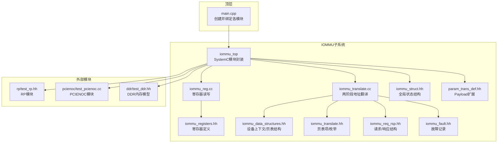
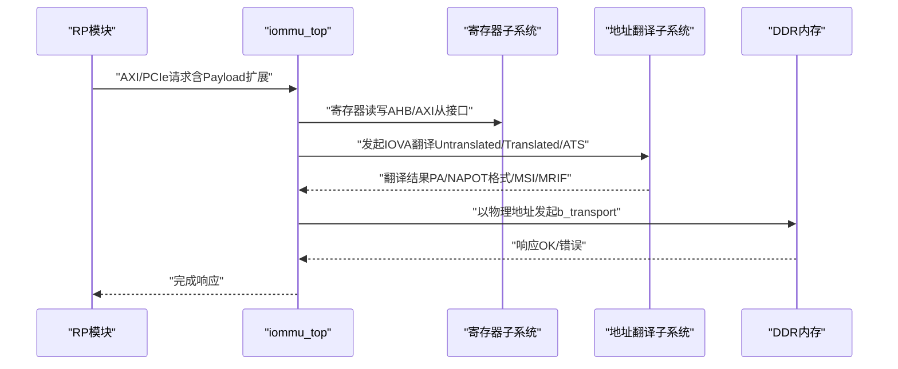
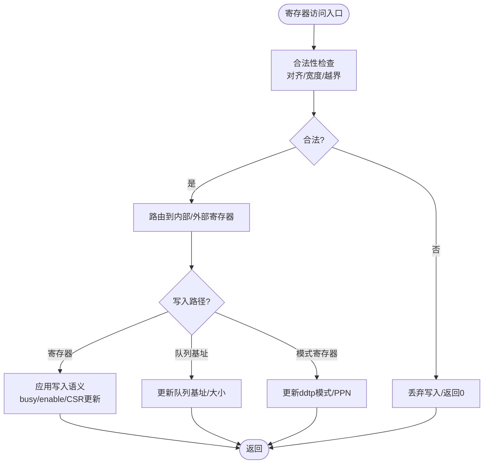
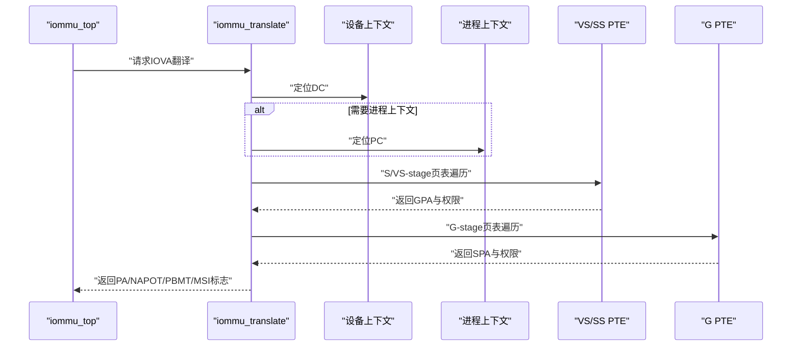
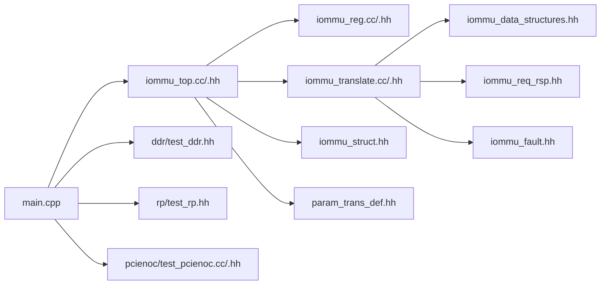

# 内存系统

<cite>
**本文引用的文件**
- [main.cpp](file://main.cpp)
- [Makefile](file://Makefile)
- [iommu/iommu_top.cc](file://iommu/iommu_top.cc)
- [iommu/iommu_top.hh](file://iommu/iommu_top.hh)
- [iommu/iommu_reg.cc](file://iommu/iommu_reg.cc)
- [iommu/iommu_registers.hh](file://iommu/iommu_registers.hh)
- [iommu/iommu_data_structures.hh](file://iommu/iommu_data_structures.hh)
- [iommu/iommu_translate.cc](file://iommu/iommu_translate.cc)
- [iommu/iommu_translate.hh](file://iommu/iommu_translate.hh)
- [iommu/iommu_req_rsp.hh](file://iommu/iommu_req_rsp.hh)
- [iommu/iommu_fault.hh](file://iommu/iommu_fault.hh)
- [iommu/iommu_struct.hh](file://iommu/iommu_struct.hh)
- [iommu/param_trans_def.hh](file://iommu/param_trans_def.hh)
- [ddr/test_ddr.cc](file://ddr/test_ddr.cc)
- [ddr/test_ddr.hh](file://ddr/test_ddr.hh)
- [rp/test_rp.hh](file://rp/test_rp.hh)
- [pcienoc/test_pcienoc.cc](file://pcienoc/test_pcienoc.cc)
- [pcienoc/test_pcienoc.hh](file://pcienoc/test_pcienoc.hh)
</cite>

## 目录
1. [简介](#简介)
2. [项目结构](#项目结构)
3. [核心组件](#核心组件)
4. [架构总览](#架构总览)
5. [详细组件分析](#详细组件分析)
6. [依赖关系分析](#依赖关系分析)
7. [性能考虑](#性能考虑)
8. [故障排查指南](#故障排查指南)
9. [结论](#结论)
10. [附录](#附录)

## 简介
本文件面向内存系统（特别是IOMMU内存模拟与寄存器映射）的技术文档，围绕以下目标展开：
- 深入解释DDR内存模拟模块的实现，包括内存访问接口、数据读写处理与错误处理机制。
- 详解IOMMU寄存器映射系统，包括寄存器定义、访问控制与状态管理。
- 解释内存数据结构设计，包括关键数据类型、内存布局与访问模式。
- 说明AXI接口实现，包括主从端口绑定、数据传输协议与时序控制。
- 提供内存系统的配置选项、性能参数与优化策略。
- 给出内存访问的调试技巧、性能监控方法与常见问题诊断。

## 项目结构
该仓库采用SystemC/TLM建模，IOMMU为核心模块，通过TLM接口与RP（Root Port）、PCIENOC、DDR等模块交互；同时提供寄存器级抽象与地址翻译逻辑。

图示来源
- [main.cpp:38-87](file://main.cpp#L38-L87)
- [iommu/iommu_top.cc:1-222](file://iommu/iommu_top.cc#L1-L222)
- [iommu/iommu_top.hh:19-57](file://iommu/iommu_top.hh#L19-L57)
- [iommu/iommu_reg.cc:1-120](file://iommu/iommu_reg.cc#L1-L120)
- [iommu/iommu_registers.hh:1-120](file://iommu/iommu_registers.hh#L1-L120)
- [iommu/iommu_data_structures.hh:1-120](file://iommu/iommu_data_structures.hh#L1-L120)
- [iommu/iommu_translate.cc:1-120](file://iommu/iommu_translate.cc#L1-L120)
- [iommu/iommu_translate.hh:1-132](file://iommu/iommu_translate.hh#L1-L132)
- [iommu/iommu_req_rsp.hh:1-105](file://iommu/iommu_req_rsp.hh#L1-L105)
- [iommu/iommu_fault.hh:1-90](file://iommu/iommu_fault.hh#L1-L90)
- [iommu/iommu_struct.hh:1-102](file://iommu/iommu_struct.hh#L1-L102)
- [iommu/param_trans_def.hh:1-130](file://iommu/param_trans_def.hh#L1-L130)
- [ddr/test_ddr.hh:15-96](file://ddr/test_ddr.hh#L15-L96)
- [rp/test_rp.hh:54-112](file://rp/test_rp.hh#L54-L112)
- [pcienoc/test_pcienoc.cc:1-200](file://pcienoc/test_pcienoc.cc#L1-L200)

章节来源
- [main.cpp:38-87](file://main.cpp#L38-L87)
- [iommu/iommu_top.cc:1-222](file://iommu/iommu_top.cc#L1-L222)
- [iommu/iommu_top.hh:19-57](file://iommu/iommu_top.hh#L19-L57)

## 核心组件
- IOMMU顶层模块：封装SystemC模块、TLM socket、寄存器读写入口与AXI/PCIe交互。
- 寄存器子系统：提供寄存器读写、访问合法性校验、状态机更新与中断生成。
- 地址翻译子系统：实现两阶段地址翻译、MSI地址翻译、ATC缓存与故障上报。
- 数据结构：设备上下文（DC）、进程上下文（PC）、页表项（S/G PTE）、MSI PTE等。
- 外部内存与桥接：DDR内存模型、RP/PCIENOC桥接模块，通过TLM接口连接。

章节来源
- [iommu/iommu_top.cc:1-222](file://iommu/iommu_top.cc#L1-L222)
- [iommu/iommu_reg.cc:1-120](file://iommu/iommu_reg.cc#L1-L120)
- [iommu/iommu_translate.cc:1-120](file://iommu/iommu_translate.cc#L1-L120)
- [iommu/iommu_data_structures.hh:1-120](file://iommu/iommu_data_structures.hh#L1-L120)
- [ddr/test_ddr.hh:15-96](file://ddr/test_ddr.hh#L15-L96)

## 架构总览
IOMMU通过TLM接口与RP/PCIENOC交互，接收PCIe ATS/消息请求或普通内存访问；内部完成寄存器读写、地址翻译与故障上报，并将最终物理地址转发至DDR或其他目标。

图示来源
- [iommu/iommu_top.cc:41-210](file://iommu/iommu_top.cc#L41-L210)
- [iommu/iommu_reg.cc:39-120](file://iommu/iommu_reg.cc#L39-L120)
- [iommu/iommu_translate.cc:8-120](file://iommu/iommu_translate.cc#L8-L120)
- [ddr/test_ddr.hh:38-94](file://ddr/test_ddr.hh#L38-L94)

## 详细组件分析

### 内存访问接口与AXI/PCIe绑定
- AXI主/从端口绑定：顶层在main.cpp中将IOMMU的initiator sockets绑定到DDR与RP/PCIENOC的target sockets，形成完整的数据路径。
- AXI从接口处理：iommu_top.cc中实现了AXI从接口的b_transport，区分消息请求与地址翻译请求，调用翻译子系统并根据结果计算物理地址或转发MSI。
- AHB从接口处理：同样在iommu_top.cc中实现AHB从接口，支持寄存器读写。
- Payload扩展：param_trans_def.hh定义了PayloadExtention，承载请求者ID、ATS字段、PASID等，供翻译与故障处理使用。

章节来源
- [main.cpp:60-73](file://main.cpp#L60-L73)
- [iommu/iommu_top.cc:41-210](file://iommu/iommu_top.cc#L41-L210)
- [iommu/param_trans_def.hh:12-97](file://iommu/param_trans_def.hh#L12-L97)

### 寄存器映射系统与访问控制
- 寄存器布局：iommu_registers.hh定义了能力寄存器、功能控制寄存器、队列基址寄存器、CSR寄存器、中断状态寄存器、性能计数器等。
- 访问合法性：iommu_reg.cc中的is_access_valid检查对齐、宽度与越界；非法访问返回0或丢弃写入。
- 写入控制：针对busy位、模式切换、队列启用/禁用等场景，写入可能被忽略或触发状态机变化。
- 读取控制：部分寄存器只读；计数器溢出汇总由专用函数聚合。
- DDTP模式：支持Off/Bare/1LVL/2LVL/3LVL，写入需满足特定条件（如busy=0、模式连续性）。

图示来源
- [iommu/iommu_reg.cc:11-120](file://iommu/iommu_reg.cc#L11-L120)
- [iommu/iommu_registers.hh:172-250](file://iommu/iommu_registers.hh#L172-L250)

章节来源
- [iommu/iommu_reg.cc:11-120](file://iommu/iommu_reg.cc#L11-L120)
- [iommu/iommu_registers.hh:172-250](file://iommu/iommu_registers.hh#L172-L250)

### 地址翻译与内存数据结构
- 两阶段地址翻译：iommu_translate.cc实现从IOVA到GPA再到SPA的完整流程，支持S/VS与G-stage页表、权限检查、PBMT解析与NAPOT格式缓存。
- 设备上下文（DC）：包含TC、iohgatp、TA、FSC、MSI相关字段，决定翻译路径与QoS。
- 进程上下文（PC）：在PDTV=1时选择VS-stage页表与PSCID。
- 页表项（S/G PTE）：包含R/W/X/U/G/A/D/RSW/PBMT/N等位，支持PMA/IO/NC等内存类型。
- MSI地址翻译：识别MSI写入并可选择Flat或MRIF模式，必要时直接返回MRIF地址。

图示来源
- [iommu/iommu_translate.cc:8-120](file://iommu/iommu_translate.cc#L8-L120)
- [iommu/iommu_translate.hh:23-92](file://iommu/iommu_translate.hh#L23-L92)
- [iommu/iommu_data_structures.hh:324-415](file://iommu/iommu_data_structures.hh#L324-L415)

章节来源
- [iommu/iommu_translate.cc:8-120](file://iommu/iommu_translate.cc#L8-L120)
- [iommu/iommu_translate.hh:23-92](file://iommu/iommu_translate.hh#L23-L92)
- [iommu/iommu_data_structures.hh:324-415](file://iommu/iommu_data_structures.hh#L324-L415)

### 错误处理与故障上报
- 故障分类：访问错误、数据损坏、G-stage页故障、G-stage访问错误、数据路径错误等。
- 故障记录：iommu_fault.hh定义故障记录格式，包含CAUSE、PID、PV、PRIV、TTYP、DID、iotval/iotval2等。
- 上报策略：非ATS请求走FQ；ATS请求根据错误类型返回UR/CA或Unsupported Request。

章节来源
- [iommu/iommu_fault.hh:52-89](file://iommu/iommu_fault.hh#L52-L89)
- [iommu/iommu_translate.cc:620-731](file://iommu/iommu_translate.cc#L620-L731)

### DDR内存模拟与数据读写
- DDR模块：test_ddr.hh提供简单内存数组与TLM b_transport实现，支持读写、边界检查与基本日志。
- 接口绑定：main.cpp中将IOMMU的AXI主口绑定到DDR的AXI从口，形成DMA与寄存器访问路径。
- 错误处理：越界访问返回TLM_ADDRESS_ERROR_RESPONSE，避免仿真崩溃。

章节来源
- [ddr/test_ddr.hh:15-96](file://ddr/test_ddr.hh#L15-L96)
- [main.cpp:60-67](file://main.cpp#L60-L67)

## 依赖关系分析
- 模块耦合：iommu_top依赖寄存器、翻译、数据结构、请求/响应与故障模块；通过TLM socket与RP/PCIENOC/DDR解耦。
- 头文件依赖：iommu_struct.hh集中包含各头文件，统一前置声明与依赖。
- 构建系统：Makefile列出所有源文件与编译选项，确保调试宏与SystemC链接正确。

图示来源
- [iommu/iommu_top.cc:1-222](file://iommu/iommu_top.cc#L1-L222)
- [iommu/iommu_reg.cc:1-120](file://iommu/iommu_reg.cc#L1-L120)
- [iommu/iommu_translate.cc:1-120](file://iommu/iommu_translate.cc#L1-L120)
- [iommu/iommu_struct.hh:24-102](file://iommu/iommu_struct.hh#L24-L102)
- [main.cpp:38-87](file://main.cpp#L38-L87)

章节来源
- [iommu/iommu_struct.hh:24-102](file://iommu/iommu_struct.hh#L24-L102)
- [Makefile:29-50](file://Makefile#L29-L50)

## 性能考虑
- 缓存与TLB：ATC/TLB缓存NAPOT格式的IOVA→PPN映射，减少页表遍历开销。
- 队列与中断：命令/故障/页面请求队列CSR控制busy与启用状态，合理配置log2szm1与PPN可提升吞吐。
- 端到端延迟：AXI事务时延由socket链路与b_transport实现决定，建议在仿真中统计关键路径延迟。
- 调试宏：构建时开启DEBUG_*宏可输出翻译、MSI、二级阶段等详细日志，便于性能瓶颈定位。

章节来源
- [iommu/iommu_translate.cc:458-492](file://iommu/iommu_translate.cc#L458-L492)
- [iommu/iommu_reg.cc:354-432](file://iommu/iommu_reg.cc#L354-L432)
- [Makefile:16-24](file://Makefile#L16-L24)

## 故障排查指南
- 寄存器访问错误
  - 现象：读到0或写入无效。
  - 排查：确认对齐、宽度与越界；检查busy位与模式切换条件。
  - 参考：[iommu/iommu_reg.cc:11-120](file://iommu/iommu_reg.cc#L11-L120)
- 地址翻译失败
  - 现象：返回Unsupported Request或Completer Abort。
  - 排查：检查DC/PC配置、PDTV/PD模式、权限位（R/W/X）、SXL/SADE/GADE设置。
  - 参考：[iommu/iommu_translate.cc:620-731](file://iommu/iommu_translate.cc#L620-L731)
- MSI/MRIF异常
  - 现象：MSI写入未命中或MRIF路径不一致。
  - 排查：核对MSI地址掩码/模式、MRIF地址与NID。
  - 参考：[iommu/iommu_translate.cc:388-418](file://iommu/iommu_translate.cc#L388-L418)
- 内存越界
  - 现象：DDR返回ADDRESS_ERROR。
  - 排查：确认物理地址范围、页大小与NAPOT格式。
  - 参考：[ddr/test_ddr.hh:44-49](file://ddr/test_ddr.hh#L44-L49)
- 调试技巧
  - 启用DEBUG宏（Makefile）与关键日志（iommu_top.cc/iommu_reg.cc/iommu_translate.cc）。
  - 使用RP/DDR测试桩验证典型路径（读写DC、页表、MSI）。

章节来源
- [iommu/iommu_reg.cc:11-120](file://iommu/iommu_reg.cc#L11-L120)
- [iommu/iommu_translate.cc:388-418](file://iommu/iommu_translate.cc#L388-L418)
- [ddr/test_ddr.hh:44-49](file://ddr/test_ddr.hh#L44-L49)
- [Makefile:16-24](file://Makefile#L16-L24)

## 结论
本内存系统以SystemC/TLM为基础，通过寄存器抽象与两阶段地址翻译实现IOMMU核心功能；AXI/PCIe接口与DDR模型共同构成完整的内存访问链路。通过合理的队列配置、缓存策略与调试手段，可在保证正确性的前提下获得良好性能与可观测性。

## 附录
- 关键数据类型与布局
  - 设备上下文（DC）：TC/iohgatp/TA/FSC（扩展版含MSI相关字段）
  - 进程上下文（PC）：PC_TA/PC_FSC
  - 页表项（S/G PTE）：R/W/X/U/G/A/D/RSW/PBMT/N
  - MSI PTE：Flat/MRIF两种模式，MRIF含NID/地址域
- 配置选项与参数
  - DDTP模式：Off/Bare/1LVL/2LVL/3LVL
  - 队列基址与log2szm1：影响队列容量与对齐要求
  - 端序与SXL/SADE/GADE：影响页表行为与原子访问
- 优化策略
  - 合理设置队列尺寸与启用顺序，降低busy时间
  - 利用ATC/TLB缓存减少页表遍历
  - 在调试阶段开启详细日志，定位热点路径

章节来源
- [iommu/iommu_data_structures.hh:324-415](file://iommu/iommu_data_structures.hh#L324-L415)
- [iommu/iommu_translate.hh:23-92](file://iommu/iommu_translate.hh#L23-L92)
- [iommu/iommu_registers.hh:172-250](file://iommu/iommu_registers.hh#L172-L250)