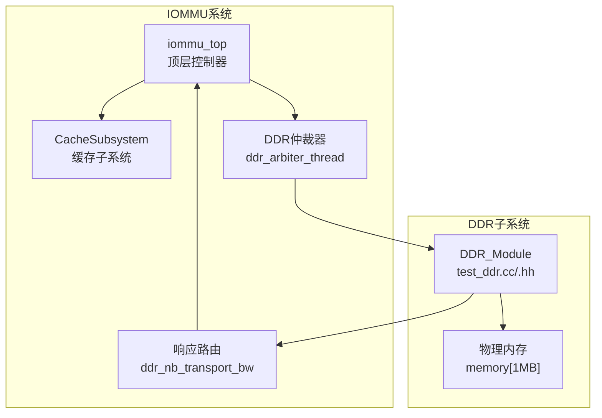
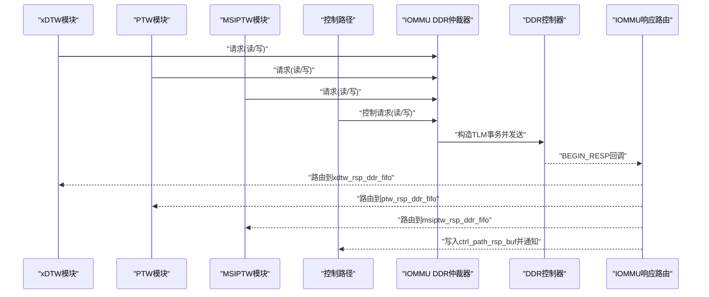
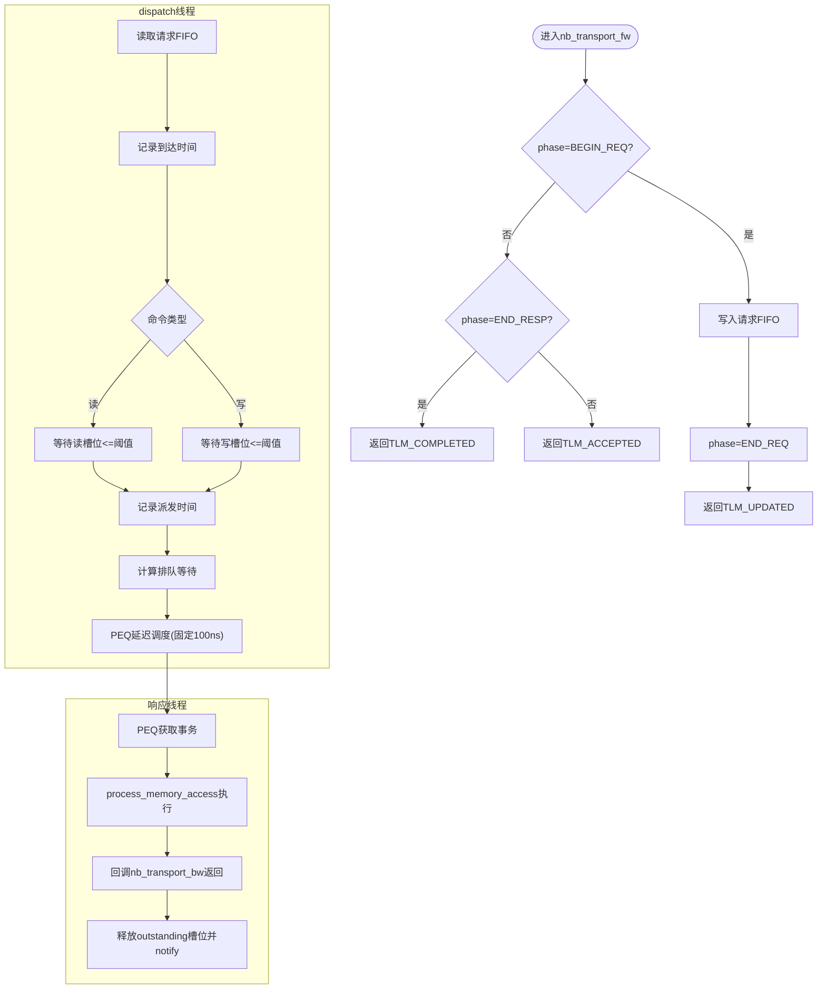
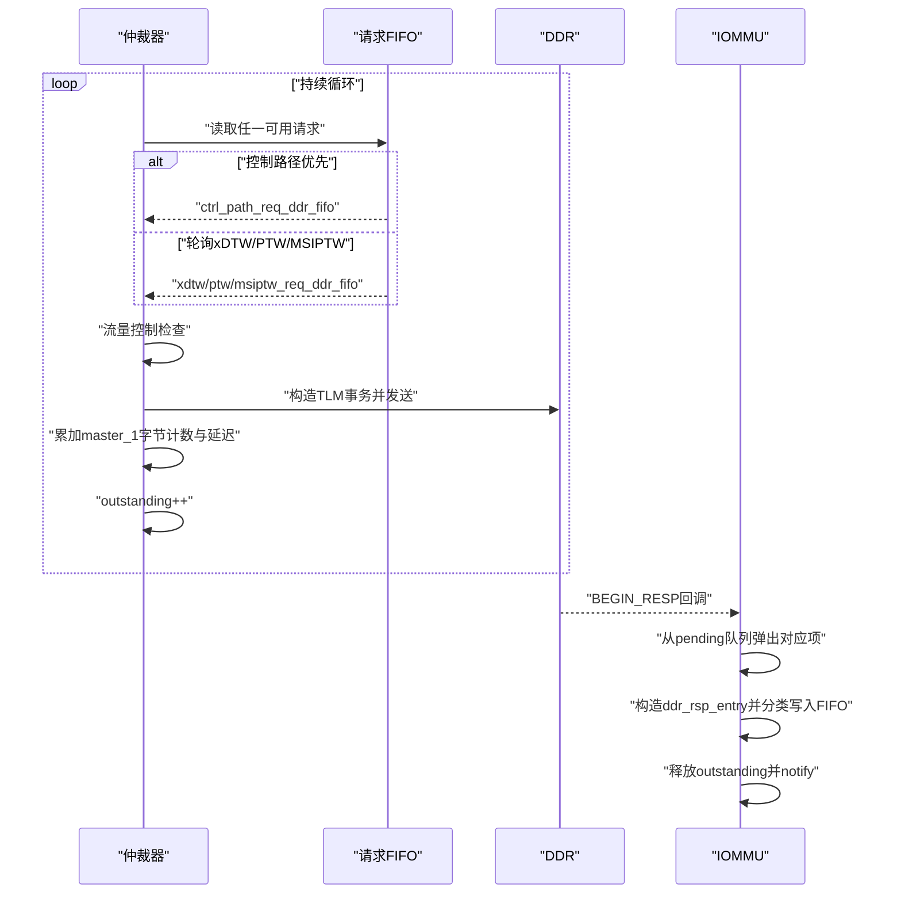
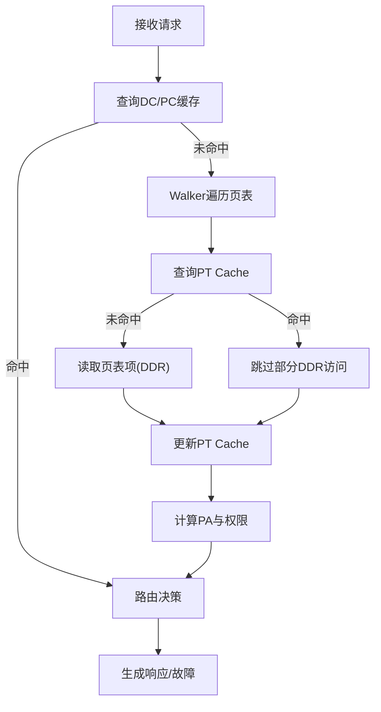
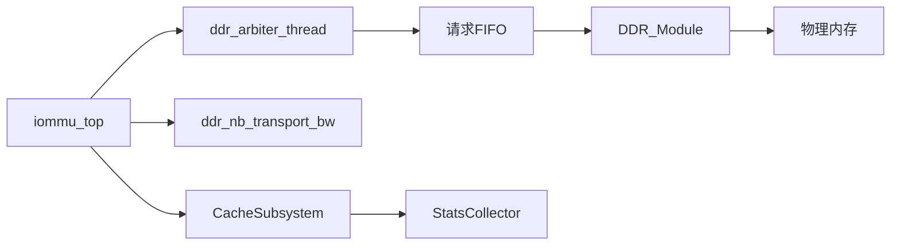

# DDR控制器接口

<cite>
**本文档引用的文件**
- [test_ddr.cc](file://ddr/test_ddr.cc)
- [test_ddr.hh](file://ddr/test_ddr.hh)
- [iommu_top.cc](file://iommu/iommu_top.cc)
- [iommu_top.hh](file://iommu/iommu_top.hh)
- [iommu_perf_params.hh](file://iommu/iommu_perf_model/iommu_perf_params.hh)
- [iommu_perf_params_t2.hh](file://iommu/iommu_perf_model/iommu_perf_params_t2.hh)
- [cache_subsystem.h](file://iommu/cache_src/subsystem/cache_subsystem.h)
- [default_config.json](file://iommu/cache_config/default_config.json)
- [iommu_task.hh](file://iommu/include/iommu_task.hh)
- [iommu_req_rsp.hh](file://iommu/include/iommu_req_rsp.hh)
- [iommu_struct.hh](file://iommu/include/iommu_struct.hh)
</cite>

## 目录
1. [简介](#简介)
2. [项目结构](#项目结构)
3. [核心组件](#核心组件)
4. [架构概览](#架构概览)
5. [详细组件分析](#详细组件分析)
6. [依赖关系分析](#依赖关系分析)
7. [性能考虑](#性能考虑)
8. [故障排查指南](#故障排查指南)
9. [结论](#结论)
10. [附录](#附录)

## 简介
本文件面向IOMMU系统中的DDR控制器接口，系统性阐述DDR内存控制器在IOMMU体系中的角色与功能，涵盖内存访问接口实现（读写流程）、内存映射与地址转换机制、DDR接口配置参数与性能优化策略、内存缓冲与数据传输机制、测试与基准方法、故障检测与恢复，以及与IOMMU缓存系统的协同工作机制。文档以代码为依据，结合图示帮助读者快速理解并正确使用该接口。

## 项目结构
- DDR模块位于ddr目录，提供SystemC + TLM2的内存子系统模拟，包含非阻塞与阻塞两种接口路径，支持读写并发控制与延迟建模。
- IOMMU顶层模块位于iommu目录，负责请求分发、地址翻译、缓存协调、DDR仲裁与响应路由等核心功能。
- 性能参数与缓存配置位于iommu/iommu_perf_model与iommu/cache_config目录，支撑仿真性能建模与缓存行为配置。
- 关键数据结构与枚举定义位于iommu/include目录，统一描述任务状态、DDR请求/响应格式与地址类型。

**图表来源**
- [iommu_top.cc:279-404](file://iommu/iommu_top.cc#L279-L404)
- [test_ddr.cc:8-26](file://ddr/test_ddr.cc#L8-L26)

**章节来源**
- [test_ddr.cc:1-153](file://ddr/test_ddr.cc#L1-L153)
- [iommu_top.cc:1-780](file://iommu/iommu_top.cc#L1-L780)

## 核心组件
- DDR_Module（ddr/test_ddr.cc/.hh）
  - 提供三条目标socket（TLM2简单目标接口），分别接入IOMMU仲裁器与RP直连路径。
  - 实现非阻塞nb_transport_fw（主路径）与阻塞b_transport（RP直连）。
  - 内部维护请求FIFO与PEQ，实现并发读写控制与固定延迟建模。
  - 提供process_memory_access共享逻辑，执行实际读写操作。
- iommu_top（iommu/iommu_top.cc/.hh）
  - 注册DDR响应回调ddr_nb_transport_bw，负责将DDR响应按源模块分类路由至相应FIFO。
  - 实现ddr_arbiter_thread，统一仲裁来自xDTW、PTW、MSIPTW与控制路径的DDR请求。
  - 维护全局与端口级outstanding计数器，保障背压与吞吐平衡。
- 缓存子系统（iommu/cache_src/subsystem/cache_subsystem.h）
  - 将IOMMU内部缓存（DC/PC/PT/MSIPT/Walker）封装为统一的CacheSubsystem，提供查询、更新、失效的FIFO接口。
  - 通过stats收集器输出命中率与延迟统计，支撑性能分析与优化。
- 性能参数与配置（iommu/iommu_perf_model/iommu_perf_params.hh、default_config.json）
  - 定义FIFO深度、缓存规模、AXI端口带宽、DDR延迟与带宽、outstanding上限等关键参数。
  - JSON配置文件描述缓存时序、容量与替换策略，便于快速调整仿真行为。

**章节来源**
- [test_ddr.hh:17-61](file://ddr/test_ddr.hh#L17-L61)
- [test_ddr.cc:8-26](file://ddr/test_ddr.cc#L8-L26)
- [iommu_top.hh:44-503](file://iommu/iommu_top.hh#L44-L503)
- [iommu_top.cc:206-274](file://iommu/iommu_top.cc#L206-L274)
- [cache_subsystem.h:21-189](file://iommu/cache_src/subsystem/cache_subsystem.h#L21-L189)
- [default_config.json:1-69](file://iommu/cache_config/default_config.json#L1-L69)

## 架构概览
下图展示IOMMU与DDR之间的数据通路：IOMMU各Walker模块（xDTW/PTW/MSIPTW）与控制路径将请求送入DDR仲裁器，仲裁器根据优先级与流量控制选择请求，构造TLM事务发送至DDR，DDR执行内存访问后通过回调返回响应，IOMMU按源模块分类回传给对应模块。

**图表来源**
- [iommu_top.cc:279-404](file://iommu/iommu_top.cc#L279-L404)
- [iommu_top.cc:206-274](file://iommu/iommu_top.cc#L206-L274)
- [iommu_task.hh:294-344](file://iommu/include/iommu_task.hh#L294-L344)

## 详细组件分析

### DDR控制器接口（DDR_Module）
- 接口与回调
  - nb_transport_fw：主路径，接收IOMMU仲裁器发起的请求，写入请求FIFO并返回END_REQ。
  - b_transport：RP直连路径，直接执行内存访问。
- 并发控制与延迟
  - 分别维护读/写outstanding计数与事件，超过阈值时阻塞等待槽位释放。
  - 使用PEQ（带get的协议事件队列）在固定延迟后触发响应，保持FIFO顺序。
- 内存访问
  - process_memory_access执行边界检查与memcpy，设置响应状态。

**图表来源**
- [test_ddr.cc:31-43](file://ddr/test_ddr.cc#L31-L43)
- [test_ddr.cc:55-89](file://ddr/test_ddr.cc#L55-L89)
- [test_ddr.cc:94-127](file://ddr/test_ddr.cc#L94-L127)
- [test_ddr.cc:132-152](file://ddr/test_ddr.cc#L132-L152)

**章节来源**
- [test_ddr.cc:8-26](file://ddr/test_ddr.cc#L8-L26)
- [test_ddr.cc:31-43](file://ddr/test_ddr.cc#L31-L43)
- [test_ddr.cc:55-89](file://ddr/test_ddr.cc#L55-L89)
- [test_ddr.cc:94-127](file://ddr/test_ddr.cc#L94-L127)
- [test_ddr.cc:132-152](file://ddr/test_ddr.cc#L132-L152)

### IOMMU DDR仲裁与响应路由（iommu_top）
- 仲裁器（ddr_arbiter_thread）
  - 优先级：控制路径最高，随后轮询xDTW/PTW/MSIPTW。
  - 流量控制：全局outstanding与axi_master_1_to_cmn_rnd端口outstanding均受控。
  - 构造TLM事务并发送至DDR，同时累加端口字节计数与延迟。
- 响应回路（ddr_nb_transport_bw）
  - 从pending队列取出对应请求，构造ddr_rsp_entry，按源模块写入对应FIFO。
  - 控制路径响应直接复制到缓冲并通知事件，避免丢失。
  - 释放仲裁器槽位并清理由仲裁器分配的payload。

**图表来源**
- [iommu_top.cc:279-404](file://iommu/iommu_top.cc#L279-L404)
- [iommu_top.cc:206-274](file://iommu/iommu_top.cc#L206-L274)
- [iommu_task.hh:294-344](file://iommu/include/iommu_task.hh#L294-L344)

**章节来源**
- [iommu_top.cc:279-404](file://iommu/iommu_top.cc#L279-L404)
- [iommu_top.cc:206-274](file://iommu/iommu_top.cc#L206-L274)
- [iommu_task.hh:294-344](file://iommu/include/iommu_task.hh#L294-L344)

### 内存映射与地址转换（概念说明）
- 地址类型与请求结构
  - 支持未翻译、ATS翻译请求、已翻译三种地址类型，请求包含设备ID、进程ID、长度与读写标志。
- IOMMU翻译流程（简化）
  - 解析请求后，查询DC/PC缓存，若命中则进入路由决策；否则进入Walker阶段（xDTW/PTW/MSIPTW）进行页表遍历。
  - PTW过程中可能触发PT Cache去重与预取，减少重复DDR访问。
  - 翻译完成后，PA与权限信息回填至任务上下文，准备转发或生成故障。
- 与DDR的关系
  - Walker在页表遍历中需要多次读取页表项，这些读取通过DDR仲裁器统一调度至DDR。
  - PT Cache命中可显著降低DDR访问次数，提升整体吞吐。

[此图为概念流程示意，无需图表来源]

**章节来源**
- [iommu_req_rsp.hh:13-103](file://iommu/include/iommu_req_rsp.hh#L13-L103)
- [iommu_task.hh:184-280](file://iommu/include/iommu_task.hh#L184-L280)

### 内存缓冲与数据传输机制
- DDR请求/响应结构
  - ddr_req_entry_t：包含任务ID、地址、长度、是否写、写数据与提交时间戳。
  - ddr_rsp_entry_t：包含任务ID、数据缓冲（支持合并突发）、长度、错误标志与提交时间戳。
  - ddr_pending_entry_t：仲裁器内部挂起队列项，记录源模块与TLM payload指针。
- 仲裁器队列与缓冲
  - xdtw_req_ddr_fifo、ptw_req_ddr_fifo、msiptw_req_ddr_fifo、ctrl_path_req_ddr_fifo分别承载不同模块的请求。
  - 响应队列同理，确保按源模块有序回传。
- 合并突发与预取
  - 响应缓冲预留(1+D)*8字节空间，支持将叶子页表项与预取页表项合并读取，减少DDR访问次数。

**章节来源**
- [iommu_task.hh:294-344](file://iommu/include/iommu_task.hh#L294-L344)

### 配置参数与性能优化策略
- 关键参数（iommu_perf_params.hh）
  - FIFO深度：针对各模块与DDR的请求/响应队列设定合理深度，避免阻塞与丢包。
  - 缓存规模：DC/PC/PT/MSIPT/Walker Cache的容量与关联度直接影响命中率与延迟。
  - AXI端口带宽：Slave/Master 0/1的频率与位宽决定端口延迟与吞吐。
  - DDR性能：最大outstanding、读写延迟、带宽等直接影响整体延迟与背压。
  - Walker outstanding限制：xDTW/PTW/MSIPTW的最大并发任务数，避免拥塞。
- 优化策略
  - 合理设置DDR_MAX_OUTSTANDING与AXI_MASTER_1_TO_CMN_RND_MAX_OUTSTANDING，确保高并发场景下的稳定性。
  - 启用PT Cache去重与预取（PT_DEDUP_PREFETCH_DEPTH），减少重复页表访问。
  - 通过JSON配置文件调整缓存替换策略与时序参数，平衡命中率与延迟。
  - 利用统计接口打印命中率与IOPS，定位瓶颈并迭代优化。

**章节来源**
- [iommu_perf_params.hh:6-161](file://iommu/iommu_perf_model/iommu_perf_params.hh#L6-L161)
- [default_config.json:1-69](file://iommu/cache_config/default_config.json#L1-L69)

### 与IOMMU缓存系统的协同
- CacheSubsystem职责
  - 统一封装DC/PC/PT/MSIPT/Walker Cache，提供lookup/update/invalidation的FIFO接口。
  - 内置StatsCollector，输出命中率、延迟分布与任务跟踪，支撑性能分析。
- 与PT Cache的协作
  - PT Cache命中可减少PTW对DDR的依赖；去重与预取进一步降低访问次数。
  - 通过flush_dedup_buffer_chain等接口，实现批量任务的快速转发与一致性维护。
- 与Walker Cache的配合
  - Walker Cache记录遍历中间结果，避免冗余更新，提高更新效率。

**章节来源**
- [cache_subsystem.h:21-189](file://iommu/cache_src/subsystem/cache_subsystem.h#L21-L189)
- [iommu_top.cc:453-475](file://iommu/iommu_top.cc#L453-L475)

## 依赖关系分析
- 组件耦合
  - iommu_top与DDR之间通过TLM nb_transport双向回调耦合，仲裁器与响应路由承担主要协调职责。
  - DDR_Module与IOMMU之间通过FIFO与PEQ解耦，实现异步处理与延迟建模。
- 外部依赖
  - SystemC与TLM2库提供基础仿真框架与通信接口。
  - JSON配置文件驱动缓存子系统的参数化配置。
- 潜在风险
  - 若pending队列为空却收到响应，将触发错误日志（需检查仲裁器与回调配对）。
  - FIFO深度不足可能导致阻塞或数据丢失，需结合流量模型合理配置。

**图表来源**
- [iommu_top.cc:279-404](file://iommu/iommu_top.cc#L279-L404)
- [iommu_top.cc:206-274](file://iommu/iommu_top.cc#L206-L274)
- [cache_subsystem.h:21-189](file://iommu/cache_src/subsystem/cache_subsystem.h#L21-L189)

**章节来源**
- [iommu_top.cc:279-404](file://iommu/iommu_top.cc#L279-L404)
- [iommu_top.cc:206-274](file://iommu/iommu_top.cc#L206-L274)
- [cache_subsystem.h:21-189](file://iommu/cache_src/subsystem/cache_subsystem.h#L21-L189)

## 性能考虑
- 延迟建模
  - DDR内部固定延迟（100ns）通过PEQ触发，保证响应顺序与仿真精度。
  - AXI端口带宽延迟采用公式delay_ns = 1000 * length * 8 / bandwidth_mbps，体现带宽对端到端延迟的影响。
- 吞吐与背压
  - 通过outstanding上限与端口延迟控制，避免拥塞；统计接口可观察峰值outstanding与端口利用率。
- 缓存优化
  - 合理配置FIFO深度与缓存规模，结合去重与预取策略，显著降低DDR访问次数与平均延迟。
- 稳态测量
  - 支持稳态IOPS采样窗口（跳过前后10%），输出理论峰值与效率评估指标。

[本节为通用性能指导，无需章节来源]

## 故障排查指南
- 常见问题
  - DDR响应回调收到但pending队列为空：检查仲裁器与回调配对，确认请求是否正确入队。
  - 内存越界访问：process_memory_access会设置地址错误响应，需检查地址与长度计算。
  - FIFO阻塞：检查FIFO深度与下游处理速率，必要时增大深度或优化处理逻辑。
- 调试手段
  - 启用统计接口，关注命中率、IOPS、端口带宽利用率与outstanding峰值。
  - 利用任务跟踪与延迟直方图，定位瓶颈模块与异常延迟。

**章节来源**
- [iommu_top.cc:206-274](file://iommu/iommu_top.cc#L206-L274)
- [test_ddr.cc:132-152](file://ddr/test_ddr.cc#L132-L152)

## 结论
本文档基于代码实现了对IOMMU系统中DDR控制器接口的全面解析，覆盖了接口实现、仲裁与响应路由、内存映射与地址转换、配置参数与性能优化、缓冲与数据传输、测试与故障排查以及与缓存系统的协同。通过合理的参数配置与优化策略，可在保证稳定性的前提下最大化系统吞吐并降低延迟。

## 附录
- 关键数据结构与枚举
  - 任务状态、Walker类型、Walk阶段、DDR请求/响应与Pending项等，详见iommu_task.hh。
  - 地址类型与请求/响应结构，详见iommu_req_rsp.hh。
  - IOMMU实例与寄存器文件结构，详见iommu_struct.hh。

**章节来源**
- [iommu_task.hh:20-378](file://iommu/include/iommu_task.hh#L20-L378)
- [iommu_req_rsp.hh:13-103](file://iommu/include/iommu_req_rsp.hh#L13-L103)
- [iommu_struct.hh:42-99](file://iommu/include/iommu_struct.hh#L42-L99)