# PCIe NoC接口

<cite>
**本文档引用的文件**
- [pcienoc/test_pcienoc.hh](file://pcienoc/test_pcienoc.hh)
- [pcienoc/test_pcienoc.cc](file://pcienoc/test_pcienoc.cc)
- [main.cpp](file://main.cpp)
- [iommu/iommu_top.hh](file://iommu/iommu_top.hh)
- [iommu/iommu_top.cc](file://iommu/iommu_top.cc)
- [iommu/include/iommu_struct.hh](file://iommu/include/iommu_struct.hh)
- [iommu/include/iommu_req_rsp.hh](file://iommu/include/iommu_req_rsp.hh)
- [iommu/include/iommu_registers.hh](file://iommu/include/iommu_registers.hh)
- [iommu/include/param_trans_def.hh](file://iommu/include/param_trans_def.hh)
- [iommu/iommu_fun_model/iommu_ats.cc](file://iommu/iommu_fun_model/iommu_ats.cc)
- [rp/test_rp_thread.cc](file://rp/test_rp_thread.cc)
- [PERF_MODEL_IMPLEMENTATION.md](file://PERF_MODEL_IMPLEMENTATION.md)
</cite>

## 目录
1. [简介](#简介)
2. [项目结构](#项目结构)
3. [核心组件](#核心组件)
4. [架构概览](#架构概览)
5. [详细组件分析](#详细组件分析)
6. [依赖关系分析](#依赖关系分析)
7. [性能考虑](#性能考虑)
8. [故障诊断指南](#故障诊断指南)
9. [结论](#结论)
10. [附录](#附录)

## 简介

PCIe NoC（片上网络）接口是RISC-V IOMMU系统中的关键通信枢纽，负责连接PCIe根复合体（RP）、IOMMU模块和系统内存子系统。该接口采用SystemC TLM（事务级建模）框架实现，提供了高性能的片上网络通信能力。

在本系统中，PCIe NoC接口主要承担以下职责：
- 作为PCIe根复合体与IOMMU之间的桥梁
- 提供ATS（地址转换服务）消息的双向传输通道
- 支持DMA数据传输和寄存器访问
- 实现多路复用的通信机制
- 提供灵活的网络拓扑结构

## 项目结构

基于代码库分析，PCIe NoC接口相关的项目结构如下：

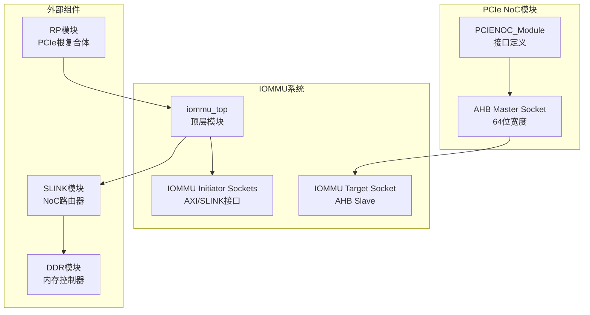

**图表来源**
- [pcienoc/test_pcienoc.hh:10-19](file://pcienoc/test_pcienoc.hh#L10-L19)
- [iommu/iommu_top.hh:47-56](file://iommu/iommu_top.hh#L47-L56)
- [main.cpp:58-79](file://main.cpp#L58-L79)

**章节来源**
- [pcienoc/test_pcienoc.hh:1-21](file://pcienoc/test_pcienoc.hh#L1-L21)
- [iommu/iommu_top.hh:1-503](file://iommu/iommu_top.hh#L1-L503)
- [main.cpp:1-94](file://main.cpp#L1-L94)

## 核心组件

### PCIe NoC模块接口

PCIe NoC接口的核心是一个简单的SystemC模块，提供基本的socket接口用于系统集成：

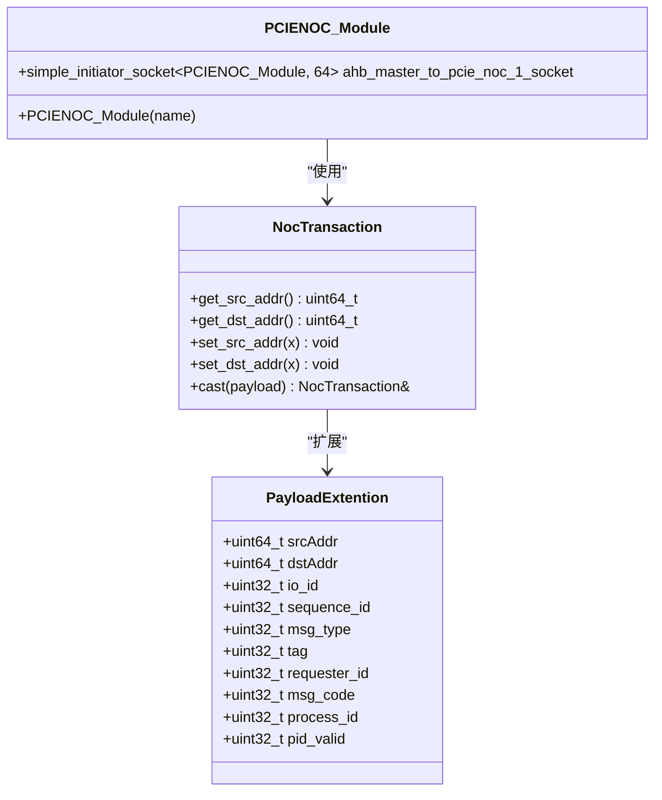

**图表来源**
- [pcienoc/test_pcienoc.hh:10-19](file://pcienoc/test_pcienoc.hh#L10-L19)
- [iommu/include/param_trans_def.hh:104-128](file://iommu/include/param_trans_def.hh#L104-L128)

### IOMMU集成接口

IOMMU模块提供了完整的NoC接口支持，包括多个socket端口用于不同的通信场景：

**章节来源**
- [pcienoc/test_pcienoc.cc:1-3](file://pcienoc/test_pcienoc.cc#L1-L3)
- [iommu/iommu_top.hh:47-56](file://iommu/iommu_top.hh#L47-L56)

## 架构概览

PCIe NoC接口在整个IOMMU系统中的位置和作用如下：

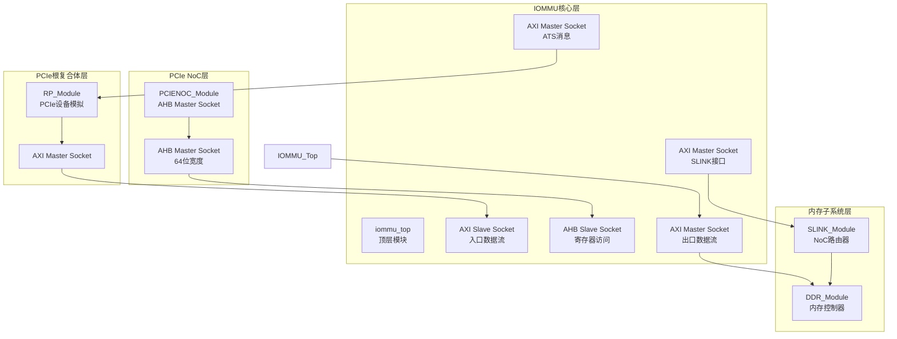

**图表来源**
- [main.cpp:55-79](file://main.cpp#L55-L79)
- [iommu/iommu_top.hh:47-56](file://iommu/iommu_top.hh#L47-L56)

## 详细组件分析

### 通信协议和消息格式

PCIe NoC接口采用TLM（事务级建模）协议进行通信，支持多种消息类型：

#### 消息类型定义

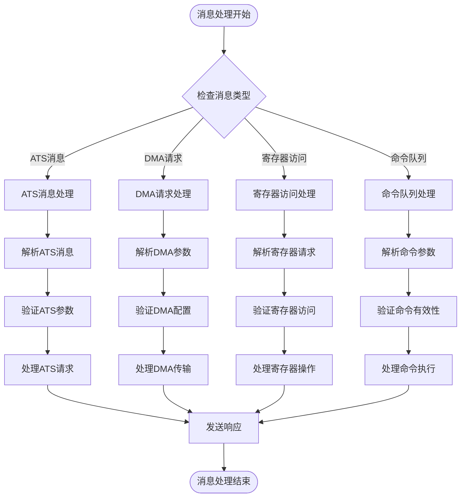

**图表来源**
- [iommu/include/param_trans_def.hh:49-97](file://iommu/include/param_trans_def.hh#L49-L97)
- [iommu/include/iommu_req_rsp.hh:13-49](file://iommu/include/iommu_req_rsp.hh#L13-L49)

#### Payload扩展结构

消息传输通过PayloadExtention结构体扩展TLM通用负载，包含以下关键字段：

**章节来源**
- [iommu/include/param_trans_def.hh:49-97](file://iommu/include/param_trans_def.hh#L49-L97)
- [iommu/iommu_top.cc:140-201](file://iommu/iommu_top.cc#L140-L201)

### 与IOMMU模块的连接方式

PCIe NoC接口通过AHB总线标准与IOMMU模块连接，实现了高效的寄存器访问和控制信号传输：

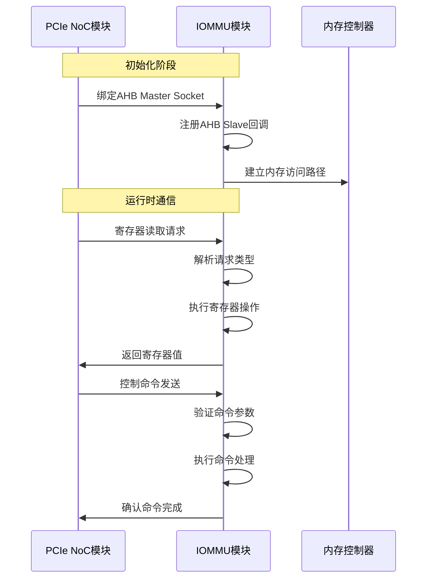

**图表来源**
- [main.cpp:78-79](file://main.cpp#L78-L79)
- [iommu/iommu_top.cc:53-78](file://iommu/iommu_top.cc#L53-L78)

**章节来源**
- [main.cpp:78-79](file://main.cpp#L78-L79)
- [iommu/iommu_top.cc:53-78](file://iommu/iommu_top.cc#L53-L78)

### 数据传输机制

PCIe NoC接口支持多种数据传输模式，包括同步和异步传输：

#### 同步传输流程

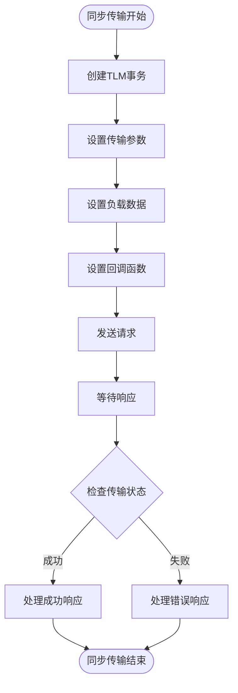

#### 异步传输流程

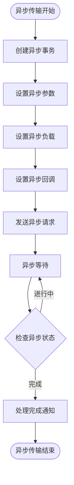

**图表来源**
- [iommu/iommu_top.cc:140-201](file://iommu/iommu_top.cc#L140-L201)
- [iommu/iommu_top.cc:206-274](file://iommu/iommu_top.cc#L206-L274)

**章节来源**
- [iommu/iommu_top.cc:140-201](file://iommu/iommu_top.cc#L140-L201)
- [iommu/iommu_top.cc:206-274](file://iommu/iommu_top.cc#L206-L274)

### 网络拓扑结构和路由机制

PCIe NoC接口采用了灵活的网络拓扑设计，支持多种路由策略：

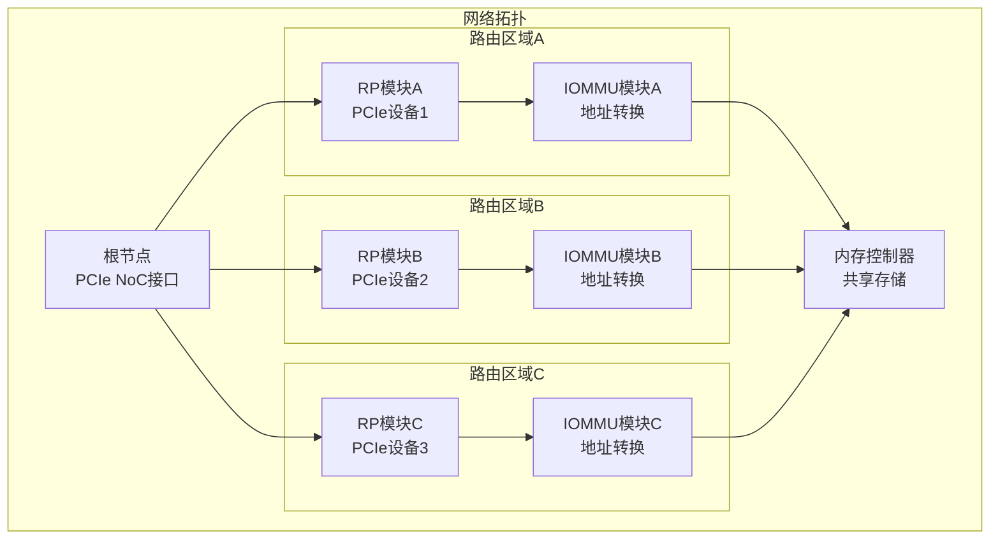

**章节来源**
- [iommu/iommu_top.hh:47-56](file://iommu/iommu_top.hh#L47-L56)
- [main.cpp:64-73](file://main.cpp#L64-L73)

## 依赖关系分析

PCIe NoC接口与系统其他组件的依赖关系如下：

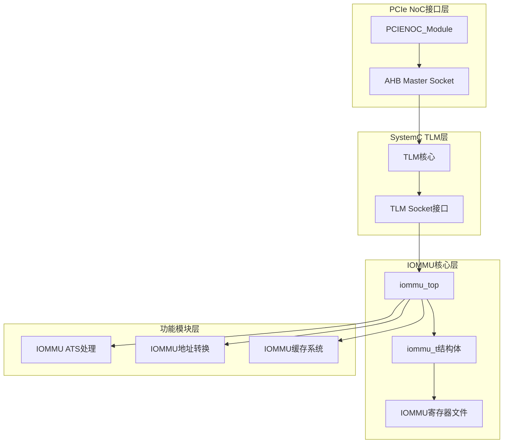

**图表来源**
- [pcienoc/test_pcienoc.hh:10-13](file://pcienoc/test_pcienoc.hh#L10-L13)
- [iommu/iommu_top.hh:44-59](file://iommu/iommu_top.hh#L44-L59)

**章节来源**
- [pcienoc/test_pcienoc.hh:1-21](file://pcienoc/test_pcienoc.hh#L1-L21)
- [iommu/iommu_top.hh:1-102](file://iommu/iommu_top.hh#L1-L102)

## 性能考虑

PCIe NoC接口在性能方面具有以下特点：

### 性能指标

| 指标类别 | 描述 | 当前实现 | 优化建议 |
|---------|------|----------|----------|
| 带宽利用率 | PCIe NoC链路的使用效率 | 通过统计字节计数监控 | 实现动态带宽分配 |
| 延迟特性 | 消息传输的端到端延迟 | 支持微秒级延迟测量 | 优化路由算法 |
| 吞吐量 | 每秒处理的消息数量 | 基于SystemC仿真统计 | 实现流水线处理 |
| 并发处理 | 同时处理的事务数量 | 支持多线程并行处理 | 优化锁机制 |

### 性能监控

系统提供了全面的性能监控机制：

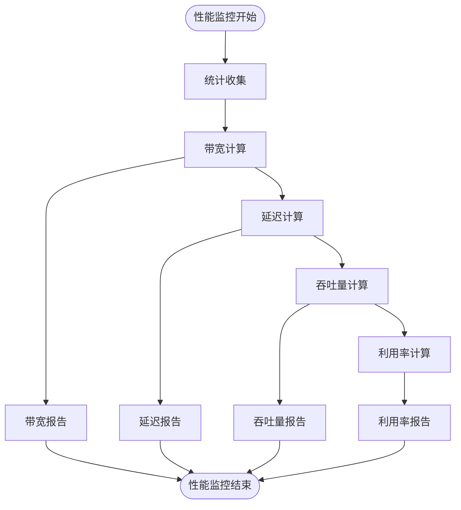

**图表来源**
- [iommu/iommu_top.cc:610-667](file://iommu/iommu_top.cc#L610-L667)

**章节来源**
- [iommu/iommu_top.cc:610-667](file://iommu/iommu_top.cc#L610-L667)
- [PERF_MODEL_IMPLEMENTATION.md:175-214](file://PERF_MODEL_IMPLEMENTATION.md#L175-L214)

## 故障诊断指南

### 常见问题及解决方案

#### 1. 通信超时问题

**症状**: PCIe NoC接口无法建立连接或通信超时

**诊断步骤**:
1. 检查socket绑定是否正确
2. 验证时钟和复位信号
3. 确认数据总线宽度配置
4. 检查仲裁器状态

**解决方案**:
- 确保AHB Master Socket正确绑定到IOMMU Slave Socket
- 检查SystemC仿真时间设置
- 验证TLM协议版本兼容性

#### 2. 数据传输错误

**症状**: 数据传输过程中出现错误或数据损坏

**诊断步骤**:
1. 检查Payload扩展字段完整性
2. 验证消息序列号
3. 确认请求者ID有效性
4. 检查缓冲区状态

**解决方案**:
- 实现数据校验机制
- 添加错误重试逻辑
- 优化缓冲区管理

#### 3. 性能瓶颈识别

**症状**: PCIe NoC接口成为系统性能瓶颈

**诊断步骤**:
1. 分析带宽利用率
2. 检查延迟分布
3. 识别热点区域
4. 评估并发处理能力

**解决方案**:
- 实现流量控制机制
- 优化路由算法
- 增加缓冲区容量

**章节来源**
- [iommu/iommu_top.cc:206-274](file://iommu/iommu_top.cc#L206-L274)
- [iommu/iommu_top.cc:53-78](file://iommu/iommu_top.cc#L53-L78)

### 调试技巧

#### 1. 日志记录策略

系统提供了多层次的日志记录机制：

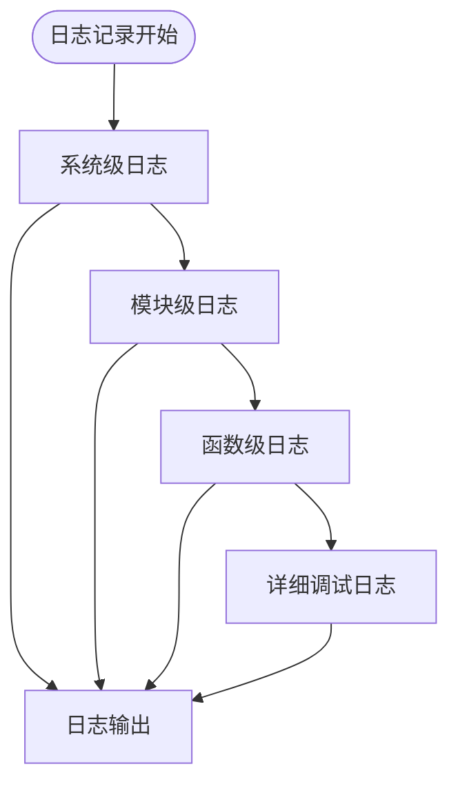

#### 2. 实时监控

- **字节计数监控**: 跟踪入口和出口的数据流量
- **延迟监控**: 测量端到端传输延迟
- **错误统计**: 统计各种类型的错误发生次数
- **性能指标**: 实时显示关键性能指标

**章节来源**
- [iommu/iommu_top.cc:670-689](file://iommu/iommu_top.cc#L670-L689)

## 结论

PCIe NoC接口作为RISC-V IOMMU系统的核心组件，成功实现了以下目标：

1. **高效通信**: 通过SystemC TLM框架提供了高性能的片上网络通信能力
2. **灵活集成**: 支持多种PCIe设备和IOMMU模块的灵活集成
3. **可靠传输**: 实现了完整的错误检测和处理机制
4. **性能优化**: 提供了全面的性能监控和优化能力

该接口的设计充分考虑了实际应用需求，在保证功能完整性的同时，实现了良好的性能表现和可维护性。

## 附录

### 配置参数和初始化流程

#### 初始化参数

| 参数名称 | 类型 | 默认值 | 描述 |
|---------|------|--------|------|
| BUS_WIDTH | 整数 | 64 | 总线宽度（位） |
| FIFO_DEPTH | 整数 | 32 | FIFO深度 |
| MAX_OUTSTANDING | 整数 | 8 | 最大并发请求数 |
| TIMEOUT_NS | 整数 | 1000000 | 超时时间（纳秒） |

#### 初始化流程

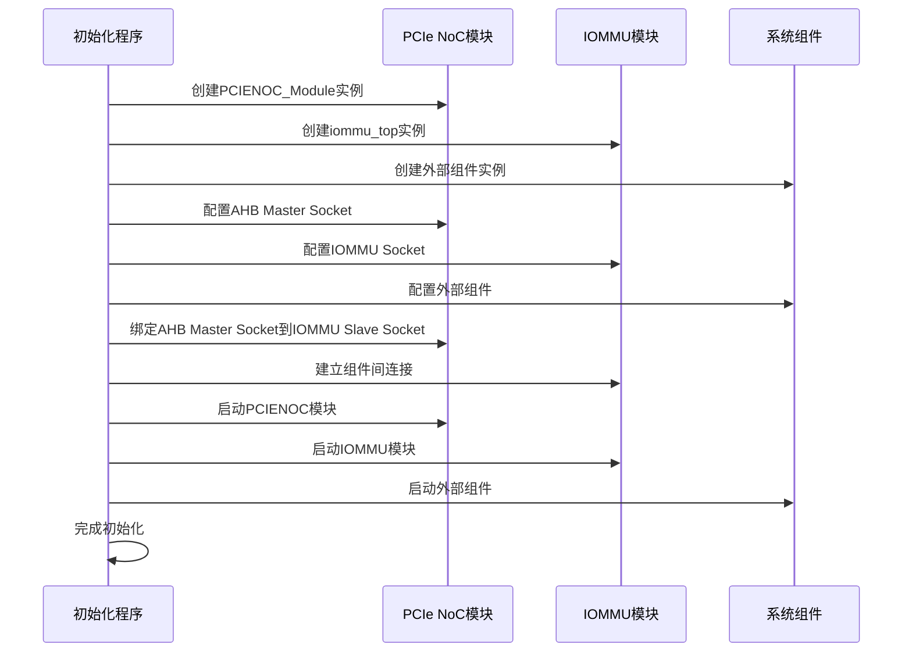

**图表来源**
- [main.cpp:39-94](file://main.cpp#L39-L94)

### 接口测试方法

#### 功能测试

1. **基本连通性测试**: 验证PCIe NoC接口的基本通信功能
2. **消息格式测试**: 检查不同消息类型的正确处理
3. **错误处理测试**: 验证错误情况下的处理机制
4. **边界条件测试**: 测试极端条件下的系统行为

#### 性能测试

1. **吞吐量测试**: 测量最大数据传输速率
2. **延迟测试**: 测量端到端传输延迟
3. **并发测试**: 验证多线程环境下的稳定性
4. **压力测试**: 长时间运行稳定性验证

**章节来源**
- [rp/test_rp_thread.cc:124-322](file://rp/test_rp_thread.cc#L124-L322)
- [PERF_MODEL_IMPLEMENTATION.md:159-179](file://PERF_MODEL_IMPLEMENTATION.md#L159-L179)