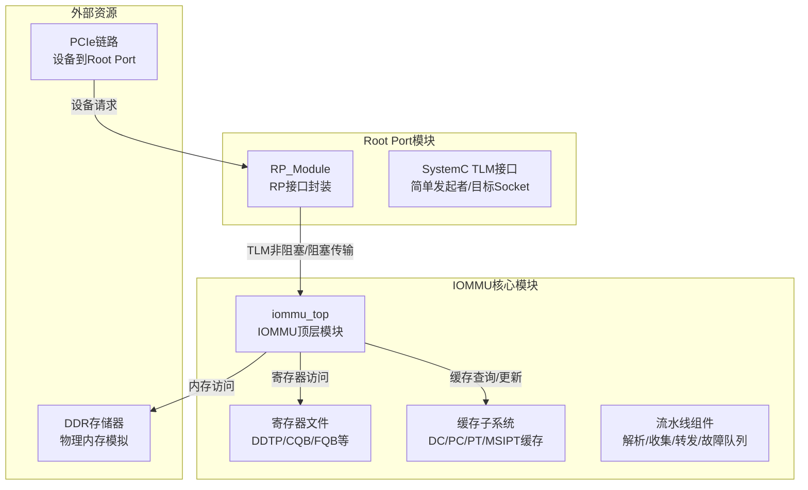
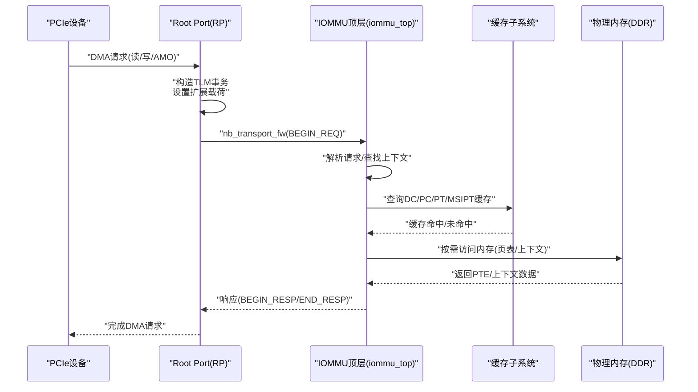
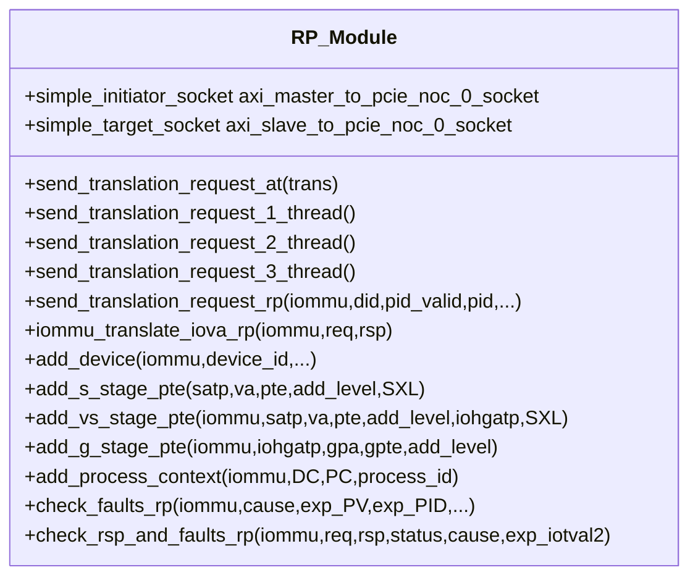
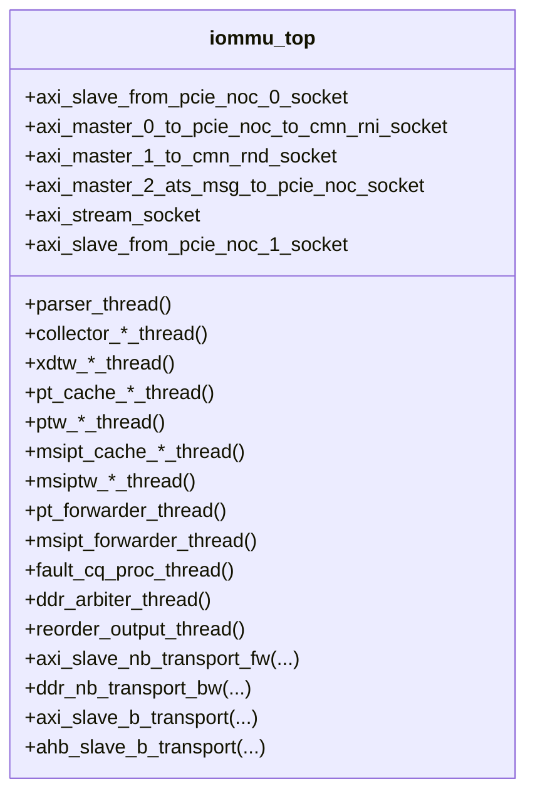
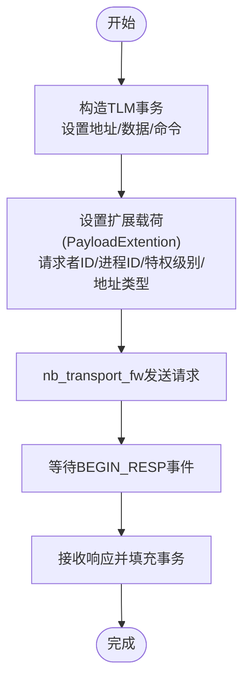
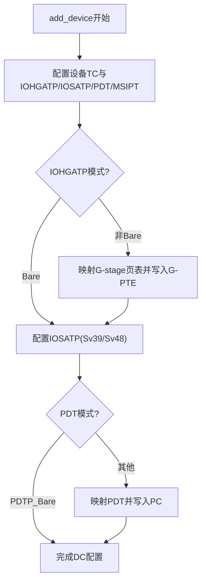
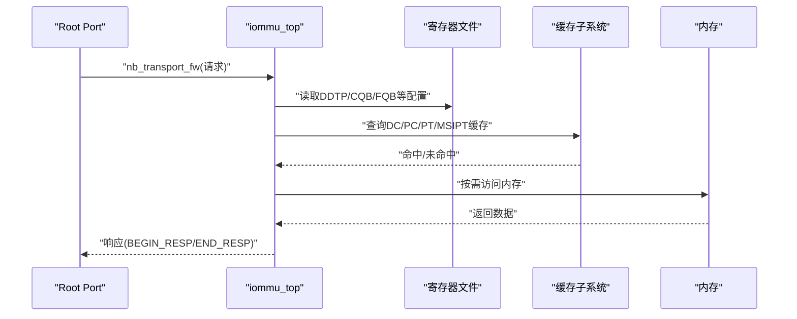
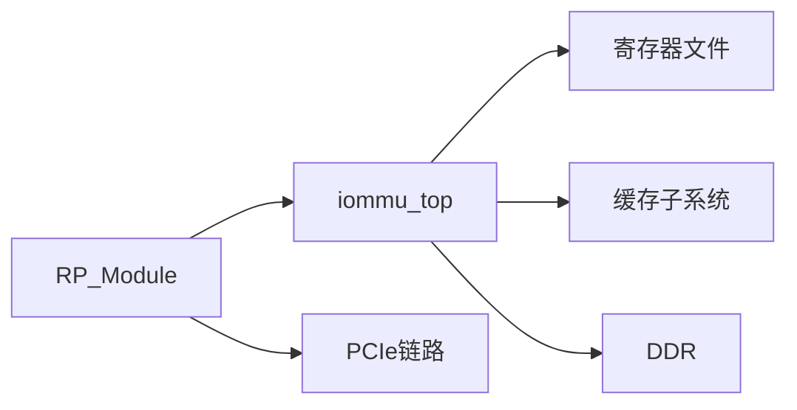
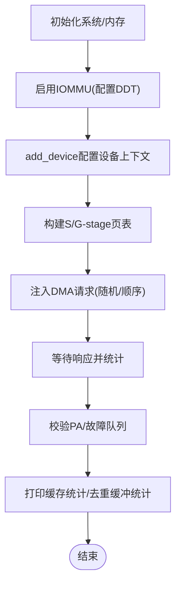

# Root Port接口

<cite>
**本文档引用的文件**
- [rp/test_rp_func.cc](file://rp/test_rp_func.cc)
- [rp/test_rp_thread.cc](file://rp/test_rp_thread.cc)
- [rp/test_rp_sv48_bare_thread.cc](file://rp/test_rp_sv48_bare_thread.cc)
- [rp/test_rp.hh](file://rp/test_rp.hh)
- [iommu/include/iommu_struct.hh](file://iommu/include/iommu_struct.hh)
- [iommu/include/iommu_registers.hh](file://iommu/include/iommu_registers.hh)
- [iommu/iommu_top.hh](file://iommu/iommu_top.hh)
- [iommu/include/iommu_req_rsp.hh](file://iommu/include/iommu_req_rsp.hh)
- [iommu/include/iommu_data_structures.hh](file://iommu/include/iommu_data_structures.hh)
- [iommu/include/iommu_translate.hh](file://iommu/include/iommu_translate.hh)
- [iommu/include/iommu_fault.hh](file://iommu/include/iommu_fault.hh)
- [iommu/include/iommu_interrupt.hh](file://iommu/include/iommu_interrupt.hh)
- [iommu/include/iommu_command_queue.hh](file://iommu/include/iommu_command_queue.hh)
- [iommu/include/iommu_ats.hh](file://iommu/include/iommu_ats.hh)
- [iommu/include/iommu_atc.hh](file://iommu/include/iommu_atc.hh)
- [iommu/include/iommu_hpm.hh](file://iommu/include/iommu_hpm.hh)
- [iommu/include/iommu_ref_api.hh](file://iommu/include/iommu_ref_api.hh)
</cite>

## 目录
1. [简介](#简介)
2. [项目结构](#项目结构)
3. [核心组件](#核心组件)
4. [架构概览](#架构概览)
5. [详细组件分析](#详细组件分析)
6. [依赖关系分析](#依赖关系分析)
7. [性能考虑](#性能考虑)
8. [故障检测与错误处理](#故障检测与错误处理)
9. [测试方法与验证流程](#测试方法与验证流程)
10. [结论](#结论)

## 简介
本文件系统性阐述Root Port（RP）接口在PCIe总线中的作用与实现机制，重点覆盖以下方面：
- Root Port作为PCIe总线接口如何承载设备发起的内存访问请求，并通过TLM（Transaction Level Model）协议与IOMMU核心模块进行交互。
- 设备上下文（Device Context）、进程上下文（Process Context）与页表（Page Table）的管理与操作流程。
- Root Port与IOMMU核心模块的交互序列，包括地址转换请求的处理过程与响应返回机制。
- 接口配置参数、关键数据结构定义与使用示例。
- 故障检测与错误处理机制。
- Root Port的测试方法与验证流程。

## 项目结构
Root Port相关代码主要位于rp目录，配合iommu核心模块共同实现PCIe地址翻译与中断处理功能。整体结构如下：

**图表来源**
- [rp/test_rp.hh:54-95](file://rp/test_rp.hh#L54-L95)
- [iommu/iommu_top.hh:44-93](file://iommu/iommu_top.hh#L44-L93)

**章节来源**
- [rp/test_rp.hh:54-95](file://rp/test_rp.hh#L54-L95)
- [iommu/iommu_top.hh:44-93](file://iommu/iommu_top.hh#L44-L93)

## 核心组件
- Root Port模块（RP_Module）
  - 提供TLM发起者/目标Socket，负责向IOMMU提交地址翻译请求，并接收响应。
  - 实现设备上下文、进程上下文与页表的构建与维护函数。
  - 提供故障记录检查与响应校验工具函数。
- IOMMU顶层模块（iommu_top）
  - 实现IOMMU核心控制逻辑、寄存器文件、缓存子系统与流水线组件。
  - 提供AT回调接口以处理来自RP的非阻塞传输请求。
- 寄存器与数据结构
  - 寄存器定义涵盖能力寄存器、功能控制寄存器、设备目录表指针（DDTP）、命令队列（CQB/CQH/CQT）、故障队列（FQB/FQH/FQT）等。
  - 数据结构定义包括设备上下文、进程上下文、页表项（S/G-PTE）、请求/响应结构体等。

**章节来源**
- [rp/test_rp.hh:54-181](file://rp/test_rp.hh#L54-L181)
- [iommu/iommu_top.hh:44-120](file://iommu/iommu_top.hh#L44-L120)
- [iommu/include/iommu_registers.hh:172-800](file://iommu/include/iommu_registers.hh#L172-L800)
- [iommu/include/iommu_data_structures.hh](file://iommu/include/iommu_data_structures.hh)

## 架构概览
Root Port通过SystemC TLM接口与IOMMU进行交互，典型流程如下：
- 设备发起DMA请求（读/写/AMO），Root Port构造TLM事务并设置扩展载荷（请求者ID、进程ID、特权级别、是否仅读等）。
- Root Port通过非阻塞接口发送请求至IOMMU，等待响应事件。
- IOMMU解析请求，查找设备/进程上下文，执行两阶段地址转换（S/G-stage），查询缓存与页表，生成物理地址。
- IOMMU将响应通过回调接口返回Root Port，Root Port根据状态与PA填充TLM事务并通知等待线程。

**图表来源**
- [rp/test_rp_func.cc:28-89](file://rp/test_rp_func.cc#L28-L89)
- [rp/test_rp_thread.cc:200-367](file://rp/test_rp_thread.cc#L200-L367)
- [iommu/iommu_top.hh:358-376](file://iommu/iommu_top.hh#L358-L376)

**章节来源**
- [rp/test_rp_func.cc:28-89](file://rp/test_rp_func.cc#L28-L89)
- [rp/test_rp_thread.cc:200-367](file://rp/test_rp_thread.cc#L200-L367)
- [iommu/iommu_top.hh:358-376](file://iommu/iommu_top.hh#L358-L376)

## 详细组件分析

### Root Port接口类（RP_Module）
- TLM接口
  - 发起者Socket：用于向IOMMU发送非阻塞/阻塞请求。
  - 目标Socket：用于接收ATS消息（如页请求无效化完成）。
- 请求发送与响应处理
  - 非阻塞模式：通过nb_transport_fw发送请求，等待BEGIN_RESP事件后继续处理。
  - 阻塞模式：通过b_transport直接同步等待响应。
- 设备上下文与页表管理
  - add_device：配置设备上下文（支持Bare/Sv39/Sv48等模式），初始化IOHGATP/IOSATP/PDT/MSIPT等。
  - add_s_stage_pte/add_vs_stage_pte/add_g_stage_pte：构建S/G-stage页表，支持多级页表与不同寻址模式。
  - add_process_context：为指定进程创建PC（进程上下文）。
- 故障记录检查
  - check_faults_rp/check_rsp_and_faults_rp：读取FQH/FQT/FQB，校验故障记录字段（原因码、设备ID、iottval等）。

**图表来源**
- [rp/test_rp.hh:54-181](file://rp/test_rp.hh#L54-L181)

**章节来源**
- [rp/test_rp.hh:54-181](file://rp/test_rp.hh#L54-L181)

### IOMMU顶层模块（iommu_top）
- 控制路径与数据路径
  - 解析线程：解析入站请求，分发到相应处理单元。
  - 缓存子系统：DC/PC/PT/MSIPT缓存查询与更新。
  - PTW/MSIPTW：页表遍历与响应处理。
  - Forwarder：将翻译结果转发至出口。
  - Fault/CQ：故障队列与命令队列处理。
- 寄存器接口
  - 通过寄存器文件访问DDTP、CQB/FQB/PQB、CQCSR/FQCSR/PQCSR等，控制IOMMU行为。
- 回调接口
  - axi_slave_nb_transport_fw：处理来自RP的非阻塞请求。
  - ddr_nb_transport_bw：处理来自DDR的响应。
  - ahb_slave_b_transport：处理AHB寄存器访问。

**图表来源**
- [iommu/iommu_top.hh:44-496](file://iommu/iommu_top.hh#L44-L496)

**章节来源**
- [iommu/iommu_top.hh:44-496](file://iommu/iommu_top.hh#L44-L496)

### TLM协议在Root Port中的应用
- 事务构造
  - 设置地址（IOVA）、数据指针与长度、读/写/AMO命令。
  - 通过PayloadExtention扩展载荷携带请求者ID、进程ID、特权级别、执行请求标志、地址类型等。
- 非阻塞传输
  - 使用nb_transport_fw发送请求，等待BEGIN_RESP事件，随后通过END_RESP完成响应。
- 阻塞传输
  - 使用b_transport直接同步等待响应，适用于简单场景或避免竞态条件。

**图表来源**
- [rp/test_rp_func.cc:28-89](file://rp/test_rp_func.cc#L28-L89)
- [rp/test_rp_thread.cc:229-265](file://rp/test_rp_thread.cc#L229-L265)

**章节来源**
- [rp/test_rp_func.cc:28-89](file://rp/test_rp_func.cc#L28-L89)
- [rp/test_rp_thread.cc:229-265](file://rp/test_rp_thread.cc#L229-L265)

### 设备上下文管理与进程上下文管理
- 设备上下文（DC）
  - add_device：配置设备TC（启用ATS/PRI/T2GPA等）、IOHGATP/IOSATP/PDT/MSIPT等，分配根页并清零。
  - add_dev_context：根据DDT层级（1/2/3级）递归创建DDTE并写入DC。
- 进程上下文（PC）
  - add_process_context：根据PDTP模式（PD8/PD17/PD20）构建PDT树并写入PC。
- 页表操作
  - add_s_stage_pte：构建S-stage页表（支持Sv32/Sv39/Sv48/Sv57）。
  - add_vs_stage_pte：在存在G-stage的情况下，先通过G-stage转换再写入S-stage。
  - add_g_stage_pte：构建G-stage页表（支持Sv32x4/Sv39x4/Sv48x4/Sv57x4）。

**图表来源**
- [rp/test_rp_func.cc:211-299](file://rp/test_rp_func.cc#L211-L299)
- [rp/test_rp_func.cc:402-475](file://rp/test_rp_func.cc#L402-L475)
- [rp/test_rp_func.cc:706-760](file://rp/test_rp_func.cc#L706-L760)

**章节来源**
- [rp/test_rp_func.cc:211-299](file://rp/test_rp_func.cc#L211-L299)
- [rp/test_rp_func.cc:402-475](file://rp/test_rp_func.cc#L402-L475)
- [rp/test_rp_func.cc:706-760](file://rp/test_rp_func.cc#L706-L760)

### Root Port与IOMMU核心模块交互流程
- 请求路径
  - Root Port通过nb_transport_fw将请求传递给iommu_top。
  - iommu_top解析请求，查找设备/进程上下文，执行地址转换。
  - 缓存子系统参与查询，必要时触发PTW/MSIPTW访问内存。
- 响应路径
  - IOMMU将响应通过回调接口返回Root Port，Root Port填充PA并通知等待线程。
- 寄存器与队列
  - 通过寄存器文件（DDTP/CQB/FQB/PQB等）配置IOMMU行为与队列参数。
  - 命令队列与故障队列用于异步处理与故障上报。

**图表来源**
- [rp/test_rp_func.cc:28-89](file://rp/test_rp_func.cc#L28-L89)
- [iommu/iommu_top.hh:358-376](file://iommu/iommu_top.hh#L358-L376)
- [iommu/include/iommu_registers.hh:286-330](file://iommu/include/iommu_registers.hh#L286-L330)

**章节来源**
- [rp/test_rp_func.cc:28-89](file://rp/test_rp_func.cc#L28-L89)
- [iommu/iommu_top.hh:358-376](file://iommu/iommu_top.hh#L358-L376)
- [iommu/include/iommu_registers.hh:286-330](file://iommu/include/iommu_registers.hh#L286-L330)

## 依赖关系分析
- Root Port对IOMMU的依赖
  - 通过TLM接口与iommu_top交互，依赖其解析、缓存与转发能力。
  - 依赖寄存器文件以正确配置DDTP、队列等。
- IOMMU内部模块耦合
  - 解析器与收集器、缓存子系统、PTW/MSIPTW、Forwarder、Fault/CQ之间通过FIFO与事件协调。
- 外部依赖
  - DDR存储器用于访问设备上下文、页表与队列数据。
  - PCIe链路承载设备请求与ATS消息。

**图表来源**
- [rp/test_rp.hh:54-95](file://rp/test_rp.hh#L54-L95)
- [iommu/iommu_top.hh:44-93](file://iommu/iommu_top.hh#L44-L93)

**章节来源**
- [rp/test_rp.hh:54-95](file://rp/test_rp.hh#L54-L95)
- [iommu/iommu_top.hh:44-93](file://iommu/iommu_top.hh#L44-L93)

## 性能考虑
- 缓存命中率
  - 通过DC/PC/PT/MSIPT缓存减少内存访问，提升吞吐量。
  - 提供缓存统计接口，便于评估命中率与优化策略。
- 预取与去重
  - PT去重缓冲区与预取组监控有助于降低重复页表遍历开销。
- 流水线与背压
  - FIFO深度与事件驱动机制平衡并发与延迟，避免拥塞。
- IOPS测量
  - 稳态窗口采样（跳过首尾10%）用于准确评估IOPS。

**章节来源**
- [rp/test_rp_thread.cc:349-361](file://rp/test_rp_thread.cc#L349-L361)
- [rp/test_rp_sv48_bare_thread.cc:203-204](file://rp/test_rp_sv48_bare_thread.cc#L203-L204)
- [iommu/iommu_top.hh:148-178](file://iommu/iommu_top.hh#L148-L178)

## 故障检测与错误处理
- 故障队列（FQ）
  - 通过FQB/FQH/FQT寄存器管理故障队列，记录故障原因、设备ID、iottval等。
  - check_faults_rp/check_rsp_and_faults_rp用于读取并校验故障记录。
- 错误处理流程
  - 当请求失败时，IOMMU将故障记录入队并通过中断上报。
  - Root Port读取故障队列并进行一致性校验，确保故障信息正确。
- ATS与PRI
  - 支持PCIe ATS/PRI接口，处理页请求与无效化消息，保障缓存一致性。

**章节来源**
- [rp/test_rp_func.cc:92-132](file://rp/test_rp_func.cc#L92-L132)
- [rp/test_rp_func.cc:134-179](file://rp/test_rp_func.cc#L134-L179)
- [iommu/include/iommu_registers.hh:374-416](file://iommu/include/iommu_registers.hh#L374-L416)
- [iommu/include/iommu_fault.hh](file://iommu/include/iommu_fault.hh)
- [iommu/include/iommu_ats.hh](file://iommu/include/iommu_ats.hh)

## 测试方法与验证流程
- 单线程测试（随机访问）
  - 构建16MB页表，随机选择500个页面，每页8次请求（共4000次），验证PA正确性与缓存统计。
- 多线程测试（顺序访问）
  - 构建1MB页表，连续125页顺序访问，验证高命中率下的PT缓存效果。
- Sv48+Bare模式测试
  - 配置设备为Sv48+Sv48模式，连续1000次写请求，验证地址转换正确性。
- 并发与阻塞对比
  - 使用nb_transport与b_transport两种方式发送请求，对比响应时机与竞态处理。
- 验证步骤
  - 启用IOMMU（DDT模式），配置设备与页表。
  - 注入请求并等待响应，统计通过/失败数量。
  - 打印缓存命中率与PT去重缓冲统计。
  - 可选：检查故障队列，验证无故障或符合预期。

**图表来源**
- [rp/test_rp_thread.cc:36-82](file://rp/test_rp_thread.cc#L36-L82)
- [rp/test_rp_thread.cc:104-183](file://rp/test_rp_thread.cc#L104-L183)
- [rp/test_rp_sv48_bare_thread.cc:35-96](file://rp/test_rp_sv48_bare_thread.cc#L35-L96)

**章节来源**
- [rp/test_rp_thread.cc:36-82](file://rp/test_rp_thread.cc#L36-L82)
- [rp/test_rp_thread.cc:104-183](file://rp/test_rp_thread.cc#L104-L183)
- [rp/test_rp_sv48_bare_thread.cc:35-96](file://rp/test_rp_sv48_bare_thread.cc#L35-L96)

## 结论
Root Port接口通过SystemC TLM协议与IOMMU核心模块紧密协作，实现了PCIe设备的地址翻译与内存访问控制。通过对设备/进程上下文与页表的精细管理，结合缓存与去重机制，Root Port能够在高并发场景下保持高效与稳定。配套的测试流程覆盖了多种寻址模式与访问模式，能够有效验证地址转换正确性、缓存性能与故障处理能力。