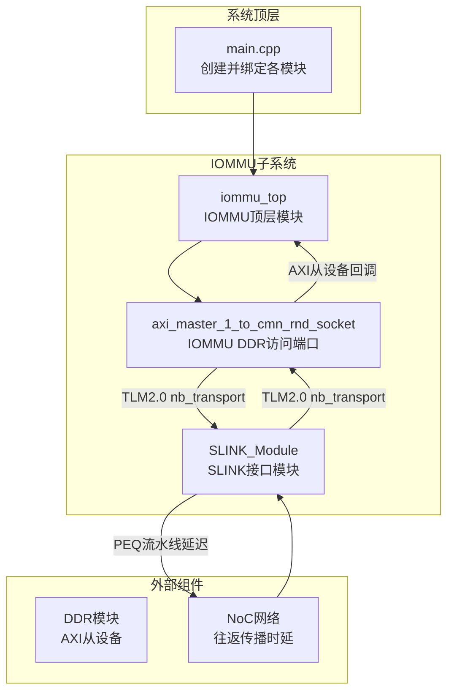
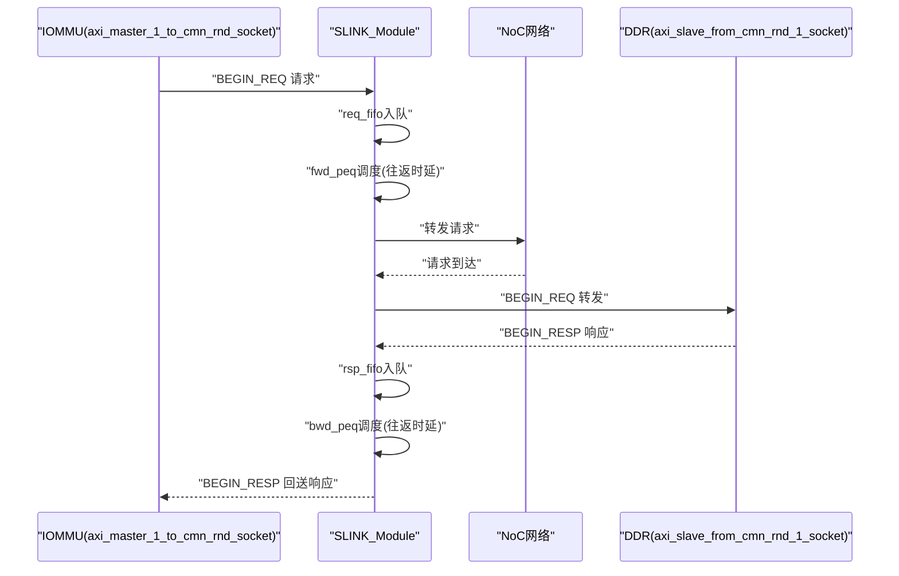
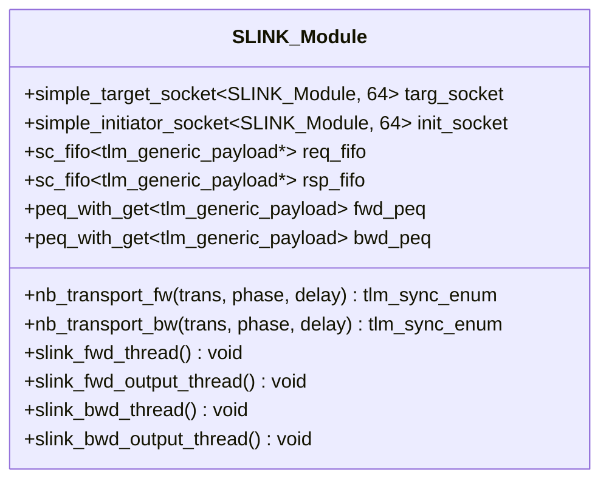
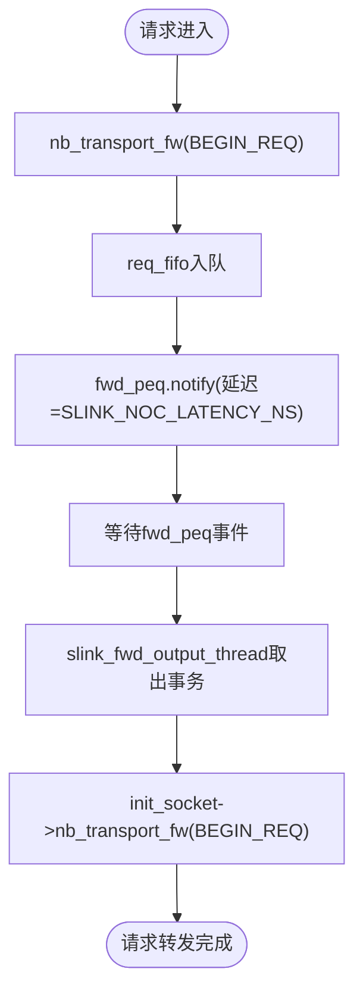
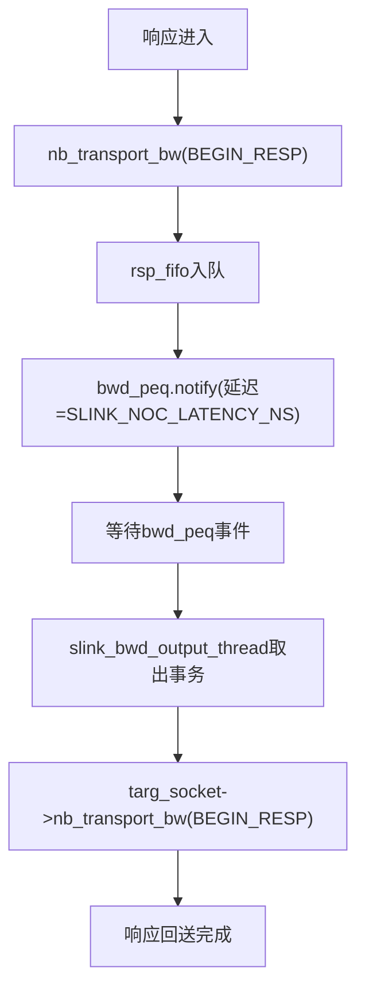
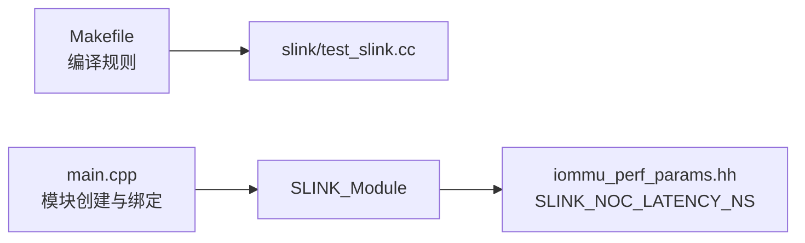

# SLINK接口

<cite>
**本文引用的文件**
- [slink/test_slink.hh](file://slink/test_slink.hh)
- [slink/test_slink.cc](file://slink/test_slink.cc)
- [iommu/iommu_top.hh](file://iommu/iommu_top.hh)
- [iommu/iommu_top.cc](file://iommu/iommu_top.cc)
- [iommu/iommu_perf_model/iommu_perf_params.hh](file://iommu/iommu_perf_model/iommu_perf_params.hh)
- [iommu/iommu_perf_model/iommu_perf_params_t2.hh](file://iommu/iommu_perf_model/iommu_perf_params_t2.hh)
- [Makefile](file://Makefile)
- [main.cpp](file://main.cpp)
- [test_slink_critical.sh](file://test_slink_critical.sh)
- [test_slink_verify.sh](file://test_slink_verify.sh)
- [test_slink_latency.sh](file://test_slink_latency.sh)
</cite>

## 目录
1. [简介](#简介)
2. [项目结构](#项目结构)
3. [核心组件](#核心组件)
4. [架构总览](#架构总览)
5. [详细组件分析](#详细组件分析)
6. [依赖关系分析](#依赖关系分析)
7. [性能考量](#性能考量)
8. [故障排查指南](#故障排查指南)
9. [结论](#结论)
10. [附录](#附录)

## 简介
SLINK接口用于建模IOMMU与片上网络（NoC）之间的互联路径，专门承载IOMMU对页表/目录表等控制平面数据的访问。该接口通过SystemC与TLM2.0实现，采用双向流水线延迟模型（Forward/Backward PEQ）模拟NoC往返传播时延，并以FIFO缓冲适配IOMMU主端口的并发能力。SLINK模块同时作为IOMMU侧的目标socket与DDR侧的发起socket，实现请求与响应的跨方向转发。

## 项目结构
SLINK接口位于独立的slink目录中，配合IOMMU顶层模块进行系统级绑定与运行。关键文件包括：
- SLINK模块定义与实现：slink/test_slink.hh、slink/test_slink.cc
- IOMMU顶层模块：iommu/iommu_top.hh、iommu/iommu_top.cc
- 性能参数配置：iommu/iommu_perf_model/iommu_perf_params.hh、iommu/iommu_perf_model/iommu_perf_params_t2.hh
- 构建与运行脚本：Makefile、main.cpp
- SLINK相关测试脚本：test_slink_critical.sh、test_slink_verify.sh、test_slink_latency.sh

图表来源
- [main.cpp:79-94](file://main.cpp#L79-L94)
- [iommu/iommu_top.hh:48-55](file://iommu/iommu_top.hh#L48-L55)
- [slink/test_slink.hh:23-28](file://slink/test_slink.hh#L23-L28)

章节来源
- [Makefile:93-94](file://Makefile#L93-L94)
- [main.cpp:79-94](file://main.cpp#L79-L94)

## 核心组件
- SLINK_Module：SLINK接口的核心模块，负责：
  - 接收来自IOMMU的请求（目标socket回调）
  - 接收来自DDR的响应（发起socket回调）
  - 请求/响应分别进入各自的FIFO队列
  - 通过Forward/Backward PEQ引入NoC往返传播时延
  - 将请求转发至DDR，将响应回送到IOMMU

- IOMMU顶层模块（iommu_top）：
  - 提供axi_master_1_to_cmn_rnd_socket作为IOMMU侧DDR访问端口
  - 注册nb_transport回调以接收来自SLINK的响应
  - 维护全局outstanding计数与重排序输出机制

- 性能参数：
  - SLINK_NOC_LATENCY_NS：定义NoC单向传播时延（ns）
  - AXI_MASTER_1_TO_CMN_RND_MAX_OUTSTANDING：IOMMU主端口并发上限（与SLINK FIFO深度相匹配）

章节来源
- [slink/test_slink.hh:21-55](file://slink/test_slink.hh#L21-L55)
- [slink/test_slink.cc:6-26](file://slink/test_slink.cc#L6-L26)
- [iommu/iommu_top.hh:48-55](file://iommu/iommu_top.hh#L48-L55)
- [iommu/iommu_top.hh:108-112](file://iommu/iommu_top.hh#L108-L112)
- [iommu/iommu_perf_model/iommu_perf_params.hh:146-147](file://iommu/iommu_perf_model/iommu_perf_params.hh#L146-L147)
- [iommu/iommu_perf_model/iommu_perf_params_t2.hh:140-141](file://iommu/iommu_perf_model/iommu_perf_params_t2.hh#L140-L141)

## 架构总览
SLINK接口在IOMMU与DDR之间充当“桥接器”，其职责是：
- 将IOMMU侧的TLm请求转换为NoC路径上的传输，并引入固定时延
- 将DDR侧返回的响应经由NoC路径回传给IOMMU
- 通过FIFO与PEQ实现解耦与时序建模，避免直接阻塞

图表来源
- [slink/test_slink.cc:32-44](file://slink/test_slink.cc#L32-L44)
- [slink/test_slink.cc:51-59](file://slink/test_slink.cc#L51-L59)
- [slink/test_slink.cc:78-87](file://slink/test_slink.cc#L78-L87)
- [slink/test_slink.cc:106-115](file://slink/test_slink.cc#L106-L115)

## 详细组件分析

### SLINK_Module类图

图表来源
- [slink/test_slink.hh:21-55](file://slink/test_slink.hh#L21-L55)

章节来源
- [slink/test_slink.hh:21-55](file://slink/test_slink.hh#L21-L55)
- [slink/test_slink.cc:6-26](file://slink/test_slink.cc#L6-L26)

### 请求路径处理流程
- IOMMU侧通过目标socket回调发送请求，SLINK立即返回END_REQ，请求进入req_fifo
- slink_fwd_thread持续从req_fifo读取并通知fwd_peq，延迟时间由SLINK_NOC_LATENCY_NS决定
- slink_fwd_output_thread等待fwd_peq事件，取出事务并通过initiator socket转发至DDR

图表来源
- [slink/test_slink.cc:32-44](file://slink/test_slink.cc#L32-L44)
- [slink/test_slink.cc:66-72](file://slink/test_slink.cc#L66-L72)
- [slink/test_slink.cc:78-87](file://slink/test_slink.cc#L78-L87)

章节来源
- [slink/test_slink.cc:32-44](file://slink/test_slink.cc#L32-L44)
- [slink/test_slink.cc:66-72](file://slink/test_slink.cc#L66-L72)
- [slink/test_slink.cc:78-87](file://slink/test_slink.cc#L78-L87)

### 响应路径处理流程
- DDR侧通过发起socket回调发送响应，SLINK立即返回END_RESP，响应进入rsp_fifo
- slink_bwd_thread持续从rsp_fifo读取并通知bwd_peq，延迟时间由SLINK_NOC_LATENCY_NS决定
- slink_bwd_output_thread等待bwd_peq事件，取出事务并通过target socket回送到IOMMU

图表来源
- [slink/test_slink.cc:51-59](file://slink/test_slink.cc#L51-L59)
- [slink/test_slink.cc:94-100](file://slink/test_slink.cc#L94-L100)
- [slink/test_slink.cc:106-115](file://slink/test_slink.cc#L106-L115)

章节来源
- [slink/test_slink.cc:51-59](file://slink/test_slink.cc#L51-L59)
- [slink/test_slink.cc:94-100](file://slink/test_slink.cc#L94-L100)
- [slink/test_slink.cc:106-115](file://slink/test_slink.cc#L106-L115)

### 与IOMMU模块的集成方式
- IOMMU顶层模块提供axi_master_1_to_cmn_rnd_socket作为DDR访问端口，并注册nb_transport回调以接收来自SLINK的响应
- SLINK的initiator socket连接至DDR侧对应端口，target socket连接至IOMMU侧端口
- IOMMU维护axi_master_1_to_cmn_rnd_outstanding计数，确保并发不超过AXI_MASTER_1_TO_CMN_RND_MAX_OUTSTANDING

章节来源
- [iommu/iommu_top.hh:48-55](file://iommu/iommu_top.hh#L48-L55)
- [iommu/iommu_top.hh:458-460](file://iommu/iommu_top.hh#L458-L460)
- [iommu/iommu_top.hh:108-112](file://iommu/iommu_top.hh#L108-L112)
- [iommu/iommu_perf_model/iommu_perf_params.hh:84](file://iommu/iommu_perf_model/iommu_perf_params.hh#L84)

### 初始化与配置参数
- SLINK模块构造函数中完成：
  - 目标/发起socket回调注册
  - req_fifo与rsp_fifo初始化（深度=256，与IOMMU主端口并发上限一致）
  - fwd_peq与bwd_peq初始化
- 关键配置参数：
  - SLINK_NOC_LATENCY_NS：NoC往返传播时延（ns）
  - AXI_MASTER_1_TO_CMN_RND_MAX_OUTSTANDING：IOMMU主端口并发上限（与FIFO深度匹配）

章节来源
- [slink/test_slink.cc:6-26](file://slink/test_slink.cc#L6-L26)
- [slink/test_slink.hh:31-32](file://slink/test_slink.hh#L31-L32)
- [iommu/iommu_perf_model/iommu_perf_params.hh:146-147](file://iommu/iommu_perf_model/iommu_perf_params.hh#L146-L147)
- [iommu/iommu_perf_model/iommu_perf_params.hh:84](file://iommu/iommu_perf_model/iommu_perf_params.hh#L84)

## 依赖关系分析
- 构建依赖：Makefile明确将slink/test_slink.cc纳入构建流程
- 运行依赖：main.cpp中创建并绑定各模块，其中包含SLINK模块实例
- 参数依赖：SLINK模块通过iommu_perf_params.hh引用SLINK_NOC_LATENCY_NS

图表来源
- [Makefile:93-94](file://Makefile#L93-L94)
- [main.cpp:79-94](file://main.cpp#L79-L94)
- [slink/test_slink.cc:6-26](file://slink/test_slink.cc#L6-L26)

章节来源
- [Makefile:93-94](file://Makefile#L93-L94)
- [main.cpp:79-94](file://main.cpp#L79-L94)

## 性能考量
- 时延建模：SLINK_NOC_LATENCY_NS定义了NoC往返传播时延，直接影响IOMMU对DDR访问的端到端性能
- 并发控制：req_fifo与rsp_fifo深度均为256，与AXI_MASTER_1_TO_CMN_RND_MAX_OUTSTANDING保持一致，避免拥塞
- 稳态测量：测试脚本通过提取Steady IOPS、PTW平均执行时延等指标评估性能
- 临界点测试：test_slink_critical.sh与test_slink_verify.sh通过逐步增大SLINK时延观察性能变化，定位瓶颈

章节来源
- [iommu/iommu_perf_model/iommu_perf_params.hh:146-147](file://iommu/iommu_perf_model/iommu_perf_params.hh#L146-L147)
- [slink/test_slink.hh:31-32](file://slink/test_slink.hh#L31-L32)
- [test_slink_critical.sh:10-46](file://test_slink_critical.sh#L10-L46)
- [test_slink_verify.sh:10-53](file://test_slink_verify.sh#L10-L53)

## 故障排查指南
- 时延异常导致吞吐下降：通过test_slink_latency.sh或test_slink_critical.sh逐步调整SLINK_NOC_LATENCY_NS，观察Steady IOPS变化
- 响应未回送：检查slink_bwd_output_thread是否被阻塞，确认bwd_peq事件是否触发
- 请求堆积：检查req_fifo是否持续增长，确认fwd_peq调度是否正常
- 并发超限：核对axi_master_1_to_cmn_rnd_outstanding计数与FIFO深度，避免溢出

章节来源
- [test_slink_latency.sh:9-21](file://test_slink_latency.sh#L9-L21)
- [test_slink_critical.sh:10-46](file://test_slink_critical.sh#L10-L46)
- [slink/test_slink.cc:106-115](file://slink/test_slink.cc#L106-L115)

## 结论
SLINK接口通过PEQ流水线与FIFO缓冲，有效建模了IOMMU与NoC/DDR之间的传播时延与并发特性。其设计简洁、边界清晰，便于在系统级仿真中评估不同NoC时延对IOMMU整体性能的影响。结合提供的测试脚本与参数配置，用户可以快速开展性能验证与瓶颈定位工作。

## 附录

### 接口规范摘要
- 目标socket：接收来自IOMMU的请求（BEGIN_REQ），返回END_REQ
- 发起socket：接收来自DDR的响应（BEGIN_RESP），返回END_RESP
- 时延参数：SLINK_NOC_LATENCY_NS（往返传播时延）
- 并发参数：AXI_MASTER_1_TO_CMN_RND_MAX_OUTSTANDING（主端口并发上限）
- 缓冲深度：req_fifo与rsp_fifo均为256

章节来源
- [slink/test_slink.cc:32-44](file://slink/test_slink.cc#L32-L44)
- [slink/test_slink.cc:51-59](file://slink/test_slink.cc#L51-L59)
- [slink/test_slink.hh:31-32](file://slink/test_slink.hh#L31-L32)
- [iommu/iommu_perf_model/iommu_perf_params.hh:146-147](file://iommu/iommu_perf_model/iommu_perf_params.hh#L146-L147)
- [iommu/iommu_perf_model/iommu_perf_params.hh:84](file://iommu/iommu_perf_model/iommu_perf_params.hh#L84)