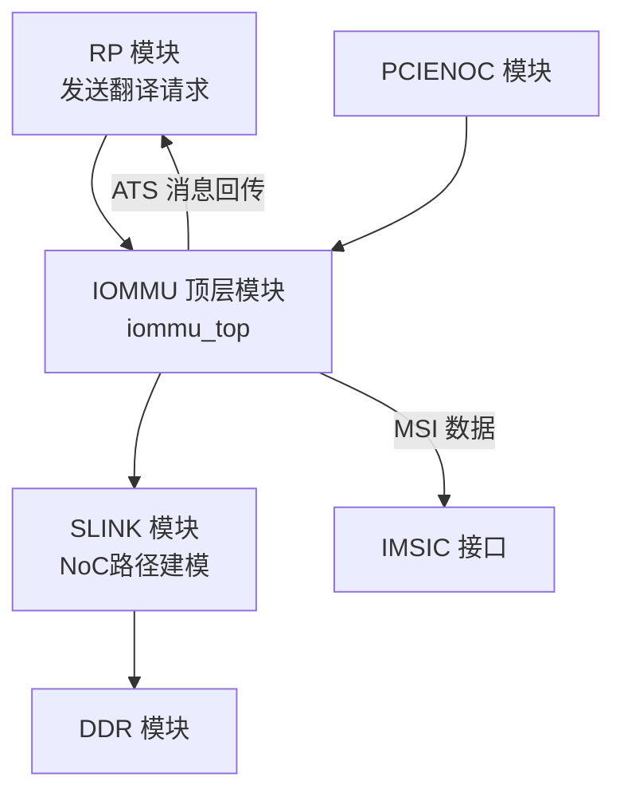
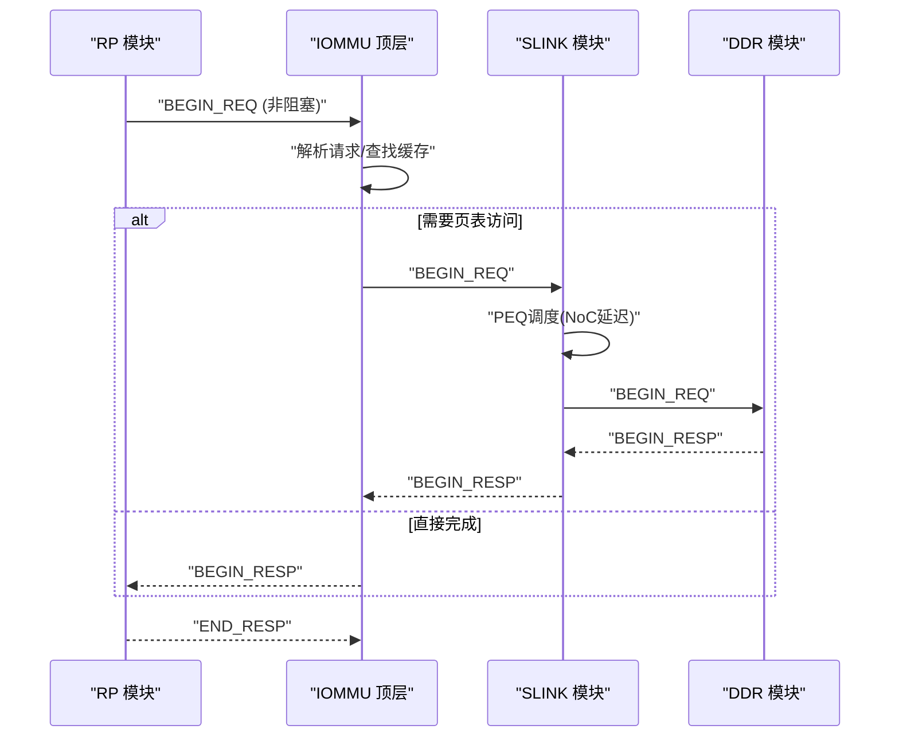
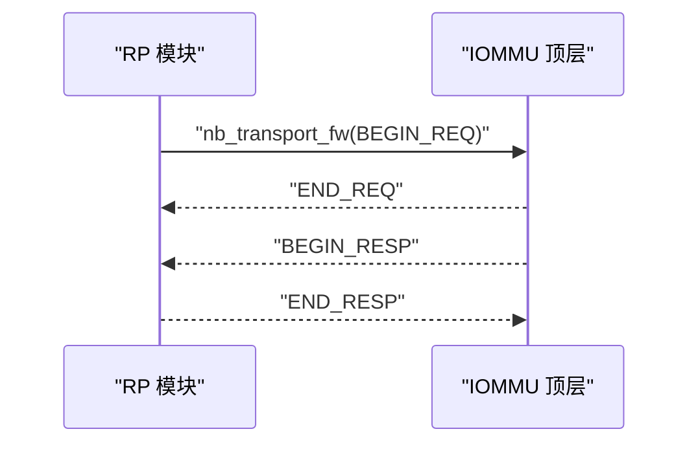
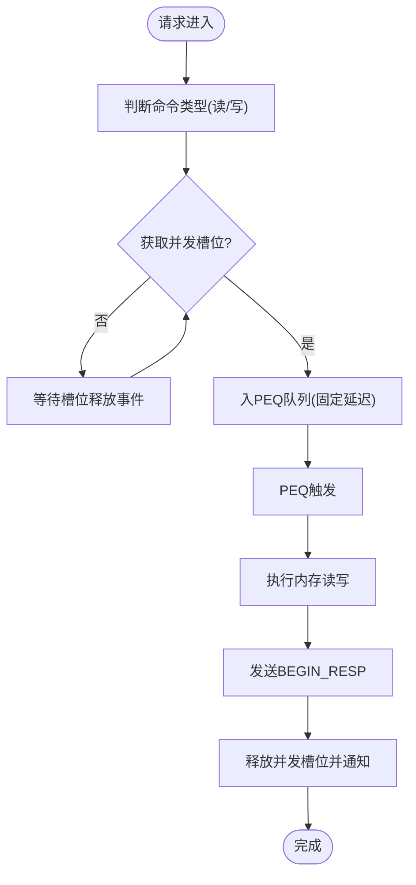
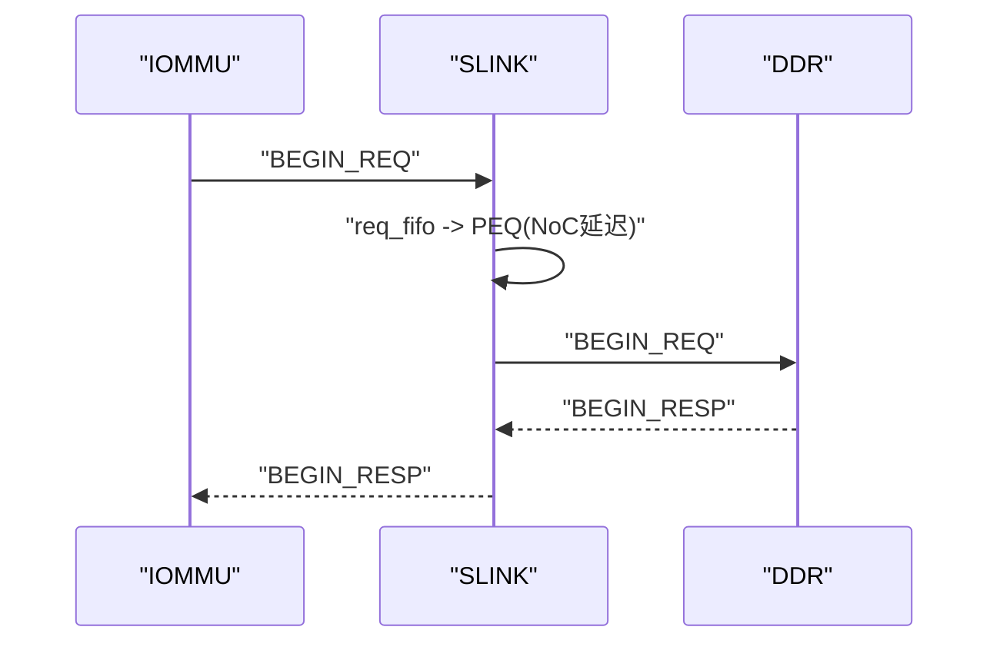
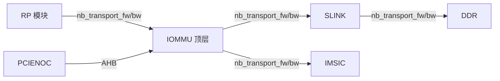

# 外部接口

<cite>
**本文档引用的文件**
- [iommu_top.hh](file://iommu/iommu_top.hh)
- [iommu_top.cc](file://iommu/iommu_top.cc)
- [param_trans_def.hh](file://iommu/include/param_trans_def.hh)
- [iommu_req_rsp.hh](file://iommu/include/iommu_req_rsp.hh)
- [iommu_struct.hh](file://iommu/include/iommu_struct.hh)
- [iommu_perf_params.hh](file://iommu/iommu_perf_model/iommu_perf_params.hh)
- [test_rp.hh](file://rp/test_rp.hh)
- [test_rp_func.cc](file://rp/test_rp_func.cc)
- [test_pcienoc.hh](file://pcienoc/test_pcienoc.hh)
- [test_ddr.hh](file://ddr/test_ddr.hh)
- [test_ddr.cc](file://ddr/test_ddr.cc)
- [test_slink.hh](file://slink/test_slink.hh)
- [test_slink.cc](file://slink/test_slink.cc)
- [main.cpp](file://main.cpp)
- [default_config.json](file://iommu/cache_config/default_config.json)
</cite>

## 目录
1. [简介](#简介)
2. [项目结构](#项目结构)
3. [核心组件](#核心组件)
4. [架构总览](#架构总览)
5. [详细组件分析](#详细组件分析)
6. [依赖关系分析](#依赖关系分析)
7. [性能考量](#性能考量)
8. [故障排查指南](#故障排查指南)
9. [结论](#结论)
10. [附录](#附录)

## 简介
本文件聚焦于IOMMU外部接口的设计与实现，涵盖与Root Port（RP）、PCIe NoC、DDR控制器以及SLINK接口的连接方式与通信协议。重点解释TLM（Transaction Level Modeling）协议在SystemC中的使用、消息格式定义、接口配置参数、连接示例、数据传输机制与时序要求，并提供测试方法与验证流程，最后给出接口扩展与自定义的指导原则。

## 项目结构
该仓库采用模块化设计，IOMMU顶层模块通过SystemC TLM sockets与RP、PCIe NoC、DDR、SLINK等外部模块互联。主程序负责实例化并绑定各模块之间的socket，形成端到端的仿真链路。

图表来源
- [main.cpp:64-79](file://main.cpp#L64-L79)
- [iommu_top.hh:47-55](file://iommu/iommu_top.hh#L47-L55)
- [test_rp.hh:54-94](file://rp/test_rp.hh#L54-L94)
- [test_slink.hh:21-55](file://slink/test_slink.hh#L21-L55)
- [test_ddr.hh:17-61](file://ddr/test_ddr.hh#L17-L61)

章节来源
- [main.cpp:39-94](file://main.cpp#L39-L94)
- [iommu_top.hh:44-496](file://iommu/iommu_top.hh#L44-L496)

## 核心组件
- IOMMU顶层模块（iommu_top）：提供多路TLM socket，承载来自RP的请求、向DDR发起的页表访问、MSI数据转发、ATS消息回传等。
- Root Port（RP）：以非阻塞TLM方式向IOMMU提交翻译请求，接收翻译响应与ATS消息。
- PCIe NoC（PCIENOC）：作为AHB接口桥接，连接IOMMU的AHB侧slave socket。
- SLINK：建模IOMMU到DDR的NoC路径，引入PEQ延迟与FIFO队列，模拟网络时延。
- DDR：实现非阻塞与阻塞两种传输模式，维护读写并发控制与内部延迟。

章节来源
- [iommu_top.hh:47-55](file://iommu/iommu_top.hh#L47-L55)
- [test_rp.hh:54-94](file://rp/test_rp.hh#L54-L94)
- [test_slink.hh:21-55](file://slink/test_slink.hh#L21-L55)
- [test_ddr.hh:17-61](file://ddr/test_ddr.hh#L17-L61)

## 架构总览
IOMMU外部接口围绕TLM非阻塞回调（nb_transport_fw/bw）构建，请求从RP进入IOMMU，经解析与缓存查询后，必要时通过SLINK访问DDR，最终在IOMMU内部完成翻译并向RP返回响应。同时，MSI数据通过独立socket直接转发至IMSIC。

图表来源
- [iommu_top.cc:138-200](file://iommu/iommu_top.cc#L138-L200)
- [test_slink.cc:32-116](file://slink/test_slink.cc#L32-L116)
- [test_ddr.cc:31-127](file://ddr/test_ddr.cc#L31-L127)

## 详细组件分析

### Root Port（RP）接口
- 接口角色：发起翻译请求，接收翻译响应与ATS消息。
- 通信协议：使用SystemC TLM非阻塞回调，请求阶段返回END_REQ，响应阶段在收到BEGIN_RESP后返回END_RESP。
- 请求消息格式：基于hb_to_iommu_req_t，包含设备ID、进程ID、地址类型（Untranslated/Translated/ATS Request）、IOVA、长度、读写/AMO标志等。
- 响应消息格式：基于iommu_to_hb_rsp_t，包含状态码与翻译结果（PPN、权限位、是否MSI/MRIF等）。

图表来源
- [test_rp_func.cc:28-89](file://rp/test_rp_func.cc#L28-L89)
- [iommu_top.cc:138-200](file://iommu/iommu_top.cc#L138-L200)
- [iommu_req_rsp.hh:36-103](file://iommu/include/iommu_req_rsp.hh#L36-L103)

章节来源
- [test_rp.hh:54-181](file://rp/test_rp.hh#L54-L181)
- [test_rp_func.cc:28-89](file://rp/test_rp_func.cc#L28-L89)
- [iommu_req_rsp.hh:13-103](file://iommu/include/iommu_req_rsp.hh#L13-L103)

### PCIe NoC（PCIENOC）接口
- 接口角色：AHB侧slave，桥接到IOMMU的AHB接口。
- 连接方式：PCIENOC的initiator socket绑定到IOMMU的AHB target socket。
- 用途：承载寄存器访问等AHB事务，属于非高性能路径。

章节来源
- [test_pcienoc.hh:10-21](file://pcienoc/test_pcienoc.hh#L10-L21)
- [main.cpp:78-79](file://main.cpp#L78-L79)

### DDR控制器接口
- 接口角色：提供页表/目录表访问与控制路径的存储服务。
- 通信协议：非阻塞（nb_transport_fw/bw）与阻塞（b_transport）混合使用。主DDR socket使用非阻塞模式，RP直连内存访问使用阻塞模式。
- 并发控制：读写独立的outstanding计数器与事件，确保并发上限与有序释放。
- 内部延迟：通过PEQ在固定延迟后产生响应，保持FIFO顺序。

图表来源
- [test_ddr.cc:55-127](file://ddr/test_ddr.cc#L55-L127)
- [test_ddr.hh:17-61](file://ddr/test_ddr.hh#L17-L61)

章节来源
- [test_ddr.cc:31-153](file://ddr/test_ddr.cc#L31-L153)
- [test_ddr.hh:17-61](file://ddr/test_ddr.hh#L17-L61)

### SLINK接口（IOMMU到DDR的NoC路径）
- 接口角色：建模NoC路径上的请求/响应延迟，使用FIFO与PEQ实现流水线。
- 连接方式：IOMMU的axi_master_1_to_cmn_rnd_socket绑定到SLINK的target socket；SLINK的initiator socket绑定到DDR的axi_slave_from_cmn_rnd_1_socket。
- 时序特性：请求与响应分别通过独立FIFO与PEQ，延迟为固定值（NS级），保证顺序性。

图表来源
- [test_slink.cc:66-116](file://slink/test_slink.cc#L66-L116)
- [test_slink.hh:21-55](file://slink/test_slink.hh#L21-L55)

章节来源
- [test_slink.cc:6-26](file://slink/test_slink.cc#L6-L26)
- [test_slink.cc:32-116](file://slink/test_slink.cc#L32-L116)
- [test_slink.hh:21-55](file://slink/test_slink.hh#L21-L55)

### IOMMU外部Socket与消息格式
- Socket定义：包含AXI流（MSI数据）、AXI主口（DMA/RP访问）、AXI主口（页表访问）、AXI从口（RP ATS回传）、AHB从口（寄存器访问）等。
- TLM扩展：PayloadExtention携带请求者ID、PID、执行/特权请求、地址类型等字段，封装在tlm_generic_payload扩展中。
- 请求/响应结构：hb_to_iommu_req_t与iommu_to_hb_rsp_t，定义了设备上下文、地址转换类型、权限位、MSI/MRIF标识等。

章节来源
- [iommu_top.hh:47-55](file://iommu/iommu_top.hh#L47-L55)
- [param_trans_def.hh:12-97](file://iommu/include/param_trans_def.hh#L12-L97)
- [iommu_req_rsp.hh:13-103](file://iommu/include/iommu_req_rsp.hh#L13-L103)

## 依赖关系分析
- 绑定关系：main.cpp中完成所有socket绑定，形成RP↔IOMMU↔(SLINK↔DDR)与RP↔IOMMU↔(AHB)的完整链路。
- 回调注册：IOMMU在构造函数中注册nb_transport_fw/bw回调，RP注册nb_transport_bw与b_transport回调，SLINK注册双向nb_transport回调，DDR注册nb_transport_fw/bw与b_transport回调。
- 模块耦合：IOMMU与RP之间通过TLM非阻塞接口解耦；IOMMU与SLINK/DDR之间通过NoC建模解耦；PCIENOC仅承担AHB桥接职责。

图表来源
- [main.cpp:64-79](file://main.cpp#L64-L79)
- [iommu_top.cc:456-464](file://iommu/iommu_top.cc#L456-L464)
- [test_rp.hh:83-121](file://rp/test_rp.hh#L83-L121)
- [test_slink.cc:12-16](file://slink/test_slink.cc#L12-L16)
- [test_ddr.cc:16-25](file://ddr/test_ddr.cc#L16-L25)

章节来源
- [main.cpp:39-94](file://main.cpp#L39-L94)
- [iommu_top.cc:456-464](file://iommu/iommu_top.cc#L456-L464)
- [test_rp.hh:83-121](file://rp/test_rp.hh#L83-L121)
- [test_slink.cc:12-16](file://slink/test_slink.cc#L12-L16)
- [test_ddr.cc:16-25](file://ddr/test_ddr.cc#L16-L25)

## 性能考量
- 带宽与延迟：端口带宽参数通过频率×位宽计算，带宽延迟公式为delay_ns = 1000 × length × 8 / bandwidth_mbps。不同端口（Slave 0、Master 0、Master 1）具有不同的带宽与延迟特性。
- 并发限制：IOMMU对外部端口设置了最大outstanding限制，避免拥塞；DDR侧同样维护读写独立的并发上限。
- 流水与排队：SLINK与DDR均使用FIFO与PEQ实现流水线与延迟建模，保证时序与顺序性。
- FIFO深度：各管道阶段的FIFO深度在性能参数中集中定义，便于平衡吞吐与资源占用。

章节来源
- [iommu_perf_params.hh:88-101](file://iommu/iommu_perf_model/iommu_perf_params.hh#L88-L101)
- [iommu_perf_params.hh:146-147](file://iommu/iommu_perf_model/iommu_perf_params.hh#L146-L147)
- [iommu_perf_params.hh:78-83](file://iommu/iommu_perf_model/iommu_perf_params.hh#L78-L83)
- [iommu_perf_params.hh:84-87](file://iommu/iommu_perf_model/iommu_perf_params.hh#L84-L87)

## 故障排查指南
- 回调注册检查：确认IOMMU与各模块的nb_transport_fw/bw回调均已正确注册。
- Socket绑定检查：核对main.cpp中的绑定顺序与目标socket名称，确保请求路径正确。
- 响应时序：RP侧需在收到BEGIN_RESP后立即返回END_RESP，避免死锁。
- DDR并发：若出现长时间无响应，检查read/write outstanding计数与释放事件是否正常触发。
- 日志定位：利用各模块打印的事件日志（如“[RP_RSP] nb_transport_bw”、“[DDR_DISPATCH]”、“[SLINK]”）定位问题阶段。

章节来源
- [iommu_top.cc:138-200](file://iommu/iommu_top.cc#L138-L200)
- [test_ddr.cc:55-127](file://ddr/test_ddr.cc#L55-L127)
- [test_slink.cc:66-116](file://slink/test_slink.cc#L66-L116)
- [test_rp.hh:96-121](file://rp/test_rp.hh#L96-L121)

## 结论
本IOMMU外部接口以SystemC TLM为核心，通过明确的socket定义、标准化的消息格式与严格的时序控制，实现了与RP、PCIe NoC、DDR及SLINK的高效互联。结合性能参数与测试模块，可在仿真环境中快速验证接口行为与性能瓶颈，为后续扩展与优化提供坚实基础。

## 附录

### 接口配置参数与连接示例
- 接口配置参数（示例来源）：端口带宽、并发上限、FIFO深度、NoC延迟、DDR延迟与带宽等。
- 连接示例（main.cpp）：展示了IOMMU与RP、PCIENOC、SLINK、DDR之间的socket绑定关系。

章节来源
- [iommu_perf_params.hh:88-101](file://iommu/iommu_perf_model/iommu_perf_params.hh#L88-L101)
- [iommu_perf_params.hh:78-83](file://iommu/iommu_perf_model/iommu_perf_params.hh#L78-L83)
- [iommu_perf_params.hh:146-147](file://iommu/iommu_perf_model/iommu_perf_params.hh#L146-L147)
- [main.cpp:64-79](file://main.cpp#L64-L79)

### TLM协议与消息格式定义
- TLM扩展：PayloadExtention包含请求者ID、PID、执行/特权请求、地址类型等字段。
- 请求/响应结构：hb_to_iommu_req_t与iommu_to_hb_rsp_t定义了完整的请求与响应语义。

章节来源
- [param_trans_def.hh:12-97](file://iommu/include/param_trans_def.hh#L12-L97)
- [iommu_req_rsp.hh:13-103](file://iommu/include/iommu_req_rsp.hh#L13-L103)

### 接口测试方法与验证流程
- RP测试：通过RP模块构造请求，验证IOMMU翻译结果与故障记录。
- SLINK测试：验证NoC路径延迟与顺序性。
- DDR测试：验证读写并发控制与响应时序。
- 端到端验证：在main.cpp中运行仿真，观察各模块交互与统计数据。

章节来源
- [test_rp_func.cc:28-89](file://rp/test_rp_func.cc#L28-L89)
- [test_slink.cc:66-116](file://slink/test_slink.cc#L66-L116)
- [test_ddr.cc:55-127](file://ddr/test_ddr.cc#L55-L127)
- [main.cpp:82-83](file://main.cpp#L82-L83)

### 接口扩展与自定义指导
- 新增端口：在iommu_top.hh中声明新的simple_initiator_socket/simple_target_socket，并在构造函数中注册回调与线程。
- 自定义消息格式：在param_trans_def.hh中扩展PayloadExtention字段，或新增专用结构体并通过tlm_extension机制传递。
- 参数化配置：在default_config.json与iommu_perf_params.hh中增加新参数，确保与仿真参数一致。
- 时序与并发：遵循现有FIFO/PEQ/事件模式，避免破坏pipeline顺序与并发控制。

章节来源
- [iommu_top.hh:47-55](file://iommu/iommu_top.hh#L47-L55)
- [param_trans_def.hh:12-97](file://iommu/include/param_trans_def.hh#L12-L97)
- [default_config.json:1-69](file://iommu/cache_config/default_config.json#L1-L69)
- [iommu_perf_params.hh:6-68](file://iommu/iommu_perf_model/iommu_perf_params.hh#L6-L68)