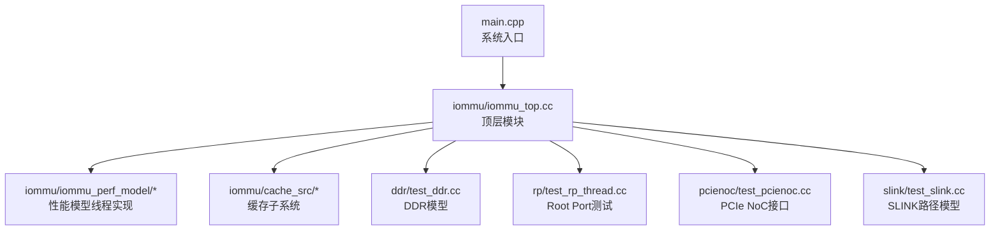
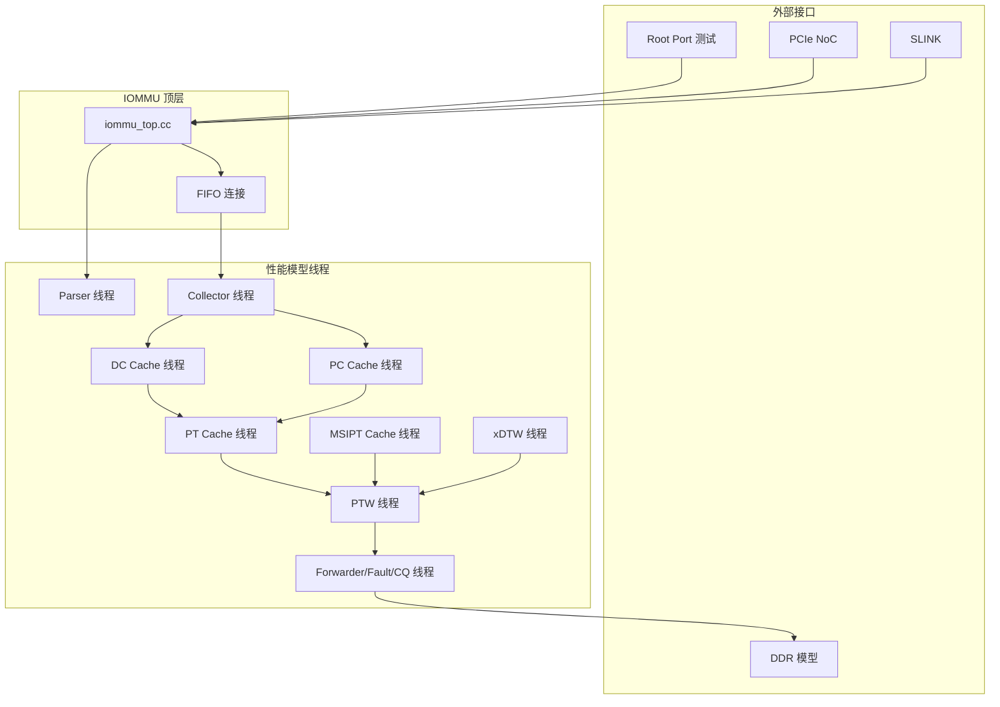
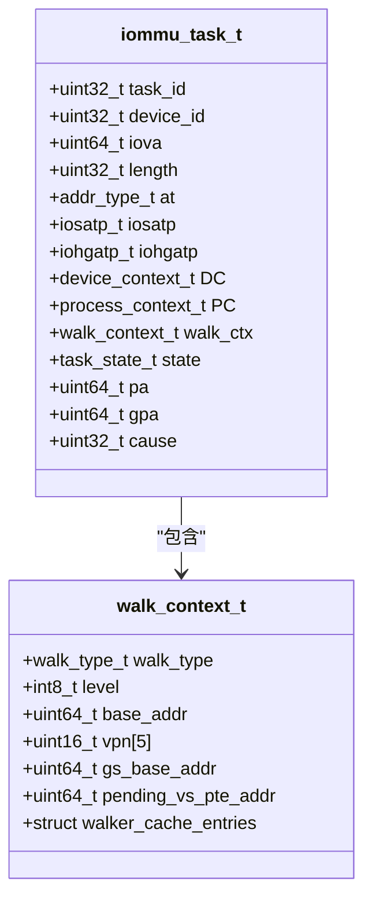
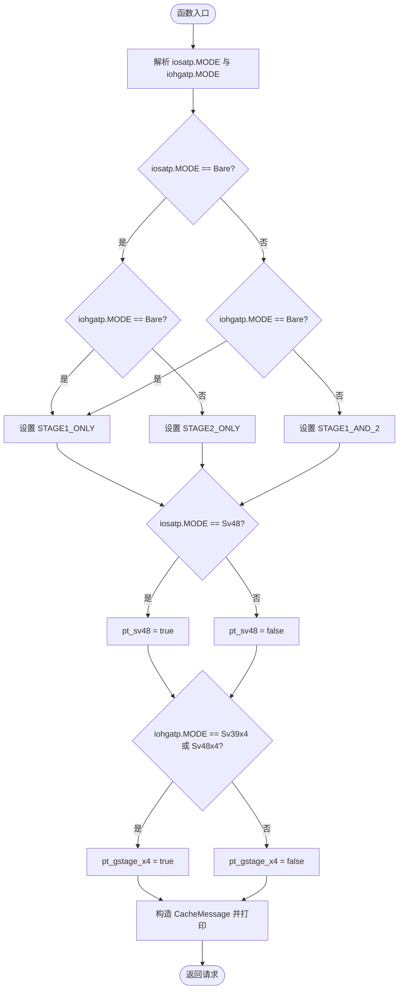
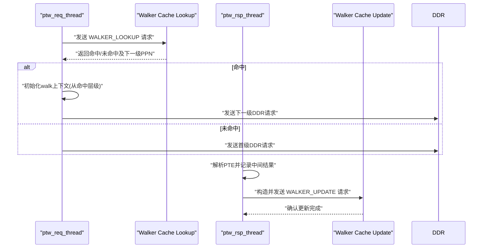
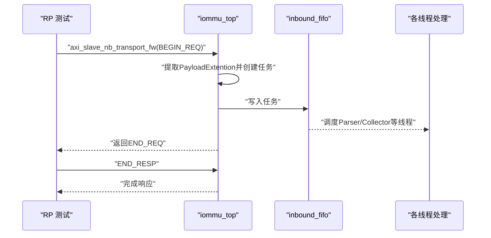
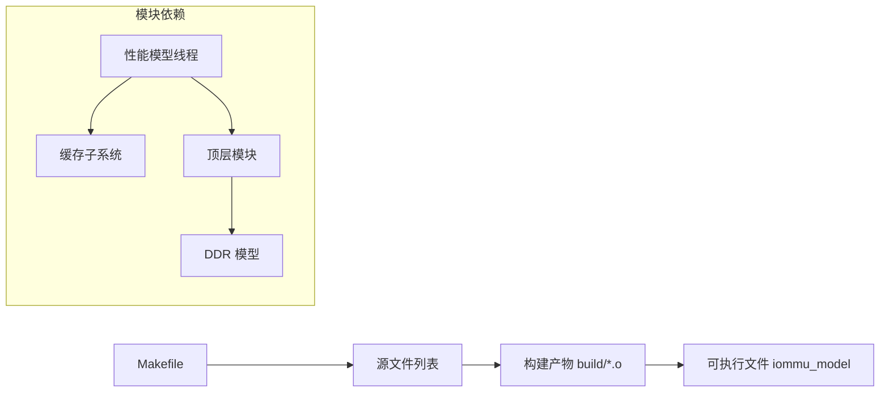

# 开发指南

<cite>
**本文引用的文件**
- [README.md](file://README.md)
- [Makefile](file://Makefile)
- [REFACTOR_SUMMARY.md](file://REFACTOR_SUMMARY.md)
- [TASK_TO_PT_REQUEST_MODIFICATION.md](file://TASK_TO_PT_REQUEST_MODIFICATION.md)
- [PERF_MODEL_IMPLEMENTATION.md](file://PERF_MODEL_IMPLEMENTATION.md)
- [CACHE_PERFORMANCE_ANALYSIS_500REQ.md](file://CACHE_PERFORMANCE_ANALYSIS_500REQ.md)
- [GDB_DEBUG_GUIDE.md](file://GDB_DEBUG_GUIDE.md)
- [WALKER_CACHE_INTEGRATION_PLAN.md](file://WALKER_CACHE_INTEGRATION_PLAN.md)
- [compile_wsl.sh](file://compile_wsl.sh)
- [run_wsl.sh](file://run_wsl.sh)
- [check_order.sh](file://check_order.sh)
- [check_ports.sh](file://check_ports.sh)
- [main.cpp](file://main.cpp)
- [iommu/iommu_top.cc](file://iommu/iommu_top.cc)
- [iommu/include/iommu_task.hh](file://iommu/include/iommu_task.hh)
- [iommu/iommu_perf_model/iommu_task_cache_convert.cc](file://iommu/iommu_perf_model/iommu_task_cache_convert.cc)
</cite>

## 目录
1. [简介](#简介)
2. [项目结构](#项目结构)
3. [核心组件](#核心组件)
4. [架构总览](#架构总览)
5. [详细组件分析](#详细组件分析)
6. [依赖关系分析](#依赖关系分析)
7. [性能考量](#性能考量)
8. [故障排查指南](#故障排查指南)
9. [结论](#结论)
10. [附录](#附录)

## 简介
本指南面向RISC-V IOMMU项目的开发者，提供从环境搭建、编码规范、代码审查、测试要求到构建系统与跨平台编译的全流程开发指导。文档重点涵盖：
- 性能模型重构与SPEC v4对齐的实现要点
- 任务到页表请求转换的精确化修改
- 构建系统（Makefile）与编译选项详解
- 跨WSL与Windows编译器的配置方法
- Walker Cache集成方案与性能分析
- 调试与验证流程、质量保证措施与最佳实践

## 项目结构
项目采用模块化组织，核心IOMMU功能位于iommu目录，测试模块分布在rp、pcienoc、ddr、slink等目录，顶层入口为main.cpp，构建系统通过Makefile统一管理。

图表来源
- [main.cpp:39-94](file://main.cpp#L39-L94)
- [iommu/iommu_top.cc:1-200](file://iommu/iommu_top.cc#L1-L200)

章节来源
- [README.md:63-76](file://README.md#L63-L76)
- [Makefile:42-84](file://Makefile#L42-L84)

## 核心组件
- 顶层模块与接口：负责Socket绑定、非阻塞回调、带宽控制与任务创建。
- 性能模型线程：Parser、Collector、DC/PC Cache、PT Cache、MSIPT Cache、xDTW、PTW、Forwarder/Fault/CQ等20个线程协同工作。
- 缓存子系统：包含Walker Cache三级中间结果缓存与替换策略。
- DDR模型：支持阻塞与非阻塞接口，异步响应与上下文恢复。
- 测试模块：Root Port、PCIe NoC、SLINK、DDR等测试组件。

章节来源
- [REFACTOR_SUMMARY.md:20-105](file://REFACTOR_SUMMARY.md#L20-L105)
- [PERF_MODEL_IMPLEMENTATION.md:7-97](file://PERF_MODEL_IMPLEMENTATION.md#L7-L97)
- [WALKER_CACHE_INTEGRATION_PLAN.md:14-90](file://WALKER_CACHE_INTEGRATION_PLAN.md#L14-L90)

## 架构总览
IOMMU性能模型遵循SPEC v4定义，采用SystemC TLM接口与非阻塞通信，通过FIFO连接各模块线程，实现并发流水线处理。顶层模块负责接入外部接口（AXI/SLAVE）与内部缓存子系统。

图表来源
- [PERF_MODEL_IMPLEMENTATION.md:14-97](file://PERF_MODEL_IMPLEMENTATION.md#L14-L97)
- [REFACTOR_SUMMARY.md:46-105](file://REFACTOR_SUMMARY.md#L46-L105)
- [iommu/iommu_top.cc:127-189](file://iommu/iommu_top.cc#L127-L189)

## 详细组件分析

### 任务与数据结构（iommu_task_t）
统一的任务上下文贯穿整个翻译流程，包含设备/进程上下文、翻译阶段、Walker上下文、DDR请求/响应等。该结构是各线程间传递与状态机推进的核心载体。

图表来源
- [iommu/include/iommu_task.hh:120-212](file://iommu/include/iommu_task.hh#L120-L212)
- [iommu/include/iommu_task.hh:75-118](file://iommu/include/iommu_task.hh#L75-L118)

章节来源
- [iommu/include/iommu_task.hh:14-42](file://iommu/include/iommu_task.hh#L14-L42)
- [iommu/include/iommu_task.hh:120-212](file://iommu/include/iommu_task.hh#L120-L212)

### 任务到页表请求转换（task_to_pt_request/task_to_pt_update）
该函数族负责将任务上下文转换为缓存/PTW请求消息，精确判断翻译阶段、Sv48标志与x4模式，并构造PT数据。修改后避免了范围判断导致的误判，增强了打印与数据完整性。

图表来源
- [iommu/iommu_perf_model/iommu_task_cache_convert.cc:142-184](file://iommu/iommu_perf_model/iommu_task_cache_convert.cc#L142-L184)
- [iommu/iommu_perf_model/iommu_task_cache_convert.cc:230-285](file://iommu/iommu_perf_model/iommu_task_cache_convert.cc#L230-L285)

章节来源
- [TASK_TO_PT_REQUEST_MODIFICATION.md:11-142](file://TASK_TO_PT_REQUEST_MODIFICATION.md#L11-L142)
- [TASK_TO_PT_REQUEST_MODIFICATION.md:179-287](file://TASK_TO_PT_REQUEST_MODIFICATION.md#L179-L287)

### Walker Cache集成（PTW线程与更新）
Walker Cache在PTW中集成，支持三级中间结果缓存（PTWc_1/2/3），命中后跳过已缓存层级，显著减少DDR访问。更新阶段一次性写入所有中间结果，保持一致性。

图表来源
- [WALKER_CACHE_INTEGRATION_PLAN.md:123-222](file://WALKER_CACHE_INTEGRATION_PLAN.md#L123-L222)
- [WALKER_CACHE_INTEGRATION_PLAN.md:268-359](file://WALKER_CACHE_INTEGRATION_PLAN.md#L268-L359)

章节来源
- [WALKER_CACHE_INTEGRATION_PLAN.md:14-90](file://WALKER_CACHE_INTEGRATION_PLAN.md#L14-L90)
- [WALKER_CACHE_INTEGRATION_PLAN.md:444-494](file://WALKER_CACHE_INTEGRATION_PLAN.md#L444-L494)

### 顶层模块与非阻塞接口
顶层模块实现非阻塞回调（nb_transport_fw/bw），在接收请求后创建任务并写入入站FIFO，随后通过Forwarder/Fault线程完成转发与错误处理。同时保留阻塞接口用于兼容旧测试。

图表来源
- [iommu/iommu_top.cc:127-189](file://iommu/iommu_top.cc#L127-L189)
- [iommu/iommu_top.cc:191-200](file://iommu/iommu_top.cc#L191-L200)

章节来源
- [iommu/iommu_top.cc:1-38](file://iommu/iommu_top.cc#L1-L38)
- [iommu/iommu_top.cc:40-125](file://iommu/iommu_top.cc#L40-L125)

## 依赖关系分析
- 构建系统通过Makefile集中管理编译器、包含路径、库链接与调试选项。
- 性能模型线程通过FIFO连接，形成稳定的流水线；缓存子系统通过CacheSubsystem暴露接口。
- 顶层模块通过SystemC TLM Socket与外部模块互联。

图表来源
- [Makefile:42-97](file://Makefile#L42-L97)
- [PERF_MODEL_IMPLEMENTATION.md:134-146](file://PERF_MODEL_IMPLEMENTATION.md#L134-L146)

章节来源
- [Makefile:130-132](file://Makefile#L130-L132)
- [PERF_MODEL_IMPLEMENTATION.md:131-146](file://PERF_MODEL_IMPLEMENTATION.md#L131-L146)

## 性能考量
- Walker Cache在Sv39场景下PTWc_3命中率达91.8%，显著减少PTW DDR访问；PT Cache在空间扫描场景下命中率为0%，属预期行为。
- 延时分析显示缓存延时仅占总延时小部分，主要瓶颈为PTW的DDR读取。
- 建议：扩大PT Cache容量、引入预取与替换策略优化、在真实工作负载中评估时间局部性。

章节来源
- [CACHE_PERFORMANCE_ANALYSIS_500REQ.md:13-178](file://CACHE_PERFORMANCE_ANALYSIS_500REQ.md#L13-L178)
- [CACHE_PERFORMANCE_ANALYSIS_500REQ.md:221-299](file://CACHE_PERFORMANCE_ANALYSIS_500REQ.md#L221-L299)

## 故障排查指南
- 调试模式编译：使用DEBUG=1启用调试符号与详细输出。
- GDB调试：通过脚本或直接运行，设置断点于关键函数（如翻译入口、设备上下文定位、故障处理等）。
- 日志分析：利用check_order.sh与check_ports.sh统计重排序、并发与端口峰值。
- 常见问题：符号不可用（确认DEBUG=1）、断点未命中（核对函数名与路径）、性能下降（调试模式禁用优化）。

章节来源
- [GDB_DEBUG_GUIDE.md:8-206](file://GDB_DEBUG_GUIDE.md#L8-L206)
- [check_order.sh:1-30](file://check_order.sh#L1-L30)
- [check_ports.sh:1-13](file://check_ports.sh#L1-L13)

## 结论
本项目已完成从阻塞式功能模型到非阻塞性能模型的全面重构，严格遵循SPEC v4，集成Walker Cache显著降低PTW开销。通过Makefile与WSL脚本实现跨平台编译与运行，配合完善的调试与验证工具链，为后续功能补充与性能优化奠定了坚实基础。

## 附录

### 编码规范与最佳实践
- 命名规范：模块/类/函数采用清晰语义命名，遵循现有风格（如CacheMessage、task_to_*）。
- 状态机与线程：明确task_state_t与各线程职责，避免跨线程共享可变状态。
- 调试输出：保留必要打印，避免生产版本冗余输出；使用DEBUG宏控制。
- 错误处理：统一故障码与iotval设置，确保FIFO与线程间一致性。

### 代码审查流程
- 提交前自检：编译通过（DEBUG=0/1均通过）、单元测试与回归测试通过。
- 评审要点：线程职责分离、FIFO命名与深度、Walker Cache一致性、缓存更新时机。
- 变更记录：在REFACTOR_SUMMARY.md与相关修改文档中记录变更背景与验证结果。

### 测试要求
- 编译验证：DEBUG=0无告警，DEBUG=1包含调试输出。
- 功能验证：Bare直通、Sv48x4/G-stage、Sv39/Sv48、MSI翻译、Cache失效全链路。
- 性能验证：Walker Cache命中率、DDR访问次数、并发处理能力。
- 回归测试：100请求与500请求测试，检查成功率与统计指标。

### 构建系统与Makefile详解
- 编译器与库：g++、SystemC库路径、pthread、m。
- 调试/发布：DEBUG=1启用调试宏与-O0，DEBUG=0启用-O3与-NDEBUG。
- 测试场景：TEST=sv39_bare或sv48_bare，选择对应测试线程源文件。
- 依赖管理：通过CXX_SOURCES与依赖规则维护对象文件与目标可执行文件。
- 交叉编译：WSL环境下使用/usr路径，Windows编译器需自行配置SystemC路径。

章节来源
- [Makefile:1-132](file://Makefile#L1-L132)
- [README.md:17-54](file://README.md#L17-L54)

### 跨平台编译支持（WSL与Windows）
- WSL环境：推荐使用WSL2，SystemC安装在/usr，使用compile_wsl.sh一键编译。
- Windows编译器：需在Windows侧安装SystemC并配置头文件与库路径，调整Makefile中的SYSTEMC_INCLUDE与SYSTEMC_LIB。
- 脚本使用：run_wsl.sh用于运行已编译的可执行文件，check_order.sh与check_ports.sh用于分析输出。

章节来源
- [README.md:9-16](file://README.md#L9-L16)
- [compile_wsl.sh:1-15](file://compile_wsl.sh#L1-L15)
- [run_wsl.sh:1-16](file://run_wsl.sh#L1-L16)

### 重构总结与演进历史
- 重构目标：从阻塞式串行处理转为非阻塞并发流水线，集成Walker Cache与Cache Invalidation通道。
- 关键里程碑：完成Parser/Collector/DC/PC/PT/MSIPT/xDTW/PTW/Forwarder/Fault/CQ等线程实现，支持非阻塞DDR与上下文管理。
- 技术债务：部分页表walk、A/D位原子更新、完整fault格式与CQ命令解析可按需补充。
- 未来方向：完善Walker Cache配置与统计、预取机制、大页支持与真实工作负载测试。

章节来源
- [REFACTOR_SUMMARY.md:1-294](file://REFACTOR_SUMMARY.md#L1-L294)
- [PERF_MODEL_IMPLEMENTATION.md:1-227](file://PERF_MODEL_IMPLEMENTATION.md#L1-L227)