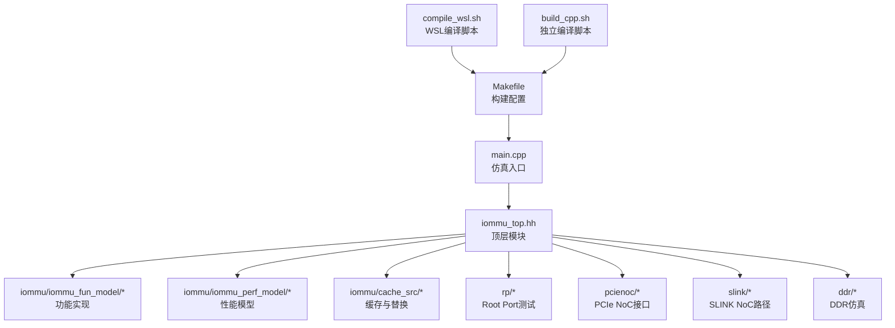
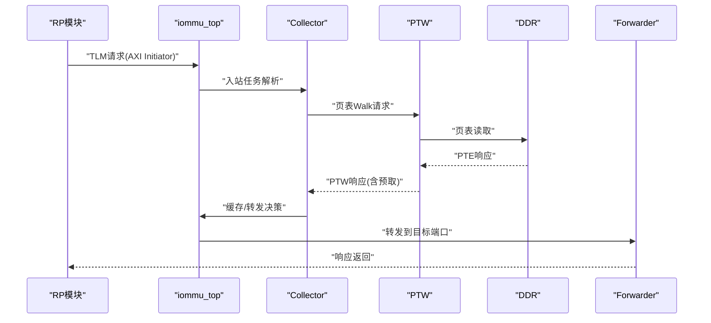
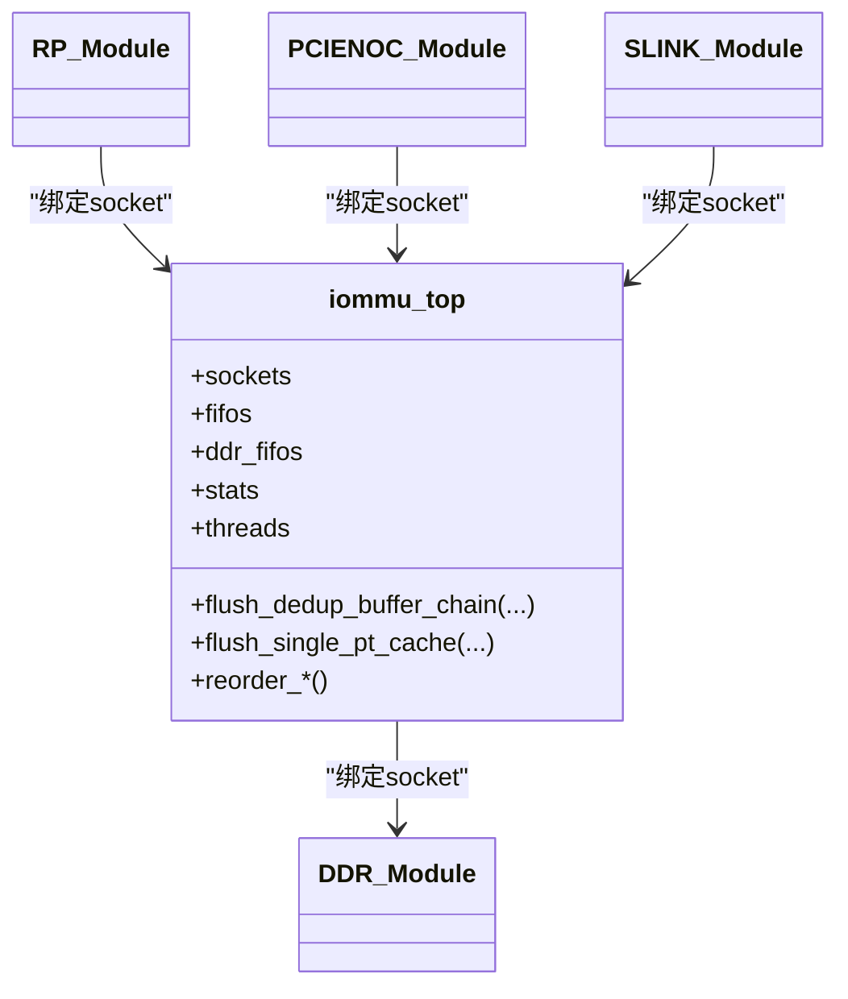
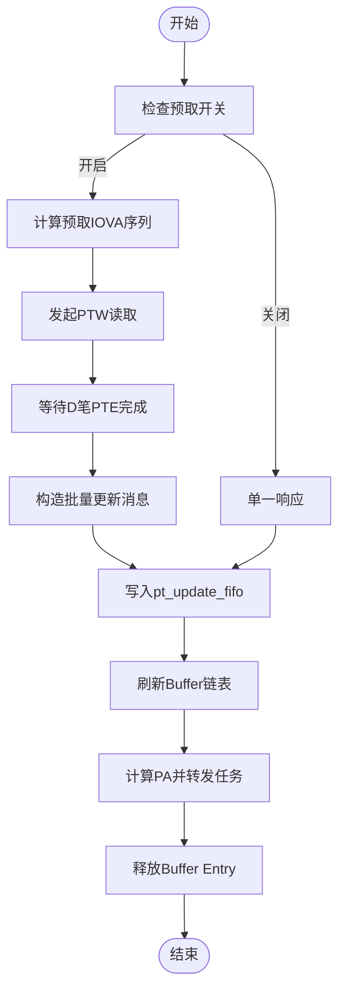
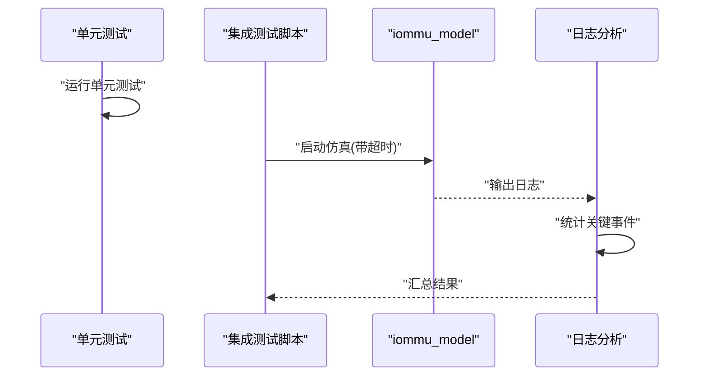
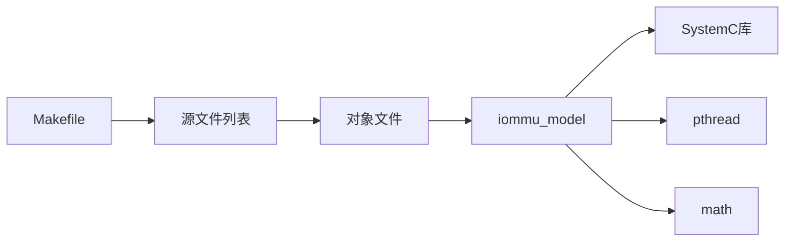

# 开发者指南

<cite>
**本文引用的文件**
- [README.md](file://README.md)
- [Makefile](file://Makefile)
- [main.cpp](file://main.cpp)
- [compile_wsl.sh](file://compile_wsl.sh)
- [build_cpp.sh](file://build_cpp.sh)
- [GDB_DEBUG_GUIDE.md](file://GDB_DEBUG_GUIDE.md)
- [iommu_top.hh](file://iommu/iommu_top.hh)
- [iommu_dedup_params.hh](file://iommu/include/iommu_dedup_params.hh)
- [dedup_buffer.h](file://iommu/cache_src/common/dedup_buffer.h)
- [IMPLEMENTATION_PROGRESS.md](file://IMPLEMENTATION_PROGRESS.md)
- [方案迭代总结_20260608_V2.md](file://方案迭代总结_20260608_V2.md)
- [test_dedup_prefetch_unit.cpp](file://test_dedup_prefetch_unit.cpp)
- [test_integration_dedup_prefetch.sh](file://test_integration_dedup_prefetch.sh)
</cite>

## 目录
1. [简介](#简介)
2. [项目结构](#项目结构)
3. [核心组件](#核心组件)
4. [架构总览](#架构总览)
5. [详细组件分析](#详细组件分析)
6. [依赖关系分析](#依赖关系分析)
7. [性能考量](#性能考量)
8. [故障排查指南](#故障排查指南)
9. [结论](#结论)
10. [附录](#附录)

## 简介
本指南面向IOMMU项目的开发者，覆盖开发环境搭建、编译与运行、代码贡献流程、编码规范、测试与质量保障、调试与性能分析、以及社区协作与路线图等内容。项目基于SystemC实现RISC-V IOMMU功能，包含地址转换、故障处理、设备上下文管理、以及PT Cache去重与预取优化等模块。

## 项目结构
项目采用模块化组织，核心位于iommu目录，包含功能实现、性能模型、缓存子系统与替换策略、公共工具与配置等。顶层main.cpp负责构建SystemC仿真拓扑，连接IOMMU、RP、PCIe NoC、SLINK与DDR等模块。Makefile提供统一构建入口，并支持多种测试场景与调试选项。

图表来源
- [main.cpp:39-94](file://main.cpp#L39-L94)
- [iommu_top.hh:44-500](file://iommu/iommu_top.hh#L44-L500)
- [Makefile:52-94](file://Makefile#L52-L94)

章节来源
- [README.md:63-76](file://README.md#L63-L76)
- [Makefile:1-164](file://Makefile#L1-L164)
- [main.cpp:1-94](file://main.cpp#L1-L94)

## 核心组件
- 顶层模块与仿真拓扑：负责实例化IOMMU、RP、PCIe NoC、SLINK与DDR，并建立TLM socket绑定与仿真时间控制。
- 功能实现模块：地址转换、命令队列、ATC、ATS、MSI传输、第二阶段与两阶段翻译、故障与中断处理等。
- 性能模型模块：寄存器抽象、解析器、收集器、Walker、Forwarder、HPM、任务缓存转换等。
- 缓存子系统：DC/PC/PT/MSIPT缓存及替换策略、缓存子系统封装、去重缓冲区（Dedup Buffer）。
- 测试与验证：单元测试、集成测试脚本、日志分析脚本、GDB调试指南。

章节来源
- [iommu_top.hh:44-500](file://iommu/iommu_top.hh#L44-L500)
- [Makefile:52-94](file://Makefile#L52-L94)

## 架构总览
IOMMU系统采用SystemC TLM 2.0接口，以socket连接各模块。顶层main.cpp创建各模块实例并绑定socket，随后启动仿真。I/O请求经由RP进入IOMMU，通过解析与收集器调度，访问缓存或发起PTW Walker读取页表，最终通过Forwarder回写或转发到目标端口。

图表来源
- [main.cpp:64-79](file://main.cpp#L64-L79)
- [iommu_top.hh:305-350](file://iommu/iommu_top.hh#L305-L350)

## 详细组件分析

### 顶层模块与仿真拓扑
- 顶层模块提供TLM socket接口、FIFO管道、DDR仲裁、重排序输出、统计计数器与多线程进程注册。
- main.cpp中完成模块实例化、socket绑定与仿真启动，确保IOMMU、RP、PCIe NoC、SLINK与DDR之间的连通性。

图表来源
- [iommu_top.hh:44-500](file://iommu/iommu_top.hh#L44-L500)
- [main.cpp:49-89](file://main.cpp#L49-L89)

章节来源
- [iommu_top.hh:44-500](file://iommu/iommu_top.hh#L44-L500)
- [main.cpp:39-94](file://main.cpp#L39-L94)

### PT Cache去重与预取（Dedup + Prefetch）
- Dedup Buffer：管理最多256个链表节点，支持顺序分配、链表挂接与释放，具备峰值统计与反压事件。
- 参数统一：通过iommu_dedup_params.hh集中定义Buffer容量、预取深度、PTE状态标记、页大小与Sv39参数等。
- 预取机制：PTW在主任务外顺序读取D个PTE，构造批量更新消息一次性写入pt_update_fifo，提升吞吐。
- 刷新流程：批量更新后触发Buffer链表刷新，计算物理地址并转发任务，释放Buffer Entry。

图表来源
- [方案迭代总结_20260608_V2.md:49-118](file://方案迭代总结_20260608_V2.md#L49-L118)
- [dedup_buffer.h:61-126](file://iommu/cache_src/common/dedup_buffer.h#L61-L126)
- [iommu_dedup_params.hh:10-91](file://iommu/include/iommu_dedup_params.hh#L10-L91)

章节来源
- [IMPLEMENTATION_PROGRESS.md:1-110](file://IMPLEMENTATION_PROGRESS.md#L1-L110)
- [方案迭代总结_20260608_V2.md:1-182](file://方案迭代总结_20260608_V2.md#L1-L182)
- [iommu_dedup_params.hh:1-92](file://iommu/include/iommu_dedup_params.hh#L1-L92)
- [dedup_buffer.h:1-131](file://iommu/cache_src/common/dedup_buffer.h#L1-L131)

### 测试与验证
- 单元测试：test_dedup_prefetch_unit.cpp验证Buffer分配顺序、链表挂接、批量更新、满Buffer处理与预取组追踪。
- 集成测试：test_integration_dedup_prefetch.sh运行仿真并提取日志统计，验证PT Cache MISS/HIT、预取占位CL、批量更新与Buffer刷新等关键行为。
- 日志分析：脚本统计关键事件次数并给出通过/警告提示，便于回归验证。

图表来源
- [test_dedup_prefetch_unit.cpp:390-412](file://test_dedup_prefetch_unit.cpp#L390-L412)
- [test_integration_dedup_prefetch.sh:17-157](file://test_integration_dedup_prefetch.sh#L17-L157)

章节来源
- [test_dedup_prefetch_unit.cpp:1-412](file://test_dedup_prefetch_unit.cpp#L1-L412)
- [test_integration_dedup_prefetch.sh:1-157](file://test_integration_dedup_prefetch.sh#L1-L157)

## 依赖关系分析
- 构建依赖：Makefile统一管理源文件列表、包含路径、编译器标志与链接库；支持DEBUG/Release切换与多测试场景。
- 运行时依赖：SystemC库、pthread、数学库；WSL环境为必需。
- 模块间依赖：main.cpp依赖顶层模块与各测试模块头文件；顶层模块依赖缓存子系统与性能模型组件。

图表来源
- [Makefile:136-164](file://Makefile#L136-L164)
- [Makefile:16-36](file://Makefile#L16-L36)

章节来源
- [Makefile:1-164](file://Makefile#L1-L164)
- [README.md:7-16](file://README.md#L7-L16)

## 性能考量
- 编译优化：DEBUG=1启用调试符号与大量调试输出，DEBUG=0启用-O3优化并禁用调试；默认DEBUG=1便于开发调试。
- 缓存与流水：通过FIFO管道与多线程并行处理，结合重排序输出保证写请求保序；统计峰值outstanding与IOPS以评估稳态性能。
- 预取与批量更新：PTW预取D个PTE并一次性批量更新，减少PT Cache miss与DDR访问次数，提高吞吐。

章节来源
- [Makefile:25-33](file://Makefile#L25-L33)
- [iommu_top.hh:203-295](file://iommu/iommu_top.hh#L203-L295)
- [方案迭代总结_20260608_V2.md:49-118](file://方案迭代总结_20260608_V2.md#L49-L118)

## 故障排查指南
- 调试环境：在WSL中使用DEBUG=1编译，运行gdb_debug.sh或直接gdb ./iommu_model进行调试。
- 常用命令：断点设置、单步执行、变量打印、调用栈查看、条件断点与跟踪点等。
- 关键断点：在地址翻译入口、设备上下文定位、命令队列处理、故障报告等函数设置断点。
- 常见问题：符号不可用（确认DEBUG=1）、断点未命中（检查函数名与执行路径）、性能下降（调试模式-O0为正常）。

章节来源
- [GDB_DEBUG_GUIDE.md:1-206](file://GDB_DEBUG_GUIDE.md#L1-L206)
- [README.md:77-87](file://README.md#L77-L87)

## 结论
本指南提供了IOMMU项目从环境搭建、构建运行、功能实现、测试验证到调试优化的全链路开发指引。建议开发者遵循统一的构建与测试流程，利用参数化配置与模块化设计，持续改进性能与稳定性，并通过社区协作推动功能演进。

## 附录

### 开发环境设置
- 必须在WSL（推荐WSL2）中进行编译与运行，SystemC库需安装在Linux环境。
- 使用提供的编译脚本或Makefile进行构建，默认启用DEBUG模式。

章节来源
- [README.md:7-16](file://README.md#L7-L16)
- [compile_wsl.sh:1-15](file://compile_wsl.sh#L1-L15)
- [Makefile:16-36](file://Makefile#L16-L36)

### 编码规范与贡献流程
- 统一使用C++17标准，遵循模块化与高内聚低耦合设计。
- 新功能开发建议遵循“参数集中定义—数据结构扩展—模块实现—单元测试—集成测试”的步骤。
- 提交前确保通过单元测试与集成测试脚本，必要时补充日志与统计信息以便分析。

章节来源
- [Makefile:23](file://Makefile#L23)
- [iommu_dedup_params.hh:1-92](file://iommu/include/iommu_dedup_params.hh#L1-L92)
- [test_dedup_prefetch_unit.cpp:1-412](file://test_dedup_prefetch_unit.cpp#L1-L412)
- [test_integration_dedup_prefetch.sh:1-157](file://test_integration_dedup_prefetch.sh#L1-L157)

### 代码审查与质量保证
- 代码审查要点：参数定义清晰、数据结构扩展合理、模块职责明确、线程安全与互斥保护到位、日志与统计可追溯。
- 质量保证流程：单元测试先行、集成测试覆盖关键路径、日志分析脚本自动化验证、回归测试定期执行。

章节来源
- [方案迭代总结_20260608_V2.md:156-166](file://方案迭代总结_20260608_V2.md#L156-L166)
- [test_integration_dedup_prefetch.sh:136-157](file://test_integration_dedup_prefetch.sh#L136-L157)

### 社区参与与协作
- 通过文档与脚本记录迭代过程与验证结果，便于团队协作与知识沉淀。
- 建议在PR中附带测试脚本输出与性能统计摘要，便于快速评审与回归验证。

章节来源
- [IMPLEMENTATION_PROGRESS.md:92-110](file://IMPLEMENTATION_PROGRESS.md#L92-L110)
- [方案迭代总结_20260608_V2.md:122-133](file://方案迭代总结_20260608_V2.md#L122-L133)

### 路线图与发展计划
- 已完成：数据结构扩展、Buffer管理、PT Cache占位CL、PTW预取机制、参数统一定义。
- 待完成：Buffer刷新逻辑、编译与单元测试、1000包回归测试与性能统计。
- 未来方向：增强PTE状态处理（无效/错误标记）、优化DC Cache与PT Cache协同、扩展更多测试场景与分析脚本。

章节来源
- [IMPLEMENTATION_PROGRESS.md:1-110](file://IMPLEMENTATION_PROGRESS.md#L1-L110)
- [方案迭代总结_20260608_V2.md:136-182](file://方案迭代总结_20260608_V2.md#L136-L182)