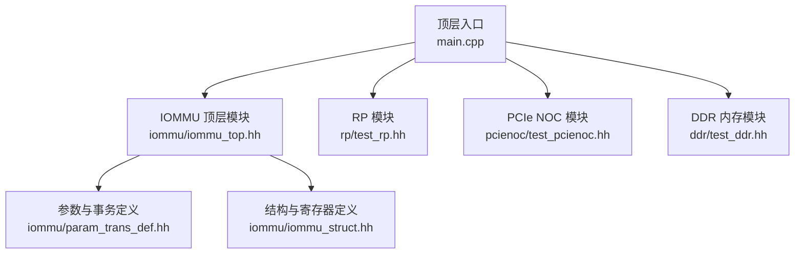
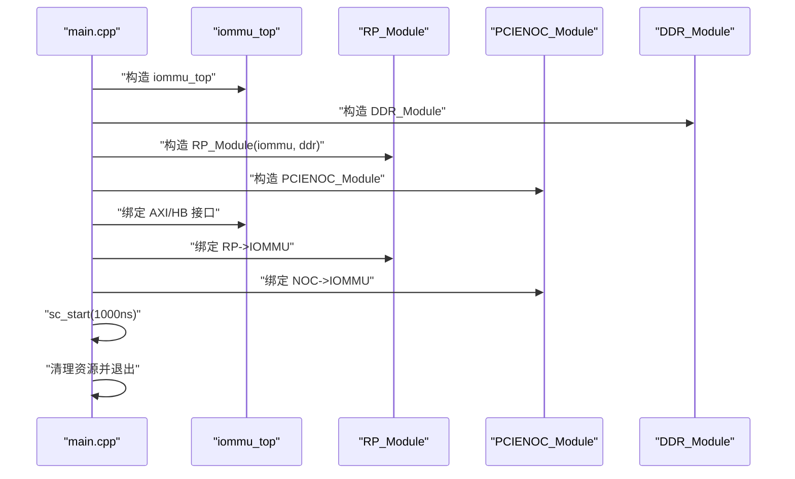
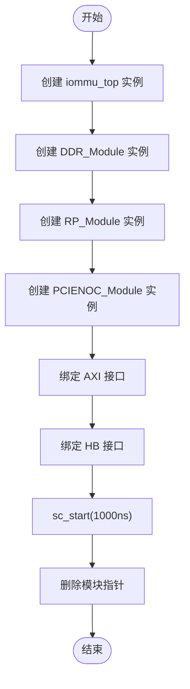
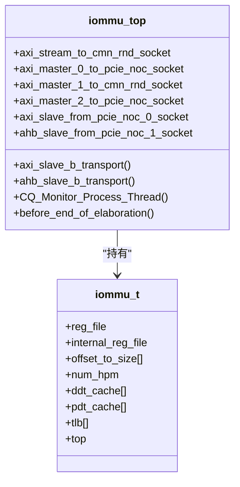
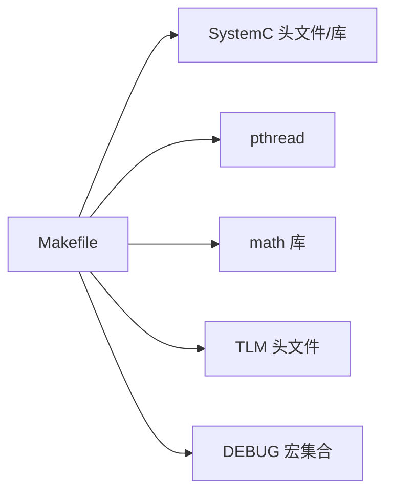

# 快速开始

<cite>
**本文引用的文件**
- [Makefile](file://Makefile)
- [compile_systemc.bat](file://compile_systemc.bat)
- [main.cpp](file://main.cpp)
- [GDB_DEBUG_GUIDE.md](file://GDB_DEBUG_GUIDE.md)
- [gdb_debug.sh](file://gdb_debug.sh)
- [iommu/iommu_top.hh](file://iommu/iommu_top.hh)
- [iommu/iommu_struct.hh](file://iommu/iommu_struct.hh)
- [iommu/param_trans_def.hh](file://iommu/param_trans_def.hh)
- [rp/test_rp.hh](file://rp/test_rp.hh)
- [pcienoc/test_pcienoc.hh](file://pcienoc/test_pcienoc.hh)
- [ddr/test_ddr.hh](file://ddr/test_ddr.hh)
</cite>

## 目录
1. [简介](#简介)
2. [项目结构](#项目结构)
3. [核心组件](#核心组件)
4. [架构总览](#架构总览)
5. [详细组件分析](#详细组件分析)
6. [依赖关系分析](#依赖关系分析)
7. [性能注意事项](#性能注意事项)
8. [故障排除指南](#故障排除指南)
9. [结论](#结论)
10. [附录](#附录)

## 简介
本指南面向首次接触 IOMMU 模型项目的开发者，目标是在最短时间内完成开发环境搭建、编译与运行第一个仿真示例，并掌握基础调试方法。项目基于 SystemC 与 TLM 构建，采用 Makefile 进行跨平台编译，同时提供 Windows 下的 SystemC 编译脚本与 Linux/macOS 下的 GDB 调试脚本。

## 项目结构
项目采用“模块化+层次化”的组织方式：
- 根目录包含顶层入口、构建脚本与调试工具
- iommu 子目录包含 IOMMU 核心实现与接口定义
- rp、pcienoc、ddr 子目录分别代表根复合体(RP)、PCIe NOC、以及内存模拟模块
- Doc 目录存放文档（当前工作区未包含）

图表来源
- [main.cpp:38-87](file://main.cpp#L38-L87)
- [iommu/iommu_top.hh:19-56](file://iommu/iommu_top.hh#L19-L56)
- [rp/test_rp.hh:54-112](file://rp/test_rp.hh#L54-L112)
- [pcienoc/test_pcienoc.hh:10-21](file://pcienoc/test_pcienoc.hh#L10-L21)
- [ddr/test_ddr.hh:15-96](file://ddr/test_ddr.hh#L15-L96)
- [iommu/param_trans_def.hh:10-130](file://iommu/param_trans_def.hh#L10-L130)
- [iommu/iommu_struct.hh:42-102](file://iommu/iommu_struct.hh#L42-L102)

章节来源
- [Makefile:29-50](file://Makefile#L29-L50)
- [main.cpp:38-87](file://main.cpp#L38-L87)

## 核心组件
- 顶层仿真入口：负责创建各模块实例、建立总线绑定、启动仿真并清理资源
- IOMMU 顶层模块：封装 AXI/HB 接口、注册 b_transport 处理回调、驱动命令队列监控线程
- RP 模块：发起地址翻译请求、与 IOMMU/DDR 交互的测试模块
- PCIe NOC 模块：提供 AHB 主设备接口，连接 IOMMU
- DDR 模块：1MB 模拟内存，支持读写事务与越界检测

章节来源
- [main.cpp:38-87](file://main.cpp#L38-L87)
- [iommu/iommu_top.hh:19-56](file://iommu/iommu_top.hh#L19-L56)
- [rp/test_rp.hh:54-112](file://rp/test_rp.hh#L54-L112)
- [pcienoc/test_pcienoc.hh:10-21](file://pcienoc/test_pcienoc.hh#L10-L21)
- [ddr/test_ddr.hh:15-96](file://ddr/test_ddr.hh#L15-L96)

## 架构总览
系统采用 SystemC/TLM 的模块化设计，通过 socket 绑定实现模块间通信。顶层 main.cpp 创建 IOMMU、RP、PCIe NOC、DDR 四个模块，并完成 AXI/HB 接口的互连，随后启动仿真。

图表来源
- [main.cpp:48-83](file://main.cpp#L48-L83)
- [iommu/iommu_top.hh:22-28](file://iommu/iommu_top.hh#L22-L28)
- [rp/test_rp.hh:67-71](file://rp/test_rp.hh#L67-L71)
- [pcienoc/test_pcienoc.hh:17-18](file://pcienoc/test_pcienoc.hh#L17-L18)
- [ddr/test_ddr.hh:32-35](file://ddr/test_ddr.hh#L32-L35)

## 详细组件分析

### 顶层入口与模块绑定流程
- 创建 IOMMU、DDR、RP、PCIe NOC 实例
- 通过 bind 将各模块的 initiator/target sockets 对接
- 启动仿真 1000 纳秒，结束后释放对象

图表来源
- [main.cpp:48-83](file://main.cpp#L48-L83)

章节来源
- [main.cpp:38-87](file://main.cpp#L38-L87)

### IOMMU 顶层模块与事务处理
- 提供 AXI/HB 两类 target socket，注册 b_transport 回调
- 维护命令队列事件与监控线程，驱动 IOMMU 功能
- 通过结构体 iommu_t 持有寄存器文件、缓存与全局参数

图表来源
- [iommu/iommu_top.hh:19-56](file://iommu/iommu_top.hh#L19-L56)
- [iommu/iommu_struct.hh:42-99](file://iommu/iommu_struct.hh#L42-L99)

章节来源
- [iommu/iommu_top.hh:19-56](file://iommu/iommu_top.hh#L19-L56)
- [iommu/iommu_struct.hh:42-99](file://iommu/iommu_struct.hh#L42-L99)

### 参数与事务定义
- 定义总线宽度、Payload 扩展字段、NocTransaction 类型
- 支持源/目的地址、消息类型、PASID、段号等扩展信息

章节来源
- [iommu/param_trans_def.hh:10-130](file://iommu/param_trans_def.hh#L10-L130)

### RP 模块与测试流程
- 提供发送翻译请求、检查故障、启用命令队列/队列等测试辅助函数
- 作为 IOMMU 与 DDR 的桥接者，发起典型访问序列

章节来源
- [rp/test_rp.hh:54-112](file://rp/test_rp.hh#L54-L112)

### PCIe NOC 模块
- 提供 AHB 主设备 socket，连接 IOMMU 的 HB 接口

章节来源
- [pcienoc/test_pcienoc.hh:10-21](file://pcienoc/test_pcienoc.hh#L10-L21)

### DDR 模块
- 1MB 模拟内存，支持读写事务与响应状态设置
- 越界访问将返回地址错误响应

章节来源
- [ddr/test_ddr.hh:15-96](file://ddr/test_ddr.hh#L15-L96)

## 依赖关系分析
- 编译器与标准库：g++、gcc、pthread、math 库
- SystemC 与 TLM：通过 -I 指定头文件路径，链接 -lsystemc
- 调试宏：DEBUG=1 时启用大量调试宏，便于 GDB 调试

图表来源
- [Makefile:14-27](file://Makefile#L14-L27)
- [Makefile:96-98](file://Makefile#L96-L98)

章节来源
- [Makefile:14-27](file://Makefile#L14-L27)
- [Makefile:96-98](file://Makefile#L96-L98)

## 性能注意事项
- 调试模式（DEBUG=1）禁用优化并开启大量调试输出，适合开发与定位问题；发布模式（DEBUG=0）启用 -O3，提升运行效率
- 仿真时间固定为 1000ns，如需更长仿真，可在 main.cpp 中调整 sc_start 参数

章节来源
- [Makefile:17-24](file://Makefile#L17-L24)
- [main.cpp:77](file://main.cpp#L77)

## 故障排除指南

### 开发环境与依赖
- SystemC 2.3.3
  - Linux/macOS：使用包管理器或源码编译安装 SystemC，并确保头文件与库路径正确
  - Windows：使用提供的编译脚本一键完成 CMake 配置、编译与安装，并设置 SYSTEMC_HOME、SYSTEMC_INCLUDE、SYSTEMC_LIBDIR 环境变量
- TLM：随 SystemC 一起安装
- pthread：Linux/macOS 默认可用；Windows 由 MinGW/MSYS2 提供
- math 库：链接 -lm

章节来源
- [compile_systemc.bat:5-47](file://compile_systemc.bat#L5-L47)
- [Makefile:9-11](file://Makefile#L9-L11)
- [Makefile:27](file://Makefile#L27)

### 编译与链接问题
- SystemC 路径不匹配
  - 检查 SYSTEMC_INCLUDE 与 SYSTEMC_LIB 是否指向实际安装目录
  - Windows 下确认 SYSTEMC_LIBDIR 指向 lib-win64
- 未找到 -lsystemc
  - 确认 SystemC 已安装且库文件存在
- 未定义的引用或重复定义
  - 使用 --allow-multiple-definition 选项（当前 Makefile 已包含）
- 未注册 socket 回调
  - 确保每个 target socket 都注册了 b_transport 回调（例如 ddr 模块的三个 socket 均需注册）

章节来源
- [Makefile:9-11](file://Makefile#L9-L11)
- [Makefile:27](file://Makefile#L27)
- [Makefile:70](file://Makefile#L70)
- [ddr/test_ddr.hh:32-35](file://ddr/test_ddr.hh#L32-L35)

### 调试模式与运行
- 启用调试模式
  - 使用 make DEBUG=1 编译，生成带调试符号的可执行文件
- 启动 GDB
  - 使用提供的脚本 gdb_debug.sh 自动检查可执行文件与 GDB 并启动调试会话
  - 或直接使用 gdb ./iommu_model
- 常见 GDB 问题
  - 符号不可用：确认 DEBUG=1 且未 strip
  - 断点无法命中：检查函数名拼写与编译模式
  - 性能降低：调试模式禁用优化属正常现象

章节来源
- [GDB_DEBUG_GUIDE.md:8-16](file://GDB_DEBUG_GUIDE.md#L8-L16)
- [gdb_debug.sh:7-20](file://gdb_debug.sh#L7-L20)
- [GDB_DEBUG_GUIDE.md:160-172](file://GDB_DEBUG_GUIDE.md#L160-L172)

### 第一个运行示例
- Linux/macOS
  1) 确保 SystemC 已安装，头文件与库路径正确
  2) 执行 make 清理并重新编译：make clean && make
  3) 运行可执行文件：./iommu_model
- Windows
  1) 运行 compile_systemc.bat 完成 SystemC 编译与安装，并设置环境变量
  2) 在 VS Developer Command Prompt 或 MSYS2 中执行 make
  3) 运行可执行文件：./iommu_model

章节来源
- [Makefile:85-90](file://Makefile#L85-L90)
- [compile_systemc.bat:17-34](file://compile_systemc.bat#L17-L34)
- [main.cpp:77](file://main.cpp#L77)

## 结论
通过本指南，您应能在本地成功搭建 IOMMU 模型的开发与运行环境，完成首次编译与运行，并掌握基础调试方法。若遇到具体问题，可依据“故障排除指南”逐项排查。

## 附录

### Makefile 关键配置说明
- 编译器：g++/gcc
- SystemC 路径：默认使用 /usr，可按实际安装路径修改
- 调试/发布：DEBUG=1 启用调试符号与调试宏；DEBUG=0 启用 -O3
- 库：-lsystemc -lpthread -lm
- 目标：iommu_model

章节来源
- [Makefile:4-27](file://Makefile#L4-L27)
- [Makefile:63](file://Makefile#L63)