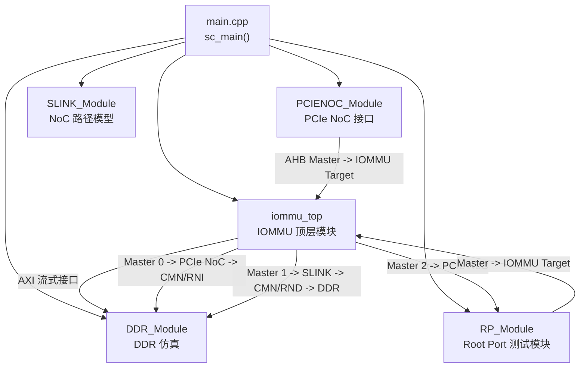

# 快速开始

<cite>
**本文引用的文件**
- [README.md](file://README.md)
- [Makefile](file://Makefile)
- [compile_wsl.sh](file://compile_wsl.sh)
- [compile_systemc.bat](file://compile_systemc.bat)
- [run_wsl.sh](file://run_wsl.sh)
- [main.cpp](file://main.cpp)
- [GDB_DEBUG_GUIDE.md](file://GDB_DEBUG_GUIDE.md)
- [rp/test_rp_thread.cc](file://rp/test_rp_thread.cc)
- [check_result.sh](file://check_result.sh)
</cite>

## 目录
1. [简介](#简介)
2. [环境准备](#环境准备)
3. [编译与安装](#编译与安装)
4. [运行与验证](#运行与验证)
5. [编译选项详解](#编译选项详解)
6. [架构概览](#架构概览)
7. [常见问题与排错](#常见问题与排错)
8. [结论](#结论)

## 简介
本指南面向首次接触 RISC-V IOMMU SystemC 模型的新用户，目标是在最短时间内完成环境准备、编译构建、运行验证与基础调试。项目基于 SystemC 实现，模拟 RISC-V 架构下的 IOMMU 功能，包括地址转换、命令队列、设备上下文管理、故障与中断处理等。为保证一致性，所有编译与运行必须在 WSL（Windows Subsystem for Linux）环境中进行。

## 环境准备
- 必须在 WSL2（推荐）或兼容的 Ubuntu 发行版中进行编译与运行。
- 系统需安装 SystemC 库（安装于 /usr 目录下）。
- 安装 GCC/G++ 与 GNU Make。
- 若计划使用调试功能，需安装 GDB。

以上要求与注意事项详见项目自述文档中的“环境要求”和“注意事项”。

章节来源
- [README.md:7-16](file://README.md#L7-L16)
- [README.md:81-87](file://README.md#L81-L87)

## 编译与安装
本节提供两种编译方式：使用编译脚本与手动编译。两者均需在 WSL 环境中执行。

### 方式一：使用编译脚本（推荐）
- 确保脚本具备执行权限：
  - chmod +x compile_wsl.sh
- 在 WSL 终端中运行：
  - ./compile_wsl.sh

该脚本会自动清理旧构建产物并执行完整编译流程。若编译成功，将在项目根目录生成可执行文件 iommu_model。

章节来源
- [README.md:19-29](file://README.md#L19-L29)
- [compile_wsl.sh:1-15](file://compile_wsl.sh#L1-L15)

### 方式二：手动编译
- 进入项目目录并清理旧产物：
  - cd /mnt/d/Qoder_proj/iommu_model_20260401_v1
  - make clean
- 执行完整编译（默认启用调试模式）：
  - make all
- 或者选择调试模式（DEBUG=1）：
  - make DEBUG=1
- 或者选择发布模式（DEBUG=0，优化且无调试信息）：
  - make DEBUG=0

章节来源
- [README.md:31-53](file://README.md#L31-L53)
- [Makefile:22-30](file://Makefile#L22-L30)

### SystemC 安装（仅限 Windows 环境）
若需要在 Windows 上从源码编译 SystemC，可使用提供的批处理脚本。该脚本会配置、编译并安装 SystemC 至指定目录，同时设置必要的环境变量。注意：本项目在 Linux 环境中默认使用系统安装的 SystemC（/usr），因此通常无需使用此脚本。

章节来源
- [compile_systemc.bat:1-50](file://compile_systemc.bat#L1-L50)

## 运行与验证
编译成功后，将在项目根目录生成 iommu_model 可执行文件。直接运行即可启动仿真。

- 运行命令：
  - ./iommu_model

运行脚本会先检查可执行文件是否存在，再启动仿真。仿真结束后会输出完成提示。

章节来源
- [README.md:55-61](file://README.md#L55-L61)
- [run_wsl.sh:1-16](file://run_wsl.sh#L1-L16)

### 基本运行示例
- 在 WSL 终端中执行：
  - ./iommu_model
- 预期输出（简化描述）：
  - 显示 SystemC 版本信息
  - 输出“Starting RISC-V IOMMU SystemC Model”
  - 启动 IOMMU 仿真并持续一段时间
  - 输出“Simulation completed”

章节来源
- [main.cpp:39-94](file://main.cpp#L39-L94)

### 验证方法
项目提供了结果检查脚本，可用于统计与验证输出日志中的关键指标，例如：
- 验证通过/失败计数
- SLINK 相关统计
- 写序检查
- DDR 与 AXI 主口峰值并发统计
- 时间范围与缓存统计

使用示例：
- ./check_result.sh [日志文件名]

章节来源
- [check_result.sh:1-41](file://check_result.sh#L1-L41)

## 编译选项详解
本项目通过 Makefile 提供多种编译选项，以满足不同场景需求。

- 调试模式（DEBUG=1，默认）
  - 启用调试符号（-g）、禁用优化（-O0）
  - 启用大量调试宏（如 DEBUG_TRANSLATION、DEBUG_COMMANDS 等）
  - 适合开发与调试阶段
- 发布模式（DEBUG=0）
  - 启用优化（-O3）、禁用调试信息（-DNDEBUG）
  - 适合性能测试与稳定运行

此外，Makefile 还支持测试场景切换：
- 默认场景：sv39_bare（Sv39 + Bare，2000 请求）
- 其他场景：通过 TEST= 参数选择（例如 sv48_bare）

章节来源
- [Makefile:22-30](file://Makefile#L22-L30)
- [Makefile:3,4,5,6,7:3-7](file://Makefile#L3-L7)
- [README.md:41-53](file://README.md#L41-L53)

## 架构概览
下图展示了顶层模块 main.cpp 中的组件关系与绑定逻辑，体现 IOMMU 与各子模块之间的连接方式。

图表来源
- [main.cpp:64-79](file://main.cpp#L64-L79)

章节来源
- [main.cpp:39-94](file://main.cpp#L39-L94)

## 常见问题与排错
- 在 Windows 上直接运行导致编译失败
  - 说明：必须在 WSL 环境中编译与运行。
  - 解决：在 WSL 终端中执行编译与运行命令。
  - 参考：项目自述文档“注意事项”。
- SystemC 库未找到或链接失败
  - 说明：SystemC 未安装在 /usr 目录或路径不正确。
  - 解决：确认 SystemC 已安装在 /usr（或调整 Makefile 中的 SYSTEMC_* 路径）。
  - 参考：Makefile 中的 SYSTEMC_* 变量。
- 可执行文件不存在
  - 说明：未执行编译或编译失败。
  - 解决：先执行 make clean && make all，再运行 ./iommu_model。
  - 参考：运行脚本的错误提示逻辑。
- 调试符号缺失
  - 说明：使用了发布模式（DEBUG=0）。
  - 解决：使用 make DEBUG=1 重新编译后再调试。
  - 参考：GDB 调试指南与 Makefile 调试宏定义。
- 性能异常
  - 说明：调试模式（-O0）会显著降低性能。
  - 解决：在需要性能测试时使用 DEBUG=0。
  - 参考：GDB 调试指南“性能考虑”。

章节来源
- [README.md:81-87](file://README.md#L81-L87)
- [Makefile:13-17](file://Makefile#L13-L17)
- [run_wsl.sh:7-11](file://run_wsl.sh#L7-L11)
- [GDB_DEBUG_GUIDE.md:171-173](file://GDB_DEBUG_GUIDE.md#L171-L173)

## 结论
按照本指南，您可以在 WSL 环境中快速完成 RISC-V IOMMU 模型的编译与运行。建议：
- 新手优先使用编译脚本，减少手工操作出错概率
- 开发调试阶段使用 DEBUG=1，发布测试阶段使用 DEBUG=0
- 使用 run_wsl.sh 与 check_result.sh 辅助验证与统计
- 如需深入调试，参考 GDB 调试指南