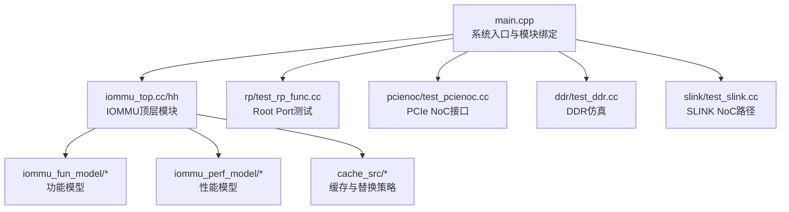
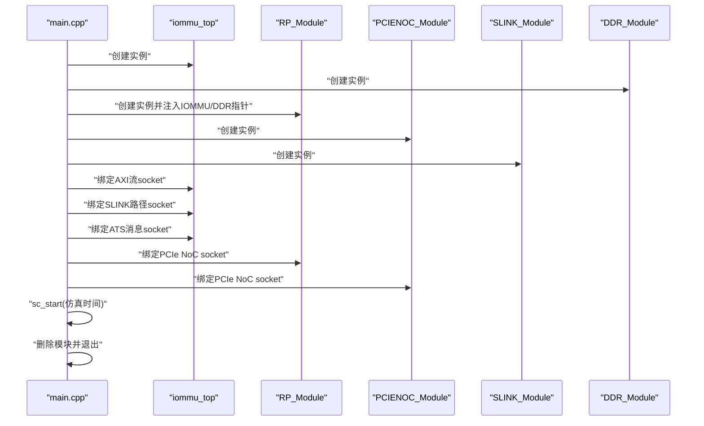
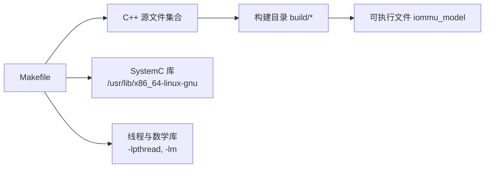

# 快速开始

<cite>
**本文引用的文件**
- [README.md](file://README.md)
- [Makefile](file://Makefile)
- [build_cpp.sh](file://build_cpp.sh)
- [compile_wsl.sh](file://compile_wsl.sh)
- [compile_systemc.bat](file://compile_systemc.bat)
- [run_wsl.sh](file://run_wsl.sh)
- [main.cpp](file://main.cpp)
- [GDB_DEBUG_GUIDE.md](file://GDB_DEBUG_GUIDE.md)
- [test_integration_dedup_prefetch.sh](file://test_integration_dedup_prefetch.sh)
- [test_dedup_prefetch_unit.cpp](file://test_dedup_prefetch_unit.cpp)
- [test_simple.sh](file://test_simple.sh)
- [test_access_path.sh](file://test_access_path.sh)
- [gdb_debug.sh](file://gdb_debug.sh)
</cite>

## 目录
1. [简介](#简介)
2. [项目结构](#项目结构)
3. [核心组件](#核心组件)
4. [架构总览](#架构总览)
5. [详细组件分析](#详细组件分析)
6. [依赖关系分析](#依赖关系分析)
7. [性能注意事项](#性能注意事项)
8. [故障排除指南](#故障排除指南)
9. [结论](#结论)
10. [附录](#附录)

## 简介
本指南面向首次接触 RISC-V IOMMU SystemC 模型的新用户，目标是在最短时间内完成环境准备、编译与运行。项目要求在 WSL（Windows Subsystem for Linux）环境中进行编译与运行，使用 SystemC 作为建模平台，支持多种测试场景与调试手段。

## 项目结构
项目采用模块化组织，核心 IOMMU 功能位于 iommu 子目录，包含功能模型、性能模型、缓存子系统等；顶层主程序负责连接各模块并通过 SystemC 仿真驱动执行。

图表来源
- [main.cpp:39-94](file://main.cpp#L39-L94)
- [Makefile:52-94](file://Makefile#L52-L94)

章节来源
- [README.md:63-76](file://README.md#L63-L76)
- [Makefile:52-94](file://Makefile#L52-L94)

## 核心组件
- 顶层模块与主程序：负责创建各子模块实例并建立 TLM 信号绑定，启动 SystemC 仿真。
- IOMMU 功能与性能模型：实现地址转换、命令队列、中断、故障处理、MSI 转发、两阶段翻译等。
- 缓存子系统：包含 PT Cache、PC Cache、DC Cache、Walker Cache、MSIPT Cache 等，配合替换策略与统计收集。
- 测试与验证：提供多种测试场景脚本与单元测试，覆盖去重与预取、SLINK 延迟、访问路径分析等。

章节来源
- [main.cpp:39-94](file://main.cpp#L39-L94)
- [Makefile:52-94](file://Makefile#L52-L94)

## 架构总览
系统采用 SystemC/TLM 事件驱动仿真，顶层 main.cpp 中创建 IOMMU、RP、PCIENOC、SLINK、DDR 等模块，并通过 socket 绑定形成数据通路。仿真时间由 main.cpp 中 sc_start 控制。

图表来源
- [main.cpp:49-83](file://main.cpp#L49-L83)

章节来源
- [main.cpp:39-94](file://main.cpp#L39-L94)

## 详细组件分析

### 环境与编译准备
- 必须在 WSL（推荐 WSL2）中进行编译与运行，使用 Linux 发行版（如 Ubuntu）。
- SystemC 库需安装在 /usr 目录下（Makefile 默认路径），确保 /usr/include 与 /usr/lib/x86_64-linux-gnu 可用。
- 编译器要求：GCC/G++ 支持 C++17；Make 工具可用。
- Windows 环境下若需从源码编译 SystemC，可使用提供的批处理脚本，但最终需在 WSL 中完成 IOMMU 模型的编译与运行。

章节来源
- [README.md:7-16](file://README.md#L7-L16)
- [Makefile:16-21](file://Makefile#L16-L21)
- [compile_systemc.bat:1-50](file://compile_systemc.bat#L1-L50)

### 编译与运行流程

#### 使用编译脚本（推荐）
- 在 WSL 中赋予脚本执行权限并运行，自动清理与编译。
- 成功后生成可执行文件 iommu_model。

章节来源
- [README.md:19-29](file://README.md#L19-L29)
- [compile_wsl.sh:1-15](file://compile_wsl.sh#L1-L15)

#### 手动编译
- 进入项目目录，执行 make clean 与 make all。
- 调试模式（默认）：DEBUG=1，启用大量调试宏与 -g/-O0。
- 发布模式：DEBUG=0，启用 -O3 与 -DNDEBUG。

章节来源
- [README.md:31-53](file://README.md#L31-L53)
- [Makefile:25-33](file://Makefile#L25-L33)

#### Makefile 使用与编译选项
- 测试场景选择：通过 TEST 参数切换（rand4k、seq128k、sv48_bare）。
- SystemC 路径：默认 /usr（可通过 SYSTEMC_PREFIX/INCLUDE/LIB 调整）。
- 调试/发布：DEBUG=1（默认）启用 -DDEBUG 及多类调试宏；DEBUG=0 启用 -O3 与 -DNDEBUG。
- 头文件搜索路径：包含 iommu/include、iommu/iommu_fun_model、iommu/iommu_perf_model、cache_src 等。
- 链接库：-lsystemc、-lpthread、-lm；允许多重定义。

章节来源
- [Makefile:1-164](file://Makefile#L1-L164)

#### 首次运行示例
- 编译成功后，在项目根目录运行 ./iommu_model。
- 预期输出包含 SystemC 版本信息、仿真开始与结束提示，以及各模块绑定信息。

章节来源
- [README.md:55-61](file://README.md#L55-L61)
- [main.cpp:40-47](file://main.cpp#L40-L47)

### 测试与验证

#### 集成测试（PT Cache去重+预取）
- 使用 test_integration_dedup_prefetch.sh 自动运行仿真并解析关键指标：
  - PT Cache MISS 次数、占位 CL HIT 次数、PTW 预取组初始化次数、预取占位 CL 创建数量、预取组完成、批量更新、Buffer 链表刷新等。
- 输出结果汇总到 output_test4_integration.txt，并统计通过项数。

章节来源
- [test_integration_dedup_prefetch.sh:1-157](file://test_integration_dedup_prefetch.sh#L1-L157)

#### 单元测试（PT Cache去重+预取）
- test_dedup_prefetch_unit.cpp 提供独立于 SystemC 的单元测试，覆盖 Buffer 分配顺序、链表挂接、PTW 一次性返回、Buffer 满处理、预取组状态追踪等。
- 通过 g++ 直接编译为 test_dedup_unit 并运行。

章节来源
- [test_dedup_prefetch_unit.cpp:1-412](file://test_dedup_prefetch_unit.cpp#L1-L412)
- [Makefile:140-152](file://Makefile#L140-L152)

#### SLINK 延迟简化测试
- test_simple.sh 通过修改 iommu_perf_params.hh 中的 SLINK_NOC_LATENCY_NS，分别测试 5us 与 2.5us 的 SLINK 延迟，提取 Steady IOPS、PTW 平均执行延迟与平均 DDR 访问次数，判断是否成为性能瓶颈。

章节来源
- [test_simple.sh:1-47](file://test_simple.sh#L1-L47)

#### 访问路径分析
- test_access_path.sh 仅编译 iommu_top.cc 并链接，运行后提取 RAM Access Path Breakdown 相关日志，辅助分析访问路径与延迟构成。

章节来源
- [test_access_path.sh:1-17](file://test_access_path.sh#L1-L17)

### 调试支持
- 使用 GDB 调试：确保 DEBUG=1 编译，使用 gdb_debug.sh 启动交互式调试会话。
- 常用命令：break、run、step、next、continue、print、info breakpoints、list、quit。
- 关键断点建议：地址翻译入口、设备上下文定位、命令队列处理、故障报告等。

章节来源
- [GDB_DEBUG_GUIDE.md:1-206](file://GDB_DEBUG_GUIDE.md#L1-L206)
- [gdb_debug.sh:1-37](file://gdb_debug.sh#L1-L37)

## 依赖关系分析

图表来源
- [Makefile:16-36](file://Makefile#L16-L36)
- [Makefile:113-114](file://Makefile#L113-L114)

章节来源
- [Makefile:16-36](file://Makefile#L16-L36)
- [Makefile:113-114](file://Makefile#L113-L114)

## 性能注意事项
- 调试模式（DEBUG=1）默认启用 -O0，运行速度较慢，适合开发与调试；发布模式（DEBUG=0）启用 -O3，适合性能评估与基准测试。
- SLINK 延迟对整体性能有直接影响，可通过 test_simple.sh 进行对比测试，判断是否成为瓶颈。
- 预取与去重机制在集成测试中被验证，合理配置可减少 PT Cache MISS 与 PTW 访问次数。

章节来源
- [Makefile:25-33](file://Makefile#L25-L33)
- [test_simple.sh:27-44](file://test_simple.sh#L27-L44)
- [test_integration_dedup_prefetch.sh:27-98](file://test_integration_dedup_prefetch.sh#L27-L98)

## 故障排除指南

- 在 WSL 中找不到 iommu_model
  - 确认已成功编译，或使用 run_wsl.sh 检查可执行文件存在性。
  - 参考章节来源：[run_wsl.sh:7-11](file://run_wsl.sh#L7-L11)

- SystemC 库未找到或路径不正确
  - 确认 /usr/include 与 /usr/lib/x86_64-linux-gnu 下存在 SystemC 头文件与库文件。
  - 如需自定义路径，可在 Makefile 中调整 SYSTEMC_PREFIX/INCLUDE/LIB。
  - 参考章节来源：[Makefile:16-21](file://Makefile#L16-L21)

- 编译失败（头文件缺失或链接错误）
  - 检查 C++ 标准与包含路径是否正确（-std=c++17 与 -I./iommu 等）。
  - 确认链接库顺序与 -lsystemc、-lpthread、-lm 是否可用。
  - 参考章节来源：[Makefile:23-36](file://Makefile#L23-L36)

- 调试模式下运行缓慢
  - 使用 DEBUG=0 编译以获得优化性能；仅在需要调试时开启 DEBUG=1。
  - 参考章节来源：[Makefile:25-33](file://Makefile#L25-L33)

- GDB 无法命中断点或符号不可用
  - 确保使用 DEBUG=1 编译并保留调试符号；确认函数名拼写与代码路径。
  - 参考章节来源：[GDB_DEBUG_GUIDE.md:160-172](file://GDB_DEBUG_GUIDE.md#L160-L172)

- Windows 环境下 SystemC 源码编译
  - 使用 compile_systemc.bat 进行 CMake 配置、编译与安装，完成后在 WSL 中继续编译 IOMMU 模型。
  - 参考章节来源：[compile_systemc.bat:1-50](file://compile_systemc.bat#L1-L50)

## 结论
通过本快速开始指南，您可以在 WSL 环境中完成 SystemC 模型的编译与运行，掌握 Makefile 的基本使用与编译选项，了解主要测试与调试方法，并具备排查常见问题的能力。建议优先使用编译脚本与默认调试模式进行首次体验，随后根据需求切换到发布模式或进行专项测试与调试。

## 附录

### 常用命令速查
- 编译（默认调试模式）：make clean && make all
- 编译（发布模式）：make clean && make DEBUG=0
- 运行：./iommu_model
- 集成测试：./test_integration_dedup_prefetch.sh
- 单元测试：make test_dedup_unit
- SLINK 延迟测试：./test_simple.sh
- 访问路径分析：./test_access_path.sh
- GDB 调试：./gdb_debug.sh

章节来源
- [README.md:19-61](file://README.md#L19-L61)
- [Makefile:139-159](file://Makefile#L139-L159)
- [test_simple.sh:1-47](file://test_simple.sh#L1-L47)
- [test_access_path.sh:1-17](file://test_access_path.sh#L1-L17)
- [gdb_debug.sh:1-37](file://gdb_debug.sh#L1-L37)