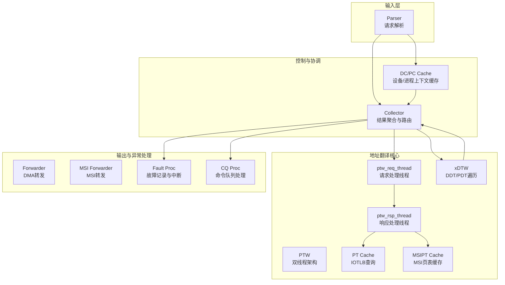
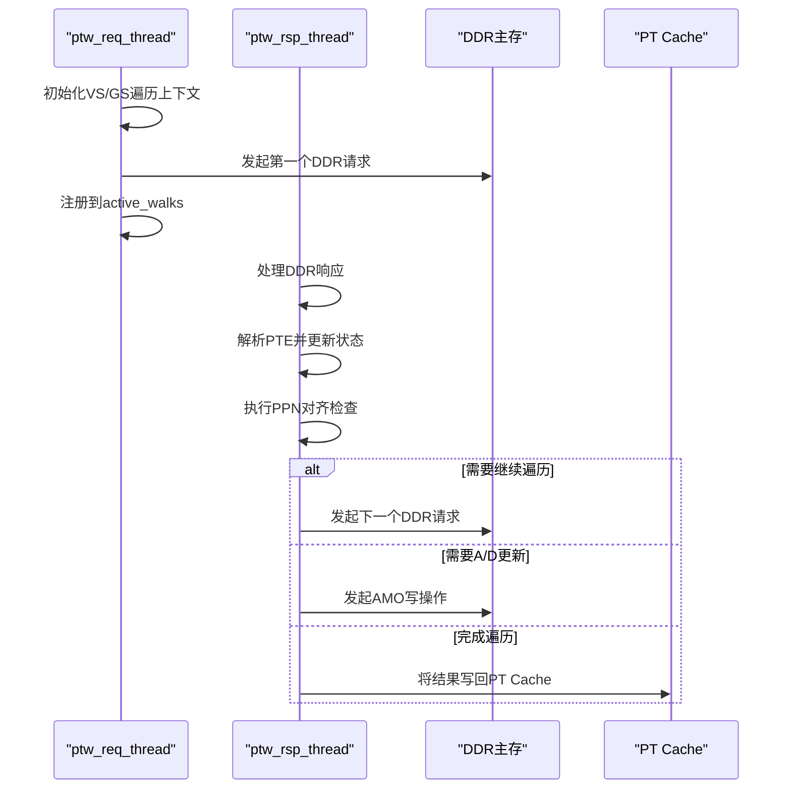
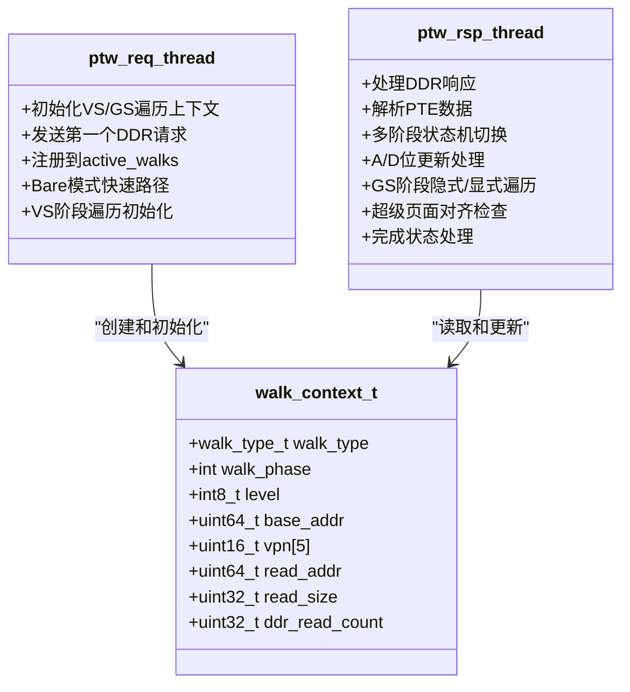
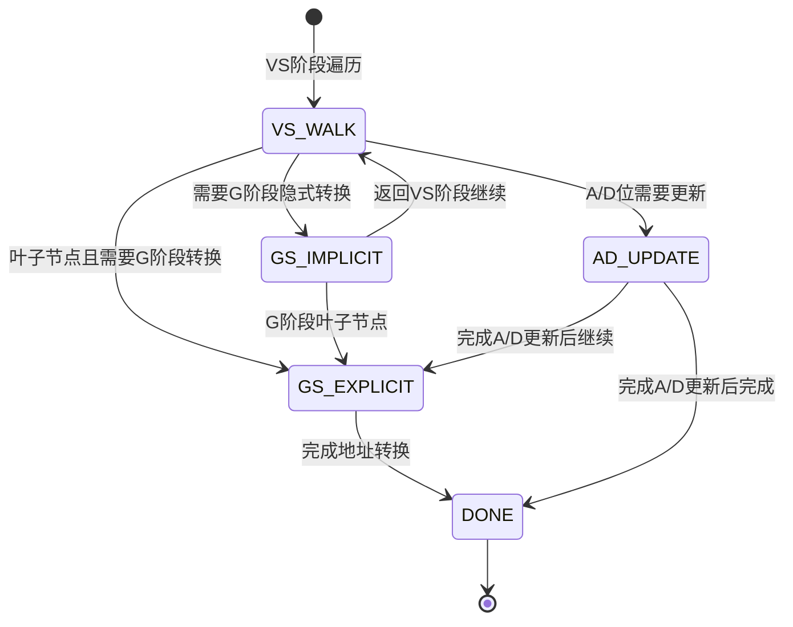
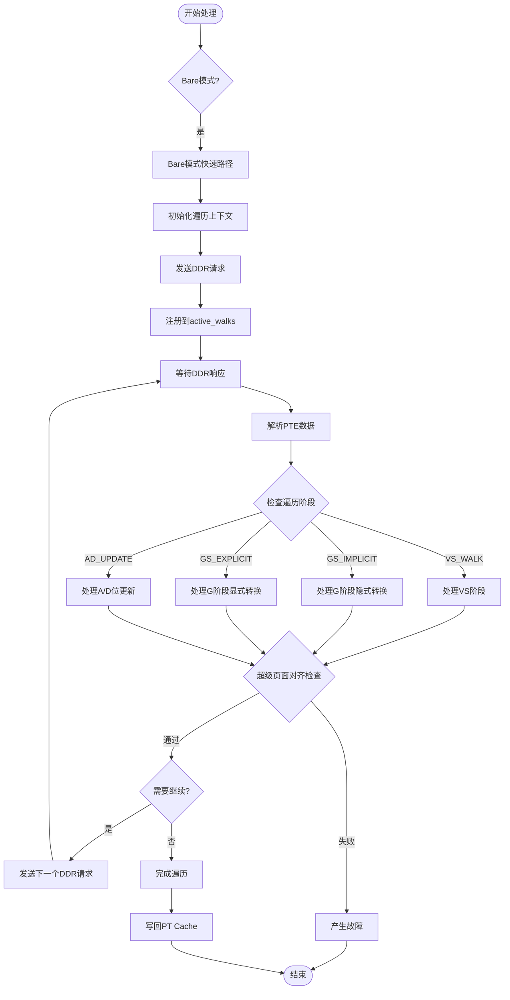
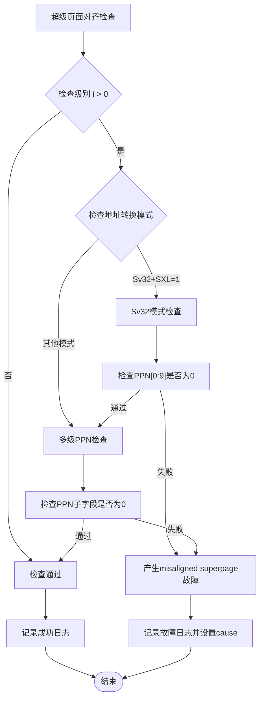
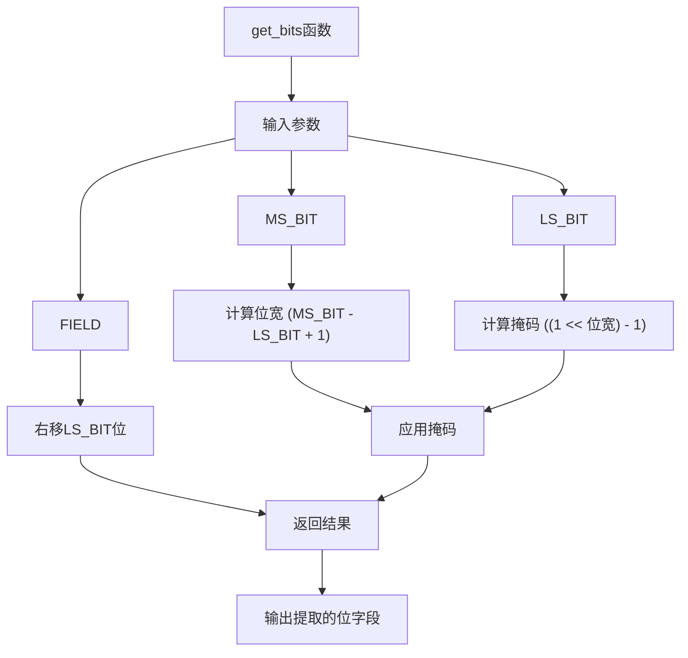

# 性能Walker组件

<cite>
**本文档引用的文件**
- [README.md](file://README.md)
- [PERF_MODEL_IMPLEMENTATION.md](file://PERF_MODEL_IMPLEMENTATION.md)
- [iommu_perf_model.hh](file://iommu/iommu_perf_model.hh)
- [iommu_perf_params.hh](file://iommu/iommu_perf_params.hh)
- [iommu_perf_parser.cc](file://iommu/iommu_perf_parser.cc)
- [iommu_perf_collector.cc](file://iommu/iommu_perf_collector.cc)
- [iommu_perf_dc_pc_cache.cc](file://iommu/iommu_perf_dc_pc_cache.cc)
- [iommu_perf_pt_cache.cc](file://iommu/iommu_perf_pt_cache.cc)
- [iommu_perf_msipt_cache.cc](file://iommu/iommu_perf_msipt_cache.cc)
- [iommu_perf_xdtw.cc](file://iommu/iommu_perf_xdtw.cc)
- [iommu_perf_ptw.cc](file://iommu/iommu_perf_ptw.cc)
- [iommu_perf_forwarder_fault_cq.cc](file://iommu/iommu_perf_forwarder_fault_cq.cc)
- [iommu_task.hh](file://iommu/iommu_task.hh)
- [iommu_struct.hh](file://iommu/iommu_struct.hh)
- [iommu_top.hh](file://iommu/iommu_top.hh)
- [main.cpp](file://main.cpp)
- [iommu_utils.hh](file://iommu/iommu_utils.hh)
- [iommu_two_stage_trans.cc](file://iommu/iommu_two_stage_trans.cc)
- [iommu_second_stage_trans.cc](file://iommu/iommu_second_stage_trans.cc)
</cite>

## 更新摘要
**变更内容**
- 新增超级页面对齐检测和验证逻辑，包括S-stage和G-stage页表遍历过程中的PPN对齐检查
- 增强bit操作验证机制，支持不同地址转换模式的精确bit提取
- 完善misaligned superpage故障处理，提供详细的故障诊断信息
- 优化PPN对齐检查算法，支持Sv32/Sv39/Sv48/Sv57等多种地址转换模式

## 目录
1. [简介](#简介)
2. [项目结构](#项目结构)
3. [核心组件](#核心组件)
4. [架构概览](#架构概览)
5. [详细组件分析](#详细组件分析)
6. [超级页面对齐检测机制](#超级页面对齐检测机制)
7. [bit操作验证系统](#bit操作验证系统)
8. [依赖关系分析](#依赖关系分析)
9. [性能考量](#性能考量)
10. [故障排查指南](#故障排查指南)
11. [结论](#结论)

## 简介
本文件聚焦于IOMMU性能模型中的Walker组件，该组件负责页表遍历（Page Table Walk）过程中的中间结果缓存与加速。经过架构重构，Walker组件现在与PTW双线程架构紧密集成，通过异步DDR请求处理和多阶段状态机显著提升地址翻译性能。本文档基于SPEC v4规范，结合实际代码实现，系统阐述Walker组件的设计原理、数据结构、处理流程与性能优化策略，并重点介绍新增的超级页面对齐检测和bit操作验证机制。

## 项目结构
该项目采用SystemC建模，IOMMU性能模型按功能划分为多个独立模块，Walker组件位于PTW（Page Table Walker）模块中，与Parser、Collector、DC/PC Cache、PT Cache、MSIPT Cache、xDTW、Forwarder/Fault/CQ等模块协同工作。



**图表来源**
- [PERF_MODEL_IMPLEMENTATION.md](file://PERF_MODEL_IMPLEMENTATION.md)
- [iommu_perf_parser.cc](file://iommu/iommu_perf_parser.cc)
- [iommu_perf_collector.cc](file://iommu/iommu_perf_collector.cc)
- [iommu_perf_dc_pc_cache.cc](file://iommu/iommu_perf_dc_pc_cache.cc)
- [iommu_perf_pt_cache.cc](file://iommu/iommu_perf_pt_cache.cc)
- [iommu_perf_msipt_cache.cc](file://iommu/iommu_perf_msipt_cache.cc)
- [iommu_perf_xdtw.cc](file://iommu/iommu_perf_xdtw.cc)
- [iommu_perf_ptw.cc](file://iommu/iommu_perf_ptw.cc)
- [iommu_perf_forwarder_fault_cq.cc](file://iommu/iommu_perf_forwarder_fault_cq.cc)

**章节来源**
- [README.md](file://README.md)
- [PERF_MODEL_IMPLEMENTATION.md](file://PERF_MODEL_IMPLEMENTATION.md)

## 核心组件
Walker组件的核心职责是在页表遍历过程中缓存中间结果，减少重复的主存访问。经过架构重构，Walker组件现在与PTW双线程架构深度集成，具有以下关键特性：
- **双线程架构**：ptw_req_thread负责请求处理，ptw_rsp_thread负责响应处理
- **异步DDR处理**：请求线程发起DDR请求，响应线程处理DDR响应
- **多阶段状态机**：支持VS_WALK、GS_IMPLICIT、GS_EXPLICIT、AD_UPDATE四个阶段
- **任务追踪**：所有调试输出包含task_id信息，便于任务状态跟踪
- **流控机制**：支持最大未完成任务数限制和事件通知
- **超级页面对齐检测**：新增PPN对齐检查机制，防止misaligned superpage错误
- **bit操作验证**：精确的bit提取和验证机制，支持多种地址转换模式

**章节来源**
- [iommu_perf_ptw.cc](file://iommu/iommu_perf_ptw.cc)
- [iommu_task.hh](file://iommu/iommu_task.hh)

## 架构概览
Walker组件在IOMMU性能模型中的双线程架构位置与交互如下：



**图表来源**
- [iommu_perf_ptw.cc](file://iommu/iommu_perf_ptw.cc)
- [iommu_task.hh](file://iommu/iommu_task.hh)

## 详细组件分析

### PTW双线程架构设计
PTW组件现在采用双线程架构，将请求处理和响应处理分离，实现真正的异步处理：



**图表来源**
- [iommu_perf_ptw.cc](file://iommu/iommu_perf_ptw.cc)
- [iommu_task.hh](file://iommu/iommu_task.hh)

**章节来源**
- [iommu_perf_ptw.cc](file://iommu/iommu_perf_ptw.cc)

### 多阶段状态机设计
PTW组件实现了复杂的多阶段状态机，支持四种不同的遍历阶段：



**图表来源**
- [iommu_task.hh](file://iommu/iommu_task.hh)

**章节来源**
- [iommu_task.hh](file://iommu/iommu_task.hh)

### 异步DDR请求处理机制
新的异步处理机制将DDR请求和响应处理分离，提高了系统的并发处理能力：



**图表来源**
- [iommu_perf_ptw.cc](file://iommu/iommu_perf_ptw.cc)

**章节来源**
- [iommu_perf_ptw.cc](file://iommu/iommu_perf_ptw.cc)

### 调试输出增强
新的双线程架构增强了调试输出，所有输出都包含task_id信息，便于跟踪任务执行状态：

- **PTW_REQ线程调试**：包含task_id、IOVA、iosatp.MODE、GV等关键信息
- **PTW_RSP线程调试**：包含task_id、walk_phase、read_count、data_len等详细信息
- **状态追踪**：每个阶段的转换都有明确的日志输出
- **错误诊断**：故障原因和总读取次数都有详细记录
- **超级页面对齐诊断**：详细的PPN对齐检查日志

**章节来源**
- [iommu_perf_ptw.cc](file://iommu/iommu_perf_ptw.cc)

### 流量控制和并发管理
PTW组件实现了完善的流量控制机制，确保系统稳定运行：

- **最大未完成任务数限制**：PTW_MAX_OUTSTANDING_TASKS = 4
- **事件驱动机制**：ptw_task_completed_event用于任务完成通知
- **互斥锁保护**：ptw_walks_mtx保护active_walks的并发访问
- **内存池管理**：ptw_active_walks存储当前活跃的遍历任务

**章节来源**
- [iommu_top.hh](file://iommu/iommu_top.hh)
- [iommu_task.hh](file://iommu/iommu_task.hh)

## 超级页面对齐检测机制

### PPN对齐检查算法
Walker组件实现了严格的PPN（Page Physical Number）对齐检查机制，确保超级页面的正确性和安全性：



**图表来源**
- [iommu_perf_ptw.cc](file://iommu/iommu_perf_ptw.cc)
- [iommu_two_stage_trans.cc](file://iommu/iommu_two_stage_trans.cc)
- [iommu_second_stage_trans.cc](file://iommu/iommu_second_stage_trans.cc)

### 不同地址转换模式的支持
系统支持多种地址转换模式的PPN对齐检查：

#### Sv32模式（SXL=1）
- PPN子字段长度：10位
- 检查范围：PPN[0:9]必须为0
- 页面大小：4KiB（基础页）

#### Sv39/Sv48/Sv57模式（SXL=0）
- PPN子字段长度：9位
- 检查范围：PPN[0:8]、PPN[9:17]、PPN[18:26]、PPN[27:35]等
- 页面大小：2MiB、1GiB、512GiB、256TiB等

#### G-stage地址转换
- 支持相同的PPN对齐检查机制
- 使用iohgatp.MODE确定检查算法
- 错误码：GST_PAGE_FAULT

**章节来源**
- [iommu_perf_ptw.cc](file://iommu/iommu_perf_ptw.cc)
- [iommu_two_stage_trans.cc](file://iommu/iommu_two_stage_trans.cc)
- [iommu_second_stage_trans.cc](file://iommu/iommu_second_stage_trans.cc)

### 故障处理机制
当PPN对齐检查失败时，系统会执行以下处理流程：

1. **故障类型识别**：设置cause为对应的页面故障类型
2. **错误信息记录**：记录详细的PPN值和检查级别
3. **状态转换**：将任务状态设置为TASK_FAULT
4. **资源清理**：从active_walks中移除任务
5. **统计更新**：更新总DDR访问次数

**章节来源**
- [iommu_perf_ptw.cc](file://iommu/iommu_perf_ptw.cc)

## bit操作验证系统

### get_bits函数实现
系统使用统一的bit操作接口，确保不同地址转换模式下的bit提取准确性：



**图表来源**
- [iommu_utils.hh](file://iommu/iommu_utils.hh)

### bit操作验证流程
系统通过以下步骤验证bit操作的正确性：

1. **位宽计算**：确保MS_BIT >= LS_BIT
2. **掩码生成**：生成正确的位掩码
3. **位移操作**：执行无符号右移
4. **结果验证**：检查提取结果的有效性

### 地址转换模式特定的bit操作
不同地址转换模式使用特定的bit提取规则：

#### S-stage转换（Sv32/Sv39/Sv48/Sv57）
- Sv32：PPN[19:10]、PPN[31:20]（如果存在）
- Sv39：PPN[18:10]、PPN[27:19]、PPN[53:28]
- Sv48：PPN[18:10]、PPN[27:19]、PPN[36:28]、PPN[53:37]
- Sv57：PPN[18:10]、PPN[27:19]、PPN[36:28]、PPN[45:37]、PPN[53:46]

#### G-stage转换（Sv32x4/Sv39x4/Sv48x4/Sv57x4）
- 使用相同的bit提取规则，但针对G-stage地址空间

**章节来源**
- [iommu_utils.hh](file://iommu/iommu_utils.hh)
- [iommu_two_stage_trans.cc](file://iommu/iommu_two_stage_trans.cc)
- [iommu_second_stage_trans.cc](file://iommu/iommu_second_stage_trans.cc)

## 依赖关系分析
Walker组件与系统其他模块的依赖关系已更新以反映双线程架构和新增的对齐检测功能：

```mermaid
graph TB
subgraph "Walker组件"
WC["Walker Cache<br/>walker_cache_t"]
end
subgraph "PTW双线程架构"
PTW_REQ["ptw_req_thread<br/>请求处理"]
PTW_RSP["ptw_rsp_thread<br/>响应处理"]
PTW_FIFO["ptw_req_ddr_fifo<br/>请求FIFO"]
PTW_RSP_FIFO["ptw_rsp_ddr_fifo<br/>响应FIFO"]
END
subgraph "依赖模块"
Params["参数配置<br/>iommu_perf_params.hh"]
Tasks["任务结构<br/>iommu_task.hh"]
DDR["DDR控制器<br/>ddr_arbiter_thread"]
PT_CACHE["PT Cache<br/>pt_cache_*_thread"]
Utils["工具函数<br/>iommu_utils.hh"]
TwoStage["两阶段转换<br/>iommu_two_stage_trans.cc"]
SecondStage["第二阶段转换<br/>iommu_second_stage_trans.cc"]
end
PTW_REQ --> WC
PTW_REQ --> PTW_FIFO
PTW_RSP --> PTW_RSP_FIFO
PTW_RSP --> WC
PTW_FIFO --> DDR
PTW_RSP_FIFO --> DDR
PTW_REQ --> PT_CACHE
PTW_RSP --> PT_CACHE
WC --> Params
WC --> Tasks
Utils --> TwoStage
Utils --> SecondStage
TwoStage --> PTW_RSP
SecondStage --> PTW_RSP
```

**图表来源**
- [iommu_perf_ptw.cc](file://iommu/iommu_perf_ptw.cc)
- [iommu_perf_params.hh](file://iommu/iommu_perf_params.hh)
- [iommu_task.hh](file://iommu/iommu_task.hh)
- [iommu_top.hh](file://iommu/iommu_top.hh)
- [iommu_utils.hh](file://iommu/iommu_utils.hh)
- [iommu_two_stage_trans.cc](file://iommu/iommu_two_stage_trans.cc)
- [iommu_second_stage_trans.cc](file://iommu/iommu_second_stage_trans.cc)

**章节来源**
- [iommu_perf_ptw.cc](file://iommu/iommu_perf_ptw.cc)
- [iommu_perf_params.hh](file://iommu/iommu_perf_params.hh)
- [iommu_task.hh](file://iommu/iommu_task.hh)
- [iommu_top.hh](file://iommu/iommu_top.hh)

## 性能考量
PTW双线程架构的性能优化主要体现在以下方面：
- **异步处理**：请求线程和响应线程并行工作，提高DDR利用率
- **流水线设计**：多阶段状态机允许重叠处理不同的遍历阶段
- **流控机制**：最大未完成任务数限制防止内存溢出
- **任务追踪**：详细的调试输出便于性能分析和优化
- **状态机优化**：多阶段状态机减少了不必要的DDR访问
- **并发安全**：互斥锁保护共享资源，确保数据一致性
- **对齐检测优化**：高效的PPN对齐检查算法，最小化性能开销
- **bit操作优化**：统一的bit提取接口，减少重复代码

## 故障排查指南
针对PTW双线程架构和新增对齐检测功能相关的常见问题，建议从以下方面进行排查：

### 对齐检测相关问题
- **misaligned superpage故障**：检查PPN对齐检查日志，确认地址转换模式配置
- **bit提取错误**：验证get_bits函数调用参数的正确性
- **模式不匹配**：确认iosatp.MODE和iohgatp.MODE的配置

### 传统问题排查
- **任务超时**：检查ptw_outstanding_task_count是否达到上限
- **死锁问题**：验证ptw_walks_mtx的加锁和解锁配对
- **状态机异常**：确认walk_phase的转换逻辑正确性
- **DDR请求丢失**：检查ptw_req_ddr_fifo和ptw_rsp_ddr_fifo的状态
- **任务ID冲突**：验证next_task_id的生成和分配机制
- **调试输出异常**：检查printf语句中的task_id格式化

**章节来源**
- [iommu_perf_ptw.cc](file://iommu/iommu_perf_ptw.cc)
- [iommu_task.hh](file://iommu/iommu_task.hh)

## 结论
PTW双线程架构通过将请求处理和响应处理分离，实现了真正的异步DDR处理机制。新增的超级页面对齐检测功能确保了地址转换的安全性和正确性，而增强的bit操作验证系统提供了精确的位字段提取能力。这些改进使得Walker组件能够有效支持Sv32/Sv39/Sv48/Sv57等多种地址转换模式，同时保持高性能的地址翻译能力。

通过合理的参数配置和流控机制，PTW双线程架构能够在保证正确性的同时显著提升地址翻译性能。新增的对齐检测和bit验证功能不仅增强了系统的可靠性，还为开发者提供了强大的调试和诊断能力，有助于快速定位和解决复杂的地址转换问题。