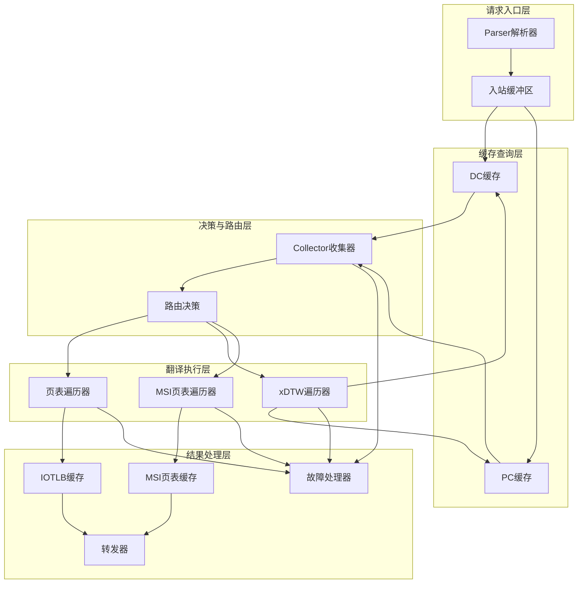
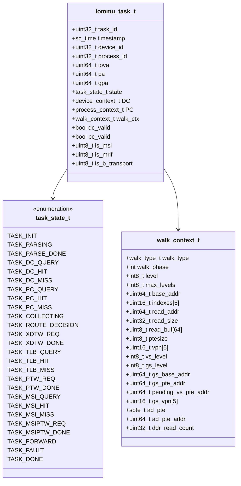
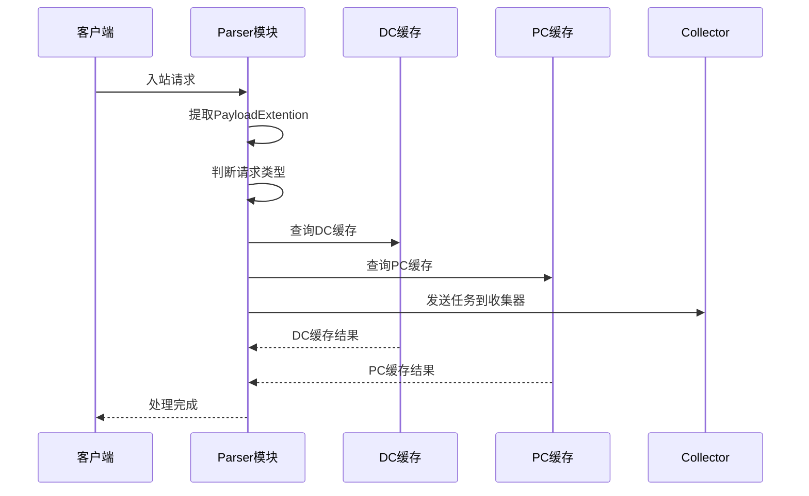
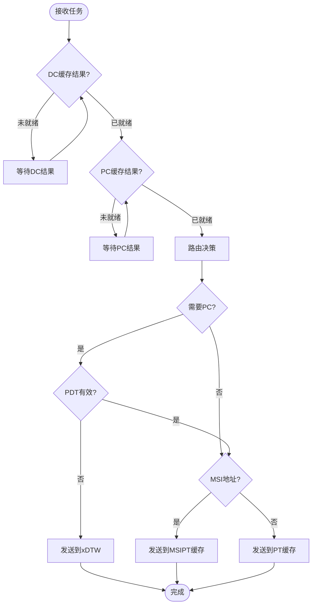
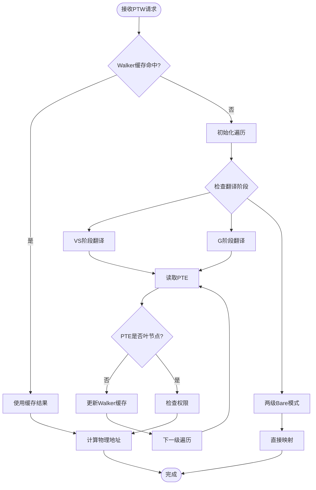
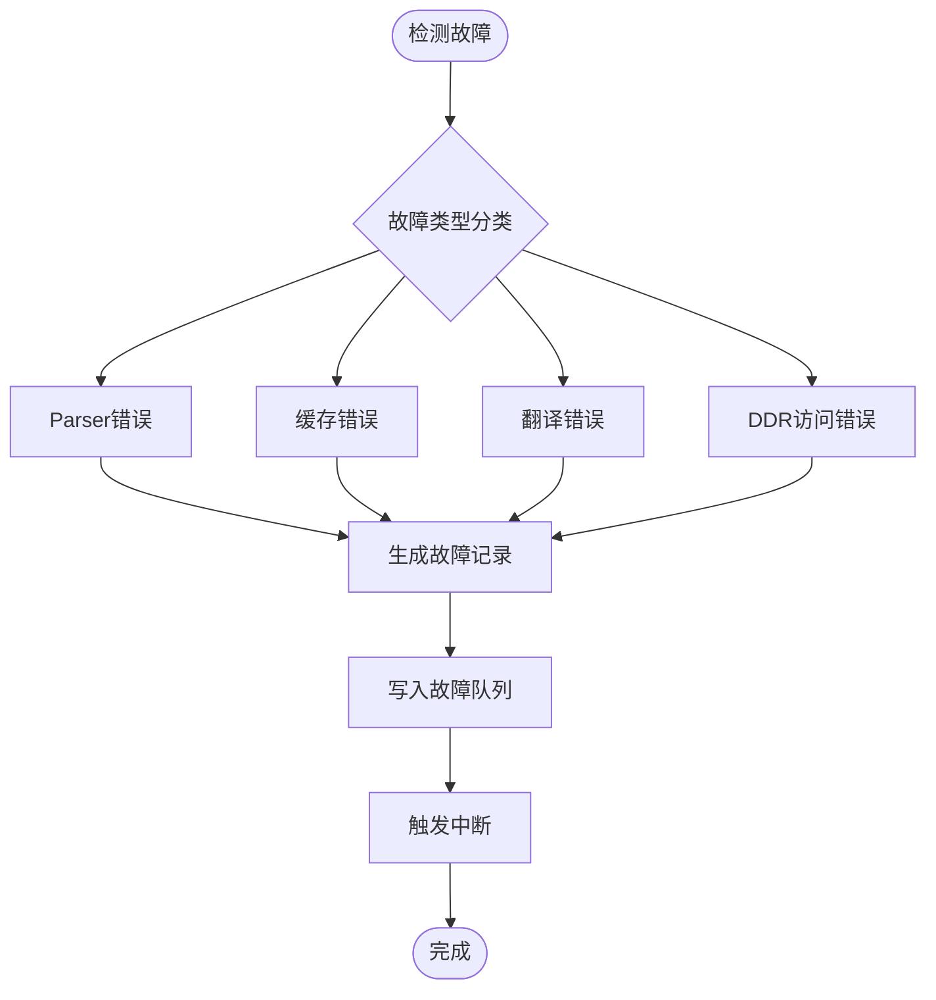
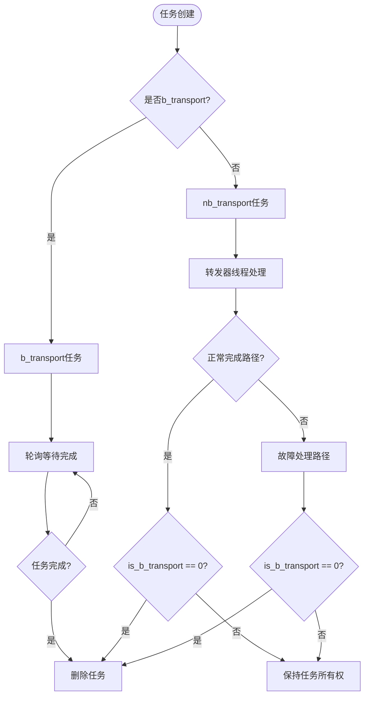

# 性能任务定义

<cite>
**本文档引用的文件**
- [README.md](file://README.md)
- [PERF_MODEL_IMPLEMENTATION.md](file://PERF_MODEL_IMPLEMENTATION.md)
- [REFACTOR_SUMMARY.md](file://REFACTOR_SUMMARY.md)
- [iommu_task.hh](file://iommu/iommu_task.hh)
- [iommu_perf_params.hh](file://iommu/iommu_perf_params.hh)
- [iommu_perf_model.hh](file://iommu/iommu_perf_model.hh)
- [iommu_perf_parser.cc](file://iommu/iommu_perf_parser.cc)
- [iommu_perf_collector.cc](file://iommu/iommu_perf_collector.cc)
- [iommu_perf_dc_pc_cache.cc](file://iommu/iommu_perf_dc_pc_cache.cc)
- [iommu_perf_pt_cache.cc](file://iommu/iommu_perf_pt_cache.cc)
- [iommu_perf_msipt_cache.cc](file://iommu/iommu_perf_msipt_cache.cc)
- [iommu_perf_xdtw.cc](file://iommu/iommu_perf_xdtw.cc)
- [iommu_perf_ptw.cc](file://iommu/iommu_perf_ptw.cc)
- [iommu_perf_forwarder_fault_cq.cc](file://iommu/iommu_perf_forwarder_fault_cq.cc)
- [iommu_top.cc](file://iommu/iommu_top.cc)
- [main.cpp](file://main.cpp)
- [Makefile](file://Makefile)
</cite>

## 更新摘要
**变更内容**
- 新增task_id信息用于并发任务追踪机制
- 增强walk_context_t结构包含ddr_read_count字段用于DDR访问统计
- 新增is_b_transport字段改进b_transport任务生命周期管理，防止任务重复删除
- 统一各IOMMU子模块的打印格式支持并发任务跟踪
- 完善walker缓存统计功能，支持读取计数跟踪

## 目录
1. [项目概述](#项目概述)
2. [性能任务架构总览](#性能任务架构总览)
3. [核心数据结构与任务定义](#核心数据结构与任务定义)
4. [性能参数与配置](#性能参数与配置)
5. [模块化性能任务实现](#模块化性能任务实现)
6. [性能监控与统计](#性能监控与统计)
7. [编译与运行配置](#编译与运行配置)
8. [故障处理与错误恢复](#故障处理与错误恢复)
9. [性能优化建议](#性能优化建议)
10. [结论](#结论)

## 项目概述

本项目是一个基于SystemC的RISC-V IOMMU（输入/输出内存管理单元）性能模型实现。该模型采用SPEC v4规范，实现了从阻塞式功能模型到非阻塞式性能模型的完整转换，包含20个独立线程的并发流水线架构。

项目的核心目标是提供一个高性能、可扩展的IOMMU仿真平台，支持多设备并发地址翻译、缓存优化、以及完整的故障处理机制。**最新更新**增强了并发任务追踪能力，通过统一的task_id标识符和ddr_read_count统计功能，为性能分析和调试提供了更精细的控制。**新增的is_b_transport字段**进一步改进了b_transport任务生命周期管理，防止任务重复删除。

**章节来源**
- [README.md:1-92](file://README.md#L1-L92)

## 性能任务架构总览

IOMMU性能模型采用模块化设计，将复杂的地址翻译流程分解为多个独立的处理模块，每个模块负责特定的功能：



**图表来源**
- [iommu_perf_parser.cc:13-199](file://iommu/iommu_perf_parser.cc#L13-L199)
- [iommu_perf_collector.cc:13-201](file://iommu/iommu_perf_collector.cc#L13-L201)
- [iommu_perf_dc_pc_cache.cc:13-72](file://iommu/iommu_perf_dc_pc_cache.cc#L13-L72)

## 核心数据结构与任务定义

### 统一事务上下文结构

性能模型的核心是统一的事务上下文结构`iommu_task_t`，它封装了整个翻译过程中的所有必要信息。**最新更新**增加了task_id字段用于并发任务追踪，并增强了walk_context_t结构以支持DDR访问统计。**新增的is_b_transport字段**用于区分b_transport和nb_transport创建的任务，改进任务生命周期管理。



**图表来源**
- [iommu_task.hh:112-204](file://iommu/iommu_task.hh#L112-L204)
- [iommu_task.hh:75-109](file://iommu/iommu_task.hh#L75-L109)
- [iommu_task.hh:14-42](file://iommu/iommu_task.hh#L14-L42)

### Walker缓存架构

Walker缓存是性能优化的关键组件，包含三级缓存结构：

| 缓存级别 | 容量 | 组相联度 | 描述 |
|---------|------|----------|------|
| PTWc_1 | 64条目 | 直接映射 | 缓存VPN最高段中间结果 |
| PTWc_2 | 128条目 | 2路组相联 | 缓存{VPN[3],VPN[2]}中间结果 |
| PTWc_3 | 256条目 | 4路组相联 | 缓存{VPN[3],VPN[2],VPN[1]}中间结果（仅Sv48） |

**章节来源**
- [iommu_task.hh:418-638](file://iommu/iommu_task.hh#L418-L638)

## 性能参数与配置

### FIFO深度配置

性能模型定义了完整的FIFO深度参数，确保各模块间的流量控制：

| 模块类别 | FIFO名称 | 深度 | 用途 |
|---------|----------|------|------|
| Parser输出 | parser_to_collector_fifo | 16 | 任务分发 |
| Cache到Collector | dc_cache_to_collector_fifo | 8 | DC缓存结果 |
| Cache到Walker | pt_cache_to_ptw_fifo | 4 | PT缓存未命中 |
| Walker返回 | xdtw_to_collector_fifo | 4 | 遍历器响应 |
| 最终输出 | pt_cache_to_fwd_fifo | 8 | 翻译完成通知 |

### 缓存参数

| 缓存类型 | 容量 | 组相联度 | 缓存行大小 | 命中延迟(ns) |
|---------|------|----------|------------|-------------|
| DC Cache | 64条目 | 8路 | 64字节 | 2 |
| PC Cache | 32条目 | 4路 | 32字节 | 2 |
| PT Cache | 256条目 | 16路 | 16字节 | 3 |
| MSIPT Cache | 16条目 | 4路 | 16字节 | 3 |

### 处理延迟参数

| 模块 | 延迟(ns) | 说明 |
|------|----------|------|
| Parser | 1 | 解析延迟 |
| Collector | 1 | 收集器处理 |
| DC Cache | 2 | 缓存命中延迟 |
| PC Cache | 2 | 缓存命中延迟 |
| PT Cache | 3 | 缓存命中延迟 |
| MSIPT Cache | 3 | 缓存命中延迟 |
| xDTW | 5×访问 | 每次DDR访问 |
| PTW | 5×访问 | 每次DDR访问 |
| MSIPTW | 5×访问 | 每次DDR访问 |
| Forwarder | 2 | 转发延迟 |

**章节来源**
- [iommu_perf_params.hh:6-94](file://iommu/iommu_perf_params.hh#L6-L94)

## 模块化性能任务实现

### Parser模块

Parser模块负责接收入站请求并进行初步处理：



**图表来源**
- [iommu_perf_parser.cc:13-199](file://iommu/iommu_perf_parser.cc#L13-L199)

### Collector模块

Collector模块负责协调各个缓存的结果并进行路由决策。**最新更新**增强了并发任务追踪能力，所有打印输出都包含task_id信息：



**图表来源**
- [iommu_perf_collector.cc:13-201](file://iommu/iommu_perf_collector.cc#L13-L201)

### PTW模块

PTW模块实现了高效的页表遍历，结合Walker缓存优化。**最新更新**增加了ddr_read_count字段用于统计DDR访问次数：



**图表来源**
- [iommu_perf_ptw.cc:15-218](file://iommu/iommu_perf_ptw.cc#L15-L218)

**章节来源**
- [iommu_perf_parser.cc:13-199](file://iommu/iommu_perf_parser.cc#L13-L199)
- [iommu_perf_collector.cc:13-319](file://iommu/iommu_perf_collector.cc#L13-L319)
- [iommu_perf_ptw.cc:15-501](file://iommu/iommu_perf_ptw.cc#L15-L501)

## 性能监控与统计

### 性能指标观测

性能模型支持多种关键性能指标的观测。**最新更新**增强了并发任务追踪和DDR访问统计功能：

| 指标类型 | 监控内容 | 实现方式 |
|---------|----------|----------|
| 端到端延迟 | 单笔翻译完成时间 | 任务时间戳差值 |
| DDR访问次数 | 内存访问统计 | ddr_read_count计数 |
| 缓存命中率 | 各级缓存命中统计 | 缓存查询计数 |
| 管线利用率 | 并发处理效率 | 线程忙碌时间统计 |
| 并发请求数 | 同时处理的任务数 | FIFO深度监控 |

### Walker缓存统计

Walker缓存提供了详细的命中率统计功能。**最新更新**增加了ddr_read_count字段用于统计DDR访问次数：

- **命中级别统计**：PTWc_1、PTWc_2、PTWc_3各自的命中次数
- **失效策略效果**：按GSCID/PSCID/IOVA的失效命中率
- **缓存替换效果**：SRRIP算法的替换行为统计
- **DDR访问统计**：各模块的ddr_read_count计数

**章节来源**
- [REFACTOR_SUMMARY.md:221-229](file://REFACTOR_SUMMARY.md#L221-L229)

## 编译与运行配置

### 编译环境要求

项目要求在WSL（Windows Subsystem for Linux）环境中进行编译和运行：

- **操作系统**：Ubuntu或其他兼容的Linux发行版
- **SystemC库**：2.3.3或更高版本（安装在/usr目录下）
- **编译器**：GCC/G++支持C++11标准
- **构建工具**：GNU Make

### 编译配置选项

```makefile
# 调试模式（默认）
DEBUG ?= 1
CXXFLAGS += -g -O0 -DDEBUG

# 发布模式
DEBUG ?= 0  
CXXFLAGS += -O3 -DNDEBUG

# SystemC库路径
SYSTEMC_INCLUDE = /usr/include
SYSTEMC_LIB = /usr/lib/x86_64-linux-gnu
```

### 源文件组织

性能模型的源文件主要位于iommu目录下，包含20个独立的实现文件：

| 模块类别 | 文件数量 | 代码行数 | 线程数 |
|---------|----------|----------|--------|
| 数据结构 | 2 | 800 | - |
| Parser | 1 | 200 | 1 |
| Collector | 1 | 350 | 2 |
| DC/PC缓存 | 1 | 150 | 2 |
| PT缓存 | 1 | 200 | 3 |
| MSIPT缓存 | 1 | 300 | 4 |
| xDTW | 1 | 250 | 2 |
| PTW | 1 | 400 | 2 |
| 转发/故障/CQ | 1 | 350 | 4 |
| **总计** | **10** | **3000** | **20** |

**章节来源**
- [Makefile:1-109](file://Makefile#L1-L109)
- [PERF_MODEL_IMPLEMENTATION.md:180-194](file://PERF_MODEL_IMPLEMENTATION.md#L180-L194)

## 故障处理与错误恢复

### 故障分类与处理

IOMMU性能模型实现了完整的故障处理机制。**最新更新**增强了并发任务追踪能力：



### 故障记录格式

故障记录包含以下关键字段：

| 字段名 | 类型 | 描述 |
|--------|------|------|
| cause | uint64_t | 故障原因代码 |
| ttyp | uint64_t | 事务类型 |
| iotval | uint64_t | IOTVAL寄存器值 |
| iotval2 | uint64_t | IOTVAL2寄存器值 |
| did_pid | uint64_t | 设备ID和进程ID组合 |

### 错误恢复机制

- **AXI ID管理**：通过`axi_id_allocator_t`管理并发请求
- **outstanding表**：跟踪未完成的DDR请求
- **上下文恢复**：基于axi_id恢复walk上下文
- **故障隔离**：单个任务故障不影响整体系统

**章节来源**
- [iommu_perf_forwarder_fault_cq.cc:95-156](file://iommu/iommu_perf_forwarder_fault_cq.cc#L95-L156)
- [iommu_task.hh:240-268](file://iommu/iommu_task.hh#L240-L268)

## 任务生命周期管理

### b_transport与nb_transport的区别

**最新更新**引入了is_b_transport字段来区分不同类型的传输请求，改进了任务生命周期管理：

#### b_transport任务（阻塞式）
- 由iommu_top::axi_slave_b_transport方法创建
- 设置is_b_transport = 1
- 使用轮询方式等待任务完成（while(task->state != TASK_DONE)）
- 在完成时直接删除任务对象
- 不通过nb_transport_bw回调返回响应

#### nb_transport任务（非阻塞式）
- 由iommu_top::axi_slave_nb_transport_fw方法创建
- 设置is_b_transport = 0
- 通过转发器线程异步处理
- 在转发器或故障处理器中根据条件删除任务
- 通过nb_transport_bw回调返回响应

### 任务删除策略

**新增的生命周期管理机制**确保了正确的资源管理：



**图表来源**
- [iommu_top.cc:108-123](file://iommu/iommu_top.cc#L108-L123)
- [iommu_perf_forwarder_fault_cq.cc:93-95](file://iommu/iommu_perf_forwarder_fault_cq.cc#L93-L95)
- [iommu_perf_forwarder_fault_cq.cc:178-180](file://iommu/iommu_perf_forwarder_fault_cq.cc#L178-L180)

**章节来源**
- [iommu_top.cc:108-123](file://iommu/iommu_top.cc#L108-L123)
- [iommu_top.cc:361-374](file://iommu/iommu_top.cc#L361-L374)
- [iommu_perf_forwarder_fault_cq.cc:93-95](file://iommu/iommu_perf_forwarder_fault_cq.cc#L93-L95)
- [iommu_perf_forwarder_fault_cq.cc:178-180](file://iommu/iommu_perf_forwarder_fault_cq.cc#L178-L180)

## 性能优化建议

### 缓存优化策略

1. **Walker缓存优化**
   - 调整PTWc_3在Sv39模式下的禁用策略
   - 优化SRRIP替换算法的RRPV更新频率
   - 实现更精确的缓存失效粒度

2. **FIFO深度调优**
   - 根据实际负载调整各模块间FIFO深度
   - 实现动态FIFO管理机制
   - 优化跨模块数据传输延迟

### 并发性能提升

1. **线程调度优化**
   - 实现优先级调度机制
   - 优化线程间的同步开销
   - 减少不必要的上下文切换

2. **内存访问优化**
   - 实现预读机制减少DDR访问延迟
   - 优化缓存行对齐策略
   - 减少内存碎片化

### 监控与诊断

1. **性能统计增强**
   - 添加实时性能监控接口
   - 实现自适应参数调节
   - 提供详细的性能报告生成

2. **调试支持扩展**
   - 增强调试输出的粒度控制
   - 实现性能瓶颈定位工具
   - 提供可视化性能分析界面

## 结论

IOMMU性能模型通过20个独立线程的并发流水线架构，实现了高效、可扩展的地址翻译功能。**最新更新**显著增强了并发任务追踪能力和性能监控功能：

1. **模块化设计**：清晰的职责分离和接口定义
2. **性能优化**：多级缓存、非阻塞I/O、并发处理
3. **完整性**：完整的SPEC v4实现和故障处理机制
4. **可扩展性**：灵活的参数配置和监控接口
5. **并发追踪**：统一的task_id标识符和ddr_read_count统计
6. **调试支持**：标准化的打印格式便于问题诊断
7. **生命周期管理**：通过is_b_transport字段改进b_transport任务管理，防止任务重复删除

**新增的is_b_transport字段**为IOMMU性能模型带来了重要的改进，它：
- 区分了b_transport和nb_transport两种不同的任务类型
- 实现了正确的资源管理策略，避免任务重复删除
- 改进了b_transport阻塞式调用的生命周期管理
- 为混合模式的SystemC仿真提供了更好的支持

该性能模型为RISC-V IOMMU的开发、测试和优化提供了强大的基础设施，支持从基础功能验证到复杂性能分析的全方位需求。

**章节来源**
- [PERF_MODEL_IMPLEMENTATION.md:224-227](file://PERF_MODEL_IMPLEMENTATION.md#L224-L227)
- [REFACTOR_SUMMARY.md:284-294](file://REFACTOR_SUMMARY.md#L284-L294)