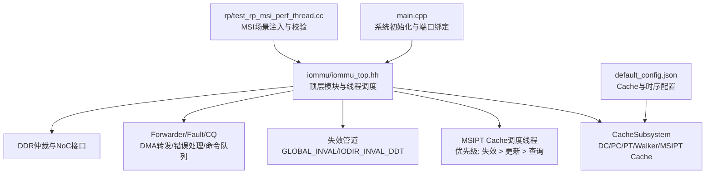
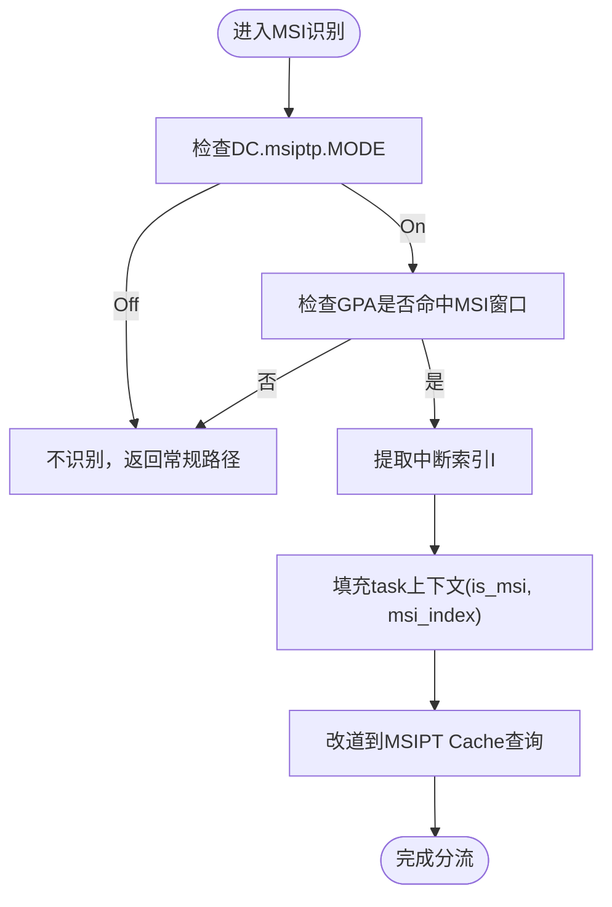
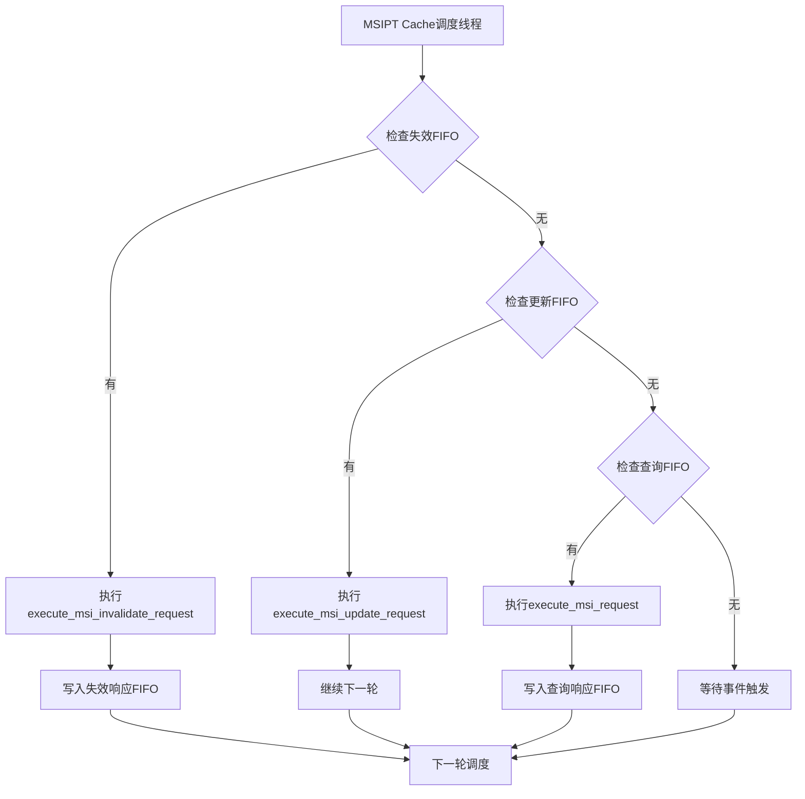
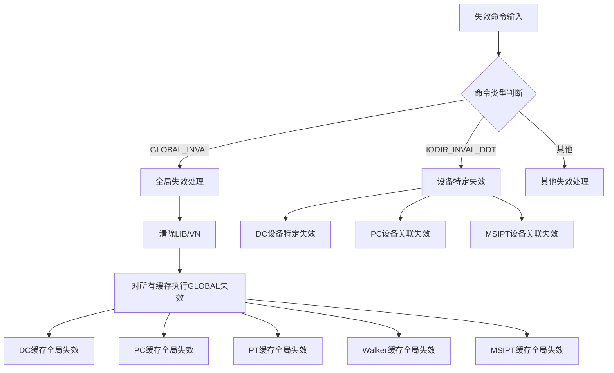
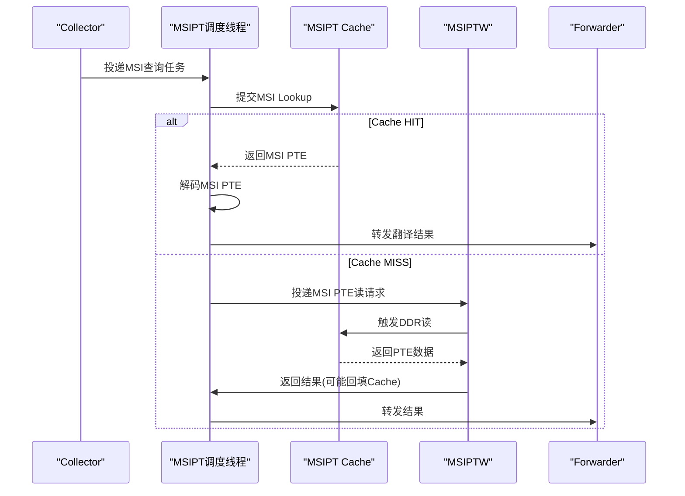
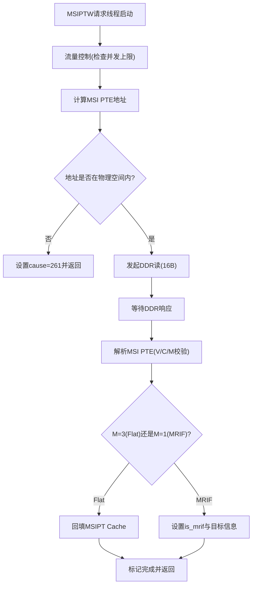
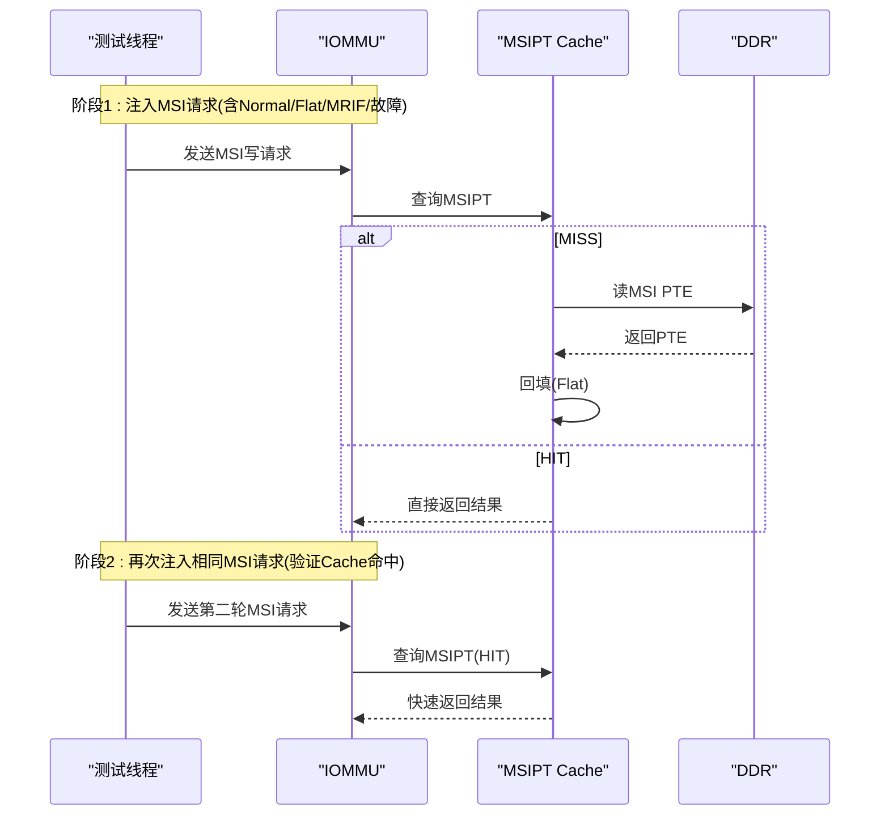
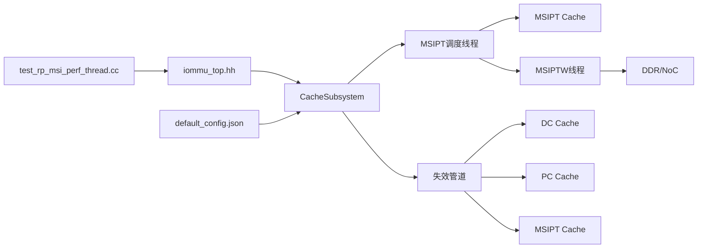

# MSI性能模型

<cite>
**本文引用的文件**
- [README.md](file://README.md)
- [main.cpp](file://main.cpp)
- [Makefile](file://Makefile)
- [iommu/iommu_top.hh](file://iommu/iommu_top.hh)
- [PERF_MODEL_IMPLEMENTATION.md](file://PERF_MODEL_IMPLEMENTATION.md)
- [iommu/iommu_perf_model/iommu_perf_msipt_cache.cc](file://iommu/iommu_perf_model/iommu_perf_msipt_cache.cc)
- [rp/test_rp_msi_perf_thread.cc](file://rp/test_rp_msi_perf_thread.cc)
- [iommu/cache_config/default_config.json](file://iommu/cache_config/default_config.json)
- [iommu/iommu_fun_model/iommu_msi_trans.cc](file://iommu/iommu_fun_model/iommu_msi_trans.cc)
- [iommu/cache_src/subsystem/cache_subsystem.cpp](file://iommu/cache_src/subsystem/cache_subsystem.cpp)
- [iommu/cache_src/subsystem/cache_subsystem.h](file://iommu/cache_src/subsystem/cache_subsystem.h)
- [iommu/cache_src/cache/msipt_cache.cpp](file://iommu/cache_src/cache/msipt_cache.cpp)
- [iommu/cache_src/cache/msipt_cache.h](file://iommu/cache_src/cache/msipt_cache.h)
- [iommu/cache_src/common/types.h](file://iommu/cache_src/common/types.h)
- [iommu/iommu_top.cc](file://iommu/iommu_top.cc)
</cite>

## 更新摘要
**变更内容**
- 新增MSIPT缓存失效管道集成，通过专用msi_scheduler_thread实现优先级调度（失效 > 更新 > 查询）
- 统一失效管道支持GLOBAL_INVAL和IODIR.INVAL_DDT设备特定失效
- 增强MSIPT缓存的失效处理能力，支持全局清空和设备级精准失效
- 更新架构图和数据流图以反映新的调度机制

## 目录
1. [简介](#简介)
2. [项目结构](#项目结构)
3. [核心组件](#核心组件)
4. [架构总览](#架构总览)
5. [详细组件分析](#详细组件分析)
6. [依赖关系分析](#依赖关系分析)
7. [性能考量](#性能考量)
8. [故障排查指南](#故障排查指南)
9. [结论](#结论)
10. [附录](#附录)

## 简介
本项目是一个基于SystemC的RISC-V IOMMU性能模型，重点实现了MSI（Message Signaled Interrupt）地址翻译路径与MSIPT Cache子系统，覆盖Flat与MRIF两种模式，并支持在单级/两级地址翻译场景下的MSI识别、缓存命中与回写。该模型通过多线程流水线、FIFO缓冲、DDR仲裁与重排序输出等机制，提供可配置、可扩展且贴近规范的MSI性能验证环境。

**更新** 现已集成专用的MSIPT缓存调度线程，实现优先级调度的失效管道，确保失效操作的及时性和一致性。

## 项目结构
- 顶层入口：main.cpp负责实例化IOMMU顶层模块、RP测试模块、PCIe NoC、SLINK与DDR模块，并完成端口绑定与仿真运行。
- IOMMU顶层：iommu/iommu_top.hh定义了完整的线程、FIFO、统计量与接口，集成CacheSubsystem与MSIPT相关逻辑。
- 性能模型实现：iommu/iommu_perf_model下包含MSIPT Cache、PTW、Forwarder/Fault/CQ等线程实现；PERF_MODEL_IMPLEMENTATION.md汇总了各模块职责与SPEC对齐情况。
- 测试场景：rp/test_rp_msi_perf_thread.cc提供MSI性能模型功能验证，覆盖三种设备场景（S1 Bare直达、两级翻译后识别、单级翻译后识别）。
- 配置：iommu/cache_config/default_config.json定义各类Cache（含MSIPT Cache）的容量、替换策略与时序参数。
- 构建：Makefile提供多种测试场景开关，包括TEST=msi_perf用于MSI性能模型验证。



**图表来源**
- [main.cpp:39-83](file://main.cpp#L39-L83)
- [iommu/iommu_top.hh:44-687](file://iommu/iommu_top.hh#L44-L687)
- [PERF_MODEL_IMPLEMENTATION.md:1-227](file://PERF_MODEL_IMPLEMENTATION.md#L1-L227)
- [rp/test_rp_msi_perf_thread.cc:61-467](file://rp/test_rp_msi_perf_thread.cc#L61-L467)
- [iommu/cache_config/default_config.json:1-94](file://iommu/cache_config/default_config.json#L1-L94)
- [iommu/cache_src/subsystem/cache_subsystem.cpp:1780-1817](file://iommu/cache_src/subsystem/cache_subsystem.cpp#L1780-L1817)

章节来源
- [README.md:1-92](file://README.md#L1-L92)
- [main.cpp:39-83](file://main.cpp#L39-L83)
- [Makefile:1-315](file://Makefile#L1-L315)

## 核心组件
- MSI地址识别与分流：在Collector或PTW阶段识别GPA是否命中虚拟中断页，命中后将任务改道至MSIPT路径。
- MSIPT Cache：提供MSI PTE的快速查找与回填，支持Flat与MRIF模式，Miss时走MSIPTW发起DDR读。
- **MSIPT Cache调度线程**：专用单线程串行处理失效、更新、查询操作，确保优先级顺序和无竞态访问。
- **失效管道**：统一处理GLOBAL_INVAL和IODIR.INVAL_DDT失效命令，联动DC、PC和MSIPT缓存。
- MSIPTW：计算MSI PTE地址、发起DDR读、解析16B MSI PTE、判断M字段并生成翻译结果或Fault。
- Forwarder：将MSI翻译结果按Flat或MRIF模式转发到目标（AXI Stream或DDR MRIF区）。
- 测试场景：覆盖三设备三种分流路径，验证首轮Miss与二轮Cache Hit的正确性与性能。

章节来源
- [PERF_MODEL_IMPLEMENTATION.md:55-97](file://PERF_MODEL_IMPLEMENTATION.md#L55-L97)
- [iommu/iommu_perf_model/iommu_perf_msipt_cache.cc:1-358](file://iommu/iommu_perf_model/iommu_perf_msipt_cache.cc#L1-L358)
- [rp/test_rp_msi_perf_thread.cc:11-467](file://rp/test_rp_msi_perf_thread.cc#L11-L467)
- [iommu/cache_src/subsystem/cache_subsystem.cpp:1780-1817](file://iommu/cache_src/subsystem/cache_subsystem.cpp#L1780-L1817)

## 架构总览
MSI性能模型采用多线程流水线与FIFO解耦，关键数据流如下：
- 入站请求经Parser进入Collector，若识别为MSI则路由到MSIPT Cache查询。
- **MSIPT Cache调度线程**以最高优先级处理失效操作，其次处理更新，最后处理查询，确保无阵列竞态。
- MSIPT Cache HIT直接解码MSI PTE并转发；MISS则进入MSIPTW进行DDR读取与PTE解析。
- **失效管道**统一处理GLOBAL_INVAL和IODIR.INVAL_DDT命令，联动多个缓存的一致性。
- MSIPTW完成后回填MSIPT Cache（Flat模式），并将结果返回给MSIPT Cache结果线程，再转发到Forwarder。
- DDR访问通过仲裁器统一调度，避免带宽竞争；出口重排序保证写请求保序输出。

```mermaid
sequenceDiagram
participant RP as "RP测试模块"
participant TOP as "IOMMU顶层"
participant COL as "Collector"
participant MSIS as "MSIPT Cache调度线程"
participant MSIC as "MSIPT Cache"
participant MSIW as "MSIPTW"
participant INVAL as "失效管道"
participant DDR as "DDR/NoC"
participant FWD as "Forwarder"
Note over RP,IN VAL : 失效命令处理流程
INVAL->>MSIS : 下发失效请求(最高优先)
MSIS->>MSIC : 执行失效操作
MSIC-->>INVAL : 返回失效结果
Note over RP,FWD : 正常MSI请求处理流程
RP->>TOP : 发送MSI写请求(IOVA/GPA窗口)
TOP->>COL : 解析并路由
alt 命中MSI窗口
COL->>MSIS : 提交MSI查询
alt Cache HIT
MSIS->>MSIC : 查询MSIPT Cache
MSIC-->>MSIS : 返回MSI PTE
MSIS->>FWD : 按Flat/MRIF转发
else Cache MISS
MSIS->>MSIW : 发起DDR读MSI PTE
MSIW->>DDR : 读16B MSI PTE
DDR-->>MSIW : 返回PTE数据
MSIW->>MSIC : 回填(Flat模式)
MSIW-->>MSIS : 返回翻译结果
MSIS->>FWD : 转发结果
end
else 非MSI窗口
COL->>常规翻译路径(PT Cache/PTW)
end
```

**图表来源**
- [iommu/iommu_perf_model/iommu_perf_msipt_cache.cc:139-358](file://iommu/iommu_perf_model/iommu_perf_msipt_cache.cc#L139-L358)
- [rp/test_rp_msi_perf_thread.cc:234-394](file://rp/test_rp_msi_perf_thread.cc#L234-L394)
- [PERF_MODEL_IMPLEMENTATION.md:55-97](file://PERF_MODEL_IMPLEMENTATION.md#L55-L97)
- [iommu/cache_src/subsystem/cache_subsystem.cpp:1780-1817](file://iommu/cache_src/subsystem/cache_subsystem.cpp#L1780-L1817)
- [iommu/cache_src/subsystem/cache_subsystem.cpp:2301-2459](file://iommu/cache_src/subsystem/cache_subsystem.cpp#L2301-L2459)

## 详细组件分析

### MSI地址识别与分流
- 识别条件：DC.msiptp.MODE != Off，且(GPA>>12)&~mask == pattern&~mask，结合MGPAW掩码。
- 命中后填充task->gpa/is_msi/walk_ctx.msi_index，并调用route_to_msipt将任务送入MSIPT查询路径。
- 对应规范步骤1-5，确保仅对虚拟中断页进行MSI分流，普通地址继续常规翻译流程。



**图表来源**
- [iommu/iommu_perf_model/iommu_perf_msipt_cache.cc:22-52](file://iommu/iommu_perf_model/iommu_perf_msipt_cache.cc#L22-L52)
- [iommu/iommu_fun_model/iommu_msi_trans.cc:45-108](file://iommu/iommu_fun_model/iommu_msi_trans.cc#L45-L108)

章节来源
- [iommu/iommu_perf_model/iommu_perf_msipt_cache.cc:22-52](file://iommu/iommu_perf_model/iommu_perf_msipt_cache.cc#L22-L52)
- [iommu/iommu_fun_model/iommu_msi_trans.cc:45-108](file://iommu/iommu_fun_model/iommu_msi_trans.cc#L45-L108)

### MSIPT Cache调度线程与失效管道
**新增** MSIPT Cache现由专用调度线程管理，实现严格的优先级控制：

- **优先级调度**：失效操作（最高优先）> 更新操作 > 查询操作
- **串行执行**：单线程串行处理，消除与lookup/update的阵列竞态
- **失效管道集成**：接收来自失效管道的GLOBAL_INVAL和IODIR.INVAL_DDT命令
- **响应机制**：失效操作通过msi_invalidate_response_fifo返回结果



**图表来源**
- [iommu/cache_src/subsystem/cache_subsystem.cpp:1780-1817](file://iommu/cache_src/subsystem/cache_subsystem.cpp#L1780-L1817)
- [iommu/cache_src/subsystem/cache_subsystem.cpp:2270-2286](file://iommu/cache_src/subsystem/cache_subsystem.cpp#L2270-L2286)

章节来源
- [iommu/cache_src/subsystem/cache_subsystem.cpp:1780-1817](file://iommu/cache_src/subsystem/cache_subsystem.cpp#L1780-L1817)
- [iommu/cache_src/subsystem/cache_subsystem.cpp:2270-2286](file://iommu/cache_src/subsystem/cache_subsystem.cpp#L2270-L2286)
- [iommu/cache_src/subsystem/cache_subsystem.h:195](file://iommu/cache_src/subsystem/cache_subsystem.h#L195)

### 统一失效管道处理
**新增** 失效管道现在统一处理多种失效命令类型：

- **GLOBAL_INVAL**：所有缓存全清，包括MSIPT Cache的全局失效
- **IODIR_INVAL_DDT**：设备特定的DC失效 + PC关联失效 + MSIPT关联失效
- **优先级保证**：失效操作在调度线程中享有最高优先级
- **联动失效**：确保DC、PC、MSIPT缓存的一致性



**图表来源**
- [iommu/cache_src/subsystem/cache_subsystem.cpp:2301-2459](file://iommu/cache_src/subsystem/cache_subsystem.cpp#L2301-L2459)
- [iommu/cache_src/common/types.h:119-125](file://iommu/cache_src/common/types.h#L119-L125)

章节来源
- [iommu/cache_src/subsystem/cache_subsystem.cpp:2301-2459](file://iommu/cache_src/subsystem/cache_subsystem.cpp#L2301-L2459)
- [iommu/cache_src/common/types.h:119-125](file://iommu/cache_src/common/types.h#L119-L125)

### MSIPT Cache查询与结果处理
- 查询线程从collector_to_msipt_cache_query_fifo读取任务，构造CacheMessage并通过CacheSubsystem的msi_request_fifo提交查询。
- HIT路径：解码缓存中的MSI PTE，调用msipte_decode生成翻译结果或Fault，随后写入msipt_cache_to_fwd_fifo。
- MISS路径：写入msipt_cache_to_msiptw_fifo进入MSIPTW进行DDR Walk。
- 结果线程接收MSIPTW返回的任务，进行PBMT聚合与状态更新，再转发到Forwarder。



**图表来源**
- [iommu/iommu_perf_model/iommu_perf_msipt_cache.cc:139-220](file://iommu/iommu_perf_model/iommu_perf_msipt_cache.cc#L139-L220)
- [PERF_MODEL_IMPLEMENTATION.md:55-64](file://PERF_MODEL_IMPLEMENTATION.md#L55-L64)

章节来源
- [iommu/iommu_perf_model/iommu_perf_msipt_cache.cc:139-220](file://iommu/iommu_perf_model/iommu_perf_msipt_cache.cc#L139-L220)

### MSIPTW请求与响应处理
- 请求线程：根据DC.msiptp.PPN与walk_ctx.msi_index计算MSI PTE地址，检查物理地址范围，记录walk上下文并发起DDR读。
- 响应线程：解析16B MSI PTE，执行V/C/M字段校验，生成翻译结果或Fault；Flat模式下回填MSIPT Cache，MRIF模式不缓存。
- 并发控制：通过msiptw_outstanding_task_count与事件通知管理并发Walk数量。



**图表来源**
- [iommu/iommu_perf_model/iommu_perf_msipt_cache.cc:227-358](file://iommu/iommu_perf_model/iommu_perf_msipt_cache.cc#L227-L358)
- [iommu/iommu_fun_model/iommu_msi_trans.cc:122-273](file://iommu/iommu_fun_model/iommu_msi_trans.cc#L122-L273)

章节来源
- [iommu/iommu_perf_model/iommu_perf_msipt_cache.cc:227-358](file://iommu/iommu_perf_model/iommu_perf_msipt_cache.cc#L227-L358)
- [iommu/iommu_fun_model/iommu_msi_trans.cc:122-273](file://iommu/iommu_fun_model/iommu_msi_trans.cc#L122-L273)

### 测试场景与验证
- 三设备覆盖：
  - 设备0x0B：S1=Bare直达MSIPT，验证Flat与MRIF及故障向量。
  - 设备0x0C：两级翻译，S1完成后识别MSI，跳过S2并刷新缓存。
  - 设备0x0D：单级翻译，S1完成后识别MSI。
- 两轮注入：第一阶段Miss+回填，第二阶段验证MSIPT Cache命中与PT Cache is_msi条目直达。
- 校验项：响应状态、目标PA、MRIF pending字写入值、Cache命中率。



**图表来源**
- [rp/test_rp_msi_perf_thread.cc:234-394](file://rp/test_rp_msi_perf_thread.cc#L234-L394)
- [rp/test_rp_msi_perf_thread.cc:396-467](file://rp/test_rp_msi_perf_thread.cc#L396-L467)

章节来源
- [rp/test_rp_msi_perf_thread.cc:61-467](file://rp/test_rp_msi_perf_thread.cc#L61-L467)

## 依赖关系分析
- 顶层模块依赖CacheSubsystem提供统一的Cache抽象，MSIPT Cache通过其接口进行查询与更新。
- **MSIPT Cache调度线程**依赖失效管道接收失效命令，并提供优先级调度的服务。
- **失效管道**依赖各个缓存的失效接口，统一管理GLOBAL_INVAL和IODIR_INVAL_DDT命令。
- MSIPTW依赖DDR仲裁与NoC接口进行内存访问，并通过事件机制管理并发Walk。
- 测试线程依赖RP模块进行内存读写与请求注入，同时依赖全局统计变量进行命中率验证。
- 配置文件提供MSIPT Cache的容量、替换策略与时序参数，影响性能表现。



**图表来源**
- [iommu/iommu_top.hh:44-687](file://iommu/iommu_top.hh#L44-L687)
- [iommu/iommu_perf_model/iommu_perf_msipt_cache.cc:139-358](file://iommu/iommu_perf_model/iommu_perf_msipt_cache.cc#L139-L358)
- [rp/test_rp_msi_perf_thread.cc:61-467](file://rp/test_rp_msi_perf_thread.cc#L61-L467)
- [iommu/cache_config/default_config.json:1-94](file://iommu/cache_config/default_config.json#L1-L94)
- [iommu/cache_src/subsystem/cache_subsystem.cpp:1780-1817](file://iommu/cache_src/subsystem/cache_subsystem.cpp#L1780-L1817)

章节来源
- [iommu/iommu_top.hh:44-687](file://iommu/iommu_top.hh#L44-L687)
- [iommu/iommu_perf_model/iommu_perf_msipt_cache.cc:139-358](file://iommu/iommu_perf_model/iommu_perf_msipt_cache.cc#L139-L358)
- [rp/test_rp_msi_perf_thread.cc:61-467](file://rp/test_rp_msi_perf_thread.cc#L61-L467)
- [iommu/cache_config/default_config.json:1-94](file://iommu/cache_config/default_config.json#L1-L94)

## 性能考量
- Cache命中率：MSIPT Cache命中可显著减少DDR访问与解析开销，建议合理配置num_sets/num_ways与替换策略。
- **调度优先级**：失效操作的高优先级确保缓存一致性的及时性，避免脏数据导致的性能下降。
- **并发控制**：MSIPTW并发受max outstanding限制，需根据DDR带宽与延迟调优。
- **预取与去重**：PT Cache与Walker Cache协同可减少重复Walk，提升整体吞吐。
- **重排序输出**：写请求保序输出避免乱序导致的语义错误，但可能引入额外等待时间。
- **稳态IOPS测量**：跳过首尾不稳定段，聚焦中间80%稳定期评估真实吞吐。

## 故障排查指南
- MSI地址识别失败：检查DC.msiptp.MODE、MSI窗口掩码与模式匹配是否正确。
- MSIPT Cache未命中：确认MSI PTE已正确写入设备页表，且地址计算无误。
- **失效管道问题**：检查INVALID命令是否正确传递到msi_invalidate_fifo，以及调度线程是否正常消费。
- **调度线程阻塞**：确认失效FIFO、更新FIFO、查询FIFO的事件监听机制是否正常工作。
- MRIF模式异常：验证capabilities.msi_mrif是否启用，NID与MRIF地址计算是否符合规范。
- 故障原因：关注cause字段（如261/262/263），定位具体失效点（地址越界/V位无效/M字段非法）。
- 调试输出：启用DEBUG_MSITRANS等宏获取详细日志，辅助定位问题。

章节来源
- [iommu/iommu_perf_model/iommu_perf_msipt_cache.cc:60-131](file://iommu/iommu_perf_model/iommu_perf_msipt_cache.cc#L60-L131)
- [iommu/iommu_fun_model/iommu_msi_trans.cc:155-273](file://iommu/iommu_fun_model/iommu_msi_trans.cc#L155-L273)
- [iommu/cache_src/subsystem/cache_subsystem.cpp:1780-1817](file://iommu/cache_src/subsystem/cache_subsystem.cpp#L1780-L1817)

## 结论
本MSI性能模型完整实现了MSI地址识别、MSIPT Cache与MSIPTW路径，支持Flat与MRIF模式，并在单级/两级翻译场景下进行了充分验证。**新增的专用MSIPT Cache调度线程和统一失效管道进一步提升了模型的规范符合性和性能可靠性**，通过优先级调度和串行化处理消除了潜在的竞态条件，确保了缓存一致性的严格保证。模型具备良好的扩展性与性能可调性，适用于RISC-V IOMMU的MSI功能与性能评估。

## 附录
- 构建与运行：使用make TEST=msi_perf编译并运行MSI性能模型测试，可通过MSI_N调整请求数。
- 配置优化：调整default_config.json中MSIPT Cache参数以适配不同负载。
- **失效管道配置**：可通过invalidation_enabled_开关控制失效通路的启用状态。
- 扩展方向：可进一步集成更多Cache失效场景与虚拟化相关特性。