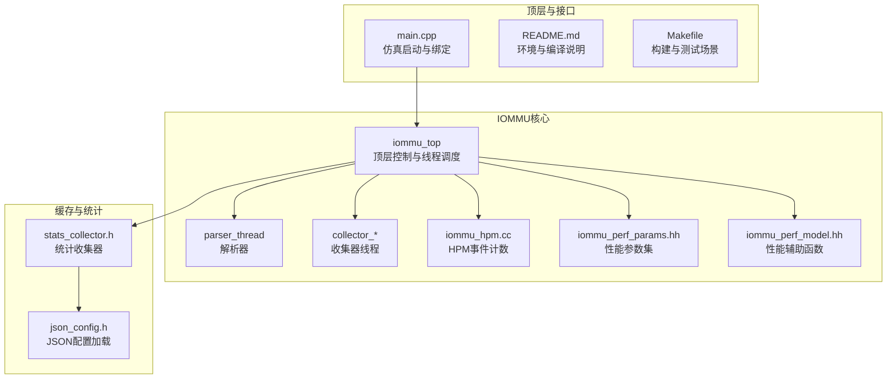
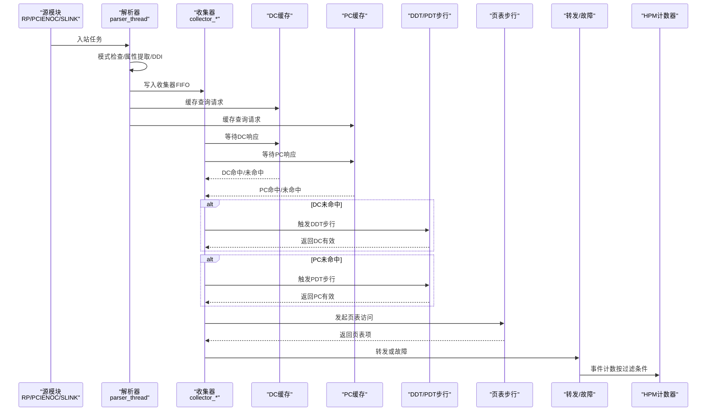
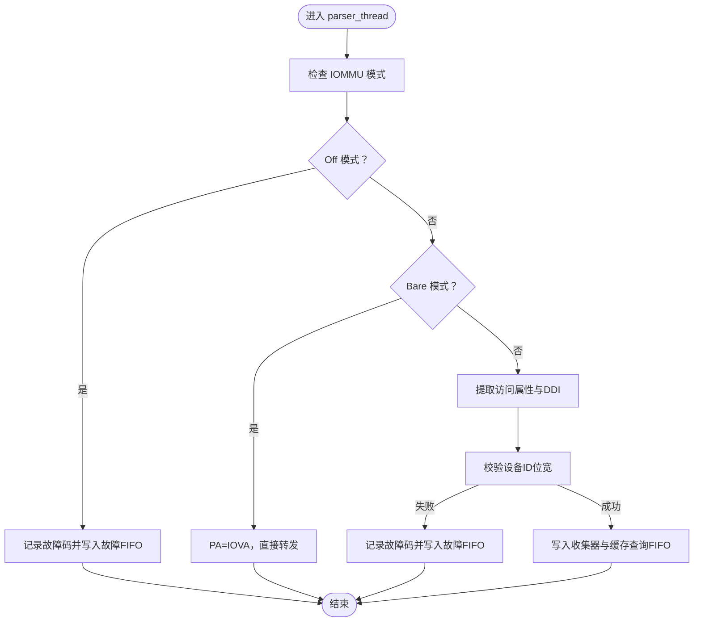
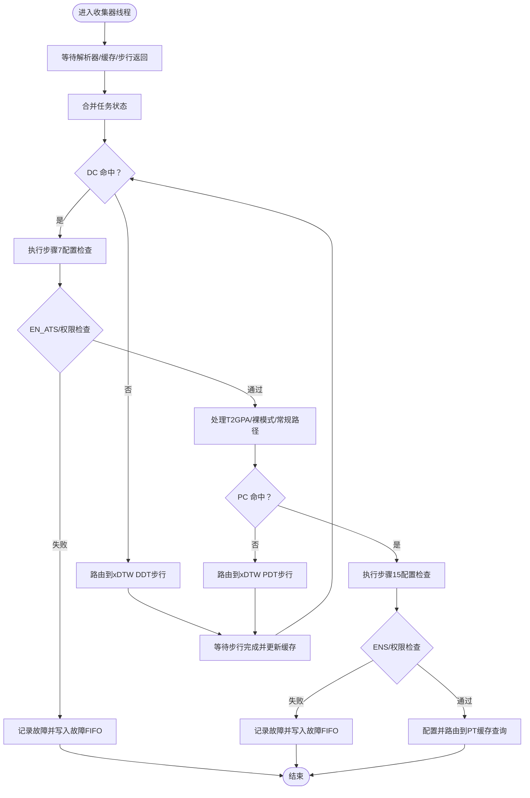
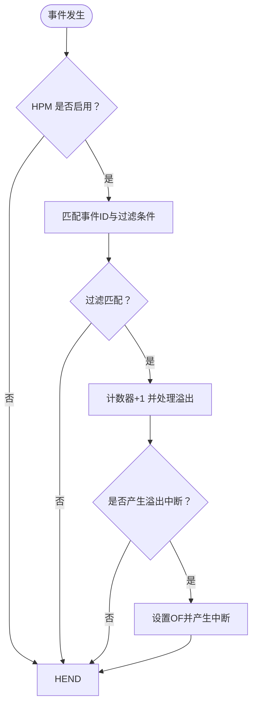
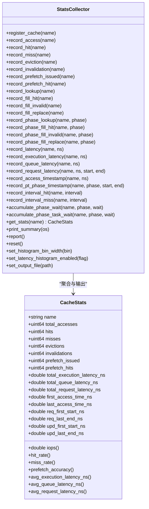
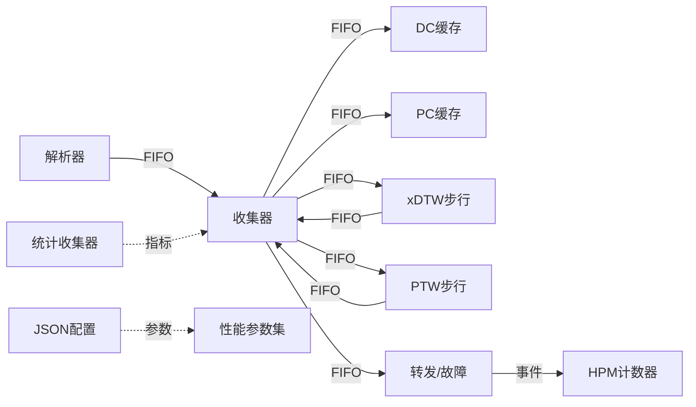
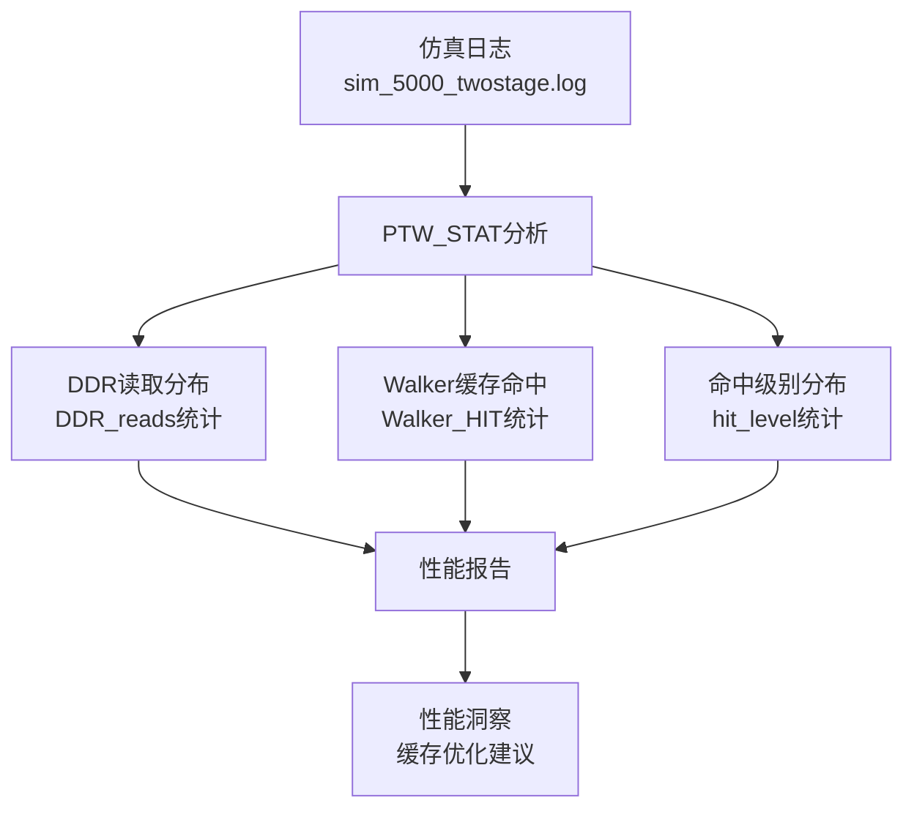

# 性能分析工具

<cite>
**本文引用的文件**
- [README.md](file://README.md)
- [main.cpp](file://main.cpp)
- [Makefile](file://Makefile)
- [iommu_perf_model.hh](file://iommu/include/iommu_perf_model.hh)
- [iommu_perf_parser.cc](file://iommu/iommu_perf_model/iommu_perf_parser.cc)
- [iommu_perf_collector.cc](file://iommu/iommu_perf_model/iommu_perf_collector.cc)
- [stats_collector.h](file://iommu/cache_src/common/stats_collector.h)
- [iommu_hpm.cc](file://iommu/iommu_perf_model/iommu_hpm.cc)
- [iommu_perf_params.hh](file://iommu/iommu_perf_model/iommu_perf_params.hh)
- [json_config.h](file://iommu/cache_src/common/json_config.h)
- [calc_stats.sh](file://tmp/calc_stats.sh)
- [extract_stats.sh](file://tmp/extract_stats.sh)
- [calc_iops.sh](file://tmp/calc_iops.sh)
- [final_analysis.sh](file://tmp/final_analysis.sh)
- [concurrency_analysis.sh](file://tmp/concurrency_analysis.sh)
- [prefetch_timing.sh](file://tmp/prefetch_timing.sh)
- [task_ddr_latency.sh](file://tmp/task_ddr_latency.sh)
- [extract_extra.sh](file://tmp/extract_extra.sh)
- [extract_extra2.sh](file://tmp/extract_extra2.sh)
- [group2_analysis.sh](file://tmp/group2_analysis.sh)
- [ddr_concurrency.sh](file://tmp/ddr_concurrency.sh)
- [verify_max1.sh](file://tmp/verify_max1.sh)
- [verify_max1_twostage.sh](file://tmp/verify_max1_twostage.sh)
</cite>

## 更新摘要
**变更内容**   
- 简化了统计脚本calc_stats.sh，移除了约37行复杂的DDR读取分布分析和预取任务统计代码
- 现在专注于核心性能指标：PTW任务DDR读取分布、Walker缓存命中模式、缓存命中级别分布
- 更新了性能分析工具集的使用方法和最佳实践指南

## 目录
1. [简介](#简介)
2. [项目结构](#项目结构)
3. [核心组件](#核心组件)
4. [架构总览](#架构总览)
5. [详细组件分析](#详细组件分析)
6. [依赖关系分析](#依赖关系分析)
7. [性能考量](#性能考量)
8. [故障排查指南](#故障排查指南)
9. [结论](#结论)
10. [附录](#附录)

## 简介
本文件面向IOMMU性能分析工具集，系统化阐述基于SystemC的RISC-V IOMMU仿真模型中的性能数据采集、统计与分析能力。内容覆盖：
- 性能数据采集工具：解析器线程、收集器线程、HPM事件计数、缓存子系统的统计收集器
- 分析报告生成器：统一的统计汇总与可选直方图输出
- 可视化界面：通过日志与报告进行结果解读与对比
- 完整工作流程：从数据采集到结果解读的端到端流程
- 最佳实践与常见陷阱：采样策略、稳态窗口、统计显著性
- 回归测试与对比分析：多场景对比、参数敏感性评估
- 扩展与定制：参数化配置、新指标接入、缓存策略替换

**更新** 简化了统计脚本，专注于核心性能指标分析，提高了分析效率和准确性

## 项目结构
该仓库采用模块化组织，IOMMU核心位于iommu/目录，性能分析相关代码集中在iommu/iommu_perf_model与iommu/cache_src/common中；顶层main.cpp负责构建系统拓扑并驱动仿真。

**图表来源**
- [main.cpp:39-94](file://main.cpp#L39-L94)
- [Makefile:10-164](file://Makefile#L10-L164)
- [iommu_perf_params.hh:1-161](file://iommu/iommu_perf_model/iommu_perf_params.hh#L1-L161)
- [stats_collector.h:107-196](file://iommu/cache_src/common/stats_collector.h#L107-L196)

**章节来源**
- [README.md:1-92](file://README.md#L1-L92)
- [main.cpp:39-94](file://main.cpp#L39-L94)
- [Makefile:10-164](file://Makefile#L10-L164)

## 核心组件
- 解析器线程（Parser）
  - 功能：接收入站任务，进行模式检查、属性提取、DDI提取、设备ID宽度校验，并将任务分发给收集器与缓存查询。
  - 关键点：无串行延时假设，瓶颈由并发outstanding与下游模块决定；记录入站时间戳用于后续延迟分析。
- 收集器线程（Collector）
  - 功能：汇聚解析器与缓存查询结果，执行设备/进程上下文检查与路由决策，必要时触发DDT/PDT步行（xDTW），最终将任务送入转发或故障处理。
  - 关键点：双线程设计（收集器-1/收集器-2），分别处理缓存响应与步行返回；维护outstanding上限并进行背压通知。
- HPM事件计数器
  - 功能：根据事件选择器与过滤条件对事务进行计数，支持溢出中断上报。
- 统计收集器（StatsCollector）
  - 功能：统一记录缓存访问、延迟、排队、阶段时间戳、区间命中率等指标，并输出汇总报告与可选直方图。
- 性能参数集（iommu_perf_params.hh）
  - 功能：集中定义FIFO深度、缓存容量、带宽、并发限制、处理延迟等关键参数，支撑性能建模与仿真配置。

**章节来源**
- [iommu_perf_parser.cc:9-123](file://iommu/iommu_perf_model/iommu_perf_parser.cc#L9-L123)
- [iommu_perf_collector.cc:14-457](file://iommu/iommu_perf_model/iommu_perf_collector.cc#L14-L457)
- [iommu_hpm.cc:6-110](file://iommu/iommu_perf_model/iommu_hpm.cc#L6-L110)
- [stats_collector.h:13-196](file://iommu/cache_src/common/stats_collector.h#L13-L196)
- [iommu_perf_params.hh:6-161](file://iommu/iommu_perf_model/iommu_perf_params.hh#L6-L161)

## 架构总览
IOMMU性能分析工具链围绕"解析-缓存-步行-转发/故障"的流水线展开，配合统计收集器与HPM计数器形成闭环的数据采集与度量体系。

**图表来源**
- [iommu_perf_parser.cc:9-123](file://iommu/iommu_perf_model/iommu_perf_parser.cc#L9-L123)
- [iommu_perf_collector.cc:14-457](file://iommu/iommu_perf_model/iommu_perf_collector.cc#L14-L457)
- [iommu_hpm.cc:6-110](file://iommu/iommu_perf_model/iommu_hpm.cc#L6-L110)

## 详细组件分析

### 解析器线程（Parser）
- 输入：入站FIFO的任务流
- 处理：
  - 检查IOMMU模式（Off/Bare），非法模式直接故障
  - 提取访问类型与属性（读/写/执行/特权）
  - 提取设备标识（DDI），并校验设备ID位宽
  - 将任务写入收集器与缓存查询FIFO
- 关键接口与路径：
  - [parser_thread:9-123](file://iommu/iommu_perf_model/iommu_perf_parser.cc#L9-L123)
  - [classify_ttype_and_attribs:9-41](file://iommu/include/iommu_perf_model.hh#L9-L41)
  - [extract_DDI:45-55](file://iommu/include/iommu_perf_model.hh#L45-L55)

**图表来源**
- [iommu_perf_parser.cc:9-123](file://iommu/iommu_perf_model/iommu_perf_parser.cc#L9-L123)
- [iommu_perf_model.hh:9-55](file://iommu/include/iommu_perf_model.hh#L9-L55)

**章节来源**
- [iommu_perf_parser.cc:9-123](file://iommu/iommu_perf_model/iommu_perf_parser.cc#L9-L123)
- [iommu_perf_model.hh:9-55](file://iommu/include/iommu_perf_model.hh#L9-L55)

### 收集器线程（Collector）
- 双线程协作：
  - 收集器-1：聚合解析器与DC/PC缓存响应，执行上下文检查与路由决策，必要时触发xDTW步行
  - 收集器-2：处理xDTW步行返回，更新缓存并继续路由
- 关键逻辑：
  - DC/PC命中/未命中判断与后续动作
  - EN_ATS、PDTV、ENS等配置检查
  - Bare/T2GPA等特殊路径处理
  - outstanding上限与背压通知
- 关键接口与路径：
  - [collector_cache_lookup_result_thread:14-275](file://iommu/iommu_perf_model/iommu_perf_collector.cc#L14-L275)
  - [collector_xdtw_response_thread:281-456](file://iommu/iommu_perf_model/iommu_perf_collector.cc#L281-L456)

**图表来源**
- [iommu_perf_collector.cc:14-275](file://iommu/iommu_perf_model/iommu_perf_collector.cc#L14-L275)
- [iommu_perf_collector.cc:281-456](file://iommu/iommu_perf_model/iommu_perf_collector.cc#L281-L456)

**章节来源**
- [iommu_perf_collector.cc:14-275](file://iommu/iommu_perf_model/iommu_perf_collector.cc#L14-L275)
- [iommu_perf_collector.cc:281-456](file://iommu/iommu_perf_model/iommu_perf_collector.cc#L281-L456)

### HPM事件计数器
- 功能：在满足事件ID与ID过滤条件的前提下，对计数器进行递增，并在溢出时设置OF位并产生中断。
- 关键接口与路径：
  - [count_events:7-107](file://iommu/iommu_perf_model/iommu_hpm.cc#L7-L107)

**图表来源**
- [iommu_hpm.cc:6-110](file://iommu/iommu_perf_model/iommu_hpm.cc#L6-L110)

**章节来源**
- [iommu_hpm.cc:6-110](file://iommu/iommu_perf_model/iommu_hpm.cc#L6-L110)

### 统计收集器（StatsCollector）
- 指标维度：
  - 基础缓存指标：总访问、命中、缺失、驱逐、失效、预取命中率
  - 延迟指标：执行延迟、排队延迟、请求延迟均值
  - 时间戳统计：首次/最后访问时间、阶段首尾时间戳、区间命中率
  - 等待统计：阶段RAM端口等待、任务级互斥等待
- 报告输出：统一汇总与可选直方图，支持配置输出文件与直方图粒度。
- 关键接口与路径：
  - [StatsCollector 类与方法声明:107-196](file://iommu/cache_src/common/stats_collector.h#L107-L196)

**图表来源**
- [stats_collector.h:107-196](file://iommu/cache_src/common/stats_collector.h#L107-L196)

**章节来源**
- [stats_collector.h:13-196](file://iommu/cache_src/common/stats_collector.h#L13-L196)

### 性能参数集（iommu_perf_params.hh）
- FIFO深度、缓存容量与关联度、AXI带宽与频率、并发限制、处理延迟、稳态采样窗口等
- 作用：为仿真提供一致的性能建模参数，便于不同场景与配置的对比分析

**章节来源**
- [iommu_perf_params.hh:6-161](file://iommu/iommu_perf_model/iommu_perf_params.hh#L6-L161)

## 依赖关系分析
- 模块耦合
  - 解析器与收集器通过FIFO解耦，避免串行延时成为瓶颈
  - 收集器与缓存子系统通过消息接口交互，支持背压与并发上限控制
  - HPM计数器与转发/故障路径解耦，仅在满足过滤条件时计数
- 外部依赖
  - SystemC库与TLM接口
  - JSON配置加载（用于动态参数注入）

**图表来源**
- [iommu_perf_parser.cc:9-123](file://iommu/iommu_perf_model/iommu_perf_parser.cc#L9-L123)
- [iommu_perf_collector.cc:14-456](file://iommu/iommu_perf_model/iommu_perf_collector.cc#L14-L456)
- [iommu_hpm.cc:6-110](file://iommu/iommu_perf_model/iommu_hpm.cc#L6-L110)
- [stats_collector.h:107-196](file://iommu/cache_src/common/stats_collector.h#L107-L196)
- [json_config.h:9-18](file://iommu/cache_src/common/json_config.h#L9-L18)
- [iommu_perf_params.hh:6-161](file://iommu/iommu_perf_model/iommu_perf_params.hh#L6-L161)

**章节来源**
- [iommu_perf_parser.cc:9-123](file://iommu/iommu_perf_model/iommu_perf_parser.cc#L9-L123)
- [iommu_perf_collector.cc:14-456](file://iommu/iommu_perf_model/iommu_perf_collector.cc#L14-L456)
- [iommu_hpm.cc:6-110](file://iommu/iommu_perf_model/iommu_hpm.cc#L6-L110)
- [stats_collector.h:107-196](file://iommu/cache_src/common/stats_collector.h#L107-L196)
- [json_config.h:9-18](file://iommu/cache_src/common/json_config.h#L9-L18)
- [iommu_perf_params.hh:6-161](file://iommu/iommu_perf_model/iommu_perf_params.hh#L6-L161)

## 性能考量
- 并发与背压
  - 通过outstanding上限与事件通知机制实现背压，避免拥塞
  - 建议优先调整FIFO深度与并发上限，再考虑增加缓存容量
- 延迟建模
  - 处理延迟（解析/收集/缓存命中/步行/转发）与带宽延迟共同决定端到端性能
  - 使用执行延迟而非请求延迟计算IOPS，避免排队引入的偏差
- 稳态采样
  - 采用跳过前/后各10%的稳态窗口统计，提高统计显著性
- 参数敏感性
  - 重点关注FIFO深度、缓存容量/关联度、AXI带宽与并发限制对吞吐与延迟的影响

## 故障排查指南
- 常见故障原因
  - IOMMU模式为Off或Bare但触发了不被允许的事务类型
  - EN_ATS/ENS/PDTV/进程ID宽度等配置检查失败
  - DDI位宽与当前模式不匹配
- 排查步骤
  - 检查解析器日志中的故障码与iotval
  - 对照收集器路径中的配置检查分支定位问题
  - 结合统计收集器的阶段时间戳与等待统计定位瓶颈
- 相关接口与路径：
  - [parser_thread 故障分支:34-73](file://iommu/iommu_perf_model/iommu_perf_parser.cc#L34-L73)
  - [collector 配置检查与故障分支:110-156](file://iommu/iommu_perf_model/iommu_perf_collector.cc#L110-L156)
  - [统计收集器阶段等待与任务等待累计:149-152](file://iommu/cache_src/common/stats_collector.h#L149-L152)

**章节来源**
- [iommu_perf_parser.cc:34-73](file://iommu/iommu_perf_model/iommu_perf_parser.cc#L34-L73)
- [iommu_perf_collector.cc:110-156](file://iommu/iommu_perf_model/iommu_perf_collector.cc#L110-L156)
- [stats_collector.h:149-152](file://iommu/cache_src/common/stats_collector.h#L149-L152)

## 结论
本性能分析工具集通过解析器、收集器、缓存统计与HPM计数器的协同，实现了对IOMMU地址翻译路径的全链路可观测与度量。结合稳态采样与参数化配置，能够高效开展回归测试与对比分析，并为缓存策略优化与系统调优提供可靠依据。

**更新** 简化的统计脚本专注于核心性能指标，提高了分析效率和准确性，更好地支持PTW任务DDR读取分布、Walker缓存命中模式和缓存命中级别分布的分析需求。

## 附录

### 从数据采集到结果解读的完整工作流程
- 数据采集
  - 启动仿真，解析器接收入站任务并进行模式与属性检查
  - 收集器汇聚解析器与缓存查询结果，执行上下文检查与路由
  - HPM在满足过滤条件时对事件进行计数
  - 统计收集器记录缓存访问、延迟、排队与阶段时间戳
- 报告生成
  - 统一汇总缓存命中率、预取准确率、平均延迟、IOPS等指标
  - 可选输出直方图与区间命中率
- 结果解读
  - 对比不同场景/参数配置下的吞吐与延迟
  - 基于阶段时间戳与等待统计定位瓶颈模块

**章节来源**
- [iommu_perf_parser.cc:9-123](file://iommu/iommu_perf_model/iommu_perf_parser.cc#L9-L123)
- [iommu_perf_collector.cc:14-456](file://iommu/iommu_perf_model/iommu_perf_collector.cc#L14-L456)
- [iommu_hpm.cc:6-110](file://iommu/iommu_perf_model/iommu_hpm.cc#L6-L110)
- [stats_collector.h:107-196](file://iommu/cache_src/common/stats_collector.h#L107-L196)

### 性能回归测试与对比分析方法
- 回归测试
  - 固定参数集，运行多个场景（如不同测试场景），记录IOPS与延迟
  - 使用稳态窗口统计，比较前后版本差异
- 对比分析
  - 单变量变化：仅改变FIFO深度/缓存容量/并发上限，观察对吞吐与延迟的影响
  - 多场景对比：在相同条件下比较不同配置组合的性能表现

**章节来源**
- [Makefile:39-49](file://Makefile#L39-L49)
- [iommu_perf_params.hh:149-152](file://iommu/iommu_perf_model/iommu_perf_params.hh#L149-L152)

### 扩展与定制指南
- 新增统计指标
  - 在StatsCollector中添加新的record_*方法与统计字段，统一在report中输出
- 自定义缓存策略
  - 通过替换替换策略实现类（如PLRU/SRRIP）与缓存容量/关联度参数进行对比
- 参数化配置
  - 使用JSON配置加载接口动态注入参数，便于快速实验
- 新增事件计数
  - 在HPM计数器中扩展事件ID与过滤条件，按需新增中断处理

**章节来源**
- [stats_collector.h:107-196](file://iommu/cache_src/common/stats_collector.h#L107-L196)
- [json_config.h:9-18](file://iommu/cache_src/common/json_config.h#L9-L18)
- [iommu_hpm.cc:6-110](file://iommu/iommu_perf_model/iommu_hpm.cc#L6-L110)

### 简化后的统计脚本使用方法

#### 核心性能指标分析脚本
**更新** calc_stats.sh已简化为专注于核心性能指标的分析工具

- **PTW任务DDR读取分布分析**
  - 分析每个PTW任务的DDR读取次数分布
  - 识别WC miss和WC hit任务的不同DDR访问模式
  - 帮助理解Walker缓存对性能的影响

- **Walker缓存命中模式分析**
  - 统计Walker缓存的命中/未命中比例
  - 分析缓存命中率对整体性能的影响
  - 识别缓存大小和关联度的优化空间

- **缓存命中级别分布分析**
  - 分析Walker缓存不同级别的命中情况
  - 了解缓存层次结构的效率
  - 指导缓存参数调优

**图表来源**
- [calc_stats.sh:1-11](file://tmp/calc_stats.sh#L1-L11)

#### 其他辅助分析脚本
- **extract_stats.sh**: 全面的性能统计提取，包含PT缓存、Walker缓存、IOPS等指标
- **calc_iops.sh**: IOPS计算和稳态窗口分析
- **final_analysis.sh**: 综合性能分析，包含延时分布和DDR访问统计
- **concurrency_analysis.sh**: 并发性和DDR仲裁器分析
- **prefetch_timing.sh**: 预取任务时序分析
- **task_ddr_latency.sh**: 任务级DDR延迟分析
- **extract_extra.sh**: 额外的PTW和PT缓存统计
- **extract_extra2.sh**: DDR仲裁器和全局统计
- **group2_analysis.sh**: 特定组别分析
- **ddr_concurrency.sh**: DDR并发详细分析
- **verify_max1.sh**: MAX_OUTSTANDING=1场景验证
- **verify_max1_twostage.sh**: 两阶段MAX_OUTSTANDING=1验证

**章节来源**
- [calc_stats.sh:1-11](file://tmp/calc_stats.sh#L1-L11)
- [extract_stats.sh:1-114](file://tmp/extract_stats.sh#L1-L114)
- [calc_iops.sh:1-65](file://tmp/calc_iops.sh#L1-L65)
- [final_analysis.sh:1-72](file://tmp/final_analysis.sh#L1-L72)
- [concurrency_analysis.sh:1-47](file://tmp/concurrency_analysis.sh#L1-L47)
- [prefetch_timing.sh:1-76](file://tmp/prefetch_timing.sh#L1-L76)
- [task_ddr_latency.sh:1-79](file://tmp/task_ddr_latency.sh#L1-L79)
- [extract_extra.sh:1-86](file://tmp/extract_extra.sh#L1-L86)
- [extract_extra2.sh:1-76](file://tmp/extract_extra2.sh#L1-L76)
- [group2_analysis.sh:1-32](file://tmp/group2_analysis.sh#L1-L32)
- [ddr_concurrency.sh:1-79](file://tmp/ddr_concurrency.sh#L1-L79)
- [verify_max1.sh:1-43](file://tmp/verify_max1.sh#L1-L43)
- [verify_max1_twostage.sh:1-38](file://tmp/verify_max1_twostage.sh#L1-L38)

### 性能分析最佳实践

#### 数据采样策略
- **稳态窗口选择**
  - 使用中间60%-80%的请求数据进行稳态分析
  - 避免启动和关闭阶段的瞬态影响
  - 确保样本量足够大以提高统计显著性

- **DDR访问模式分析**
  - 关注PTW任务的DDR读取分布特征
  - 区分主任务和预取任务的DDR访问模式
  - 分析Walker缓存命中对DDR访问次数的影响

#### 统计显著性检验
- **置信区间计算**
  - 对关键指标（IOPS、延迟）计算置信区间
  - 使用t分布或正态分布进行假设检验
  - 确保性能改进具有统计学意义

- **异常值处理**
  - 识别和处理极端延迟值
  - 使用百分位数（P95、P99）代替平均值
  - 分析长尾延迟的影响因素

#### 性能回归测试方法
- **基准测试套件**
  - 建立标准测试场景集合
  - 定期运行回归测试检测性能退化
  - 自动化性能监控和告警

- **对比分析方法**
  - 单变量对比：每次只改变一个参数
  - 多场景对比：在不同负载模式下测试
  - 历史趋势分析：跟踪长期性能变化

**章节来源**
- [calc_stats.sh:1-11](file://tmp/calc_stats.sh#L1-L11)
- [extract_stats.sh:34-36](file://tmp/extract_stats.sh#L34-L36)
- [calc_iops.sh:34-52](file://tmp/calc_iops.sh#L34-L52)
- [final_analysis.sh:62-71](file://tmp/final_analysis.sh#L62-L71)