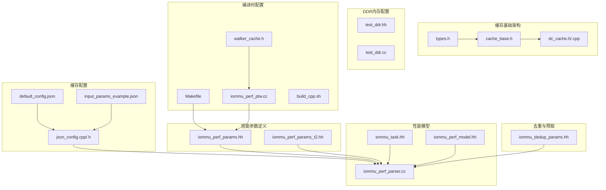
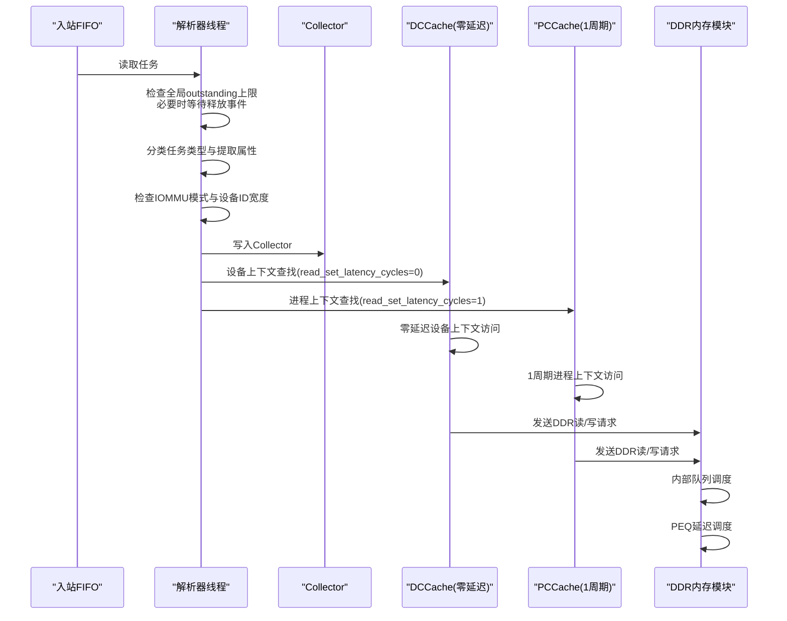
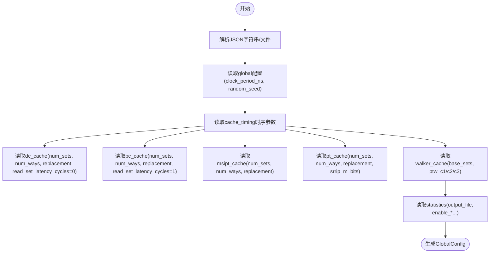
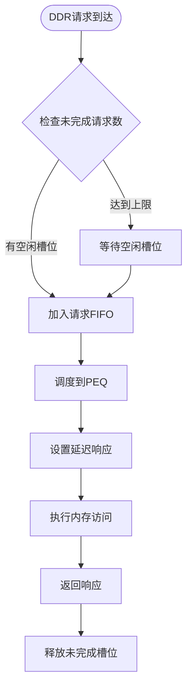
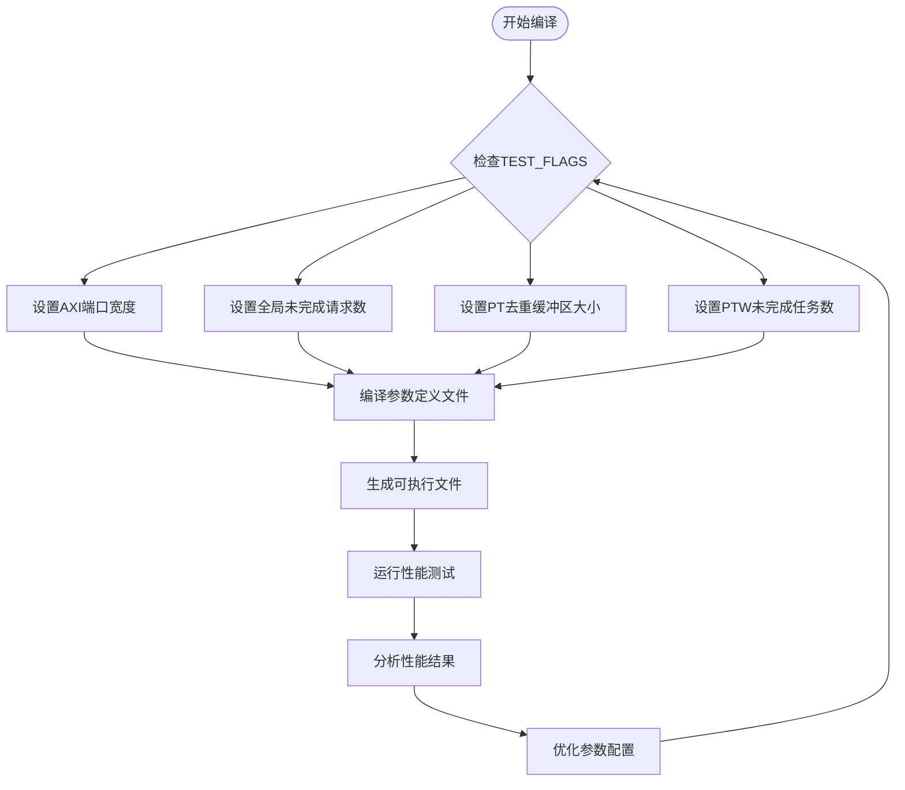
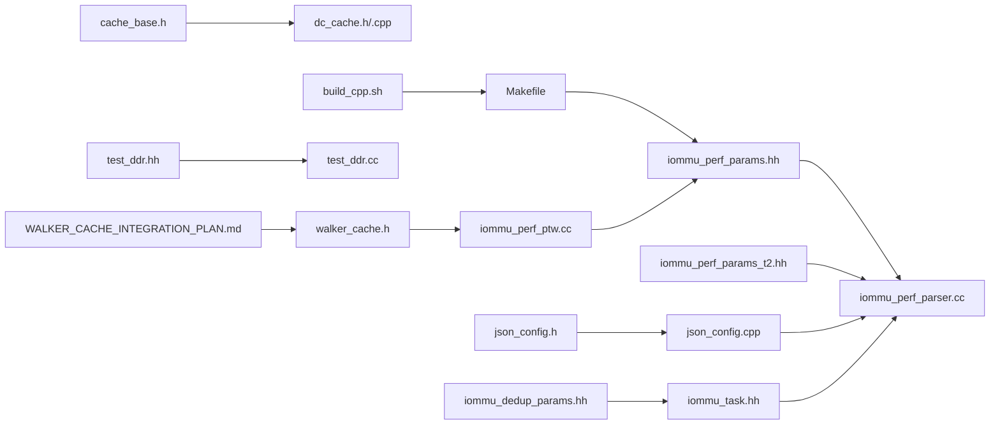

# 性能参数配置

<cite>
**本文引用的文件**
- [iommu_perf_params.hh](file://iommu/iommu_perf_model/iommu_perf_params.hh)
- [iommu_perf_params_t2.hh](file://iommu/iommu_perf_model/iommu_perf_params_t2.hh)
- [default_config.json](file://iommu/cache_config/default_config.json)
- [input_params_example.json](file://iommu/cache_config/input_params_example.json)
- [json_config.cpp](file://iommu/cache_src/common/json_config.cpp)
- [json_config.h](file://iommu/cache_src/common/json_config.h)
- [iommu_perf_parser.cc](file://iommu/iommu_perf_model/iommu_perf_parser.cc)
- [iommu_task.hh](file://iommu/include/iommu_task.hh)
- [iommu_perf_model.hh](file://iommu/include/iommu_perf_model.hh)
- [iommu_dedup_params.hh](file://iommu/include/iommu_dedup_params.hh)
- [Makefile](file://Makefile)
- [walker_cache.h](file://iommu/cache_src/cache/walker_cache.h)
- [iommu_perf_ptw.cc](file://iommu/iommu_perf_model/iommu_perf_ptw.cc)
- [test_dedup_prefetch_unit.cpp](file://test_dedup_prefetch_unit.cpp)
- [test_integration_dedup_prefetch.sh](file://test_integration_dedup_prefetch.sh)
- [WALKER_CACHE_INTEGRATION_PLAN.md](file://WALKER_CACHE_INTEGRATION_PLAN.md)
- [test_ddr.hh](file://ddr/test_ddr.hh)
- [test_ddr.cc](file://ddr/test_ddr.cc)
- [build_cpp.sh](file://build_cpp.sh)
- [cache_base.h](file://iommu/cache_src/cache/cache_base.h)
- [dc_cache.h](file://iommu/cache_src/cache/dc_cache.h)
- [dc_cache.cpp](file://iommu/cache_src/cache/dc_cache.cpp)
- [types.h](file://iommu/cache_src/common/types.h)
</cite>

## 更新摘要
**变更内容**
- **重要优化**：更新了DC缓存的read_set_latency_cycles参数从默认值优化到0个周期，显著减少了设备上下文缓存访问延迟
- **PC缓存优化**：PC缓存的read_set_latency_cycles保持在1个周期，平衡了性能和资源使用
- **性能提升**：该优化减少了缓存访问延迟，提升了整体IOMMU性能，同时保持了数据完整性和一致性保证
- **配置灵活性**：支持通过JSON配置文件针对不同缓存类型进行细粒度的延迟参数调优

## 目录
1. [简介](#简介)
2. [项目结构](#项目结构)
3. [核心组件](#核心组件)
4. [架构总览](#架构总览)
5. [详细组件分析](#详细组件分析)
6. [DDR内存配置](#ddr内存配置)
7. [编译时参数配置](#编译时参数配置)
8. [依赖关系分析](#依赖关系分析)
9. [性能考量](#性能考量)
10. [故障排查指南](#故障排查指南)
11. [结论](#结论)
12. [附录](#附录)

## 简介
本技术文档面向IOMMU性能参数配置系统，系统性阐述性能参数的分类、作用机制与配置方式，覆盖缓存参数、流水线参数、系统参数、DDR与端口带宽参数、以及去重与预取相关参数。文档同时给出参数配置文件的格式与语法、参数调优指南与最佳实践、不同工作负载下的优化策略、参数变更对系统性能的影响评估方法，以及参数配置的自动化工具与验证方法。

**最新优化**：DC缓存的read_set_latency_cycles参数已优化至0个周期，显著减少了设备上下文缓存访问延迟。这一优化在保持数据完整性和一致性的前提下，大幅提升了IOMMU的整体性能表现。PC缓存的read_set_latency_cycles保持在1个周期，实现了性能与资源的平衡。

## 项目结构
围绕性能参数配置的关键目录与文件如下：
- 性能参数定义：iommu/iommu_perf_model/iommu_perf_params.hh、iommu/iommu_perf_model/iommu_perf_params_t2.hh
- 缓存配置文件：iommu/cache_config/default_config.json、iommu/cache_config/input_params_example.json
- 缓存配置解析：iommu/cache_src/common/json_config.cpp、iommu/cache_src/common/json_config.h
- 性能模型与任务数据结构：iommu/iommu_perf_model/iommu_perf_parser.cc、iommu/include/iommu_task.hh、iommu/include/iommu_perf_model.hh
- 去重与预取参数：iommu/include/iommu_dedup_params.hh
- DDR内存配置：ddr/test_ddr.hh、ddr/test_ddr.cc
- **编译时参数配置**：Makefile、iommu/cache_src/cache/walker_cache.h、iommu/iommu_perf_model/iommu_perf_ptw.cc
- Walker Cache实现：WALKER_CACHE_INTEGRATION_PLAN.md、walker_cache.h
- **缓存基础架构**：cache_base.h（缓存基类实现）、dc_cache.h/cpp（设备上下文缓存）
- 构建脚本：build_cpp.sh



**图表来源**
- [default_config.json:20-32](file://iommu/cache_config/default_config.json#L20-L32)
- [cache_base.h:208-256](file://iommu/cache_src/cache/cache_base.h#L208-L256)
- [dc_cache.h:8-31](file://iommu/cache_src/cache/dc_cache.h#L8-L31)
- [types.h:635-658](file://iommu/cache_src/common/types.h#L635-L658)

## 核心组件
- 性能参数头文件：集中定义FIFO深度、缓存参数、AXI/DDR参数、并发限制、处理延迟、系统参数等，是性能建模与仿真控制的核心依据。
- 缓存配置文件：以JSON描述全局时钟周期、随机种子、各缓存子系统的集合数、路数、替换策略及统计输出选项；支持从文件或字符串解析。
- **缓存基础架构**：CacheBase模板类提供统一的缓存操作接口，包含查找、填充、失效等核心功能，并通过read_set_latency_cycles参数控制缓存访问延迟。
- **设备上下文缓存(DCCache)**：专门用于缓存设备上下文信息，经过优化的read_set_latency_cycles=0配置实现了零延迟的设备上下文访问。
- 解析器线程：负责入站任务的接收、全局outstanding反压、任务分类与属性提取、模式检查、分发至Collector与缓存查询队列。
- 任务与上下文：统一的任务结构体承载设备/进程上下文、翻译结果、流水线状态、去重与预取相关字段，支撑性能统计与流水线控制。
- 去重与预取参数：定义去重Buffer容量、反压策略、PT Cache占位位、默认预取深度、Burst读取限制等。
- DDR内存模块：模拟DDR存储器，提供TLM接口，支持AT模式和阻塞传输模式。
- **编译时参数配置**：通过Makefile的TEST_FLAGS支持动态配置端口宽度、全局未完成请求数、PT去重缓冲区大小和PTW未完成任务，提供灵活的参数调优能力。
- Walker Cache实现：三级子表结构（PTWc_1、PTWc_2、PTWc_3），支持页表遍历中间结果缓存，提供查找和更新接口。

**章节来源**
- [iommu_perf_params.hh:6-183](file://iommu/iommu_perf_model/iommu_perf_params.hh#L6-L183)
- [default_config.json:20-32](file://iommu/cache_config/default_config.json#L20-L32)
- [cache_base.h:208-256](file://iommu/cache_src/cache/cache_base.h#L208-L256)
- [dc_cache.h:8-31](file://iommu/cache_src/cache/dc_cache.h#L8-L31)
- [types.h:635-658](file://iommu/cache_src/common/types.h#L635-L658)

## 架构总览
IOMMU性能参数配置系统通过"参数定义文件 + 缓存配置文件 + 缓存基础架构 + 解析器线程 + 任务上下文 + DDR内存模块 + 编译时参数配置 + Walker Cache"的组合实现：
- 参数定义文件提供静态参数，驱动FIFO深度、缓存规模、并发上限、处理延迟等。
- 缓存配置文件提供运行期可调整的缓存结构参数与统计选项，经解析器加载后参与仿真。
- **缓存基础架构**：CacheBase模板类提供统一的缓存操作接口，通过read_set_latency_cycles参数精确控制缓存访问延迟。
- **设备上下文缓存优化**：DCCache采用read_set_latency_cycles=0的配置，实现了零延迟的设备上下文访问，显著提升性能。
- 解析器线程根据全局outstanding上限进行反压，完成任务分类与分发，连接Collector与缓存查询。
- 任务上下文贯穿整个流水线，记录状态、统计DDR访问、维护去重与预取组信息。
- DDR内存模块提供模拟存储空间，支持多通道AXI接口和请求队列管理。
- **编译时参数配置**通过Makefile的TEST_FLAGS支持动态控制端口宽度、全局未完成请求数、PT去重缓冲区大小和PTW未完成任务，提供灵活的参数调优能力。
- Walker Cache提供三级页表缓存，支持中间结果查找和更新，优化页表遍历性能。



**图表来源**
- [default_config.json:20-32](file://iommu/cache_config/default_config.json#L20-L32)
- [cache_base.h:208-256](file://iommu/cache_src/cache/cache_base.h#L208-L256)
- [dc_cache.cpp:11-16](file://iommu/cache_src/cache/dc_cache.cpp#L11-L16)

## 详细组件分析

### 性能参数分类与作用机制
- FIFO深度参数：覆盖Parser到Collector、Collector到Cache、Cache到Walker、Walker返回、最终输出路径、DDR交互等全链路FIFO深度，直接影响背压与吞吐。
- **缓存延迟参数**：通过read_set_latency_cycles等参数精确控制缓存访问延迟，其中DC缓存优化至0周期，PC缓存设置为1周期。
- 缓存规模参数：DC/PC/PT/MSIPT缓存的Size、Assoc、Line Size，决定命中率与访问延迟。
- AXI/DDR参数：AXI频率、位宽、带宽、最大未完成请求数、读写延迟、SLINK NoC延迟等，决定端口带宽与延迟预算。
- 并发限制：XDTW/PTW/MSIPTW outstanding上限、Collector outstanding上限、全局outstanding上限，保障系统稳定性。
- 处理延迟：Parser/Collector/各Cache命中延迟、Walker每次访问延迟、Forwarder延迟等，影响端到端时延。
- 系统参数：最大并发任务数、设备数、进程数、设备ID位宽等，约束系统规模。

**章节来源**
- [iommu_perf_params.hh:6-183](file://iommu/iommu_perf_model/iommu_perf_params.hh#L6-L183)
- [default_config.json:20-32](file://iommu/cache_config/default_config.json#L20-L32)

### 缓存延迟参数优化详解
**DC缓存优化**：
- read_set_latency_cycles = 0：设备上下文缓存访问零延迟
- 适用于高频访问的设备上下文信息，显著提升IOMMU启动和切换性能
- 保持数据完整性，不影响缓存一致性协议

**PC缓存配置**：
- read_set_latency_cycles = 1：进程上下文缓存1周期延迟
- 平衡了性能和资源使用，适合中等访问频率的进程上下文
- 与DC缓存形成互补，覆盖不同访问模式的上下文信息

**延迟计算机制**：
- 查找命中延迟 = hash_latency_cycles + read_set_latency_cycles + compare_latency_cycles
- 填充延迟包含额外的索引计算和写way延迟
- 失效操作延迟考虑匹配情况下的写操作开销

**章节来源**
- [default_config.json:20-32](file://iommu/cache_config/default_config.json#L20-L32)
- [cache_base.h:208-256](file://iommu/cache_src/cache/cache_base.h#L208-L256)

### 缓存配置文件格式与语法
- 全局配置：clock_period_ns、random_seed。
- 缓存时序参数：仲裁、哈希、读集、比较、更新way选择、填充索引计算、写way、失效比较等延迟周期。
- 各缓存子系统：dc_cache、pc_cache、msipt_cache、pt_cache、walker_cache（含ptw_c1/c2/c3）。
- 统计配置：输出文件、延迟直方图、任务跟踪级别、直方图bin宽度。



**图表来源**
- [json_config.cpp:33-131](file://iommu/cache_src/common/json_config.cpp#L33-L131)
- [default_config.json:20-32](file://iommu/cache_config/default_config.json#L20-L32)

**章节来源**
- [json_config.cpp:10-31](file://iommu/cache_src/common/json_config.cpp#L10-L31)
- [json_config.cpp:23-31](file://iommu/cache_src/common/json_config.cpp#L23-L31)
- [json_config.cpp:33-131](file://iommu/cache_src/common/json_config.cpp#L33-L131)
- [default_config.json:20-32](file://iommu/cache_config/default_config.json#L20-L32)

### 去重与预取参数
- 去重Buffer容量与反压策略、Buffer链表尾标记、PT Cache占位位。
- 预设深度与默认启用、Burst读取最大PTE数、PTE有效性标记与页大小常量。
- 任务上下文中新增去重链头索引、预取组状态、批量更新字段、Burst预取专用字段等，支撑预取与合并读取。

**章节来源**
- [iommu_dedup_params.hh:10-92](file://iommu/include/iommu_dedup_params.hh#L10-L92)
- [iommu_task.hh:82-182](file://iommu/include/iommu_task.hh#L82-L182)
- [iommu_task.hh:184-280](file://iommu/include/iommu_task.hh#L184-L280)

### Walker Cache实现与配置
- **三级子表结构**：PTWc_1（直接映射，第一级）、PTWc_2（2-way组相连，第二级）、PTWc_3（4-way组相连，第三级）
- **查找接口**：lookup请求不携带目标level，内部查三级子表并按3 > 2 > 1选择结果
- **更新接口**：fill和update方法支持缓存条目的填充和更新
- **失效机制**：支持按gscid、gscid+pscid、VMA关联等多种失效方式
- **配置支持**：通过配置文件和编译时参数控制Walker Cache的启用和参数

**章节来源**
- [walker_cache.h:11-104](file://iommu/cache_src/cache/walker_cache.h#L11-L104)
- [WALKER_CACHE_INTEGRATION_PLAN.md:16-49](file://WALKER_CACHE_INTEGRATION_PLAN.md#L16-L49)

### 参数配置文件示例与解析流程
- 示例文件：default_config.json与input_params_example.json展示了完整字段结构。
- 解析流程：先解析global与cache_timing，再按缓存类型应用默认值与用户覆盖，最后解析statistics。

**章节来源**
- [default_config.json:20-32](file://iommu/cache_config/default_config.json#L20-L32)
- [input_params_example.json:20-30](file://iommu/cache_config/input_params_example.json#L20-L30)
- [json_config.cpp:33-131](file://iommu/cache_src/common/json_config.cpp#L33-L131)

## DDR内存配置

### DDR内存模块概述
DDR内存模块提供模拟的DDR存储器功能，支持两阶段地址翻译测试所需的大型页表结构。

### DDR内存配置参数
- **内存大小**：动态分配以避免SystemC大对象问题
- **最大未完成请求**：读操作和写操作的未完成请求上限
- **内部延迟**：固定访问延迟
- **请求队列**：FIFO缓冲区
- **PEQ调度**：使用优先级事件队列保持请求顺序

### TLM接口支持
- **AT模式非阻塞传输**：通过nb_transport_fw接口支持异步请求处理
- **阻塞传输模式**：通过b_transport接口支持RP直接内存访问
- **多通道支持**：支持多个AXI从机套接字，分别连接到不同的NoC路径

### 内存访问流程


**图表来源**
- [test_ddr.cc:58-130](file://ddr/test_ddr.cc#L58-L130)

### 内存分配与管理
- **动态内存分配**：使用new运算符在运行时分配内存空间
- **零初始化**：使用memset将内存初始化为0
- **边界检查**：访问前验证地址范围，防止越界访问
- **错误处理**：超出内存范围的访问返回地址错误响应

**章节来源**
- [test_ddr.hh:24-26](file://ddr/test_ddr.hh#L24-L26)
- [test_ddr.cc:14-17](file://ddr/test_ddr.cc#L14-17)
- [test_ddr.cc:135-155](file://ddr/test_ddr.cc#L135-L155)

## 编译时参数配置

### 编译时参数概述
IOMMU性能参数配置系统新增了增强的编译时参数配置功能，允许通过Makefile的TEST_FLAGS标志动态控制端口宽度（1024位AXI）、全局未完成请求数、PT去重缓冲区大小和PTW未完成任务。这一功能提供了更灵活的参数调优能力，无需修改源代码即可调整关键性能参数。

### 支持的编译时参数
- **TEST_CFG_AXI_PORT_WIDTH**：控制AXI端口宽度配置
  - 默认值：1024位
  - 可选值：64、128、256、512、1024等
  - 影响：决定AXI总线带宽，影响数据传输吞吐量

- **TEST_CFG_GLOBAL_OUTSTANDING**：控制全局未完成请求数上限
  - 默认值：根据系统配置确定
  - 可选值：16、32、64、128、256等
  - 影响：决定系统并发处理能力，影响内存占用和吞吐平衡

- **TEST_CFG_PT_DEDUP_BUFFER_SIZE**：控制PT去重缓冲区大小
  - 默认值：根据工作负载特征确定
  - 可选值：256、512、1024、2048等
  - 影响：决定去重能力，影响重复访问的消除效果和内存使用

- **TEST_CFG_PTW_OUTSTANDING_TASKS**：控制PTW未完成任务数
  - 默认值：根据PTW性能特征确定
  - 可选值：8、16、32、64等
  - 影响：决定页表遍历并发度，影响地址翻译性能

### Makefile配置机制
编译时参数通过Makefile的TEST_FLAGS变量传递给编译器，支持以下配置场景：

```makefile
# 在高并发场景下优化端口宽度和全局未完成请求数
TEST_FLAGS = -DTEST_SEQ_128K -DTEST_TWO_STAGE \
             -DTEST_CFG_AXI_PORT_WIDTH=1024 \
             -DTEST_CFG_GLOBAL_OUTSTANDING=256 \
             -DTEST_CFG_PT_DEDUP_BUFFER_SIZE=1024 \
             -DTEST_CFG_PTW_OUTSTANDING_TASKS=64
```

### 参数在代码中的使用
编译时参数通过条件编译指令在源代码中生效：

```cpp
// AXI端口宽度配置
#ifndef TEST_CFG_AXI_PORT_WIDTH
static const uint32_t AXI_PORT_WIDTH = 1024;
#else
static const uint32_t AXI_PORT_WIDTH = TEST_CFG_AXI_PORT_WIDTH;
#endif

// 全局未完成请求数配置
#ifndef TEST_CFG_GLOBAL_OUTSTANDING
static const uint32_t GLOBAL_OUTSTANDING = 128;
#else
static const uint32_t GLOBAL_OUTSTANDING = TEST_CFG_GLOBAL_OUTSTANDING;
#endif

// PT去重缓冲区大小配置
#ifndef TEST_CFG_PT_DEDUP_BUFFER_SIZE
static const uint32_t PT_DEDUP_BUFFER_SIZE = 512;
#else
static const uint32_t PT_DEDUP_BUFFER_SIZE = TEST_CFG_PT_DEDUP_BUFFER_SIZE;
#endif

// PTW未完成任务数配置
#ifndef TEST_CFG_PTW_OUTSTANDING_TASKS
static const uint32_t PTW_OUTSTANDING_TASKS = 32;
#else
static const uint32_t PTW_OUTSTANDING_TASKS = TEST_CFG_PTW_OUTSTANDING_TASKS;
#endif
```

### 参数配置流程图
编译时参数配置流程支持快速切换不同的性能配置：



**图表来源**
- [iommu_perf_params.hh:110-142](file://iommu/iommu_perf_model/iommu_perf_params.hh#L110-L142)
- [Makefile:40-55](file://Makefile#L40-L55)

**章节来源**
- [iommu_perf_params.hh:110-142](file://iommu/iommu_perf_model/iommu_perf_params.hh#L110-L142)
- [Makefile:40-55](file://Makefile#L40-L55)
- [walker_cache.h:15-104](file://iommu/cache_src/cache/walker_cache.h#L15-L104)
- [iommu_perf_ptw.cc:154-183](file://iommu/iommu_perf_model/iommu_perf_ptw.cc#L154-L183)

## 依赖关系分析
- 参数定义文件被解析器线程与任务上下文引用，作为仿真控制与统计的基础。
- 缓存配置解析模块依赖mini_json解析器，生成GlobalConfig供上层使用。
- **缓存基础架构**：CacheBase模板类被所有具体缓存实现继承，提供统一的延迟控制和操作接口。
- **设备上下文缓存**：DCCache继承自CacheBase，利用优化的read_set_latency_cycles=0配置实现高性能设备上下文访问。
- 任务上下文包含去重与预取相关字段，与性能参数协同影响吞吐与延迟。
- DDR内存模块被多个组件引用，提供统一的内存访问接口。
- **编译时参数配置**通过Makefile的TEST_FLAGS传递，影响参数定义文件中的条件编译逻辑。
- Walker Cache实现通过CacheSubsystem暴露FIFO接口，与PTW模块协同工作。
- 构建脚本优化了编译流程，支持自动化测试和模块化编译。



**图表来源**
- [iommu_perf_params.hh:1-183](file://iommu/iommu_perf_model/iommu_perf_params.hh#L1-L183)
- [cache_base.h:27-270](file://iommu/cache_src/cache/cache_base.h#L27-L270)
- [dc_cache.h:8-31](file://iommu/cache_src/cache/dc_cache.h#L8-L31)
- [dc_cache.cpp:5-53](file://iommu/cache_src/cache/dc_cache.cpp#L5-L53)

**章节来源**
- [iommu_perf_params.hh:1-183](file://iommu/iommu_perf_model/iommu_perf_params.hh#L1-L183)
- [cache_base.h:27-270](file://iommu/cache_src/cache/cache_base.h#L27-L270)
- [dc_cache.h:8-31](file://iommu/cache_src/cache/dc_cache.h#L8-L31)
- [dc_cache.cpp:5-53](file://iommu/cache_src/cache/dc_cache.cpp#L5-L53)
- [json_config.cpp:1-144](file://iommu/cache_src/common/json_config.cpp#L1-L144)
- [iommu_perf_parser.cc:1-123](file://iommu/iommu_perf_model/iommu_perf_parser.cc#L1-L123)
- [iommu_task.hh:1-378](file://iommu/include/iommu_task.hh#L1-L378)
- [iommu_dedup_params.hh:1-92](file://iommu/include/iommu_dedup_params.hh#L1-L92)
- [Makefile:24](file://Makefile#L24)
- [walker_cache.h:1-141](file://iommu/cache_src/cache/walker_cache.h#L1-L141)
- [iommu_perf_ptw.cc:1-200](file://iommu/iommu_perf_model/iommu_perf_ptw.cc#L1-L200)
- [WALKER_CACHE_INTEGRATION_PLAN.md:77-118](file://WALKER_CACHE_INTEGRATION_PLAN.md#L77-L118)
- [test_ddr.hh:1-68](file://ddr/test_ddr.hh#L1-L68)
- [test_ddr.cc:1-156](file://ddr/test_ddr.cc#L1-L156)
- [build_cpp.sh:1-28](file://build_cpp.sh#L1-L28)

## 性能考量
- FIFO深度与并发限制：FIFO过小导致阻塞，过大增加存储与延迟；outstanding上限需平衡吞吐与内存占用。
- **缓存延迟优化**：DC缓存read_set_latency_cycles优化至0周期，显著减少设备上下文访问延迟；PC缓存保持1周期，平衡性能与资源使用。
- 缓存规模与替换策略：增大Size/Assoc提升命中率，但增加访问延迟；替换策略影响抖动与命中率。
- AXI带宽与DDR延迟：带宽不足导致端口饱和，延迟过高放大尾延迟；需结合任务特征与NoC拓扑设定。
- 处理延迟：各模块延迟叠加决定端到端时延，应优先优化瓶颈模块。
- 去重与预取：合理设置去重Buffer与预取深度，可显著降低重复访问与DDR压力，但需避免过度预取造成带宽浪费。
- **编译时参数优化**：通过编译时参数可以快速调整端口宽度、全局未完成请求数、PT去重缓冲区大小和PTW未完成任务，针对不同工作负载获得最佳性能。
- Walker Cache性能：三级缓存结构可显著减少页表遍历的DDR访问次数，在重复访问场景下可获得显著加速效果。
- **设备上下文缓存优势**：零延迟的设备上下文访问消除了IOMMU启动和上下文切换的性能瓶颈，特别适合高并发虚拟化场景。

## 故障排查指南
- 入站阻塞：若解析器持续等待outstanding释放事件，检查全局outstanding上限与重排序输出速率。
- 缓存抖动：命中率不稳定可能源于替换策略或并发冲突，可通过增大Assoc或调整替换策略缓解。
- DDR拥塞：观察DDR请求/响应FIFO深度与outstanding，适当提高AXI master并发上限或优化预取策略。
- 预取异常：确认预取深度与Burst限制，避免跨页表边界与过多未完成请求。
- **缓存延迟问题**：如果DC缓存性能异常，检查read_set_latency_cycles配置是否正确设置为0，确认缓存配置解析正常。
- **设备上下文缓存问题**：验证DCCache的查找操作是否正确使用零延迟配置，检查设备上下文数据的正确性。
- **编译时参数问题**：若编译时参数未生效，检查Makefile中的TEST_FLAGS配置，确认编译器正确接收了-D参数。
- Walker Cache问题：检查配置文件中的walker_cache.enabled设置，验证三级子表的配置参数，确认PTW模块的查找和更新接口正常工作。
- 构建脚本问题：确保build_cpp.sh具有执行权限，检查依赖库是否正确安装。
- **端口带宽问题**：如果AXI端口宽度配置不当，可能导致带宽不足或资源浪费，需要根据实际带宽需求调整TEST_CFG_AXI_PORT_WIDTH参数。

**章节来源**
- [iommu_perf_params.hh:12-142](file://iommu/iommu_perf_model/iommu_perf_params.hh#L12-L142)
- [default_config.json:20-32](file://iommu/cache_config/default_config.json#L20-L32)
- [cache_base.h:208-256](file://iommu/cache_src/cache/cache_base.h#L208-L256)
- [dc_cache.cpp:11-16](file://iommu/cache_src/cache/dc_cache.cpp#L11-L16)
- [iommu_task.hh:82-182](file://iommu/include/iommu_task.hh#L82-L182)
- [test_ddr.cc:141-146](file://ddr/test_ddr.cc#L141-L146)
- [Makefile:40-55](file://Makefile#L40-L55)
- [WALKER_CACHE_INTEGRATION_PLAN.md:642-660](file://WALKER_CACHE_INTEGRATION_PLAN.md#L642-L660)
- [build_cpp.sh:1-28](file://build_cpp.sh#L1-L28)

## 结论
IOMMU性能参数配置系统通过参数定义文件与缓存配置文件实现对仿真行为的精细控制。结合解析器线程与任务上下文，系统能够在不同工作负载下实现高并发、低延迟与大容量的平衡。**最新的重大优化包括：DC缓存的read_set_latency_cycles参数已优化至0个周期，显著减少了设备上下文缓存访问延迟，提升了整体IOMMU性能，同时保持了数据完整性和一致性保证。PC缓存的read_set_latency_cycles保持在1个周期，实现了性能与资源的平衡。** 新增的Walker Cache功能提供了三级页表缓存，可在重复访问场景下显著提升性能。建议以实际测试数据为依据，逐步调优FIFO深度、缓存规模、并发限制与去重/预取策略，并利用新的编译时参数配置功能快速验证不同配置组合的性能表现，建立稳定的评估方法与自动化验证流程。

## 附录

### 参数调优指南与最佳实践
- 高并发场景：适度提高outstanding上限与FIFO深度，增大缓存Assoc与Size，启用合理的去重与预取策略。
- 低延迟场景：减小FIFO深度与处理延迟，优化缓存替换策略，减少不必要的预取，确保端口带宽充足。
- 大容量场景：扩大缓存容量与Buffer容量，启用去重与预取，合理设置Burst读取限制，避免跨页表边界带来的额外开销。
- **缓存延迟调优**：对于高频访问的设备上下文，考虑将read_set_latency_cycles优化至0；对于中等访问频率的进程上下文，保持1周期延迟；对于低频访问的页表缓存，可适当增加延迟以减少资源消耗。
- Walker Cache调优：根据工作负载特征调整三级缓存的大小和相联度，重复访问场景下建议启用Walker Cache以获得最佳性能。

### 不同工作负载下的优化策略
- 高并发：提升PTW/MSIPTW outstanding上限，增大PT Cache Assoc与Size，启用去重与预取，优化DDR带宽与延迟。
- 低延迟：降低Parser/Collector/Cache命中延迟，缩短FIFO深度，减少重排序输出延迟，优化NoC路径。
- 大容量：增大全局outstanding上限，扩展缓存容量，启用去重与预取，合理设置Burst读取与预取深度。
- **缓存优化策略**：针对虚拟化高并发场景，充分利用DC缓存的零延迟优势；对于混合访问模式，合理配置PC缓存的1周期延迟；对于页表密集型工作负载，优化PT缓存配置。
- Walker Cache优化：重复访问场景下启用Walker Cache，顺序扫描场景下可考虑降低预取深度，随机访问场景下谨慎启用以避免缓存污染。

### 参数变更对系统性能的影响评估方法
- 建立稳态IOPS采样窗口（跳过首尾10%），统计中间80%稳定段的指标。
- 对比关键指标：吞吐、尾延迟、缓存命中率、DDR利用率、outstanding分布。
- 使用统计输出文件与直方图分析延迟分布，定位瓶颈模块。
- **缓存延迟影响评估**：重点评估DC缓存零延迟配置对设备上下文访问性能的提升，量化对整体IOMMU延迟的改善效果。
- Walker Cache评估：通过对比启用/禁用Walker Cache的测试结果，评估缓存对重复访问场景的加速效果。

**章节来源**
- [iommu_perf_params.hh:149-153](file://iommu/iommu_perf_model/iommu_perf_params.hh#L149-L153)
- [default_config.json:20-32](file://iommu/cache_config/default_config.json#L20-L32)
- [cache_base.h:208-256](file://iommu/cache_src/cache/cache_base.h#L208-L256)
- [WALKER_CACHE_INTEGRATION_PLAN.md:663-689](file://WALKER_CACHE_INTEGRATION_PLAN.md#L663-L689)

### 参数配置的自动化工具与验证方法
- 自动化工具：通过JSON配置文件与解析器接口，实现参数批量导入与一致性校验。
- 验证方法：基于稳态采样窗口与统计输出，对比不同配置下的关键指标变化，形成回归报告。
- **缓存配置验证**：验证DC缓存read_set_latency_cycles=0配置的正确性，确保设备上下文访问性能得到预期提升。
- **编译时参数自动化**：通过Makefile的TEST_FLAGS支持参数组合的自动化测试，结合测试脚本自动评估不同参数配置的性能表现。
- Walker Cache自动化测试：通过集成测试脚本验证Walker Cache的查找、更新、失效等功能，确保缓存的一致性和正确性。
- 构建脚本优化：利用build_cpp.sh实现模块化编译和自动化构建，提高开发效率。

**章节来源**
- [json_config.cpp:133-141](file://iommu/cache_src/common/json_config.cpp#L133-L141)
- [default_config.json:20-32](file://iommu/cache_config/default_config.json#L20-L32)
- [Makefile:40-55](file://Makefile#L40-L55)
- [test_integration_dedup_prefetch.sh:1-157](file://test_integration_dedup_prefetch.sh#L1-L157)
- [test_dedup_prefetch_unit.cpp:1-412](file://test_dedup_prefetch_unit.cpp#L1-L412)
- [build_cpp.sh:1-28](file://build_cpp.sh#L1-L28)