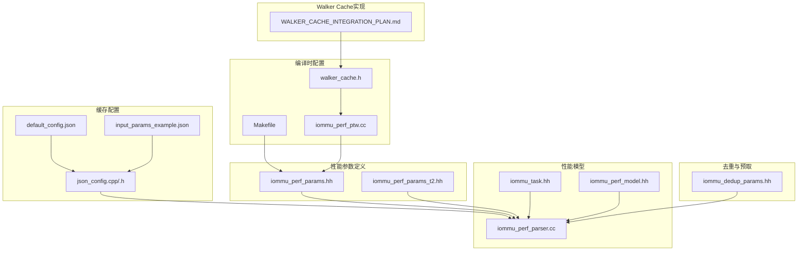
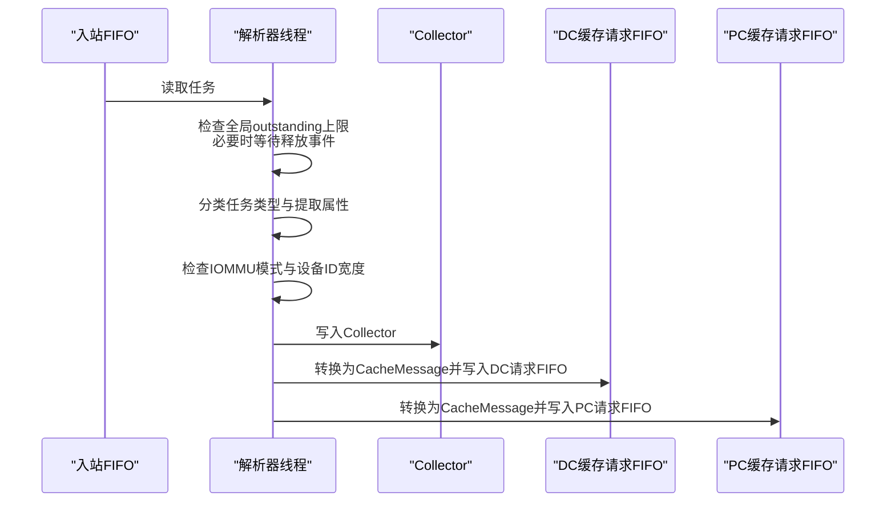
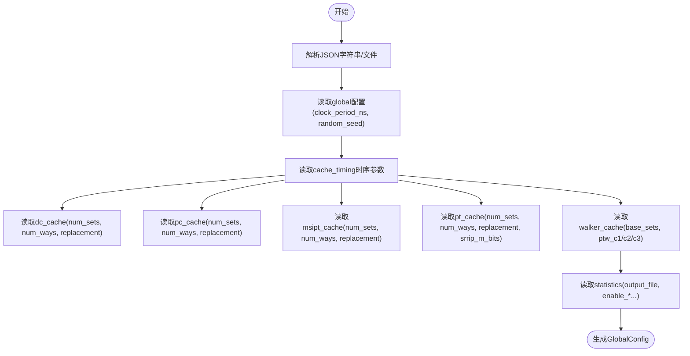
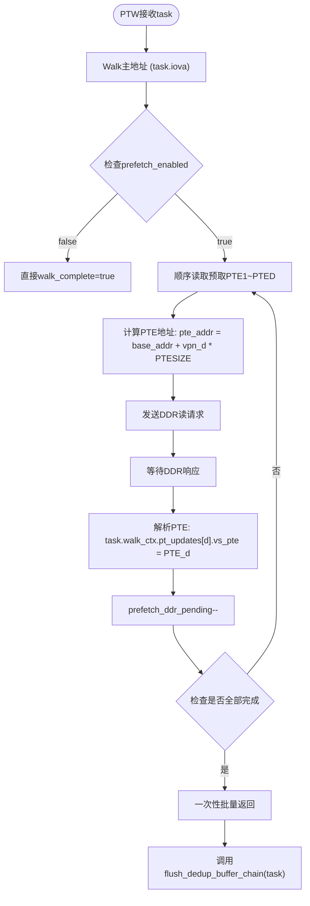
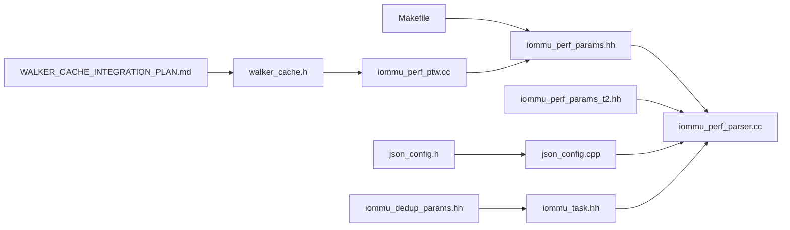

# 性能参数配置

<cite>
**本文引用的文件**
- [iommu_perf_params.hh](file://iommu/iommu_perf_model/iommu_perf_params.hh)
- [iommu_perf_params_t2.hh](file://iommu/iommu_perf_model/iommu_perf_params_t2.hh)
- [default_config.json](file://iommu/cache_config/default_config.json)
- [input_params_example.json](file://iommu/cache_config/input_params_example.json)
- [json_config.cpp](file://iommu/cache_src/common/json_config.cpp)
- [json_config.h](file://iommu/cache_src/common/json_config.h)
- [iommu_perf_parser.cc](file://iommu/iommu_perf_model/iommu_perf_parser.cc)
- [iommu_task.hh](file://iommu/include/iommu_task.hh)
- [iommu_perf_model.hh](file://iommu/include/iommu_perf_model.hh)
- [iommu_dedup_params.hh](file://iommu/include/iommu_dedup_params.hh)
- [Makefile](file://Makefile)
- [walker_cache.h](file://iommu/cache_src/cache/walker_cache.h)
- [iommu_perf_ptw.cc](file://iommu/iommu_perf_model/iommu_perf_ptw.cc)
- [test_dedup_prefetch_unit.cpp](file://test_dedup_prefetch_unit.cpp)
- [test_integration_dedup_prefetch.sh](file://test_integration_dedup_prefetch.sh)
- [WALKER_CACHE_INTEGRATION_PLAN.md](file://WALKER_CACHE_INTEGRATION_PLAN.md)
</cite>

## 更新摘要
**变更内容**
- 新增编译时参数配置功能，支持通过Makefile标志动态控制预取和Walker缓存功能
- 添加TEST_CFG_PT_DEDUP_PREFETCH_DEPTH和TEST_CFG_PTW_WALKER_CACHE_ENABLED等编译时可配置参数
- 更新Makefile以支持TEST_FLAGS传递编译时参数
- 增强性能参数配置的灵活性和可调性
- 新增Walker Cache功能的详细实现和配置说明

## 目录
1. [简介](#简介)
2. [项目结构](#项目结构)
3. [核心组件](#核心组件)
4. [架构总览](#架构总览)
5. [详细组件分析](#详细组件分析)
6. [编译时参数配置](#编译时参数配置)
7. [依赖关系分析](#依赖关系分析)
8. [性能考量](#性能考量)
9. [故障排查指南](#故障排查指南)
10. [结论](#结论)
11. [附录](#附录)

## 简介
本技术文档面向IOMMU性能参数配置系统，系统性阐述性能参数的分类、作用机制与配置方式，覆盖缓存参数、流水线参数、系统参数、DDR与端口带宽参数、以及去重与预取相关参数。文档同时给出参数配置文件的格式与语法、参数调优指南与最佳实践、不同工作负载下的优化策略、参数变更对系统性能的影响评估方法，以及参数配置的自动化工具与验证方法。

**更新** 新增编译时参数配置功能，支持通过Makefile标志动态控制预取和Walker缓存功能，提供更灵活的参数调优能力。新增Walker Cache功能的详细实现和配置说明，包括三级子表结构和预取优化机制。

## 项目结构
围绕性能参数配置的关键目录与文件如下：
- 性能参数定义：iommu/iommu_perf_model/iommu_perf_params.hh、iommu/iommu_perf_model/iommu_perf_params_t2.hh
- 缓存配置文件：iommu/cache_config/default_config.json、iommu/cache_config/input_params_example.json
- 缓存配置解析：iommu/cache_src/common/json_config.cpp、iommu/cache_src/common/json_config.h
- 性能模型与任务数据结构：iommu/iommu_perf_model/iommu_perf_parser.cc、iommu/include/iommu_task.hh、iommu/include/iommu_perf_model.hh
- 去重与预取参数：iommu/include/iommu_dedup_params.hh
- **编译时参数配置**：Makefile、iommu/cache_src/cache/walker_cache.h、iommu/iommu_perf_model/iommu_perf_ptw.cc
- **Walker Cache实现**：WALKER_CACHE_INTEGRATION_PLAN.md、walker_cache.h



**图表来源**
- [iommu_perf_params.hh:1-183](file://iommu/iommu_perf_model/iommu_perf_params.hh#L1-L183)
- [iommu_perf_params_t2.hh:1-154](file://iommu/iommu_perf_model/iommu_perf_params_t2.hh#L1-L154)
- [default_config.json:1-69](file://iommu/cache_config/default_config.json#L1-L69)
- [input_params_example.json:1-69](file://iommu/cache_config/input_params_example.json#L1-L69)
- [json_config.cpp:1-144](file://iommu/cache_src/common/json_config.cpp#L1-L144)
- [json_config.h:1-18](file://iommu/cache_src/common/json_config.h#L1-L18)
- [iommu_perf_parser.cc:1-123](file://iommu/iommu_perf_model/iommu_perf_parser.cc#L1-L123)
- [iommu_task.hh:1-378](file://iommu/include/iommu_task.hh#L1-L378)
- [iommu_perf_model.hh:1-197](file://iommu/include/iommu_perf_model.hh#L1-L197)
- [iommu_dedup_params.hh:1-92](file://iommu/include/iommu_dedup_params.hh#L1-L92)
- [Makefile:1-170](file://Makefile#L1-L170)
- [walker_cache.h:1-141](file://iommu/cache_src/cache/walker_cache.h#L1-L141)
- [iommu_perf_ptw.cc:1-200](file://iommu/iommu_perf_model/iommu_perf_ptw.cc#L1-L200)
- [WALKER_CACHE_INTEGRATION_PLAN.md:1-773](file://WALKER_CACHE_INTEGRATION_PLAN.md#L1-L773)

## 核心组件
- 性能参数头文件：集中定义FIFO深度、缓存参数、AXI/DDR参数、并发限制、处理延迟、系统参数等，是性能建模与仿真控制的核心依据。
- 缓存配置文件：以JSON描述全局时钟周期、随机种子、各缓存子系统的集合数、路数、替换策略及统计输出选项；支持从文件或字符串解析。
- 解析器线程：负责入站任务的接收、全局outstanding反压、任务分类与属性提取、模式检查、分发至Collector与缓存查询队列。
- 任务与上下文：统一的任务结构体承载设备/进程上下文、翻译结果、流水线状态、去重与预取相关字段，支撑性能统计与流水线控制。
- 去重与预取参数：定义去重Buffer容量、反压策略、PT Cache占位位、默认预取深度、Burst读取限制等。
- **编译时参数配置**：通过Makefile的TEST_FLAGS支持动态配置预取深度和Walker缓存开关，提供灵活的参数调优能力。
- **Walker Cache实现**：三级子表结构（PTWc_1、PTWc_2、PTWc_3），支持页表遍历中间结果缓存，提供查找和更新接口。

**章节来源**
- [iommu_perf_params.hh:6-183](file://iommu/iommu_perf_model/iommu_perf_params.hh#L6-L183)
- [default_config.json:1-69](file://iommu/cache_config/default_config.json#L1-L69)
- [input_params_example.json:1-69](file://iommu/cache_config/input_params_example.json#L1-L69)
- [json_config.cpp:33-131](file://iommu/cache_src/common/json_config.cpp#L33-L131)
- [iommu_perf_parser.cc:9-123](file://iommu/iommu_perf_model/iommu_perf_parser.cc#L9-L123)
- [iommu_task.hh:185-280](file://iommu/include/iommu_task.hh#L185-L280)
- [iommu_dedup_params.hh:10-92](file://iommu/include/iommu_dedup_params.hh#L10-L92)
- [Makefile:40-55](file://Makefile#L40-L55)
- [walker_cache.h:1-141](file://iommu/cache_src/cache/walker_cache.h#L1-L141)
- [WALKER_CACHE_INTEGRATION_PLAN.md:14-773](file://WALKER_CACHE_INTEGRATION_PLAN.md#L14-L773)

## 架构总览
IOMMU性能参数配置系统通过"参数定义文件 + 缓存配置文件 + 解析器线程 + 任务上下文 + 编译时参数配置 + Walker Cache"的组合实现：
- 参数定义文件提供静态参数，驱动FIFO深度、缓存规模、并发上限、处理延迟等。
- 缓存配置文件提供运行期可调整的缓存结构参数与统计选项，经解析器加载后参与仿真。
- 解析器线程根据全局outstanding上限进行反压，完成任务分类与分发，连接Collector与缓存查询。
- 任务上下文贯穿整个流水线，记录状态、统计DDR访问、维护去重与预取组信息。
- **编译时参数配置**通过Makefile的TEST_FLAGS支持动态控制预取深度和Walker缓存功能，提供灵活的参数调优能力。
- **Walker Cache**提供三级页表缓存，支持中间结果查找和更新，优化页表遍历性能。



**图表来源**
- [iommu_perf_parser.cc:9-123](file://iommu/iommu_perf_model/iommu_perf_parser.cc#L9-L123)
- [iommu_perf_params.hh:12-142](file://iommu/iommu_perf_model/iommu_perf_params.hh#L12-L142)

**章节来源**
- [iommu_perf_parser.cc:9-123](file://iommu/iommu_perf_model/iommu_perf_parser.cc#L9-L123)
- [iommu_perf_params.hh:12-142](file://iommu/iommu_perf_model/iommu_perf_params.hh#L12-L142)

## 详细组件分析

### 性能参数分类与作用机制
- FIFO深度参数：覆盖Parser到Collector、Collector到Cache、Cache到Walker、Walker返回、最终输出路径、DDR交互等全链路FIFO深度，直接影响背压与吞吐。
- 缓存参数：DC/PC/PT/MSIPT缓存的Size、Assoc、Line Size，决定命中率与访问延迟。
- AXI/DDR参数：AXI频率、位宽、带宽、最大未完成请求数、读写延迟、SLINK NoC延迟等，决定端口带宽与延迟预算。
- 并发限制：XDTW/PTW/MSIPTW outstanding上限、Collector outstanding上限、全局outstanding上限，保障系统稳定性。
- 处理延迟：Parser/Collector/各Cache命中延迟、Walker每次访问延迟、Forwarder延迟等，影响端到端时延。
- 系统参数：最大并发任务数、设备数、进程数、设备ID位宽等，约束系统规模。

**章节来源**
- [iommu_perf_params.hh:6-183](file://iommu/iommu_perf_model/iommu_perf_params.hh#L6-L183)

### 缓存配置文件格式与语法
- 全局配置：clock_period_ns、random_seed。
- 缓存时序参数：仲裁、哈希、读集、比较、更新way选择、填充索引计算、写way、失效比较等延迟周期。
- 各缓存子系统：dc_cache、pc_cache、msipt_cache、pt_cache、walker_cache（含ptw_c1/c2/c3）。
- 统计配置：输出文件、延迟直方图、任务跟踪级别、直方图bin宽度。



**图表来源**
- [json_config.cpp:33-131](file://iommu/cache_src/common/json_config.cpp#L33-L131)
- [default_config.json:1-69](file://iommu/cache_config/default_config.json#L1-L69)
- [input_params_example.json:1-69](file://iommu/cache_config/input_params_example.json#L1-L69)

**章节来源**
- [json_config.cpp:10-31](file://iommu/cache_src/common/json_config.cpp#L10-L31)
- [json_config.cpp:23-31](file://iommu/cache_src/common/json_config.cpp#L23-L31)
- [json_config.cpp:33-131](file://iommu/cache_src/common/json_config.cpp#L33-L131)
- [default_config.json:1-69](file://iommu/cache_config/default_config.json#L1-L69)
- [input_params_example.json:1-69](file://iommu/cache_config/input_params_example.json#L1-L69)

### 去重与预取参数
- 去重Buffer容量与反压策略、Buffer链表尾标记、PT Cache占位位。
- 预设深度与默认启用、Burst读取最大PTE数、PTE有效性标记与页大小常量。
- 任务上下文中新增去重链头索引、预取组状态、批量更新字段、Burst预取专用字段等，支撑预取与合并读取。

**章节来源**
- [iommu_dedup_params.hh:10-92](file://iommu/include/iommu_dedup_params.hh#L10-L92)
- [iommu_task.hh:82-182](file://iommu/include/iommu_task.hh#L82-L182)
- [iommu_task.hh:184-280](file://iommu/include/iommu_task.hh#L184-L280)

### Walker Cache实现与配置
- **三级子表结构**：PTWc_1（直接映射，第一级）、PTWc_2（2-way组相连，第二级）、PTWc_3（4-way组相连，第三级）
- **查找接口**：lookup请求不携带目标level，内部查三级子表并按3 > 2 > 1选择结果
- **更新接口**：fill和update方法支持缓存条目的填充和更新
- **失效机制**：支持按gscid、gscid+pscid、VMA关联等多种失效方式
- **配置支持**：通过配置文件和编译时参数控制Walker Cache的启用和参数

**章节来源**
- [walker_cache.h:11-104](file://iommu/cache_src/cache/walker_cache.h#L11-L104)
- [WALKER_CACHE_INTEGRATION_PLAN.md:16-49](file://WALKER_CACHE_INTEGRATION_PLAN.md#L16-L49)

### 参数配置文件示例与解析流程
- 示例文件：default_config.json与input_params_example.json展示了完整字段结构。
- 解析流程：先解析global与cache_timing，再按缓存类型应用默认值与用户覆盖，最后解析statistics。

**章节来源**
- [default_config.json:1-69](file://iommu/cache_config/default_config.json#L1-L69)
- [input_params_example.json:1-69](file://iommu/cache_config/input_params_example.json#L1-L69)
- [json_config.cpp:33-131](file://iommu/cache_src/common/json_config.cpp#L33-L131)

## 编译时参数配置

### 编译时参数概述
IOMMU性能参数配置系统新增了编译时参数配置功能，允许通过Makefile的TEST_FLAGS标志动态控制预取和Walker缓存功能。这一功能提供了更灵活的参数调优能力，无需修改源代码即可调整关键性能参数。

### 支持的编译时参数
- **TEST_CFG_PT_DEDUP_PREFETCH_DEPTH**：控制PT Cache去重+预取模块的预取深度
  - 默认值：3
  - 可选值：0（关闭预取）、1、2、3、4、8、16等
  - 影响：决定预取的PTE数量，影响缓存命中率和DDR带宽使用

- **TEST_CFG_PTW_WALKER_CACHE_ENABLED**：控制PTW Walker缓存功能的启用状态
  - 默认值：true（启用）
  - 可选值：0（禁用）、1（启用）
  - 影响：控制Walker Cache的使用，影响页表遍历性能

### Makefile配置机制
编译时参数通过Makefile的TEST_FLAGS变量传递给编译器，支持以下配置场景：

```makefile
# 在seq128k_two_stage测试场景中禁用预取和Walker缓存
TEST_FLAGS = -DTEST_SEQ_128K -DTEST_TWO_STAGE \
             -DTEST_CFG_PT_DEDUP_PREFETCH_DEPTH=0 \
             -DTEST_CFG_PTW_WALKER_CACHE_ENABLED=1
```

### 参数在代码中的使用
编译时参数通过条件编译指令在源代码中生效：

```cpp
// Walker Cache开关（true=启用，false=禁用）
// 允许通过Makefile TEST_FLAGS传入 -DTEST_CFG_PTW_WALKER_CACHE_ENABLED=0 覆盖
#ifndef TEST_CFG_PTW_WALKER_CACHE_ENABLED
static const bool PTW_WALKER_CACHE_ENABLED = true;
#else
static const bool PTW_WALKER_CACHE_ENABLED = TEST_CFG_PTW_WALKER_CACHE_ENABLED;
#endif

// 预取深度（页数量，D=0表示关闭预取）
// 允许通过Makefile TEST_FLAGS传入 -DTEST_CFG_PT_DEDUP_PREFETCH_DEPTH=0 覆盖
#ifndef TEST_CFG_PT_DEDUP_PREFETCH_DEPTH
static const uint32_t PT_DEDUP_PREFETCH_DEPTH = 3;
#else
static const uint32_t PT_DEDUP_PREFETCH_DEPTH = TEST_CFG_PT_DEDUP_PREFETCH_DEPTH;
#endif
```

### Walker Cache数据结构
Walker Cache采用三级子表结构，支持不同级别的页表缓存：

```cpp
class WalkerCache : public sc_module {
    // 3个子表：PTWc_1（直接映射，第一级）、PTWc_2（2-way组相连，第二级）、PTWc_3（4-way组相连，第三级）
    std::unique_ptr<WalkerSubCache> ptw_c1_;
    std::unique_ptr<WalkerSubCache> ptw_c2_;
    std::unique_ptr<WalkerSubCache> ptw_c3_;
};
```

### 预取执行流程
编译时参数影响预取执行流程，支持一次性批量返回多个PTE：



**图表来源**
- [PT_DEDUP_PREFETCH_FINAL_SCHEME.md:329-813](file://PT_DEDUP_PREFETCH_FINAL_SCHEME.md#L329-L813)

**章节来源**
- [iommu_perf_params.hh:110-142](file://iommu/iommu_perf_model/iommu_perf_params.hh#L110-L142)
- [Makefile:40-55](file://Makefile#L40-L55)
- [walker_cache.h:15-104](file://iommu/cache_src/cache/walker_cache.h#L15-L104)
- [iommu_perf_ptw.cc:154-183](file://iommu/iommu_perf_model/iommu_perf_ptw.cc#L154-L183)

## 依赖关系分析
- 参数定义文件被解析器线程与任务上下文引用，作为仿真控制与统计的基础。
- 缓存配置解析模块依赖mini_json解析器，生成GlobalConfig供上层使用。
- 任务上下文包含去重与预取相关字段，与性能参数协同影响吞吐与延迟。
- **编译时参数配置**通过Makefile的TEST_FLAGS传递，影响参数定义文件中的条件编译逻辑。
- **Walker Cache实现**通过CacheSubsystem暴露FIFO接口，与PTW模块协同工作。



**图表来源**
- [iommu_perf_params.hh:1-183](file://iommu/iommu_perf_model/iommu_perf_params.hh#L1-L183)
- [iommu_perf_params_t2.hh:1-154](file://iommu/iommu_perf_model/iommu_perf_params_t2.hh#L1-L154)
- [json_config.cpp:1-144](file://iommu/cache_src/common/json_config.cpp#L1-L144)
- [json_config.h:1-18](file://iommu/cache_src/common/json_config.h#L1-L18)
- [iommu_perf_parser.cc:1-123](file://iommu/iommu_perf_model/iommu_perf_parser.cc#L1-L123)
- [iommu_task.hh:1-378](file://iommu/include/iommu_task.hh#L1-L378)
- [iommu_dedup_params.hh:1-92](file://iommu/include/iommu_dedup_params.hh#L1-L92)
- [Makefile:24](file://Makefile#L24)
- [walker_cache.h:1-141](file://iommu/cache_src/cache/walker_cache.h#L1-L141)
- [iommu_perf_ptw.cc:1-200](file://iommu/iommu_perf_model/iommu_perf_ptw.cc#L1-L200)
- [WALKER_CACHE_INTEGRATION_PLAN.md:77-118](file://WALKER_CACHE_INTEGRATION_PLAN.md#L77-L118)

**章节来源**
- [iommu_perf_params.hh:1-183](file://iommu/iommu_perf_model/iommu_perf_params.hh#L1-L183)
- [json_config.cpp:1-144](file://iommu/cache_src/common/json_config.cpp#L1-L144)
- [iommu_perf_parser.cc:1-123](file://iommu/iommu_perf_model/iommu_perf_parser.cc#L1-L123)
- [iommu_task.hh:1-378](file://iommu/include/iommu_task.hh#L1-L378)
- [iommu_dedup_params.hh:1-92](file://iommu/include/iommu_dedup_params.hh#L1-L92)
- [Makefile:24](file://Makefile#L24)
- [walker_cache.h:1-141](file://iommu/cache_src/cache/walker_cache.h#L1-L141)
- [iommu_perf_ptw.cc:1-200](file://iommu/iommu_perf_model/iommu_perf_ptw.cc#L1-L200)
- [WALKER_CACHE_INTEGRATION_PLAN.md:77-118](file://WALKER_CACHE_INTEGRATION_PLAN.md#L77-L118)

## 性能考量
- FIFO深度与并发限制：FIFO过小导致阻塞，过大增加存储与延迟；outstanding上限需平衡吞吐与内存占用。
- 缓存规模与替换策略：增大Size/Assoc提升命中率，但增加访问延迟；替换策略影响抖动与命中率。
- AXI带宽与DDR延迟：带宽不足导致端口饱和，延迟过高放大尾延迟；需结合任务特征与NoC拓扑设定。
- 处理延迟：各模块延迟叠加决定端到端时延，应优先优化瓶颈模块。
- 去重与预取：合理设置去重Buffer与预取深度，可显著降低重复访问与DDR压力，但需避免过度预取造成带宽浪费。
- **编译时参数配置**：通过编译时参数可以快速切换不同的性能配置，无需重新编译整个系统，提高调试效率。
- **Walker Cache性能**：三级缓存结构可显著减少页表遍历的DDR访问次数，在重复访问场景下可获得40x加速效果。

[本节为通用指导，不直接分析具体文件]

## 故障排查指南
- 入站阻塞：若解析器持续等待outstanding释放事件，检查全局outstanding上限与重排序输出速率。
- 缓存抖动：命中率不稳定可能源于替换策略或并发冲突，可通过增大Assoc或调整替换策略缓解。
- DDR拥塞：观察DDR请求/响应FIFO深度与outstanding，适当提高AXI master并发上限或优化预取策略。
- 预取异常：确认预取深度与Burst限制，避免跨页表边界与过多未完成请求。
- **编译时参数问题**：若编译时参数未生效，检查Makefile中的TEST_FLAGS配置，确认编译器正确接收了-D参数。
- **Walker Cache问题**：检查配置文件中的walker_cache.enabled设置，验证三级子表的配置参数，确认PTW模块的查找和更新接口正常工作。

**章节来源**
- [iommu_perf_params.hh:12-142](file://iommu/iommu_perf_model/iommu_perf_params.hh#L12-L142)
- [iommu_task.hh:82-182](file://iommu/include/iommu_task.hh#L82-L182)
- [Makefile:40-55](file://Makefile#L40-L55)
- [WALKER_CACHE_INTEGRATION_PLAN.md:642-660](file://WALKER_CACHE_INTEGRATION_PLAN.md#L642-L660)

## 结论
IOMMU性能参数配置系统通过参数定义文件与缓存配置文件实现对仿真行为的精细控制。结合解析器线程与任务上下文，系统能够在不同工作负载下实现高并发、低延迟与大容量的平衡。**新增的编译时参数配置功能进一步增强了系统的灵活性，通过Makefile的TEST_FLAGS支持动态控制预取深度和Walker缓存功能，无需修改源代码即可调整关键性能参数。** 新增的Walker Cache功能提供了三级页表缓存，可在重复访问场景下显著提升性能。建议以实际测试数据为依据，逐步调优FIFO深度、缓存规模、并发限制与去重/预取策略，并建立稳定的评估方法与自动化验证流程。

[本节为总结性内容，不直接分析具体文件]

## 附录

### 参数调优指南与最佳实践
- 高并发场景：适度提高outstanding上限与FIFO深度，增大缓存Assoc与Size，启用合理的去重与预取策略。
- 低延迟场景：减小FIFO深度与处理延迟，优化缓存替换策略，减少不必要的预取，确保端口带宽充足。
- 大容量场景：扩大缓存容量与Buffer容量，启用去重与预取，合理设置Burst读取限制，避免跨页表边界带来的额外开销。
- **编译时参数调优**：利用编译时参数快速测试不同的预取深度（0、3、8、16等）和Walker缓存配置，通过对比测试结果选择最优参数组合。
- **Walker Cache调优**：根据工作负载特征调整三级缓存的大小和相联度，重复访问场景下建议启用Walker Cache以获得最佳性能。

[本节为通用指导，不直接分析具体文件]

### 不同工作负载下的优化策略
- 高并发：提升PTW/MSIPTW outstanding上限，增大PT Cache Assoc与Size，启用去重与预取，优化DDR带宽与延迟。
- 低延迟：降低Parser/Collector/Cache命中延迟，缩短FIFO深度，减少重排序输出延迟，优化NoC路径。
- 大容量：增大全局outstanding上限，扩展缓存容量，启用去重与预取，合理设置Burst读取与预取深度。
- **编译时参数优化**：针对不同工作负载场景，通过编译时参数快速切换预取深度（0、3、8、16等）和Walker缓存启用状态，评估不同配置对性能的影响。
- **Walker Cache优化**：重复访问场景下启用Walker Cache，顺序扫描场景下可考虑降低预取深度，随机访问场景下谨慎启用以避免缓存污染。

[本节为通用指导，不直接分析具体文件]

### 参数变更对系统性能的影响评估方法
- 建立稳态IOPS采样窗口（跳过首尾10%），统计中间80%稳定段的指标。
- 对比关键指标：吞吐、尾延迟、缓存命中率、DDR利用率、outstanding分布。
- 使用统计输出文件与直方图分析延迟分布，定位瓶颈模块。
- **编译时参数评估**：通过对比不同编译时参数配置下的测试结果，量化参数变更对性能的影响。
- **Walker Cache评估**：通过对比启用/禁用Walker Cache的测试结果，评估缓存对重复访问场景的加速效果。

**章节来源**
- [iommu_perf_params.hh:149-153](file://iommu/iommu_perf_model/iommu_perf_params.hh#L149-L153)
- [default_config.json:61-67](file://iommu/cache_config/default_config.json#L61-L67)
- [WALKER_CACHE_INTEGRATION_PLAN.md:663-689](file://WALKER_CACHE_INTEGRATION_PLAN.md#L663-L689)

### 参数配置的自动化工具与验证方法
- 自动化工具：通过JSON配置文件与解析器接口，实现参数批量导入与一致性校验。
- 验证方法：基于稳态采样窗口与统计输出，对比不同配置下的关键指标变化，形成回归报告。
- **编译时参数自动化**：通过Makefile的TEST_FLAGS支持参数组合的自动化测试，结合测试脚本自动评估不同参数配置的性能表现。
- **Walker Cache自动化测试**：通过集成测试脚本验证Walker Cache的查找、更新、失效等功能，确保缓存的一致性和正确性。

**章节来源**
- [json_config.cpp:133-141](file://iommu/cache_src/common/json_config.cpp#L133-L141)
- [default_config.json:61-67](file://iommu/cache_config/default_config.json#L61-L67)
- [Makefile:40-55](file://Makefile#L40-L55)
- [test_integration_dedup_prefetch.sh:1-157](file://test_integration_dedup_prefetch.sh#L1-L157)
- [test_dedup_prefetch_unit.cpp:1-412](file://test_dedup_prefetch_unit.cpp#L1-L412)