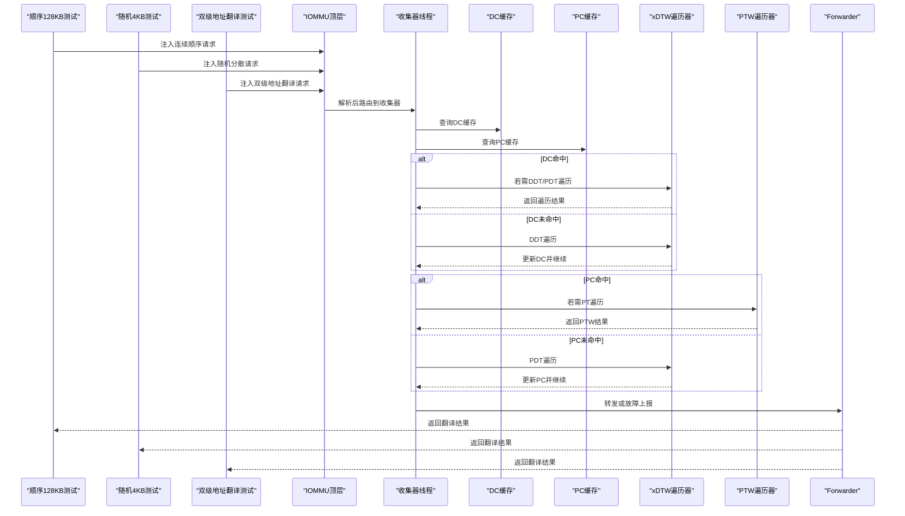
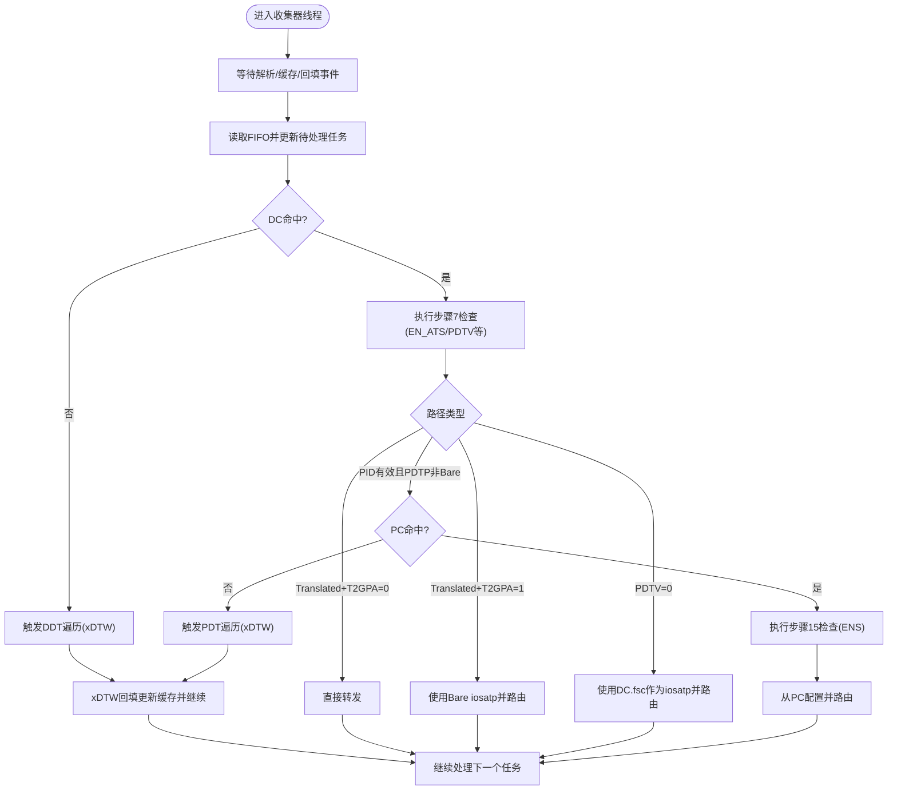
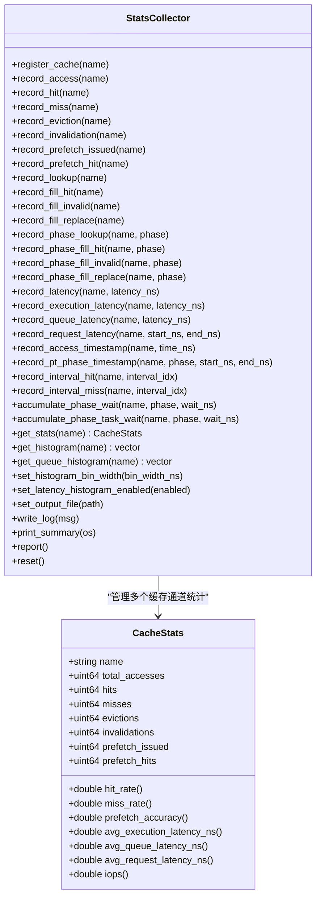
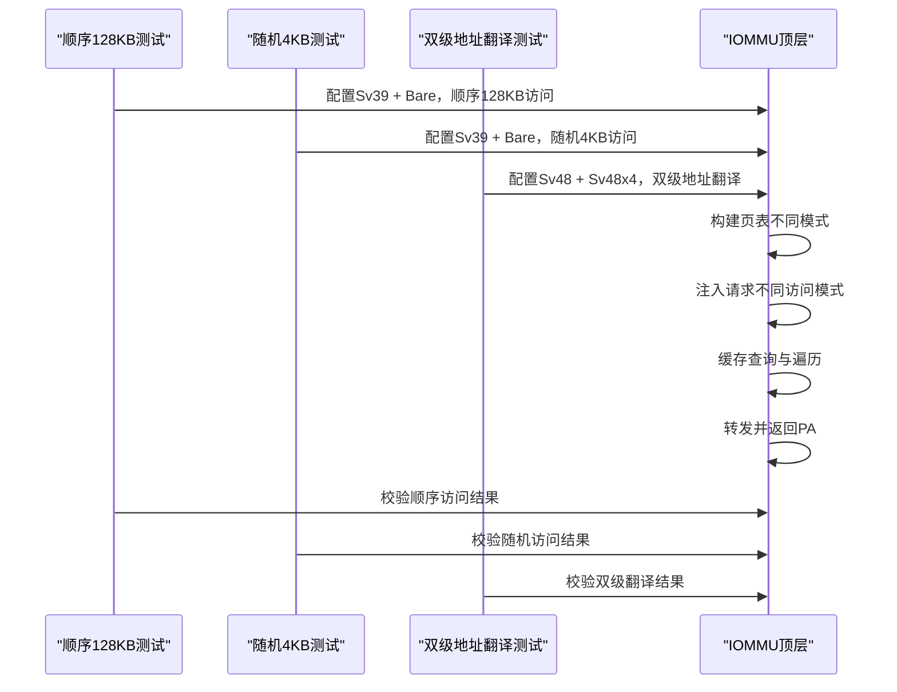
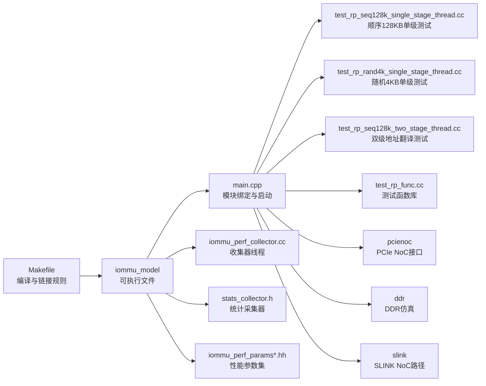

# 性能基准测试

<cite>
**本文引用的文件**   
- [README.md](file://README.md)
- [main.cpp](file://main.cpp)
- [Makefile](file://Makefile)
- [iommu_perf_collector.cc](file://iommu/iommu_perf_model/iommu_perf_collector.cc)
- [stats_collector.h](file://iommu/cache_src/common/stats_collector.h)
- [test_rp_seq128k_single_stage_thread.cc](file://rp/test_rp_seq128k_single_stage_thread.cc)
- [test_rp_rand4k_single_stage_thread.cc](file://rp/test_rp_rand4k_single_stage_thread.cc)
- [test_rp_seq128k_two_stage_thread.cc](file://rp/test_rp_seq128k_two_stage_thread.cc)
- [test_rp_func.cc](file://rp/test_rp_func.cc)
- [test_1000req.sh](file://test_1000req.sh)
- [test_dedup_prefetch.sh](file://test_dedup_prefetch.sh)
- [test_integration_dedup_prefetch.sh](file://test_integration_dedup_prefetch.sh)
- [iommu_perf_params.hh](file://iommu/iommu_perf_model/iommu_perf_params.hh)
- [iommu_perf_params_t2.hh](file://iommu/iommu_perf_model/iommu_perf_params_t2.hh)
</cite>

## 目录
1. [简介](#简介)
2. [项目结构](#项目结构)
3. [核心组件](#核心组件)
4. [架构总览](#架构总览)
5. [详细组件分析](#详细组件分析)
6. [依赖关系分析](#依赖关系分析)
7. [性能考量](#性能考量)
8. [故障排查指南](#故障排查指南)
9. [结论](#结论)
10. [附录](#附录)

## 简介
本文件面向IOMMU性能基准测试体系，系统化阐述测试设计原理、实施方法与流程规范，覆盖测试场景设计、测试用例选择、测试环境搭建、工具使用、结果标准化报告模板、性能回归与对比实验设计、统计分析与结果验证技术，并结合仓库现有脚本与代码给出可落地的实操步骤与案例。

**更新** 本次更新反映了测试场景的重大重构：原有的统一测试文件已被拆分为三个专门的测试场景，提供了更精细的测试覆盖和更好的可维护性。

## 项目结构
该项目基于SystemC构建RISC-V IOMMU仿真模型，包含顶层模块、地址转换引擎、命令队列、ATC/ATS、故障与中断、性能采集与缓存子系统等模块；同时提供多种专门的测试场景文件，用于不同访问模式和地址翻译场景的性能与功能验证。

```mermaid
graph TB
subgraph "顶层与接口"
MAIN["main.cpp<br/>创建模块实例并绑定Socket"]
TOP["iommu_top<br/>顶层控制与调度"]
END
subgraph "IOMMU核心模块"
TRANS["translate<br/>地址转换引擎"]
CMDQ["command_queue<br/>命令队列"]
ATC["atc<br/>地址转换缓存"]
ATS["ats<br/>ATS支持"]
FAULT["faults<br/>故障处理"]
INT["interrupt<br/>中断"]
HPM["hpm<br/>硬件性能监控"]
END
subgraph "性能与缓存"
COL["perf_collector<br/>收集器线程"]
STATS["stats_collector<br/>统计采集器"]
PARAMS["perf_params<br/>性能参数集"]
END
subgraph "专门测试场景"
SCENE1["单级地址翻译测试<br/>test_rp_seq128k_single_stage_thread.cc<br/>128KB顺序读 + 单级翻译"]
SCENE2["单级地址翻译测试<br/>test_rp_rand4k_single_stage_thread.cc<br/>4KB随机读 + 单级翻译"]
SCENE3["双级地址翻译测试<br/>test_rp_seq128k_two_stage_thread.cc<br/>128KB顺序读 + 双级翻译"]
END
subgraph "外部接口"
RP["rp/test_rp_func.cc<br/>测试函数库"]
PCIE["pcienoc<br/>PCIe NoC接口"]
DDR["ddr<br/>DDR仿真"]
SLINK["slink<br/>SLINK NoC路径"]
END
MAIN --> TOP
TOP --> TRANS
TOP --> CMDQ
TOP --> ATC
TOP --> ATS
TOP --> FAULT
TOP --> INT
TOP --> HPM
TOP --> COL
TOP --> STATS
TOP --> PARAMS
MAIN --> SCENE1
MAIN --> SCENE2
MAIN --> SCENE3
MAIN --> RP
MAIN --> PCIE
MAIN --> DDR
MAIN --> SLINK
TRANS --> COL
COL --> TRANS
STATS --> COL
PARAMS --> TOP
```

**图表来源**
- [main.cpp:39-94](file://main.cpp#L39-L94)
- [iommu_perf_collector.cc:14-457](file://iommu/iommu_perf_model/iommu_perf_collector.cc#L14-L457)
- [stats_collector.h:107-196](file://iommu/cache_src/common/stats_collector.h#L107-L196)
- [test_rp_seq128k_single_stage_thread.cc:14-369](file://rp/test_rp_seq128k_single_stage_thread.cc#L14-L369)
- [test_rp_rand4k_single_stage_thread.cc:14-403](file://rp/test_rp_rand4k_single_stage_thread.cc#L14-L403)
- [test_rp_seq128k_two_stage_thread.cc:10-397](file://rp/test_rp_seq128k_two_stage_thread.cc#L10-L397)

**章节来源**
- [README.md:63-92](file://README.md#L63-L92)
- [main.cpp:39-94](file://main.cpp#L39-L94)
- [Makefile:51-104](file://Makefile#L51-L104)

## 核心组件
- 顶层与绑定：main.cpp负责创建IOMMU、RP、PCIENOC、DDR、SLINK模块实例，并通过TLM Socket将各模块互联，启动仿真。
- 性能收集器：iommu_perf_collector.cc实现两条收集器线程，分别处理缓存查询结果与xDTW回填结果，驱动状态机推进与故障处理。
- 统计采集器：stats_collector.h定义CacheStats结构与StatsCollector类，提供命中/缺失/替换/失效/预取命中等统计接口与报告输出。
- **专门测试场景**：三个独立的测试场景文件分别专注于不同的访问模式和地址翻译场景，支持顺序与随机访问、单级与双级地址翻译、不同页表规模与请求量，具备稳态IOPS采样窗口与结果校验。
- 性能参数：iommu_perf_params.hh与iommu_perf_params_t2.hh定义FIFO深度、缓存容量、并发限制、处理延迟、带宽与NoC延迟等关键参数，支撑性能建模与回归对比。

**更新** 核心组件现在包含三个专门的测试场景文件，每个都针对特定的测试需求进行了优化。

**章节来源**
- [main.cpp:49-94](file://main.cpp#L49-L94)
- [iommu_perf_collector.cc:14-457](file://iommu/iommu_perf_model/iommu_perf_collector.cc#L14-L457)
- [stats_collector.h:13-196](file://iommu/cache_src/common/stats_collector.h#L13-L196)
- [test_rp_seq128k_single_stage_thread.cc:14-369](file://rp/test_rp_seq128k_single_stage_thread.cc#L14-L369)
- [test_rp_rand4k_single_stage_thread.cc:14-403](file://rp/test_rp_rand4k_single_stage_thread.cc#L14-L403)
- [test_rp_seq128k_two_stage_thread.cc:10-397](file://rp/test_rp_seq128k_two_stage_thread.cc#L10-L397)
- [iommu_perf_params.hh:6-161](file://iommu/iommu_perf_model/iommu_perf_params.hh#L6-L161)
- [iommu_perf_params_t2.hh:6-154](file://iommu/iommu_perf_model/iommu_perf_params_t2.hh#L6-L154)

## 架构总览
IOMMU性能基准测试围绕"请求注入—解析—缓存查询—页表遍历—转发/故障"闭环展开，性能收集器在关键节点记录事件与延迟，统计采集器汇总形成统一报告；三个专门的测试场景通过不同访问模式与地址翻译配置构造多样化场景。



**图表来源**
- [iommu_perf_collector.cc:14-457](file://iommu/iommu_perf_model/iommu_perf_collector.cc#L14-L457)
- [test_rp_seq128k_single_stage_thread.cc:137-257](file://rp/test_rp_seq128k_single_stage_thread.cc#L137-L257)
- [test_rp_rand4k_single_stage_thread.cc:166-291](file://rp/test_rp_rand4k_single_stage_thread.cc#L166-L291)
- [test_rp_seq128k_two_stage_thread.cc:260-377](file://rp/test_rp_seq128k_two_stage_thread.cc#L260-L377)

## 详细组件分析

### 组件A：性能收集器（收集器线程）
- 职责：汇聚解析、DC/PC缓存查询结果，判定DC/PC命中/未命中路径，必要时触发xDTW遍历，最终配置并路由到PTW或直接转发。
- 关键逻辑：
  - 收集器线程1：处理解析与缓存查询结果，推进状态机，决定走DDT/PDT遍历或直接转发。
  - 收集器线程2：处理xDTW回填，更新DC/PC缓存，重复执行相应检查与配置。
- 并发与背压：维护DC/PC遍历的outstanding上限，避免拥塞；通过事件通知协调背压。
- 故障处理：遇到非法配置或越界等情况，直接转入故障状态并上报。



**图表来源**
- [iommu_perf_collector.cc:14-457](file://iommu/iommu_perf_model/iommu_perf_collector.cc#L14-L457)

**章节来源**
- [iommu_perf_collector.cc:14-457](file://iommu/iommu_perf_model/iommu_perf_collector.cc#L14-L457)

### 组件B：统计采集器（StatsCollector）
- 结构：CacheStats聚合各类计数与延迟样本，提供命中率、缺失率、预取准确率、平均执行/排队/请求延迟、IOPS等指标。
- 能力：注册缓存通道、记录访问/命中/缺失/替换/失效、记录4种RAM访问路径、按阶段分类记录、记录延迟直方图、输出统一报告。
- 应用：在测试场景结束后打印缓存统计，辅助性能分析与回归对比。



**图表来源**
- [stats_collector.h:13-196](file://iommu/cache_src/common/stats_collector.h#L13-L196)

**章节来源**
- [stats_collector.h:107-196](file://iommu/cache_src/common/stats_collector.h#L107-L196)

### 组件C：专门测试场景（三个独立测试文件）

#### 场景1：顺序128KB单级地址翻译测试
- **文件**：test_rp_seq128k_single_stage_thread.cc
- **配置**：1MB范围（0x100000 ~ 0x200000），2000个顺序READ请求，每个512B
- **特点**：验证预取在连续访问中的有效性，Sequential access pattern，预期PT Cache高命中率
- **地址翻译**：Sv39 + Bare，PA = IOVA + 0x10000
- **预取策略**：D=3，预期非常有效（连续地址）

#### 场景2：随机4KB单级地址翻译测试  
- **文件**：test_rp_rand4k_single_stage_thread.cc
- **配置**：16MB范围（0x100000 ~ 0x1100000），4000个请求，500个唯一随机页面，每页8个请求
- **特点**：验证去重与预取在非局部访问中的效果，Random access pattern，预取D=3无效
- **地址翻译**：Sv39 + Bare，PA = IOVA + 0x10000
- **访问模式**：500个唯一随机页面，打散访问，每页8个请求（8 x 512B = 4KB）

#### 场景3：128KB顺序读双级地址翻译测试
- **文件**：test_rp_seq128k_two_stage_thread.cc
- **配置**：1MB范围（0x100000 ~ 0x1FFFFF），5000个顺序READ请求，每个512B
- **特点**：验证双级地址翻译的完整流程，包含G-stage和VS-stage映射
- **地址翻译**：Sv48 + Sv48x4，GPA = page_idx × 0x200000，SPA = GPA + 0x10000
- **特殊处理**：Walker Cache和PT prefetch禁用，包含G-stage映射修复



**图表来源**
- [test_rp_seq128k_single_stage_thread.cc:137-257](file://rp/test_rp_seq128k_single_stage_thread.cc#L137-L257)
- [test_rp_rand4k_single_stage_thread.cc:166-291](file://rp/test_rp_rand4k_single_stage_thread.cc#L166-L291)
- [test_rp_seq128k_two_stage_thread.cc:260-377](file://rp/test_rp_seq128k_two_stage_thread.cc#L260-L377)

**章节来源**
- [test_rp_seq128k_single_stage_thread.cc:14-369](file://rp/test_rp_seq128k_single_stage_thread.cc#L14-L369)
- [test_rp_rand4k_single_stage_thread.cc:14-403](file://rp/test_rp_rand4k_single_stage_thread.cc#L14-L403)
- [test_rp_seq128k_two_stage_thread.cc:10-397](file://rp/test_rp_seq128k_two_stage_thread.cc#L10-L397)

### 组件D：测试函数库（RP测试函数）
- **文件**：rp/test_rp_func.cc
- **功能**：提供通用的测试辅助函数，包括内存读写、设备上下文配置、页表映射、故障检查等
- **能力**：支持不同地址翻译模式（Sv32/Sv39/Sv48/Sv57）、G-stage和VS-stage映射、进程上下文管理、故障记录检查
- **应用**：为三个专门测试场景提供统一的基础设施支持

**章节来源**
- [test_rp_func.cc:1-1066](file://rp/test_rp_func.cc#L1-L1066)

### 组件E：基准测试脚本与工具
- **test_1000req.sh**：对1000请求场景进行功能验证与缓存命中率统计，提取PT Cache/DC Cache命中、预取组、批量更新、Buffer刷新等关键指标，并估算IOPS。
- **test_dedup_prefetch.sh**：针对P1~P8连续同页访问（D=8）验证去重+预取功能，统计PT Cache MISS、占位CL HIT、PTW执行、Buffer分配、预取占位CL、批量更新、Buffer刷新与Forwarder接收任务数。
- **test_integration_dedup_prefetch.sh**：集成测试，验证去重+预取在完整流程中的正确性与性能表现，包含任务ID生成方式、Buffer互斥锁保护等检查。

**章节来源**
- [test_1000req.sh:1-226](file://test_1000req.sh#L1-L226)
- [test_dedup_prefetch.sh:1-76](file://test_dedup_prefetch.sh#L1-L76)
- [test_integration_dedup_prefetch.sh:1-157](file://test_integration_dedup_prefetch.sh#L1-L157)

## 依赖关系分析
- **构建与运行**：Makefile定义编译选项、包含路径、源文件集合与目标可执行文件；支持DEBUG/RELEASE切换与多测试场景选择。每个测试场景都有专用的源文件和明确的命名约定。
- 顶层绑定：main.cpp将IOMMU与三个测试场景、RP/PCIENOC/DDR/SLINK通过TLM Socket互联，形成完整的数据通路。
- 性能参数：iommu_perf_params.hh与iommu_perf_params_t2.hh集中定义FIFO深度、缓存容量、并发限制、处理延迟、带宽与NoC延迟等，支撑性能建模与回归对比。



**图表来源**
- [Makefile:51-114](file://Makefile#L51-L114)
- [main.cpp:49-94](file://main.cpp#L49-L94)
- [iommu_perf_params.hh:6-161](file://iommu/iommu_perf_model/iommu_perf_params.hh#L6-L161)
- [iommu_perf_params_t2.hh:6-154](file://iommu/iommu_perf_model/iommu_perf_params_t2.hh#L6-L154)

**章节来源**
- [Makefile:23-33](file://Makefile#L23-L33)
- [Makefile:51-104](file://Makefile#L51-L104)
- [main.cpp:49-94](file://main.cpp#L49-L94)

## 性能考量
- **参数调优**：通过iommu_perf_params.hh与iommu_perf_params_t2.hh调整FIFO深度、缓存容量、并发上限、处理延迟与带宽，平衡吞吐与延迟。
- **稳态采样**：三个测试场景均设置稳态采样窗口（跳过前10%与后10%），提高IOPS估算稳定性。
- **命中率与预取**：关注PT Cache与DC/PC缓存命中率、预取命中与批量更新频率，评估去重与预取策略的有效性在不同访问模式下的表现。
- **NoC与DDR**：SLINK NoC延迟与DDR带宽/延迟影响整体性能，需结合场景参数进行权衡。
- **地址翻译复杂度**：双级地址翻译相比单级翻译具有更高的复杂度和开销，需要特别关注G-stage映射和Walker Cache的配置。

## 故障排查指南
- **功能验证**：使用test_1000req.sh检查仿真是否正常完成、请求发送/响应接收数量、错误计数与缓存命中统计。
- **去重+预取**：使用test_dedup_prefetch.sh与test_integration_dedup_prefetch.sh核对PT Cache MISS/HIT、预取组初始化、批量更新、Buffer刷新与Forwarder接收任务数。
- **日志分析**：脚本通过grep提取关键日志片段，便于快速定位问题；若出现超时或停滞，检查outstanding上限与背压事件通知。
- **测试场景特定问题**：
  - 顺序访问测试：关注预取D=3的效果，验证连续访问的缓存命中率
  - 随机访问测试：验证去重机制在分散访问中的有效性
  - 双级地址翻译测试：检查G-stage映射修复和Walker Cache配置

**章节来源**
- [test_1000req.sh:39-226](file://test_1000req.sh#L39-L226)
- [test_dedup_prefetch.sh:19-76](file://test_dedup_prefetch.sh#L19-L76)
- [test_integration_dedup_prefetch.sh:27-157](file://test_integration_dedup_prefetch.sh#L27-L157)

## 结论
本基准测试体系以SystemC仿真为核心，通过三个专门的测试场景文件实现了从请求注入、缓存查询、页表遍历到结果验证的全链路性能评估。测试场景重构提供了更精细的测试覆盖，能够分别验证顺序访问、随机访问和双级地址翻译等不同场景下的性能表现。通过统一的统计采集器与参数化配置，能够稳定地开展性能回归与对比实验，并为IOMMU在不同访问模式与硬件参数下的行为提供量化依据。

**更新** 重构后的测试体系通过三个专门的测试场景文件，提供了更精确的测试覆盖和更好的可维护性，每个场景都针对特定的性能特征和使用模式进行了优化。

## 附录

### A. 测试环境搭建与运行
- **环境要求**：WSL2、Ubuntu、SystemC库、GCC/G++、GNU Make。
- **编译**：使用编译脚本或make命令，支持DEBUG/RELEASE切换与多测试场景选择。
- **运行**：生成iommu_model后直接运行，或通过测试脚本进行自动化分析。
- **测试场景选择**：
  - `make TEST=rand4k_singlestage`：默认4KB随机读 + 单级地址翻译
  - `make TEST=seq128k_singlestage`：128KB顺序读 + 单级地址翻译
  - `make TEST=seq128k_twostage`：128KB顺序读 + 双级地址翻译
  - `make TEST=sv48_bare`：Sv48 + Bare基础测试

**章节来源**
- [README.md:7-92](file://README.md#L7-L92)
- [Makefile:17-53](file://Makefile#L17-L53)
- [Makefile:40-60](file://Makefile#L40-L60)

### B. 测试场景与用例选择
- **场景1：顺序128KB单级地址翻译测试**
  - 访问模式：顺序128KB读（1MB范围，2000请求），验证预取在连续访问中的有效性
  - 地址翻译：Sv39 + Bare，PA = IOVA + 0x10000
  - 预取策略：D=3，预期非常有效（连续地址）
  - 特点：验证缓存预取机制在理想条件下的性能表现

- **场景2：随机4KB单级地址翻译测试**
  - 访问模式：随机4KB读（16MB范围，4000请求，500个唯一页面），验证去重与预取在非局部访问中的效果
  - 地址翻译：Sv39 + Bare，PA = IOVA + 0x10000
  - 访问模式：500个唯一随机页面，打散访问，每页8个请求（8 x 512B = 4KB）
  - 特点：验证去重机制在分散访问中的有效性，预取D=3无效

- **场景3：双级地址翻译测试**
  - 访问模式：128KB顺序读（1MB范围，5000请求），验证双级地址翻译的完整流程
  - 地址翻译：Sv48 + Sv48x4，GPA = page_idx × 0x200000，SPA = GPA + 0x10000
  - 特殊处理：Walker Cache和PT prefetch禁用，包含G-stage映射修复
  - 特点：验证双级地址翻译的完整流程和复杂映射关系

**章节来源**
- [test_rp_seq128k_single_stage_thread.cc:14-369](file://rp/test_rp_seq128k_single_stage_thread.cc#L14-L369)
- [test_rp_rand4k_single_stage_thread.cc:14-403](file://rp/test_rp_rand4k_single_stage_thread.cc#L14-L403)
- [test_rp_seq128k_two_stage_thread.cc:10-397](file://rp/test_rp_seq128k_two_stage_thread.cc#L10-L397)

### C. 测试流程与工具使用
- **步骤1**：准备页表与设备上下文，注入请求。
- **步骤2**：等待响应并校验PA与状态。
- **步骤3**：打印缓存统计与性能指标。
- **工具**：test_1000req.sh、test_dedup_prefetch.sh、test_integration_dedup_prefetch.sh自动化提取关键指标并输出报告摘要。
- **测试场景特定流程**：
  - 顺序访问测试：验证预取效果，关注连续访问的缓存命中率
  - 随机访问测试：验证去重机制，关注分散访问的缓存效率
  - 双级地址翻译测试：验证映射修复，关注G-stage和VS-stage的协同工作

**章节来源**
- [test_rp_seq128k_single_stage_thread.cc:185-369](file://rp/test_rp_seq128k_single_stage_thread.cc#L185-L369)
- [test_rp_rand4k_single_stage_thread.cc:292-403](file://rp/test_rp_rand4k_single_stage_thread.cc#L292-L403)
- [test_rp_seq128k_two_stage_thread.cc:378-397](file://rp/test_rp_seq128k_two_stage_thread.cc#L378-L397)
- [test_1000req.sh:16-226](file://test_1000req.sh#L16-L226)
- [test_dedup_prefetch.sh:10-76](file://test_dedup_prefetch.sh#L10-L76)
- [test_integration_dedup_prefetch.sh:17-157](file://test_integration_dedup_prefetch.sh#L17-L157)

### D. 标准化报告模板
- **报告头**
  - 测试名称、测试日期、测试环境、版本信息
- **测试配置**
  - 访问模式、页表规模、请求总量、稳态采样窗口
- **关键指标**
  - PT Cache命中率、DC/PC缓存命中率、预取命中、批量更新次数、Buffer刷新次数、Forwarder接收任务数
  - IOPS估算（稳态80%区间）、仿真时间、DDR读请求次数
- **统计摘要**
  - PT Cache访问总计、MISS/HIT、占位CL HIT占比、PTW执行次数
  - DC Cache访问总计、MISS/HIT
- **结论**
  - 功能验证通过与否、性能指标评述、改进建议

**章节来源**
- [test_1000req.sh:166-226](file://test_1000req.sh#L166-L226)
- [test_integration_dedup_prefetch.sh:126-157](file://test_integration_dedup_prefetch.sh#L126-L157)

### E. 性能回归测试与对比实验设计
- **回归测试**：固定场景（如随机4KB读）与参数集，定期运行test_1000req.sh，比较命中率、IOPS与关键统计指标变化趋势。
- **对比实验**：切换iommu_perf_params.hh/iommu_perf_params_t2.hh中的参数（如FIFO深度、缓存容量、并发上限、NoC延迟），在同一场景下对比不同配置的性能差异。
- **周期**：建议按周/月设定回归基线，对重大改动前后进行对比。
- **场景对比**：比较三个测试场景在相同硬件配置下的性能表现差异，分析不同访问模式对缓存效率的影响。

**章节来源**
- [iommu_perf_params.hh:6-161](file://iommu/iommu_perf_model/iommu_perf_params.hh#L6-L161)
- [iommu_perf_params_t2.hh:6-154](file://iommu/iommu_perf_model/iommu_perf_params_t2.hh#L6-L154)
- [test_1000req.sh:166-226](file://test_1000req.sh#L166-L226)

### F. 测试数据统计分析与结果验证技术
- **命中率与预取准确率**：基于CacheStats提供的hits/misses/prefetch_hits/prefetch_issued计算。
- **IOPS估算**：使用稳态窗口内的请求总数除以稳态执行时间（总执行延迟ns转换为s）。
- **直方图与延迟分布**：启用延迟直方图，观察尾延迟与抖动。
- **结果验证**：通过脚本自动统计关键日志片段，核对预期数值范围，异常时输出详细日志位置。
- **场景特定验证**：
  - 顺序访问测试：验证预取D=3的效果，检查连续访问的缓存命中率
  - 随机访问测试：验证去重机制的有效性，检查分散访问的缓存效率
  - 双级地址翻译测试：验证G-stage映射修复，检查双级翻译的正确性

**章节来源**
- [stats_collector.h:73-104](file://iommu/cache_src/common/stats_collector.h#L73-L104)
- [test_1000req.sh:83-187](file://test_1000req.sh#L83-L187)

### G. 实际基准测试案例与测试报告示例
- **案例1：1000请求功能验证与缓存命中率统计**
  - 关键统计：PT Cache命中/MISS、DC Cache命中/MISS、预取组完成、批量更新、Buffer刷新、Forwarder接收任务数、IOPS估算
- **案例2：P1~P8连续同页访问（D=8）**
  - 关键统计：PT Cache MISS=1、占位CL HIT=7、PTW初始化=1、预取占位CL=8、批量更新=1、Buffer刷新=1、任务ID生成方式、Buffer互斥锁保护
- **案例3：三个专门测试场景的性能对比**
  - 顺序128KB测试：预期高缓存命中率，验证预取效果
  - 随机4KB测试：验证去重机制，预期较低的跨页预取效果
  - 双级地址翻译测试：验证复杂映射关系，关注G-stage和VS-stage的协同工作

**章节来源**
- [test_1000req.sh:83-226](file://test_1000req.sh#L83-L226)
- [test_dedup_prefetch.sh:19-76](file://test_dedup_prefetch.sh#L19-L76)
- [test_integration_dedup_prefetch.sh:27-157](file://test_integration_dedup_prefetch.sh#L27-L157)