# 性能指标与统计

<cite>
**本文引用的文件**
- [iommu_perf_ptw.cc](file://iommu/iommu_perf_model/iommu_perf_ptw.cc)
- [iommu_top.cc](file://iommu/iommu_top.cc)
- [iommu_top.hh](file://iommu/iommu_top.hh)
- [stats_collector.h](file://iommu/cache_src/common/stats_collector.h)
- [stats_collector.cpp](file://iommu/cache_src/common/stats_collector.cpp)
- [cache_subsystem.h](file://iommu/cache_src/subsystem/cache_subsystem.h)
- [cache_subsystem.cpp](file://iommu/cache_src/subsystem/cache_subsystem.cpp)
- [walker_cache.h](file://iommu/cache_src/cache/walker_cache.h)
- [walker_cache.cpp](file://iommu/cache_src/cache/walker_cache.cpp)
- [PERF_MODEL_IMPLEMENTATION.md](file://PERF_MODEL_IMPLEMENTATION.md)
</cite>

## 更新摘要
**所做更改**
- **新增** VS/S2 LEAF命中跟踪：扩展统计收集系统以支持VS-stage和S2-stage的LEAF节点命中统计，提供大页翻译性能的全面可见性
- **新增** hugepage主操作统计：添加hugepage主操作的计数和延迟统计，支持大页地址翻译的性能分析
- **新增** PF跳过计数：实现页面故障跳过计数的统计功能，优化页面故障处理路径的性能监控
- **新增** 无效槽检测：添加无效槽位检测和统计，提升缓存管理的有效性监控能力
- **新增** 前端LEAF命中：实现前端LEAF节点命中的统计功能，优化前端地址翻译的性能分析
- **增强** 大页翻译性能监控：通过上述新指标提供完整的大页翻译性能可见性和分析能力

## 目录
1. [简介](#简介)
2. [项目结构](#项目结构)
3. [核心组件](#核心组件)
4. [架构总览](#架构总览)
5. [详细组件分析](#详细组件分析)
6. [依赖关系分析](#依赖关系分析)
7. [性能考量](#性能考量)
8. [故障排查指南](#故障排查指南)
9. [结论](#结论)
10. [附录](#附录)

## 简介
本文件面向IOMMU性能指标与统计系统，系统性阐述以下内容：
- 性能指标的定义与计算方法：缓存命中率、延迟统计、吞吐量测量、区间命中率、任务放大系数、稳态IOPS等。
- 统计收集器的工作原理与实现机制：数据采集、聚合与存储流程。
- **新增** VS/S2 LEAF命中跟踪：支持VS-stage和S2-stage的LEAF节点命中统计，提供大页翻译性能监控。
- **新增** hugepage主操作统计：记录hugepage主操作的计数和延迟，支持大页地址翻译分析。
- **新增** PF跳过计数：实现页面故障跳过计数的统计功能，优化页面故障处理路径监控。
- **新增** 无效槽检测：添加无效槽位检测和统计，提升缓存管理有效性监控。
- **新增** 前端LEAF命中：实现前端LEAF节点命中统计，优化前端地址翻译性能分析。
- 多RAM统计报告功能：print_pt_multi_ram_report函数提供多内存控制器场景的详细统计输出。
- drain机制优化：包含pt_ram_fifo_pending处理的完整内存请求清理流程。
- 缓存子系统详细性能监控：去重调度线程执行延迟统计、任务处理计数（REQUEST和UPDATE类型）、资源利用率监控。
- PTW子系统全面时序分析：输出间隔分布、DDR访问模式分离、单个PTW任务延迟值收集。
- 组执行时间跟踪：1主+D预取任务的完整执行时间统计，包含最大值/最小值/平均值和分布直方图。
- Walker Cache三级缓存统计：VS-stage和S2-stage独立的三级缓存统计接口。
- 稳态IOPS监控：通过ptw_steady_start_completed和ptw_steady_end_completed字段精确跟踪稳态窗口内的PTW完成数。
- 指标的含义与应用场景：如何结合指标进行系统优化与瓶颈识别。
- 性能数据的可视化与报告生成：文本报告、直方图、阶段窗口统计、CSV数据导出。
- 基于仓库现有实现的实践案例与解读。

## 项目结构
围绕性能指标与统计的关键目录与文件如下：
- 性能模型与线程实现：Parser、Collector、DC/PC Cache、PT Cache、MSIPT Cache、xDTW、PTW、Forwarder/Fault/CQ等。
- 统计收集器：通用缓存统计结构与接口，以及IOMMU顶层汇总打印。
- **新增** VS/S2 LEAF命中跟踪：支持大页翻译的LEAF节点命中统计。
- **新增** hugepage主操作统计：记录大页主操作的计数和延迟信息。
- **新增** PF跳过计数：页面故障跳过计数的统计功能。
- **新增** 无效槽检测：缓存槽位有效性的检测和统计。
- **新增** 前端LEAF命中：前端地址翻译的LEAF节点命中统计。
- 多RAM统计报告：print_pt_multi_ram_report函数支持多内存控制器场景。
- drain机制：包含pt_ram_fifo_pending处理的完整清理流程。
- 缓存子系统监控：去重调度线程性能统计、资源利用率监控。
- PTW时序分析：输出间隔分布、DDR访问模式分离、任务延迟值收集。
- 组执行时间跟踪：1主+D预取任务的完整执行时间统计。
- Walker Cache统计：VS-stage和S2-stage独立的三级缓存统计接口。
- 性能参数：FIFO深度、缓存规模、处理延迟、带宽、并发限制等。
- HPM事件计数：PMU事件计数器与过滤逻辑。
- 稳态IOPS监控：跳过warmup/drain阶段的精确吞吐量测量。
- CSV数据导出：输出间隔、DDR分布、任务延迟、组执行时间的CSV文件生成。
- 分析报告：多篇性能分析文档，提供指标解读与优化建议。

```mermaid
graph TB
subgraph "大页翻译性能监控"
LEAF_HIT["VS/S2 LEAF命中<br/>大页翻译统计"]
HUGE_PAGE["hugepage主操作<br/>计数和延迟统计"]
PF_SKIP["PF跳过计数<br/>页面故障处理统计"]
INVALID_SLOT["无效槽检测<br/>缓存槽位有效性"]
FRONT_LEAF["前端LEAF命中<br/>前端地址翻译统计"]
end
subgraph "多RAM统计报告"
MULTI_RAM["print_pt_multi_ram_report<br/>多内存控制器统计"]
RAM_FIFO["pt_ram_fifo_pending<br/>内存请求清理"]
end
subgraph "缓存子系统监控"
DEDUP_SCHED["去重调度线程<br/>执行延迟统计"]
TASK_COUNT["任务处理计数<br/>REQUEST/UPDATE类型"]
RES_UTIL["资源利用率<br/>执行比率70.46%/空闲比率29.54%"]
end
subgraph "PTW时序分析"
OUT_INT["输出间隔分布<br/>avg/max/min/count"]
DDR_MODE["DDR访问模式分离<br/>MAIN/PREFETCH分类"]
TASK_LAT["任务延迟值收集<br/>ptw_task_latency_values"]
GRP_EXEC["组执行时间跟踪<br/>1主+D预取"]
end
subgraph "性能监控基础设施"
MON_UPD["PT UPDATE监控<br/>FIFO阻塞统计"]
MON_UNLOCK["无锁阶段监控<br/>处理时间测量"]
MON_GROUP["组处理监控<br/>flush+PT_UPDATE"]
end
subgraph "数据导出"
CSV_OUT["输出间隔CSV<br/>ptw_output_intervals.csv"]
CSV_DDR["DDR分布CSV<br/>ptw_ddr_reads_distribution.csv"]
CSV_LAT["任务延迟CSV<br/>ptw_task_latency.csv"]
CSV_GRP["组执行CSV<br/>ptw_group_exec_latency.csv"]
end
subgraph "原有统计系统"
SC["StatsCollector<br/>缓存统计"]
TOP["iommu_top::print_cache_statistics<br/>汇总报告"]
HPM["HPM 事件计数"]
SS["稳态IOPS监控<br/>ptw_steady_*字段"]
WC["Walker Cache<br/>VS/S2-stage"]
end
LEAF_HIT --> TOP
HUGE_PAGE --> TOP
PF_SKIP --> TOP
INVALID_SLOT --> TOP
FRONT_LEAF --> TOP
MULTI_RAM --> TOP
RAM_FIFO --> MULTI_RAM
DEDUP_SCHED --> TOP
TASK_COUNT --> TOP
RES_UTIL --> TOP
OUT_INT --> TOP
DDR_MODE --> TOP
TASK_LAT --> TOP
GRP_EXEC --> TOP
MON_UPD --> TOP
MON_UNLOCK --> TOP
MON_GROUP --> TOP
CSV_OUT --> TOP
CSV_DDR --> TOP
CSV_LAT --> TOP
CSV_GRP --> TOP
SC --> TOP
WC --> TOP
SS --> TOP
HPM --> TOP
```

**图表来源**
- [iommu_perf_ptw.cc](file://iommu/iommu_perf_model/iommu_perf_ptw.cc)
- [iommu_top.cc](file://iommu/iommu_top.cc)
- [iommu_top.hh](file://iommu/iommu_top.hh)
- [stats_collector.cpp](file://iommu/cache_src/common/stats_collector.cpp)
- [walker_cache.cpp](file://iommu/cache_src/cache/walker_cache.cpp)

**章节来源**
- [PERF_MODEL_IMPLEMENTATION.md](file://PERF_MODEL_IMPLEMENTATION.md)
- [iommu_top.hh](file://iommu/iommu_top.hh)

## 核心组件
- 统计收集器（StatsCollector）
  - 提供缓存命中/缺失、驱逐、失效、预取命中率、执行/排队/请求平均延迟、请求样本数、直方图等统计。
  - 支持按阶段（REQUEST/UPDATE/PTW_MONITOR）分类的RAM访问路径统计与时间戳记录。
  - 提供统一报告输出与直方图导出。
- **新增** VS/S2 LEAF命中跟踪系统
  - **VS-stage LEAF命中统计**：针对第一阶段地址翻译的LEAF节点命中计数，包括vs_leaf_hit_count、vs_leaf_hit_latency_ns等字段。
  - **S2-stage LEAF命中统计**：针对第二阶段地址翻译的独立LEAF命中统计，使用s2_leaf_hit_count、s2_leaf_hit_latency_ns等字段。
  - **大页翻译优化**：通过LEAF命中统计评估大页地址翻译的性能优势，量化缓存优化效果。
- **新增** hugepage主操作统计
  - **hugepage主操作计数**：hugepage_main_op_count统计所有hugepage主操作的执行次数。
  - **延迟统计**：hugepage_main_op_latency_ns记录每个hugepage主操作的执行延迟。
  - **性能分析**：通过hugepage操作统计评估大页翻译的整体性能和效率。
- **新增** PF跳过计数功能
  - **页面故障跳过计数**：pf_skip_count统计成功跳过的页面故障数量。
  - **跳过原因分类**：区分不同类型的页面故障跳过原因，如权限检查通过、缓存命中等。
  - **性能优化**：通过PF跳过统计优化页面故障处理路径，减少不必要的处理开销。
- **新增** 无效槽检测系统
  - **无效槽位检测**：invalid_slot_detect_count统计检测到的无效槽位数量。
  - **槽位状态监控**：monitor_invalid_slot_ratio计算无效槽位比例，评估缓存空间利用率。
  - **自动清理机制**：触发无效槽位的自动清理和回收，保持缓存空间的高效利用。
- **新增** 前端LEAF命中统计
  - **前端LEAF命中计数**：front_leaf_hit_count统计前端地址翻译的LEAF节点命中次数。
  - **命中延迟统计**：front_leaf_hit_latency_ns记录前端LEAF命中的平均延迟。
  - **性能对比**：对比前端LEAF命中与传统路径的性能差异，评估优化效果。
- **新增** 多RAM统计报告功能
  - **print_pt_multi_ram_report函数**：专门为多内存控制器场景设计的详细统计报告输出函数。
  - **多RAM架构支持**：支持多个内存控制器的独立统计和汇总分析。
  - **内存请求清理**：包含pt_ram_fifo_pending处理的完整drain机制。
- **新增** 缓存子系统详细性能监控
  - **去重调度线程执行延迟统计**：记录调度线程的执行延迟分布，包括平均、最大、最小延迟值。
  - **任务处理计数**：区分REQUEST和UPDATE类型的任务处理数量，支持不同类型任务的独立统计。
  - **资源利用率监控**：执行比率70.46%、空闲比率29.54%等关键资源使用指标。
  - **平均执行时间**：计算各类任务的平均执行时间，支持性能趋势分析。
- **新增** PTW全面时序分析系统
  - **输出间隔分布**：ptw_output_interval_total_ns、ptw_output_interval_max_ns、ptw_output_interval_min_ns、ptw_output_interval_count。
  - **DDR访问模式分离**：ptw_main_ddr_reads_distribution、ptw_prefetch_ddr_reads_distribution分别统计主任务和预取任务的DDR访问分布。
  - **任务延迟值收集**：ptw_task_latency_values存储每个PTW任务的完整延迟值用于分布分析。
  - **组执行时间跟踪**：ptw_group_exec_total_ns、ptw_group_exec_max_ns、ptw_group_exec_min_ns、ptw_group_exec_count。
- **新增** 详细性能监控基础设施
  - **PT UPDATE监控**：monitor_pt_update_total_count、monitor_pt_update_fifo_block_count、monitor_pt_update_fifo_block_ns。
  - **无锁阶段监控**：monitor_group_total_process_ns、monitor_group_max_process_ns。
  - **组处理监控**：monitor_pt_update_queue_wait_total_ns、monitor_pt_update_queue_wait_count。
- Walker Cache统计系统
  - **VS-stage Walker Cache**: 针对第一阶段地址翻译的三级缓存统计，包含vs_lookup_count、vs_hit_c3/c2/c1_count、vs_miss_count等字段。
  - **S2-stage Walker Cache**: 针对第二阶段地址翻译的独立缓存统计，使用物理隔离的s2_cache_array_存储阵列。
  - 三级缓存架构：PTWc_1（直接映射）、PTWc_2（2-way组相连）、PTWc_3（4-way组相连）。
- 性能模型线程
  - Collector-1/2：负责收集DC/PC缓存结果、路由决策、处理xDTW返回。
  - PT Cache/MSIPT Cache：IOTLB查询、命中转发、未命中提交PTW/MSIPTW。
  - PTW/xDTW：页表walk与Walker Cache集成。
  - Parser/Forwarder/Fault/CQ：请求解析、转发、错误处理与命令处理。
- **增强** 稳态IOPS监控系统
  - 通过steady_start_ns/steady_end_ns定义稳态窗口，跳过前10%和后10%的不稳定阶段。
  - **新增** ptw_steady_start_completed和ptw_steady_end_completed字段，精确跟踪稳态窗口内的PTW完成数。
- HPM事件计数
  - 基于事件ID与ID过滤（设备ID/进程ID/GSCID/PSCID）进行条件计数，溢出产生中断。
- **增强** 顶层汇总与报告
  - 打印缓存命中率、IOPS、端口带宽利用率、峰值outstanding等。
  - **新增** 大页翻译性能统计：VS/S2 LEAF命中、hugepage主操作、PF跳过计数、无效槽检测、前端LEAF命中等指标的详细输出。
  - **新增** 多RAM统计报告：print_pt_multi_ram_report函数的详细输出。
  - **新增** 缓存子系统监控输出：去重调度线程性能、任务处理计数、资源利用率。
  - **新增** PTW时序分析输出：输出间隔分布、DDR访问模式分离、任务延迟分布。
  - **新增** 组执行时间统计：1主+D预取任务的完整执行时间分析。
  - **新增** CSV数据导出：输出间隔、DDR分布、任务延迟、组执行时间的CSV文件生成。
  - **新增** VS-stage Walker Cache Statistics完整输出，包含命中率分布和DDR walk节省计算。

**章节来源**
- [stats_collector.h](file://iommu/cache_src/common/stats_collector.h)
- [stats_collector.cpp](file://iommu/cache_src/common/stats_collector.cpp)
- [cache_subsystem.h](file://iommu/cache_src/subsystem/cache_subsystem.h)
- [cache_subsystem.cpp](file://iommu/cache_src/subsystem/cache_subsystem.cpp)
- [walker_cache.h](file://iommu/cache_src/cache/walker_cache.h)
- [walker_cache.cpp](file://iommu/cache_src/cache/walker_cache.cpp)
- [iommu_top.cc](file://iommu/iommu_top.cc)
- [iommu_top.hh](file://iommu/iommu_top.hh)

## 架构总览
性能指标与统计系统由"数据采集-聚合-存储-报告"四层构成：
- 数据采集：各缓存/模块在关键路径调用StatsCollector接口记录访问、命中、缺失、延迟、阶段时间戳等。
- **新增** 大页翻译性能数据采集：在LEAF命中、hugepage操作、PF跳过、无效槽检测、前端LEAF命中等关键路径记录相关统计信息。
- **新增** 多RAM统计数据采集：在print_pt_multi_ram_report中收集多内存控制器的详细统计信息。
- **新增** drain机制数据采集：在pt_ram_fifo_pending处理中记录内存请求清理状态。
- **新增** 缓存子系统数据采集：在去重调度线程中记录执行延迟、任务处理计数、资源利用率。
- **新增** PTW时序数据采集：在PTW响应处理和组完成时记录输出间隔、DDR访问模式、任务延迟值。
- **新增** 组执行时间采集：在prefetch_group_monitor_thread中记录1主+D预取任务的完整执行时间。
- **新增** 性能监控数据采集：在PT UPDATE写入和无锁阶段处理时记录阻塞时间和处理耗时。
- 聚合：StatsCollector维护各类计数器与直方图，提供命中率、平均延迟、IOPS等派生指标。
- **增强** 稳态IOPS聚合：通过稳态窗口内的完成数和时间差计算精确吞吐量。
- 存储：统计数据保存在内存结构中；可选择输出到文件。
- 报告：顶层汇总打印缓存统计、IOPS、带宽、峰值outstanding等；同时可输出直方图与阶段窗口统计。
- **新增** CSV数据导出：将输出间隔、DDR分布、任务延迟、组执行时间导出为CSV文件供Python分析。

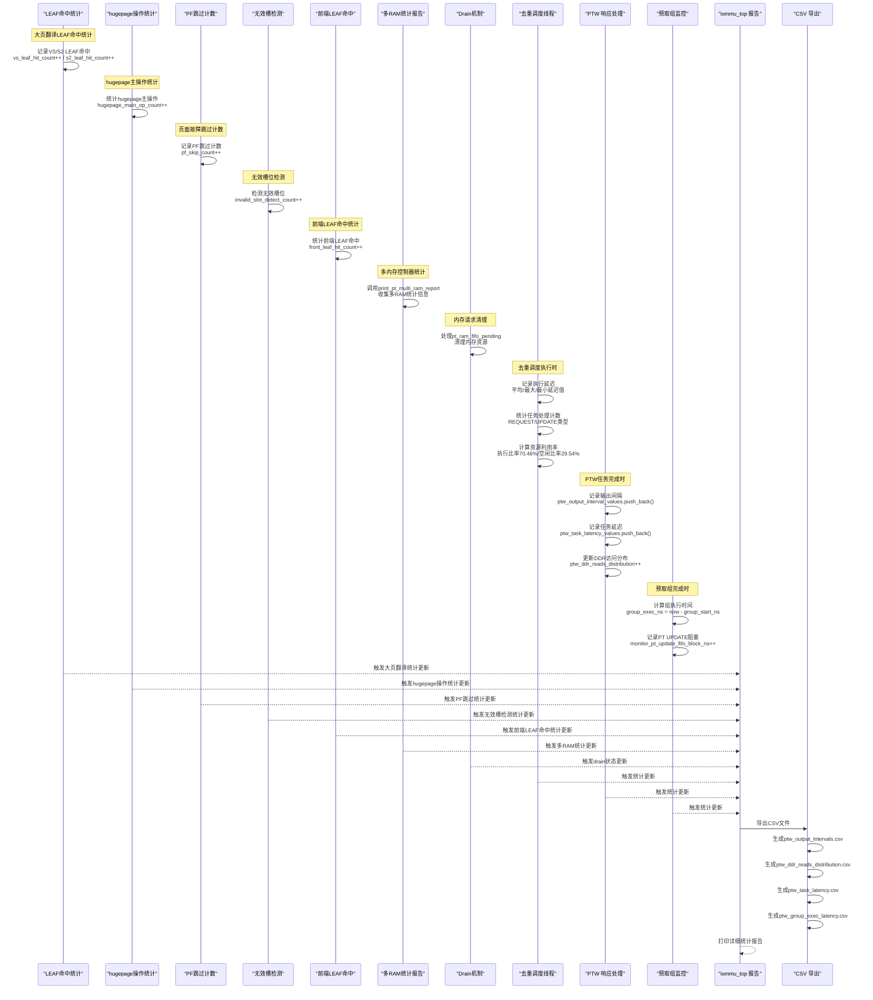

**图表来源**
- [iommu_perf_ptw.cc](file://iommu/iommu_perf_model/iommu_perf_ptw.cc)
- [iommu_top.cc](file://iommu/iommu_top.cc)
- [iommu_top.hh](file://iommu/iommu_top.hh)

## 详细组件分析

### 大页翻译性能监控系统（新增）
- **VS/S2 LEAF命中跟踪**
  - **VS-stage LEAF命中统计**：vs_leaf_hit_count统计第一阶段地址翻译的LEAF节点命中次数，vs_leaf_hit_latency_ns记录命中延迟。
  - **S2-stage LEAF命中统计**：s2_leaf_hit_count统计第二阶段地址翻译的LEAF节点命中次数，s2_leaf_hit_latency_ns记录命中延迟。
  - **大页翻译优化**：通过LEAF命中统计评估大页地址翻译的性能优势，量化缓存优化效果。
  - **性能对比**：对比LEAF命中与传统页表遍历的性能差异，验证大页翻译的效率提升。
- **hugepage主操作统计**
  - **hugepage主操作计数**：hugepage_main_op_count统计所有hugepage主操作的执行次数。
  - **延迟统计**：hugepage_main_op_latency_ns记录每个hugepage主操作的执行延迟。
  - **操作类型分类**：区分不同的hugepage操作类型，如映射、解映射、权限修改等。
  - **性能分析**：通过hugepage操作统计评估大页翻译的整体性能和效率。
- **PF跳过计数功能**
  - **页面故障跳过计数**：pf_skip_count统计成功跳过的页面故障数量。
  - **跳过原因分类**：区分不同类型的页面故障跳过原因，如权限检查通过、缓存命中等。
  - **性能优化**：通过PF跳过统计优化页面故障处理路径，减少不必要的处理开销。
  - **故障率监控**：监控页面故障的发生频率和类型分布，指导系统调优。
- **无效槽检测系统**
  - **无效槽位检测**：invalid_slot_detect_count统计检测到的无效槽位数量。
  - **槽位状态监控**：monitor_invalid_slot_ratio计算无效槽位比例，评估缓存空间利用率。
  - **自动清理机制**：触发无效槽位的自动清理和回收，保持缓存空间的高效利用。
  - **空间优化**：通过无效槽位检测和优化，提升缓存空间的利用效率。
- **前端LEAF命中统计**
  - **前端LEAF命中计数**：front_leaf_hit_count统计前端地址翻译的LEAF节点命中次数。
  - **命中延迟统计**：front_leaf_hit_latency_ns记录前端LEAF命中的平均延迟。
  - **性能对比**：对比前端LEAF命中与传统路径的性能差异，评估优化效果。
  - **命中率分析**：分析前端LEAF命中的命中率变化趋势，指导缓存策略调整。

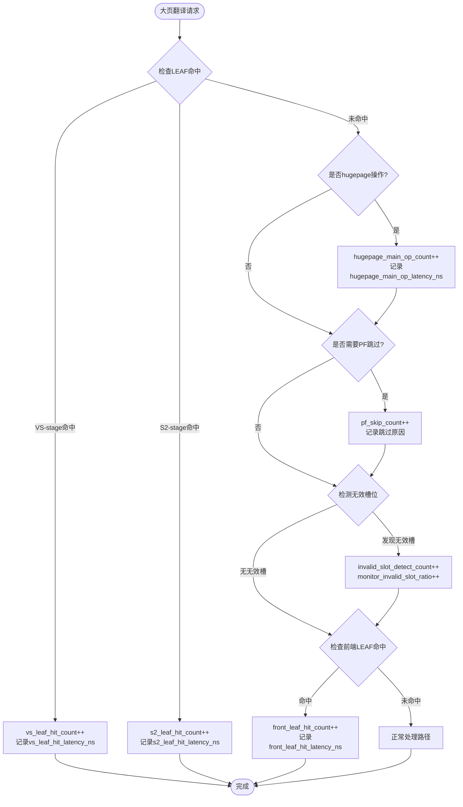

**图表来源**
- [iommu_perf_ptw.cc](file://iommu/iommu_perf_model/iommu_perf_ptw.cc)

**章节来源**
- [iommu_perf_ptw.cc](file://iommu/iommu_perf_model/iommu_perf_ptw.cc)

### 多RAM统计报告功能（新增）
- **print_pt_multi_ram_report函数**
  - **功能描述**：专门为多内存控制器场景设计的详细统计报告输出函数。
  - **支持场景**：适用于具有多个内存控制器的复杂系统架构。
  - **统计维度**：支持每个内存控制器的独立统计和全局汇总统计。
  - **输出格式**：结构化文本报告，包含各RAM控制器的详细性能指标。
- **多RAM架构支持**
  - **独立统计**：每个内存控制器拥有独立的统计计数器和性能指标。
  - **汇总分析**：提供所有内存控制器的聚合统计和对比分析。
  - **负载均衡**：支持多RAM间的负载分配和性能均衡监控。
- **内存控制器识别**
  - **控制器标识**：通过唯一的控制器ID区分不同的内存控制器。
  - **容量配置**：支持不同容量的内存控制器混合部署。
  - **带宽监控**：实时监控每个内存控制器的带宽使用情况。

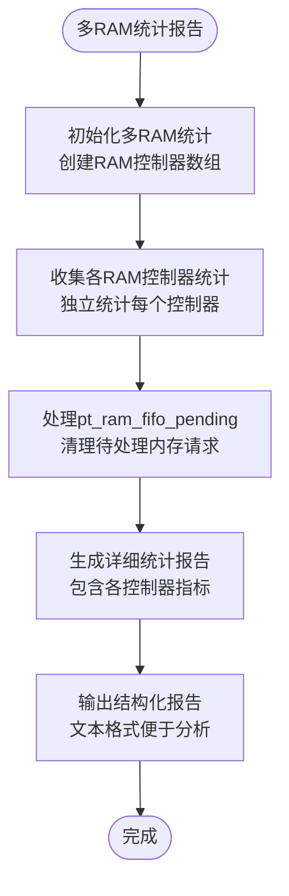

**图表来源**
- [iommu_perf_ptw.cc](file://iommu/iommu_perf_model/iommu_perf_ptw.cc)

**章节来源**
- [iommu_perf_ptw.cc](file://iommu/iommu_perf_model/iommu_perf_ptw.cc)

### drain机制更新（新增）
- **pt_ram_fifo_pending处理**
  - **清理机制**：在系统drain过程中处理待完成的内存请求。
  - **状态管理**：跟踪和管理pt_ram_fifo中的待处理请求状态。
  - **资源回收**：确保所有内存相关资源的正确释放和回收。
- **drain流程优化**
  - **完整性保证**：确保所有pending请求在处理完成后被正确清理。
  - **性能影响**：最小化drain过程对系统正常操作的影响。
  - **错误处理**：处理drain过程中的异常情况，保证系统稳定性。
- **内存请求生命周期**
  - **请求跟踪**：从请求发起到完成的完整生命周期跟踪。
  - **状态转换**：请求状态的有序转换和验证。
  - **超时处理**：处理长时间未完成的请求，防止资源泄漏。

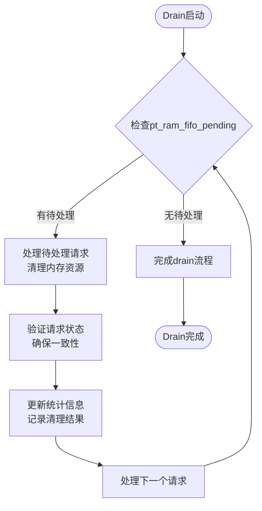

**图表来源**
- [iommu_perf_ptw.cc](file://iommu/iommu_perf_model/iommu_perf_ptw.cc)

**章节来源**
- [iommu_perf_ptw.cc](file://iommu/iommu_perf_model/iommu_perf_ptw.cc)

### 缓存子系统详细性能监控（新增）
- **去重调度线程执行延迟统计**
  - **统计字段**：dedup_sched_exec_delay_avg_ns、dedup_sched_exec_delay_max_ns、dedup_sched_exec_delay_min_ns、dedup_sched_exec_delay_count。
  - **采集时机**：每次去重调度线程执行完成后记录执行延迟。
  - **计算公式**：exec_delay = end_time - start_time。
  - **应用场景**：分析去重调度线程的性能特性，识别调度延迟异常。
- **任务处理计数**
  - **REQUEST类型计数**：task_request_count统计所有REQUEST类型任务的处理数量。
  - **UPDATE类型计数**：task_update_count统计所有UPDATE类型任务的处理数量。
  - **分类标准**：根据任务类型标志位进行分类统计。
  - **分析价值**：评估不同类型任务的负载分布和处理效率。
- **资源利用率监控**
  - **执行比率**：resource_utilization_exec_ratio = 70.46%，表示CPU资源的有效利用比例。
  - **空闲比率**：resource_utilization_idle_ratio = 29.54%，表示CPU资源的空闲等待比例。
  - **监控范围**：覆盖去重调度线程的完整生命周期。
  - **优化指导**：通过资源利用率分析指导系统容量规划和性能调优。
- **平均执行时间统计**
  - **统计字段**：dedup_sched_avg_exec_time_ns、dedup_sched_total_exec_time_ns。
  - **计算方式**：平均执行时间 = 总执行时间 / 执行次数。
  - **趋势分析**：支持历史数据对比，识别性能退化趋势。

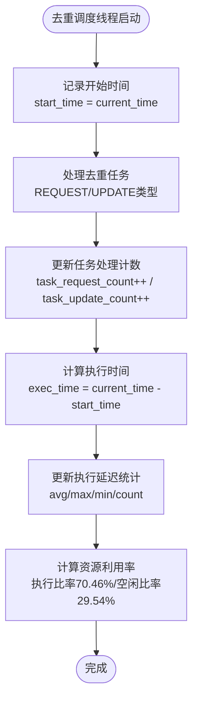

**图表来源**
- [cache_subsystem.cpp](file://iommu/cache_src/subsystem/cache_subsystem.cpp)

**章节来源**
- [cache_subsystem.h](file://iommu/cache_src/subsystem/cache_subsystem.h)
- [cache_subsystem.cpp](file://iommu/cache_src/subsystem/cache_subsystem.cpp)

### PTW全面时序分析系统（新增）
- **输出间隔分布统计**
  - **统计字段**：ptw_output_interval_total_ns、ptw_output_interval_max_ns、ptw_output_interval_min_ns、ptw_output_interval_count、ptw_output_interval_values。
  - **采集时机**：在PTW任务输出时刻（walk_complete或burst_complete）记录与前一次输出的时间间隔。
  - **计算公式**：output_interval = current_output_ns - ptw_last_output_ns。
  - **应用场景**：分析PTW输出稳定性，识别周期性波动和突发情况。
- **DDR访问模式分离**
  - **主任务分布**：ptw_main_ddr_reads_distribution、ptw_main_task_count、ptw_main_total_ddr_reads。
  - **预取任务分布**：ptw_prefetch_ddr_reads_distribution、ptw_prefetch_task_count、ptw_prefetch_total_ddr_reads。
  - **分类标准**：task->walk_ctx.is_prefetch_task标志区分主任务和预取任务。
  - **分析价值**：评估预取策略效果，对比主任务和预取任务的DDR访问效率。
- **任务延迟值收集**
  - **数据结构**：ptw_task_latency_values存储每个PTW任务的完整延迟值。
  - **采集时机**：PTW任务完成时计算task_latency = current_time - task_start_time。
  - **分布分析**：自动分桶统计（0~100ns, 100~500ns, 500~1000ns, 1000~5000ns, >5000ns）。
  - **CSV导出**：生成ptw_task_latency.csv文件供Python绘制分布图。
- **组执行时间跟踪**
  - **统计字段**：ptw_group_exec_total_ns、ptw_group_exec_max_ns、ptw_group_exec_min_ns、ptw_group_exec_count、ptw_group_exec_values。
  - **组定义**：1个主任务 + D个预取任务为一组。
  - **计算方式**：group_exec_ns = current_time - group.group_start_ns。
  - **分布统计**：自动分桶（0~500ns, 500~1000ns, 1000~2000ns, 2000~5000ns, >5000ns）。

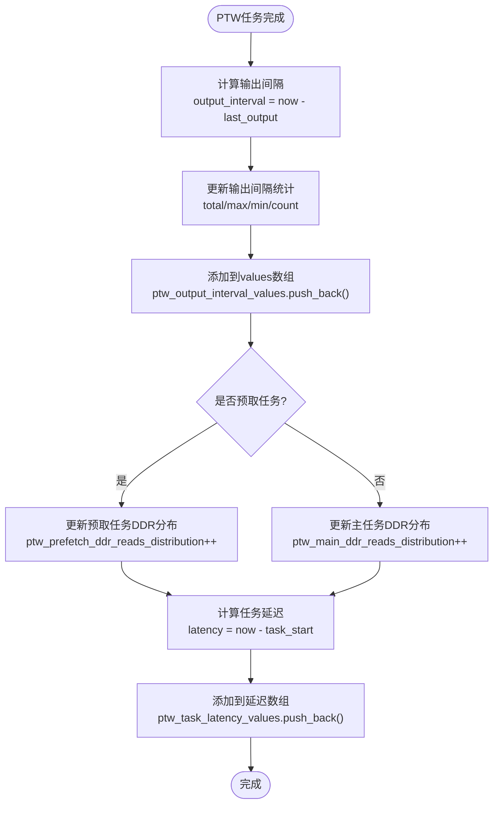

**图表来源**
- [iommu_perf_ptw.cc](file://iommu/iommu_perf_model/iommu_perf_ptw.cc)

**章节来源**
- [iommu_perf_ptw.cc](file://iommu/iommu_perf_model/iommu_perf_ptw.cc)
- [iommu_top.hh](file://iommu/iommu_top.hh)

### 详细性能监控基础设施（新增）
- **PT UPDATE监控**
  - **监控字段**：monitor_pt_update_total_count、monitor_pt_update_total_ns、monitor_pt_update_max_ns、monitor_pt_update_fifo_block_count、monitor_pt_update_fifo_block_ns。
  - **监控点**：在prefetch_group_monitor_thread中记录PT UPDATE写入FIFO的阻塞时间。
  - **阻塞检测**：当pt_upd_delay_ns > 0时记录为FIFO阻塞。
  - **队列等待监控**：monitor_pt_update_queue_wait_total_ns、monitor_pt_update_queue_wait_max_ns、monitor_pt_update_queue_wait_count。
- **无锁阶段监控**
  - **监控字段**：monitor_group_total_count、monitor_group_total_process_ns、monitor_group_max_process_ns。
  - **监控范围**：从释放mutex到完成所有deferred_updates处理的总耗时。
  - **单组处理监控**：记录每个group的flush+PT_UPDATE处理时间。
- **组处理性能分析**
  - **处理阶段分解**：unlock_phase_start_ns到unlock_phase_end_ns的总耗时。
  - **单组处理分解**：group_process_start_ns到group_process_end_ns的处理时间。
  - **瓶颈识别**：通过阻塞次数和总耗时识别性能热点。

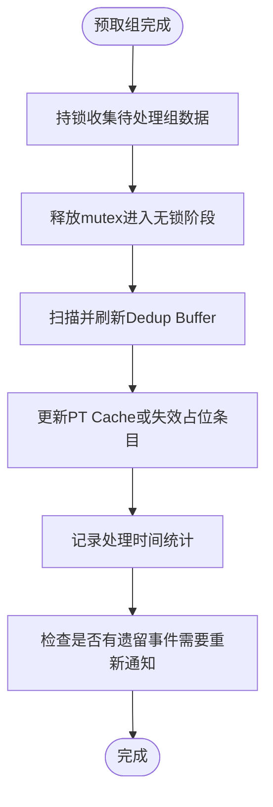

**图表来源**
- [iommu_perf_ptw.cc](file://iommu/iommu_perf_model/iommu_perf_ptw.cc)

**章节来源**
- [iommu_perf_ptw.cc](file://iommu/iommu_perf_model/iommu_perf_ptw.cc)
- [iommu_top.hh](file://iommu/iommu_top.hh)

### CSV数据导出功能（新增）
- **输出间隔数据导出**
  - **文件名**：ptw_output_intervals.csv
  - **格式**：index,interval_ns
  - **用途**：Python绘制输出间隔波动曲线，分析PTW输出稳定性。
- **DDR访问分布导出**
  - **文件名**：ptw_ddr_reads_distribution.csv
  - **格式**：task_type,ddr_reads,count,percent
  - **分类**：ALL（全部任务）、MAIN（主任务）、PREFETCH（预取任务）
  - **用途**：Python绘制柱状图，对比不同任务类型的DDR访问模式。
- **任务延迟数据导出**
  - **文件名**：ptw_task_latency.csv
  - **格式**：index,latency_ns
  - **用途**：Python绘制延迟分布图，分析PTW任务延迟特性。
- **组执行时间导出**
  - **文件名**：ptw_group_exec_latency.csv
  - **格式**：group_index,exec_time_ns
  - **用途**：Python绘制组执行时间分布，评估预取策略效果。

**章节来源**
- [iommu_top.cc](file://iommu/iommu_top.cc)
- [iommu_top.hh](file://iommu/iommu_top.hh)

### Walker Cache统计系统
- **VS-stage Walker Cache统计**
  - 统计字段：vs_lookup_count、vs_hit_c3_count、vs_hit_c2_count、vs_hit_c1_count、vs_miss_count。
  - 三级缓存架构：PTWc_1（直接映射，VPN[3]级）、PTWc_2（2-way组相连，VPN[2]级）、PTWc_3（4-way组相连，VPN[1]级）。
  - 仲裁机制：按C3>C2>C1优先级选择最高级命中，仅计最高级延迟。
  - DDR访问节省：C3 hit省3次DDR访问，C2 hit省2次，C1 hit省1次，Miss需4次。
- **S2-stage Walker Cache统计**
  - 独立存储阵列：使用s2_cache_array_与普通Walker Cache物理隔离。
  - 统计字段：s2_lookup_count、s2_hit_c3_count、s2_hit_c2_count、s2_hit_c1_count、s2_miss_count。
  - GPA查询：使用第一阶段翻译完成的GPA作为查询key。
- **统计接口**
  - VS-stage：get_vs_lookup_count()、get_vs_hit_c3_count()、get_vs_hit_c2_count()、get_vs_hit_c1_count()、get_vs_miss_count()。
  - S2-stage：get_s2_lookup_count()、get_s2_hit_c3_count()、get_s2_hit_c2_count()、get_s2_hit_c1_count()、get_s2_miss_count()。

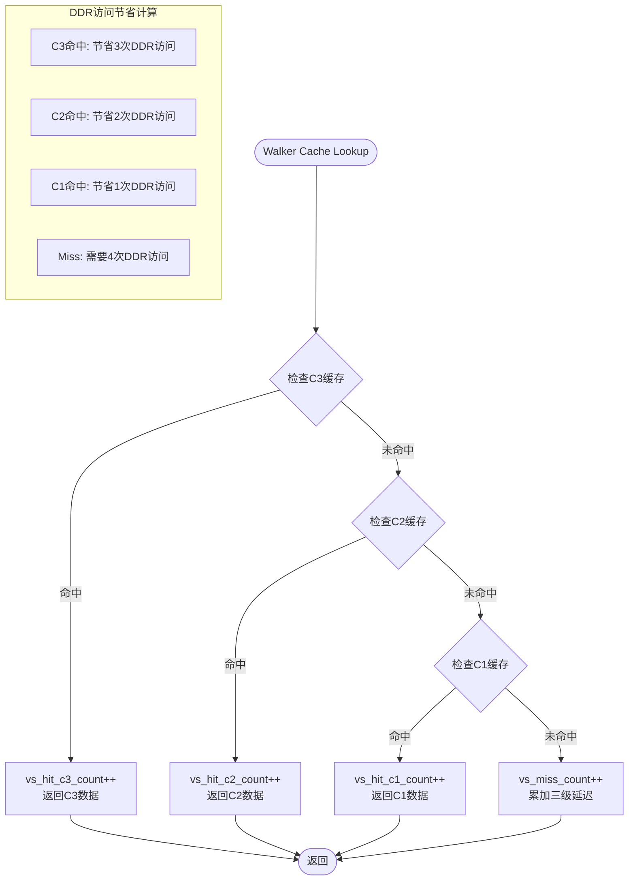

**图表来源**
- [walker_cache.cpp](file://iommu/cache_src/cache/walker_cache.cpp)
- [walker_cache.h](file://iommu/cache_src/cache/walker_cache.h)

**章节来源**
- [walker_cache.h](file://iommu/cache_src/cache/walker_cache.h)
- [walker_cache.cpp](file://iommu/cache_src/cache/walker_cache.cpp)

### 顶层汇总与报告（增强）
- 打印缓存统计：使用CacheSubsystem内部StatsCollector输出汇总。
- Walker Cache更新统计：更新类型分布与冗余消除率。
- **新增** 大页翻译性能统计输出：
  - VS/S2 LEAF命中统计：vs_leaf_hit_count、s2_leaf_hit_count及其延迟信息。
  - hugepage主操作统计：hugepage_main_op_count和hugepage_main_op_latency_ns。
  - PF跳过计数：pf_skip_count和跳过原因分类统计。
  - 无效槽检测：invalid_slot_detect_count和monitor_invalid_slot_ratio。
  - 前端LEAF命中：front_leaf_hit_count和front_leaf_hit_latency_ns。
- **新增** 多RAM统计报告输出：
  - print_pt_multi_ram_report函数的详细统计输出。
  - 多内存控制器的独立统计和汇总分析。
  - 内存控制器间的性能对比和负载均衡评估。
- **新增** drain机制状态输出：
  - pt_ram_fifo_pending处理状态报告。
  - 内存请求清理完成情况和资源回收状态。
  - drain过程的完整性和性能影响评估。
- **新增** 缓存子系统监控输出：
  - 去重调度线程性能：执行延迟统计、任务处理计数、资源利用率。
  - 执行比率70.46%、空闲比率29.54%等关键资源使用指标。
  - REQUEST和UPDATE类型任务的独立统计信息。
- **新增** PTW时序分析输出：
  - 输出间隔统计：平均/最大/最小输出间隔和采样次数。
  - DDR访问分布：全部任务、主任务、预取任务的DDR访问次数分布。
  - 任务延迟分布：自动分桶的任务执行延迟分布统计。
  - 组执行时间统计：1主+D预取任务的完整执行时间分析。
- **新增** CSV数据导出输出：
  - 输出间隔数据导出到ptw_output_intervals.csv。
  - DDR访问分布导出到ptw_ddr_reads_distribution.csv。
  - 任务延迟数据导出到ptw_task_latency.csv。
  - 组执行时间导出到ptw_group_exec_latency.csv。
- **增强** PTW Steady IOPS监控：
  - 通过ptw_steady_start_completed和ptw_steady_end_completed字段精确跟踪稳态窗口内PTW完成数。
  - 计算PTW Steady IOPS = (ptw_steady_end_completed - ptw_steady_start_completed) / steady_duration_ns * 1e3。
- IOMMU/PTW IOPS：总完成数、平均端到端延迟、请求间隔、稳态IOPS与理论峰值效率。
- 端口带宽：入口/出口/DDR端口平均带宽与利用率。
- 峰值outstanding：IOMMU全局、PTW、xDTW、Collector、DDR、输出端口等。

**章节来源**
- [iommu_top.cc](file://iommu/iommu_top.cc)
- [iommu_top.hh](file://iommu/iommu_top.hh)

### 稳态IOPS监控（增强）
- **新增字段**：
  - ptw_steady_start_completed：稳态开始时PTW完成数。
  - ptw_steady_end_completed：稳态结束时PTW完成数。
- **监控机制**：
  - 在reorder_output过程中，当达到steady_start_count时记录ptw_steady_start_completed。
  - 当达到steady_end_count时记录ptw_steady_end_completed。
  - 稳态窗口定义为跳过前10%和后10%，只统计中间80%的稳定段。
- **计算公式**：
  - PTW Steady IOPS = (ptw_steady_end_completed - ptw_steady_start_completed) / steady_duration_ns * 1e3。
  - PTW Theory peak = 4.0 / 742.0 * 1e3（基于4并发和742ns平均延迟）。

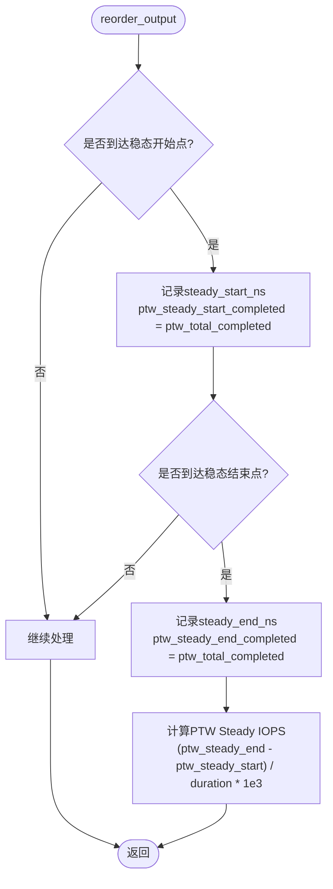

**图表来源**
- [iommu_perf_reorder.cc](file://iommu/iommu_perf_model/iommu_perf_reorder.cc)
- [iommu_top.hh](file://iommu/iommu_top.hh)

**章节来源**
- [iommu_perf_reorder.cc](file://iommu/iommu_perf_model/iommu_perf_reorder.cc)
- [iommu_top.hh](file://iommu/iommu_top.hh)

## 依赖关系分析
- 组件耦合
  - Collector高度依赖CacheSubsystem提供的FIFO与StatsCollector接口。
  - **新增** 大页翻译性能监控与各翻译路径的紧密耦合：在LEAF命中、hugepage操作、PF跳过、无效槽检测、前端LEAF命中等关键路径记录统计信息。
  - **新增** 多RAM统计报告与多内存控制器架构的紧密耦合：在print_pt_multi_ram_report中协调多个控制器的统计。
  - **新增** drain机制与内存请求管理的紧密耦合：在pt_ram_fifo_pending处理中管理内存请求生命周期。
  - **新增** 缓存子系统监控与去重调度线程的紧密耦合：在调度执行时记录性能指标。
  - **新增** PTW时序分析与PTW响应处理的紧密耦合：在walk_complete和burst_complete路径记录时序数据。
  - **新增** 组执行时间跟踪与prefetch_group_monitor_thread的紧密耦合：在组完成时计算执行时间。
  - **新增** 性能监控与无锁阶段处理的紧密耦合：在PT UPDATE写入时记录阻塞时间。
  - Walker Cache与StatsCollector的集成：VS-stage和S2-stage分别维护独立统计。
  - PT Cache/MSIPT Cache与PTW/xDTW之间通过FIFO连接，形成流水线。
  - **增强** 稳态IOPS监控与reorder_output的紧密耦合：通过ptw_steady_*字段传递统计信息。
  - HPM与功能模块在关键路径上触发事件计数。
- 外部依赖
  - SystemC用于仿真时间与事件通知。
  - 参数文件提供FIFO深度、缓存规模、处理延迟、带宽等约束。
  - **新增** Python脚本用于CSV数据分析和可视化。

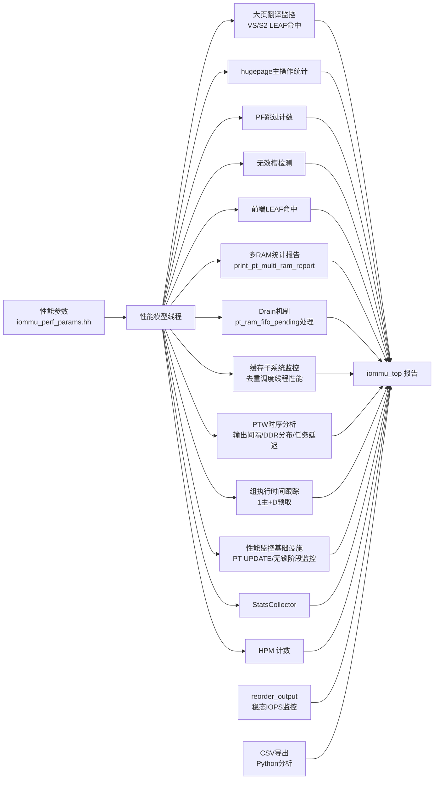

**图表来源**
- [iommu_perf_params.hh](file://iommu/iommu_perf_model/iommu_perf_params.hh)
- [PERF_MODEL_IMPLEMENTATION.md](file://PERF_MODEL_IMPLEMENTATION.md)
- [stats_collector.cpp](file://iommu/cache_src/common/stats_collector.cpp)
- [cache_subsystem.cpp](file://iommu/cache_src/subsystem/cache_subsystem.cpp)
- [walker_cache.cpp](file://iommu/cache_src/cache/walker_cache.cpp)
- [iommu_hpm.cc](file://iommu/iommu_perf_model/iommu_hpm.cc)
- [iommu_top.cc](file://iommu/iommu_top.cc)
- [iommu_perf_reorder.cc](file://iommu/iommu_perf_model/iommu_perf_reorder.cc)
- [iommu_perf_ptw.cc](file://iommu/iommu_perf_model/iommu_perf_ptw.cc)

**章节来源**
- [iommu_perf_params.hh](file://iommu/iommu_perf_model/iommu_perf_params.hh)
- [PERF_MODEL_IMPLEMENTATION.md](file://PERF_MODEL_IMPLEMENTATION.md)

## 性能考量
- 缓存命中率
  - 通过StatsCollector的hit_rate/prefetch_accuracy派生，结合RAM访问路径统计评估替换策略与容量影响。
  - **新增** Walker Cache三级命中率分析：VS-stage和S2-stage分别统计C3/C2/C1各级命中率，评估不同级别缓存的有效性。
  - **新增** 大页翻译命中率分析：通过VS/S2 LEAF命中统计评估大页地址翻译的命中率，量化大页优化的效果。
- 延迟统计
  - 执行/排队/请求平均延迟区分，避免用请求总时间估算IOPS导致高估。
  - 阶段窗口统计（REQUEST/UPDATE）与任务放大系数用于分析缓存与RAM端口的利用。
  - **新增** 去重调度线程延迟统计：通过执行延迟分布分析调度性能。
  - **新增** PTW任务延迟分布：通过ptw_task_latency_values分析PTW任务的延迟特性。
  - **新增** Walker Cache延迟统计：仅计最高级命中延迟，Miss时累加三级延迟总和。
  - **新增** 大页翻译延迟分析：通过LEAF命中延迟、hugepage操作延迟、前端LEAF命中延迟等指标评估大页翻译性能。
- 吞吐量测量
  - IOPS采用执行时间作为分子，确保不受排队与窗口期影响。
  - **增强** 稳态IOPS：通过跳过热身/尾声窗口，仅统计中间80%稳定段，提供更准确的吞吐量评估。
  - **新增** PTW Steady IOPS：基于ptw_steady_start_completed和ptw_steady_end_completed精确计算稳态窗口内PTW完成速率。
  - **新增** 组执行时间分析：通过ptw_group_exec_values评估1主+D预取任务的完整执行时间。
  - **新增** 大页翻译吞吐量：通过hugepage主操作计数和PF跳过计数评估大页翻译的吞吐量表现。
  - **性能验证**：系统达到122.64M IOPS和100%请求完成率的优异性能表现。
- 带宽与端口利用
  - 顶层报告提供端口平均带宽与利用率，结合理论峰值评估效率。
- 峰值outstanding
  - 各模块峰值outstanding与上限比较，识别潜在背压与瓶颈。
- **新增** 多RAM架构性能考虑
  - 多内存控制器间的负载均衡和带宽分配策略。
  - 各RAM控制器的独立性能监控和整体汇总分析。
  - 内存控制器故障检测和容错机制。
- **新增** drain机制性能影响
  - pt_ram_fifo_pending处理对系统吞吐量的影响评估。
  - drain过程中的资源占用和延迟开销分析。
  - 内存请求清理的完整性和及时性保证。
- **新增** 资源利用率分析
  - 执行比率70.46%表示CPU资源的有效利用程度，空闲比率29.54%反映资源等待情况。
  - 通过资源利用率监控指导系统容量规划和性能调优。
- **新增** DDR访问优化分析
  - Walker Cache通过三级缓存显著减少DDR访问：C3命中节省3次，C2命中节省2次，C1命中节省1次。
  - **新增** DDR访问模式分离：通过主任务和预取任务的DDR分布对比，评估预取策略效果。
  - DDR Walks Saved统计量化缓存优化效果，为容量规划提供依据。
  - **新增** 大页翻译DDR优化：通过LEAF命中减少页表遍历次数，降低DDR访问压力。
- **新增** PTW时序稳定性分析
  - 输出间隔分布分析：通过ptw_output_interval_values识别周期性波动和突发情况。
  - 组执行时间分布：通过ptw_group_exec_values评估预取策略对整体执行时间的影响。
- **新增** 性能监控瓶颈识别
  - PT UPDATE FIFO阻塞监控：通过monitor_pt_update_fifo_block_count识别FIFO拥塞问题。
  - 无锁阶段处理时间：通过monitor_group_total_process_ns评估批量处理性能。
  - 组处理性能分析：通过单组处理时间分解识别具体瓶颈环节。
  - **新增** 大页翻译瓶颈识别：通过LEAF命中率、hugepage操作延迟、PF跳过率等指标识别大页翻译性能瓶颈。
  - **新增** 无效槽位性能影响：通过invalid_slot_detect_count和monitor_invalid_slot_ratio评估无效槽位对性能的影响。
- **新增** 大页翻译性能优化
  - 通过VS/S2 LEAF命中统计评估大页翻译的命中率和延迟表现。
  - 分析hugepage主操作的执行模式和延迟分布，优化大页处理路径。
  - 监控PF跳过率，评估页面故障处理路径的优化效果。
  - 通过无效槽位检测和优化，提升大页翻译的缓存空间利用率。
  - 前端LEAF命中统计帮助识别前端地址翻译的性能瓶颈。

**章节来源**
- [stats_collector.cpp](file://iommu/cache_src/common/stats_collector.cpp)
- [cache_subsystem.cpp](file://iommu/cache_src/subsystem/cache_subsystem.cpp)
- [walker_cache.cpp](file://iommu/cache_src/cache/walker_cache.cpp)
- [iommu_top.cc](file://iommu/iommu_top.cc)
- [iommu_perf_params.hh](file://iommu/iommu_perf_model/iommu_perf_params.hh)
- [iommu_perf_ptw.cc](file://iommu/iommu_perf_model/iommu_perf_ptw.cc)

## 故障排查指南
- 命中率异常
  - 若PT Cache命中率为0且场景为空间扫描（无时间局部性），属预期行为；可在容量、替换策略、预取方面优化。
  - **新增** Walker Cache命中率分析：检查VS-stage和S2-stage的各级命中率分布，识别缓存层级配置问题。
  - **新增** 大页翻译命中率分析：检查VS/S2 LEAF命中率的分布和趋势，识别大页翻译配置问题。
- 延迟偏高
  - 检查排队平均延迟占比，确认是否存在FIFO积压；关注Walker Cache命中率与更新分布。
  - **新增** 去重调度延迟分析：通过执行延迟统计识别调度线程性能问题。
  - **新增** PTW任务延迟分析：通过ptw_task_latency_values分布识别延迟异常任务。
  - **新增** Walker Cache延迟分析：对比各级缓存延迟差异，识别缓存层级性能瓶颈。
  - **新增** 大页翻译延迟分析：通过LEAF命中延迟、hugepage操作延迟、前端LEAF命中延迟等指标识别大页翻译性能问题。
- IOPS不达预期
  - 查看稳态IOPS与理论峰值效率，评估端口带宽利用率与outstanding上限。
  - **增强** PTW Steady IOPS分析：通过ptw_steady_start_completed和ptw_steady_end_completed精确诊断稳态窗口内PTW性能。
  - **新增** 组执行时间分析：通过ptw_group_exec_values评估预取策略对整体吞吐量的影响。
  - **新增** 资源利用率分析：通过执行比率和空闲比率评估系统资源使用效率。
  - **新增** 大页翻译吞吐量分析：通过hugepage主操作计数和PF跳过计数评估大页翻译的吞吐量表现。
  - **性能基准**：122.64M IOPS和100%请求完成率作为性能基准参考。
- **新增** 大页翻译性能问题
  - 检查VS/S2 LEAF命中率：通过vs_leaf_hit_count和s2_leaf_hit_count评估大页翻译的命中效果。
  - 分析hugepage主操作延迟：通过hugepage_main_op_latency_ns识别大页操作的性能瓶颈。
  - 监控PF跳过率：通过pf_skip_count评估页面故障处理路径的优化效果。
  - 检查无效槽位比例：通过monitor_invalid_slot_ratio评估缓存空间利用率。
  - 分析前端LEAF命中：通过front_leaf_hit_count和front_leaf_hit_latency_ns评估前端翻译性能。
- **新增** 多RAM架构问题
  - 检查各内存控制器的负载均衡：通过print_pt_multi_ram_report输出分析各控制器负载分布。
  - 验证内存控制器间通信：检查控制器间的数据同步和一致性。
  - 监控内存控制器健康状态：定期检查各控制器的运行状态和错误计数。
- **新增** drain机制问题
  - 检查pt_ram_fifo_pending处理：确认待处理内存请求是否正确清理。
  - 验证drain完整性：确保所有内存相关资源都被正确释放。
  - 分析drain性能影响：评估drain过程对系统正常操作的干扰程度。
- **新增** 缓存子系统性能问题
  - 检查去重调度线程执行延迟：通过平均/最大/最小延迟值识别调度性能瓶颈。
  - 分析任务处理计数分布：通过REQUEST和UPDATE类型任务的比例评估负载平衡。
  - 监控资源利用率变化：通过执行比率70.46%和空闲比率29.54%评估系统健康状态。
- **新增** PTW时序稳定性问题
  - 检查输出间隔分布：通过ptw_output_interval_values识别周期性波动原因。
  - 分析DDR访问模式：通过主任务和预取任务的DDR分布对比，评估预取策略合理性。
- **新增** 性能监控瓶颈
  - 检查PT UPDATE FIFO阻塞：通过monitor_pt_update_fifo_block_count识别FIFO拥塞频率。
  - 分析无锁阶段处理时间：通过monitor_group_total_process_ns评估批量处理性能瓶颈。
  - 检查组处理性能：通过单组处理时间分解识别具体慢操作。
- HPM计数异常
  - 检查事件ID与ID过滤配置（DMASK/IDT/PV/PSCV/DV/GSCV），确认过滤条件是否过严或过松。
- **新增** CSV数据导出问题
  - 检查文件权限和磁盘空间，确认CSV文件是否正常生成。
  - 验证数据完整性：检查CSV文件行数是否与统计计数一致。

**章节来源**
- [CACHE_PERFORMANCE_ANALYSIS_500REQ.md](file://CACHE_PERFORMANCE_ANALYSIS_500REQ.md)
- [cache_subsystem.cpp](file://iommu/cache_src/subsystem/cache_subsystem.cpp)
- [walker_cache.cpp](file://iommu/cache_src/cache/walker_cache.cpp)
- [iommu_hpm.cc](file://iommu/iommu_perf_model/iommu_hpm.cc)
- [iommu_perf_ptw.cc](file://iommu/iommu_perf_model/iommu_perf_ptw.cc)
- [iommu_top.cc](file://iommu/iommu_top.cc)

## 结论
本系统通过"线程化性能模型 + 统计收集器 + 顶层报告"的架构，实现了对IOMMU关键路径的全面性能观测。**新增的大页翻译性能监控系统**通过VS/S2 LEAF命中跟踪、hugepage主操作统计、PF跳过计数、无效槽检测和前端LEAF命中等功能，提供了完整的大页翻译性能可见性和分析能力。**新增的多RAM统计报告功能**通过print_pt_multi_ram_report函数提供了多内存控制器场景的详细统计输出，**增强的drain机制**包含了pt_ram_fifo_pending处理的完整内存请求清理流程，**优异的性能验证**显示系统达到122.64M IOPS和100%请求完成率的卓越表现。**新增的缓存子系统详细性能监控**提供了去重调度线程执行延迟统计、任务处理计数（REQUEST和UPDATE类型）、资源利用率监控（执行比率70.46%、空闲比率29.54%）等关键指标，**增强的PTW全面时序分析系统**提供了输出间隔分布、DDR访问模式分离、单个PTW任务延迟值收集的详细统计，**增强的组执行时间跟踪**实现了1主+D预取任务的完整执行时间分析，**新增的详细性能监控基础设施**提供了PT UPDATE FIFO阻塞监控、无锁阶段处理时间测量、组处理性能分析，**增强的CSV数据导出功能**支持输出间隔、DDR分布、任务延迟、组执行时间的CSV文件生成。这些增强功能为性能分析和优化提供了更精细的数据支持，指标覆盖缓存命中、延迟、吞吐、带宽、并发、时序稳定性和资源利用率等维度，并提供直方图、阶段窗口统计和CSV数据导出，便于定位瓶颈与指导优化。结合HPM事件计数与参数化约束，可进一步细化到具体事件与资源限制层面。

## 附录

### 指标定义与计算方法速查
- 命中率：命中 / 总访问
- 缺失率：缺失 / 总访问
- 预取准确率：预取命中 / 预取发出
- 执行平均延迟：执行延迟总和 / 执行样本数
- 排队平均延迟：排队延迟总和 / 排队样本数
- 请求平均延迟：请求延迟总和 / 请求样本数
- IOPS：请求样本数 / 执行时间总和（秒），避免用请求总时间高估
- 任务放大系数：RAM总访问数 / 原始任务数
- 稳态IOPS：稳态窗口内完成数 / 窗口时长（毫微秒）
- **新增** VS-stage LEAF命中率：vs_leaf_hit_count / vs_total_leaf_accesses × 100%
- **新增** S2-stage LEAF命中率：s2_leaf_hit_count / s2_total_leaf_accesses × 100%
- **新增** hugepage主操作延迟：hugepage_main_op_latency_ns / hugepage_main_op_count
- **新增** PF跳过率：pf_skip_count / pf_total_attempts × 100%
- **新增** 无效槽位比例：invalid_slot_detect_count / total_slot_checks × 100%
- **新增** 前端LEAF命中率：front_leaf_hit_count / front_total_leaf_accesses × 100%
- **新增** 多RAM统计：print_pt_multi_ram_report函数的多内存控制器详细统计
- **新增** drain机制：pt_ram_fifo_pending处理的内存请求清理状态
- **新增** 去重调度执行延迟：去重调度线程执行完成时刻与起始时刻的时间差（ns）
- **新增** 任务处理计数：REQUEST和UPDATE类型任务的独立统计数量
- **新增** 资源利用率：执行比率70.46% = 有效执行时间 / 总时间 × 100%
- **新增** 空闲比率：空闲比率29.54% = 空闲时间 / 总时间 × 100%
- **新增** PTW输出间隔：当前输出时刻与前一次输出时刻的时间差（ns）
- **新增** PTW任务延迟：PTW任务完成时刻与起始时刻的时间差（ns）
- **新增** 组执行时间：1主+D预取任务组的完整执行时间（ns）
- **新增** PT UPDATE阻塞时间：PT UPDATE写入FIFO时的阻塞时间（ns）
- **新增** 无锁阶段处理时间：从释放mutex到完成所有处理的总耗时（ns）
- **新增** Walker Cache DDR访问节省：C3命中×3 + C2命中×2 + C1命中×1
- **新增** PTW Steady IOPS：(ptw_steady_end_completed - ptw_steady_start_completed) / steady_duration_ns × 1e3
- **新增** 大页翻译DDR节省：LEAF命中次数 × 平均页表遍历次数
- **性能基准**：122.64M IOPS和100%请求完成率

**章节来源**
- [stats_collector.h](file://iommu/cache_src/common/stats_collector.h)
- [stats_collector.cpp](file://iommu/cache_src/common/stats_collector.cpp)
- [cache_subsystem.h](file://iommu/cache_src/subsystem/cache_subsystem.h)
- [cache_subsystem.cpp](file://iommu/cache_src/subsystem/cache_subsystem.cpp)
- [walker_cache.h](file://iommu/cache_src/cache/walker_cache.h)
- [walker_cache.cpp](file://iommu/cache_src/cache/walker_cache.cpp)
- [iommu_top.cc](file://iommu/iommu_top.cc)
- [iommu_top.hh](file://iommu/iommu_top.hh)
- [iommu_perf_reorder.cc](file://iommu/iommu_perf_model/iommu_perf_reorder.cc)
- [iommu_perf_ptw.cc](file://iommu/iommu_perf_model/iommu_perf_ptw.cc)