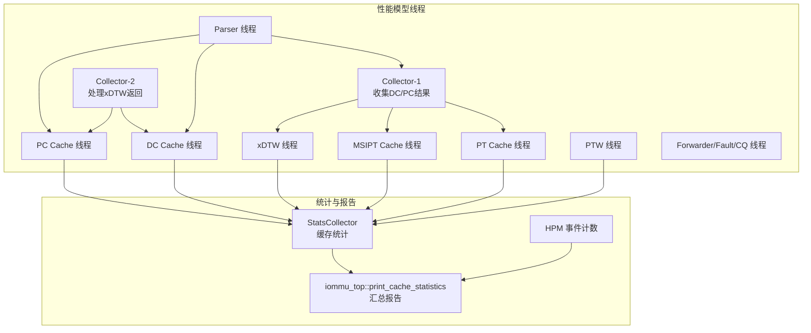
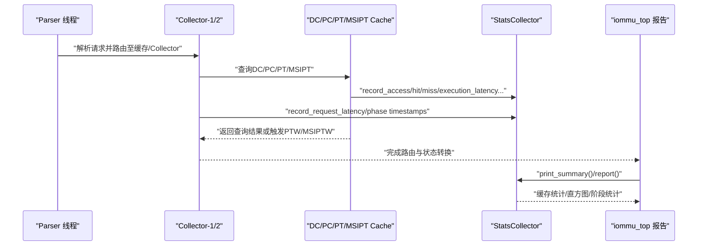
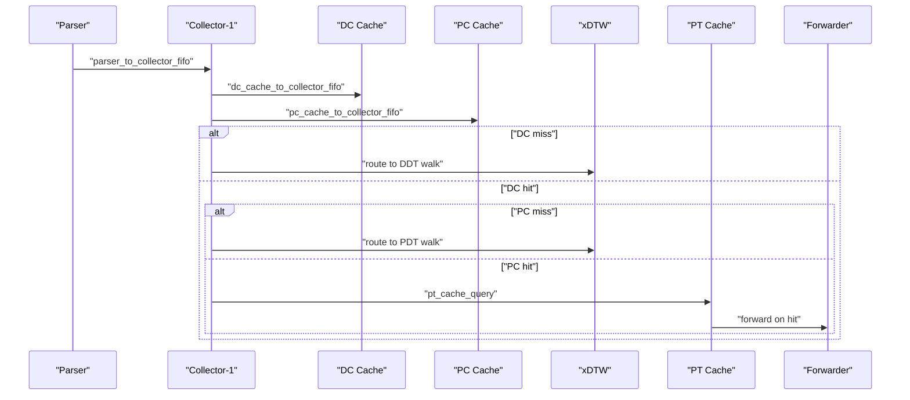
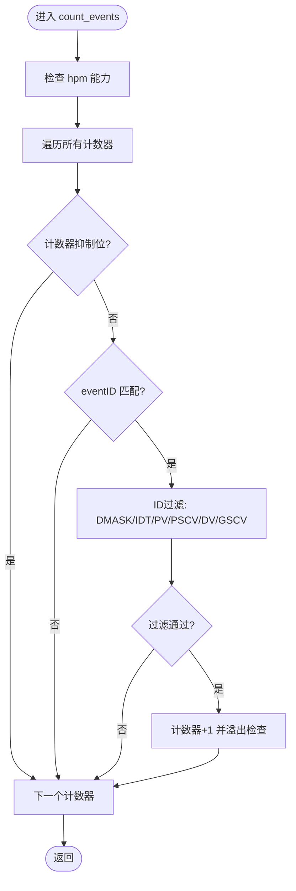
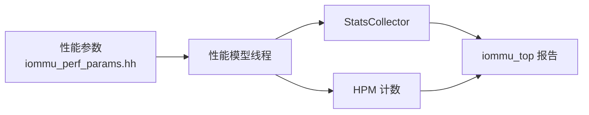

# 性能指标与统计

<cite>
**本文引用的文件**
- [iommu_perf_collector.cc](file://iommu/iommu_perf_model/iommu_perf_collector.cc)
- [stats_collector.h](file://iommu/cache_src/common/stats_collector.h)
- [stats_collector.cpp](file://iommu/cache_src/common/stats_collector.cpp)
- [iommu_hpm.cc](file://iommu/iommu_perf_model/iommu_hpm.cc)
- [iommu_hpm.hh](file://iommu/include/iommu_hpm.hh)
- [iommu_perf_params.hh](file://iommu/iommu_perf_model/iommu_perf_params.hh)
- [iommu_perf_model.hh](file://iommu/iommu_perf_model/iommu_perf_model.hh)
- [iommu_top.cc](file://iommu/iommu_top.cc)
- [PERF_MODEL_IMPLEMENTATION.md](file://PERF_MODEL_IMPLEMENTATION.md)
- [CACHE_PERFORMANCE_ANALYSIS_500REQ.md](file://CACHE_PERFORMANCE_ANALYSIS_500REQ.md)
</cite>

## 目录
1. [简介](#简介)
2. [项目结构](#项目结构)
3. [核心组件](#核心组件)
4. [架构总览](#架构总览)
5. [详细组件分析](#详细组件分析)
6. [依赖关系分析](#依赖关系分析)
7. [性能考量](#性能考量)
8. [故障排查指南](#故障排查指南)
9. [结论](#结论)
10. [附录](#附录)

## 简介
本文件面向IOMMU性能指标与统计系统，系统性阐述以下内容：
- 性能指标的定义与计算方法：缓存命中率、延迟统计、吞吐量测量、区间命中率、任务放大系数、稳态IOPS等。
- 统计收集器的工作原理与实现机制：数据采集、聚合与存储流程。
- 指标的含义与应用场景：如何结合指标进行系统优化与瓶颈识别。
- 性能数据的可视化与报告生成：文本报告、直方图、阶段窗口统计。
- 基于仓库现有实现的实践案例与解读。

## 项目结构
围绕性能指标与统计的关键目录与文件如下：
- 性能模型与线程实现：Parser、Collector、DC/PC Cache、PT Cache、MSIPT Cache、xDTW、PTW、Forwarder/Fault/CQ等。
- 统计收集器：通用缓存统计结构与接口，以及IOMMU顶层汇总打印。
- 性能参数：FIFO深度、缓存规模、处理延迟、带宽、并发限制等。
- HPM事件计数：PMU事件计数器与过滤逻辑。
- 分析报告：多篇性能分析文档，提供指标解读与优化建议。

**图表来源**
- [PERF_MODEL_IMPLEMENTATION.md](file://PERF_MODEL_IMPLEMENTATION.md)
- [iommu_perf_collector.cc](file://iommu/iommu_perf_model/iommu_perf_collector.cc)
- [stats_collector.h](file://iommu/cache_src/common/stats_collector.h)
- [stats_collector.cpp](file://iommu/cache_src/common/stats_collector.cpp)
- [iommu_top.cc](file://iommu/iommu_top.cc)

**章节来源**
- [PERF_MODEL_IMPLEMENTATION.md](file://PERF_MODEL_IMPLEMENTATION.md)
- [iommu_perf_params.hh](file://iommu/iommu_perf_model/iommu_perf_params.hh)

## 核心组件
- 统计收集器（StatsCollector）
  - 提供缓存命中/缺失、驱逐、失效、预取命中率、执行/排队/请求平均延迟、请求样本数、直方图等统计。
  - 支持按阶段（REQUEST/UPDATE/PTW_MONITOR）分类的RAM访问路径统计与时间戳记录。
  - 提供统一报告输出与直方图导出。
- 性能模型线程
  - Collector-1/2：负责收集DC/PC缓存结果、路由决策、处理xDTW返回。
  - PT Cache/MSIPT Cache：IOTLB查询、命中转发、未命中提交PTW/MSIPTW。
  - PTW/xDTW：页表walk与Walker Cache集成。
  - Parser/Forwarder/Fault/CQ：请求解析、转发、错误处理与命令处理。
- HPM事件计数
  - 基于事件ID与ID过滤（设备ID/进程ID/GSCID/PSCID）进行条件计数，溢出产生中断。
- 顶层汇总与报告
  - 打印缓存命中率、IOPS、端口带宽利用率、峰值outstanding等。

**章节来源**
- [stats_collector.h](file://iommu/cache_src/common/stats_collector.h)
- [stats_collector.cpp](file://iommu/cache_src/common/stats_collector.cpp)
- [iommu_perf_collector.cc](file://iommu/iommu_perf_model/iommu_perf_collector.cc)
- [iommu_hpm.cc](file://iommu/iommu_perf_model/iommu_hpm.cc)
- [iommu_hpm.hh](file://iommu/include/iommu_hpm.hh)
- [iommu_top.cc](file://iommu/iommu_top.cc)

## 架构总览
性能指标与统计系统由“数据采集-聚合-存储-报告”四层构成：
- 数据采集：各缓存/模块在关键路径调用StatsCollector接口记录访问、命中、缺失、延迟、阶段时间戳等。
- 聚合：StatsCollector维护各类计数器与直方图，提供命中率、平均延迟、IOPS等派生指标。
- 存储：统计数据保存在内存结构中；可选择输出到文件。
- 报告：顶层汇总打印缓存统计、IOPS、带宽、峰值outstanding等；同时可输出直方图与阶段窗口统计。

**图表来源**
- [iommu_perf_collector.cc](file://iommu/iommu_perf_model/iommu_perf_collector.cc)
- [stats_collector.cpp](file://iommu/cache_src/common/stats_collector.cpp)
- [iommu_top.cc](file://iommu/iommu_top.cc)

## 详细组件分析

### 统计收集器（StatsCollector）
- 数据结构与指标
  - 基础指标：总访问、命中、缺失、驱逐、失效、预取发出/命中。
  - 延迟指标：执行平均延迟、排队平均延迟、请求平均延迟、样本数。
  - RAM访问路径：lookup/fill_hit/fill_invalid/fill_replace，按阶段（REQUEST/UPDATE/PTW_MONITOR）细分。
  - 时间戳：访问窗口首末时间、阶段窗口首末时间、任务级等待/执行时间。
  - 区间命中率：按4个1000任务区间的命中/缺失统计。
  - 派生指标：命中率、预取准确率、IOPS（基于执行时间而非请求总时间）。
- 记录接口
  - 访问/命中/缺失/驱逐/失效/预取：record_access/record_hit/record_miss/record_eviction/record_invalidation/record_prefetch_issued/record_prefetch_hit。
  - RAM路径：record_lookup/record_fill_hit/record_fill_invalid/record_fill_replace及按阶段分类。
  - 延迟：record_latency/record_execution_latency/record_queue_latency/record_request_latency。
  - 时间戳：record_access_timestamp/record_pt_phase_timestamp。
  - 区间命中：record_interval_hit/record_interval_miss。
  - 等待时间累积：accumulate_phase_wait/accumulate_phase_task_wait。
- 报告与直方图
  - print_summary输出缓存汇总、样本数、RAM路径分解、阶段窗口统计、任务放大系数、区间命中率等。
  - report输出文本报告与可选直方图。
  - get_histogram/get_queue_histogram获取延迟直方图。

```mermaid
classDiagram
class StatsCollector {
+register_cache(name)
+record_access(name)
+record_hit(name)
+record_miss(name)
+record_eviction(name)
+record_invalidation(name)
+record_prefetch_issued(name)
+record_prefetch_hit(name)
+record_lookup(name)
+record_fill_hit(name)
+record_fill_invalid(name)
+record_fill_replace(name)
+record_phase_lookup(name, phase)
+record_phase_fill_hit(name, phase)
+record_phase_fill_invalid(name, phase)
+record_phase_fill_replace(name, phase)
+record_latency(name, ns)
+record_execution_latency(name, ns)
+record_queue_latency(name, ns)
+record_request_latency(name, ns, start, end)
+record_access_timestamp(name, ns)
+record_pt_phase_timestamp(name, phase, start, end)
+record_interval_hit(name, idx)
+record_interval_miss(name, idx)
+accumulate_phase_wait(name, phase, ns)
+accumulate_phase_task_wait(name, phase, ns)
+get_stats(name) CacheStats
+all_stats() map
+get_histogram(name) vector
+get_queue_histogram(name) vector
+set_histogram_bin_width(w)
+set_latency_histogram_enabled(flag)
+set_output_file(path)
+print_summary(os)
+report()
+reset()
}
class CacheStats {
+string name
+uint64 total_accesses
+uint64 hits
+uint64 misses
+uint64 evictions
+uint64 invalidations
+uint64 prefetch_issued
+uint64 prefetch_hits
+uint64 execution_latency_samples
+double total_execution_latency_ns
+uint64 queue_latency_samples
+double total_queue_latency_ns
+uint64 request_latency_samples
+double total_request_latency_ns
+double first_request_start_ns
+double last_request_end_ns
+uint64 lookup_count
+uint64 fill_hit_count
+uint64 fill_invalid_count
+uint64 fill_replace_count
+uint64 req_lookup_count
+uint64 req_fill_hit_count
+uint64 req_fill_inv_count
+uint64 req_fill_repl_count
+uint64 upd_lookup_count
+uint64 upd_fill_hit_count
+uint64 upd_fill_inv_count
+uint64 upd_fill_repl_count
+uint64 mon_lookup_count
+uint64 mon_fill_hit_count
+uint64 mon_fill_inv_count
+uint64 mon_fill_repl_count
+double first_access_time_ns
+double last_access_time_ns
+double req_first_start_ns
+double req_last_end_ns
+uint64 req_task_count
+double req_total_latency_ns
+uint64 req_latency_samples
+double req_wait_ns
+double req_task_wait_ns
+double upd_first_start_ns
+double upd_last_end_ns
+uint64 upd_task_count
+double upd_total_latency_ns
+uint64 upd_latency_samples
+double upd_wait_ns
+double upd_task_wait_ns
+uint64 interval_hits[4]
+uint64 interval_misses[4]
+hit_rate()
+miss_rate()
+prefetch_accuracy()
+avg_execution_latency_ns()
+avg_queue_latency_ns()
+avg_request_latency_ns()
+iops()
}
StatsCollector --> CacheStats : "维护多个实例"
```

**图表来源**
- [stats_collector.h](file://iommu/cache_src/common/stats_collector.h)
- [stats_collector.cpp](file://iommu/cache_src/common/stats_collector.cpp)

**章节来源**
- [stats_collector.h](file://iommu/cache_src/common/stats_collector.h)
- [stats_collector.cpp](file://iommu/cache_src/common/stats_collector.cpp)

### Collector线程（收集与路由）
- Collector-1
  - 监听Parser输出与DC/PC缓存响应，按task_id聚合，等待三类数据齐全后进行路由决策。
  - 根据DC/PC命中情况决定后续路径：转发Forwarder、触发xDTW DDT/PDT walk、或继续PT Cache查询。
  - 对DC/PC miss的情况，设置walk上下文并控制Collector outstanding上限。
- Collector-2
  - 处理xDTW返回的walk结果，更新DC/PC缓存，再次执行配置检查与MSI判断，然后路由到相应路径。

**图表来源**
- [iommu_perf_collector.cc](file://iommu/iommu_perf_model/iommu_perf_collector.cc)

**章节来源**
- [iommu_perf_collector.cc](file://iommu/iommu_perf_model/iommu_perf_collector.cc)

### HPM事件计数（硬件性能监控）
- 功能：根据事件ID与ID过滤（设备ID/进程ID/GSCID/PSCID）进行条件计数，支持部分匹配掩码。
- 过滤：DMASK、IDT、PV/PSCV、DV/GSCV等字段组合。
- 中断：计数器溢出时设置OF位并产生中断。

**图表来源**
- [iommu_hpm.cc](file://iommu/iommu_perf_model/iommu_hpm.cc)
- [iommu_hpm.hh](file://iommu/include/iommu_hpm.hh)

**章节来源**
- [iommu_hpm.cc](file://iommu/iommu_perf_model/iommu_hpm.cc)
- [iommu_hpm.hh](file://iommu/include/iommu_hpm.hh)

### 顶层汇总与报告（iommu_top）
- 打印缓存统计：使用CacheSubsystem内部StatsCollector输出汇总。
- Walker Cache更新统计：更新类型分布与冗余消除率。
- IOMMU/PTW IOPS：总完成数、平均端到端延迟、请求间隔、稳态IOPS与理论峰值效率。
- 端口带宽：入口/出口/DDR端口平均带宽与利用率。
- 峰值outstanding：IOMMU全局、PTW、xDTW、Collector、DDR、输出端口等。

**章节来源**
- [iommu_top.cc](file://iommu/iommu_top.cc)

## 依赖关系分析
- 组件耦合
  - Collector高度依赖CacheSubsystem提供的FIFO与StatsCollector接口。
  - PT Cache/MSIPT Cache与PTW/xDTW之间通过FIFO连接，形成流水线。
  - HPM与功能模块在关键路径上触发事件计数。
- 外部依赖
  - SystemC用于仿真时间与事件通知。
  - 参数文件提供FIFO深度、缓存规模、处理延迟、带宽等约束。

**图表来源**
- [iommu_perf_params.hh](file://iommu/iommu_perf_model/iommu_perf_params.hh)
- [PERF_MODEL_IMPLEMENTATION.md](file://PERF_MODEL_IMPLEMENTATION.md)
- [stats_collector.cpp](file://iommu/cache_src/common/stats_collector.cpp)
- [iommu_hpm.cc](file://iommu/iommu_perf_model/iommu_hpm.cc)
- [iommu_top.cc](file://iommu/iommu_top.cc)

**章节来源**
- [iommu_perf_params.hh](file://iommu/iommu_perf_model/iommu_perf_params.hh)
- [PERF_MODEL_IMPLEMENTATION.md](file://PERF_MODEL_IMPLEMENTATION.md)

## 性能考量
- 缓存命中率
  - 通过StatsCollector的hit_rate/prefetch_accuracy派生，结合RAM访问路径统计评估替换策略与容量影响。
- 延迟统计
  - 执行/排队/请求平均延迟区分，避免用请求总时间估算IOPS导致高估。
  - 阶段窗口统计（REQUEST/UPDATE）与任务放大系数用于分析缓存与RAM端口的利用。
- 吞吐量测量
  - IOPS采用执行时间作为分子，确保不受排队与窗口期影响。
  - 稳态IOPS通过跳过热身/尾声窗口，仅统计中间80%稳定段。
- 带宽与端口利用
  - 顶层报告提供端口平均带宽与利用率，结合理论峰值评估效率。
- 峰值outstanding
  - 各模块峰值outstanding与上限比较，识别潜在背压与瓶颈。

**章节来源**
- [stats_collector.cpp](file://iommu/cache_src/common/stats_collector.cpp)
- [iommu_top.cc](file://iommu/iommu_top.cc)
- [iommu_perf_params.hh](file://iommu/iommu_perf_model/iommu_perf_params.hh)

## 故障排查指南
- 命中率异常
  - 若PT Cache命中率为0且场景为空间扫描（无时间局部性），属预期行为；可在容量、替换策略、预取方面优化。
- 延迟偏高
  - 检查排队平均延迟占比，确认是否存在FIFO积压；关注Walker Cache命中率与更新分布。
- IOPS不达预期
  - 查看稳态IOPS与理论峰值效率，评估端口带宽利用率与outstanding上限。
- HPM计数异常
  - 检查事件ID与ID过滤配置（DMASK/IDT/PV/PSCV/DV/GSCV），确认过滤条件是否过严或过松。

**章节来源**
- [CACHE_PERFORMANCE_ANALYSIS_500REQ.md](file://CACHE_PERFORMANCE_ANALYSIS_500REQ.md)
- [iommu_hpm.cc](file://iommu/iommu_perf_model/iommu_hpm.cc)

## 结论
本系统通过“线程化性能模型 + 统计收集器 + 顶层报告”的架构，实现了对IOMMU关键路径的全面性能观测。指标覆盖缓存命中、延迟、吞吐、带宽与并发等维度，并提供直方图与阶段窗口统计，便于定位瓶颈与指导优化。结合HPM事件计数与参数化约束，可进一步细化到具体事件与资源限制层面。

## 附录

### 指标定义与计算方法速查
- 命中率：命中 / 总访问
- 缺失率：缺失 / 总访问
- 预取准确率：预取命中 / 预取发出
- 执行平均延迟：执行延迟总和 / 执行样本数
- 排队平均延迟：排队延迟总和 / 排队样本数
- 请求平均延迟：请求延迟总和 / 请求样本数
- IOPS：请求样本数 / 执行时间总和（秒），避免用请求总时间高估
- 任务放大系数：RAM总访问数 / 原始任务数
- 稳态IOPS：稳态窗口内完成数 / 窗口时长（毫微秒）

**章节来源**
- [stats_collector.h](file://iommu/cache_src/common/stats_collector.h)
- [stats_collector.cpp](file://iommu/cache_src/common/stats_collector.cpp)
- [iommu_top.cc](file://iommu/iommu_top.cc)