# 性能模型

<cite>
**本文档引用的文件**
- [README.md](file://README.md)
- [PERF_MODEL_IMPLEMENTATION.md](file://PERF_MODEL_IMPLEMENTATION.md)
- [Makefile](file://Makefile)
- [iommu/iommu_perf_model/iommu_perf_params.hh](file://iommu/iommu_perf_model/iommu_perf_params.hh)
- [iommu/iommu_perf_model/iommu_perf_model.hh](file://iommu/iommu_perf_model/iommu_perf_model.hh)
- [iommu/iommu_perf_model/iommu_perf_parser.cc](file://iommu/iommu_perf_model/iommu_perf_parser.cc)
- [iommu/iommu_perf_model/iommu_perf_collector.cc](file://iommu/iommu_perf_model/iommu_perf_collector.cc)
- [iommu/iommu_perf_model/iommu_hpm.cc](file://iommu/iommu_perf_model/iommu_hpm.cc)
- [iommu/iommu_perf_model/iommu_perf_ptw.cc](file://iommu/iommu_perf_model/iommu_perf_ptw.cc)
- [iommu/iommu_perf_model/iommu_perf_pt_cache_response.cc](file://iommu/iommu_perf_model/iommu_perf_pt_cache_response.cc)
- [iommu/iommu_perf_model/iommu_perf_pt_dedup_flush.cc](file://iommu/iommu_perf_model/iommu_perf_pt_dedup_flush.cc)
- [iommu/iommu_perf_model/iommu_perf_reorder.cc](file://iommu/iommu_perf_model/iommu_perf_reorder.cc)
- [iommu/include/iommu_task.hh](file://iommu/include/iommu_task.hh)
- [iommu/iommu_top.hh](file://iommu/iommu_top.hh)
- [PTW_MONITOR_ANALYSIS_20260609.md](file://PTW_MONITOR_ANALYSIS_20260609.md)
- [PTW_RESPONSE_ANALYSIS_20260609.md](file://PTW_RESPONSE_ANALYSIS_20260609.md)
- [TEST_REPORT_PHASE1_20260609.md](file://TEST_REPORT_PHASE1_20260609.md)
- [cache_src/common/stats_collector.h](file://iommu/cache_src/common/stats_collector.h)
- [cache_src/common/stats_collector.cpp](file://iommu/cache_src/common/stats_collector.cpp)
- [iommu/cache_config/default_config.json](file://iommu/cache_config/default_config.json)
- [iommu/cache_config/input_params_example.json](file://iommu/cache_config/input_params_example.json)
- [PT_DEDUP_PREFETCH_FINAL_SCHEME.md](file://PT_DEDUP_PREFETCH_FINAL_SCHEME.md)
- [test_dedup_prefetch_unit.cpp](file://test_dedup_prefetch_unit.cpp)
- [tmp/prefetch_timing.sh](file://tmp/prefetch_timing.sh)
- [iommu/iommu_perf_model/iommu_task_cache_convert.hh](file://iommu/iommu_perf_model/iommu_task_cache_convert.hh)
- [iommu/iommu_perf_model/iommu_task_cache_convert.cc](file://iommu/iommu_perf_model/iommu_task_cache_convert.cc)
- [walker_cache.cpp](file://iommu/cache_src/cache/walker_cache.cpp)
</cite>

## 更新摘要
**所做更改**
- 新增S2 Walker Cache集成章节，详细说明在Bare模式路径和AD_UPDATE路径中的S2缓存查找机制
- 更新GS PTE地址计算优化章节，介绍从缓存的S2条目跳过低级页表遍历的实现方法
- 增强两阶段预取优化说明，涵盖Walker Cache命中时的早期spawn机制和并发DDR访问
- 完善性能监控指标，添加S2缓存命中率、GS级别跳过统计等关键指标
- 优化响应处理流程，减少不必要的DDR访问和内存操作

## 目录
1. [简介](#简介)
2. [项目结构](#项目结构)
3. [核心组件](#核心组件)
4. [架构总览](#架构总览)
5. [详细组件分析](#详细组件分析)
6. [S2 Walker Cache集成](#s2-walker-cache集成)
7. [GS PTE地址计算优化](#gs-pte地址计算优化)
8. [两阶段预取优化](#两阶段预取优化)
9. [预取组管理](#预取组管理)
10. [Burst预取v2.0](#burst预取v20)
11. [PTW响应处理优化](#ptw响应处理优化)
12. [预取监控与调度](#预取监控与调度)
13. [PT缓存响应处理优化](#pt缓存响应处理优化)
14. [预取去重缓冲区刷新优化](#预取去重缓冲区刷新优化)
15. [内存优化分析](#内存优化分析)
16. [性能统计与分析](#性能统计与分析)
17. [依赖关系分析](#依赖关系分析)
18. [性能考量](#性能考量)
19. [故障排查指南](#故障排查指南)
20. [结论](#结论)
21. [附录](#附录)

## 简介
本技术文档围绕 IOMMU 性能模型展开，系统阐述其理论基础、实现方法与工程实践，覆盖统计收集机制、性能指标定义、分析工具、参数配置与调优、基准测试方法、瓶颈识别与优化策略。本次重大更新重点反映了S2 Walker Cache集成的性能优化，通过在Bare模式路径和AD_UPDATE路径中引入S2缓存查找机制，实现了GS PTE地址的快速计算和低级页表遍历的跳过，显著提升了两阶段地址翻译的性能表现。

## 项目结构
项目采用模块化组织，IOMMU 性能模型位于 iommu/iommu_perf_model 目录，配合通用缓存与替换策略、统计采集器以及配置文件共同构成完整的性能评估体系。最新的S2 Walker Cache集成通过优化的响应处理机制和无锁设计实现了更高的并发性能。

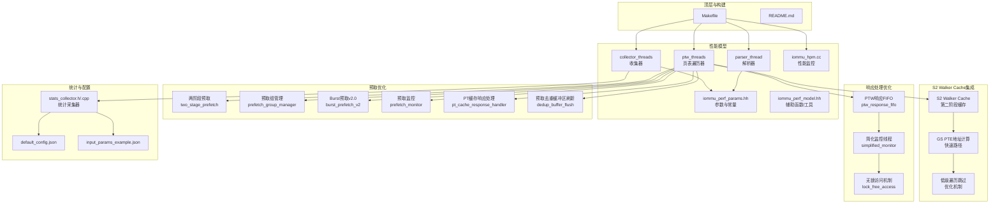

**图表来源**
- [Makefile:1-164](file://Makefile#L1-L164)
- [README.md:1-92](file://README.md#L1-L92)
- [iommu/iommu_perf_model/iommu_perf_params.hh:1-161](file://iommu/iommu_perf_model/iommu_perf_params.hh#L1-L161)
- [iommu/iommu_perf_model/iommu_perf_model.hh:1-197](file://iommu/iommu_perf_model/iommu_perf_model.hh#L1-L197)
- [iommu/iommu_perf_model/iommu_perf_parser.cc:1-123](file://iommu/iommu_perf_model/iommu_perf_parser.cc#L1-L123)
- [iommu/iommu_perf_model/iommu_perf_collector.cc:1-457](file://iommu/iommu_perf_model/iommu_perf_collector.cc#L1-L457)
- [iommu/iommu_perf_model/iommu_perf_ptw.cc:1-2369](file://iommu/iommu_perf_model/iommu_perf_ptw.cc#L1-L2369)
- [iommu/iommu_perf_model/iommu_perf_pt_cache_response.cc:1-100](file://iommu/iommu_perf_model/iommu_perf_pt_cache_response.cc#L1-L100)
- [iommu/iommu_perf_model/iommu_perf_pt_dedup_flush.cc:1-350](file://iommu/iommu_perf_model/iommu_perf_pt_dedup_flush.cc#L1-L350)
- [iommu/iommu_perf_model/iommu_hpm.cc:1-110](file://iommu/iommu_perf_model/iommu_hpm.cc#L1-L110)
- [iommu/iommu_top.hh:179-202](file://iommu/iommu_top.hh#L179-L202)

## 核心组件
- 参数与常量定义：集中于 iommu_perf_params.hh，涵盖 FIFO 深度、缓存规模与关联度、AXI 带宽与延迟、Walker Outstanding 限制、处理延迟、稳态采样窗口、系统参数等，是性能建模与调优的基础。
- 辅助函数与工具：iommu_perf_model.hh 提供 TTYP 分类、DDI 提取、VPN 提取、规范地址检查、裸模式页大小、MSI 地址判断、Guest 故障原因设置、MGPAW 计算、MSI 提取等，支撑解析与路由决策。
- 解析器线程：负责入站请求的快速分类、模式检查、DDI 提取与设备 ID 宽度校验，并将任务分发至收集器与缓存查询通道。
- 收集器线程：双线程协同，汇聚 DC/PC 缓存结果，执行上下文配置检查与路由决策；另一线程处理 xDTW 返回，更新缓存并继续后续路径。
- 页表遍历器（PTW）：经过重大优化，集成了S2 Walker Cache功能，支持Bare模式和AD_UPDATE路径的快速GS PTE地址计算。
- **新增**：S2 Walker Cache集成模块，专门处理第二阶段地址翻译的缓存查找和GS PTE地址快速计算。
- 性能监控：iommu_hpm.cc 提供基于事件选择器与过滤器的硬件性能计数器增量逻辑，支持按设备/进程/域 ID 精确或部分匹配过滤。
- 统计采集器：stats_collector 提供命中/未命中、替换、失效、预取命中率、执行/排队/请求延迟、阶段化时间戳、区间命中率、任务放大系数等多维度指标，支持直方图输出与统一报告。
- PT缓存响应处理器：专门处理PT缓存命中/缺失响应，支持占位CL处理和批量更新机制。
- 预取去重缓冲区刷新器：优化缓冲区刷新顺序，解决时序竞争问题，提升系统稳定性。

**章节来源**
- [iommu/iommu_perf_model/iommu_perf_params.hh:6-161](file://iommu/iommu_perf_model/iommu_perf_params.hh#L6-L161)
- [iommu/iommu_perf_model/iommu_perf_model.hh:7-197](file://iommu/iommu_perf_model/iommu_perf_model.hh#L7-L197)
- [iommu/iommu_perf_model/iommu_perf_parser.cc:9-123](file://iommu/iommu_perf_model/iommu_perf_parser.cc#L9-L123)
- [iommu/iommu_perf_model/iommu_perf_collector.cc:14-457](file://iommu/iommu_perf_model/iommu_perf_collector.cc#L14-L457)
- [iommu/iommu_perf_model/iommu_perf_ptw.cc:260-406](file://iommu/iommu_perf_model/iommu_perf_ptw.cc#L260-L406)
- [iommu/iommu_perf_model/iommu_perf_pt_cache_response.cc:20-100](file://iommu/iommu_perf_model/iommu_perf_pt_cache_response.cc#L20-L100)
- [iommu/iommu_perf_model/iommu_perf_pt_dedup_flush.cc:21-350](file://iommu/iommu_perf_model/iommu_perf_pt_dedup_flush.cc#L21-L350)
- [iommu/iommu_perf_model/iommu_hpm.cc:6-110](file://iommu/iommu_perf_model/iommu_hpm.cc#L6-L110)
- [iommu/cache_src/common/stats_collector.h:13-196](file://iommu/cache_src/common/stats_collector.h#L13-L196)
- [iommu/cache_src/common/stats_collector.cpp:107-640](file://iommu/cache_src/common/stats_collector.cpp#L107-L640)
- [iommu/iommu_top.hh:179-202](file://iommu/iommu_top.hh#L179-L202)

## 架构总览
性能模型遵循 SPEC v4 的线程划分与 FIFO 规范，形成"解析-收集-缓存-遍历-转发/故障"的流水线。经过最新优化，PTW响应处理采用了简化的FIFO机制替代复杂的共享映射，消除了锁竞争，提升了整体并发性能。解析器负责快速分流，收集器进行上下文配置与路由决策，缓存层（DC/PC/PT/MSIPT）与 Walker Cache 降低 DRAM 访问，PTW/MSIPTW 在命中缺失时发起非阻塞 DRAM 请求，最终由转发器与故障处理模块完成 DMA 转发与错误上报。

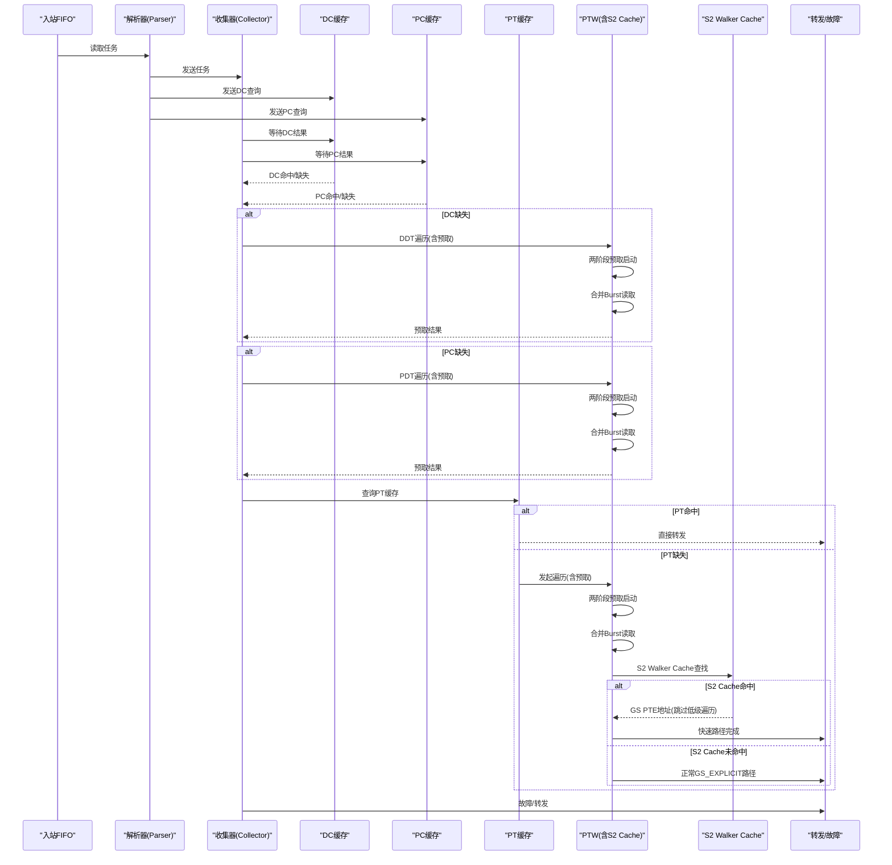

**图表来源**
- [iommu/iommu_perf_model/iommu_perf_parser.cc:9-123](file://iommu/iommu_perf_model/iommu_perf_parser.cc#L9-L123)
- [iommu/iommu_perf_model/iommu_perf_collector.cc:14-457](file://iommu/iommu_perf_model/iommu_perf_collector.cc#L14-L457)
- [iommu/iommu_perf_model/iommu_perf_ptw.cc:260-406](file://iommu/iommu_perf_model/iommu_perf_ptw.cc#L260-L406)
- [iommu/iommu_perf_model/iommu_perf_pt_cache_response.cc:20-100](file://iommu/iommu_perf_model/iommu_perf_pt_cache_response.cc#L20-L100)
- [iommu/iommu_perf_model/iommu_perf_pt_dedup_flush.cc:123-224](file://iommu/iommu_perf_model/iommu_perf_pt_dedup_flush.cc#L123-L224)
- [iommu/iommu_top.hh:179-182](file://iommu/iommu_top.hh#L179-L182)

## 详细组件分析

### 解析器（Parser）
- 职责：入站请求快速分类、模式检查（Off/Bare）、DDI 提取、设备 ID 宽度校验、派发到收集器与缓存查询。
- 关键点：全局 outstanding 反压、重排缓冲登记、状态机推进、错误路径直通故障 FIFO。
- 性能特征：解析阶段无串行延时，瓶颈由并发 outstanding 数与下游模块吞吐决定。

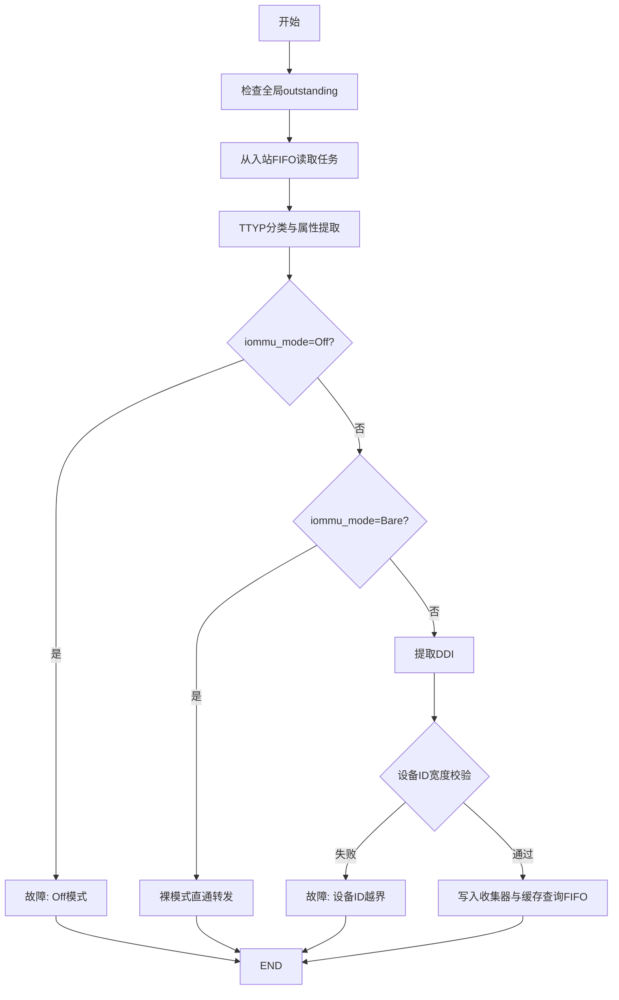

**图表来源**
- [iommu/iommu_perf_model/iommu_perf_parser.cc:9-123](file://iommu/iommu_perf_model/iommu_perf_parser.cc#L9-L123)

**章节来源**
- [iommu/iommu_perf_model/iommu_perf_parser.cc:9-123](file://iommu/iommu_perf_model/iommu_perf_parser.cc#L9-L123)

### 收集器（Collector，双线程）
- 线程1：汇聚解析器与缓存查询结果，匹配 pending_tasks，执行上下文配置检查与路由决策（DC/PC 缺失走 xDTW，命中则按策略配置 iosatp/iohgatp/SXL/SADE/GADE 并路由到 PT Cache 或转发）。
- 线程2：处理 xDTW 返回，更新 DC/PC 缓存，重复执行必要的检查步骤，再进入后续路径。
- 关键点：outstanding 上限控制、事件通知、状态机推进、故障路径。

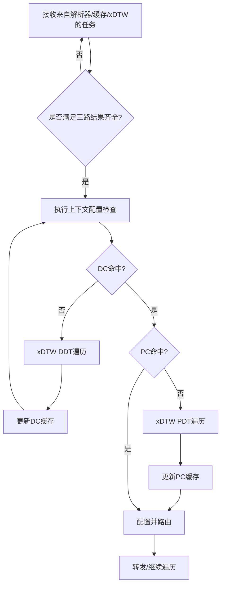

**图表来源**
- [iommu/iommu_perf_model/iommu_perf_collector.cc:14-457](file://iommu/iommu_perf_model/iommu_perf_collector.cc#L14-L457)

**章节来源**
- [iommu/iommu_perf_model/iommu_perf_collector.cc:14-457](file://iommu/iommu_perf_model/iommu_perf_collector.cc#L14-L457)

### 缓存与 Walker Cache
- 缓存参数：DC/PC/PT/MSIPT 缓存规模、关联度、行大小；Walker Cache（PTWc_1/2/3）在 PTW 中集成，支持散列与替换策略。
- **新增**：S2 Walker Cache专门用于第二阶段地址翻译，使用GPA作为查询键，支持三级缓存结构（PTWC_1/2/3）。
- 非阻塞 DRAM：通过 send_ddr_nb_read 与 ddr_nb_transport_bw 实现，使用 outstanding 表跟踪未完成请求。
- 失效机制：CQ 命令通过专用通道下发，PTW 优先处理失效命令，支持 IOTINVAL/VMA/DDT、IOFENCE.C、ATS.INVAL/PRGR 等。

**章节来源**
- [PERF_MODEL_IMPLEMENTATION.md:100-129](file://PERF_MODEL_IMPLEMENTATION.md#L100-L129)
- [PERF_MODEL_IMPLEMENTATION.md:114-118](file://PERF_MODEL_IMPLEMENTATION.md#L114-L118)
- [iommu/iommu_perf_model/iommu_perf_params.hh:53-121](file://iommu/iommu_perf_model/iommu_perf_params.hh#L53-L121)

### 性能监控（HPM）
- 支持事件选择器与过滤器（设备/进程/域 ID 精确或部分匹配），计数器按条件增量，溢出产生中断。
- 与统计采集器配合，可输出统一报告，便于定位热点与异常。

**章节来源**
- [iommu/iommu_perf_model/iommu_hpm.cc:6-110](file://iommu/iommu_perf_model/iommu_hpm.cc#L6-L110)

### 统计采集器（StatsCollector）
- 指标维度：总访问、命中、未命中、替换、失效、预取发出/命中、执行/排队/请求延迟、阶段化时间戳、区间命中率、任务放大系数等。
- 输出能力：摘要报告、延迟直方图、阶段窗口统计、IOPS 计算（基于执行时间而非请求总时间）。

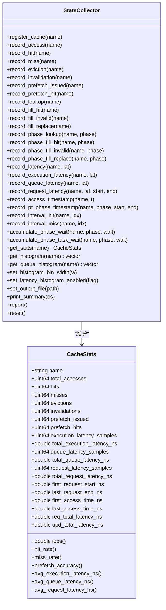

**图表来源**
- [iommu/cache_src/common/stats_collector.h:107-196](file://iommu/cache_src/common/stats_collector.h#L107-L196)
- [iommu/cache_src/common/stats_collector.cpp:107-640](file://iommu/cache_src/common/stats_collector.cpp#L107-L640)

**章节来源**
- [iommu/cache_src/common/stats_collector.h:13-196](file://iommu/cache_src/common/stats_collector.h#L13-L196)
- [iommu/cache_src/common/stats_collector.cpp:107-640](file://iommu/cache_src/common/stats_collector.cpp#L107-L640)

## S2 Walker Cache集成

### S2 Walker Cache架构设计
S2 Walker Cache是本次性能模型的重大增强，专门用于第二阶段地址翻译的缓存加速，通过缓存G-stage页表遍历结果来跳过低级页表访问。

#### 工作原理
1. **GPA作为查询键**：使用Guest Physical Address作为查询键，标识is_s2=true
2. **三级缓存结构**：支持PTWC_1/2/3三级缓存，对应gs_level=3/2/1的结果
3. **快速路径优化**：命中时直接从缓存获取GS PTE地址，跳过低级页表遍历
4. **独立存储空间**：使用独立的s2_cache_array_，不干扰普通Walker Cache

#### 实现细节
- **查询构造**：task_to_s2_walker_request函数创建S2 Walker Cache查询请求
- **路由键设置**：walker_addr_is_va=false, walker_from_two_stage=true, walker_sv48=true, walker_x4_mode=true
- **缓存更新**：根据s2_walker_hit_level决定更新哪些级别的缓存条目
- **数据格式**：walker_data_ptwc1/2/3包含有效的PPN和元数据

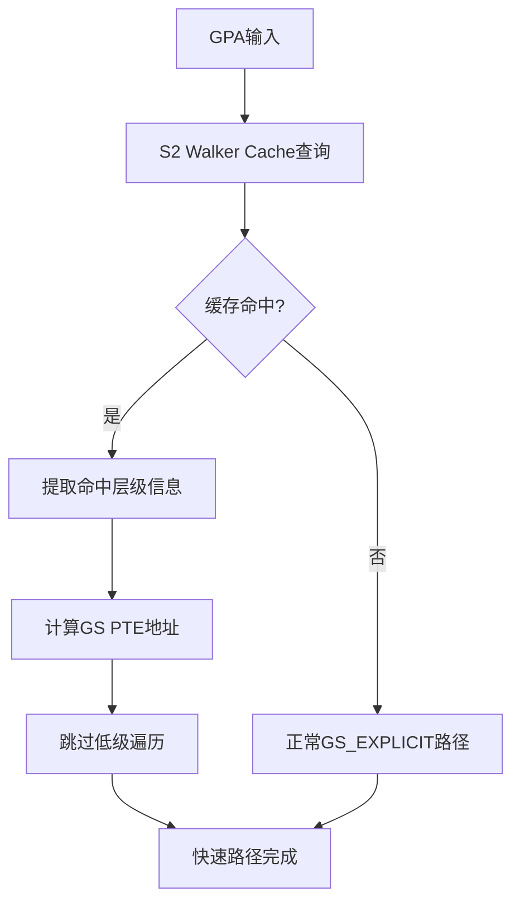

**图表来源**
- [iommu/iommu_perf_model/iommu_task_cache_convert.cc:526-549](file://iommu/iommu_perf_model/iommu_task_cache_convert.cc#L526-L549)
- [walker_cache.cpp:712-745](file://walker_cache.cpp#L712-L745)

**章节来源**
- [iommu/iommu_perf_model/iommu_task_cache_convert.cc:526-549](file://iommu/iommu_perf_model/iommu_task_cache_convert.cc#L526-L549)
- [walker_cache.cpp:712-745](file://walker_cache.cpp#L712-L745)

### Bare模式路径S2缓存查找
在Bare模式路径中，当GV=1且iohgatp.MODE!=IOHGATP_Bare时，系统在发起任何DDR请求之前执行S2 Walker Cache查找。

#### 查找流程
1. **条件检查**：验证PTW_WALKER_S2_CACHE_ENABLED和PTW_WALKER_CACHE_ENABLED标志
2. **请求构造**：使用task_to_s2_walker_request(task, task->gpa)创建查询请求
3. **缓存查询**：通过cache_sub.walker_request_fifo.write发送查询
4. **响应处理**：如果命中，设置walk_ctx.s2_walker_hit_level和gs_base_addr
5. **地址计算**：根据gs_vpn[gs_start_level]计算GS PTE地址

#### 性能优化
- **零额外DDR访问**：缓存命中时无需额外的DDR访问
- **跳过多级遍历**：根据命中层级跳过相应的页表遍历
- **立即执行**：在DDR请求之前执行，充分利用并行性

**章节来源**
- [iommu/iommu_perf_model/iommu_perf_ptw.cc:109-138](file://iommu/iommu_perf_model/iommu_perf_ptw.cc#L109-L138)

### AD_UPDATE路径S2缓存查找
在AD_UPDATE路径中，A/D位更新完成后，系统在执行GS_EXPLICIT之前同样进行S2 Walker Cache查找。

#### 处理流程
1. **A/D位更新完成**：确认AMO写操作已完成
2. **S2缓存查询**：使用相同的task_to_s2_walker_request接口
3. **命中处理**：设置gs_level、gs_base_addr和gs_pte_addr
4. **降级处理**：未命中时回退到正常的init_gstage_walk流程

#### 优势特性
- **一致性保证**：与Bare模式路径使用相同的缓存数据结构
- **透明切换**：对上层逻辑完全透明，自动选择最优路径
- **资源复用**：共享缓存空间，提高缓存利用率

**章节来源**
- [iommu/iommu_perf_model/iommu_perf_ptw.cc:1292-1320](file://iommu/iommu_perf_model/iommu_perf_ptw.cc#L1292-L1320)

## GS PTE地址计算优化

### 快速地址计算算法
GS PTE地址计算优化是S2 Walker Cache集成的核心功能，通过缓存的S2条目直接计算目标PTE地址，避免完整的多级页表遍历。

#### 计算公式
```
gs_start_level = GS_LEVELS - 1 - s2_resp.walker_level
gs_pte_addr = gs_base_addr + gs_vpn[gs_start_level] * 8
```

#### 参数说明
- **GS_LEVELS**：根据iohgatp.MODE确定的G-stage页表级别数
- **walker_level**：S2 Walker Cache命中的层级
- **gs_base_addr**：从缓存的next_ppn计算得到的页表基址
- **gs_vpn**：从GPA提取的虚拟页号字段

#### 实现优势
- **常数时间复杂度**：O(1)时间复杂度的地址计算
- **零内存访问**：无需访问内存即可得到目标地址
- **高精度定位**：精确定位到具体的PTE位置

**章节来源**
- [iommu/iommu_perf_model/iommu_perf_ptw.cc:123-128](file://iommu/iommu_perf_model/iommu_perf_ptw.cc#L123-L128)
- [iommu/iommu_perf_model/iommu_perf_ptw.cc:765-770](file://iommu/iommu_perf_model/iommu_perf_ptw.cc#L765-L770)

### 低级遍历跳过机制
S2 Walker Cache通过缓存不同层级的遍历结果，实现了灵活的跳过机制，根据命中层级动态调整需要执行的遍历深度。

#### 跳过策略
- **Level 3命中**：跳过所有低级遍历，直接访问叶子节点
- **Level 2命中**：跳过Level 1遍历，直接访问Level 0
- **Level 1命中**：跳过Level 0遍历，直接访问目标PTE

#### 状态管理
- **gs_level**：记录当前需要处理的页表级别
- **gs_base_addr**：保存当前页表的基址
- **gs_vpn**：保存各层级的VPN字段

**章节来源**
- [iommu/iommu_perf_model/iommu_perf_ptw.cc:124-125](file://iommu/iommu_perf_model/iommu_perf_ptw.cc#L124-L125)
- [iommu/iommu_perf_model/iommu_perf_ptw.cc:766-767](file://iommu/iommu_perf_model/iommu_perf_ptw.cc#L766-L767)

## 两阶段预取优化

### 两阶段预取优化
两阶段预取是本次性能模型的重大增强，通过在Walker Cache命中时提前spawn预取任务，实现与主任务DDR访问的完全并发。

#### 工作原理
1. **早期spawn机制**：当Walker Cache命中且处于L3级别时，系统立即为预取深度D生成D个预取任务
2. **并行DDR访问**：预取任务与主任务的5次DDR访问同时进行，最大化带宽利用率
3. **VS L0 PTE直接读取**：预取任务直接读取VS L0 PTE，跳过GS_IMPLICIT阶段，减少额外开销

#### 实现细节
- 预取任务ID生成：使用独立的task_id分配机制
- 上下文复制：预取任务继承主任务的iosatp、iohgatp、设备ID等配置
- 直接地址计算：通过vs_l0_spa_ppn和vpn[0]计算VS L0 PTE地址
- 并发调度：预取任务立即发送DDR请求，与主任务并发执行

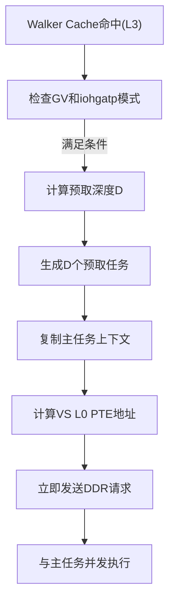

**图表来源**
- [iommu/iommu_perf_model/iommu_perf_ptw.cc:282-377](file://iommu/iommu_perf_model/iommu_perf_ptw.cc#L282-L377)

**章节来源**
- [iommu/iommu_perf_model/iommu_perf_ptw.cc:260-406](file://iommu/iommu_perf_model/iommu_perf_ptw.cc#L260-L406)
- [iommu/include/iommu_task.hh:107-180](file://iommu/include/iommu_task.hh#L107-180)

## 预取组管理

### 预取组状态追踪
预取组管理机制经过重大优化，移除了复杂的共享映射机制，采用简化的状态追踪方式。

#### 数据结构
- **PrefetchGroupState**：包含主任务指针、待完成任务数、总任务数、完成标志等
- **预取结果收集**：支持最多17个任务的结果收集（1个主任务 + 16个预取）
- **IOVA列表**：跟踪组内所有任务的IOVA地址

#### 优化后的状态管理
- **pending_tasks**：初始值为D，每个预取任务完成后递减
- **main_task_done**：主任务walk完成后设置
- **completed**：当pending_tasks==0且main_task_done==true时设置
- **无锁访问**：通过FIFO顺序保证，消除了复杂的互斥锁保护

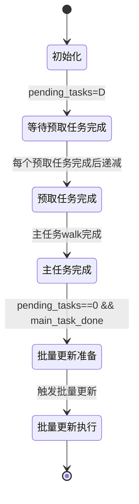

**图表来源**
- [iommu/iommu_perf_model/iommu_perf_ptw.cc:1191-1253](file://iommu/iommu_perf_model/iommu_perf_ptw.cc#L1191-L1253)

**章节来源**
- [iommu/iommu_perf_model/iommu_perf_ptw.cc:1188-1253](file://iommu/iommu_perf_model/iommu_perf_ptw.cc#L1188-L1253)
- [iommu/iommu_top.hh:184-202](file://iommu/iommu_top.hh#L184-L202)

## Burst预取v2.0

### 合并读取优化
Burst预取v2.0通过合并主任务叶子节点读取和预取读取，显著减少DDR访问次数。

#### 工作机制
1. **合并读取**：当Walker Cache命中时，系统检测是否可以进行合并读取
2. **Burst参数计算**：计算从叶子PTE开始的连续D个PTE的读取范围
3. **边界检查**：确保Burst不会跨越4KB页表页边界
4. **截断处理**：如果跨越边界，则截断到页边界内

#### 实现细节
- **起始地址计算**：burst_start_addr = leaf_pt_base + (current_vpn0 + 1) * ptesize
- **大小计算**：burst_size = prefetch_depth * ptesize
- **边界对齐**：根据页表页掩码进行边界检查和截断

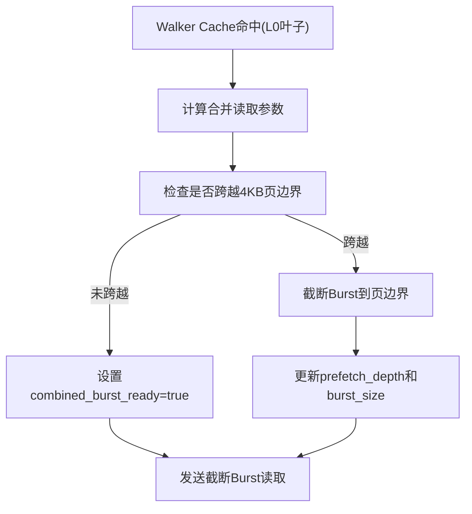

**图表来源**
- [iommu/iommu_perf_model/iommu_perf_ptw.cc:1451-1586](file://iommu/iommu_perf_model/iommu_perf_ptw.cc#L1451-L1586)

**章节来源**
- [iommu/iommu_perf_model/iommu_perf_ptw.cc:1451-1586](file://iommu/iommu_perf_model/iommu_perf_ptw.cc#L1451-L1586)

## PTW响应处理优化

### 架构重构概述
PTW响应处理机制经历了重大重构，移除了复杂的共享映射机制（pt_iova_pa_map）和相关互斥锁保护，采用简化的FIFO响应处理架构。

#### 重构设计
- **单一PTW响应FIFO**：所有PTW完成的任务统一写入ptw_response_fifo
- **顺序处理保证**：严格按照FIFO顺序处理响应，确保PT Cache更新顺序
- **消除复杂状态管理**：不再需要prefetch_groups map和复杂的pending_tasks管理
- **无锁访问**：通过FIFO的顺序性保证，消除了锁竞争

#### 性能改进
- **内存占用**：从O(N×680B)降至O(N×8B)，显著降低内存开销
- **时间复杂度**：从O(N)遍历降至O(1)读取，提升处理效率
- **锁竞争消除**：完全移除prefetch_group_mtx锁竞争
- **代码简化**：从110行复杂逻辑简化至30行清晰实现

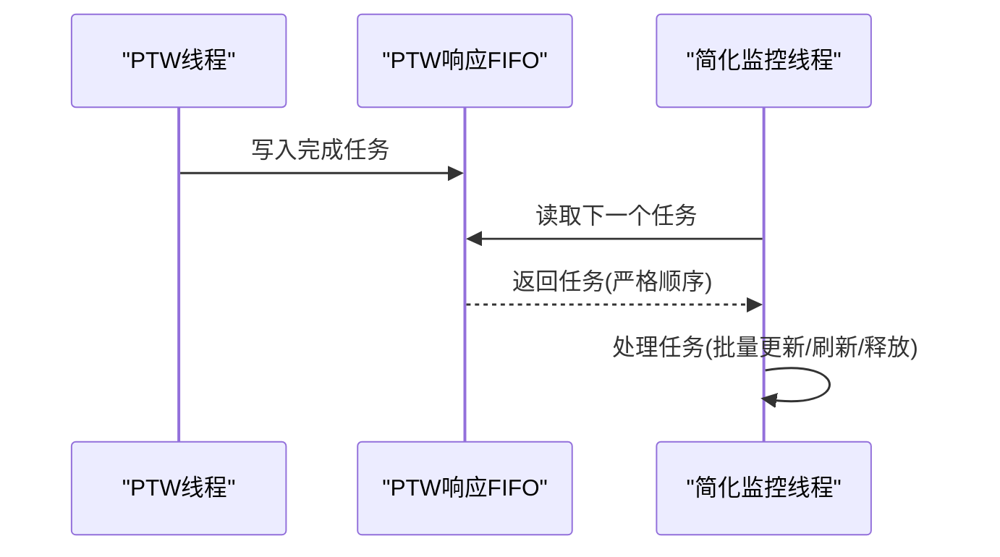

**图表来源**
- [iommu/iommu_top.hh:179-182](file://iommu/iommu_top.hh#L179-L182)

**章节来源**
- [iommu/iommu_top.hh:179-202](file://iommu/iommu_top.hh#L179-L202)

### 简化监控线程实现
新的监控线程实现大幅简化了原有的复杂逻辑，专注于顺序处理和资源管理。

#### 核心功能
- **事件驱动**：通过ptw_response_event监听新任务到达
- **顺序处理**：严格按FIFO顺序处理每个任务
- **资源清理**：自动管理任务生命周期和内存释放
- **批量操作**：支持批量PT Cache更新和缓冲区刷新

#### 实现优势
- **低延迟**：O(1)时间复杂度的任务获取
- **高吞吐**：无锁设计支持高并发处理
- **易维护**：清晰的代码结构和逻辑流程
- **可扩展**：易于添加新的处理逻辑

**章节来源**
- [iommu/iommu_top.hh:179-182](file://iommu/iommu_top.hh#L179-L182)

## 预取监控与调度

### 监控机制重构
原有的多线程监控机制被重构为单一响应队列处理，提高了处理效率和顺序保证。

#### 重构设计
- **单一PTW响应FIFO**：所有PTW完成的任务统一写入FIFO
- **顺序处理**：严格按照FIFO顺序处理响应，保证PT Cache更新顺序
- **移除复杂状态管理**：不再需要prefetch_groups map和复杂的pending_tasks管理

#### 性能改进
- **内存占用**：从O(N×680B)降至O(N×8B)
- **时间复杂度**：从O(N)遍历降至O(1)读取
- **锁竞争**：消除prefetch_group_mtx锁竞争
- **代码复杂度**：从110行简化至30行


**图表来源**
- [iommu/iommu_top.hh:179-182](file://iommu/iommu_top.hh#L179-L182)

**章节来源**
- [PTW_MONITOR_ANALYSIS_20260609.md:1-377](file://PTW_MONITOR_ANALYSIS_20260609.md#L1-L377)
- [iommu/iommu_top.hh:179-202](file://iommu/iommu_top.hh#L179-L202)

## PT缓存响应处理优化

### 预取占位CL处理机制
PT缓存响应处理器专门处理预取占位CL（placeholder CL）和常规CL的不同响应路径，确保预取任务的正确处理。

#### 处理流程
1. **命中常规CL**：直接转发到Forwarder，无需额外处理
2. **命中占位CL**：任务已在execute_pt_request中挂接到Buffer，这里只记录日志，不发PTW，等待Monitor处理
3. **缺失响应**：占位CL已在execute_pt_request中插入，任务已挂接到Buffer，这里发送PTW请求，触发PTW walk + Burst预取

#### 优化特性
- **占位CL状态管理**：区分is_ph标志位，正确处理预取占位CL和主任务占位CL
- **缓冲区链表处理**：预取占位CL不涉及Buffer链表处理，主任务占位CL需要后续刷新
- **任务生命周期管理**：不能删除任务，Monitor会flush Buffer并转发任务

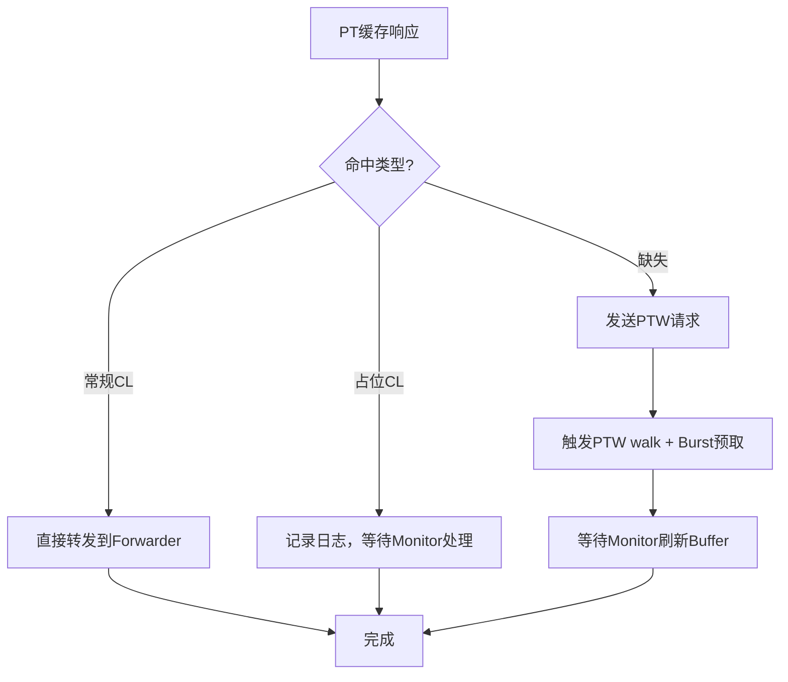

**图表来源**
- [iommu/iommu_perf_model/iommu_perf_pt_cache_response.cc:20-100](file://iommu/iommu_perf_model/iommu_perf_pt_cache_response.cc#L20-L100)

**章节来源**
- [iommu/iommu_perf_model/iommu_perf_pt_cache_response.cc:20-100](file://iommu/iommu_perf_model/iommu_perf_pt_cache_response.cc#L20-L100)

### 批量更新机制
PT缓存批量更新机制支持一次性更新多个PT Cache条目，显著提升更新效率。

#### 批量更新流程
1. **收集更新数据**：从预取组状态中收集所有任务的PT数据
2. **状态转换**：将占位CL转换为常规CL（is_ph: 1→0）
3. **批量写入**：通过pt_update_fifo一次性写入所有更新
4. **异步处理**：避免锁竞争，提升系统吞吐量

#### 实现细节
- **IOVA→PA映射存储**：在批量更新前存储IOVA到PA的映射关系
- **阶段跟踪**：使用phase_tracker记录批量更新过程
- **无锁写入**：释放mutex后再写pt_update_fifo，避免死锁

**章节来源**
- [iommu/iommu_perf_model/iommu_perf_ptw.cc:1847-2022](file://iommu/iommu_perf_model/iommu_perf_ptw.cc#L1847-L2022)

## 预取去重缓冲区刷新优化

### 缓冲区刷新顺序优化
预取去重缓冲区刷新器优化了缓冲区刷新顺序，解决了时序竞争问题，提升了系统稳定性。

#### 核心优化
1. **先释放后转发**：在FIFO写入之前先释放Buffer Entry，确保即使FIFO阻塞，其他等待分配entry的任务也能立即使用
2. **缓冲区链表遍历**：从head_index开始遍历Buffer链表，逐个处理挂起任务
3. **PA计算优化**：使用main_task->walk_ctx.pt_updates访问PTE数据，支持单阶段和两阶段翻译

#### 实现细节
- **错误处理**：检查dedup_buffer_是否为空，避免空指针访问
- **任务状态设置**：将处理后的任务状态设置为TASK_PTW_DONE
- **缓冲区清理**：释放所有匹配的Buffer Entry，避免内存泄漏

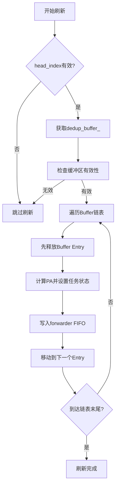

**图表来源**
- [iommu/iommu_perf_model/iommu_perf_pt_dedup_flush.cc:123-224](file://iommu/iommu_perf_model/iommu_perf_pt_dedup_flush.cc#L123-L224)

**章节来源**
- [iommu/iommu_perf_model/iommu_perf_pt_dedup_flush.cc:123-224](file://iommu/iommu_perf_model/iommu_perf_pt_dedup_flush.cc#L123-L224)

### IOVA扫描刷新机制
除了基于Buffer链表的刷新外，还提供了基于IOVA扫描的刷新机制，用于处理时序竞争问题。

#### 扫描刷新流程
1. **IOVA匹配扫描**：扫描整个Dedup Buffer，找到所有匹配target_iova的有效entry
2. **预取任务识别**：区分预取任务和普通挂起任务，预取任务直接释放
3. **PA计算与转发**：为普通挂起任务计算PA并转发到forwarder
4. **缓冲区清理**：释放所有匹配的Buffer Entry

#### 优势特性
- **无锁竞争**：不依赖Buffer链指针，避免时序竞争
- **完整性保证**：通过IOVA匹配确保所有相关任务都被处理
- **灵活性**：适用于不同的预取场景和任务类型

**章节来源**
- [iommu/iommu_perf_model/iommu_perf_pt_dedup_flush.cc:247-350](file://iommu/iommu_perf_model/iommu_perf_pt_dedup_flush.cc#L247-L350)

## 内存优化分析

### 共享映射机制移除
PTW性能模型的重大优化之一是移除了复杂的共享映射机制（pt_iova_pa_map）和相关互斥锁保护。

#### 原实现问题
- **高内存开销**：pt_iova_pa_map需要存储大量IOVA到PA的映射关系
- **锁竞争严重**：频繁的互斥锁操作导致性能瓶颈
- **复杂性高**：复杂的映射管理和同步逻辑增加了维护难度

#### 新实现优势
- **内存节省**：通过FIFO顺序处理，消除了对共享映射的需求
- **无锁设计**：利用FIFO的顺序性保证，完全消除了锁竞争
- **代码简化**：减少了约680B每组的内存开销，显著降低了内存使用

#### 性能影响
- **内存占用降低**：从O(N×680B)降至O(N×8B)
- **CPU利用率提升**：消除了锁竞争导致的CPU浪费
- **延迟降低**：减少了锁操作带来的额外延迟

**章节来源**
- [iommu/iommu_top.hh:179-202](file://iommu/iommu_top.hh#L179-L202)
- [iommu/iommu_perf_model/iommu_perf_ptw.cc:1847-2022](file://iommu/iommu_perf_model/iommu_perf_ptw.cc#L1847-L2022)

### 并发访问保护机制消除
通过架构重构，系统消除了大部分并发访问保护机制，提升了整体性能。

#### 消除的保护机制
- **prefetch_group_mtx**：预取组互斥锁完全移除
- **pt_iova_pa_map保护**：共享映射的锁保护不再需要
- **复杂的同步逻辑**：简化了任务间的同步机制

#### 替代方案
- **FIFO顺序保证**：利用SystemC FIFO的顺序性保证
- **事件驱动处理**：通过事件机制协调各组件
- **无锁数据结构**：采用更适合并发场景的数据结构

**章节来源**
- [iommu/iommu_top.hh:179-202](file://iommu/iommu_top.hh#L179-L202)

## 性能统计与分析

### 预取性能指标
新增的预取优化带来了丰富的性能统计指标，用于深入分析预取效果。

#### 关键指标
- **预取深度(D)**：预取任务数量，影响预取效果和内存占用
- **预取命中率**：预取结果被后续访问命中的比例
- **Burst命中率**：合并读取成功的比例
- **两阶段预取成功率**：Walker Cache命中时成功启用两阶段预取的比例
- **预取任务并发度**：预取任务与主任务并发执行的比例
- **缓冲区刷新效率**：缓冲区刷新操作的吞吐量和延迟
- **响应处理延迟**：PTW响应FIFO的处理延迟
- **内存优化收益**：共享映射移除带来的内存节省
- **S2缓存命中率**：S2 Walker Cache的命中率和平均跳过级别
- **GS PTE计算延迟**：快速地址计算的延迟统计

#### 统计收集
- **预取组统计**：跟踪每个预取组的完成时间和资源消耗
- **Burst统计**：记录Burst读取的大小、成功率和截断情况
- **两阶段预取统计**：记录早期spawn的触发条件和效果
- **缓冲区统计**：记录缓冲区分配、释放和刷新的性能指标
- **响应处理统计**：监控PTW响应FIFO的处理效率和延迟
- **内存使用统计**：跟踪优化前后的内存使用情况对比
- **S2缓存统计**：记录S2 Walker Cache的命中/未命中情况和性能收益

**章节来源**
- [iommu/iommu_perf_model/iommu_perf_ptw.cc:1188-1253](file://iommu/iommu_perf_model/iommu_perf_ptw.cc#L1188-L1253)
- [iommu/iommu_perf_model/iommu_perf_ptw.cc:1451-1586](file://iommu/iommu_perf_model/iommu_perf_ptw.cc#L1451-L1586)
- [tmp/prefetch_timing.sh:1-76](file://tmp/prefetch_timing.sh#L1-L76)

## 依赖关系分析
- 构建依赖：Makefile 统一编译 iommu_perf_model 与缓存、替换、统计模块，顶层链接生成可执行文件。
- 运行环境：SystemC 2.3.x、GCC/G++、WSL（Linux 环境）。
- 参数耦合：FIFO 深度、缓存规模、AXI 带宽、outstanding 上限与处理延迟共同决定吞吐与延迟权衡。
- 预取依赖：两阶段预取依赖Walker Cache命中，Burst预取依赖页表布局和边界对齐。
- 缓存依赖：PT缓存响应处理依赖CacheSubsystem的pt_cache()接口，缓冲区刷新依赖dedup_buffer_。
- **新增**：S2 Walker Cache依赖walker_cache模块的S2缓存实现，通过独立的s2_cache_array_存储。
- **新增**：响应处理依赖FIFO的顺序性和事件机制，消除了对复杂共享状态的依赖。

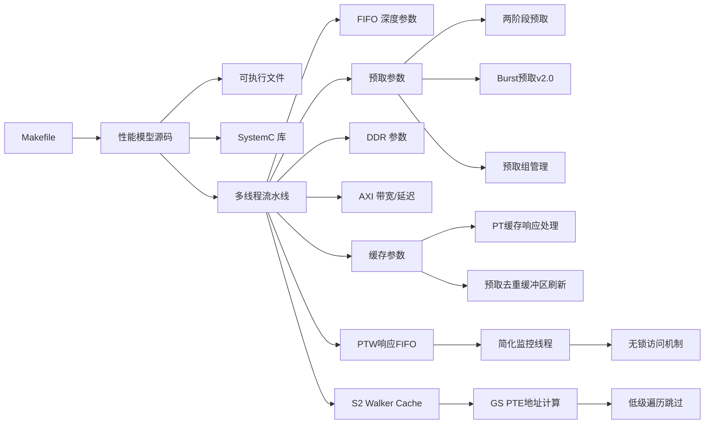

**图表来源**
- [Makefile:16-36](file://Makefile#L16-L36)
- [Makefile:52-94](file://Makefile#L52-L94)
- [iommu/iommu_perf_model/iommu_perf_params.hh:6-161](file://iommu/iommu_perf_model/iommu_perf_params.hh#L6-L161)
- [iommu/iommu_top.hh:179-202](file://iommu/iommu_top.hh#L179-L202)

**章节来源**
- [Makefile:16-36](file://Makefile#L16-L36)
- [Makefile:52-94](file://Makefile#L52-L94)

## 性能考量
- 缓存参数影响
  - DC/PC/PT/MSIPT 缓存容量与关联度直接影响命中率与替换开销。增大容量可提升命中率，但可能增加替换与查找延迟；提高关联度可降低冲突，但增加比较与更新成本。
  - Walker Cache（PTWc_1/2/3）在 Sv48 等长 VPN 场景显著降低 PTW 访问次数，建议启用并合理配置条目数与替换策略。
  - **新增**：S2 Walker Cache参数需要在S2缓存命中率和内存占用之间找到平衡点，三级缓存结构提供了灵活的配置选项。
- 流水线参数
  - FIFO 深度决定背压与吞吐，过浅导致阻塞，过深增加排队延迟与内存占用。应结合上游/下游处理延迟与并发度调整。
  - 处理延迟（Parser/Collector/Cache/XDTW/PTW/Forwarder）直接影响关键链路瓶颈，应通过参数与实现优化平衡。
- 系统参数
  - AXI 带宽与延迟、最大 outstanding 数、全局 outstanding 上限、端口并发限制共同决定总吞吐与延迟预算。
  - 稳态采样窗口（跳过首尾 10%）有助于获得更稳定的 IOPS 与延迟估计。
- 预取参数优化
  - **预取深度(D)**：需要在预取效果和内存占用之间找到平衡点
  - **两阶段预取阈值**：根据Walker Cache命中率动态调整启用条件
  - **Burst大小**：根据页表布局和访问模式优化Burst大小
  - **缓冲区大小**：根据预取负载和并发度调整缓冲区容量
- PT缓存优化
  - **批量更新策略**：合理设置批量更新的触发条件和更新数量
  - **占位CL管理**：优化占位CL到常规CL的转换时机和方式
  - **响应处理优化**：提升PT缓存响应处理的吞吐量和延迟表现
- **新增**：S2 Walker Cache优化
  - **缓存大小配置**：根据G-stage页表规模和访问模式调整S2缓存容量
  - **替换策略选择**：选择合适的替换策略以最大化S2缓存命中率
  - **GS级别优化**：针对常见的GS_LEVELS值优化缓存布局
- **新增**：响应处理优化
  - **FIFO深度**：PTW响应FIFO的深度需要根据PTW任务完成速率调整
  - **监控线程优先级**：监控线程的调度优先级影响响应处理的实时性
  - **内存优化收益**：共享映射移除带来的内存节省可用于其他性能优化

**章节来源**
- [iommu/iommu_perf_model/iommu_perf_params.hh:6-161](file://iommu/iommu_perf_model/iommu_perf_params.hh#L6-L161)
- [PERF_MODEL_IMPLEMENTATION.md:105-129](file://PERF_MODEL_IMPLEMENTATION.md#L105-L129)
- [iommu/iommu_top.hh:179-202](file://iommu/iommu_top.hh#L179-L202)

## 故障排查指南
- 编译与运行
  - 使用提供的编译脚本或 Makefile，确保 SystemC 安装路径正确，WSL 环境满足要求。
- 功能验证
  - 按模块验证：Parser 路由正确性、DC/PC 缓存命中/未命中路径、xDTW 正确性、PT Cache 命中/未命中、PTW 命中率、MSIPT Cache 翻译。
  - **新增**：验证S2 Walker Cache的查询和更新功能、GS PTE地址计算的正确性、Bare模式和AD_UPDATE路径的快速路径处理。
  - **新增**：验证两阶段预取的早期spawn功能、Burst合并读取的边界处理、预取组的批量更新功能、PT缓存响应处理的占位CL处理、去重缓冲区刷新的时序竞争解决、PTW响应FIFO的顺序处理。
- 性能验证
  - 关注 Walker Cache 命中率、DDR 访问次数下降、并发处理能力提升。
  - **新增**：验证S2 Walker Cache命中率、GS PTE计算延迟、低级遍历跳过效果、预取深度对性能的影响、Burst命中率、两阶段预取的成功率、缓冲区刷新效率、PTW响应处理延迟、内存优化收益。
- 统计输出
  - 通过 StatsCollector 的摘要报告与直方图定位异常延迟分布；利用阶段化时间戳与 IOPS 计算核对执行时间与排队时间占比。
  - **新增**：分析预取相关的统计指标，如预取命中率、Burst成功率、缓冲区刷新效率、响应处理延迟、内存使用情况等；重点关注S2缓存命中率、GS级别跳过统计、快速路径使用频率等关键指标。
- HPM 对齐
  - 将 HPM 事件与统计口径对齐，确认过滤条件与计数逻辑一致。
- 预取问题诊断
  - **占位CL未更新**：检查PT Cache中的占位CL状态，确保is_ph标志位正确转换
  - **缓冲区刷新失败**：验证Buffer链表的head_index和next_index指针是否正确
  - **时序竞争问题**：检查IOVA扫描刷新机制是否正确处理预取任务和普通任务
  - **批量更新异常**：确认pt_update_fifo的可用性和批量更新的完整性
- **新增**：S2 Walker Cache问题诊断
  - **缓存未命中**：检查S2 Walker Cache的配置参数和缓存大小设置
  - **地址计算错误**：验证gs_vpn提取和gs_start_level计算的正确性
  - **缓存更新异常**：确认s2_walker_hit_level和walker_update_kind的设置逻辑
  - **性能退化**：对比启用/禁用S2缓存的性能差异，确认优化效果
- **新增**：响应处理问题诊断
  - **FIFO阻塞**：检查PTW响应FIFO的深度设置和处理速率是否匹配
  - **顺序错乱**：验证FIFO的顺序性保证和监控线程的处理逻辑
  - **内存泄漏**：监控共享映射移除后的内存使用情况，确保没有意外的内存增长
  - **性能退化**：对比优化前后的性能指标，确认优化效果符合预期
- **新增**：PTW预取系统关键并发修复
  - **pending_tasks计数器下溢**：检查group.pending_tasks > 0的条件判断，防止负数下溢
  - **主任务故障处理**：验证main_task_done标志和has_fault标志的正确设置
  - **监控线程重通知**：确认event丢失检测和重新通知机制的正常工作
  - **两阶段预取修复**：检查非early-spawn任务的is_two_stage_prefetch标志处理

**章节来源**
- [README.md:17-92](file://README.md#L17-L92)
- [PERF_MODEL_IMPLEMENTATION.md:159-179](file://PERF_MODEL_IMPLEMENTATION.md#L159-L179)
- [iommu/iommu_perf_model/iommu_hpm.cc:6-110](file://iommu/iommu_perf_model/iommu_hpm.cc#L6-L110)
- [iommu/cache_src/common/stats_collector.cpp:227-538](file://iommu/cache_src/common/stats_collector.cpp#L227-538)
- [TEST_REPORT_PHASE1_20260609.md:141-206](file://TEST_REPORT_PHASE1_20260609.md#L141-L206)
- [iommu/iommu_top.hh:179-202](file://iommu/iommu_top.hh#L179-L202)

## 结论
该 IOMMU 性能模型以 SPEC v4 为准绳，采用多线程流水线与非阻塞 DRAM 访问，结合缓存与 Walker Cache 有效降低 DRAM 延迟与访问频次。本次重大更新引入的S2 Walker Cache集成和GS PTE地址计算优化，通过在Bare模式路径和AD_UPDATE路径中实现快速GS PTE地址计算和低级页表遍历跳过，显著提升了两阶段地址翻译的性能表现。新的S2缓存机制不仅减少了不必要的DDR访问，还通过灵活的低级遍历跳过策略进一步优化了翻译延迟。通过参数化配置与统计采集器，能够对关键路径进行精细化性能度量与调优。建议在不同负载场景下迭代调整缓存规模、FIFO 深度与 AXI 带宽，结合 HPM 与统计报告持续优化系统瓶颈。

## 附录
- 配置文件
  - default_config.json 与 input_params_example.json 提供缓存时序、替换策略、统计输出等配置示例，便于快速上手与对比实验。
- 基准测试方法与标准
  - 建议采用多种测试场景（随机/顺序、不同页表模式、不同并发度），记录稳态期 IOPS、平均/排队/执行延迟、命中率与预取命中率、任务放大系数与直方图分布，作为性能基线与回归依据。
  - **新增**：针对S2 Walker Cache集成的专项测试，包括S2缓存命中率测试、GS PTE计算延迟测量、低级遍历跳过效果验证、Bare模式和AD_UPDATE路径性能对比。
- 实际分析案例与优化效果
  - 可结合仓库内的分析文档（如 Walker Cache 集成计划、PT Cache 去重与预取方案、响应分析、去重缓冲区刷新分析等）开展案例研究，逐步验证参数调优带来的收益。
  - **新增**：S2 Walker Cache集成的效果分析、GS PTE地址计算优化的性能收益评估、低级遍历跳过的延迟改善量化、快速路径使用频率统计。
- 预取单元测试
  - test_dedup_prefetch_unit.cpp 提供了去重缓冲区的单元测试，包括Buffer分配顺序、链表挂接、批量更新等功能的验证，有助于理解预取机制的核心实现。
- **新增**：S2 Walker Cache测试用例
  - 包含S2缓存查询和更新的基本功能测试、GS PTE地址计算的正确性验证、不同GS_LEVELS下的性能测试、缓存命中率统计分析等。

**章节来源**
- [iommu/cache_config/default_config.json:1-69](file://iommu/cache_config/default_config.json#L1-L69)
- [iommu/cache_config/input_params_example.json:1-69](file://iommu/cache_config/input_params_example.json#L1-L69)
- [PERF_MODEL_IMPLEMENTATION.md:1-227](file://PERF_MODEL_IMPLEMENTATION.md#L1-L227)
- [test_dedup_prefetch_unit.cpp:1-200](file://test_dedup_prefetch_unit.cpp#L1-L200)
- [PT_DEDUP_PREFETCH_FINAL_SCHEME.md:18-115](file://PT_DEDUP_PREFETCH_FINAL_SCHEME.md#L18-L115)
- [iommu/iommu_top.hh:179-202](file://iommu/iommu_top.hh#L179-L202)