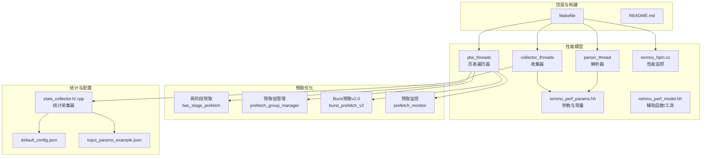
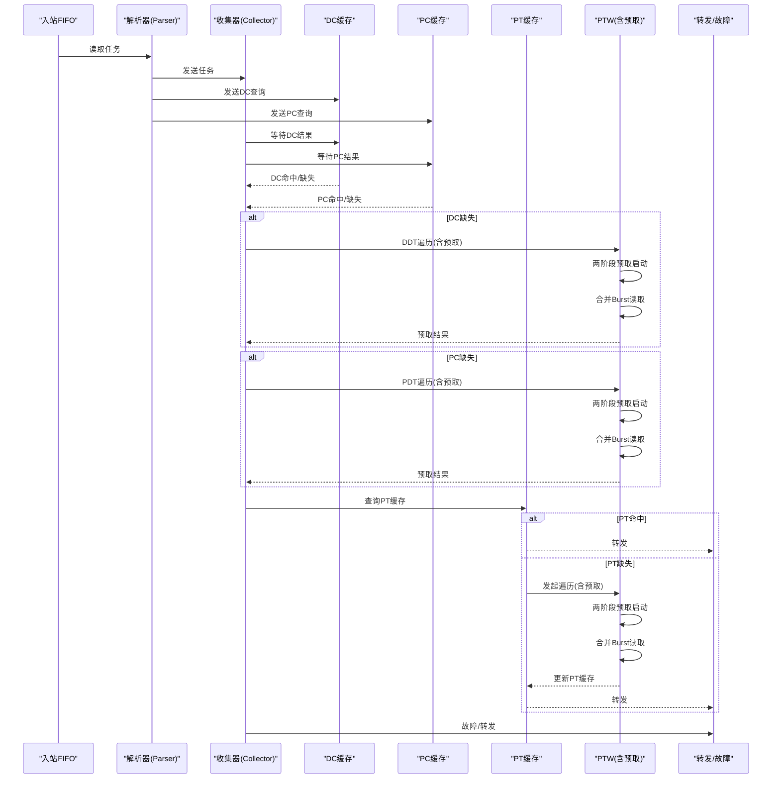
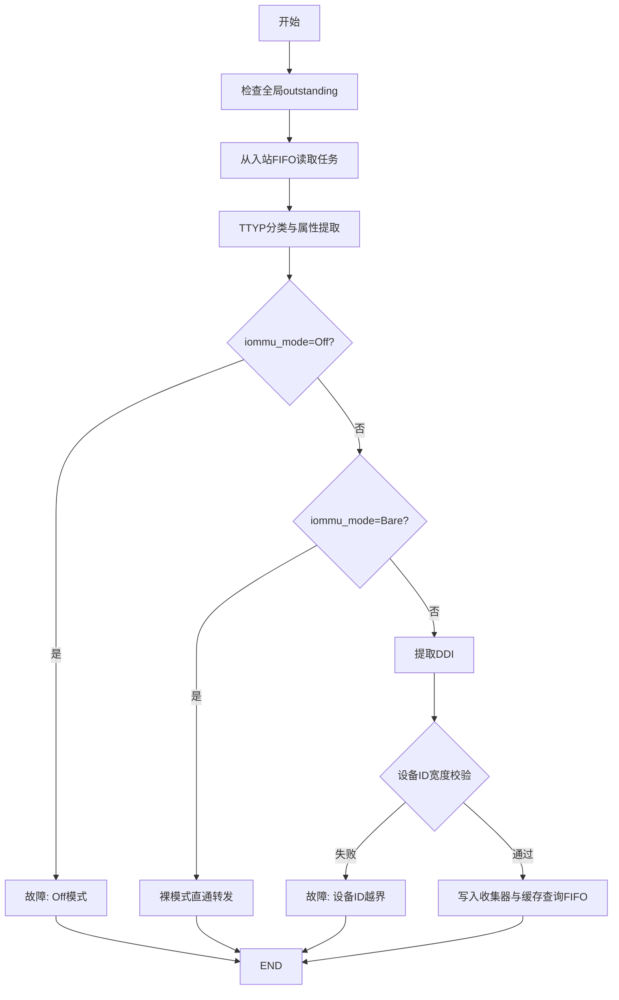
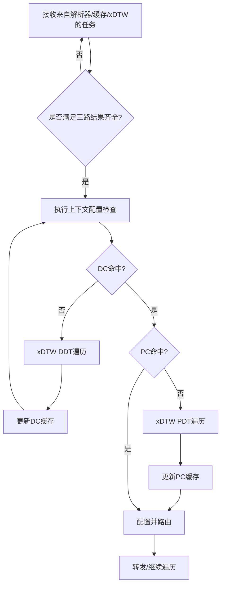
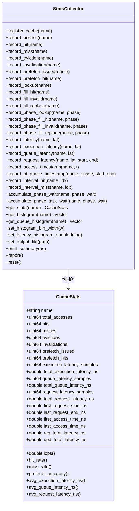
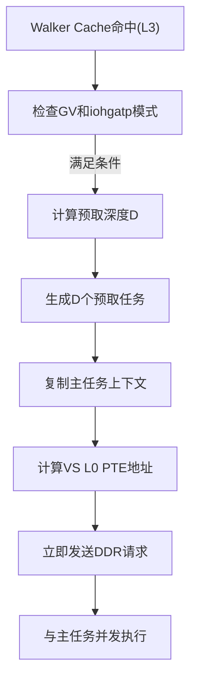
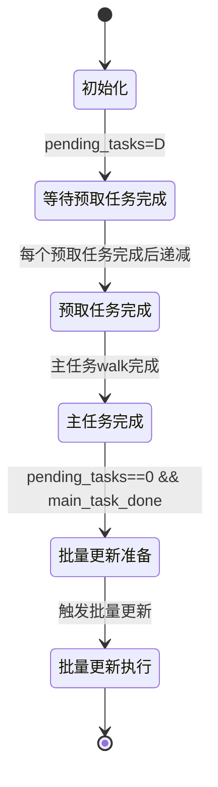
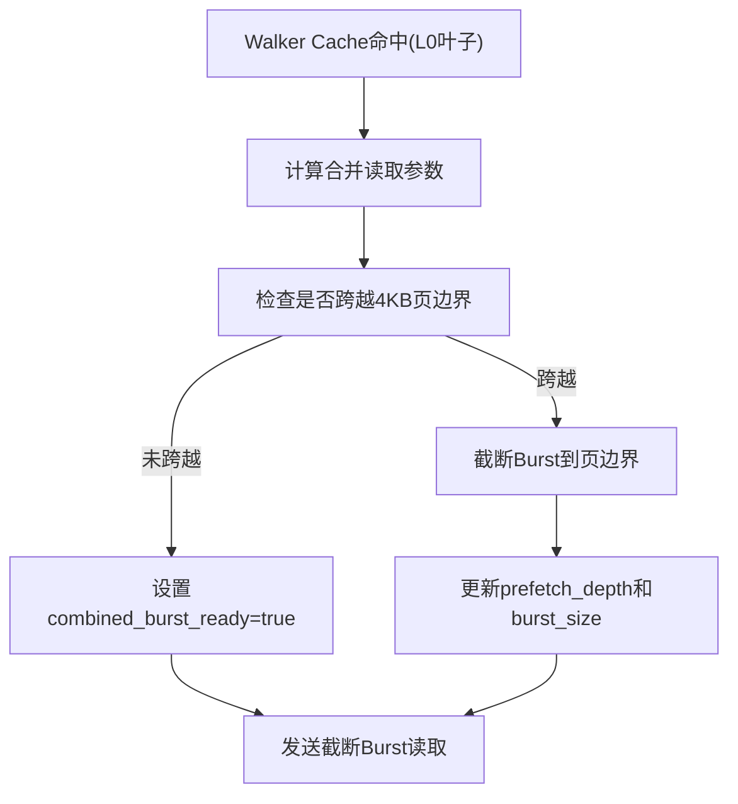
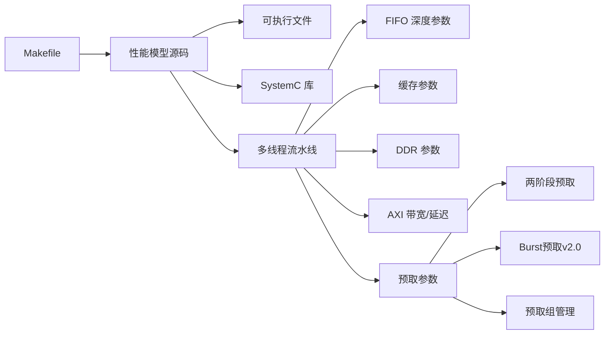

# 性能模型

<cite>
**本文档引用的文件**
- [README.md](file://README.md)
- [PERF_MODEL_IMPLEMENTATION.md](file://PERF_MODEL_IMPLEMENTATION.md)
- [Makefile](file://Makefile)
- [iommu/iommu_perf_model/iommu_perf_params.hh](file://iommu/iommu_perf_model/iommu_perf_params.hh)
- [iommu/iommu_perf_model/iommu_perf_model.hh](file://iommu/iommu_perf_model/iommu_perf_model.hh)
- [iommu/iommu_perf_model/iommu_perf_parser.cc](file://iommu/iommu_perf_model/iommu_perf_parser.cc)
- [iommu/iommu_perf_model/iommu_perf_collector.cc](file://iommu/iommu_perf_model/iommu_perf_collector.cc)
- [iommu/iommu_perf_model/iommu_hpm.cc](file://iommu/iommu_perf_model/iommu_hpm.cc)
- [iommu/iommu_perf_model/iommu_perf_ptw.cc](file://iommu/iommu_perf_model/iommu_perf_ptw.cc)
- [iommu/iommu_perf_model/iommu_perf_pt_cache_response.cc](file://iommu/iommu_perf_model/iommu_perf_pt_cache_response.cc)
- [iommu/iommu_perf_model/iommu_perf_pt_dedup_flush.cc](file://iommu/iommu_perf_model/iommu_perf_pt_dedup_flush.cc)
- [iommu/iommu_perf_model/iommu_perf_reorder.cc](file://iommu/iommu_perf_model/iommu_perf_reorder.cc)
- [iommu/include/iommu_task.hh](file://iommu/include/iommu_task.hh)
- [iommu/iommu_top.hh](file://iommu/iommu_top.hh)
- [PTW_MONITOR_ANALYSIS_20260609.md](file://PTW_MONITOR_ANALYSIS_20260609.md)
- [test_twostage_prefetch_d3.log](file://test_twostage_prefetch_d3.log)
- [cache_src/common/stats_collector.h](file://iommu/cache_src/common/stats_collector.h)
- [cache_src/common/stats_collector.cpp](file://iommu/cache_src/common/stats_collector.cpp)
- [iommu/cache_config/default_config.json](file://iommu/cache_config/default_config.json)
- [iommu/cache_config/input_params_example.json](file://iommu/cache_config/input_params_example.json)
</cite>

## 更新摘要
**所做更改**
- 新增两阶段预取优化章节，详细说明两阶段预取的工作原理和实现机制
- 新增预取组管理章节，介绍预取组的状态追踪和监控机制
- 新增Burst预取v2.0功能章节，说明合并读取和批量预取的优化策略
- 更新预取监控机制，从多线程监控重构为单一响应队列处理
- 新增预取性能统计和分析工具章节
- 更新架构图以反映新的预取优化机制

## 目录
1. [简介](#简介)
2. [项目结构](#项目结构)
3. [核心组件](#核心组件)
4. [架构总览](#架构总览)
5. [详细组件分析](#详细组件分析)
6. [预取优化机制](#预取优化机制)
7. [预取组管理](#预取组管理)
8. [Burst预取v2.0](#burst预取v20)
9. [预取监控与调度](#预取监控与调度)
10. [性能统计与分析](#性能统计与分析)
11. [依赖关系分析](#依赖关系分析)
12. [性能考量](#性能考量)
13. [故障排查指南](#故障排查指南)
14. [结论](#结论)
15. [附录](#附录)

## 简介
本技术文档围绕 IOMMU 性能模型展开，系统阐述其理论基础、实现方法与工程实践，覆盖统计收集机制、性能指标定义、分析工具、参数配置与调优、基准测试方法、瓶颈识别与优化策略。本次更新重点反映了性能模型的重大增强，包括两阶段预取优化、预取组管理、Burst预取v2.0等功能，这些优化显著提升了页表遍历的性能和效率。

## 项目结构
项目采用模块化组织，IOMMU 性能模型位于 iommu/iommu_perf_model 目录，配合通用缓存与替换策略、统计采集器以及配置文件共同构成完整的性能评估体系。新增的预取优化功能通过两阶段预取、预取组管理和Burst预取v2.0等机制实现。

**图表来源**
- [Makefile:1-164](file://Makefile#L1-L164)
- [README.md:1-92](file://README.md#L1-L92)
- [iommu/iommu_perf_model/iommu_perf_params.hh:1-161](file://iommu/iommu_perf_model/iommu_perf_params.hh#L1-L161)
- [iommu/iommu_perf_model/iommu_perf_model.hh:1-197](file://iommu/iommu_perf_model/iommu_perf_model.hh#L1-L197)
- [iommu/iommu_perf_model/iommu_perf_parser.cc:1-123](file://iommu/iommu_perf_model/iommu_perf_parser.cc#L1-L123)
- [iommu/iommu_perf_model/iommu_perf_collector.cc:1-457](file://iommu/iommu_perf_model/iommu_perf_collector.cc#L1-L457)
- [iommu/iommu_perf_model/iommu_perf_ptw.cc:1-1934](file://iommu/iommu_perf_model/iommu_perf_ptw.cc#L1-L1934)
- [iommu/iommu_perf_model/iommu_hpm.cc:1-110](file://iommu/iommu_perf_model/iommu_hpm.cc#L1-L110)

## 核心组件
- 参数与常量定义：集中于 iommu_perf_params.hh，涵盖 FIFO 深度、缓存规模与关联度、AXI 带宽与延迟、Walker Outstanding 限制、处理延迟、稳态采样窗口、系统参数等，是性能建模与调优的基础。
- 辅助函数与工具：iommu_perf_model.hh 提供 TTYP 分类、DDI 提取、VPN 提取、规范地址检查、裸模式页大小、MSI 地址判断、Guest 故障原因设置、MGPAW 计算、MSI 提取等，支撑解析与路由决策。
- 解析器线程：负责入站请求的快速分类、模式检查、DDI 提取与设备 ID 宽度校验，并将任务分发至收集器与缓存查询通道。
- 收集器线程：双线程协同，汇聚 DC/PC 缓存结果，执行上下文配置检查与路由决策；另一线程处理 xDTW 返回，更新缓存并继续后续路径。
- 页表遍历器（PTW）：新增两阶段预取优化，通过早期spawn预取任务和合并Burst读取提升性能。
- 性能监控：iommu_hpm.cc 提供基于事件选择器与过滤器的硬件性能计数器增量逻辑，支持按设备/进程/域 ID 精确或部分匹配过滤。
- 统计采集器：stats_collector 提供命中/未命中、替换、失效、预取命中率、执行/排队/请求延迟、阶段化时间戳、区间命中率、任务放大系数等多维度指标，支持直方图输出与统一报告。

**章节来源**
- [iommu/iommu_perf_model/iommu_perf_params.hh:6-161](file://iommu/iommu_perf_model/iommu_perf_params.hh#L6-L161)
- [iommu/iommu_perf_model/iommu_perf_model.hh:7-197](file://iommu/iommu_perf_model/iommu_perf_model.hh#L7-L197)
- [iommu/iommu_perf_model/iommu_perf_parser.cc:9-123](file://iommu/iommu_perf_model/iommu_perf_parser.cc#L9-L123)
- [iommu/iommu_perf_model/iommu_perf_collector.cc:14-457](file://iommu/iommu_perf_model/iommu_perf_collector.cc#L14-L457)
- [iommu/iommu_perf_model/iommu_perf_ptw.cc:260-406](file://iommu/iommu_perf_model/iommu_perf_ptw.cc#L260-L406)
- [iommu/iommu_perf_model/iommu_hpm.cc:6-110](file://iommu/iommu_perf_model/iommu_hpm.cc#L6-L110)
- [iommu/cache_src/common/stats_collector.h:13-196](file://iommu/cache_src/common/stats_collector.h#L13-L196)
- [iommu/cache_src/common/stats_collector.cpp:107-640](file://iommu/cache_src/common/stats_collector.cpp#L107-L640)

## 架构总览
性能模型遵循 SPEC v4 的线程划分与 FIFO 规范，形成"解析-收集-缓存-遍历-转发/故障"的流水线。解析器负责快速分流，收集器进行上下文配置与路由决策，缓存层（DC/PC/PT/MSIPT）与 Walker Cache 降低 DRAM 访问，PTW/MSIPTW 在命中缺失时发起非阻塞 DRAM 请求，最终由转发器与故障处理模块完成 DMA 转发与错误上报。新增的预取优化通过两阶段预取和Burst读取进一步减少DRAM访问。

**图表来源**
- [iommu/iommu_perf_model/iommu_perf_parser.cc:9-123](file://iommu/iommu_perf_model/iommu_perf_parser.cc#L9-L123)
- [iommu/iommu_perf_model/iommu_perf_collector.cc:14-457](file://iommu/iommu_perf_model/iommu_perf_collector.cc#L14-L457)
- [iommu/iommu_perf_model/iommu_perf_ptw.cc:260-406](file://iommu/iommu_perf_model/iommu_perf_ptw.cc#L260-L406)

## 详细组件分析

### 解析器（Parser）
- 职责：入站请求快速分类、模式检查（Off/Bare）、DDI 提取、设备 ID 宽度校验、派发到收集器与缓存查询。
- 关键点：全局 outstanding 反压、重排缓冲登记、状态机推进、错误路径直通故障 FIFO。
- 性能特征：解析阶段无串行延时，瓶颈由并发 outstanding 数与下游模块吞吐决定。

**图表来源**
- [iommu/iommu_perf_model/iommu_perf_parser.cc:9-123](file://iommu/iommu_perf_model/iommu_perf_parser.cc#L9-L123)

**章节来源**
- [iommu/iommu_perf_model/iommu_perf_parser.cc:9-123](file://iommu/iommu_perf_model/iommu_perf_parser.cc#L9-L123)

### 收集器（Collector，双线程）
- 线程1：汇聚解析器与缓存查询结果，匹配 pending_tasks，执行上下文配置检查与路由决策（DC/PC 缺失走 xDTW，命中则按策略配置 iosatp/iohgatp/SXL/SADE/GADE 并路由到 PT Cache 或转发）。
- 线程2：处理 xDTW 返回，更新 DC/PC 缓存，重复执行必要的检查步骤，再进入后续路径。
- 关键点：outstanding 上限控制、事件通知、状态机推进、故障路径。

**图表来源**
- [iommu/iommu_perf_model/iommu_perf_collector.cc:14-457](file://iommu/iommu_perf_model/iommu_perf_collector.cc#L14-L457)

**章节来源**
- [iommu/iommu_perf_model/iommu_perf_collector.cc:14-457](file://iommu/iommu_perf_model/iommu_perf_collector.cc#L14-L457)

### 缓存与 Walker Cache
- 缓存参数：DC/PC/PT/MSIPT 缓存规模、关联度、行大小；Walker Cache（PTWc_1/2/3）在 PTW 中集成，支持散列与替换策略。
- 非阻塞 DRAM：通过 send_ddr_nb_read 与 ddr_nb_transport_bw 实现，使用 outstanding 表跟踪未完成请求。
- 失效机制：CQ 命令通过专用通道下发，PTW 优先处理失效命令，支持 IOTINVAL/VMA/DDT、IOFENCE.C、ATS.INVAL/PRGR 等。

**章节来源**
- [PERF_MODEL_IMPLEMENTATION.md:100-129](file://PERF_MODEL_IMPLEMENTATION.md#L100-L129)
- [PERF_MODEL_IMPLEMENTATION.md:114-118](file://PERF_MODEL_IMPLEMENTATION.md#L114-L118)
- [iommu/iommu_perf_model/iommu_perf_params.hh:53-121](file://iommu/iommu_perf_model/iommu_perf_params.hh#L53-L121)

### 性能监控（HPM）
- 支持事件选择器与过滤器（设备/进程/域 ID 精确或部分匹配），计数器按条件增量，溢出产生中断。
- 与统计采集器配合，可输出统一报告，便于定位热点与异常。

**章节来源**
- [iommu/iommu_perf_model/iommu_hpm.cc:6-110](file://iommu/iommu_perf_model/iommu_hpm.cc#L6-L110)

### 统计采集器（StatsCollector）
- 指标维度：总访问、命中、未命中、替换、失效、预取发出/命中、执行/排队/请求延迟、阶段化时间戳、区间命中率、任务放大系数等。
- 输出能力：摘要报告、延迟直方图、阶段窗口统计、IOPS 计算（基于执行时间而非请求总时间）。

**图表来源**
- [iommu/cache_src/common/stats_collector.h:107-196](file://iommu/cache_src/common/stats_collector.h#L107-L196)
- [iommu/cache_src/common/stats_collector.cpp:107-640](file://iommu/cache_src/common/stats_collector.cpp#L107-L640)

**章节来源**
- [iommu/cache_src/common/stats_collector.h:13-196](file://iommu/cache_src/common/stats_collector.h#L13-L196)
- [iommu/cache_src/common/stats_collector.cpp:107-640](file://iommu/cache_src/common/stats_collector.cpp#L107-L640)

## 预取优化机制

### 两阶段预取优化
两阶段预取是本次性能模型的重大增强，通过在Walker Cache命中时提前spawn预取任务，实现与主任务DDR访问的完全并发。

#### 工作原理
1. **早期spawn机制**：当Walker Cache命中且处于L3级别时，系统立即为预取深度D生成D个预取任务
2. **并行DDR访问**：预取任务与主任务的5次DDR访问同时进行，最大化带宽利用率
3. **VS L0 PTE直接读取**：预取任务直接读取VS L0 PTE，跳过GS_IMPLICIT阶段，减少额外开销

#### 实现细节
- 预取任务ID生成：使用独立的task_id分配机制
- 上下文复制：预取任务继承主任务的iosatp、iohgatp、设备ID等配置
- 直接地址计算：通过vs_l0_spa_ppn和vpn[0]计算VS L0 PTE地址
- 并发调度：预取任务立即发送DDR请求，与主任务并发执行

**图表来源**
- [iommu/iommu_perf_model/iommu_perf_ptw.cc:282-377](file://iommu/iommu_perf_model/iommu_perf_ptw.cc#L282-L377)

**章节来源**
- [iommu/iommu_perf_model/iommu_perf_ptw.cc:260-406](file://iommu/iommu_perf_model/iommu_perf_ptw.cc#L260-L406)
- [iommu/include/iommu_task.hh:107-180](file://iommu/include/iommu_task.hh#L107-L180)

## 预取组管理

### 预取组状态追踪
预取组管理机制用于协调主任务和多个预取任务之间的同步，确保批量更新的正确性和顺序性。

#### 数据结构
- **PrefetchGroupState**：包含主任务指针、待完成任务数、总任务数、完成标志等
- **预取结果收集**：支持最多17个任务的结果收集（1个主任务 + 16个预取）
- **IOVA列表**：跟踪组内所有任务的IOVA地址

#### 状态管理
- **pending_tasks**：初始值为D，每个预取任务完成后递减
- **main_task_done**：主任务walk完成后设置
- **completed**：当pending_tasks==0且main_task_done==true时设置

**图表来源**
- [iommu/iommu_perf_model/iommu_perf_ptw.cc:1191-1253](file://iommu/iommu_perf_model/iommu_perf_ptw.cc#L1191-L1253)

**章节来源**
- [iommu/iommu_perf_model/iommu_perf_ptw.cc:1188-1253](file://iommu/iommu_perf_model/iommu_perf_ptw.cc#L1188-L1253)
- [iommu/iommu_top.hh:184-202](file://iommu/iommu_top.hh#L184-L202)

## Burst预取v2.0

### 合并读取优化
Burst预取v2.0通过合并主任务叶子节点读取和预取读取，显著减少DDR访问次数。

#### 工作机制
1. **合并读取**：当Walker Cache命中时，系统检测是否可以进行合并读取
2. **Burst参数计算**：计算从叶子PTE开始的连续D个PTE的读取范围
3. **边界检查**：确保Burst不会跨越4KB页表页边界
4. **截断处理**：如果跨越边界，则截断到页边界内

#### 实现细节
- **起始地址计算**：burst_start_addr = leaf_pt_base + (current_vpn0 + 1) * ptesize
- **大小计算**：burst_size = prefetch_depth * ptesize
- **边界对齐**：根据页表页掩码进行边界检查和截断

**图表来源**
- [iommu/iommu_perf_model/iommu_perf_ptw.cc:1451-1586](file://iommu/iommu_perf_model/iommu_perf_ptw.cc#L1451-L1586)

**章节来源**
- [iommu/iommu_perf_model/iommu_perf_ptw.cc:1451-1586](file://iommu/iommu_perf_model/iommu_perf_ptw.cc#L1451-L1586)

## 预取监控与调度

### 监控机制重构
原有的多线程监控机制被重构为单一响应队列处理，提高了处理效率和顺序保证。

#### 重构设计
- **单一PTW响应FIFO**：所有PTW完成的任务统一写入FIFO
- **顺序处理**：严格按照FIFO顺序处理响应，保证PT Cache更新顺序
- **移除复杂状态管理**：不再需要prefetch_groups map和复杂的pending_tasks管理

#### 性能改进
- **内存占用**：从O(N×680B)降至O(N×8B)
- **时间复杂度**：从O(N)遍历降至O(1)读取
- **锁竞争**：消除prefetch_group_mtx锁竞争
- **代码复杂度**：从110行简化至30行

**图表来源**
- [iommu/iommu_top.hh:179-182](file://iommu/iommu_top.hh#L179-L182)
- [PTW_MONITOR_ANALYSIS_20260609.md:140-245](file://PTW_MONITOR_ANALYSIS_20260609.md#L140-L245)

**章节来源**
- [PTW_MONITOR_ANALYSIS_20260609.md:1-377](file://PTW_MONITOR_ANALYSIS_20260609.md#L1-L377)
- [iommu/iommu_top.hh:179-202](file://iommu/iommu_top.hh#L179-L202)

## 性能统计与分析

### 预取性能指标
新增的预取优化带来了丰富的性能统计指标，用于深入分析预取效果。

#### 关键指标
- **预取深度(D)**：预取任务数量，影响预取效果和内存占用
- **预取命中率**：预取结果被后续访问命中的比例
- **Burst命中率**：合并读取成功的比例
- **两阶段预取成功率**：Walker Cache命中时成功启用两阶段预取的比例
- **预取任务并发度**：预取任务与主任务并发执行的比例

#### 统计收集
- **预取组统计**：跟踪每个预取组的完成时间和资源消耗
- **Burst统计**：记录Burst读取的大小、成功率和截断情况
- **两阶段预取统计**：记录早期spawn的触发条件和效果

**章节来源**
- [iommu/iommu_perf_model/iommu_perf_ptw.cc:1188-1253](file://iommu/iommu_perf_model/iommu_perf_ptw.cc#L1188-L1253)
- [iommu/iommu_perf_model/iommu_perf_ptw.cc:1451-1586](file://iommu/iommu_perf_model/iommu_perf_ptw.cc#L1451-L1586)

## 依赖关系分析
- 构建依赖：Makefile 统一编译 iommu_perf_model 与缓存、替换、统计模块，顶层链接生成可执行文件。
- 运行环境：SystemC 2.3.x、GCC/G++、WSL（Linux 环境）。
- 参数耦合：FIFO 深度、缓存规模、AXI 带宽、outstanding 上限与处理延迟共同决定吞吐与延迟权衡。
- 预取依赖：两阶段预取依赖Walker Cache命中，Burst预取依赖页表布局和边界对齐。

**图表来源**
- [Makefile:16-36](file://Makefile#L16-L36)
- [Makefile:52-94](file://Makefile#L52-L94)
- [iommu/iommu_perf_model/iommu_perf_params.hh:6-161](file://iommu/iommu_perf_model/iommu_perf_params.hh#L6-L161)

**章节来源**
- [Makefile:16-36](file://Makefile#L16-L36)
- [Makefile:52-94](file://Makefile#L52-L94)

## 性能考量
- 缓存参数影响
  - DC/PC/PT/MSIPT 缓存容量与关联度直接影响命中率与替换开销。增大容量可提升命中率，但可能增加替换与查找延迟；提高关联度可降低冲突，但增加比较与更新成本。
  - Walker Cache（PTWc_1/2/3）在 Sv48 等长 VPN 场景显著降低 PTW 访问次数，建议启用并合理配置条目数与替换策略。
- 流水线参数
  - FIFO 深度决定背压与吞吐，过浅导致阻塞，过深增加排队延迟与内存占用。应结合上游/下游处理延迟与并发度调整。
  - 处理延迟（Parser/Collector/Cache/XDTW/PTW/Forwarder）直接影响关键链路瓶颈，应通过参数与实现优化平衡。
- 系统参数
  - AXI 带宽与延迟、最大 outstanding 数、全局 outstanding 上限、端口并发限制共同决定总吞吐与延迟预算。
  - 稳态采样窗口（跳过首尾 10%）有助于获得更稳定的 IOPS 与延迟估计。
- 预取参数优化
  - **预取深度(D)**：需要在预取效果和内存占用之间找到平衡点
  - **两阶段预取阈值**：根据Walker Cache命中率动态调整启用条件
  - **Burst大小**：根据页表布局和访问模式优化Burst大小

**章节来源**
- [iommu/iommu_perf_model/iommu_perf_params.hh:6-161](file://iommu/iommu_perf_model/iommu_perf_params.hh#L6-L161)
- [PERF_MODEL_IMPLEMENTATION.md:105-129](file://PERF_MODEL_IMPLEMENTATION.md#L105-L129)

## 故障排查指南
- 编译与运行
  - 使用提供的编译脚本或 Makefile，确保 SystemC 安装路径正确，WSL 环境满足要求。
- 功能验证
  - 按模块验证：Parser 路由正确性、DC/PC 缓存命中/未命中路径、xDTW 正确性、PT Cache 命中/未命中、PTW 命中率、MSIPT Cache 翻译。
  - **新增**：验证两阶段预取的早期spawn功能、Burst合并读取的边界处理、预取组的批量更新功能。
- 性能验证
  - 关注 Walker Cache 命中率、DDR 访问次数下降、并发处理能力提升。
  - **新增**：验证预取深度对性能的影响、Burst命中率、两阶段预取的成功率。
- 统计输出
  - 通过 StatsCollector 的摘要报告与直方图定位异常延迟分布；利用阶段化时间戳与 IOPS 计算核对执行时间与排队时间占比。
  - **新增**：分析预取相关的统计指标，如预取命中率、Burst成功率等。
- HPM 对齐
  - 将 HPM 事件与统计口径对齐，确认过滤条件与计数逻辑一致。

**章节来源**
- [README.md:17-92](file://README.md#L17-L92)
- [PERF_MODEL_IMPLEMENTATION.md:159-179](file://PERF_MODEL_IMPLEMENTATION.md#L159-L179)
- [iommu/iommu_perf_model/iommu_hpm.cc:6-110](file://iommu/iommu_perf_model/iommu_hpm.cc#L6-L110)
- [iommu/cache_src/common/stats_collector.cpp:227-538](file://iommu/cache_src/common/stats_collector.cpp#L227-L538)

## 结论
该 IOMMU 性能模型以 SPEC v4 为准绳，采用多线程流水线与非阻塞 DRAM 访问，结合缓存与 Walker Cache 有效降低 DRAM 延迟与访问频次。本次重大更新引入的两阶段预取优化、预取组管理和Burst预取v2.0功能，通过早期spawn预取任务、合并Burst读取和顺序响应处理等机制，显著提升了页表遍历的性能和效率。通过参数化配置与统计采集器，能够对关键路径进行精细化性能度量与调优。建议在不同负载场景下迭代调整缓存规模、FIFO 深度与 AXI 带宽，结合 HPM 与统计报告持续优化系统瓶颈。

## 附录
- 配置文件
  - default_config.json 与 input_params_example.json 提供缓存时序、替换策略、统计输出等配置示例，便于快速上手与对比实验。
- 基准测试方法与标准
  - 建议采用多种测试场景（随机/顺序、不同页表模式、不同并发度），记录稳态期 IOPS、平均/排队/执行延迟、命中率与预取命中率、任务放大系数与直方图分布，作为性能基线与回归依据。
  - **新增**：针对预取优化的专项测试，包括不同预取深度下的性能对比、Burst命中率测试、两阶段预取成功率分析。
- 实际分析案例与优化效果
  - 可结合仓库内的分析文档（如 Walker Cache 集成计划、PT Cache 去重与预取方案、响应分析等）开展案例研究，逐步验证参数调优带来的收益。
  - **新增**：两阶段预取的性能提升分析、Burst预取v2.0的效果评估、预取组管理的稳定性验证。

**章节来源**
- [iommu/cache_config/default_config.json:1-69](file://iommu/cache_config/default_config.json#L1-L69)
- [iommu/cache_config/input_params_example.json:1-69](file://iommu/cache_config/input_params_example.json#L1-L69)
- [PERF_MODEL_IMPLEMENTATION.md:1-227](file://PERF_MODEL_IMPLEMENTATION.md#L1-L227)
- [test_twostage_prefetch_d3.log:1-800](file://test_twostage_prefetch_d3.log#L1-L800)