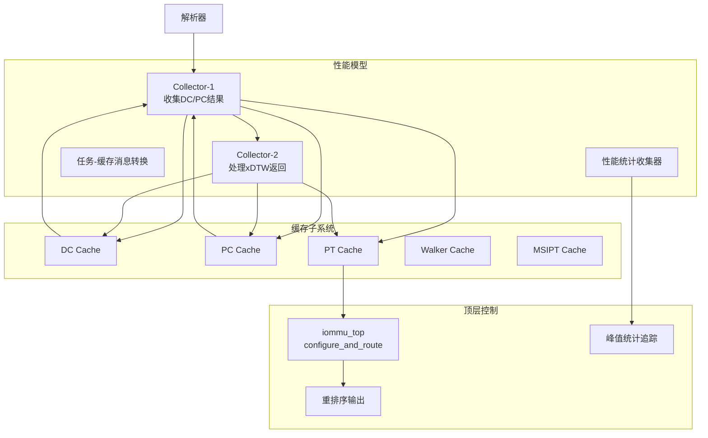
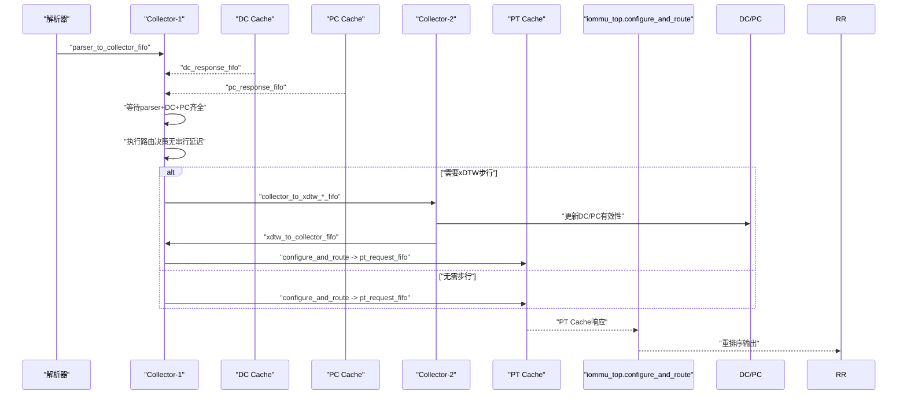
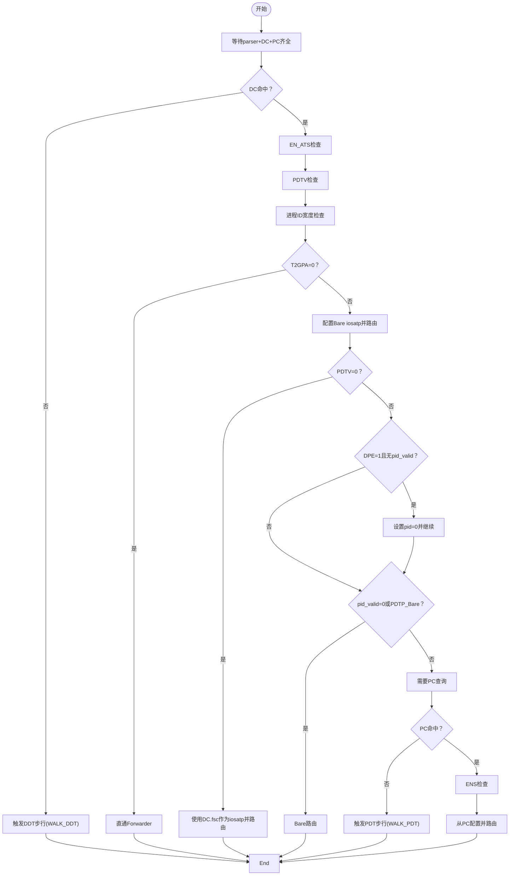
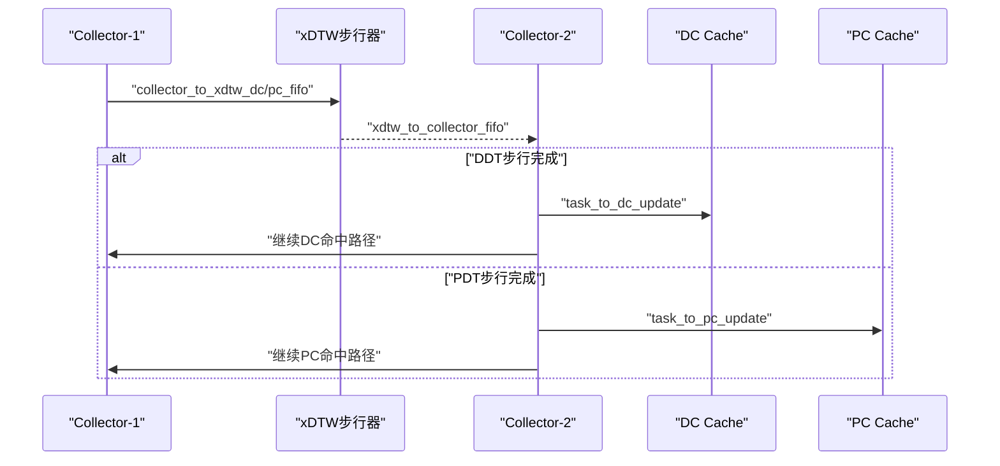
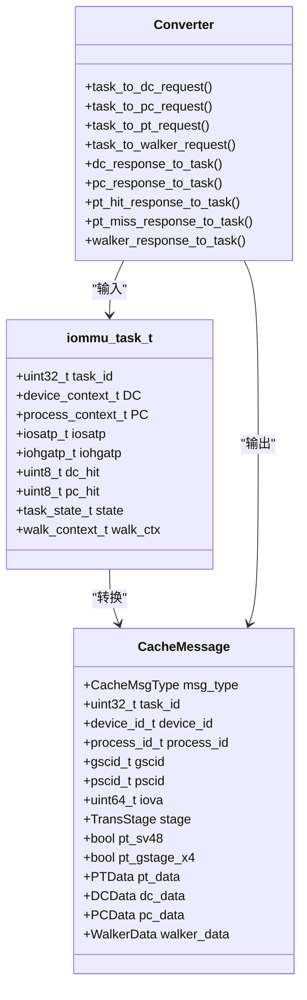
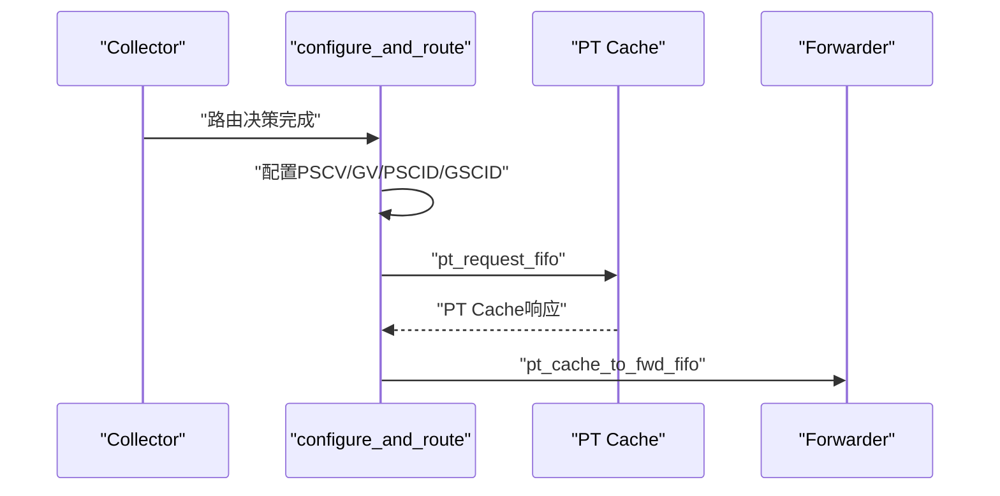
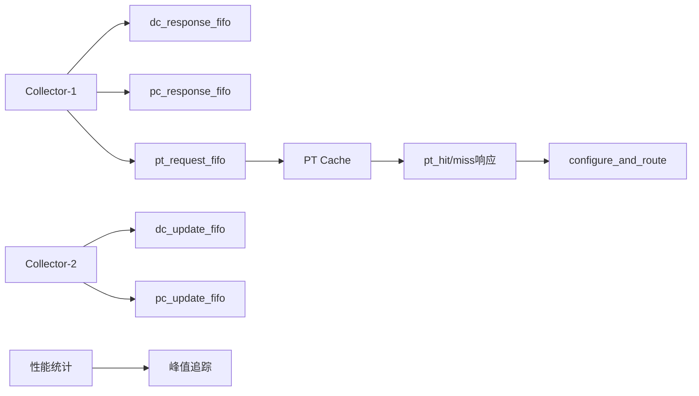

# Collector模块

<cite>
**本文档引用的文件**
- [iommu_perf_collector.cc](file://iommu/iommu_perf_model/iommu_perf_collector.cc)
- [iommu_task_cache_convert.hh](file://iommu/iommu_perf_model/iommu_task_cache_convert.hh)
- [iommu_task_cache_convert.cc](file://iommu/iommu_perf_model/iommu_task_cache_convert.cc)
- [iommu_task.hh](file://iommu/include/iommu_task.hh)
- [cache_subsystem.h](file://iommu/cache_src/subsystem/cache_subsystem.h)
- [iommu_perf_params.hh](file://iommu/iommu_perf_model/iommu_perf_params.hh)
- [iommu_top.cc](file://iommu/iommu_top.cc)
- [iommu_top.hh](file://iommu/iommu_top.hh)
- [stats_collector.h](file://iommu/cache_src/common/stats_collector.h)
- [stats_collector.cpp](file://iommu/cache_src/common/stats_collector.cpp)
</cite>

## 更新摘要
**变更内容**
- 移除了串行延迟（COLLECTOR_DELAY），提升了流水线效率
- 新增了峰值统计功能，包括Collector DC/PC步行器峰值跟踪
- 增强了性能监控能力，支持更详细的系统性能分析
- 更新了性能考量章节以反映新的优化策略

## 目录
1. [简介](#简介)
2. [项目结构](#项目结构)
3. [核心组件](#核心组件)
4. [架构概览](#架构概览)
5. [详细组件分析](#详细组件分析)
6. [依赖关系分析](#依赖关系分析)
7. [性能考量](#性能考量)
8. [故障排查指南](#故障排查指南)
9. [结论](#结论)

## 简介
本文件面向性能模型中的Collector模块，系统性阐述其在IOMMU翻译流水线中的核心职责：收集DC/PC缓存查询结果、执行路由决策、协调xDTW（DDT/PDT）步行器、以及与PT Cache/Forwarder的协作。文档重点覆盖以下方面：
- Collector如何汇聚解析器、DC/PC缓存查询结果，并在三者均就绪后进入"收集"阶段
- 基于上下文配置与权限检查的路由决策流程（EN_ATS、PDTV、T2GPA、ENS等）
- 任务合并机制与MSI地址判断
- 与缓存子系统的通信协议、任务状态管理与性能优化策略
- 具体的路由决策逻辑与延迟计算方法
- **新增**：峰值统计和详细性能监控功能

## 项目结构
Collector位于性能模型目录下，与任务定义、缓存转换工具、缓存子系统及顶层控制流紧密耦合：
- 性能模型：iommu_perf_collector.cc（两线程Collector）、iommu_task_cache_convert.*（任务与缓存消息转换）
- 任务与状态：iommu_task.hh（统一任务结构、状态枚举、收集器条目）
- 缓存子系统：cache_subsystem.h（缓存请求/响应/更新通道）
- 参数与限制：iommu_perf_params.hh（FIFO深度、缓存规模、处理延迟、outstanding限制）
- 顶层控制：iommu_top.cc/.hh（configure_and_route、VA去重、重排序等）
- **新增**：性能监控：stats_collector.h/.cpp（统计收集器）

**图表来源**
- [iommu_perf_collector.cc:14-271](file://iommu/iommu_perf_model/iommu_perf_collector.cc#L14-L271)
- [cache_subsystem.h:34-61](file://iommu/cache_src/subsystem/cache_subsystem.h#L34-L61)
- [iommu_task_cache_convert.cc:12-184](file://iommu/iommu_perf_model/iommu_task_cache_convert.cc#L12-L184)
- [iommu_top.cc:419-443](file://iommu/iommu_top.cc#L419-L443)
- [stats_collector.h:65-75](file://iommu/cache_src/common/stats_collector.h#L65-L75)

**章节来源**
- [iommu_perf_collector.cc:1-457](file://iommu/iommu_perf_model/iommu_perf_collector.cc#L1-L457)
- [cache_subsystem.h:1-161](file://iommu/cache_src/subsystem/cache_subsystem.h#L1-L161)
- [iommu_task_cache_convert.cc:1-427](file://iommu/iommu_perf_model/iommu_task_cache_convert.cc#L1-L427)
- [iommu_task.hh:1-307](file://iommu/include/iommu_task.hh#L1-L307)
- [iommu_perf_params.hh:1-165](file://iommu/iommu_perf_model/iommu_perf_params.hh#L1-L165)
- [iommu_top.cc:419-443](file://iommu/iommu_top.cc#L419-L443)

## 核心组件
- Collector-1（收集线程）：监听解析器与DC/PC缓存响应，等待三者齐全后进入"收集"阶段，执行路由决策与任务合并
- Collector-2（xDTW响应线程）：处理DDT/PDT步行器返回的任务，更新DC/PC有效性并继续路由
- 任务-缓存消息转换：提供task与CacheMessage之间的双向转换，确保上下文字段正确传递
- **新增**：性能统计收集器：记录缓存命中率、延迟分布等性能指标
- 顶层路由：configure_and_route负责最终路由决策并将任务写入PT Cache请求通道

关键职责与接口：
- 收集器条目（collector_entry_t）：跟踪parser到达、DC/PC完成状态
- 任务状态（task_state_t）：贯穿解析、查询、收集、路由、步行、转发、故障等阶段
- 路由键（GSCID/PSCID/IOVA）：决定PT Cache查询与Walker Cache的路由参数
- **新增**：峰值统计追踪器：监控Collector DC/PC步行器的峰值并发数

**章节来源**
- [iommu_task.hh:14-42](file://iommu/include/iommu_task.hh#L14-L42)
- [iommu_task.hh:214-224](file://iommu/include/iommu_task.hh#L214-L224)
- [iommu_perf_collector.cc:14-271](file://iommu/iommu_perf_model/iommu_perf_collector.cc#L14-L271)
- [iommu_task_cache_convert.hh:8-38](file://iommu/iommu_perf_model/iommu_task_cache_convert.hh#L8-L38)
- [iommu_top.hh:153-161](file://iommu/iommu_top.hh#L153-L161)

## 架构概览
Collector在性能模型中的位置与交互如下：

**图表来源**
- [iommu_perf_collector.cc:14-271](file://iommu/iommu_perf_model/iommu_perf_collector.cc#L14-L271)
- [iommu_top.cc:419-443](file://iommu/iommu_top.cc#L419-L443)
- [cache_subsystem.h:34-61](file://iommu/cache_src/subsystem/cache_subsystem.h#L34-L61)

## 详细组件分析

### Collector-1：收集DC/PC结果与路由决策
- 输入通道
  - parser_to_collector_fifo：解析器推送任务
  - cache_sub.dc_response_fifo：DC缓存查询响应
  - cache_sub.pc_response_fifo：PC缓存查询响应
- 处理流程
  - 将parser任务登记到pending_tasks，标记parser_arrived
  - 接收DC/PC响应，更新对应完成状态与任务字段（dc_response_to_task、pc_response_to_task）
  - 当parser到达且DC/PC均完成，进入"收集"阶段（**移除串行延迟，直接设置TASK_COLLECTING**）
- 路由决策与任务合并
  - DC缺失：触发DDT步行（WALK_DDT），更新walk_ctx并写入collector_to_xdtw_dc_fifo
  - DC命中：执行EN_ATS、PDTV、进程ID宽度等检查，随后根据T2GPA、PDTV、DPE、PDTP等条件选择路由
  - PC缺失：触发PDT步行（WALK_PDT），更新walk_ctx并写入collector_to_xdtw_pc_fifo
  - PC命中：执行ENS检查，从PC配置iosatp/iohgatp等，最终调用configure_and_route

**图表来源**
- [iommu_perf_collector.cc:87-266](file://iommu/iommu_perf_model/iommu_perf_collector.cc#L87-L266)

**章节来源**
- [iommu_perf_collector.cc:14-271](file://iommu/iommu_perf_model/iommu_perf_collector.cc#L14-L271)

### Collector-2：处理xDTW步行返回
- 输入：xdtw_to_collector_fifo
- 处理：
  - 若步行返回故障，减少outstanding并写入collector_to_fault_fifo
  - DDT步行完成：更新dc_valid/dc_hit/DTF，必要时更新DC缓存（task_to_dc_update），重复DC命中路径的检查与路由
  - PDT步行完成：更新pc_valid/pc_hit，必要时更新PC缓存（task_to_pc_update），执行ENS检查并从PC配置路由
- 并发控制：维护collector_dc_walk_outstanding与collector_pc_walk_outstanding，达到上限时阻塞，完成后notify

**图表来源**
- [iommu_perf_collector.cc:277-457](file://iommu/iommu_perf_model/iommu_perf_collector.cc#L277-L457)

**章节来源**
- [iommu_perf_collector.cc:277-457](file://iommu/iommu_perf_model/iommu_perf_collector.cc#L277-L457)

### 任务-缓存消息转换
- DC/PC查询请求：task_to_dc_request/task_to_pc_request
- DC/PC响应回填：dc_response_to_task/pc_response_to_task
- PT查询请求：task_to_pt_request（根据iosatp/iohgatp确定翻译阶段与SV48/X4）
- PT响应回填：pt_hit_response_to_task/pt_miss_response_to_task
- Walker Cache：task_to_walker_request/task_to_walker_update，walker_response_to_task

**图表来源**
- [iommu_task_cache_convert.hh:8-38](file://iommu/iommu_perf_model/iommu_task_cache_convert.hh#L8-L38)
- [iommu_task_cache_convert.cc:12-184](file://iommu/iommu_perf_model/iommu_task_cache_convert.cc#L12-L184)

**章节来源**
- [iommu_task_cache_convert.hh:1-40](file://iommu/iommu_perf_model/iommu_task_cache_convert.hh#L1-L40)
- [iommu_task_cache_convert.cc:1-427](file://iommu/iommu_perf_model/iommu_task_cache_convert.cc#L1-L427)

### 顶层路由与任务状态管理
- configure_and_route：根据iosatp/iohgatp配置PSCV/GV/PSCID/GSCID/check_access_perms，保存原始任务到pt_cache_pending_tasks，写入cache_sub.pt_request_fifo
- 任务状态机：贯穿TASK_INIT、TASK_PARSING、TASK_PARSE_DONE、TASK_DC_QUERY、TASK_DC_HIT、TASK_DC_MISS、TASK_PC_QUERY、TASK_PC_HIT、TASK_PC_MISS、TASK_COLLECTING、TASK_ROUTE_DECISION、TASK_XDTW_REQ、TASK_XDTW_DONE、TASK_FORWARD、TASK_FAULT等
- VA去重：在PTW完成后批量恢复同页任务，避免重复步行

**图表来源**
- [iommu_top.cc:419-443](file://iommu/iommu_top.cc#L419-L443)

**章节来源**
- [iommu_top.cc:419-443](file://iommu/iommu_top.cc#L419-L443)
- [iommu_task.hh:14-42](file://iommu/include/iommu_task.hh#L14-L42)

### **新增**：性能统计与监控
- **峰值统计追踪**：实时监控Collector DC/PC步行器的并发峰值
- **性能指标收集**：记录缓存命中率、延迟分布、IOPS等关键指标
- **稳态分析**：支持跳过前10%和后10%的非稳态数据，只统计中间80%稳定段

**章节来源**
- [iommu_top.hh:153-161](file://iommu/iommu_top.hh#L153-L161)
- [iommu_top.cc:618-639](file://iommu/iommu_top.cc#L618-L639)
- [stats_collector.h:65-75](file://iommu/cache_src/common/stats_collector.h#L65-L75)

## 依赖关系分析
- Collector依赖缓存子系统提供的请求/响应/更新通道，避免共享FIFO造成的串行化
- 任务状态与路由键（GSCID/PSCID/IOVA）决定PT Cache查询与Walker Cache的路由参数
- outstanding限制与FIFO深度共同保障系统稳定性与吞吐
- **新增**：性能统计系统提供额外的监控和分析能力

**图表来源**
- [cache_subsystem.h:34-61](file://iommu/cache_src/subsystem/cache_subsystem.h#L34-L61)
- [iommu_perf_collector.cc:14-271](file://iommu/iommu_perf_model/iommu_perf_collector.cc#L14-L271)
- [stats_collector.h:65-75](file://iommu/cache_src/common/stats_collector.h#L65-L75)

**章节来源**
- [cache_subsystem.h:1-161](file://iommu/cache_src/subsystem/cache_subsystem.h#L1-L161)
- [iommu_perf_params.hh:6-52](file://iommu/iommu_perf_model/iommu_perf_params.hh#L6-L52)

## 性能考量
- **处理延迟优化**
  - **移除串行延迟**：COLLECTOR_DELAY已移除，消除了不必要的流水线停顿，提升吞吐量
  - DC/PC/PT/MSIPT命中延迟：分别对应缓存命中开销
  - xDTW/PTW/MSIPTW每次DDR访问延迟：步行器的内存访问成本
- 并发与背压
  - Collector对DC/PC步行设置outstanding上限（COLLECTOR_MAX_DC_WALK_OUTSTANDING、COLLECTOR_MAX_PC_WALK_OUTSTANDING），超过时阻塞等待完成事件
  - FIFO深度参数（如FIFO_DEPTH_COLLECTOR_TO_DC_CACHE_UPDATE等）平衡吞吐与资源占用
- **新增**：峰值统计与性能监控
  - 实时追踪Collector DC/PC步行器的并发峰值，避免过载
  - 提供详细的性能指标分析，支持系统优化决策
- 优化策略
  - 通过Walker Cache中间结果减少PTW步行次数（见Walker Cache转换工具）
  - PT Cache VA去重（PT_CACHE_VA_DEDUP_ENABLED）降低重复步行
  - 重排序输出（REORDER_OUTPUT_DELAY）提升端口带宽利用率

**章节来源**
- [iommu_perf_params.hh:120-131](file://iommu/iommu_perf_model/iommu_perf_params.hh#L120-L131)
- [iommu_perf_params.hh:116-118](file://iommu/iommu_perf_model/iommu_perf_params.hh#L116-L118)
- [iommu_task_cache_convert.cc:287-426](file://iommu/iommu_perf_model/iommu_task_cache_convert.cc#L287-L426)
- [iommu_top.cc:618-639](file://iommu/iommu_top.cc#L618-L639)

## 故障排查指南
- 常见故障场景
  - EN_ATS=0且请求为Translated/ATS：直接FAULT
  - pid_valid=1但PDTV=0：FAULT
  - 进程ID宽度超出MODE限制（PD17/PD8）：FAULT
  - ENS=0且存在有效进程与特权请求：FAULT
- 定位方法
  - 检查Collector日志中的"FAULT"打印与cause字段
  - 确认DC/PC上下文字段（DC.tc、PC.ta）与MODE配置
  - 核对outstanding计数与完成事件通知，避免死锁
  - **新增**：监控Collector DC/PC步行器峰值，识别潜在过载情况
- 相关实现参考
  - 路由决策与故障分支：[iommu_perf_collector.cc:108-154](file://iommu/iommu_perf_model/iommu_perf_collector.cc#L108-L154)
  - ENS检查与PC配置：[iommu_perf_collector.cc:245-265](file://iommu/iommu_perf_model/iommu_perf_collector.cc#L245-L265)

**章节来源**
- [iommu_perf_collector.cc:108-154](file://iommu/iommu_perf_model/iommu_perf_collector.cc#L108-L154)
- [iommu_perf_collector.cc:245-265](file://iommu/iommu_perf_model/iommu_perf_collector.cc#L245-L265)

## 结论
Collector模块在IOMMU性能模型中承担"结果聚合—路由决策—任务合并"的关键角色。通过两线程设计（收集与xDTW响应）、严格的outstanding控制与FIFO深度配置，以及完善的任务-缓存消息转换机制，Collector实现了高效、可扩展的翻译流水线。

**主要优化改进**：
- **移除串行延迟**：消除了COLLECTOR_DELAY，显著提升流水线效率
- **增强监控能力**：新增峰值统计追踪，提供更全面的性能洞察
- **完善统计系统**：集成性能统计收集器，支持详细的性能分析

结合Walker Cache中间结果与PT Cache VA去重等优化，系统在高并发场景下仍能保持稳定吞吐与较低延迟。新增的性能监控功能为系统优化和故障诊断提供了强有力的支持。