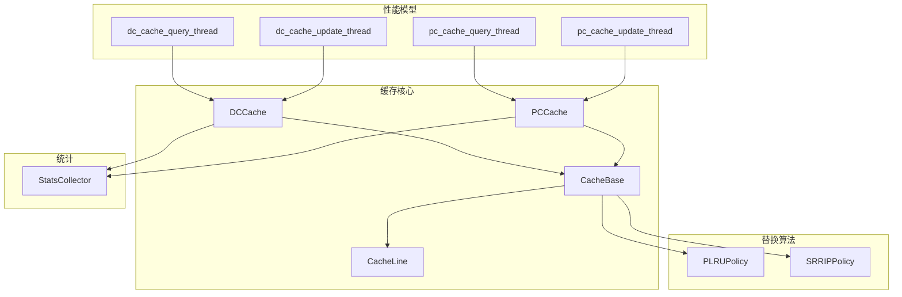
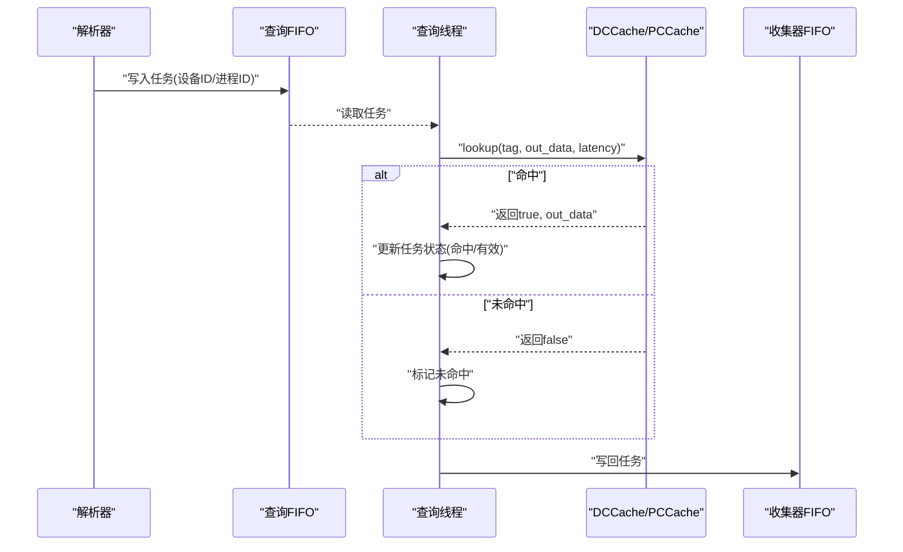
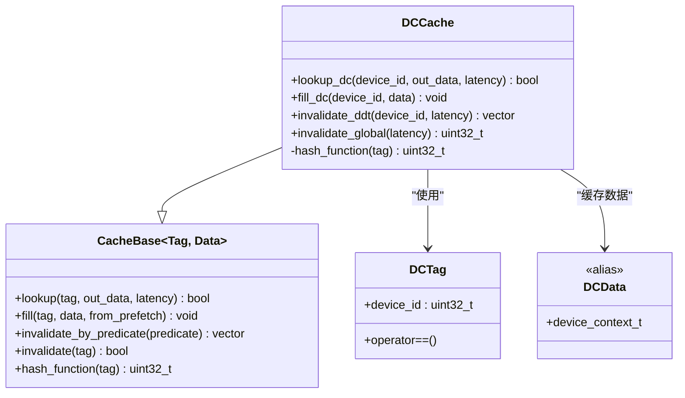
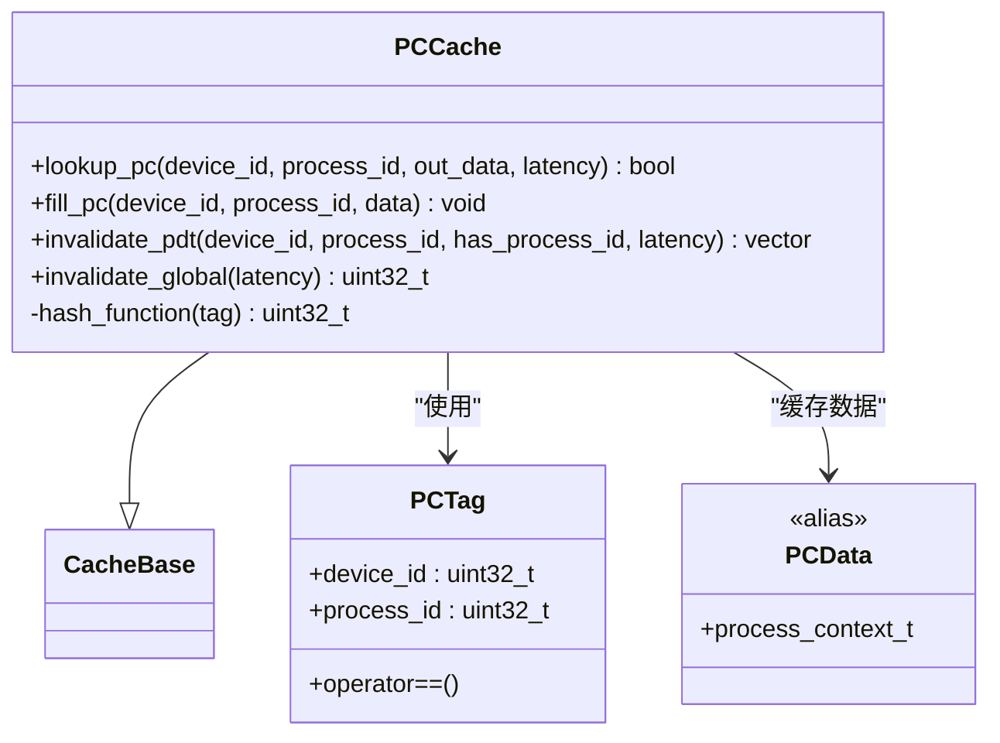
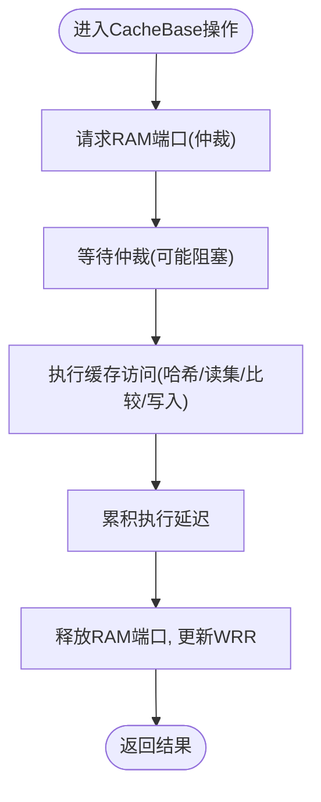
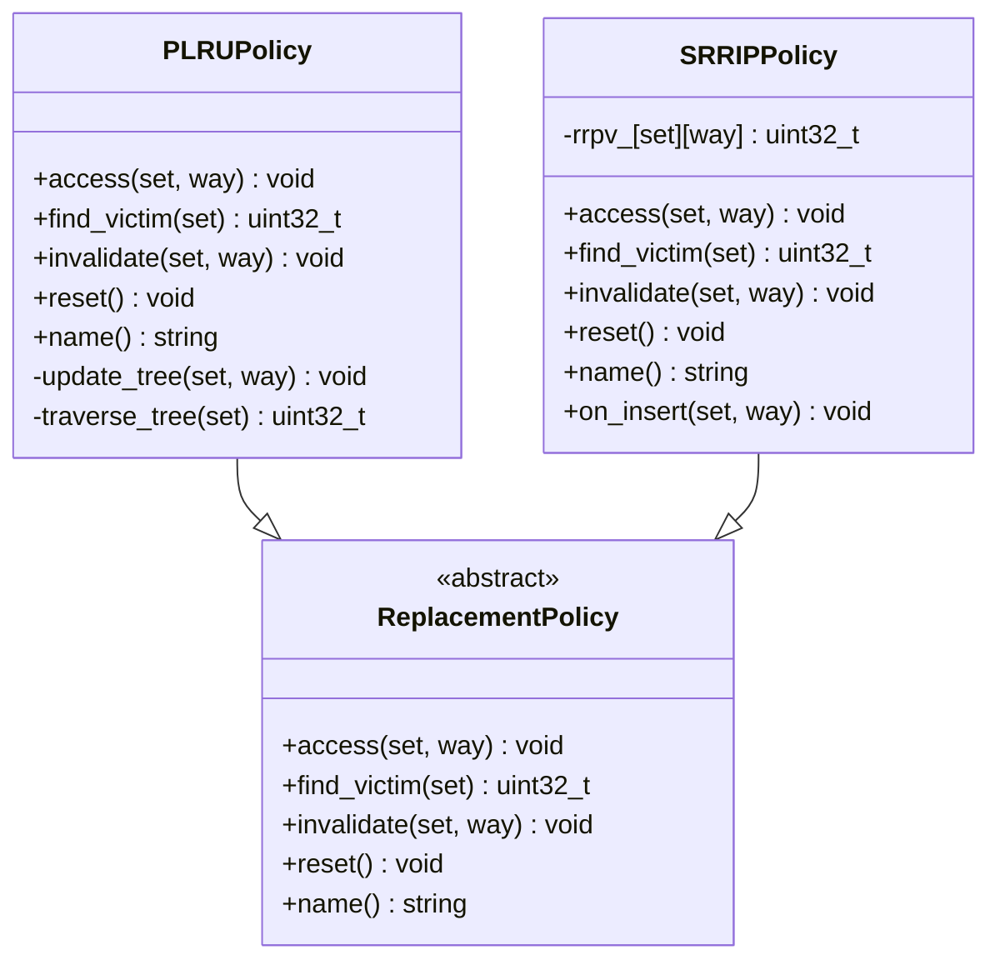
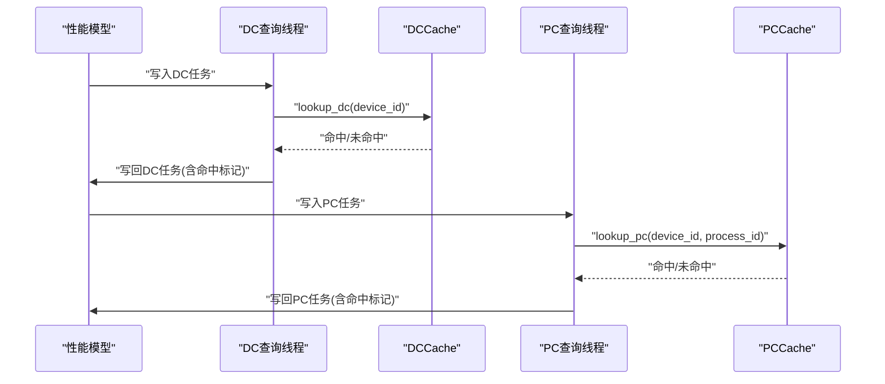
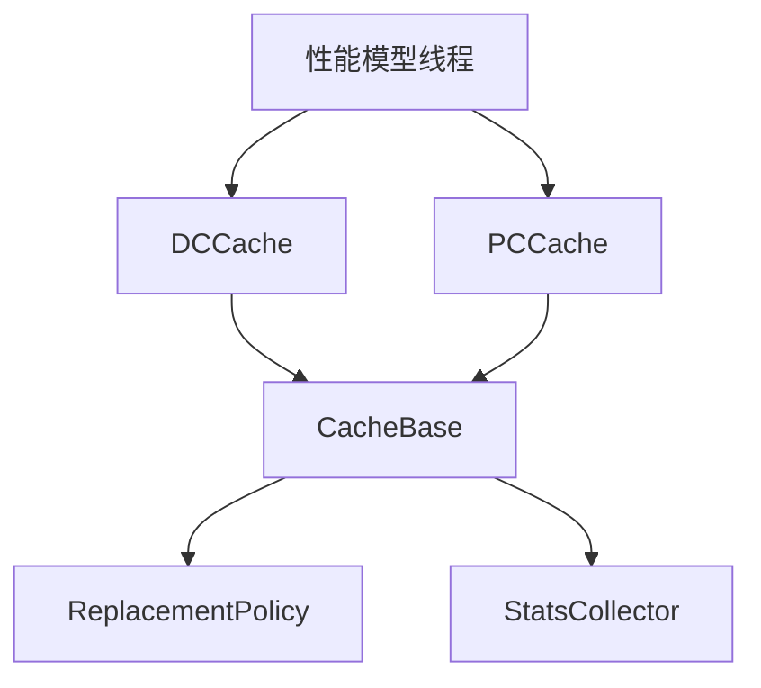

# DC/PC Cache模块

<cite>
**本文档引用的文件**
- [dc_cache.h](file://iommu/cache_src/cache/dc_cache.h)
- [dc_cache.cpp](file://iommu/cache_src/cache/dc_cache.cpp)
- [pc_cache.h](file://iommu/cache_src/cache/pc_cache.h)
- [pc_cache.cpp](file://iommu/cache_src/cache/pc_cache.cpp)
- [cache_base.h](file://iommu/cache_src/cache/cache_base.h)
- [cache_line.h](file://iommu/cache_src/cache/cache_line.h)
- [types.h](file://iommu/cache_src/common/types.h)
- [stats_collector.h](file://iommu/cache_src/common/stats_collector.h)
- [plru_policy.h](file://iommu/cache_src/replacement/plru_policy.h)
- [srrip_policy.h](file://iommu/cache_src/replacement/srrip_policy.h)
- [default_config.json](file://iommu/cache_config/default_config.json)
- [iommu_perf_dc_pc_cache.cc](file://iommu/iommu_perf_model/iommu_perf_dc_pc_cache.cc)
- [iommu_perf_model.hh](file://iommu/iommu_perf_model/iommu_perf_model.hh)
</cite>

## 目录
1. [简介](#简介)
2. [项目结构](#项目结构)
3. [核心组件](#核心组件)
4. [架构概览](#架构概览)
5. [详细组件分析](#详细组件分析)
6. [依赖关系分析](#依赖关系分析)
7. [性能考量](#性能考量)
8. [故障排查指南](#故障排查指南)
9. [结论](#结论)

## 简介
本文件面向DC/PC Cache模块的实现文档，重点阐述设备上下文缓存(DC Cache)与进程上下文缓存(PC Cache)在IOMMU性能模型中的作用与实现机制。文档涵盖以下要点：
- DC Cache如何存储设备上下文信息，包括标签结构、散列函数与失效策略
- PC Cache如何管理进程上下文，包括多键标签与失效范围控制
- 两者如何协同支持地址转换，以及在性能模型中的查询与更新流程
- 缓存查询流程、更新策略与替换算法
- 缓存命中率统计、性能优化建议与故障处理机制

## 项目结构
DC/PC Cache模块位于iommu/cache_src/cache目录下，采用模板化设计，通过基类CacheBase提供统一的缓存接口与性能建模能力，并通过专用派生类实现DC/PC特定的标签与散列逻辑。性能模型侧通过独立线程模拟查询与更新过程，并集成统计收集器进行命中率与延迟统计。

**图表来源**
- [cache_base.h:26-676](file://iommu/cache_src/cache/cache_base.h#L26-L676)
- [cache_line.h:70-103](file://iommu/cache_src/cache/cache_line.h#L70-L103)
- [dc_cache.h:8-31](file://iommu/cache_src/cache/dc_cache.h#L8-L31)
- [pc_cache.h:8-33](file://iommu/cache_src/cache/pc_cache.h#L8-L33)
- [plru_policy.h:12-33](file://iommu/cache_src/replacement/plru_policy.h#L12-L33)
- [srrip_policy.h:13-33](file://iommu/cache_src/replacement/srrip_policy.h#L13-L33)
- [iommu_perf_dc_pc_cache.cc:11-122](file://iommu/iommu_perf_model/iommu_perf_dc_pc_cache.cc#L11-L122)

**章节来源**
- [cache_base.h:26-676](file://iommu/cache_src/cache/cache_base.h#L26-L676)
- [cache_line.h:70-103](file://iommu/cache_src/cache/cache_line.h#L70-L103)
- [dc_cache.h:8-31](file://iommu/cache_src/cache/dc_cache.h#L8-L31)
- [pc_cache.h:8-33](file://iommu/cache_src/cache/pc_cache.h#L8-L33)
- [plru_policy.h:12-33](file://iommu/cache_src/replacement/plru_policy.h#L12-L33)
- [srrip_policy.h:13-33](file://iommu/cache_src/replacement/srrip_policy.h#L13-L33)
- [iommu_perf_dc_pc_cache.cc:11-122](file://iommu/iommu_perf_model/iommu_perf_dc_pc_cache.cc#L11-L122)

## 核心组件
- CacheBase<Tag, Data>：通用缓存基类，提供lookup/fill/invalidate等统一接口，封装散列、替换算法、仲裁与延迟建模。
- DCCache：DC Cache专用实现，基于设备ID作为标签键，提供设备上下文查询与填充，以及按设备粒度的失效。
- PCCache：PC Cache专用实现，基于(device_id, process_id)复合键，提供进程上下文查询与填充，以及按设备/进程粒度的失效。
- CacheLine<Tag, Data>：缓存行模板，包含有效性、标签、数据、预取标记与访问计数。
- StatsCollector：统计收集器，记录总访问、命中、缺失、驱逐、失效、预取命中等指标，并支持延迟直方图与IOPS统计。
- 替换策略：PLRU与SRRIP，分别适用于多路组相联缓存的不同场景。

**章节来源**
- [cache_base.h:26-676](file://iommu/cache_src/cache/cache_base.h#L26-L676)
- [cache_line.h:70-103](file://iommu/cache_src/cache/cache_line.h#L70-L103)
- [dc_cache.h:8-31](file://iommu/cache_src/cache/dc_cache.h#L8-L31)
- [pc_cache.h:8-33](file://iommu/cache_src/cache/pc_cache.h#L8-L33)
- [stats_collector.h:65-126](file://iommu/cache_src/common/stats_collector.h#L65-L126)

## 架构概览
DC/PC Cache在IOMMU性能模型中的位置如下：
- 查询路径：解析器将任务放入查询FIFO，查询线程从FIFO读取，调用lookup接口，命中则更新任务状态并写回收集器FIFO。
- 更新路径：翻译完成后，收集器将任务转发到更新FIFO，更新线程调用fill接口写入缓存。
- 失效路径：当收到IODIR指令时，触发精确或扫描失效，返回受影响的上下文集合用于级联失效。

**图表来源**
- [iommu_perf_dc_pc_cache.cc:11-101](file://iommu/iommu_perf_model/iommu_perf_dc_pc_cache.cc#L11-L101)
- [cache_base.h:258-295](file://iommu/cache_src/cache/cache_base.h#L258-L295)

**章节来源**
- [iommu_perf_dc_pc_cache.cc:11-101](file://iommu/iommu_perf_model/iommu_perf_dc_pc_cache.cc#L11-L101)
- [cache_base.h:258-295](file://iommu/cache_src/cache/cache_base.h#L258-L295)

## 详细组件分析

### DCCache组件分析
DCCache负责设备上下文缓存，其关键特性：
- 标签结构：仅使用device_id作为DCTag，简化查询键。
- 散列函数：基于device_id的高位异或组合，掩码为num_sets-1，确保均匀分布。
- 查询接口：lookup_dc(device_id, out_data, latency)，内部构造DCTag并委托基类lookup。
- 填充接口：fill_dc(device_id, data)，用于翻译后写回缓存。
- 失效接口：invalidate_ddt(device_id, latency)，按设备粒度精确失效，返回受影响的(gscid, pscid)列表用于级联。

**图表来源**
- [dc_cache.h:8-31](file://iommu/cache_src/cache/dc_cache.h#L8-L31)
- [dc_cache.cpp:5-50](file://iommu/cache_src/cache/dc_cache.cpp#L5-L50)
- [cache_base.h:26-676](file://iommu/cache_src/cache/cache_base.h#L26-L676)
- [cache_line.h:12-23](file://iommu/cache_src/cache/cache_line.h#L12-L23)

**章节来源**
- [dc_cache.h:8-31](file://iommu/cache_src/cache/dc_cache.h#L8-L31)
- [dc_cache.cpp:5-50](file://iommu/cache_src/cache/dc_cache.cpp#L5-L50)
- [cache_line.h:12-23](file://iommu/cache_src/cache/cache_line.h#L12-L23)

### PCCache组件分析
PCCache负责进程上下文缓存，其关键特性：
- 标签结构：使用(device_id, process_id)复合键PCTag，支持同一设备下的多进程上下文隔离。
- 散列函数：综合device_id与process_id的位运算，掩码为num_sets-1，提升冲突分散性。
- 查询接口：lookup_pc(device_id, process_id, out_data, latency)，内部构造PCTag并委托基类lookup。
- 填充接口：fill_pc(device_id, process_id, data)，用于翻译后写回缓存。
- 失效接口：invalidate_pdt(device_id, process_id, has_process_id, latency)，支持精确失效(指定进程)与扫描失效(忽略进程)两种模式，返回受影响的pscid列表用于级联。

**图表来源**
- [pc_cache.h:8-33](file://iommu/cache_src/cache/pc_cache.h#L8-L33)
- [pc_cache.cpp:5-63](file://iommu/cache_src/cache/pc_cache.cpp#L5-L63)
- [cache_base.h:26-676](file://iommu/cache_src/cache/cache_base.h#L26-L676)
- [cache_line.h:17-23](file://iommu/cache_src/cache/cache_line.h#L17-L23)

**章节来源**
- [pc_cache.h:8-33](file://iommu/cache_src/cache/pc_cache.h#L8-L33)
- [pc_cache.cpp:5-63](file://iommu/cache_src/cache/pc_cache.cpp#L5-L63)
- [cache_line.h:17-23](file://iommu/cache_src/cache/cache_line.h#L17-L23)

### CacheBase通用实现分析
CacheBase提供统一的缓存操作与性能建模：
- 核心接口：lookup/fill/invalidate系列，均通过仲裁器调度单端口RAM访问。
- 仲裁机制：WRR权重默认1:1:1，按lookup/fill/invalidates轮转，避免饥饿。
- 延迟建模：包含仲裁延迟、哈希延迟、读集延迟、比较延迟、写入延迟等分段周期，转换为SystemC时间。
- 替换算法：支持PLRU与SRRIP，SRRIP在新插入时使用on_insert特殊处理。
- 统计采集：记录访问、命中、缺失、驱逐、失效、预取命中与各类延迟样本。

**图表来源**
- [cache_base.h:560-671](file://iommu/cache_src/cache/cache_base.h#L560-L671)

**章节来源**
- [cache_base.h:560-671](file://iommu/cache_src/cache/cache_base.h#L560-L671)

### 替换策略分析
- PLRU(伪LRU)：基于二叉树bit表示访问顺序，每次访问更新树路径，选择最久未访问的way作为受害者。
- SRRIP(静态RRIP)：每个line维护M-bit RRPV值，RRPV越大越易被替换；新插入时通过on_insert初始化。

**图表来源**
- [plru_policy.h:12-33](file://iommu/cache_src/replacement/plru_policy.h#L12-L33)
- [srrip_policy.h:13-33](file://iommu/cache_src/replacement/srrip_policy.h#L13-L33)

**章节来源**
- [plru_policy.h:12-33](file://iommu/cache_src/replacement/plru_policy.h#L12-L33)
- [srrip_policy.h:13-33](file://iommu/cache_src/replacement/srrip_policy.h#L13-L33)

### 性能模型线程分析
性能模型通过四个独立线程模拟DC/PC缓存的查询与更新：
- dc_cache_query_thread：从解析器FIFO读取任务，调用lookup_ioatc_dc，记录命中/未命中统计，写回收集器FIFO。
- dc_cache_update_thread：从收集器FIFO读取任务，调用cache_ioatc_dc写回缓存。
- pc_cache_query_thread：从解析器FIFO读取任务，调用lookup_ioatc_pc，记录命中/未命中统计，写回收集器FIFO。
- pc_cache_update_thread：从收集器FIFO读取任务，调用cache_ioatc_pc写回缓存。

**图表来源**
- [iommu_perf_dc_pc_cache.cc:11-122](file://iommu/iommu_perf_model/iommu_perf_dc_pc_cache.cc#L11-L122)

**章节来源**
- [iommu_perf_dc_pc_cache.cc:11-122](file://iommu/iommu_perf_model/iommu_perf_dc_pc_cache.cc#L11-L122)

## 依赖关系分析
- DCCache/PCCache继承自CacheBase，共享统一的缓存操作与性能建模。
- CacheBase依赖替换策略接口，支持PLRU与SRRIP。
- CacheBase依赖StatsCollector进行统计与延迟采样。
- 性能模型线程依赖DCCache/PCCache提供的lookup/fill接口。

**图表来源**
- [cache_base.h:26-676](file://iommu/cache_src/cache/cache_base.h#L26-L676)
- [stats_collector.h:65-126](file://iommu/cache_src/common/stats_collector.h#L65-L126)
- [iommu_perf_dc_pc_cache.cc:11-122](file://iommu/iommu_perf_model/iommu_perf_dc_pc_cache.cc#L11-L122)

**章节来源**
- [cache_base.h:26-676](file://iommu/cache_src/cache/cache_base.h#L26-L676)
- [stats_collector.h:65-126](file://iommu/cache_src/common/stats_collector.h#L65-L126)
- [iommu_perf_dc_pc_cache.cc:11-122](file://iommu/iommu_perf_model/iommu_perf_dc_pc_cache.cc#L11-L122)

## 性能考量
- 缓存参数配置：默认DC/PC缓存均为64 sets × 4 ways，替换算法为PLRU。可通过JSON配置文件调整sets、ways与M位数。
- 延迟建模：仲裁延迟、哈希/读集/比较/写入延迟均可配置，直接影响整体吞吐与时延。
- 替换策略：PLRU适合多路组相联，SRRIP在新插入时使用on_insert，有助于减少抖动。
- 统计指标：命中率、缺失率、驱逐次数、失效次数、预取命中率、平均执行/队列/请求延迟、IOPS等，可用于性能优化与容量规划。

**章节来源**
- [default_config.json:20-43](file://iommu/cache_config/default_config.json#L20-L43)
- [cache_base.h:560-671](file://iommu/cache_src/cache/cache_base.h#L560-L671)
- [stats_collector.h:13-63](file://iommu/cache_src/common/stats_collector.h#L13-L63)

## 故障排查指南
- 命中率偏低：检查sets/ways配置与替换策略，确认是否存在过多冲突；查看驱逐次数与缺失率。
- 延迟异常：核查仲裁延迟与各阶段延迟配置，关注队列延迟与执行延迟分布。
- 失效问题：确认失效粒度(精确/扫描/全局)与目标上下文(gscid/pscid)是否正确；检查级联失效返回的受影响上下文列表。
- 线程阻塞：检查FIFO拥塞与仲裁权重，确保查询/更新线程与缓存操作之间无死锁。

**章节来源**
- [stats_collector.h:13-63](file://iommu/cache_src/common/stats_collector.h#L13-L63)
- [cache_base.h:408-538](file://iommu/cache_src/cache/cache_base.h#L408-L538)
- [iommu_perf_dc_pc_cache.cc:11-122](file://iommu/iommu_perf_model/iommu_perf_dc_pc_cache.cc#L11-L122)

## 结论
DC/PC Cache模块通过模板化的CacheBase实现了统一的缓存接口与性能建模，DCCache与PCCache分别针对设备与进程上下文提供了高效的查询与更新能力。结合PLRU/SRRIP替换策略与完善的统计收集器，能够有效支撑IOMMU地址转换的性能需求。通过合理配置缓存参数与监控关键指标，可进一步优化系统吞吐与延迟表现。