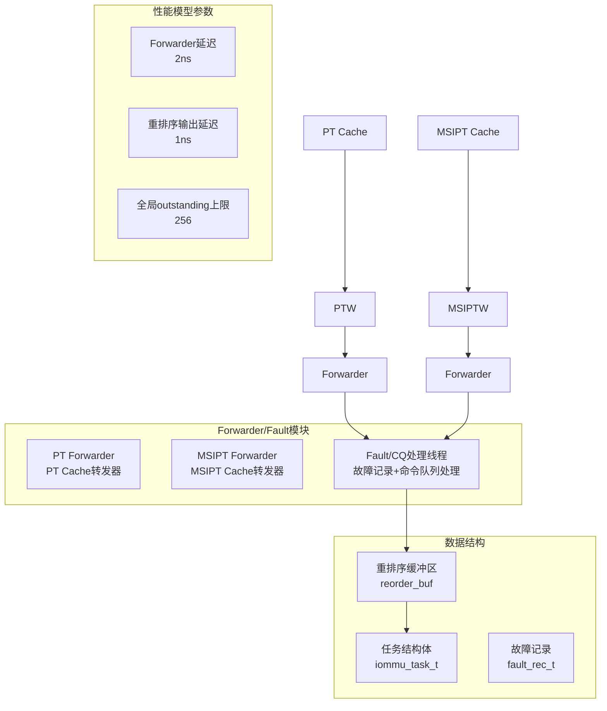
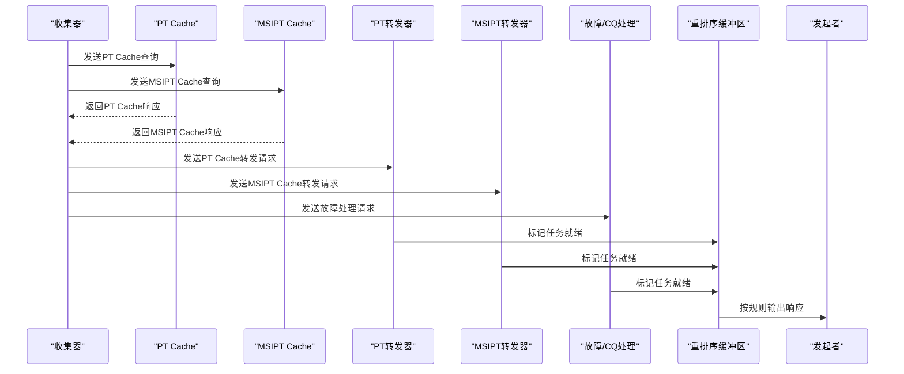
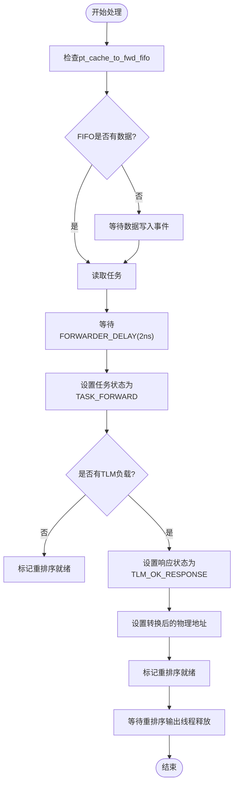
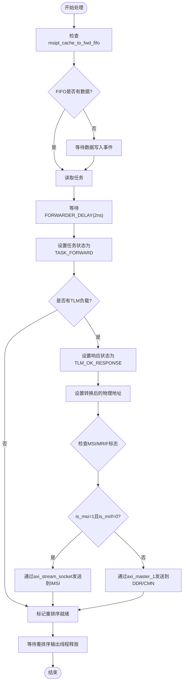
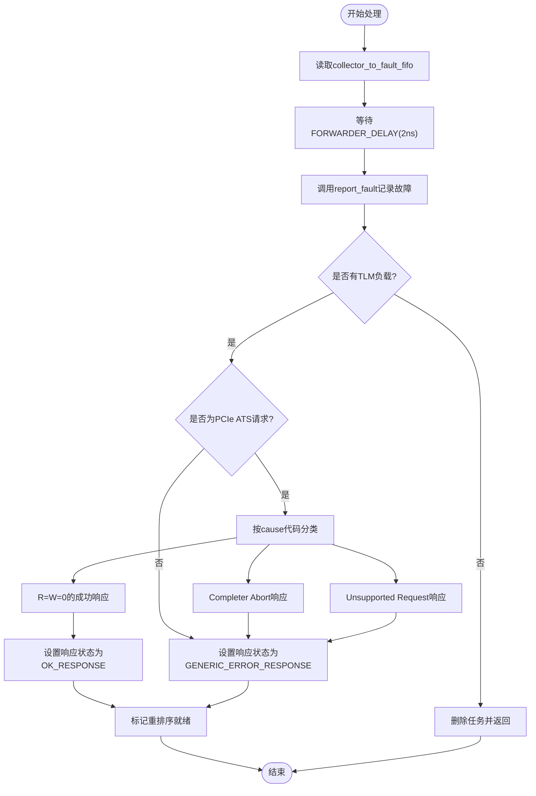
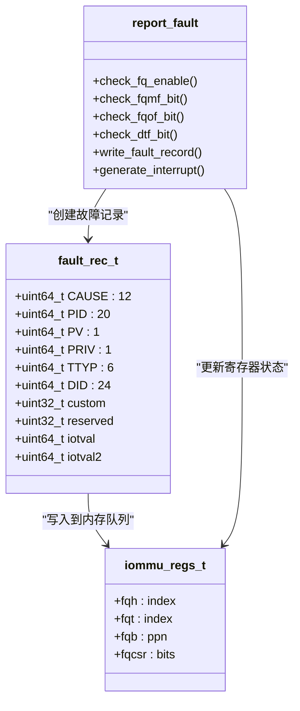
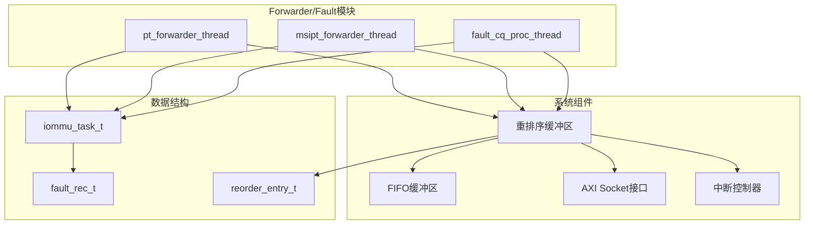

# Forwarder/Fault模块

<cite>
**本文档引用的文件**
- [iommu_perf_forwarder_fault_cq.cc](file://iommu/iommu_perf_model/iommu_perf_forwarder_fault_cq.cc)
- [iommu_faults.cc](file://iommu/iommu_fun_model/iommu_faults.cc)
- [iommu_fault.hh](file://iommu/include/iommu_fault.hh)
- [iommu_command_queue.cc](file://iommu/iommu_perf_model/iommu_command_queue.cc)
- [iommu_command_queue.hh](file://iommu/include/iommu_command_queue.hh)
- [iommu_translate.hh](file://iommu/include/iommu_translate.hh)
- [iommu_top.hh](file://iommu/iommu_top.hh)
- [iommu_struct.hh](file://iommu/include/iommu_struct.hh)
- [iommu_perf_params.hh](file://iommu/iommu_perf_model/iommu_perf_params.hh)
- [iommu_perf_reorder.cc](file://iommu/iommu_perf_model/iommu_perf_reorder.cc)
- [iommu_perf_model.hh](file://iommu/iommu_perf_model/iommu_perf_model.hh)
</cite>

## 目录
1. [简介](#简介)
2. [项目结构](#项目结构)
3. [核心组件](#核心组件)
4. [架构概览](#架构概览)
5. [详细组件分析](#详细组件分析)
6. [依赖关系分析](#依赖关系分析)
7. [性能考量](#性能考量)
8. [故障处理指南](#故障处理指南)
9. [结论](#结论)

## 简介
本文档深入解析IOMMU性能模型中的Forwarder/Fault模块实现机制。该模块负责数据包转发和故障处理两大核心功能，通过三个独立线程实现高性能的数据转发（PT Cache和MSIPT Cache路径）以及故障记录与命令队列处理。文档详细说明了数据包转发流程、命令队列处理、故障检测与报告机制，并提供故障类型处理策略、错误码定义和恢复机制的完整说明。

## 项目结构
Forwarder/Fault模块位于IOMMU性能模型子系统中，采用SystemC多线程架构设计，包含以下关键组件：

**图表来源**
- [iommu_perf_forwarder_fault_cq.cc:13-179](file://iommu/iommu_perf_model/iommu_perf_forwarder_fault_cq.cc#L13-L179)
- [iommu_top.hh:251-257](file://iommu/iommu_top.hh#L251-L257)

**章节来源**
- [iommu_top.hh:251-257](file://iommu/iommu_top.hh#L251-L257)
- [iommu_perf_params.hh:131](file://iommu/iommu_perf_model/iommu_perf_params.hh#L131)

## 核心组件
Forwarder/Fault模块包含三个核心线程，每个线程都有特定的职责和处理逻辑：

### PT Forwarder线程
负责PT Cache路径的翻译结果转发，将地址转换后的请求通过PCIe NoC路由到目标设备。

### MSIPT Forwarder线程  
负责MSIPT Cache路径的翻译结果转发，根据MSI/MRIF标志位决定数据传输路径。

### Fault/CQ处理线程
负责故障记录、ATS请求分类处理以及命令队列的执行控制。

**章节来源**
- [iommu_perf_forwarder_fault_cq.cc:13-179](file://iommu/iommu_perf_model/iommu_perf_forwarder_fault_cq.cc#L13-L179)

## 架构概览
Forwarder/Fault模块采用流水线架构设计，通过FIFO缓冲区连接各个处理阶段：

**图表来源**
- [iommu_perf_forwarder_fault_cq.cc:13-179](file://iommu/iommu_perf_model/iommu_perf_forwarder_fault_cq.cc#L13-L179)
- [iommu_top.hh:185-206](file://iommu/iommu_top.hh#L185-L206)

## 详细组件分析

### PT Forwarder组件分析

PT Forwarder线程实现了PT Cache路径的高效数据转发：

**图表来源**
- [iommu_perf_forwarder_fault_cq.cc:13-53](file://iommu/iommu_perf_model/iommu_perf_forwarder_fault_cq.cc#L13-L53)

**章节来源**
- [iommu_perf_forwarder_fault_cq.cc:13-53](file://iommu/iommu_perf_model/iommu_perf_forwarder_fault_cq.cc#L13-L53)

### MSIPT Forwarder组件分析

MSIPT Forwarder线程处理MSI和MRIF类型的地址转换：

**图表来源**
- [iommu_perf_forwarder_fault_cq.cc:62-114](file://iommu/iommu_perf_model/iommu_perf_forwarder_fault_cq.cc#L62-L114)

**章节来源**
- [iommu_perf_forwarder_fault_cq.cc:62-114](file://iommu/iommu_perf_model/iommu_perf_forwarder_fault_cq.cc#L62-L114)

### Fault/CQ处理组件分析

Fault/CQ处理线程实现了复杂的故障分类和命令队列处理逻辑：

**图表来源**
- [iommu_perf_forwarder_fault_cq.cc:121-179](file://iommu/iommu_perf_model/iommu_perf_forwarder_fault_cq.cc#L121-L179)

**章节来源**
- [iommu_perf_forwarder_fault_cq.cc:121-179](file://iommu/iommu_perf_model/iommu_perf_forwarder_fault_cq.cc#L121-L179)

### 故障记录机制

故障记录机制遵循SPEC Section 12.17-12.18规范，实现了完整的故障队列管理：

**图表来源**
- [iommu_faults.cc:8-160](file://iommu/iommu_fun_model/iommu_faults.cc#L8-L160)
- [iommu_fault.hh:63-77](file://iommu/include/iommu_fault.hh#L63-L77)

**章节来源**
- [iommu_faults.cc:8-160](file://iommu/iommu_fun_model/iommu_faults.cc#L8-L160)
- [iommu_fault.hh:63-77](file://iommu/include/iommu_fault.hh#L63-L77)

### ATS请求分类处理

ATS请求根据cause代码进行精确分类，实现SPEC要求的响应行为：

| 分类 | Cause代码范围 | 响应类型 | 行为描述 |
|------|---------------|----------|----------|
| 成功响应(R=W=0) | 12, 13, 15, 20, 21, 23, 266, 262 | OK_RESPONSE | 返回成功但R=W=0 |
| Completer Abort | 1, 5, 7, 261, 263, 265, 267, 268, 269, 270, 271, 272, 274 | GENERIC_ERROR_RESPONSE | 返回CA响应 |
| Unsupported Request | 256, 257, 258, 259, 260 | GENERIC_ERROR_RESPONSE | 返回UR响应 |

**章节来源**
- [iommu_perf_forwarder_fault_cq.cc:152-170](file://iommu/iommu_perf_model/iommu_perf_forwarder_fault_cq.cc#L152-L170)
- [iommu_translate.cc:657-732](file://iommu/iommu_fun_model/iommu_translate.cc#L657-L732)

## 依赖关系分析

Forwarder/Fault模块与系统其他组件存在紧密的依赖关系：

**图表来源**
- [iommu_top.hh:69-114](file://iommu/iommu_top.hh#L69-L114)
- [iommu_top.hh:185-206](file://iommu/iommu_top.hh#L185-L206)

**章节来源**
- [iommu_top.hh:69-114](file://iommu/iommu_top.hh#L69-L114)
- [iommu_top.hh:185-206](file://iommu/iommu_top.hh#L185-L206)

## 性能考量

Forwarder/Fault模块在设计时充分考虑了性能优化：

### 转发延迟分析
- **Forwarder延迟**: 2ns，确保快速数据转发
- **重排序输出延迟**: 1ns，维持输出节拍一致性
- **全局outstanding上限**: 256，防止内存溢出

### 队列管理策略
- **写保序读乱序**: 写请求严格按task_id保序，读请求可乱序输出
- **FIFO深度配置**: 各个FIFO都有SPEC定义的深度限制
- **并发流控**: 通过outstanding计数器控制AXI端口并发度

### 性能监控方法
- **IOMMU完成计数**: `iommu_total_completed`统计翻译完成数量
- **缓存命中率**: 全局统计变量跟踪各缓存命中情况
- **字节计数器**: 监控各端口数据流量

**章节来源**
- [iommu_perf_params.hh:131](file://iommu/iommu_perf_model/iommu_perf_params.hh#L131)
- [iommu_perf_reorder.cc:89-154](file://iommu/iommu_perf_model/iommu_perf_reorder.cc#L89-L154)
- [iommu_top.hh:144-152](file://iommu/iommu_top.hh#L144-L152)

## 故障处理指南

### 故障类型处理策略

#### 地址转换故障
- **访问故障**: 设置ACCESS_FAULT标志，触发故障记录
- **数据损坏**: 标记DATA_CORRUPTION，生成相应中断
- **页面故障**: 根据访问类型设置不同cause码

#### ATS事务故障
- **配置错误**: 返回Completer Abort响应
- **永久错误**: 返回Unsupported Request响应
- **成功但R=W=0**: 返回成功但不设置读写权限

### 错误码定义

| Cause码 | 故障类型 | 描述 | 处理方式 |
|---------|----------|------|----------|
| 1, 5, 7 | 访问故障 | 指令/读/写访问故障 | CA响应 |
| 12, 13, 15 | 页面故障 | 指令/读/写页面故障 | 成功但R=W=0 |
| 20, 21, 23 | 客户端页面故障 | 客户端指令/读/写页面故障 | 成功但R=W=0 |
| 256-260 | 交易类型错误 | 交易类型不允许 | UR响应 |
| 261-274 | MSI/PT故障 | MSI PTE/PDT/PT数据损坏 | CA响应 |

### 恢复机制

#### 故障队列溢出处理
- **fqof标志**: 队列满时设置，停止故障记录
- **fqmf标志**: 内存访问故障时设置，停止故障记录
- **软件清理**: 通过写入清除位恢复故障记录功能

#### 命令队列故障处理
- **cqmf标志**: 命令队列内存故障时设置
- **cmd_ill标志**: 非法命令时设置
- **cmd_to标志**: 命令超时处理

**章节来源**
- [iommu_faults.cc:23-44](file://iommu/iommu_fun_model/iommu_faults.cc#L23-L44)
- [iommu_faults.cc:129-133](file://iommu/iommu_fun_model/iommu_faults.cc#L129-L133)
- [iommu_command_queue.cc:35-43](file://iommu/iommu_perf_model/iommu_command_queue.cc#L35-L43)

## 结论

Forwarder/Fault模块通过精心设计的多线程架构和严格的SPEC实现，提供了高效的IOMMU数据转发和故障处理能力。模块的主要优势包括：

1. **高并发处理**: 三个独立线程并行处理不同类型的任务
2. **精确的故障分类**: 基于SPEC的完整故障处理策略
3. **灵活的队列管理**: 支持写保序读乱序的输出机制
4. **完善的性能监控**: 提供详细的统计和监控指标

该模块为IOMMU性能模型提供了坚实的基础设施，确保了系统的可靠性和高性能运行。