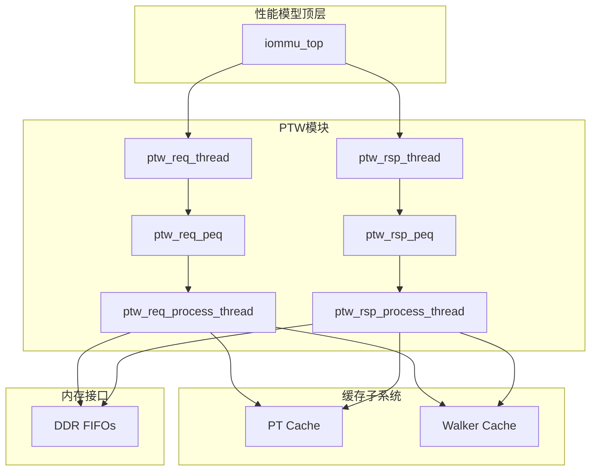
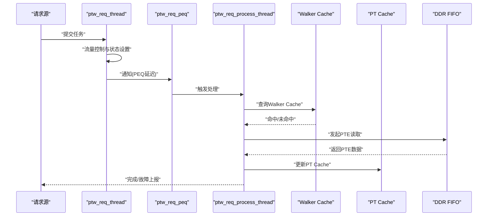
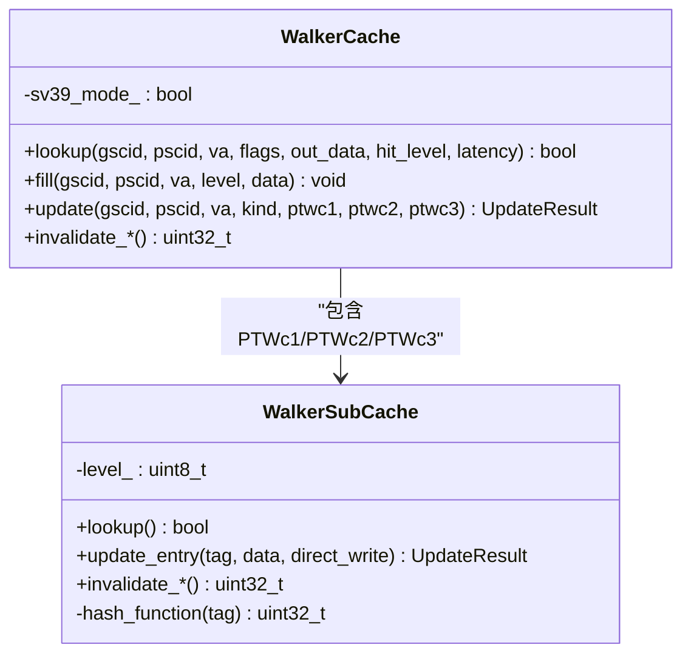
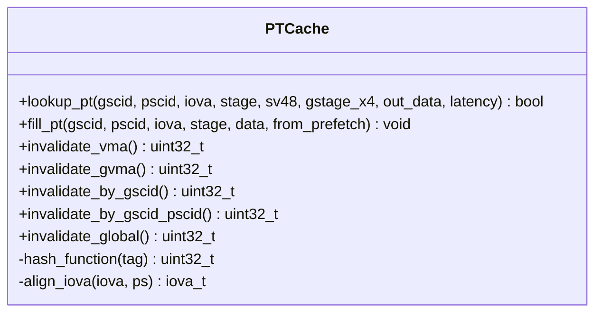
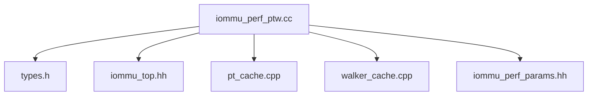

# PTW模块

<cite>
**本文档引用的文件**
- [iommu_perf_ptw.cc](file://iommu/iommu_perf_model/iommu_perf_ptw.cc)
- [pt_cache.cpp](file://iommu/cache_src/cache/pt_cache.cpp)
- [pt_cache.h](file://iommu/cache_src/cache/pt_cache.h)
- [walker_cache.cpp](file://iommu/cache_src/cache/walker_cache.cpp)
- [walker_cache.h](file://iommu/cache_src/cache/walker_cache.h)
- [iommu_translate.hh](file://iommu/include/iommu_translate.hh)
- [iommu_translate.cc](file://iommu/iommu_fun_model/iommu_translate.cc)
- [iommu_two_stage_trans.cc](file://iommu/iommu_fun_model/iommu_two_stage_trans.cc)
- [iommu_second_stage_trans.cc](file://iommu/iommu_fun_model/iommu_second_stage_trans.cc)
- [iommu_perf_params.hh](file://iommu/iommu_perf_model/iommu_perf_params.hh)
- [iommu_top.hh](file://iommu/iommu_top.hh)
- [types.h](file://iommu/cache_src/common/types.h)
</cite>

## 目录
1. [简介](#简介)
2. [项目结构](#项目结构)
3. [核心组件](#核心组件)
4. [架构概览](#架构概览)
5. [详细组件分析](#详细组件分析)
6. [依赖关系分析](#依赖关系分析)
7. [性能考虑](#性能考虑)
8. [故障排查指南](#故障排查指南)
9. [结论](#结论)

## 简介
本文件针对IOMMU性能模型中的PTW（Page Table Walker）模块进行全面技术文档化，重点阐述页表遍历在性能模型中的核心作用与实现机制。内容涵盖：
- IOTLB（PT Cache）与Walker Cache的协同工作机制
- 单级与两级地址转换的遍历流程
- 页表项验证与权限检查机制
- 遍历延迟计算、命中率优化与性能瓶颈分析方法
- VA去重与流水线控制策略

## 项目结构
PTW模块位于性能模型子系统中，与缓存子系统（DC/PC/PT/MSIPT/Walker）紧密协作，通过FIFO与PEQ（可取等待队列）实现非阻塞流水线处理。

**图表来源**
- [iommu_top.hh:237-260](file://iommu/iommu_top.hh#L237-L260)
- [iommu_perf_ptw.cc:13-31](file://iommu/iommu_perf_model/iommu_perf_ptw.cc#L13-L31)
- [iommu_perf_ptw.cc:213-220](file://iommu/iommu_perf_model/iommu_perf_ptw.cc#L213-L220)

**章节来源**
- [iommu_top.hh:237-260](file://iommu/iommu_top.hh#L237-L260)
- [iommu_perf_params.hh:102-111](file://iommu/iommu_perf_model/iommu_perf_params.hh#L102-L111)

## 核心组件
- PTW请求与响应线程：负责任务调度、流水线延迟与DDR请求/响应处理
- Walker Cache：缓存页表遍历中间结果，减少重复DDR访问
- PT Cache（IOTLB）：缓存最终翻译结果，支持VA去重与快速命中
- 参数配置：包括FIFO深度、outstanding限制、流水线延迟等

**章节来源**
- [iommu_perf_ptw.cc:13-31](file://iommu/iommu_perf_model/iommu_perf_ptw.cc#L13-L31)
- [iommu_perf_ptw.cc:213-220](file://iommu/iommu_perf_model/iommu_perf_ptw.cc#L213-L220)
- [iommu_perf_params.hh:102-111](file://iommu/iommu_perf_model/iommu_perf_params.hh#L102-L111)

## 架构概览
PTW模块采用双线程流水线设计：
- 请求线程（dispatch）：进行流量控制、PEQ延迟与任务状态切换
- 响应线程（process）：解析DDR响应、执行PTE解析与状态机推进

Walker Cache与PT Cache在PTW路径中协同工作，前者缓存遍历中间结果，后者缓存最终翻译结果并支持VA去重。

**图表来源**
- [iommu_perf_ptw.cc:13-31](file://iommu/iommu_perf_model/iommu_perf_ptw.cc#L13-L31)
- [iommu_perf_ptw.cc:213-220](file://iommu/iommu_perf_model/iommu_perf_ptw.cc#L213-L220)
- [walker_cache.cpp:264-319](file://iommu/cache_src/cache/walker_cache.cpp#L264-L319)
- [pt_cache.cpp:11-23](file://iommu/cache_src/cache/pt_cache.cpp#L11-L23)

## 详细组件分析

### PTW请求处理流程
- 流量控制：维护ptw_outstanding_task_count，超过阈值时等待完成事件
- PEQ延迟：通过peQ延迟实现非阻塞流水线
- Bare模式快速路径：当iosatp.MODE为Bare时，直接生成VS PTE并可选进行G-stage显式转换
- Walker Cache集成：在VS阶段初始化时查询Walker Cache，命中则从缓存位置继续遍历
- canonical检查：对IOVA进行地址合法性检查，失败则直接产生故障

**图表来源**
- [iommu_perf_ptw.cc:44-98](file://iommu/iommu_perf_model/iommu_perf_ptw.cc#L44-L98)
- [iommu_perf_ptw.cc:100-206](file://iommu/iommu_perf_model/iommu_perf_ptw.cc#L100-L206)

**章节来源**
- [iommu_perf_ptw.cc:13-31](file://iommu/iommu_perf_model/iommu_perf_ptw.cc#L13-L31)
- [iommu_perf_ptw.cc:37-206](file://iommu/iommu_perf_model/iommu_perf_ptw.cc#L37-L206)

### PTW响应处理流程
- PTE解析：根据walk_phase区分VS/G阶段，解析PTE有效性、权限与超级页面
- 权限检查：严格遵循RISC-V特权规范，检查X/W/R位与U位、SUM位等
- A/D位处理：支持SADE/GADE硬件原子更新或故障产生
- Walker Cache更新：在VS非叶子节点处保存中间结果，供后续遍历复用
- G-stage隐式/显式转换：根据GV与IOHGATP决定转换路径

**图表来源**
- [iommu_perf_ptw.cc:226-722](file://iommu/iommu_perf_model/iommu_perf_ptw.cc#L226-L722)
- [iommu_perf_ptw.cc:494-691](file://iommu/iommu_perf_model/iommu_perf_ptw.cc#L494-L691)

**章节来源**
- [iommu_perf_ptw.cc:226-722](file://iommu/iommu_perf_model/iommu_perf_ptw.cc#L226-L722)

### Walker Cache实现机制
Walker Cache包含三个子表（PTWc_1/PTWc_2/PTWc_3），分别缓存不同级别的中间结果：
- PTWc_1：直接映射，缓存第一级（VPN[3]）中间结果（Sv48）
- PTWc_2：2路组相联，缓存第二级（VPN[2]）中间结果
- PTWc_3：4路组相联，缓存第三级（VPN[1]）中间结果

**图表来源**
- [walker_cache.h:15-92](file://iommu/cache_src/cache/walker_cache.h#L15-L92)
- [walker_cache.cpp:21-53](file://iommu/cache_src/cache/walker_cache.cpp#L21-L53)

**章节来源**
- [walker_cache.cpp:239-436](file://iommu/cache_src/cache/walker_cache.cpp#L239-L436)
- [walker_cache.h:11-92](file://iommu/cache_src/cache/walker_cache.h#L11-L92)

### PT Cache（IOTLB）实现机制
PT Cache作为IOTLB，缓存最终翻译结果，支持：
- 多阶段翻译（STAGE1_ONLY/STAGE2_ONLY/STAGE1_AND_2）
- SV48与G-stage x4模式标识
- VMA/GVMA精确/扫描/全局失效
- 页对齐（4K）存储与查找

**图表来源**
- [pt_cache.h:8-54](file://iommu/cache_src/cache/pt_cache.h#L8-L54)
- [pt_cache.cpp:5-145](file://iommu/cache_src/cache/pt_cache.cpp#L5-L145)

**章节来源**
- [pt_cache.cpp:11-145](file://iommu/cache_src/cache/pt_cache.cpp#L11-L145)
- [pt_cache.h:8-54](file://iommu/cache_src/cache/pt_cache.h#L8-L54)

### 地址转换与权限检查
- 两阶段地址转换：two_stage_address_translation与second_stage_address_translation
- 权限检查：严格遵循RISC-V特权规范，包括X/W/R位、U位、SUM位、ENS位等
- 超级页面校验：misaligned超级页面检测
- NAPOT PTE处理：特殊编码与PPN调整

**章节来源**
- [iommu_two_stage_trans.cc:8-600](file://iommu/iommu_fun_model/iommu_two_stage_trans.cc#L8-L600)
- [iommu_second_stage_trans.cc:7-424](file://iommu/iommu_fun_model/iommu_second_stage_trans.cc#L7-L424)
- [iommu_translate.hh:23-92](file://iommu/include/iommu_translate.hh#L23-L92)

## 依赖关系分析
PTW模块与缓存子系统的依赖关系如下：

**图表来源**
- [iommu_perf_ptw.cc:1-10](file://iommu/iommu_perf_model/iommu_perf_ptw.cc#L1-L10)
- [types.h:1-20](file://iommu/cache_src/common/types.h#L1-L20)
- [iommu_top.hh:1-30](file://iommu/iommu_top.hh#L1-L30)
- [pt_cache.cpp:1-10](file://iommu/cache_src/cache/pt_cache.cpp#L1-L10)
- [walker_cache.cpp:1-10](file://iommu/cache_src/cache/walker_cache.cpp#L1-L10)
- [iommu_perf_params.hh:1-20](file://iommu/iommu_perf_model/iommu_perf_params.hh#L1-L20)

**章节来源**
- [iommu_perf_ptw.cc:1-10](file://iommu/iommu_perf_model/iommu_perf_ptw.cc#L1-L10)
- [types.h:1-20](file://iommu/cache_src/common/types.h#L1-L20)
- [iommu_top.hh:1-30](file://iommu/iommu_top.hh#L1-L30)

## 性能考虑
- 流水线延迟：PTW请求/响应流水线延迟分别为10ns，PEQ实现非阻塞并行
- outstanding限制：PTW_MAX_OUTSTANDING_TASKS为256，避免内存带宽拥塞
- FIFO深度：PTW请求/响应DDR FIFO深度为256，满足高并发需求
- Walker Cache命中：启用PTW_WALKER_CACHE_ENABLED可显著减少重复PTE读取
- VA去重：PT_CACHE_VA_DEDUP_ENABLED开启时，同一4K页内的重复请求可合并处理
- 缓存延迟：PT Cache命中延迟为3ns，远小于一次PTE读取延迟

**章节来源**
- [iommu_perf_params.hh:102-131](file://iommu/iommu_perf_model/iommu_perf_params.hh#L102-L131)
- [iommu_perf_params.hh:111-114](file://iommu/iommu_perf_model/iommu_perf_params.hh#L111-L114)

## 故障排查指南
常见问题与诊断方法：
- canonical检查失败：检查IOVA高位扩展与SXL配置
- PTE有效性检查失败：确认V/R/W位组合与PBMT设置
- 权限检查失败：核对X/W/R位与U位、SUM位、ENS位
- A/D位更新失败：检查SADE/GADE配置与G-stage写权限
- Walker Cache污染：确认无效中间结果不会写入缓存

**章节来源**
- [iommu_perf_ptw.cc:129-148](file://iommu/iommu_perf_model/iommu_perf_ptw.cc#L129-L148)
- [iommu_perf_ptw.cc:267-273](file://iommu/iommu_perf_model/iommu_perf_ptw.cc#L267-L273)
- [walker_cache.cpp:60-71](file://iommu/cache_src/cache/walker_cache.cpp#L60-L71)

## 结论
PTW模块通过PEQ流水线、Walker Cache中间结果缓存与PT Cache最终结果缓存，实现了高效的页表遍历性能模型。配合VA去重与严格的权限检查机制，既能保证功能正确性，又能获得良好的吞吐表现。在实际部署中，应重点关注Walker Cache启用、outstanding限制与FIFO深度的平衡，以获得最佳性能。