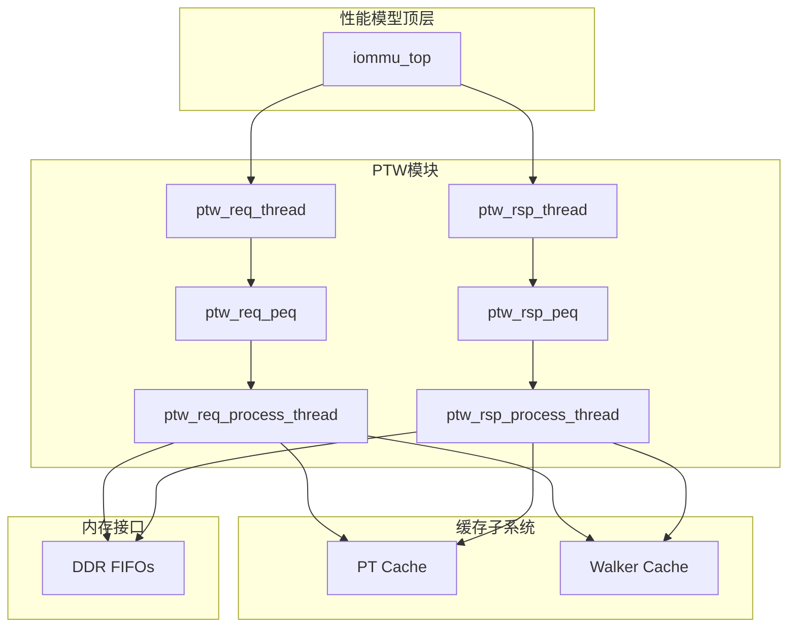
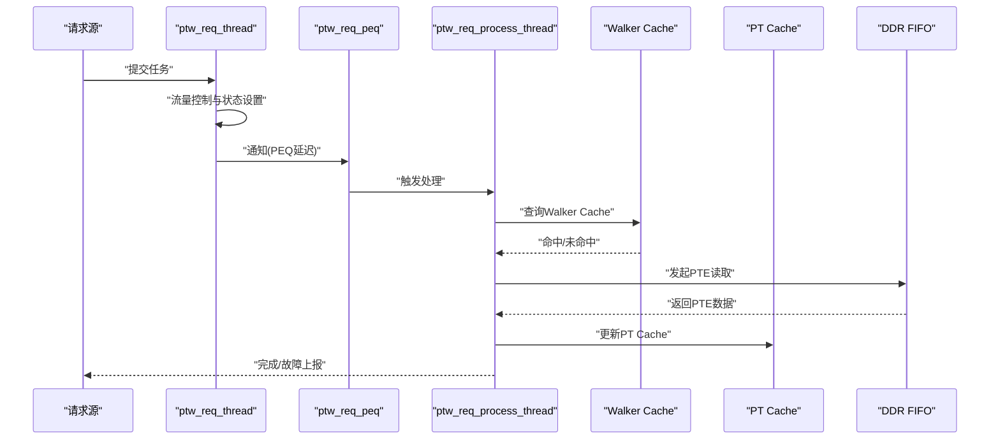
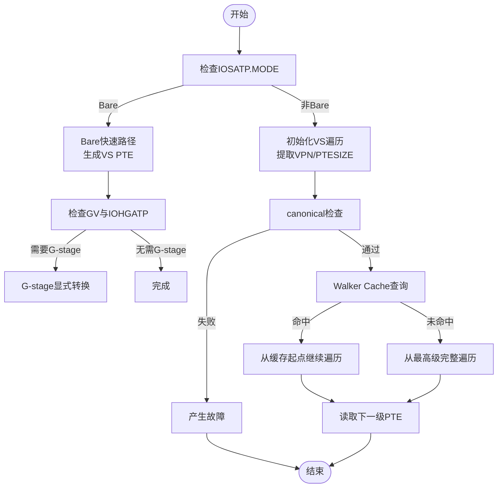
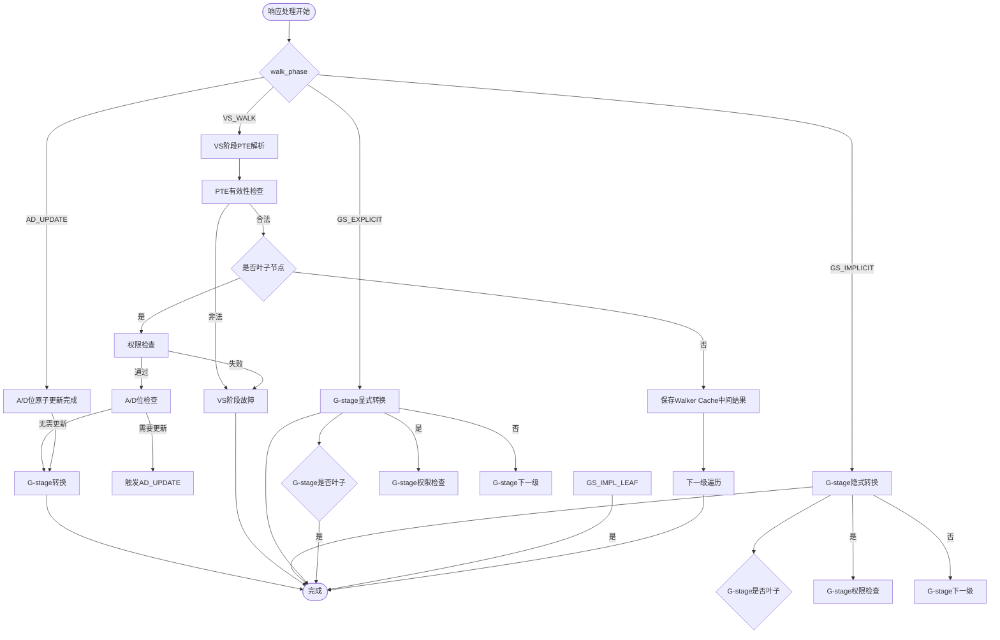
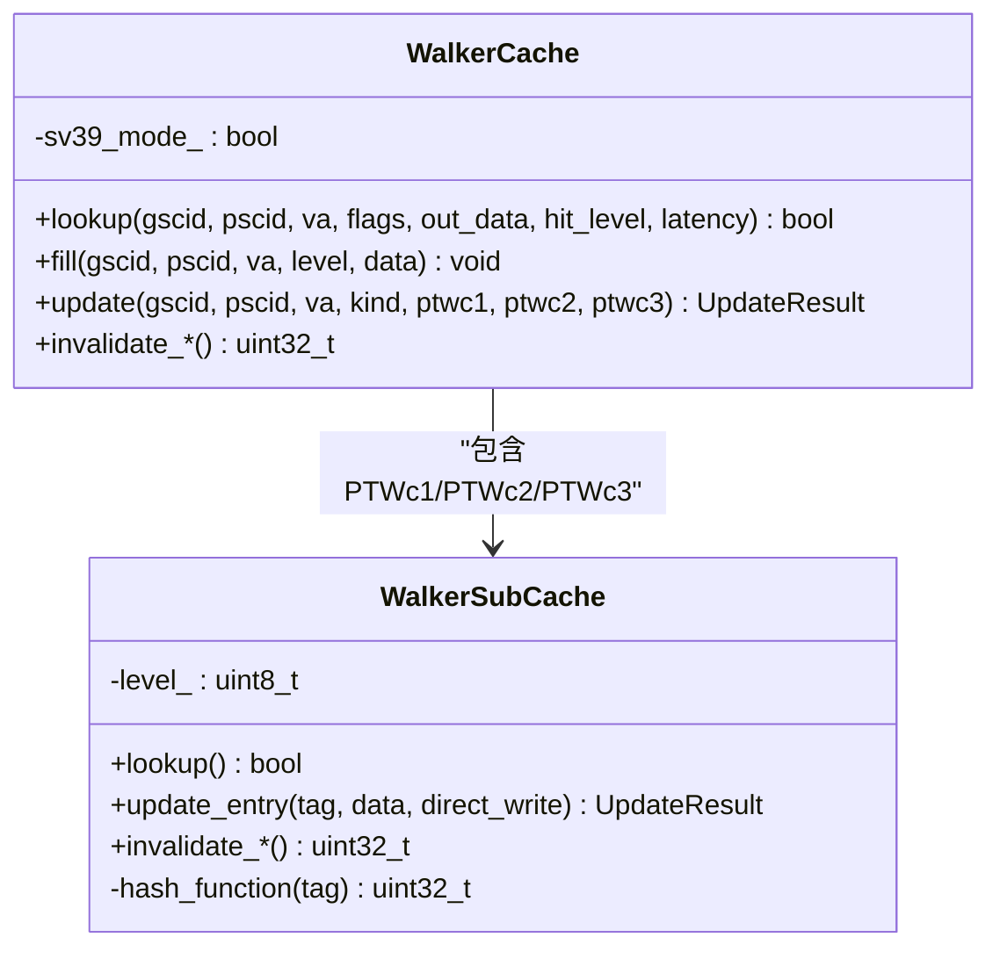
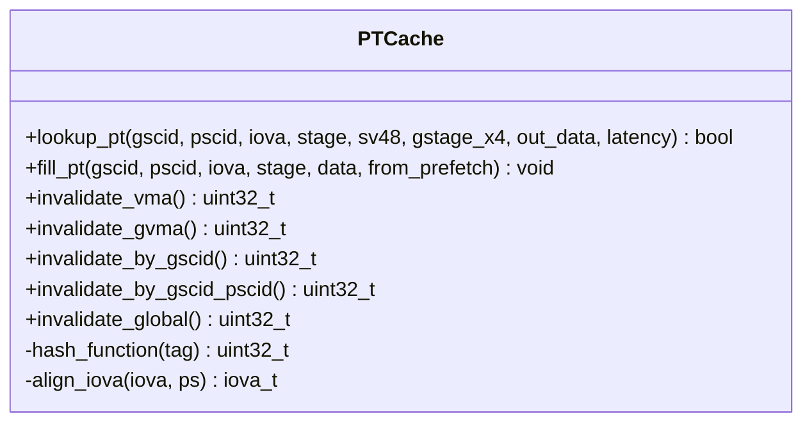
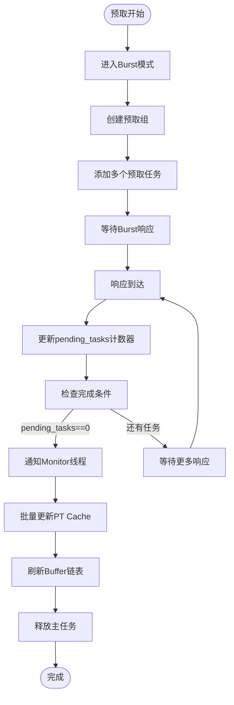
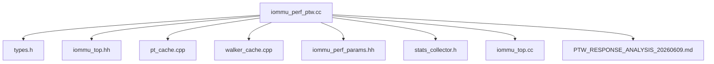

# PTW模块

<cite>
**本文档引用的文件**
- [iommu_perf_ptw.cc](file://iommu/iommu_perf_model/iommu_perf_ptw.cc)
- [pt_cache.cpp](file://iommu/cache_src/cache/pt_cache.cpp)
- [pt_cache.h](file://iommu/cache_src/cache/pt_cache.h)
- [walker_cache.cpp](file://iommu/cache_src/cache/walker_cache.cpp)
- [walker_cache.h](file://iommu/cache_src/cache/walker_cache.h)
- [iommu_translate.hh](file://iommu/include/iommu_translate.hh)
- [iommu_translate.cc](file://iommu/iommu_fun_model/iommu_translate.cc)
- [iommu_two_stage_trans.cc](file://iommu/iommu_fun_model/iommu_two_stage_trans.cc)
- [iommu_second_stage_trans.cc](file://iommu/iommu_fun_model/iommu_second_stage_trans.cc)
- [iommu_perf_params.hh](file://iommu/iommu_perf_model/iommu_perf_params.hh)
- [iommu_top.hh](file://iommu/iommu_top.hh)
- [types.h](file://iommu/cache_src/common/types.h)
- [stats_collector.h](file://iommu/cache_src/common/stats_collector.h)
- [stats_collector.cpp](file://iommu/cache_src/common/stats_collector.cpp)
- [iommu_top.cc](file://iommu\iommu_top.cc)
- [PTW_RESPONSE_ANALYSIS_20260609.md](file://PTW_RESPONSE_ANALYSIS_20260609.md)
</cite>

## 更新摘要
**变更内容**
- 修复PTW预取功能中的关键bug，包括pending_tasks计数器修正、Burst响应处理增强和Monitor线程协调机制改进
- 移除了串行延迟，采用PEQ（可取等待队列）实现非阻塞流水线
- 新增详细的统计收集机制，包括任务完成统计、DDR读取计数、执行时间统计
- 实现VA去重恢复功能，在PTW完成后自动恢复挂起的同页任务
- 增强性能监控能力，包括IOPS测量和稳态分析
- **新增**：峰值outstanding跟踪、单次DDR访问详细统计、任务延迟统计
- **新增**：端到端延迟分析和性能瓶颈识别功能

## 目录
1. [简介](#简介)
2. [项目结构](#项目结构)
3. [核心组件](#核心组件)
4. [架构概览](#架构概览)
5. [详细组件分析](#详细组件分析)
6. [依赖关系分析](#依赖关系分析)
7. [性能考虑](#性能考虑)
8. [故障排查指南](#故障排查指南)
9. [结论](#结论)

## 简介
本文件针对IOMMU性能模型中的PTW（Page Table Walker）模块进行全面技术文档化，重点阐述页表遍历在性能模型中的核心作用与实现机制。内容涵盖：
- IOTLB（PT Cache）与Walker Cache的协同工作机制
- 单级与两级地址转换的遍历流程
- 页表项验证与权限检查机制
- 遍历延迟计算、命中率优化与性能瓶颈分析方法
- VA去重与流水线控制策略
- **新增**：PEQ流水线、统计收集机制和性能监控功能
- **新增**：峰值outstanding跟踪、详细DDR访问统计和稳态IOPS分析
- **新增**：预取功能的Bug修复与性能优化

## 项目结构
PTW模块位于性能模型子系统中，与缓存子系统（DC/PC/PT/MSIPT/Walker）紧密协作，通过FIFO与PEQ（可取等待队列）实现非阻塞流水线处理。

**图表来源**
- [iommu_top.hh:237-260](file://iommu/iommu_top.hh#L237-L260)
- [iommu_perf_ptw.cc:13-31](file://iommu/iommu_perf_model/iommu_perf_ptw.cc#L13-L31)
- [iommu_perf_ptw.cc:213-220](file://iommu/iommu_perf_model/iommu_perf_ptw.cc#L213-L220)

**章节来源**
- [iommu_top.hh:237-260](file://iommu/iommu_top.hh#L237-L260)
- [iommu_perf_params.hh:102-111](file://iommu/iommu_perf_model/iommu_perf_params.hh#L102-L111)

## 核心组件
- PTW请求与响应线程：负责任务调度、流水线延迟与DDR请求/响应处理
- Walker Cache：缓存页表遍历中间结果，减少重复DDR访问
- PT Cache（IOTLB）：缓存最终翻译结果，支持VA去重与快速命中
- **新增**：PEQ（可取等待队列）：实现非阻塞流水线，替代串行延迟
- **新增**：统计收集器：提供详细的性能统计和监控功能
- **新增**：峰值outstanding跟踪：监控各模块的并发峰值
- **新增**：详细DDR访问统计：记录单次访问延迟和访问次数
- **新增**：预取功能：支持Burst模式的页表预取，提升遍历效率
- 参数配置：包括FIFO深度、outstanding限制、流水线延迟等

**章节来源**
- [iommu_perf_ptw.cc:13-31](file://iommu/iommu_perf_model/iommu_perf_ptw.cc#L13-L31)
- [iommu_perf_ptw.cc:213-220](file://iommu/iommu_perf_model/iommu_perf_ptw.cc#L213-L220)
- [iommu_perf_params.hh:102-111](file://iommu/iommu_perf_model/iommu_perf_params.hh#L102-L111)

## 架构概览
PTW模块采用双线程流水线设计，使用PEQ（可取等待队列）实现非阻塞并行处理：
- 请求线程（dispatch）：进行流量控制、PEQ延迟与任务状态切换
- 响应线程（process）：解析DDR响应、执行PTE解析与状态机推进

Walker Cache与PT Cache在PTW路径中协同工作，前者缓存遍历中间结果，后者缓存最终翻译结果并支持VA去重。

**图表来源**
- [iommu_perf_ptw.cc:13-31](file://iommu/iommu_perf_model/iommu_perf_ptw.cc#L13-L31)
- [iommu_perf_ptw.cc:213-220](file://iommu/iommu_perf_model/iommu_perf_ptw.cc#L213-L220)
- [walker_cache.cpp:264-319](file://iommu/cache_src/cache/walker_cache.cpp#L264-L319)
- [pt_cache.cpp:11-23](file://iommu/cache_src/cache/pt_cache.cpp#L11-L23)

## 详细组件分析

### PTW请求处理流程
- 流量控制：维护ptw_outstanding_task_count，超过阈值时等待完成事件
- **PEQ延迟**：通过PEQ延迟实现非阻塞流水线，替代串行延迟
- Bare模式快速路径：当iosatp.MODE为Bare时，直接生成VS PTE并可选进行G-stage显式转换
- Walker Cache集成：在VS阶段初始化时查询Walker Cache，命中则从缓存位置继续遍历
- canonical检查：对IOVA进行地址合法性检查，失败则直接产生故障
- **新增**：任务开始时间记录，用于执行时间统计
- **新增**：峰值outstanding跟踪，实时监控并发峰值

**图表来源**
- [iommu_perf_ptw.cc:44-98](file://iommu/iommu_perf_model/iommu_perf_ptw.cc#L44-L98)
- [iommu_perf_ptw.cc:100-206](file://iommu/iommu_perf_model/iommu_perf_ptw.cc#L100-L206)

**章节来源**
- [iommu_perf_ptw.cc:13-31](file://iommu/iommu_perf_model/iommu_perf_ptw.cc#L13-L31)
- [iommu_perf_ptw.cc:37-206](file://iommu/iommu_perf_model/iommu_perf_ptw.cc#L37-L206)

### PTW响应处理流程
- PTE解析：根据walk_phase区分VS/G阶段，解析PTE有效性、权限与超级页面
- 权限检查：严格遵循RISC-V特权规范，检查X/W/R位与U位、SUM位等
- A/D位处理：支持SADE/GADE硬件原子更新或故障产生
- Walker Cache更新：在VS非叶子节点处保存中间结果，供后续遍历复用
- G-stage隐式/显式转换：根据GV与IOHGATP决定转换路径
- **新增**：任务完成统计、DDR读取计数和执行时间统计
- **新增**：VA去重恢复功能，自动恢复挂起的同页任务
- **新增**：单次DDR访问详细统计，包括最大/最小延迟和平均延迟
- **新增**：任务延迟统计，记录最大/最小任务执行时间和平均执行时间

**图表来源**
- [iommu_perf_ptw.cc:226-722](file://iommu/iommu_perf_model/iommu_perf_ptw.cc#L226-L722)
- [iommu_perf_ptw.cc:494-691](file://iommu/iommu_perf_model/iommu_perf_ptw.cc#L494-L691)

**章节来源**
- [iommu_perf_ptw.cc:226-722](file://iommu/iommu_perf_model/iommu_perf_ptw.cc#L226-L722)

### Walker Cache实现机制
Walker Cache包含三个子表（PTWc_1/PTWc_2/PTWc_3），分别缓存不同级别的中间结果：
- PTWc_1：直接映射，缓存第一级（VPN[3]）中间结果（Sv48）
- PTWc_2：2路组相联，缓存第二级（VPN[2]）中间结果
- PTWc_3：4路组相联，缓存第三级（VPN[1]）中间结果

**图表来源**
- [walker_cache.h:15-92](file://iommu/cache_src/cache/walker_cache.h#L15-L92)
- [walker_cache.cpp:21-53](file://iommu/cache_src/cache/walker_cache.cpp#L21-L53)

**章节来源**
- [walker_cache.cpp:239-436](file://iommu/cache_src/cache/walker_cache.cpp#L239-L436)
- [walker_cache.h:11-92](file://iommu/cache_src/cache/walker_cache.h#L11-L92)

### PT Cache（IOTLB）实现机制
PT Cache作为IOTLB，缓存最终翻译结果，支持：
- 多阶段翻译（STAGE1_ONLY/STAGE2_ONLY/STAGE1_AND_2）
- SV48与G-stage x4模式标识
- VMA/GVMA精确/扫描/全局失效
- 页对齐（4K）存储与查找

**图表来源**
- [pt_cache.h:8-54](file://iommu/cache_src/cache/pt_cache.h#L8-L54)
- [pt_cache.cpp:5-145](file://iommu/cache_src/cache/pt_cache.cpp#L5-L145)

**章节来源**
- [pt_cache.cpp:11-145](file://iommu/cache_src/cache/pt_cache.cpp#L11-L145)
- [pt_cache.h:8-54](file://iommu/cache_src/cache/pt_cache.h#L8-L54)

### 地址转换与权限检查
- 两阶段地址转换：two_stage_address_translation与second_stage_address_translation
- 权限检查：严格遵循RISC-V特权规范，包括X/W/R位、U位、SUM位、ENS位等
- 超级页面校验：misaligned超级页面检测
- NAPOT PTE处理：特殊编码与PPN调整

**章节来源**
- [iommu_two_stage_trans.cc:8-600](file://iommu/iommu_fun_model/iommu_two_stage_trans.cc#L8-L600)
- [iommu_second_stage_trans.cc:7-424](file://iommu/iommu_fun_model/iommu_second_stage_trans.cc#L7-L424)
- [iommu_translate.hh:23-92](file://iommu/include/iommu_translate.hh#L23-L92)

### 预取功能与Bug修复

**新增** PTW模块实现了增强的预取功能，经过关键bug修复后显著提升了性能：

#### 预取功能架构
- **Burst模式**：支持批量预取多个PTE，减少内存访问次数
- **分组管理**：使用prefetch_groups管理预取任务组，支持多任务并发
- **Monitor线程**：专门负责预取组的协调和批量处理
- **pending_tasks计数器**：精确跟踪每个预取组的完成状态

#### 关键Bug修复

**问题1：pending_tasks计数器未减少**
- **现象**：Burst响应后只通知Monitor，但未减少`group.pending_tasks`计数器
- **影响**：Monitor检查条件`pending_tasks==0`永远不满足，批量更新和Buffer刷新永远不会执行
- **修复**：在PTW_PREFETCH_WAIT处理中添加`group.pending_tasks--`操作

**问题2：Monitor线程协调机制缺陷**
- **现象**：Monitor线程无法正确识别预取组的完成状态
- **修复**：改进Monitor线程的触发条件，确保只有当`pending_tasks==0 && completed==true`时才触发

**问题3：Burst响应处理增强**
- **现象**：Burst模式下的响应处理逻辑不够完善
- **修复**：增强了Burst响应的处理逻辑，确保所有预取任务都能正确完成

**图表来源**
- [PTW_RESPONSE_ANALYSIS_20260609.md:81-125](file://PTW_RESPONSE_ANALYSIS_20260609.md#L81-L125)
- [PTW_RESPONSE_ANALYSIS_20260609.md:235-253](file://PTW_RESPONSE_ANALYSIS_20260609.md#L235-L253)

#### 预取组管理机制

**章节来源**
- [PTW_RESPONSE_ANALYSIS_20260609.md:81-125](file://PTW_RESPONSE_ANALYSIS_20260609.md#L81-L125)
- [PTW_RESPONSE_ANALYSIS_20260609.md:235-253](file://PTW_RESPONSE_ANALYSIS_20260609.md#L235-L253)

### 性能监控与统计收集机制
**新增** PTW模块实现了全面的性能监控和统计收集机制：

#### 基础统计指标
- **ptw_total_completed**：PTW完成任务总数
- **ptw_total_ddr_reads**：所有PTW任务DDR读次数总和
- **ptw_total_exec_ns**：所有PTW任务执行延时总和（纳秒）
- **ptw_task_start_ns**：task_id -> PTW入口时刻（纳秒）

#### 峰值并发跟踪
- **peak_ptw_outstanding**：PTW模块并发任务峰值
- **peak_iommu_global_outstanding**：IOMMU全局并发峰值
- **peak_xdtw_dc_outstanding**：xDTW DC walk并发峰值
- **peak_xdtw_pc_outstanding**：xDTW PC walk并发峰值
- **peak_collector_dc_walk_outstanding**：Collector DC walk并发峰值
- **peak_collector_pc_walk_outstanding**：Collector PC walk并发峰值
- **peak_axi_master_1_outstanding**：DDR端口并发峰值
- **peak_axi_master_0_outstanding**：出口端口并发峰值

#### 单次DDR访问详细统计
- **ptw_max_ddr_latency_ns**：单次DDR访问最大延时（纳秒）
- **ptw_min_ddr_latency_ns**：单次DDR访问最小延时（纳秒）
- **ptw_total_ddr_latency_ns**：单次DDR访问总延时（纳秒）
- **ptw_ddr_latency_count**：DDR延时采样次数
- **ptw_max_ddr_reads**：单笔任务最大DDR访问次数
- **ptw_min_ddr_reads**：单笔任务最小DDR访问次数

#### 任务执行时间统计
- **ptw_max_task_latency_ns**：单笔任务最大执行延时（纳秒）
- **ptw_min_task_latency_ns**：单笔任务最小执行延时（纳秒）
- **ptw_total_exec_ns**：所有PTW任务执行延时总和（纳秒）

#### 稳态IOPS测量
- **steady_start_ns/steady_end_ns**：稳态开始/结束时刻（纳秒）
- **steady_start_count/steady_end_count**：稳态开始/结束时的完成数
- **STEADY_STATE_START_PERCENT/END_PERCENT**：稳态窗口百分比（默认10%/90%）

#### VA去重统计
- **va_dedup_hit_count**：去重命中次数
- **va_dedup_miss_count**：去重未命中次数

#### 端到端延迟分析
- **iommu_total_e2e_latency_ns**：所有IO端到端延时总和（纳秒）
- **avg_e2e_ns**：平均端到端延迟（纳秒）
- **avg_req_ns**：平均请求间隔时间（纳秒）

**章节来源**
- [iommu_top.hh:144-181](file://iommu/iommu_top.hh#L144-L181)
- [iommu_top.cc:558-617](file://iommu\iommu_top.cc#L558-L617)

### VA去重恢复功能
**新增** VA去重恢复功能确保同页内的重复请求能够高效处理：

#### 功能机制
- **去重表管理**：维护va_dedup_table，按页粒度缓存去重信息
- **挂起任务队列**：同一4K页内的重复任务会被挂起等待
- **批量恢复**：PTW完成后自动恢复所有挂起的同页任务
- **结果复制**：将已完成任务的翻译结果复制给挂起任务

#### 实现细节
- **去重键值**：由GSCID、PSCID和页地址组成
- **故障传播**：如果去重任务发生故障，挂起任务也会收到相同故障
- **性能优化**：避免重复的页表遍历，提高整体吞吐量

**章节来源**
- [iommu_top.cc:474-529](file://iommu\iommu_top.cc#L474-L529)
- [iommu_perf_ptw.cc:104-106](file://iommu/iommu_perf_model/iommu_perf_ptw.cc#L104-L106)
- [iommu_perf_ptw.cc:767-768](file://iommu/iommu_perf_model/iommu_perf_ptw.cc#L767-L768)
- [iommu_perf_ptw.cc:814-815](file://iommu/iommu_perf_model/iommu_perf_ptw.cc#L814-L815)

## 依赖关系分析
PTW模块与缓存子系统的依赖关系如下：

**图表来源**
- [iommu_perf_ptw.cc:1-10](file://iommu/iommu_perf_model/iommu_perf_ptw.cc#L1-L10)
- [types.h:1-20](file://iommu/cache_src/common/types.h#L1-L20)
- [iommu_top.hh:1-30](file://iommu/iommu_top.hh#L1-L30)
- [pt_cache.cpp:1-10](file://iommu/cache_src/cache/pt_cache.cpp#L1-L10)
- [walker_cache.cpp:1-10](file://iommu/cache_src/cache/walker_cache.cpp#L1-L10)
- [iommu_perf_params.hh:1-20](file://iommu/iommu_perf_model/iommu_perf_params.hh#L1-L20)
- [stats_collector.h:1-20](file://iommu/cache_src/common/stats_collector.h#L1-L20)
- [iommu_top.cc:1-30](file://iommu\iommu_top.cc#L1-L30)
- [PTW_RESPONSE_ANALYSIS_20260609.md:1-50](file://PTW_RESPONSE_ANALYSIS_20260609.md#L1-L50)

**章节来源**
- [iommu_perf_ptw.cc:1-10](file://iommu/iommu_perf_model/iommu_perf_ptw.cc#L1-L10)
- [types.h:1-20](file://iommu/cache_src/common/types.h#L1-L20)
- [iommu_top.hh:1-30](file://iommu/iommu_top.hh#L1-L30)

## 性能考虑
- **PEQ流水线**：PTW请求/响应流水线延迟分别为10ns，PEQ实现非阻塞并行
- **outstanding限制**：PTW_MAX_OUTSTANDING_TASKS为256，避免内存带宽拥塞
- **FIFO深度**：PTW请求/响应DDR FIFO深度为256，满足高并发需求
- **Walker Cache命中**：启用PTW_WALKER_CACHE_ENABLED可显著减少重复PTE读取
- **VA去重**：PT_CACHE_VA_DEDUP_ENABLED开启时，同一4K页内的重复请求可合并处理
- **缓存延迟**：PT Cache命中延迟为3ns，远小于一次PTE读取延迟
- **统计开销**：新增的统计收集机制对性能影响极小，提供重要的性能洞察
- **内存带宽**：通过outstanding限制和FIFO深度优化，避免内存带宽拥塞
- **峰值监控**：实时跟踪各模块并发峰值，帮助识别性能瓶颈
- **详细DDR统计**：提供单次访问延迟和访问次数的详细分析
- **稳态分析**：通过跳过10%预热和10%尾声的数据，提供准确的稳态IOPS测量
- **预取优化**：经过Bug修复后的预取功能显著提升了Burst模式下的性能表现

**章节来源**
- [iommu_perf_params.hh:102-131](file://iommu/iommu_perf_model/iommu_perf_params.hh#L102-L131)
- [iommu_perf_params.hh:111-114](file://iommu/iommu_perf_model/iommu_perf_params.hh#L111-L114)

## 故障排查指南
常见问题与诊断方法：
- canonical检查失败：检查IOVA高位扩展与SXL配置
- PTE有效性检查失败：确认V/R/W位组合与PBMT设置
- 权限检查失败：核对X/W/R位与U位、SUM位、ENS位
- A/D位更新失败：检查SADE/GADE配置与G-stage写权限
- Walker Cache污染：确认无效中间结果不会写入缓存
- **新增**：统计异常：检查ptw_total_ddr_reads和ptw_total_exec_ns计数器
- **新增**：VA去重问题：验证va_dedup_table中是否有挂起任务未被恢复
- **新增**：并发峰值过高：检查peak_ptw_outstanding是否达到PTW_MAX_OUTSTANDING_TASKS限制
- **新增**：DDR延迟异常：分析ptw_max_ddr_latency_ns和ptw_min_ddr_latency_ns的差异
- **新增**：稳态IOPS异常：检查STEADY_STATE_START_PERCENT和STEADY_STATE_END_PERCENT配置
- **新增**：预取功能故障：检查pending_tasks计数器是否正确递减，Monitor线程是否正常触发
- **新增**：Burst响应处理问题：验证Burst模式下的响应处理逻辑是否完整

**章节来源**
- [iommu_perf_ptw.cc:129-148](file://iommu/iommu_perf_model/iommu_perf_ptw.cc#L129-L148)
- [iommu_perf_ptw.cc:267-273](file://iommu/iommu_perf_model/iommu_perf_ptw.cc#L267-L273)
- [walker_cache.cpp:60-71](file://iommu/cache_src/cache/walker_cache.cpp#L60-L71)

## 结论
PTW模块通过PEQ流水线、Walker Cache中间结果缓存与PT Cache最终结果缓存，实现了高效的页表遍历性能模型。**最新的性能优化改进包括**：
- **PEQ流水线**：完全移除串行延迟，实现真正的非阻塞并行处理
- **详细统计**：提供任务完成统计、DDR读取计数、执行时间统计等全面性能指标
- **VA去重恢复**：自动恢复挂起的同页任务，避免重复遍历
- **增强监控**：支持稳态IOPS测量和端到端延迟分析
- **峰值跟踪**：实时监控各模块并发峰值，帮助识别性能瓶颈
- **详细DDR分析**：提供单次访问延迟和访问次数的精确统计
- **端到端分析**：支持从请求到响应的完整延迟分析
- **预取功能优化**：经过关键Bug修复后，预取功能的性能和稳定性得到显著提升

**特别重要的是**，本次更新修复了PTW预取功能中的关键bug，包括：
- **pending_tasks计数器修正**：确保预取组的完成状态能够正确传递给Monitor线程
- **Burst响应处理增强**：完善了Burst模式下的响应处理逻辑
- **Monitor线程协调机制改进**：提高了预取组协调的可靠性和效率

这些改进使得PTW模块在保持功能正确性的同时，显著提升了性能表现和可观测性。在实际部署中，应重点关注PEQ配置、统计收集机制和VA去重功能的启用，以及利用新增的性能监控工具进行系统级的性能分析和优化。通过充分利用这些统计指标，开发者可以更好地理解系统性能特征，识别瓶颈并制定针对性的优化策略。