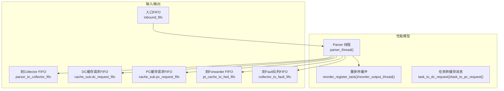
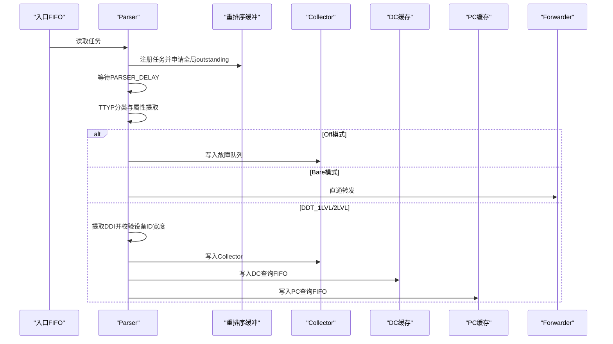
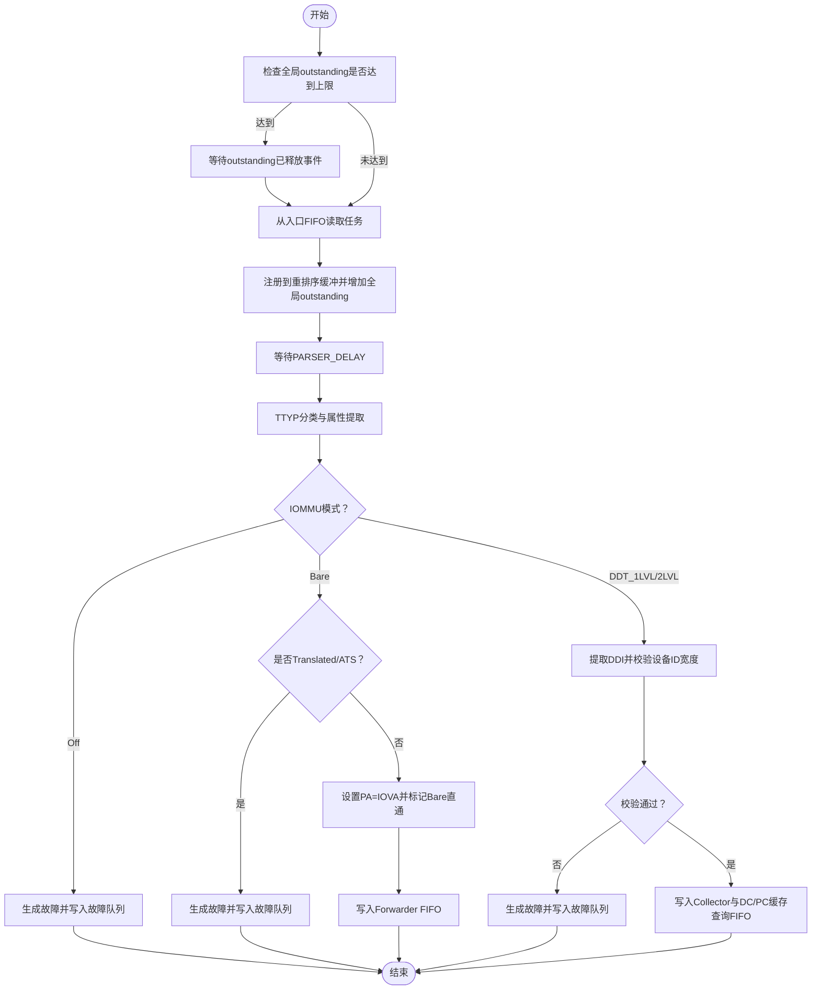
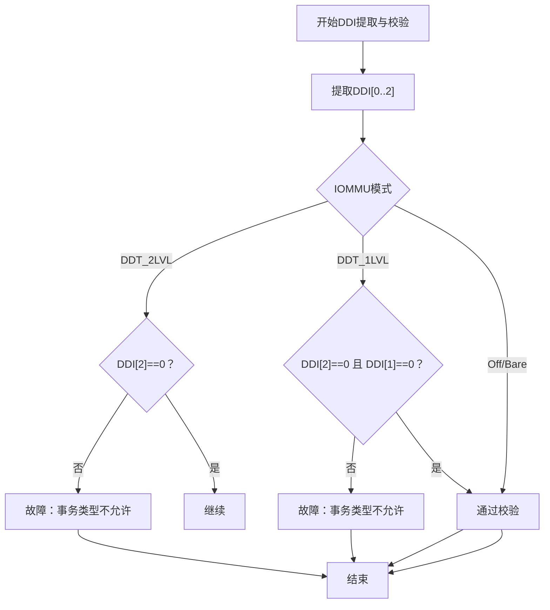
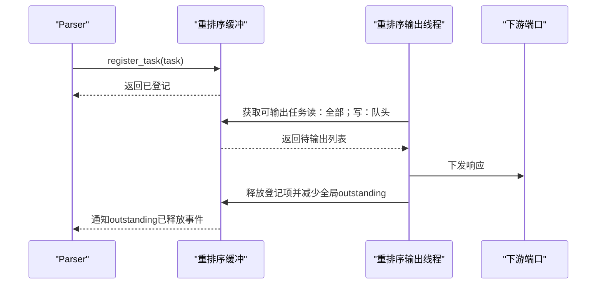
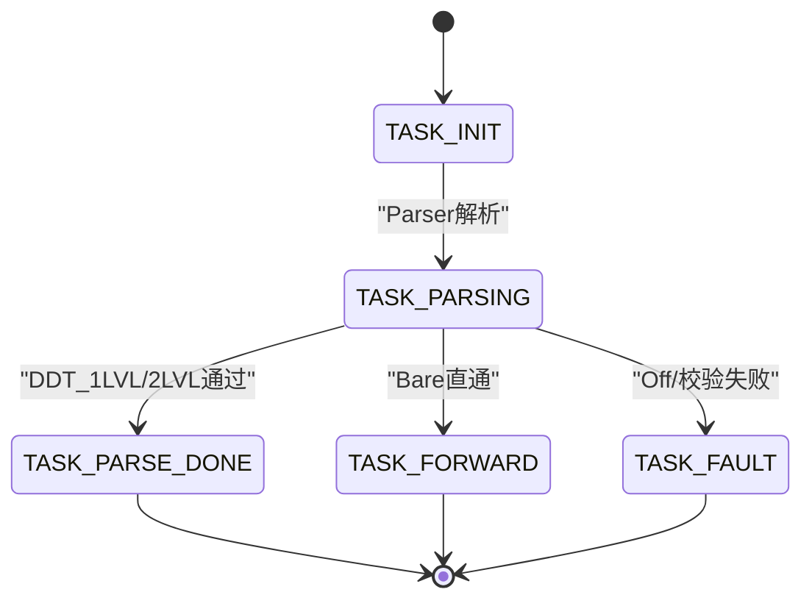
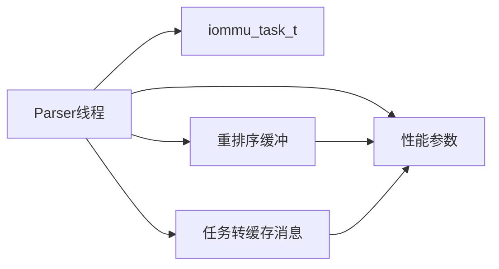

# Parser模块

<cite>
**本文引用的文件**
- [iommu_perf_parser.cc](file://iommu/iommu_perf_model/iommu_perf_parser.cc)
- [iommu_task.hh](file://iommu/include/iommu_task.hh)
- [iommu_perf_reorder.cc](file://iommu/iommu_perf_model/iommu_perf_reorder.cc)
- [iommu_task_cache_convert.cc](file://iommu/iommu_perf_model/iommu_task_cache_convert.cc)
- [iommu_perf_params.hh](file://iommu/iommu_perf_model/iommu_perf_params.hh)
- [iommu_perf_model.hh](file://iommu/include/iommu_perf_model.hh)
- [iommu_translate.hh](file://iommu/include/iommu_translate.hh)
- [iommu_registers.hh](file://iommu/include/iommu_registers.hh)
</cite>

## 目录
1. [简介](#简介)
2. [项目结构](#项目结构)
3. [核心组件](#核心组件)
4. [架构总览](#架构总览)
5. [详细组件分析](#详细组件分析)
6. [依赖关系分析](#依赖关系分析)
7. [性能考量](#性能考量)
8. [故障排查指南](#故障排查指南)
9. [结论](#结论)

## 简介
本文件系统性阐述Parser模块在IOMMU性能模型中的职责、工作流程与关键实现细节。Parser线程负责从入口FIFO读取任务，执行请求解析、分类与预处理，依据IOMMU模式（Off、Bare、DDT_1LVL、DDT_2LVL）进行条件分支与设备ID宽度校验，并将任务分发至Collector与缓存查询子系统，同时与重排序缓冲区（reorder buffer）协作完成全局outstanding反压与有序输出。文档还给出PARSER_DELAY的作用与优化策略，并提供性能延迟分析。

## 项目结构
Parser模块位于性能模型子目录中，与任务结构、重排序、缓存转换工具等紧密耦合：
- 性能模型线程与接口：parser_thread、reorder_register_task、reorder_output_thread
- 任务数据结构：iommu_task_t及其状态机
- 缓存转换：task_to_dc_request、task_to_pc_request等
- 参数配置：PARSER_DELAY、IOMMU_GLOBAL_MAX_OUTSTANDING等

**图示来源**
- [iommu_perf_parser.cc:9-121](file://iommu/iommu_perf_model/iommu_perf_parser.cc#L9-L121)
- [iommu_perf_reorder.cc:26-183](file://iommu/iommu_perf_model/iommu_perf_reorder.cc#L26-L183)
- [iommu_task_cache_convert.cc:12-44](file://iommu/iommu_perf_model/iommu_task_cache_convert.cc#L12-L44)

**章节来源**
- [iommu_perf_parser.cc:1-122](file://iommu/iommu_perf_model/iommu_perf_parser.cc#L1-L122)
- [iommu_task.hh:14-42](file://iommu/include/iommu_task.hh#L14-L42)
- [iommu_perf_reorder.cc:1-184](file://iommu/iommu_perf_model/iommu_perf_reorder.cc#L1-L184)
- [iommu_task_cache_convert.cc:1-427](file://iommu/iommu_perf_model/iommu_task_cache_convert.cc#L1-L427)

## 核心组件
- Parser线程：完成全局outstanding反压、从入口FIFO读取任务、注册重排序、状态迁移、模式判定与设备ID宽度校验、向Collector与缓存子系统分发任务。
- 重排序缓冲：在Parser入口注册任务，维护全局outstanding计数；在输出端按写保序与读乱序规则输出响应。
- 任务结构与状态机：统一的任务上下文，包含请求分类字段、上下文字段、翻译结果字段、管道状态与遍历上下文。
- 缓存转换工具：将任务转换为DC/PC/PT/Walker等缓存消息，驱动缓存子系统查询与更新。

**章节来源**
- [iommu_task.hh:121-212](file://iommu/include/iommu_task.hh#L121-L212)
- [iommu_perf_reorder.cc:26-80](file://iommu/iommu_perf_model/iommu_perf_reorder.cc#L26-L80)
- [iommu_task_cache_convert.cc:12-44](file://iommu/iommu_perf_model/iommu_task_cache_convert.cc#L12-L44)

## 架构总览
Parser在IOMMU性能模型中的位置与交互如下：

**图示来源**
- [iommu_perf_parser.cc:9-121](file://iommu/iommu_perf_model/iommu_perf_parser.cc#L9-L121)
- [iommu_perf_reorder.cc:26-47](file://iommu/iommu_perf_model/iommu_perf_reorder.cc#L26-L47)
- [iommu_task_cache_convert.cc:12-44](file://iommu/iommu_perf_model/iommu_task_cache_convert.cc#L12-L44)

## 详细组件分析

### Parser线程工作流程
- 全局outstanding反压：当全局outstanding达到上限时，等待“outstanding已释放”事件，避免系统过载。
- 从入口FIFO读取任务并注册到重排序缓冲，随后进入解析阶段。
- 解析阶段等待PARSER_DELAY纳秒，模拟解析开销。
- TTYP分类与访问属性提取，确保后续逻辑基于准确的事务类型与属性。
- 模式判定与设备ID宽度校验：
  - Off模式：禁止所有入站事务，直接生成故障。
  - Bare模式：若为Translated或ATS请求则故障；否则直接将IOVA作为物理地址透传。
  - DDT_1LVL/2LVL：提取DDI并校验设备ID宽度，不符合规格则故障。
- 分发阶段：向Collector写入任务，同时转换为DC/PC缓存查询消息并写入对应FIFO。

**图示来源**
- [iommu_perf_parser.cc:9-121](file://iommu/iommu_perf_model/iommu_perf_parser.cc#L9-L121)
- [iommu_perf_params.hh:122-138](file://iommu/iommu_perf_model/iommu_perf_params.hh#L122-L138)

**章节来源**
- [iommu_perf_parser.cc:9-121](file://iommu/iommu_perf_model/iommu_perf_parser.cc#L9-L121)
- [iommu_perf_model.hh:9-41](file://iommu/include/iommu_perf_model.hh#L9-L41)
- [iommu_perf_params.hh:122-138](file://iommu/iommu_perf_model/iommu_perf_params.hh#L122-L138)

### 请求解析与分类
- TTYP分类：根据地址类型（未翻译/已翻译/ATS）、读写AMO与执行请求组合确定事务类型。
- 访问属性提取：区分读/写/执行、特权级别等，为后续权限检查与翻译阶段提供依据。

**章节来源**
- [iommu_perf_model.hh:9-41](file://iommu/include/iommu_perf_model.hh#L9-L41)

### 设备ID宽度验证与DDI提取
- DDI提取：根据能力寄存器中的MSI扁平模式选择不同的位段提取策略。
- 宽度校验：
  - DDT_2LVL：要求DDI[2]为0，否则故障。
  - DDT_1LVL：要求DDI[2]与DDI[1]均为0，否则故障。

**图示来源**
- [iommu_perf_parser.cc:74-98](file://iommu/iommu_perf_model/iommu_perf_parser.cc#L74-L98)
- [iommu_perf_model.hh:45-55](file://iommu/include/iommu_perf_model.hh#L45-L55)

**章节来源**
- [iommu_perf_parser.cc:74-98](file://iommu/iommu_perf_model/iommu_perf_parser.cc#L74-L98)
- [iommu_perf_model.hh:45-55](file://iommu/include/iommu_perf_model.hh#L45-L55)

### 与重排序缓冲的交互机制
- 入口注册：Parser在读取任务后立即调用重排序注册函数，分配全局outstanding槽位，记录写/读属性，并将任务登记到重排序表。
- 输出消费：重排序输出线程按规则消费：
  - 读请求：到达即输出（乱序）。
  - 写请求：严格按task_id单调保序输出（FIFO）。
- 全局outstanding释放：每次成功输出后释放全局outstanding，并通知Parser继续调度。

**图示来源**
- [iommu_perf_reorder.cc:26-183](file://iommu/iommu_perf_model/iommu_perf_reorder.cc#L26-L183)

**章节来源**
- [iommu_perf_reorder.cc:19-80](file://iommu/iommu_perf_model/iommu_perf_reorder.cc#L19-L80)

### 任务状态转换
Parser在解析阶段将任务状态推进到TASK_PARSING，随后根据模式与校验结果进入不同状态：
- Off/Bare模式：直接进入TASK_FORWARD或TASK_FAULT。
- DDT_1LVL/2LVL：进入TASK_PARSE_DONE，等待后续Collector与缓存查询。

**图示来源**
- [iommu_task.hh:14-42](file://iommu/include/iommu_task.hh#L14-L42)
- [iommu_perf_parser.cc:24-102](file://iommu/iommu_perf_model/iommu_perf_parser.cc#L24-L102)

**章节来源**
- [iommu_task.hh:14-42](file://iommu/include/iommu_task.hh#L14-L42)
- [iommu_perf_parser.cc:24-102](file://iommu/iommu_perf_model/iommu_perf_parser.cc#L24-L102)

### 与缓存子系统的交互
- Parser将任务写入Collector与DC/PC缓存查询FIFO，以启动上下文查找与页表缓存查询。
- 通过任务到缓存消息转换函数，将任务字段映射为缓存消息的路由键与阶段信息。

**章节来源**
- [iommu_perf_parser.cc:106-120](file://iommu/iommu_perf_model/iommu_perf_parser.cc#L106-L120)
- [iommu_task_cache_convert.cc:12-44](file://iommu/iommu_perf_model/iommu_task_cache_convert.cc#L12-L44)

### IOMMU模式与事务类型的处理
- Off模式：禁止所有入站事务，直接故障。
- Bare模式：仅允许未翻译或ATS请求；其余类型故障；Bare直通时设置PA=IOVA并标记直通。
- DDT_1LVL/2LVL：提取DDI并校验设备ID宽度，不符合规格则故障；通过后进入后续翻译流程。

**章节来源**
- [iommu_perf_parser.cc:31-98](file://iommu/iommu_perf_model/iommu_perf_parser.cc#L31-L98)
- [iommu_translate.hh:17-22](file://iommu/include/iommu_translate.hh#L17-L22)

## 依赖关系分析
Parser模块的关键依赖与耦合点：
- 任务状态枚举与字段：iommu_task_t定义了Parser所需的所有分类与上下文字段。
- 重排序缓冲：Parser在解析前必须注册任务并增加全局outstanding，解析后由重排序输出线程释放。
- 缓存转换工具：Parser将任务转换为DC/PC查询消息，驱动缓存子系统。
- 参数配置：PARSER_DELAY、IOMMU_GLOBAL_MAX_OUTSTANDING等影响吞吐与延迟。

**图示来源**
- [iommu_task.hh:121-212](file://iommu/include/iommu_task.hh#L121-L212)
- [iommu_perf_reorder.cc:26-47](file://iommu/iommu_perf_model/iommu_perf_reorder.cc#L26-L47)
- [iommu_task_cache_convert.cc:12-44](file://iommu/iommu_perf_model/iommu_task_cache_convert.cc#L12-L44)
- [iommu_perf_params.hh:122-138](file://iommu/iommu_perf_model/iommu_perf_params.hh#L122-L138)

**章节来源**
- [iommu_task.hh:121-212](file://iommu/include/iommu_task.hh#L121-L212)
- [iommu_perf_reorder.cc:26-47](file://iommu/iommu_perf_model/iommu_perf_reorder.cc#L26-L47)
- [iommu_task_cache_convert.cc:12-44](file://iommu/iommu_perf_model/iommu_task_cache_convert.cc#L12-L44)
- [iommu_perf_params.hh:122-138](file://iommu/iommu_perf_model/iommu_perf_params.hh#L122-L138)

## 性能考量
- PARSER_DELAY的作用：模拟解析阶段的固定延迟，保证仿真时间精度与流水线节奏稳定。
- 全局outstanding上限：IOMMU_GLOBAL_MAX_OUTSTANDING限制整体并发，防止缓存与下游端口拥塞。
- 重排序输出延迟：REORDER_OUTPUT_DELAY用于维持输出节拍，配合端口带宽控制实现稳定的吞吐。
- 缓存命中延迟：DC/PC/PT/MSIPT缓存命中延迟参数影响后续翻译阶段的总延迟。
- 优化策略：
  - 合理设置PARSER_DELAY以平衡解析精度与吞吐。
  - 控制入口FIFO深度与重排序缓冲深度，避免阻塞与溢出。
  - 通过缓存命中率优化降低PTW/MSIPTW开销。
  - 在高负载场景下，适当提高全局outstanding上限并结合下游端口并发限制进行调优。

**章节来源**
- [iommu_perf_params.hh:122-138](file://iommu/iommu_perf_model/iommu_perf_params.hh#L122-L138)
- [iommu_perf_reorder.cc:134-170](file://iommu/iommu_perf_model/iommu_perf_reorder.cc#L134-L170)

## 故障排查指南
- Off模式误触发：确认ddtp.iommu_mode配置正确，避免将合法请求误判为Off。
- Bare模式异常：检查地址类型与请求类型，确保未出现Translated或ATS请求。
- DDI宽度校验失败：核对设备ID位宽与IOMMU模式匹配关系，确保DDI[2]/DDI[1]符合1LVL/2LVL要求。
- 全局outstanding卡死：检查重排序输出线程是否正常消费，确认“outstanding已释放事件”被正确通知。
- 任务状态异常：核对Parser状态转换逻辑，确保在Off/Bare/DDT模式下的状态迁移正确。

**章节来源**
- [iommu_perf_parser.cc:31-98](file://iommu/iommu_perf_model/iommu_perf_parser.cc#L31-L98)
- [iommu_perf_reorder.cc:166-170](file://iommu/iommu_perf_model/iommu_perf_reorder.cc#L166-L170)

## 结论
Parser模块在IOMMU性能模型中承担“请求解析—分类—预处理—分发”的关键角色。通过严格的模式判定与设备ID宽度校验，Parser确保只有合法请求进入后续翻译与缓存查询阶段；借助重排序缓冲与全局outstanding控制，Parser实现了高吞吐与有序输出的平衡。合理配置PARSER_DELAY与全局上限、优化缓存命中率与输出节拍，是获得稳定性能的关键。