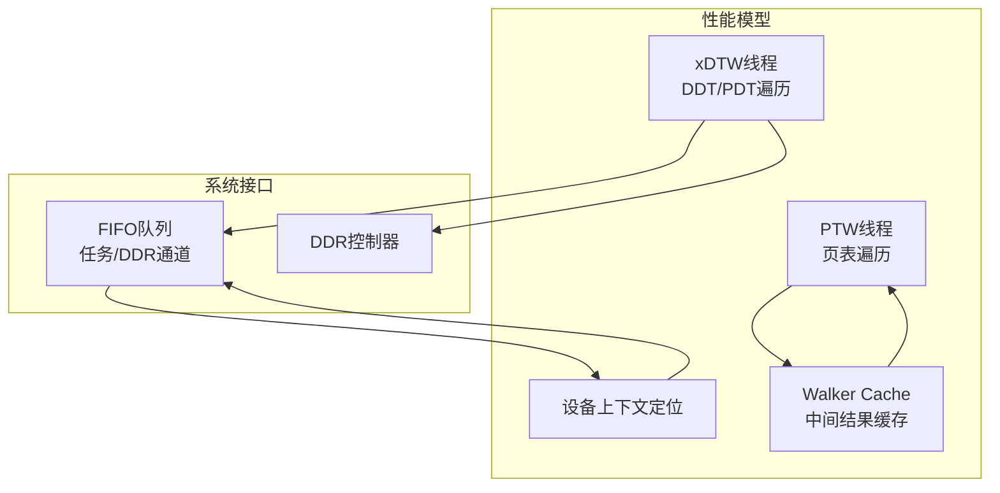
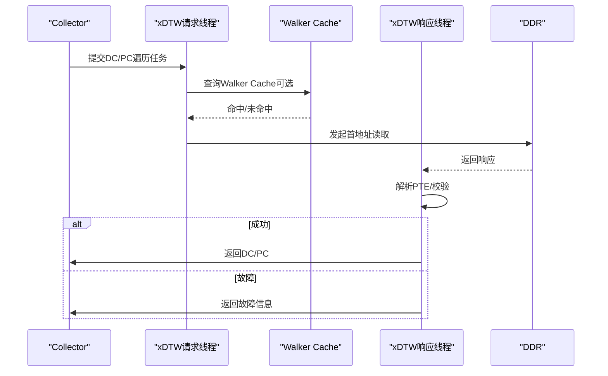
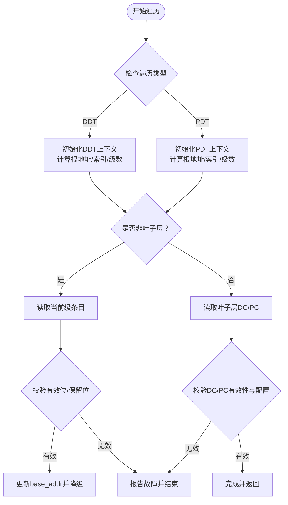
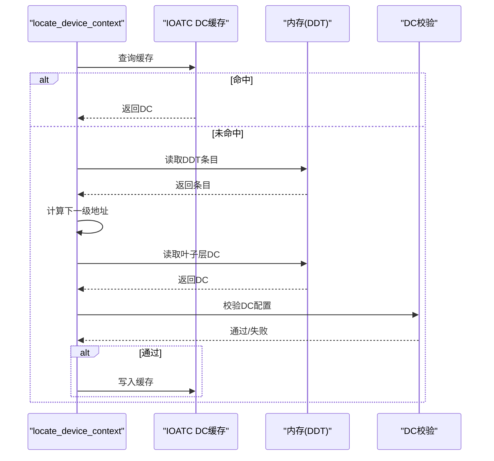
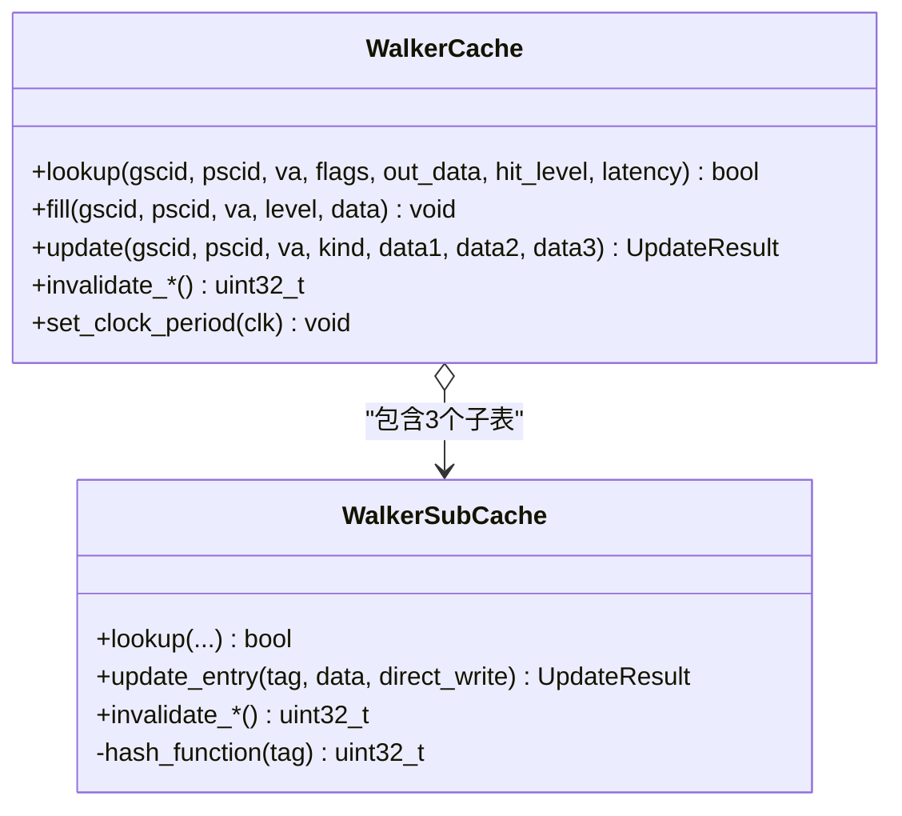
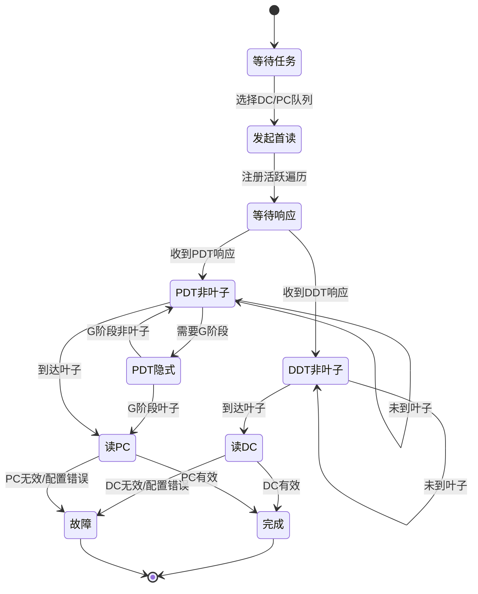
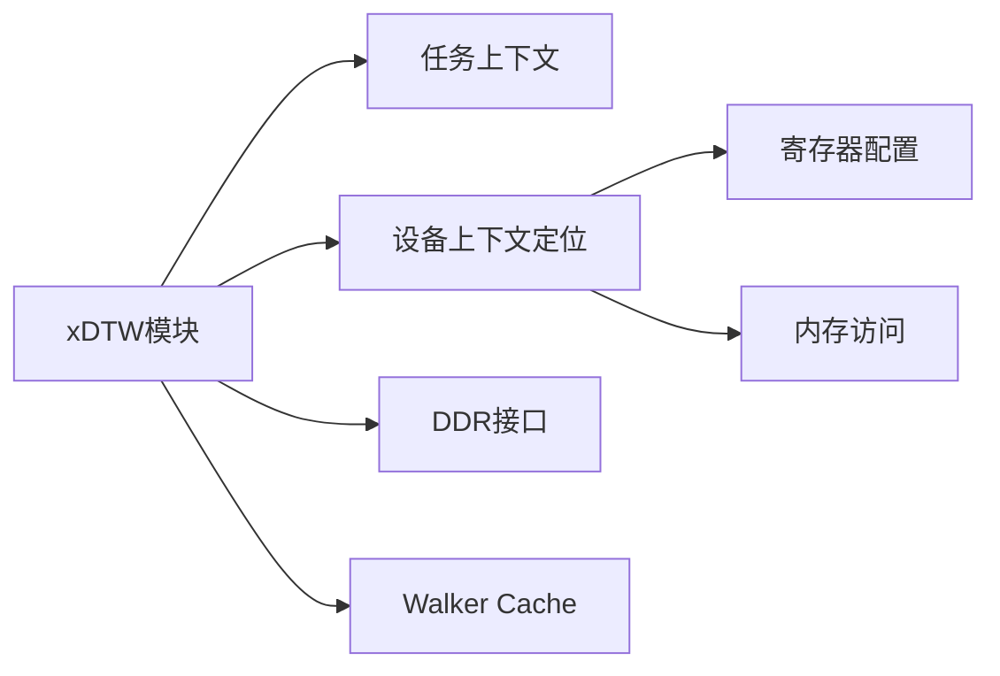

# xDTW模块

<cite>
**本文档引用的文件**
- [iommu_perf_xdtw.cc](file://iommu/iommu_perf_model/iommu_perf_xdtw.cc)
- [iommu_device_context.cc](file://iommu/iommu_perf_model/iommu_device_context.cc)
- [iommu_perf_model.hh](file://iommu/iommu_perf_model/iommu_perf_model.hh)
- [iommu_perf_params.hh](file://iommu/iommu_perf_model/iommu_perf_params.hh)
- [iommu_task.hh](file://iommu/include/iommu_task.hh)
- [iommu_top.hh](file://iommu/iommu_top.hh)
- [walker_cache.h](file://iommu/cache_src/cache/walker_cache.h)
- [walker_cache.cpp](file://iommu/cache_src/cache/walker_cache.cpp)
- [WALKER_CACHE_INTEGRATION_PLAN.md](file://WALKER_CACHE_INTEGRATION_PLAN.md)
</cite>

## 目录
1. [简介](#简介)
2. [项目结构](#项目结构)
3. [核心组件](#核心组件)
4. [架构概览](#架构概览)
5. [详细组件分析](#详细组件分析)
6. [依赖关系分析](#依赖关系分析)
7. [性能考量](#性能考量)
8. [故障排查指南](#故障排查指南)
9. [结论](#结论)

## 简介
本文件系统性阐述xDTW（扩展设备上下文遍历）模块在IOMMU性能模型中的实现与优化策略。xDTW负责执行DDT（设备目录表）与PDT（进程目录表）的树形遍历，定位设备上下文（DC）与进程上下文（PC）。本文重点说明：
- DDT/PDT树遍历机制与Radix树实现
- 设备上下文查找过程与校验流程
- 与Walker Cache的协作以优化遍历性能
- 遍历延迟分析、性能优化技术与故障处理策略

## 项目结构
xDTW模块位于IOMMU性能模型子系统中，采用SystemC并发线程模型，通过FIFO在模块间传递任务与DDR请求/响应。关键文件组织如下：
- 性能模型实现：iommu/iommu_perf_model/iommu_perf_xdtw.cc
- 设备上下文定位算法：iommu/iommu_perf_model/iommu_device_context.cc
- 通用性能工具与常量：iommu/iommu_perf_model/iommu_perf_model.hh, iommu/iommu_perf_model/iommu_perf_params.hh
- 任务与遍历上下文：iommu/include/iommu_task.hh
- 系统顶层与并发控制：iommu/iommu_top.hh
- Walker Cache缓存子系统：iommu/cache_src/cache/walker_cache.{h,cpp}
- Walker Cache集成方案：WALKER_CACHE_INTEGRATION_PLAN.md

图表来源
- [iommu_perf_xdtw.cc:12-131](file://iommu/iommu_perf_xdtw.cc#L12-L131)
- [iommu_device_context.cc:9-229](file://iommu/iommu_perf_model/iommu_device_context.cc#L9-L229)
- [walker_cache.cpp:239-345](file://iommu/cache_src/cache/walker_cache.cpp#L239-L345)

章节来源
- [iommu_perf_xdtw.cc:1-367](file://iommu/iommu_perf_model/iommu_perf_xdtw.cc#L1-L367)
- [iommu_device_context.cc:1-419](file://iommu/iommu_perf_model/iommu_device_context.cc#L1-L419)
- [iommu_perf_model.hh:1-197](file://iommu/iommu_perf_model/iommu_perf_model.hh#L1-L197)
- [iommu_perf_params.hh:1-160](file://iommu/iommu_perf_model/iommu_perf_params.hh#L1-L160)
- [iommu_task.hh:1-307](file://iommu/include/iommu_task.hh#L1-L307)
- [iommu_top.hh:1-200](file://iommu/iommu_top.hh#L1-L200)
- [walker_cache.h:1-129](file://iommu/cache_src/cache/walker_cache.h#L1-L129)
- [walker_cache.cpp:1-524](file://iommu/cache_src/cache/walker_cache.cpp#L1-L524)
- [WALKER_CACHE_INTEGRATION_PLAN.md:1-773](file://WALKER_CACHE_INTEGRATION_PLAN.md#L1-L773)

## 核心组件
- xDTW请求线程（xdtw_req_thread）：初始化遍历上下文，计算首地址，发起DDR请求，并维护并发控制。
- xDTW响应线程（xdtw_rsp_thread）：处理DDR响应，推进遍历状态机，完成DC/PC校验或故障处理。
- 设备上下文定位（locate_device_context）：实现DDT Radix树遍历与DC校验。
- Walker Cache：缓存PTW中间结果，减少重复页表访问。
- 任务与遍历上下文（iommu_task_t, walk_context_t）：承载遍历状态、地址索引与中间结果。

章节来源
- [iommu_perf_xdtw.cc:12-131](file://iommu/iommu_perf_xdtw.cc#L12-L131)
- [iommu_perf_xdtw.cc:138-366](file://iommu/iommu_perf_xdtw.cc#L138-L366)
- [iommu_device_context.cc:9-229](file://iommu/iommu_perf_model/iommu_device_context.cc#L9-L229)
- [iommu_task.hh:75-118](file://iommu/include/iommu_task.hh#L75-L118)
- [walker_cache.h:15-92](file://iommu/cache_src/cache/walker_cache.h#L15-L92)

## 架构概览
xDTW在IOMMU性能模型中的位置与交互如下：
- 输入：collector_to_xdtw_dc_fifo（DC遍历）、collector_to_xdtw_pc_fifo（PC遍历）
- 控制：xdtw_req_thread与xdtw_rsp_thread并发执行，受outstanding计数与事件驱动
- 存储：DDR读写通过xdtw_req_ddr_fifo与xdtw_rsp_ddr_fifo
- 输出：xdtw_to_collector_fifo返回完成任务（含DC/PC或故障）

图表来源
- [iommu_perf_xdtw.cc:12-131](file://iommu/iommu_perf_xdtw.cc#L12-L131)
- [iommu_perf_xdtw.cc:138-366](file://iommu/iommu_perf_xdtw.cc#L138-L366)
- [WALKER_CACHE_INTEGRATION_PLAN.md:145-222](file://WALKER_CACHE_INTEGRATION_PLAN.md#L145-L222)

## 详细组件分析

### DDT/PDT树遍历机制与Radix树实现
- DDT（设备目录表）遍历
  - 根据设备ID（DDI）划分索引，按级别逐层读取8字节条目，直到叶子层读取DC。
  - 支持1/2/3级DDT，具体级数由寄存器配置决定。
  - 叶子层读取DC尺寸依据MSI模式（基础/扩展）确定。
- PDT（进程目录表）遍历
  - 基于进程ID（PDI）划分索引，按级别读取8字节条目，直到叶子层读取PC。
  - 支持PD20/PD17/PD8等模式，具体级数由寄存器配置决定。
- Radix树特性
  - 非叶子节点：8字节，保存下一级根PPN
  - 叶子节点：保存DC或PC（尺寸随模式而定）

图表来源
- [iommu_device_context.cc:112-229](file://iommu/iommu_perf_model/iommu_device_context.cc#L112-L229)
- [iommu_perf_xdtw.cc:47-110](file://iommu/iommu_perf_xdtw.cc#L47-L110)

章节来源
- [iommu_device_context.cc:28-73](file://iommu/iommu_perf_model/iommu_device_context.cc#L28-L73)
- [iommu_device_context.cc:100-229](file://iommu/iommu_perf_model/iommu_device_context.cc#L100-L229)
- [iommu_perf_xdtw.cc:47-110](file://iommu/iommu_perf_xdtw.cc#L47-L110)

### 设备上下文查找过程
- 缓存优先：若IOATC命中，直接返回DC，避免遍历。
- 遍历定位：根据DDI与DDT模式进行Radix树遍历，读取DC。
- 配置校验：对DC字段进行严格校验，确保能力与模式兼容。
- 缓存更新：成功定位后写入IOATC DC缓存。

图表来源
- [iommu_device_context.cc:96-229](file://iommu/iommu_perf_model/iommu_device_context.cc#L96-L229)

章节来源
- [iommu_device_context.cc:9-229](file://iommu/iommu_perf_model/iommu_device_context.cc#L9-L229)

### Walker Cache协作与性能优化
- 集成方式：xDTW遍历过程中，Walker Cache提供中间结果缓存，减少重复页表访问。
- 查找策略：遍历开始前查询Walker Cache，命中则从命中层级继续，跳过已缓存的中间级。
- 更新策略：遍历完成后，将中间结果批量写入Walker Cache，供后续访问使用。
- 参数控制：通过配置文件启用/禁用Walker Cache，并设置各子表容量与延迟。

图表来源
- [walker_cache.h:15-92](file://iommu/cache_src/cache/walker_cache.h#L15-L92)
- [walker_cache.cpp:239-345](file://iommu/cache_src/cache/walker_cache.cpp#L239-L345)

章节来源
- [WALKER_CACHE_INTEGRATION_PLAN.md:1-773](file://WALKER_CACHE_INTEGRATION_PLAN.md#L1-L773)
- [walker_cache.h:1-129](file://iommu/cache_src/cache/walker_cache.h#L1-L129)
- [walker_cache.cpp:1-524](file://iommu/cache_src/cache/walker_cache.cpp#L1-L524)

### xDTW线程实现与状态机
- 请求线程（xdtw_req_thread）
  - 选择性读取DC/PC遍历队列，维护并发上限，初始化walk上下文，计算首地址与尺寸，发起DDR请求。
  - 将任务注册到活跃遍历表，等待响应。
- 响应线程（xdtw_rsp_thread）
  - 读取DDR响应，复制到walk上下文缓冲区。
  - 根据遍历阶段（DDT非叶子/读DC、PDT非叶子/隐式/G阶段/读PC）解析条目，推进状态机。
  - 处理故障（无效/配置错误/访问违规）与完成（DC/PC有效）两种路径，更新并发计数并返回collector。

图表来源
- [iommu_perf_xdtw.cc:161-324](file://iommu/iommu_perf_xdtw.cc#L161-L324)

章节来源
- [iommu_perf_xdtw.cc:12-131](file://iommu/iommu_perf_xdtw.cc#L12-L131)
- [iommu_perf_xdtw.cc:138-366](file://iommu/iommu_perf_xdtw.cc#L138-L366)

## 依赖关系分析
- 模块耦合
  - xDTW依赖任务上下文（walk_context_t）与遍历枚举（xdtw_walk_phase_t）。
  - 设备上下文定位依赖寄存器配置与内存访问接口。
  - Walker Cache作为独立子系统，通过CacheSubsystem暴露FIFO接口。
- 并发与同步
  - 使用互斥锁保护活跃遍历表与缓存访问。
  - 使用事件通知（outstanding计数变化）协调并发。
- 外部依赖
  - DDR访问延迟与带宽参数影响整体性能。
  - FIFO深度与outstanding上限决定吞吐与稳定性。

图表来源
- [iommu_task.hh:75-118](file://iommu/include/iommu_task.hh#L75-L118)
- [iommu_perf_xdtw.cc:12-131](file://iommu/iommu_perf_xdtw.cc#L12-L131)
- [iommu_device_context.cc:9-229](file://iommu/iommu_perf_model/iommu_device_context.cc#L9-L229)
- [walker_cache.cpp:239-345](file://iommu/cache_src/cache/walker_cache.cpp#L239-L345)

章节来源
- [iommu_task.hh:1-307](file://iommu/include/iommu_task.hh#L1-L307)
- [iommu_perf_xdtw.cc:12-131](file://iommu/iommu_perf_xdtw.cc#L12-L131)
- [iommu_device_context.cc:9-229](file://iommu/iommu_perf_model/iommu_device_context.cc#L9-L229)
- [walker_cache.cpp:239-345](file://iommu/cache_src/cache/walker_cache.cpp#L239-L345)

## 性能考量
- 遍历延迟组成
  - 计算延迟：XDTW_COMPUTE_DELAY（纳秒级）
  - 解析延迟：XDTW_PARSE_DELAY（纳秒级）
  - DDR访问延迟：由DDR读延迟与outstanding限制共同决定
- 并发控制
  - DC与PC遍历分别维护outstanding上限，避免拥塞。
  - 通过事件通知及时释放资源，提高吞吐。
- Walker Cache收益
  - 命中场景可跳过多级页表访问，显著降低DDR访问次数。
  - 未命中场景仅增加少量Lookup延迟，通常可忽略。
- 参数优化
  - FIFO深度与outstanding上限需平衡吞吐与内存占用。
  - Walker Cache子表容量与替换策略影响命中率与写入开销。

章节来源
- [iommu_perf_params.hh:102-131](file://iommu/iommu_perf_model/iommu_perf_params.hh#L102-L131)
- [WALKER_CACHE_INTEGRATION_PLAN.md:496-570](file://WALKER_CACHE_INTEGRATION_PLAN.md#L496-L570)

## 故障排查指南
- 常见故障原因
  - DDT/PDT条目无效（V位清零）
  - 条目保留位非法设置
  - 访问违规（PMA/PMP检查失败）
  - DC/PC配置不合法（能力与模式不匹配）
- 故障处理流程
  - 响应线程检测到故障后，设置cause与iotval/iotval2，进入TASK_FAULT状态。
  - 从活跃遍历表移除任务，更新outstanding计数并返回collector。
- 调试建议
  - 启用详细日志，关注遍历阶段与地址打印。
  - 检查outstanding计数与事件触发，确认无死锁。
  - 分阶段验证：先关闭Walker Cache，再逐步开启并观察命中率与延迟变化。

章节来源
- [iommu_perf_xdtw.cc:174-183](file://iommu/iommu_perf_xdtw.cc#L174-L183)
- [iommu_perf_xdtw.cc:250-259](file://iommu/iommu_perf_xdtw.cc#L250-L259)
- [iommu_device_context.cc:149-161](file://iommu/iommu_perf_model/iommu_device_context.cc#L149-L161)

## 结论
xDTW模块通过DDT/PDT Radix树遍历实现设备与进程上下文的快速定位，并与Walker Cache协同优化遍历性能。其并发设计与严格的故障处理保障了系统的稳定性与可维护性。结合合理的参数配置与监控手段，可在高并发场景下获得稳定的吞吐与较低的遍历延迟。