# 性能模型实现

<cite>
**本文引用的文件**
- [iommu_perf_model.hh](file://iommu/iommu_perf_model/iommu_perf_model.hh)
- [iommu_perf_parser.cc](file://iommu/iommu_perf_model/iommu_perf_parser.cc)
- [iommu_perf_collector.cc](file://iommu/iommu_perf_model/iommu_perf_collector.cc)
- [iommu_perf_dc_pc_cache.cc](file://iommu/iommu_perf_model/iommu_perf_dc_pc_cache.cc)
- [iommu_perf_xdtw.cc](file://iommu/iommu_perf_model/iommu_perf_xdtw.cc)
- [iommu_perf_ptw.cc](file://iommu/iommu_perf_model/iommu_perf_ptw.cc)
- [iommu_perf_forwarder_fault_cq.cc](file://iommu/iommu_perf_model/iommu_perf_forwarder_fault_cq.cc)
- [iommu_perf_msipt_cache.cc](file://iommu/iommu_perf_model/iommu_perf_msipt_cache.cc)
- [iommu_perf_pt_cache_response.cc](file://iommu/iommu_perf_model/iommu_perf_pt_cache_response.cc)
- [iommu_perf_params.hh](file://iommu/iommu_perf_model/iommu_perf_params.hh)
- [iommu_perf_reorder.cc](file://iommu/iommu_perf_model/iommu_perf_reorder.cc)
- [stats_collector.h](file://iommu/cache_src/common/stats_collector.h)
- [iommu_hpm.cc](file://iommu/iommu_perf_model/iommu_hpm.cc)
- [iommu_struct.hh](file://iommu/include/iommu_struct.hh)
- [README.md](file://README.md)
- [iommu_top.hh](file://iommu/iommu_top.hh)
- [iommu_top.cc](file://iommu/iommu_top.cc)
</cite>

## 更新摘要
**变更内容**
- 新增PTW模块详细的DDR访问统计功能，包括单任务最大/最小DDR访问次数、单次DDR访问最大/最小延时
- 添加PTW任务延迟分析功能，支持最大/最小任务执行延时统计
- 增强峰值性能指标监控，包括PTW outstanding峰值跟踪和实时统计输出
- 完善VA去重统计功能，提供去重命中率和任务节省统计
- 新增稳态IOPS测量功能，支持STEADY_STATE_START_PERCENT/END_PERCENT参数配置

## 目录
1. [简介](#简介)
2. [项目结构](#项目结构)
3. [核心组件](#核心组件)
4. [架构总览](#架构总览)
5. [详细组件分析](#详细组件分析)
6. [依赖关系分析](#依赖关系分析)
7. [性能考量](#性能考量)
8. [故障排查指南](#故障排查指南)
9. [结论](#结论)
10. [附录](#附录)

## 简介
本文件系统性阐述RISC-V IOMMU性能模型的实现，覆盖请求解析与分类（Parser）、缓存结果收集与路由决策（Collector）、设备上下文/进程上下文缓存查询（DC/PC Cache）、设备上下文遍历与DDT/PDT树遍历（xDTW）、页表遍历优化与Walker缓存（PTW）、数据转发与故障处理（Forwarder/Fault/CQ）、以及性能统计、延迟测量与吞吐分析方法。文档同时提供优化建议与调优策略，并结合仓库中的性能分析报告与统计数据进行支撑。

**更新** 新增PTW模块性能监控功能，包括详细的DDR访问统计、任务延迟分析和峰值性能指标监控，提供更精确的性能分析和调优能力。

## 项目结构
该性能模型采用SystemC模块化设计，围绕"请求-解析-缓存-遍历-转发/故障"的流水线组织，关键模块包括：
- 解析与分类：Parser负责入口校验、TTYP分类、DDI提取、设备ID宽度检查，并将任务分发给Collector与DC/PC Cache。
- 缓存子系统：DC/PC Cache并行查询设备/进程上下文；PT Cache与Walker Cache并行处理页表命中/miss。
- 遍历与翻译：xDTW完成DDT/PDT树遍历；PTW完成VS/GS两阶段页表遍历与A/D位更新；MSIPTW完成MSI地址翻译。
- 转发与故障：Forwarder将PA写回payload并输出；Fault/CQ记录故障并生成响应；Reorder Buffer保障写保序与全局outstanding控制。
- 统计与监控：StatsCollector提供缓存命中率、延迟直方图与IOPS统计；HPM实现事件计数器；新增稳态IOPS测量和VA去重统计。

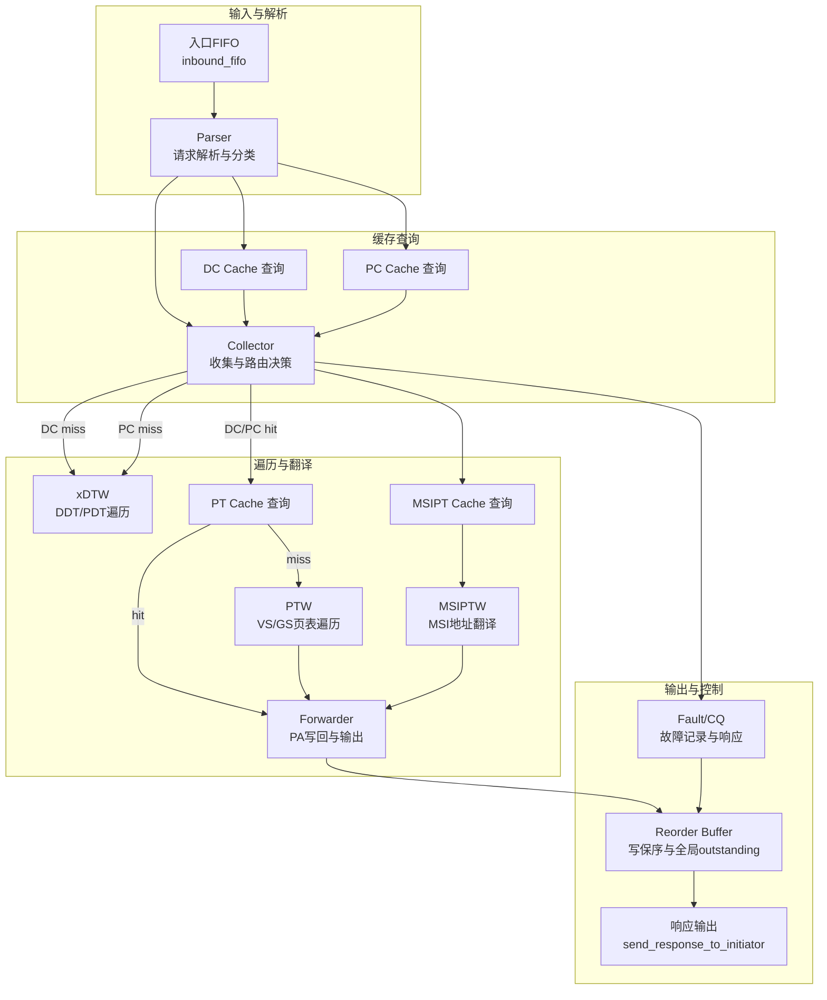

**图表来源**
- [iommu_perf_parser.cc:9-121](file://iommu/iommu_perf_model/iommu_perf_parser.cc#L9-L121)
- [iommu_perf_collector.cc:14-271](file://iommu/iommu_perf_model/iommu_perf_collector.cc#L14-L271)
- [iommu_perf_dc_pc_cache.cc:11-122](file://iommu/iommu_perf_model/iommu_perf_dc_pc_cache.cc#L11-L122)
- [iommu_perf_xdtw.cc:12-366](file://iommu/iommu_perf_model/iommu_perf_xdtw.cc#L12-L366)
- [iommu_perf_ptw.cc:13-800](file://iommu/iommu_perf_model/iommu_perf_ptw.cc#L13-L800)
- [iommu_perf_forwarder_fault_cq.cc:13-178](file://iommu/iommu_perf_model/iommu_perf_forwarder_fault_cq.cc#L13-L178)
- [iommu_perf_reorder.cc:26-181](file://iommu/iommu_perf_model/iommu_perf_reorder.cc#L26-L181)

**章节来源**
- [README.md:63-92](file://README.md#L63-L92)

## 核心组件
- Parser模块：执行入口校验、TTYP分类、DDI提取、设备ID宽度检查，并将任务写入Collector与DC/PC Cache请求FIFO。
- Collector模块：汇聚Parser、DC/PC Cache查询结果，进行路由决策（DC miss→xDTW，PC miss→xDTW，DC/PC hit→PT Cache或直接转发）。
- DC/PC Cache模块：并行查询设备/进程上下文，命中/未命中分别更新状态并写回Collector。
- xDTW模块：完成DDT/PDT树遍历，校验PTE有效性与配置，支持G-stage隐式/显式翻译。
- PTW模块：VS/GS两阶段页表遍历，支持Walker Cache命中优化、A/D位硬件更新、VA去重，**新增**详细的DDR访问统计和任务延迟分析。
- MSIPT模块：MSI地址翻译，支持Basic Translate与MRIF两种模式。
- Forwarder/Fault/CQ模块：PA写回payload、响应生成、故障记录与分类。
- Reorder模块：写保序与全局outstanding控制，保障吞吐与背压。
- 统计与监控：StatsCollector与HPM提供命中率、延迟、IOPS与事件计数，新增稳态IOPS测量和VA去重统计。

**更新** 新增PTW模块性能监控功能，包括DDR访问统计、任务延迟分析和峰值性能指标监控，提供更全面的性能分析能力。

**章节来源**
- [iommu_perf_parser.cc:9-121](file://iommu/iommu_perf_model/iommu_perf_parser.cc#L9-L121)
- [iommu_perf_collector.cc:14-452](file://iommu/iommu_perf_model/iommu_perf_collector.cc#L14-L452)
- [iommu_perf_dc_pc_cache.cc:11-122](file://iommu/iommu_perf_model/iommu_perf_dc_pc_cache.cc#L11-L122)
- [iommu_perf_xdtw.cc:12-366](file://iommu/iommu_perf_model/iommu_perf_xdtw.cc#L12-L366)
- [iommu_perf_ptw.cc:13-800](file://iommu/iommu_perf_model/iommu_perf_ptw.cc#L13-L800)
- [iommu_perf_msipt_cache.cc:11-231](file://iommu/iommu_perf_model/iommu_perf_msipt_cache.cc#L11-L231)
- [iommu_perf_forwarder_fault_cq.cc:13-178](file://iommu/iommu_perf_model/iommu_perf_forwarder_fault_cq.cc#L13-L178)
- [iommu_perf_reorder.cc:26-181](file://iommu/iommu_perf_model/iommu_perf_reorder.cc#L26-L181)
- [stats_collector.h:65-125](file://iommu/cache_src/common/stats_collector.h#L65-L125)
- [iommu_hpm.cc:6-109](file://iommu/iommu_perf_model/iommu_hpm.cc#L6-L109)

## 架构总览
性能模型遵循SPEC 12.1-12.20的步骤划分，采用多线程流水线与FIFO解耦，通过outstanding限制与Reorder Buffer实现背压与保序。关键特性：
- 并行查询：Parser并行触发DC/PC Cache查询，减少等待。
- 分层决策：Collector在聚合缓存结果后进行路由决策，避免重复遍历。
- 遍历优化：PTW支持Walker Cache命中，减少页表访问次数。
- 流水线：PEQ驱动的PTW请求/响应处理，提升吞吐。
- 统一输出：Reorder Buffer统一调度，确保写保序与带宽控制。
- **新增** 稳态IOPS测量：跳过warmup和drain阶段，只统计中间80%稳定段的IOPS。
- **新增** VA去重：同页并发任务合并，降低PTW压力和DDR访问次数。
- **新增** PTW性能监控：详细的DDR访问统计、任务延迟分析和峰值性能指标监控。

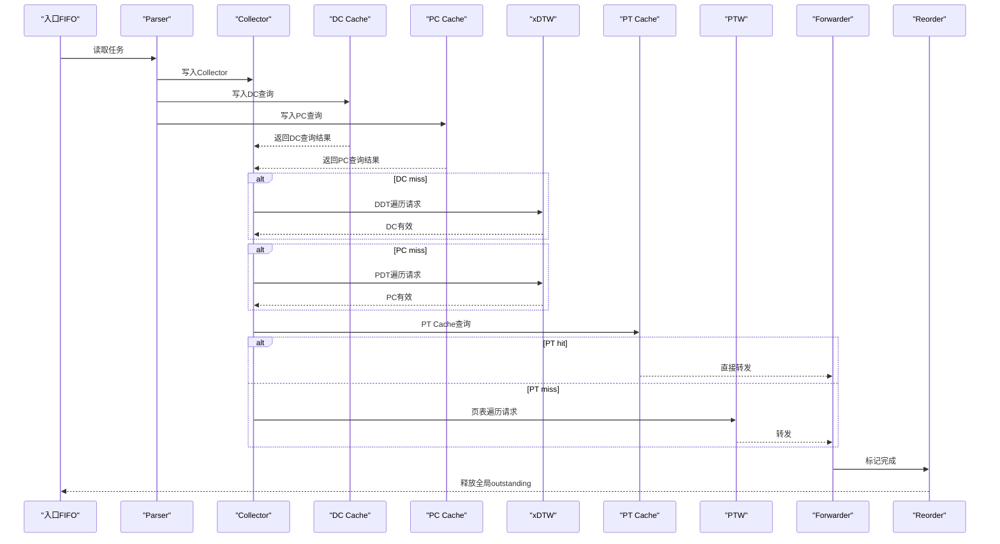

**图表来源**
- [iommu_perf_parser.cc:9-121](file://iommu/iommu_perf_model/iommu_perf_parser.cc#L9-L121)
- [iommu_perf_collector.cc:14-271](file://iommu/iommu_perf_model/iommu_perf_collector.cc#L14-L271)
- [iommu_perf_dc_pc_cache.cc:11-122](file://iommu/iommu_perf_model/iommu_perf_dc_pc_cache.cc#L11-L122)
- [iommu_perf_xdtw.cc:12-366](file://iommu/iommu_perf_model/iommu_perf_xdtw.cc#L12-L366)
- [iommu_perf_ptw.cc:13-800](file://iommu/iommu_perf_model/iommu_perf_ptw.cc#L13-L800)
- [iommu_perf_forwarder_fault_cq.cc:13-178](file://iommu/iommu_perf_model/iommu_perf_forwarder_fault_cq.cc#L13-L178)
- [iommu_perf_reorder.cc:89-181](file://iommu/iommu_perf_model/iommu_perf_reorder.cc#L89-L181)

## 详细组件分析

### Parser模块：请求解析与分类
- 功能要点
  - 全局outstanding反压：超过阈值等待释放事件。
  - 入口注册与重排序：登记任务到reorder buffer并申请全局outstanding。
  - TTYP分类与访问属性提取：依据地址类型、读写/AMO、执行标志等确定事务类型与访问属性。
  - 模式检查：ddtp.iommu_mode=Off/Bare的快速路径与错误处理。
  - DDI提取与设备ID宽度校验：针对不同DDT层级进行合法性检查。
  - 并行写入：向Collector、DC Cache、PC Cache请求FIFO发送任务。
- 关键流程

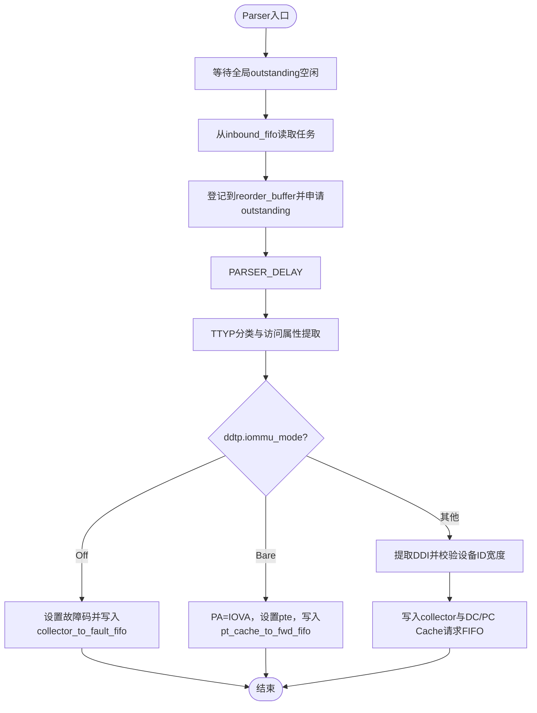

**图表来源**
- [iommu_perf_parser.cc:9-121](file://iommu/iommu_perf_model/iommu_perf_parser.cc#L9-L121)

**章节来源**
- [iommu_perf_parser.cc:9-121](file://iommu/iommu_perf_model/iommu_perf_parser.cc#L9-L121)
- [iommu_perf_model.hh:9-41](file://iommu/iommu_perf_model/iommu_perf_model.hh#L9-L41)

### Collector模块：缓存结果收集与路由决策
- 功能要点
  - 并发收集：同时监听parser_to_collector_fifo、dc_response_fifo、pc_response_fifo。
  - 完整性检查：等待Parser、DC、PC三路结果齐备后统一处理。
  - DC miss→xDTW：启动DDT遍历，设置walk类型与outstanding。
  - DC hit路径：EN_ATS、PDTV、进程ID宽度等检查，决定是否直接转发或继续。
  - PC miss→xDTW：启动PDT遍历，设置need_pc与outstanding。
  - PC hit路径：ENS检查，配置iosatp/iohgatp等参数，最终路由到PT Cache或Forwarder。
  - xDTW返回：更新DC/PC缓存，重复执行DC/PC hit路径的后续检查。
- 关键流程

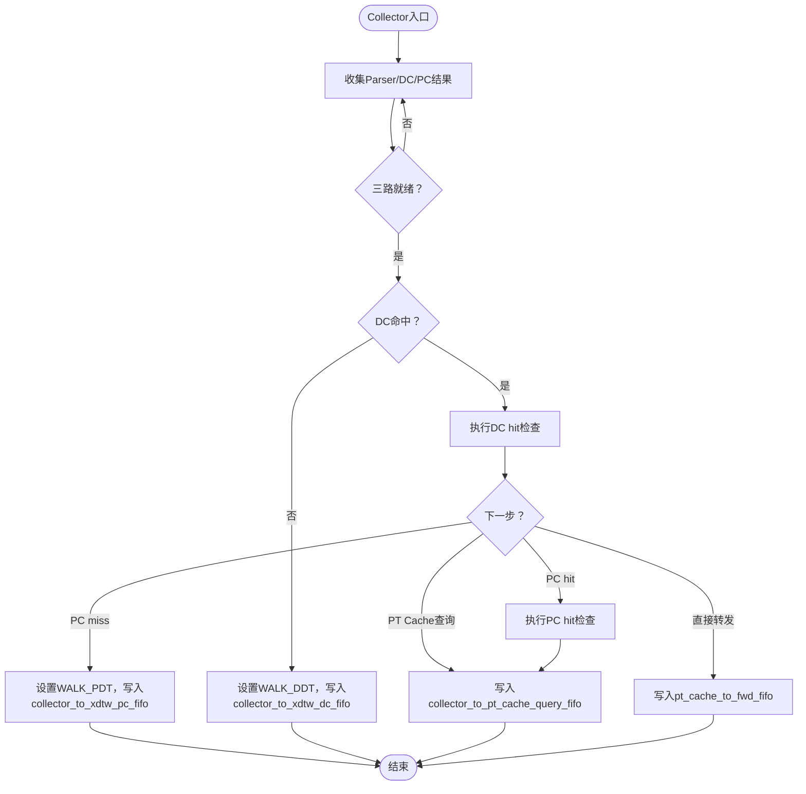

**图表来源**
- [iommu_perf_collector.cc:14-271](file://iommu/iommu_perf_model/iommu_perf_collector.cc#L14-L271)

**章节来源**
- [iommu_perf_collector.cc:14-452](file://iommu/iommu_perf_model/iommu_perf_collector.cc#L14-L452)

### DC/PC Cache模块：设备/进程上下文缓存查询
- 功能要点
  - DC查询线程：lookup_ioatc_dc，命中更新dc_valid/dc_hit，miss则等待xDTW更新。
  - PC查询线程：lookup_ioatc_pc，命中更新pc_valid/pc_hit，miss则等待xDTW更新。
  - 更新线程：xDTW完成后写回DC/PC缓存，保持一致性。
  - 延迟模型：DC_CACHE_HIT_DELAY/PC_CACHE_HIT_DELAY模拟命中延迟。
- 关键流程

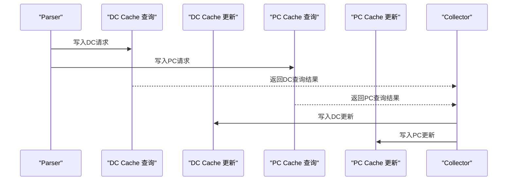

**图表来源**
- [iommu_perf_dc_pc_cache.cc:11-122](file://iommu/iommu_perf_model/iommu_perf_dc_pc_cache.cc#L11-L122)

**章节来源**
- [iommu_perf_dc_pc_cache.cc:11-122](file://iommu/iommu_perf_model/iommu_perf_dc_pc_cache.cc#L11-L122)

### xDTW模块：设备上下文遍历与DDT/PDT树遍历
- 功能要点
  - 请求线程：选择可用容量优先读取，初始化walk上下文（基址、级别、索引、首地址），发送首个DDR请求。
  - 响应线程：解析DDR响应，推进遍历状态机（非叶子→下一级；叶子→读取DC/PC并校验），支持G-stage隐式/显式翻译。
  - 流控：DC/PC outstanding上限控制，完成事件通知。
- 关键流程

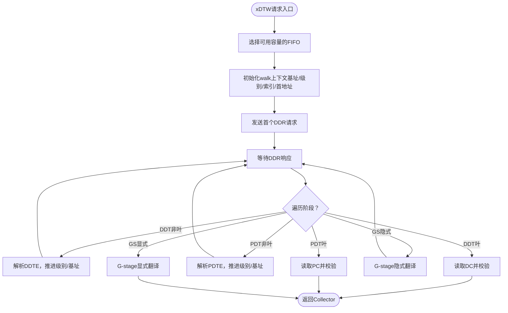

**图表来源**
- [iommu_perf_xdtw.cc:12-366](file://iommu/iommu_perf_model/iommu_perf_xdtw.cc#L12-L366)

**章节来源**
- [iommu_perf_xdtw.cc:12-366](file://iommu/iommu_perf_model/iommu_perf_xdtw.cc#L12-L366)

### PTW模块：页表遍历优化与Walker缓存
- 功能要点
  - 请求线程：PEQ驱动，应用outstanding限制，派发到PTW处理线程。
  - 请求处理线程：Bare模式快速路径；VS阶段初始化，支持Walker Cache命中；G-stage隐式/显式翻译；A/D位硬件更新；VA去重。
  - 响应线程：PEQ驱动，解析PTE，推进遍历状态机，处理权限与超页对齐检查，必要时发起AMO更新。
  - Walker Cache：按Sv39/Sv48策略保存中间结果，命中时从缓存起点继续遍历。
  - **新增** DDR访问统计：记录单任务最大/最小DDR访问次数、单次DDR访问最大/最小延时。
  - **新增** 任务延迟分析：记录任务入口时刻，计算最大/最小任务执行延时。
  - **新增** 峰值性能监控：实时跟踪PTW outstanding峰值并输出统计信息。
- 关键流程

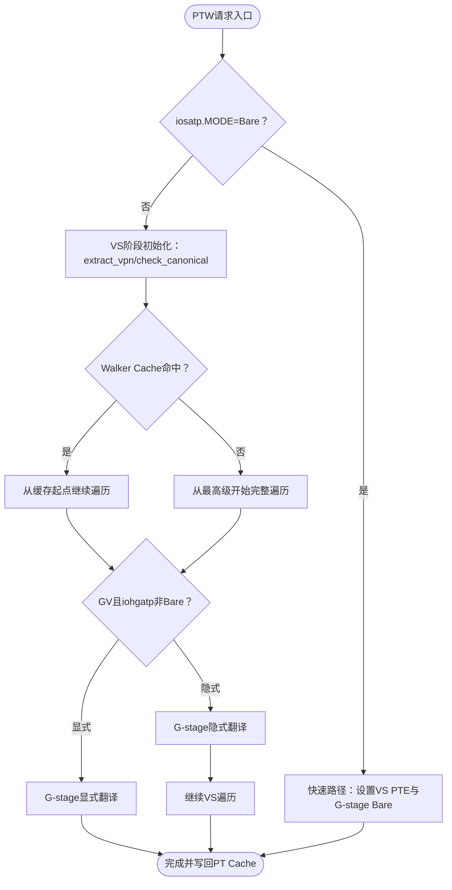

**图表来源**
- [iommu_perf_ptw.cc:13-800](file://iommu/iommu_perf_model/iommu_perf_ptw.cc#L13-L800)

**章节来源**
- [iommu_perf_ptw.cc:13-800](file://iommu/iommu_perf_model/iommu_perf_ptw.cc#L13-L800)

### MSIPT模块：MSI地址翻译
- 功能要点
  - MSIPT Cache查询线程：当前实现为always miss，直接路由到MSIPTW。
  - MSIPTW请求线程：计算MGPAW、提取中断文件号I、计算MSI PTE地址，发送首个DDR请求。
  - MSIPTW响应线程：解析16字节MSI PTE，支持Basic Translate与MRIF模式，执行权限检查。
- 关键流程

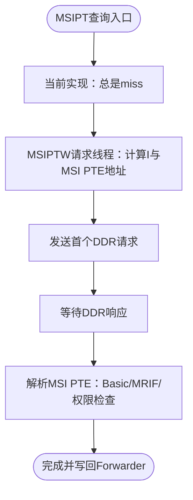

**图表来源**
- [iommu_perf_msipt_cache.cc:11-231](file://iommu/iommu_perf_model/iommu_perf_msipt_cache.cc#L11-L231)

**章节来源**
- [iommu_perf_msipt_cache.cc:11-231](file://iommu/iommu_perf_model/iommu_perf_msipt_cache.cc#L11-L231)

### Forwarder/Fault/CQ模块：数据转发与故障处理
- 功能要点
  - PT Forwarder：设置响应状态与地址，写回payload，标记reorder_ready，由reorder_output_thread真正下发。
  - MSIPT Forwarder：根据is_msi/is_mrif路由到IMSIC或常规DMA路径。
  - Fault/CQ：调用report_fault记录故障，按ATS/非ATS分类生成响应状态。
- 关键流程

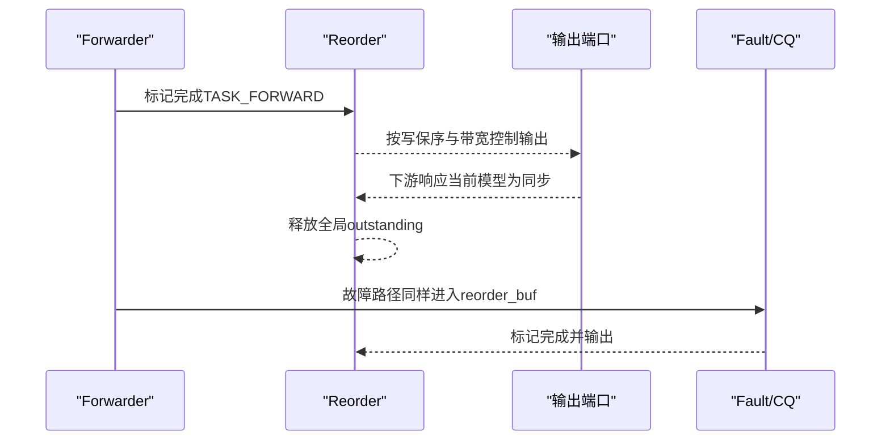

**图表来源**
- [iommu_perf_forwarder_fault_cq.cc:13-178](file://iommu/iommu_perf_model/iommu_perf_forwarder_fault_cq.cc#L13-L178)
- [iommu_perf_reorder.cc:89-181](file://iommu/iommu_perf_model/iommu_perf_reorder.cc#L89-L181)

**章节来源**
- [iommu_perf_forwarder_fault_cq.cc:13-178](file://iommu/iommu_perf_model/iommu_perf_forwarder_fault_cq.cc#L13-L178)
- [iommu_perf_reorder.cc:26-181](file://iommu/iommu_perf_model/iommu_perf_reorder.cc#L26-L181)

### PT Cache响应处理与VA去重
- 功能要点
  - 收集PT Cache命中/未命中响应，命中直接转发，未命中进行VA去重判断后路由到PTW。
  - VA去重：按GSCID/PSCID/页粒度记录，命中则挂起等待首个任务完成后再恢复。
  - **新增** VA去重表管理：包含去重键定义、条目结构和并发访问控制。
  - **新增** VA去重统计：记录去重命中/未命中次数，计算任务节省百分比。
- 关键流程

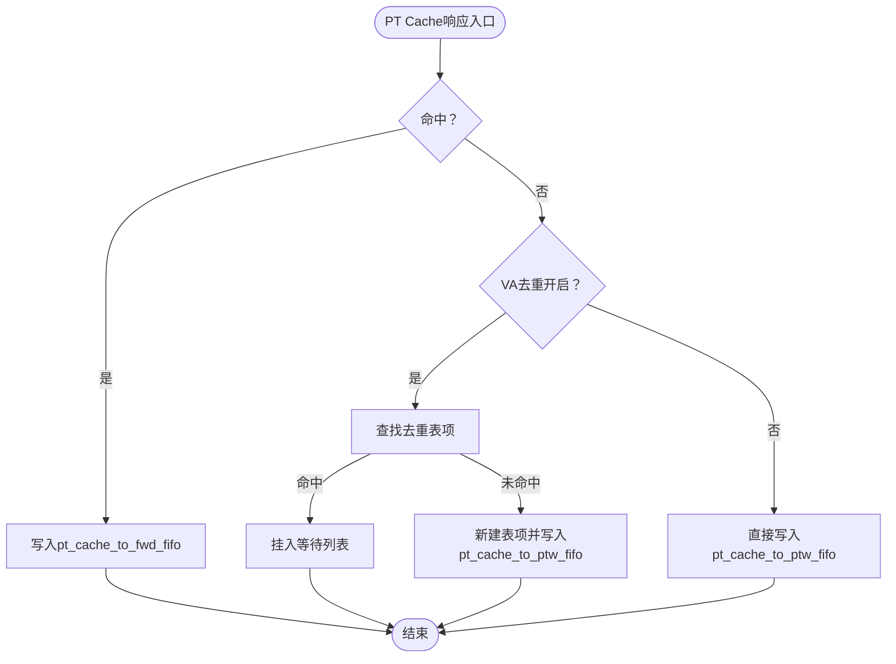

**图表来源**
- [iommu_perf_pt_cache_response.cc:13-108](file://iommu/iommu_perf_model/iommu_perf_pt_cache_response.cc#L13-L108)

**章节来源**
- [iommu_perf_pt_cache_response.cc:13-108](file://iommu/iommu_perf_model/iommu_perf_pt_cache_response.cc#L13-L108)

### PTW性能监控功能增强
- 功能要点
  - **新增** DDR访问统计：记录所有PTW任务的DDR读次数总和、单任务最大/最小DDR访问次数、单次DDR访问最大/最小延时。
  - **新增** 任务延迟分析：记录任务入口时刻，计算最大/最小任务执行延时，提供详细的统计信息。
  - **新增** 峰值性能监控：实时跟踪PTW outstanding峰值，当新的峰值出现时输出详细统计信息。
  - **新增** Walker Cache更新统计：在任务完成后更新Walker Cache，记录更新操作的详细信息。
  - **新增** 任务完成统计：累计PTW完成任务总数，提供整体性能指标。
- 关键流程

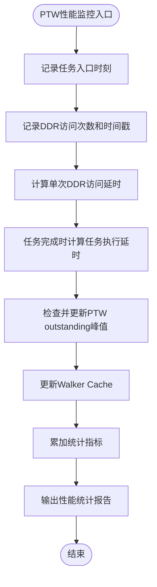

**图表来源**
- [iommu_perf_ptw.cc:21-30](file://iommu/iommu_perf_model/iommu_perf_ptw.cc#L21-L30)
- [iommu_perf_ptw.cc:272-279](file://iommu/iommu_perf_model/iommu_perf_ptw.cc#L272-L279)
- [iommu_perf_ptw.cc:796-817](file://iommu/iommu_perf_model/iommu_perf_ptw.cc#L796-L817)
- [iommu_top.cc:641-659](file://iommu/iommu_top.cc#L641-L659)

**章节来源**
- [iommu_perf_ptw.cc:21-30](file://iommu/iommu_perf_model/iommu_perf_ptw.cc#L21-L30)
- [iommu_perf_ptw.cc:272-279](file://iommu/iommu_perf_model/iommu_perf_ptw.cc#L272-L279)
- [iommu_perf_ptw.cc:796-817](file://iommu/iommu_perf_model/iommu_perf_ptw.cc#L796-L817)
- [iommu_top.cc:641-659](file://iommu/iommu_top.cc#L641-L659)

### 稳态IOPS测量功能
- 功能要点
  - **新增** 稳态窗口配置：STEADY_STATE_START_PERCENT和STEADY_STATE_END_PERCENT参数定义稳态采样窗口。
  - **新增** 稳态统计计数器：steady_start_ns/steady_end_ns/steady_start_count/steady_end_count跟踪稳态时间段。
  - **新增** 稳态IOPS计算：跳过warmup和drain阶段，只统计中间稳定段的IOPS效率。
  - **新增** 理论峰值对比：计算理论峰值IOPS并与实际稳态IOPS对比。
- 关键流程

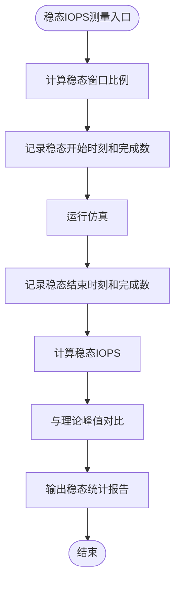

**图表来源**
- [iommu_top.cc:579-596](file://iommu/iommu_top.cc#L579-L596)
- [iommu_perf_params.hh:143-146](file://iommu/iommu_perf_model/iommu_perf_params.hh#L143-L146)

**章节来源**
- [iommu_top.cc:579-596](file://iommu/iommu_top.cc#L579-L596)
- [iommu_perf_params.hh:143-146](file://iommu/iommu_perf_model/iommu_perf_params.hh#L143-L146)

## 依赖关系分析
- 模块耦合
  - Parser与Collector：Parser写入Collector与DC/PC请求FIFO，Collector汇聚后决策。
  - Collector与xDTW：DC/PC miss时触发遍历，返回后重复执行后续检查。
  - PT Cache与PTW：PT Cache命中直接转发，未命中进入PTW；PTW完成后写回PT Cache。
  - Reorder与所有输出路径：统一保序与outstanding释放。
  - **新增** VA去重：PT Cache响应处理与VA去重表管理之间的协作。
  - **新增** 稳态统计：顶层模块与统计计数器之间的数据收集。
  - **新增** PTW性能监控：PTW模块与统计计数器之间的性能数据收集。
- 外部依赖
  - StatsCollector：提供缓存命中率、延迟直方图与IOPS统计。
  - HPM：事件计数器与溢出中断。
  - DDR：作为所有遍历的内存源，受outstanding与FIFO深度限制。

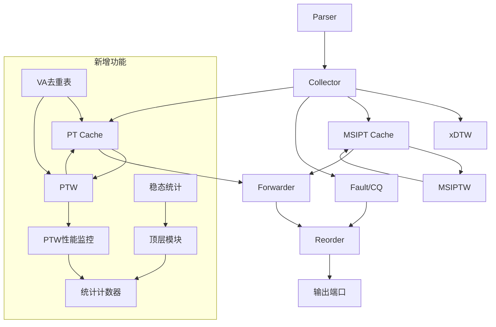

**图表来源**
- [iommu_perf_parser.cc:9-121](file://iommu/iommu_perf_model/iommu_perf_parser.cc#L9-L121)
- [iommu_perf_collector.cc:14-271](file://iommu/iommu_perf_model/iommu_perf_collector.cc#L14-L271)
- [iommu_perf_xdtw.cc:12-366](file://iommu/iommu_perf_model/iommu_perf_xdtw.cc#L12-L366)
- [iommu_perf_ptw.cc:13-800](file://iommu/iommu_perf_model/iommu_perf_ptw.cc#L13-L800)
- [iommu_perf_msipt_cache.cc:11-231](file://iommu/iommu_perf_model/iommu_perf_msipt_cache.cc#L11-L231)
- [iommu_perf_forwarder_fault_cq.cc:13-178](file://iommu/iommu_perf_model/iommu_perf_forwarder_fault_cq.cc#L13-L178)
- [iommu_perf_reorder.cc:89-181](file://iommu/iommu_perf_model/iommu_perf_reorder.cc#L89-L181)

**章节来源**
- [iommu_perf_params.hh:1-160](file://iommu/iommu_perf_model/iommu_perf_params.hh#L1-L160)
- [stats_collector.h:65-125](file://iommu/cache_src/common/stats_collector.h#L65-L125)
- [iommu_hpm.cc:6-109](file://iommu/iommu_perf_model/iommu_hpm.cc#L6-L109)

## 性能考量
- 延迟建模
  - 各模块处理延迟（ns）：Parser、Collector、DC/PC/PT/MSIPT Cache命中延迟，xDTW/PTW/MSIPTW每次访问延迟，Forwarder延迟等。
  - DDR访问延迟：XDTW/PTW/MSIPTW读写延迟，以及带宽延迟（AXI Master端口）。
  - **新增** PTW DDR访问统计：提供单任务最大/最小DDR访问次数、单次DDR访问最大/最小延时的详细统计。
  - **新增** PTW任务延迟分析：提供最大/最小任务执行延时统计，帮助识别性能瓶颈。
- 吞吐与并发
  - outstanding限制：XDTW DC/PC、PTW、MSIPTW各自上限；全局outstanding上限；Reorder输出并发限制。
  - FIFO深度：跨模块FIFO深度配置，避免阻塞。
  - **新增** PTW outstanding峰值监控：实时跟踪并输出峰值统计，便于性能调优。
- 缓存优化
  - Walker Cache：PTW Walker Cache命中可显著减少页表访问次数。
  - VA去重：同页并发任务合并，降低PTW压力和DDR访问次数。
  - **新增** 稳态IOPS：跳过warmup和drain阶段，提供更准确的性能基准。
- 统计指标
  - 命中率：DC/PC/PT/MSIPT缓存命中/未命中计数。
  - 延迟：执行延迟、排队延迟、请求延迟直方图。
  - IOPS：基于请求时间窗口计算每秒事务数，支持稳态统计。
  - **新增** 峰值统计：outstanding峰值跟踪和利用率分析。
  - **新增** VA去重统计：去重命中/未命中次数统计。
  - **新增** PTW性能统计：DDR访问次数、任务执行延时、Walker Cache更新统计。
- 参数配置
  - 缓存规模与关联度：DC/PC/PT/MSIPT缓存大小、关联度、行大小。
  - 端口带宽：AXI Master端口频率与位宽，计算带宽延迟。
  - Walker Cache与VA去重开关：PTW_WALKER_CACHE_ENABLED、PT_CACHE_VA_DEDUP_ENABLED。
  - **新增** 稳态窗口：STEADY_STATE_START_PERCENT/END_PERCENT参数配置。
  - **新增** PTW性能监控：启用/禁用详细的性能统计功能。

**更新** 新增PTW模块性能监控功能，包括详细的DDR访问统计、任务延迟分析和峰值性能指标监控，提供更全面的性能分析能力。

**章节来源**
- [iommu_perf_params.hh:53-160](file://iommu/iommu_perf_model/iommu_perf_params.hh#L53-L160)
- [stats_collector.h:65-125](file://iommu/cache_src/common/stats_collector.h#L65-L125)

## 故障排查指南
- 常见故障类型
  - 设备/进程上下文无效或配置错误：DDT/PDT条目V位清零或保留位非法。
  - 页表条目非法：PTE V位清零、PBMT/保留位非法、NAPOT非叶子N位非法、超页对齐错误。
  - 权限/特权检查失败：执行/读/写权限不足，U/S模式与SUM/Priv条件不满足。
  - MSI PTE非法：V位清零、M字段配置错误、MRIF能力未使能。
  - **新增** VA去重故障：去重表项管理错误或并发访问冲突。
  - **新增** PTW性能异常：DDR访问次数过多、任务执行延时过长、outstanding峰值过高。
- 定位方法
  - 查看Collector/xDTW/PTW/MSIPTW线程日志，定位walk阶段与读取地址。
  - 检查outstanding计数与完成事件，确认是否存在阻塞。
  - 使用StatsCollector输出命中率与延迟直方图，识别瓶颈模块。
  - **新增** 检查稳态统计报告，分析性能退化趋势。
  - **新增** 监控VA去重命中率，评估去重效果。
  - **新增** 分析PTW性能统计，识别DDR访问和任务执行问题。
- 处理流程

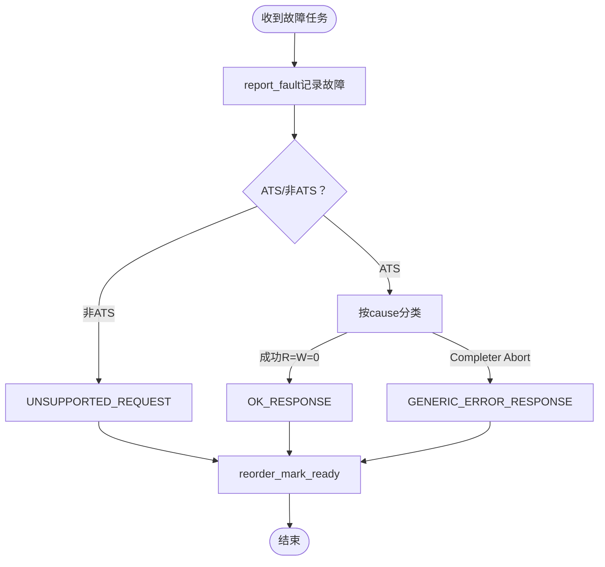

**图表来源**
- [iommu_perf_forwarder_fault_cq.cc:121-178](file://iommu/iommu_perf_model/iommu_perf_forwarder_fault_cq.cc#L121-L178)

**章节来源**
- [iommu_perf_forwarder_fault_cq.cc:121-178](file://iommu/iommu_perf_model/iommu_perf_forwarder_fault_cq.cc#L121-L178)

## 结论
该性能模型通过模块化与流水线设计，实现了对RISC-V IOMMU地址转换路径的高保真模拟。Parser与Collector的并行查询、xDTW与PTW的遍历优化、Forwarder与Reorder的统一输出，共同构成了高效的吞吐体系。配合StatsCollector与HPM，能够全面评估系统性能并指导调优。

**更新** 新增的PTW模块性能监控功能提供了详细的DDR访问统计、任务延迟分析和峰值性能指标监控，显著增强了系统的可观测性和调优能力。新增的稳态IOPS测量功能提供了更精确的性能基准，VA去重功能显著降低了PTW压力和DDR访问次数。建议在实际部署中结合具体工作负载调整FIFO深度、outstanding上限与缓存参数，充分利用VA去重和稳态统计功能，以获得最佳性能。

## 附录
- 性能分析报告与统计数据
  - 缓存性能分析：参考仓库中的缓存性能分析报告，了解命中率与延迟分布。
  - PT Cache命中率分析：参考PT Cache命中率分析文档，评估不同工作负载下的缓存效果。
  - 调试指南：参考GDB调试指南，辅助定位性能瓶颈与异常行为。
  - **新增** 稳态IOPS分析：利用稳态统计功能获取更准确的性能基准。
  - **新增** PTW性能监控：参考PTW模块的详细统计报告，分析DDR访问和任务执行性能。
- 参数与配置
  - 缓存参数：DC/PC/PT/MSIPT缓存规模、关联度、行大小。
  - 端口与带宽：AXI Master端口频率、位宽与并发限制。
  - Walker Cache与VA去重：开关与相关延迟参数。
  - **新增** 稳态窗口：STEADY_STATE_START_PERCENT/END_PERCENT参数配置。
  - **新增** 峰值跟踪：outstanding峰值统计和利用率分析参数。
  - **新增** PTW性能监控：启用/禁用详细的性能统计功能。
- 相关实现文件
  - 性能参数定义与统计接口：参见性能参数头文件与统计收集器头文件。
  - HPM事件计数：参见HPM实现文件。
  - **新增** VA去重实现：参见VA去重表管理和恢复机制。
  - **新增** 稳态统计：参见顶层模块的稳态IOPS计算和报告功能。
  - **新增** PTW性能监控：参见PTW模块的详细统计功能实现。

**章节来源**
- [README.md:77-92](file://README.md#L77-L92)
- [iommu_perf_params.hh:53-160](file://iommu/iommu_perf_model/iommu_perf_params.hh#L53-L160)
- [stats_collector.h:65-125](file://iommu/cache_src/common/stats_collector.h#L65-L125)
- [iommu_hpm.cc:6-109](file://iommu/iommu_perf_model/iommu_hpm.cc#L6-L109)