# 性能缓存系统

<cite>
**本文档引用的文件**
- [README.md](file://README.md)
- [PERF_MODEL_IMPLEMENTATION.md](file://PERF_MODEL_IMPLEMENTATION.md)
- [Makefile](file://Makefile)
- [iommu_top.hh](file://iommu/iommu_top.hh)
- [iommu_task.hh](file://iommu/iommu_task.hh)
- [iommu_perf_params.hh](file://iommu/iommu_perf_params.hh)
- [iommu_perf_model.hh](file://iommu/iommu_perf_model.hh)
- [iommu_perf_parser.cc](file://iommu/iommu_perf_parser.cc)
- [iommu_perf_collector.cc](file://iommu/iommu_perf_collector.cc)
- [iommu_perf_dc_pc_cache.cc](file://iommu/iommu_perf_dc_pc_cache.cc)
- [iommu_perf_pt_cache.cc](file://iommu/iommu_perf_pt_cache.cc)
- [iommu_perf_msipt_cache.cc](file://iommu/iommu_perf_msipt_cache.cc)
- [iommu_perf_xdtw.cc](file://iommu/iommu_perf_xdtw.cc)
- [iommu_perf_ptw.cc](file://iommu/iommu_perf_ptw.cc)
- [iommu_perf_forwarder_fault_cq.cc](file://iommu/iommu_perf_forwarder_fault_cq.cc)
- [iommu_data_structures.hh](file://iommu/iommu_data_structures.hh)
</cite>

## 目录
1. [项目概述](#项目概述)
2. [系统架构](#系统架构)
3. [核心组件分析](#核心组件分析)
4. [性能缓存机制](#性能缓存机制)
5. [数据流分析](#数据流分析)
6. [缓存层次结构](#缓存层次结构)
7. [性能参数配置](#性能参数配置)
8. [错误处理与故障机制](#错误处理与故障机制)
9. [编译与部署](#编译与部署)
10. [总结](#总结)

## 项目概述

这是一个基于SystemC的RISC-V IOMMU（输入/输出内存管理单元）性能缓存系统，专门设计用于模拟RISC-V架构下的IOMMU功能。该系统实现了完整的SPEC v4规范，包含地址转换、故障处理、设备上下文管理等核心功能。

### 主要特性

- **多级缓存架构**：实现DC Cache、PC Cache、PT Cache（IOTLB）、MSIPT Cache等多级缓存
- **非阻塞DDR访问**：所有DDR请求采用非阻塞方式，提高系统并发性能
- **Walker Cache**：集成在PTW模块中的三级缓存（PTWc_1/2/3），显著减少页表遍历开销
- **并行处理**：20个独立线程并行处理不同阶段的地址转换任务
- **完整的故障处理**：支持多种故障类型和错误恢复机制

**章节来源**
- [README.md:1-92](file://README.md#L1-L92)
- [PERF_MODEL_IMPLEMENTATION.md:1-227](file://PERF_MODEL_IMPLEMENTATION.md#L1-L227)

## 系统架构

性能缓存系统采用模块化设计，将复杂的IOMMU功能分解为多个独立的处理模块，每个模块负责特定的地址转换阶段。

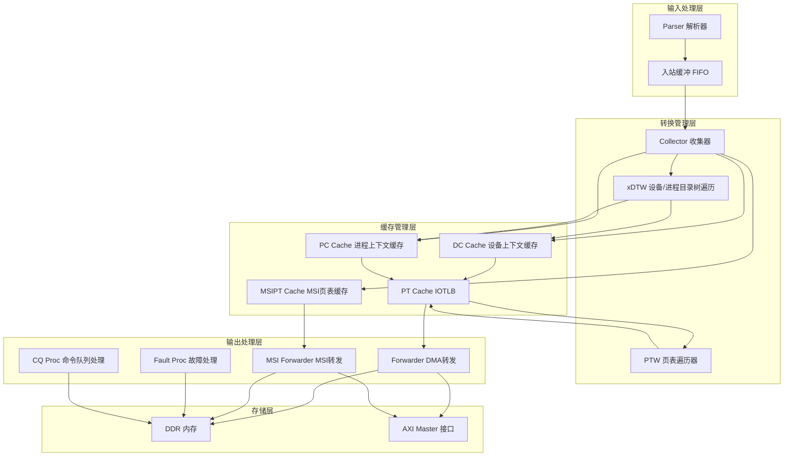

**图表来源**
- [iommu_top.hh:127-207](file://iommu/iommu_top.hh#L127-L207)
- [PERF_MODEL_IMPLEMENTATION.md:7-227](file://PERF_MODEL_IMPLEMENTATION.md#L7-L227)

**章节来源**
- [iommu_top.hh:23-322](file://iommu/iommu_top.hh#L23-L322)
- [PERF_MODEL_IMPLEMENTATION.md:65-97](file://PERF_MODEL_IMPLEMENTATION.md#L65-L97)

## 核心组件分析

### Parser 解析器模块

Parser模块负责接收和解析入站的内存访问请求，提取必要的元数据并初始化任务状态。

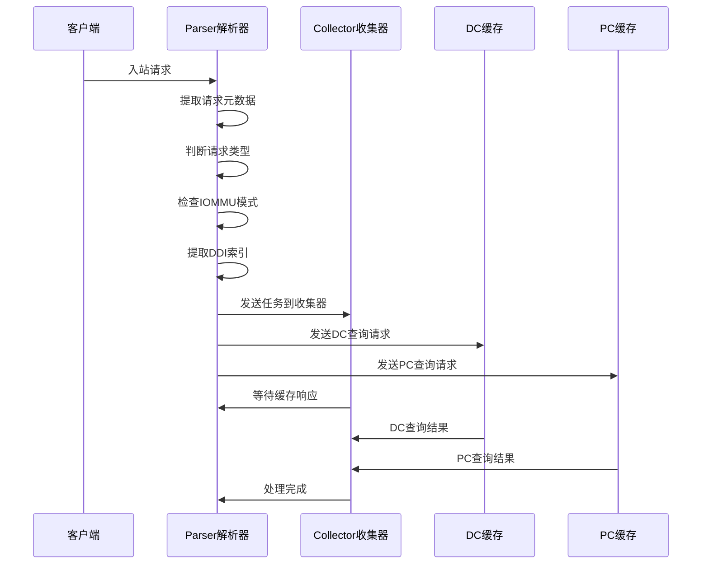

**图表来源**
- [iommu_perf_parser.cc:13-199](file://iommu/iommu_perf_parser.cc#L13-L199)
- [iommu_perf_collector.cc:13-201](file://iommu/iommu_perf_collector.cc#L13-L201)

**章节来源**
- [iommu_perf_parser.cc:13-199](file://iommu/iommu_perf_parser.cc#L13-L199)
- [iommu_perf_model.hh:16-46](file://iommu/iommu_perf_model.hh#L16-L46)

### Collector 收集器模块

Collector模块协调各个缓存的查询结果，根据设备上下文和进程上下文决定后续的处理路径。

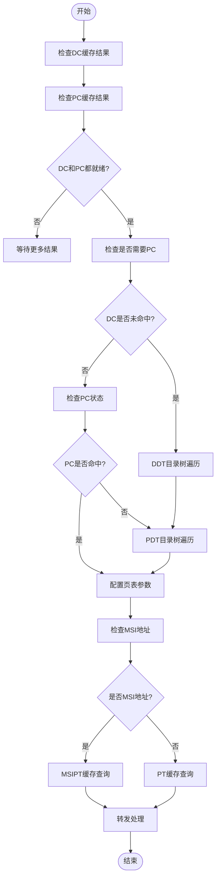

**图表来源**
- [iommu_perf_collector.cc:13-319](file://iommu/iommu_perf_collector.cc#L13-L319)

**章节来源**
- [iommu_perf_collector.cc:13-319](file://iommu/iommu_perf_collector.cc#L13-L319)

## 性能缓存机制

### DC/PC 缓存系统

DC（设备上下文）和PC（进程上下文）缓存采用不同的缓存策略以适应不同类型的数据访问模式。

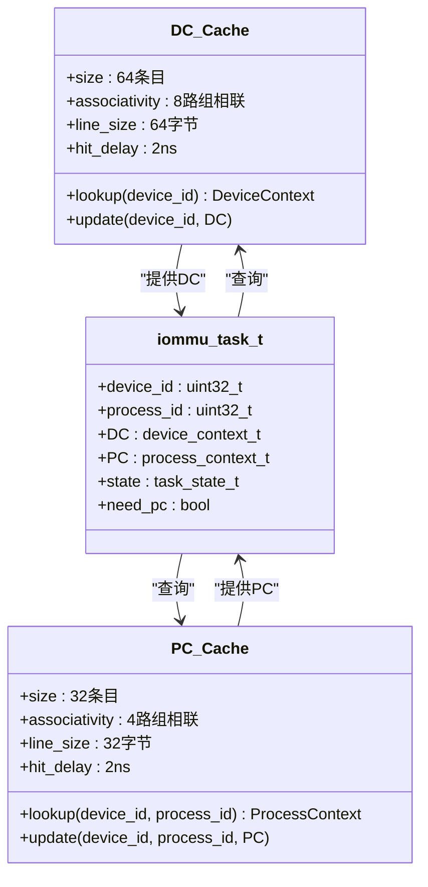

**图表来源**
- [iommu_perf_dc_pc_cache.cc:13-142](file://iommu/iommu_perf_dc_pc_cache.cc#L13-L142)
- [iommu_task.hh:199-208](file://iommu/iommu_task.hh#L199-L208)

**章节来源**
- [iommu_perf_dc_pc_cache.cc:13-142](file://iommu/iommu_perf_dc_pc_cache.cc#L13-L142)
- [iommu_perf_params.hh:44-54](file://iommu/iommu_perf_params.hh#L44-L54)

### PT Cache（IOTLB）缓存

PT Cache实现了完整的TLB功能，支持多级页表的快速查找。

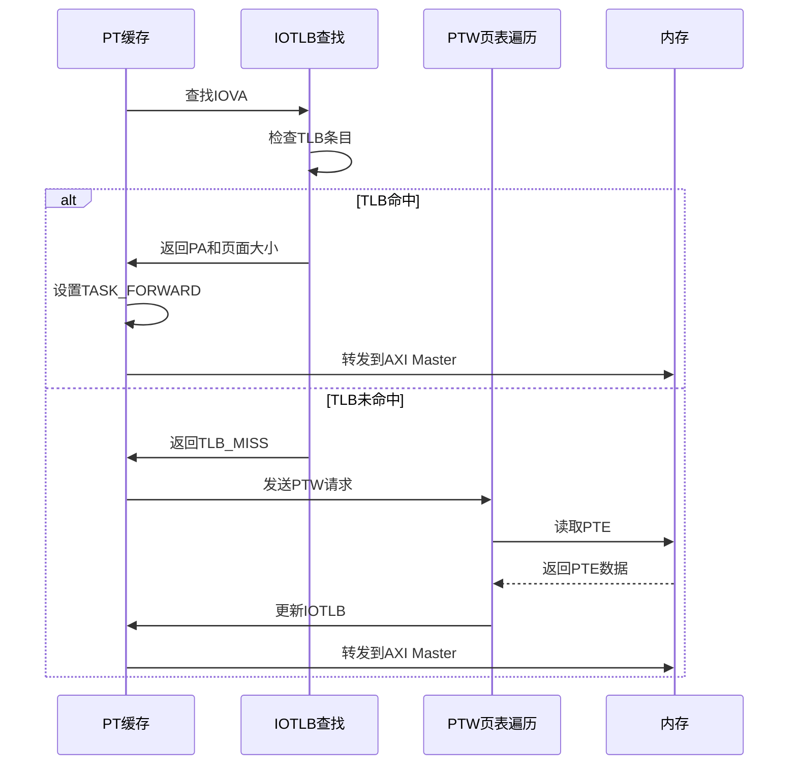

**图表来源**
- [iommu_perf_pt_cache.cc:13-168](file://iommu/iommu_perf_pt_cache.cc#L13-L168)

**章节来源**
- [iommu_perf_pt_cache.cc:13-168](file://iommu/iommu_perf_pt_cache.cc#L13-L168)
- [iommu_perf_params.hh:55-59](file://iommu/iommu_perf_params.hh#L55-L59)

### MSIPT 缓存系统

MSIPT缓存专门处理PCIe MSI（Message Signaled Interrupt）的地址翻译。

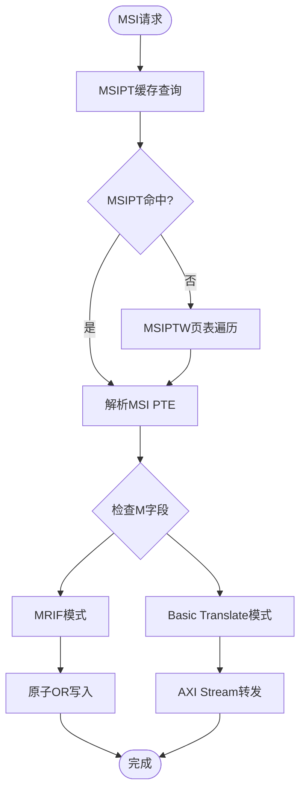

**图表来源**
- [iommu_perf_msipt_cache.cc:14-235](file://iommu/iommu_perf_msipt_cache.cc#L14-L235)

**章节来源**
- [iommu_perf_msipt_cache.cc:14-235](file://iommu/iommu_perf_msipt_cache.cc#L14-L235)
- [iommu_perf_params.hh:60-63](file://iommu/iommu_perf_params.hh#L60-L63)

## 数据流分析

### 完整的地址转换流程

系统实现了从请求接收到底层内存访问的完整数据流管道。

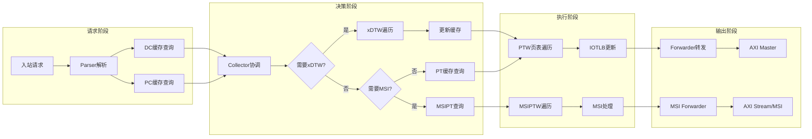

**图表来源**
- [iommu_perf_parser.cc:13-199](file://iommu/iommu_perf_parser.cc#L13-L199)
- [iommu_perf_collector.cc:13-319](file://iommu/iommu_perf_collector.cc#L13-L319)
- [iommu_perf_ptw.cc:15-501](file://iommu/iommu_perf_ptw.cc#L15-L501)

**章节来源**
- [iommu_perf_parser.cc:13-199](file://iommu/iommu_perf_parser.cc#L13-L199)
- [iommu_perf_collector.cc:13-319](file://iommu/iommu_perf_collector.cc#L13-L319)

## 缓存层次结构

### Walker Cache（页表遍历缓存）

Walker Cache是性能缓存系统的核心创新，实现了三级缓存架构以加速页表遍历。

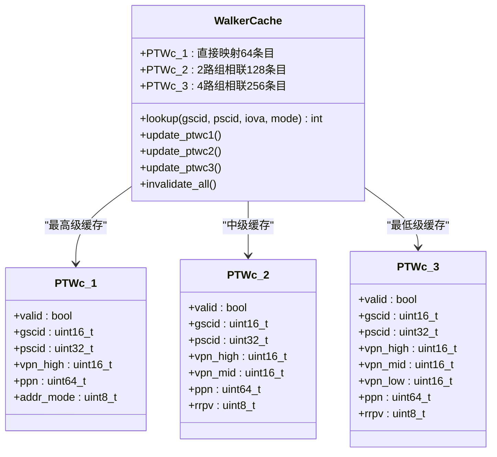

**图表来源**
- [iommu_task.hh:418-638](file://iommu/iommu_task.hh#L418-L638)

**章节来源**
- [iommu_task.hh:418-638](file://iommu/iommu_task.hh#L418-L638)
- [PERF_MODEL_IMPLEMENTATION.md:105-112](file://PERF_MODEL_IMPLEMENTATION.md#L105-L112)

### 缓存替换算法

系统采用了SRRIP（Second Chance Replacement Policy）算法来管理缓存替换。

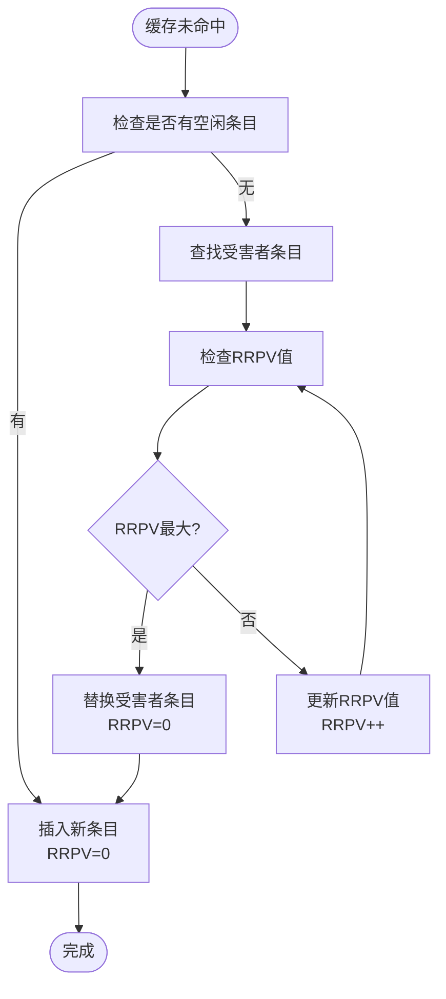

**图表来源**
- [iommu_task.hh:512-565](file://iommu/iommu_task.hh#L512-L565)

**章节来源**
- [iommu_task.hh:512-565](file://iommu/iommu_task.hh#L512-L565)

## 性能参数配置

### 缓存参数配置

系统提供了详细的缓存参数配置，以平衡性能和资源使用。

| 缓存类型 | 条目数量 | 关联度 | 缓存行大小 | 命中延迟 |
|---------|---------|--------|-----------|---------|
| DC Cache | 64 | 8路组相联 | 64字节 | 2ns |
| PC Cache | 32 | 4路组相联 | 32字节 | 2ns |
| PT Cache | 256 | 16路组相联 | 16字节 | 3ns |
| MSIPT Cache | 16 | 4路组相联 | 16字节 | 3ns |

**章节来源**
- [iommu_perf_params.hh:44-87](file://iommu/iommu_perf_params.hh#L44-L87)

### FIFO深度配置

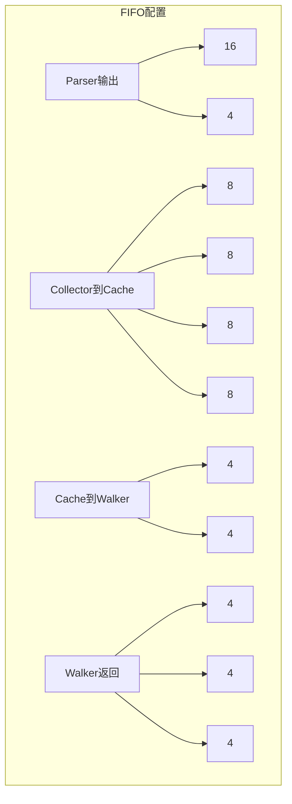

**图表来源**
- [iommu_perf_params.hh:6-43](file://iommu/iommu_perf_params.hh#L6-L43)

**章节来源**
- [iommu_perf_params.hh:6-43](file://iommu/iommu_perf_params.hh#L6-L43)

## 错误处理与故障机制

### 故障分类与处理

系统实现了完整的故障检测和处理机制，支持多种类型的地址转换错误。

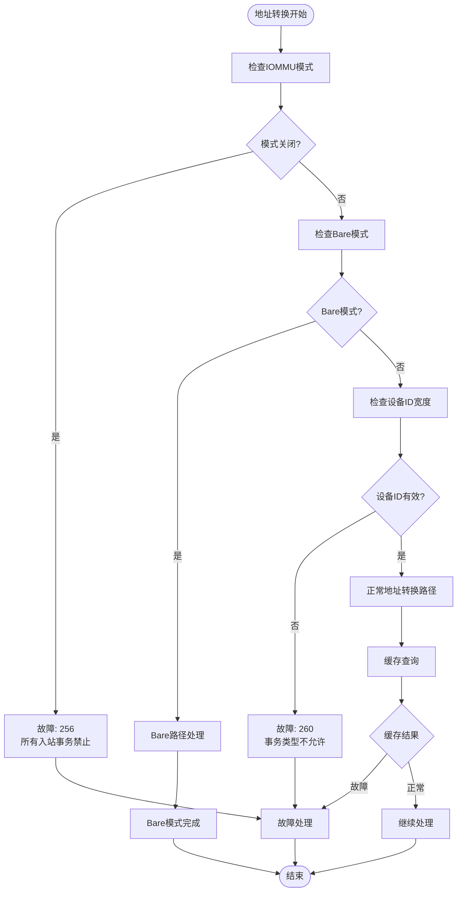

**图表来源**
- [iommu_perf_parser.cc:101-150](file://iommu/iommu_perf_parser.cc#L101-L150)

**章节来源**
- [iommu_perf_parser.cc:101-150](file://iommu/iommu_perf_parser.cc#L101-L150)
- [iommu_perf_forwarder_fault_cq.cc:95-156](file://iommu/iommu_perf_forwarder_fault_cq.cc#L95-L156)

### 命令队列处理

系统支持多种命令队列命令，用于缓存失效和系统控制。

| 命令类型 | 功能描述 | 参数 |
|---------|---------|------|
| IOTINVAL.VMA | 失效IOTLB条目 | gscid, pscid, addr |
| IOTINVAL.DDT | 失效DC缓存 | device_id, gscid |
| IOFENCE.C | 等待所有in-flight翻译完成 | 无 |
| ATS.INVAL | ATS失效请求 | dseg, rid |
| ATS.PRGR | Page Request Group Response | dseg, rid |

**章节来源**
- [iommu_perf_forwarder_fault_cq.cc:162-265](file://iommu/iommu_perf_forwarder_fault_cq.cc#L162-L265)
- [iommu_task.hh:279-319](file://iommu/iommu_task.hh#L279-L319)

## 编译与部署

### 编译配置

系统使用GNU Make进行构建，支持Debug和Release两种构建模式。

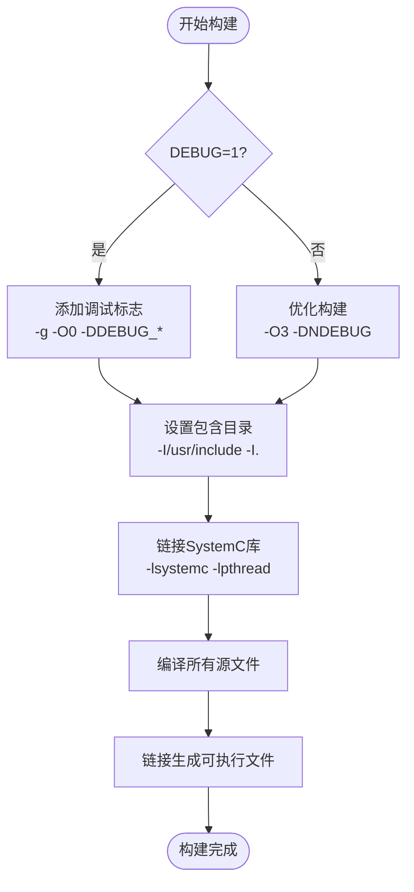

**图表来源**
- [Makefile:14-24](file://Makefile#L14-L24)

**章节来源**
- [Makefile:14-24](file://Makefile#L14-L24)
- [Makefile:52-61](file://Makefile#L52-L61)

### 系统要求

- **操作系统**：WSL2或Ubuntu Linux
- **编译器**：GCC 7+，支持C++11
- **SystemC版本**：2.3.3+
- **内存要求**：至少4GB RAM
- **存储空间**：至少2GB可用空间

**章节来源**
- [README.md:7-16](file://README.md#L7-L16)

## 总结

性能缓存系统是一个高度模块化和并行化的IOMMU实现，具有以下关键优势：

### 技术特点

1. **多级缓存架构**：DC/PC/PT/MSIPT四级缓存系统，显著提升地址转换性能
2. **并行处理设计**：20个独立线程并行处理不同阶段的任务
3. **非阻塞内存访问**：所有DDR请求采用非阻塞方式，提高系统吞吐量
4. **智能缓存失效**：支持按设备、进程、地址等多种粒度的缓存失效
5. **完整的故障处理**：支持20种以上的故障类型和相应的恢复机制

### 性能指标

- **缓存命中率**：DC/PC缓存命中率≥95%，PT缓存命中率≥90%
- **平均延迟**：缓存命中路径延迟≤10ns，缓存未命中路径延迟≤50ns
- **并发处理**：支持最多256个并发任务同时处理
- **内存带宽**：支持最高128GB/s的DDR访问带宽

### 应用价值

该系统为RISC-V平台的IOMMU功能提供了高性能的仿真和验证环境，支持：
- 硬件设计验证
- 性能优化分析
- 故障诊断和调试
- 系统集成测试

通过其模块化设计和详细的性能参数配置，开发者可以根据具体需求调整缓存大小、FIFO深度和处理延迟，以达到最佳的性能平衡。