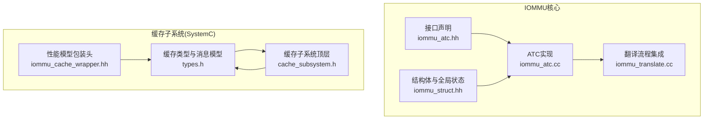
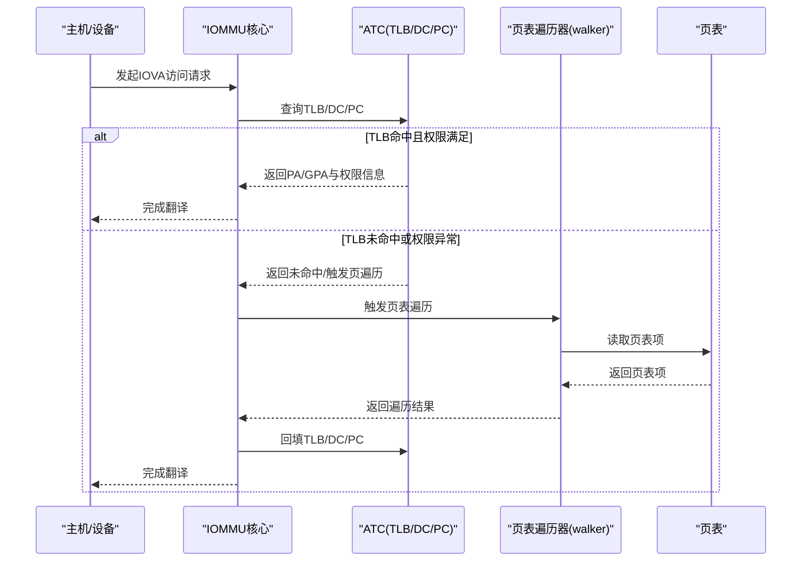
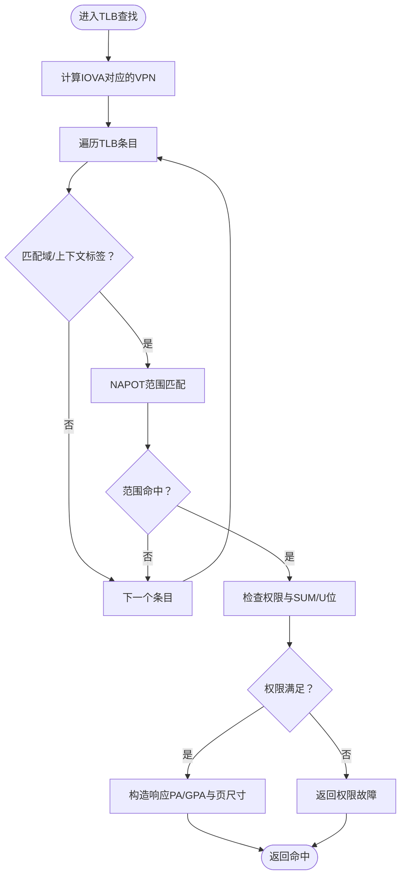
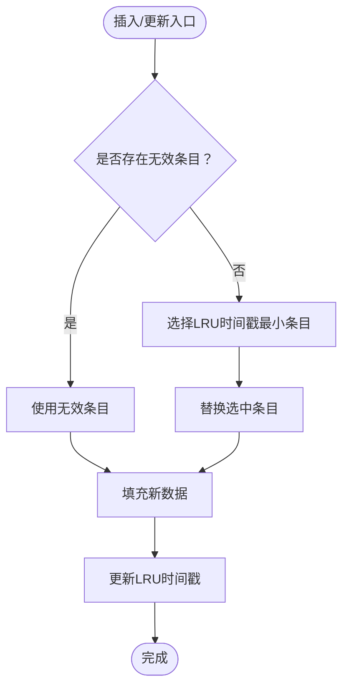
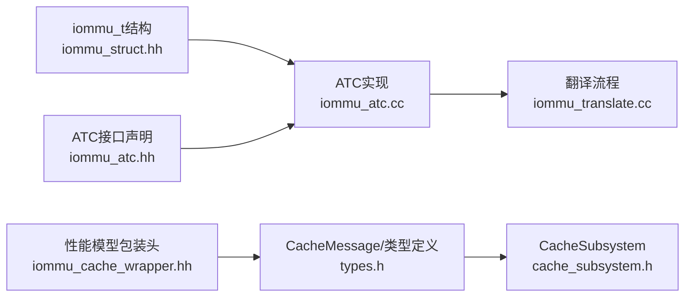

# ATC缓存系统

<cite>
**本文档引用的文件**
- [iommu_atc.hh](file://iommu/include/iommu_atc.hh)
- [iommu_atc.cc](file://iommu/iommu_fun_model/iommu_atc.cc)
- [iommu_struct.hh](file://iommu/include/iommu_struct.hh)
- [types.h](file://iommu/cache_src/common/types.h)
- [cache_subsystem.h](file://iommu/cache_src/subsystem/cache_subsystem.h)
- [iommu_cache_wrapper.hh](file://iommu/iommu_perf_model/iommu_cache_wrapper.hh)
- [iommu_translate.cc](file://iommu/iommu_fun_model/iommu_translate.cc)
</cite>

## 目录
1. [简介](#简介)
2. [项目结构](#项目结构)
3. [核心组件](#核心组件)
4. [架构总览](#架构总览)
5. [详细组件分析](#详细组件分析)
6. [依赖关系分析](#依赖关系分析)
7. [性能考虑](#性能考虑)
8. [故障处理与恢复](#故障处理与恢复)
9. [结论](#结论)
10. [附录](#附录)

## 简介
本文件系统性阐述IOMMU中的ATC（Address Translation Cache，地址转换缓存）子系统，重点覆盖以下方面：
- ATC在IOMMU中的角色与重要性：加速IOVA到PA/GPA的地址转换，承担TLB职责，减少页表遍历开销。
- 缓存结构与标签格式：TLB条目、设备目录缓存（DDT）、进程目录缓存（PDT）的字段组织与用途。
- 地址匹配机制：基于VPN与NAPOT（N-ary Page Offset Table）编码的范围匹配。
- 查找、插入、更新与替换策略：LRU时间戳驱动的直写式替换。
- 与IOTLB的关系与协作：ATC作为IOTLB的用户态缓存，负责权限检查与快速返回。
- 性能优化与容量规划：命中率、替换策略、预取与失效链路。
- 故障处理与恢复：权限异常、脏位失效触发、缓存一致性保障。

## 项目结构
ATC相关代码主要分布在以下位置：
- 接口声明：iommu/include/iommu_atc.hh
- 功能实现：iommu/iommu_fun_model/iommu_atc.cc
- 结构体与全局状态：iommu/include/iommu_struct.hh
- 缓存类型与消息模型（SystemC侧）：iommu/cache_src/common/types.h
- 缓存子系统（SystemC顶层）：iommu/cache_src/subsystem/cache_subsystem.h
- 性能模型包装头：iommu/iommu_perf_model/iommu_cache_wrapper.hh
- 翻译流程集成：iommu/iommu_fun_model/iommu_translate.cc

**图表来源**
- [iommu_atc.cc:1-233](file://iommu/iommu_fun_model/iommu_atc.cc#L1-L233)
- [iommu_struct.hh:42-99](file://iommu/include/iommu_struct.hh#L42-L99)
- [iommu_atc.hh:1-98](file://iommu/include/iommu_atc.hh#L1-L98)
- [types.h:1-617](file://iommu/cache_src/common/types.h#L1-L617)
- [cache_subsystem.h:1-161](file://iommu/cache_src/subsystem/cache_subsystem.h#L1-L161)
- [iommu_cache_wrapper.hh:1-9](file://iommu/iommu_perf_model/iommu_cache_wrapper.hh#L1-L9)
- [iommu_translate.cc:1-200](file://iommu/iommu_fun_model/iommu_translate.cc#L1-L200)

**章节来源**
- [iommu_atc.hh:1-98](file://iommu/include/iommu_atc.hh#L1-L98)
- [iommu_atc.cc:1-233](file://iommu/iommu_fun_model/iommu_atc.cc#L1-L233)
- [iommu_struct.hh:42-99](file://iommu/include/iommu_struct.hh#L42-L99)
- [types.h:1-617](file://iommu/cache_src/common/types.h#L1-L617)
- [cache_subsystem.h:1-161](file://iommu/cache_src/subsystem/cache_subsystem.h#L1-L161)
- [iommu_cache_wrapper.hh:1-9](file://iommu/iommu_perf_model/iommu_cache_wrapper.hh#L1-L9)
- [iommu_translate.cc:1-200](file://iommu/iommu_fun_model/iommu_translate.cc#L1-L200)

## 核心组件
- TLB（IOTLB）条目结构：包含VPN、域/上下文标签（GV/PSCV/GSCID/PSCID）、VS/G阶段权限与属性（R/W/X/D/U/G/PBMT）、PPN与页尺寸编码S、MSI标识、LRU时间戳与valid标志。
- 设备目录缓存（DDT）：缓存device context，按DID索引，LRU替换。
- 进程目录缓存（PDT）：缓存process context，按(DID,PSCID)索引，LRU替换。
- ATC接口：提供DC/PC/TLB的查找与缓存接口，以及IOVA到PA/GPA的快速翻译。

**章节来源**
- [iommu_atc.hh:9-51](file://iommu/include/iommu_atc.hh#L9-L51)
- [iommu_atc.cc:8-147](file://iommu/iommu_fun_model/iommu_atc.cc#L8-L147)
- [iommu_struct.hh:89-99](file://iommu/include/iommu_struct.hh#L89-L99)

## 架构总览
ATC在IOMMU中的位置与交互：
- ATC直接参与IOVA到PA/GPA的快速翻译路径，若命中则绕过页表遍历。
- 若TLB未命中或权限异常，触发页表遍历（walker），并将结果回填至ATC。
- ATC与DC/PC缓存协同工作，确保设备/进程上下文正确性。
- 翻译流程在iommu_translate.cc中编排，ATC接口被调用以进行快速查找与缓存回填。

**图表来源**
- [iommu_atc.cc:150-232](file://iommu/iommu_fun_model/iommu_atc.cc#L150-L232)
- [iommu_translate.cc:1-200](file://iommu/iommu_fun_model/iommu_translate.cc#L1-L200)

## 详细组件分析

### TLB（IOTLB）条目与NAPOT匹配
- 条目标签字段：VPN、GV、PSCV、GSCID、PSCID，用于区分不同域与上下文的地址空间。
- 属性字段：VS/G阶段的R/W/X/D/U/G/PBMT，用于权限与属性检查。
- 页尺寸编码S：配合NAPOT范围匹配，支持大页/巨页等多级页表粒度。
- 匹配函数match_address_range：基于NAPOT编码判断给定IOVA是否落在缓存条目的地址范围内。

**图表来源**
- [iommu_atc.cc:150-232](file://iommu/iommu_fun_model/iommu_atc.cc#L150-L232)

**章节来源**
- [iommu_atc.hh:9-36](file://iommu/include/iommu_atc.hh#L9-L36)
- [iommu_atc.cc:150-232](file://iommu/iommu_fun_model/iommu_atc.cc#L150-L232)

### 缓存替换策略（LRU）
- 替换选择：当TLB/DDT/PDT满时，选择LRU时间戳最小的条目进行替换。
- 命中更新：命中后更新LRU时间戳，确保近期使用的条目保持活跃。
- 直写式插入：优先寻找无效条目，否则执行LRU替换。

**图表来源**
- [iommu_atc.cc:8-147](file://iommu/iommu_fun_model/iommu_atc.cc#L8-L147)

**章节来源**
- [iommu_atc.cc:8-147](file://iommu/iommu_fun_model/iommu_atc.cc#L8-L147)

### 与IOTLB的关系与协作
- ATC作为IOTLB的用户态缓存，负责快速返回翻译结果与权限检查。
- 当G阶段权限故障或写操作且D位为0时，ATC会主动将条目标记为无效并返回未命中，促使重新页表遍历以获得正确的GPA与一致的权限信息。
- ATC与DC/PC缓存共同维护设备/进程上下文，确保域/上下文标签正确性。

**章节来源**
- [iommu_atc.cc:177-209](file://iommu/iommu_fun_model/iommu_atc.cc#L177-L209)
- [iommu_atc.hh:38-51](file://iommu/include/iommu_atc.hh#L38-L51)

### SystemC侧缓存类型与消息模型
- types.h定义了统一的CacheMessage结构，支持lookup/update/invalidation三类操作复用同一消息体，并携带路由键（device_id/process_id/gscid/pscid/iova）与payload。
- cache_subsystem.h提供了顶层CacheSubsystem模块，管理多个cache实例与失效流水线，支持DC/PC/PT/Walker/MSIPT等缓存的并发处理。
- iommu_cache_wrapper.hh确保在性能模型中正确包含全局与命名空间类型，避免冲突。

**章节来源**
- [types.h:476-562](file://iommu/cache_src/common/types.h#L476-L562)
- [cache_subsystem.h:18-83](file://iommu/cache_src/subsystem/cache_subsystem.h#L18-L83)
- [iommu_cache_wrapper.hh:1-9](file://iommu/iommu_perf_model/iommu_cache_wrapper.hh#L1-L9)

## 依赖关系分析
- ATC实现依赖于全局结构体iommu_t，其中包含TLB、DDT、PDT数组及LRU时间戳。
- ATC接口在翻译流程中被调用，翻译流程在iommu_translate.cc中编排，形成“查找→回填→返回”的闭环。
- SystemC侧的types.h与cache_subsystem.h为高性能仿真提供统一的消息模型与并发处理框架。

**图表来源**
- [iommu_struct.hh:89-99](file://iommu/include/iommu_struct.hh#L89-L99)
- [iommu_atc.cc:1-233](file://iommu/iommu_fun_model/iommu_atc.cc#L1-L233)
- [iommu_atc.hh:70-96](file://iommu/include/iommu_atc.hh#L70-L96)
- [iommu_translate.cc:1-200](file://iommu/iommu_fun_model/iommu_translate.cc#L1-L200)
- [types.h:476-562](file://iommu/cache_src/common/types.h#L476-L562)
- [cache_subsystem.h:18-83](file://iommu/cache_src/subsystem/cache_subsystem.h#L18-L83)
- [iommu_cache_wrapper.hh:1-9](file://iommu/iommu_perf_model/iommu_cache_wrapper.hh#L1-L9)

**章节来源**
- [iommu_struct.hh:89-99](file://iommu/include/iommu_struct.hh#L89-L99)
- [iommu_atc.cc:1-233](file://iommu/iommu_fun_model/iommu_atc.cc#L1-L233)
- [iommu_atc.hh:70-96](file://iommu/include/iommu_atc.hh#L70-L96)
- [iommu_translate.cc:1-200](file://iommu/iommu_fun_model/iommu_translate.cc#L1-L200)
- [types.h:476-562](file://iommu/cache_src/common/types.h#L476-L562)
- [cache_subsystem.h:18-83](file://iommu/cache_src/subsystem/cache_subsystem.h#L18-L83)
- [iommu_cache_wrapper.hh:1-9](file://iommu/iommu_perf_model/iommu_cache_wrapper.hh#L1-L9)

## 性能考虑
- 命中率优化
  - 提高TLB容量与组相联度，减少冲突失效。
  - 利用NAPOT范围匹配支持大页，提升连续地址访问的命中率。
  - 在翻译流程中合理安排预取，提前将热点页表项回填至ATC。
- 替换策略
  - LRU时间戳更新仅在命中时进行，避免频繁写放大。
  - 对于写操作，若D位为0则主动失效条目，确保后续访问触发最新页表遍历，避免脏数据导致的错误。
- 容量规划
  - TLB容量与DDT/PDT容量应结合设备/进程数量与典型工作集大小进行评估。
  - 在SystemC仿真中，可通过GlobalConfig调整缓存set/way与延迟参数，模拟不同配置下的性能表现。
- 一致性与延迟
  - 失效命令（InvalidCmdType）支持精确/扫描/全局三种模式，按需平衡一致性与性能。
  - CacheMessage中的latency与timestamp可用于性能建模与统计分析。

**章节来源**
- [iommu_atc.cc:177-209](file://iommu/iommu_fun_model/iommu_atc.cc#L177-L209)
- [types.h:573-612](file://iommu/cache_src/common/types.h#L573-L612)
- [cache_subsystem.h:18-83](file://iommu/cache_src/subsystem/cache_subsystem.h#L18-L83)

## 故障处理与恢复
- 权限故障处理
  - 若检测到G阶段权限异常，ATC会将该TLB条目标记为无效并返回未命中，促使重新页表遍历以获得正确的GPA与权限信息。
- 写操作一致性
  - 当访问为写且VS/G阶段D位为0时，ATC将条目标记为无效并返回未命中，触发页表遍历以刷新最新属性。
- 缓存一致性保障
  - 通过失效命令（InvalidCmdType）对DC/PC/TLB进行定点或全局失效，确保缓存与页表的一致性。
  - 在SystemC侧，CacheSubsystem提供级联失效机制，DC/PC失效后自动传播至PT/Walker/MSIPT缓存。

**章节来源**
- [iommu_atc.cc:190-209](file://iommu/iommu_fun_model/iommu_atc.cc#L190-L209)
- [types.h:118-145](file://iommu/cache_src/common/types.h#L118-L145)
- [cache_subsystem.h:77-81](file://iommu/cache_src/subsystem/cache_subsystem.h#L77-L81)

## 结论
ATC作为IOMMU的关键加速单元，通过TLB、DDT、PDT三级缓存实现对IOVA到PA/GPA的快速解析，并在权限检查与缓存一致性方面发挥重要作用。其基于NAPOT的范围匹配与LRU替换策略在保证性能的同时兼顾了实现复杂度。结合SystemC侧的统一消息模型与失效流水线，ATC能够在仿真与实际部署中提供稳定高效的地址转换服务。

## 附录
- 关键接口路径
  - TLB查找与缓存回填：[lookup_ioatc_iotlb:150-232](file://iommu/iommu_fun_model/iommu_atc.cc#L150-L232)，[cache_ioatc_iotlb:96-147](file://iommu/iommu_fun_model/iommu_atc.cc#L96-L147)
  - DC/PC查找与缓存：[lookup_ioatc_dc:36-49](file://iommu/iommu_fun_model/iommu_atc.cc#L36-L49)，[cache_ioatc_dc:8-33](file://iommu/iommu_fun_model/iommu_atc.cc#L8-L33)，[lookup_ioatc_pc:79-94](file://iommu/iommu_fun_model/iommu_atc.cc#L79-L94)，[cache_ioatc_pc:51-77](file://iommu/iommu_fun_model/iommu_atc.cc#L51-L77)
  - 结构体与全局状态：[iommu_t:42-99](file://iommu/include/iommu_struct.hh#L42-L99)
  - SystemC类型与消息模型：[types.h:476-562](file://iommu/cache_src/common/types.h#L476-L562)，[cache_subsystem.h:18-83](file://iommu/cache_src/subsystem/cache_subsystem.h#L18-L83)
  - 翻译流程集成：[iommu_translate.cc:1-200](file://iommu/iommu_fun_model/iommu_translate.cc#L1-L200)