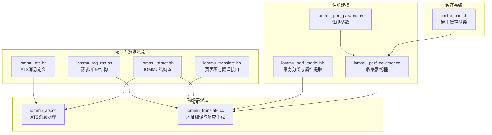
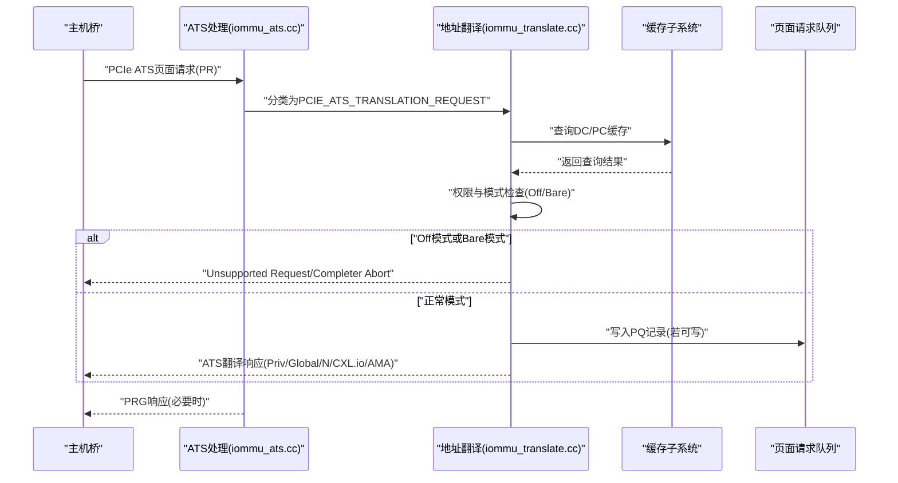
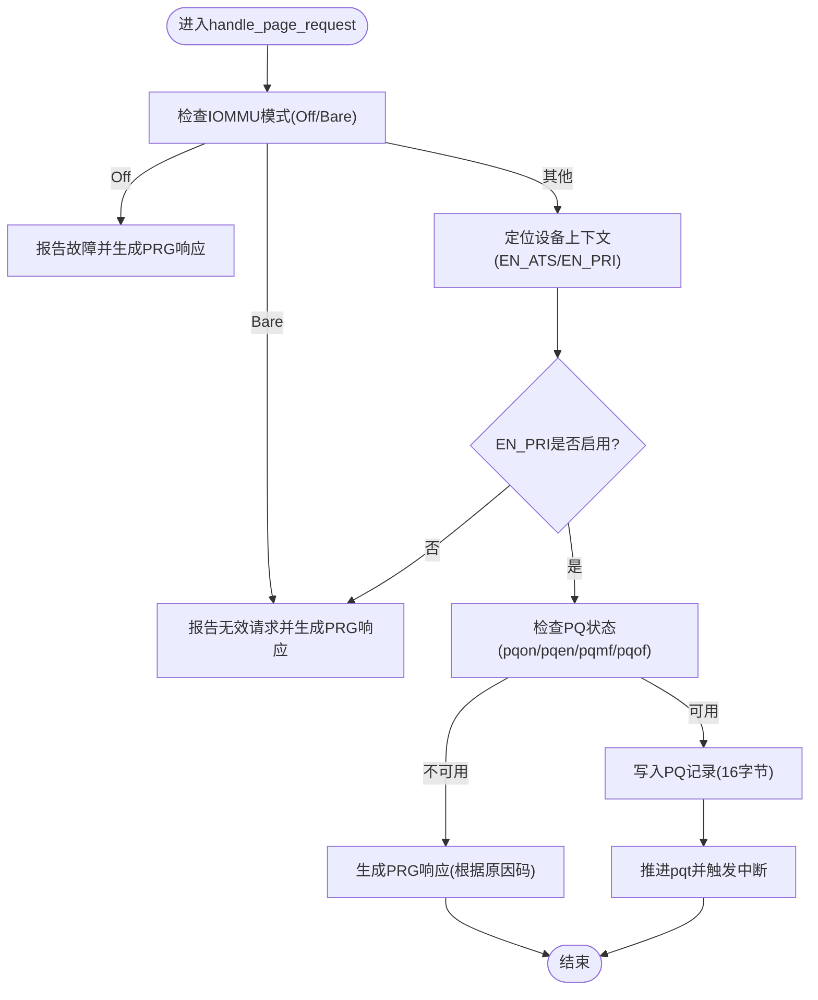
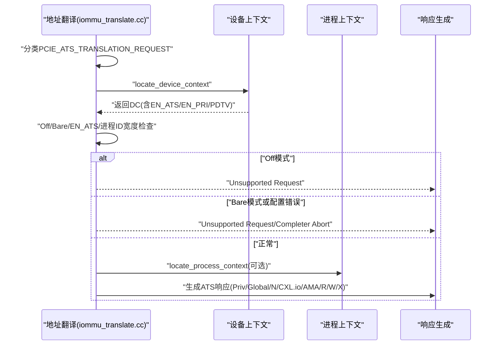
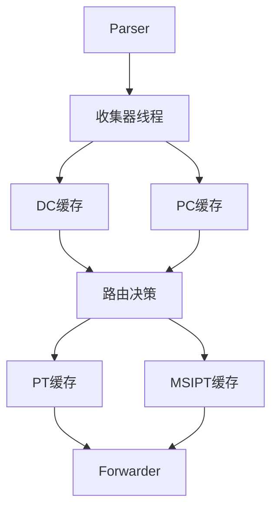
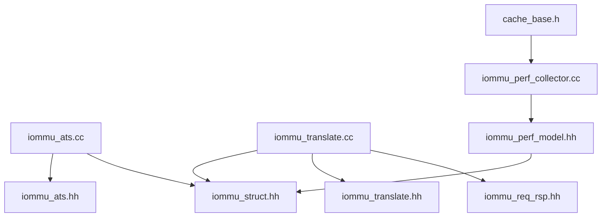

# ATS支持系统

<cite>
**本文档引用的文件**
- [iommu_ats.hh](file://iommu/include/iommu_ats.hh)
- [iommu_ats.cc](file://iommu/iommu_fun_model/iommu_ats.cc)
- [iommu_translate.hh](file://iommu/include/iommu_translate.hh)
- [iommu_translate.cc](file://iommu/iommu_fun_model/iommu_translate.cc)
- [iommu_req_rsp.hh](file://iommu/include/iommu_req_rsp.hh)
- [iommu_struct.hh](file://iommu/include/iommu_struct.hh)
- [iommu_perf_model.hh](file://iommu/iommu_perf_model/iommu_perf_model.hh)
- [iommu_perf_params.hh](file://iommu/iommu_perf_model/iommu_perf_params.hh)
- [iommu_perf_collector.cc](file://iommu/iommu_perf_model/iommu_perf_collector.cc)
- [cache_base.h](file://iommu/cache_src/cache/cache_base.h)
</cite>

## 目录
1. [简介](#简介)
2. [项目结构](#项目结构)
3. [核心组件](#核心组件)
4. [架构概览](#架构概览)
5. [详细组件分析](#详细组件分析)
6. [依赖关系分析](#依赖关系分析)
7. [性能考量](#性能考量)
8. [故障排除指南](#故障排除指南)
9. [结论](#结论)
10. [附录](#附录)

## 简介
本文件面向ATS（Address Translation Services）支持系统的实现与使用，系统基于PCIe ATS协议，提供从ATS翻译请求的接收、处理到响应的完整链路。文档重点覆盖以下方面：
- ATS翻译请求的接收、处理与响应机制
- ATS请求的分类、权限检查与缓存策略
- ATS翻译完成消息的格式与字段含义（Priv、Global、N、CXL.io、AMA等）
- 不同IOMMU模式（Bare、Off等）下ATS行为差异
- ATS性能优化建议、兼容性考虑与故障排除
- ATS与传统地址转换的协同工作机制

## 项目结构
该仓库采用分层与模块化组织方式，ATS相关实现主要集中在以下目录与文件：
- 功能实现层：iommu/iommu_fun_model/iommu_ats.cc（ATS消息处理）、iommu/iommu_fun_model/iommu_translate.cc（地址翻译与ATS响应生成）
- 接口与数据结构：iommu/include/iommu_ats.hh（ATS消息定义）、iommu/include/iommu_req_rsp.hh（请求/响应结构）、iommu/include/iommu_translate.hh（页表项与翻译接口）
- 性能建模：iommu/iommu_perf_model/iommu_perf_model.hh（事务类型分类与属性提取）、iommu/iommu_perf_model/iommu_perf_params.hh（性能参数）、iommu/iommu_perf_model/iommu_perf_collector.cc（收集器线程与路由决策）
- 缓存系统：iommu/cache_src/cache/cache_base.h（通用缓存基类与仲裁）

**图表来源**
- [iommu_ats.cc:1-374](file://iommu/iommu_fun_model/iommu_ats.cc#L1-L374)
- [iommu_translate.cc:1-732](file://iommu/iommu_fun_model/iommu_translate.cc#L1-L732)
- [iommu_ats.hh:1-98](file://iommu/include/iommu_ats.hh#L1-L98)
- [iommu_req_rsp.hh:1-106](file://iommu/include/iommu_req_rsp.hh#L1-L106)
- [iommu_translate.hh:1-132](file://iommu/include/iommu_translate.hh#L1-L132)
- [iommu_struct.hh:1-102](file://iommu/include/iommu_struct.hh#L1-L102)
- [iommu_perf_model.hh:1-197](file://iommu/iommu_perf_model/iommu_perf_model.hh#L1-L197)
- [iommu_perf_params.hh:1-160](file://iommu/iommu_perf_model/iommu_perf_params.hh#L1-L160)
- [iommu_perf_collector.cc:1-453](file://iommu/iommu_perf_model/iommu_perf_collector.cc#L1-L453)
- [cache_base.h:1-676](file://iommu/cache_src/cache/cache_base.h#L1-L676)

**章节来源**
- [iommu_ats.cc:1-374](file://iommu/iommu_fun_model/iommu_ats.cc#L1-L374)
- [iommu_translate.cc:1-732](file://iommu/iommu_fun_model/iommu_translate.cc#L1-L732)
- [iommu_ats.hh:1-98](file://iommu/include/iommu_ats.hh#L1-L98)
- [iommu_req_rsp.hh:1-106](file://iommu/include/iommu_req_rsp.hh#L1-L106)
- [iommu_translate.hh:1-132](file://iommu/include/iommu_translate.hh#L1-L132)
- [iommu_struct.hh:1-102](file://iommu/include/iommu_struct.hh#L1-L102)
- [iommu_perf_model.hh:1-197](file://iommu/iommu_perf_model/iommu_perf_model.hh#L1-L197)
- [iommu_perf_params.hh:1-160](file://iommu/iommu_perf_model/iommu_perf_params.hh#L1-L160)
- [iommu_perf_collector.cc:1-453](file://iommu/iommu_perf_model/iommu_perf_collector.cc#L1-L453)
- [cache_base.h:1-676](file://iommu/cache_src/cache/cache_base.h#L1-L676)

## 核心组件
- ATS消息与队列管理
  - ATS消息结构与PRG响应码定义：ATS消息头、PRG响应状态码（成功、无效请求、响应失败等）
  - ITAG跟踪器：用于跟踪ATS无效化请求的完成状态，支持超时与挂起处理
  - 页面请求队列（PQ）：用于排队PCIe ATS“页面请求”消息，支持溢出与内存访问错误处理
- 地址翻译与ATS响应生成
  - ATS翻译请求分类：ADDR_TYPE_PCIE_ATS_TRANSLATION_REQUEST
  - 权限与模式检查：Off模式、Bare模式下的特殊处理；EN_ATS/EN_PRI使能检查
  - ATS响应字段生成：Priv、Global、N、CXL.io、AMA等字段的设置规则
- 性能建模与缓存
  - 事务类型分类：PCIE_ATS_TRANSLATION_REQUEST的识别与属性提取
  - 缓存参数：DC/PC/PT/MSIPT缓存大小、关联度、行大小与FIFO深度
  - 收集器线程：DC/PC缓存查询结果的聚合与路由决策

**章节来源**
- [iommu_ats.hh:47-97](file://iommu/include/iommu_ats.hh#L47-L97)
- [iommu_ats.cc:7-94](file://iommu/iommu_fun_model/iommu_ats.cc#L7-L94)
- [iommu_translate.cc:59-86](file://iommu/iommu_fun_model/iommu_translate.cc#L59-L86)
- [iommu_req_rsp.hh:24-97](file://iommu/include/iommu_req_rsp.hh#L24-L97)
- [iommu_perf_model.hh:9-41](file://iommu/iommu_perf_model/iommu_perf_model.hh#L9-L41)
- [iommu_perf_params.hh:54-160](file://iommu/iommu_perf_model/iommu_perf_params.hh#L54-L160)
- [iommu_perf_collector.cc:14-200](file://iommu/iommu_perf_model/iommu_perf_collector.cc#L14-L200)

## 架构概览
ATS支持系统在功能层与性能层协同工作：
- 功能层负责ATS消息的接收、解析、权限校验、PQ排队与PRG响应生成，以及ATS翻译请求的地址转换与响应字段填充
- 性能层负责事务分类、属性提取、缓存查询与路由决策，确保高吞吐与低延迟

**图表来源**
- [iommu_ats.cc:96-373](file://iommu/iommu_fun_model/iommu_ats.cc#L96-L373)
- [iommu_translate.cc:85-142](file://iommu/iommu_fun_model/iommu_translate.cc#L85-L142)
- [iommu_req_rsp.hh:77-97](file://iommu/include/iommu_req_rsp.hh#L77-L97)
- [iommu_perf_collector.cc:14-200](file://iommu/iommu_perf_model/iommu_perf_collector.cc#L14-L200)

## 详细组件分析

### ATS消息与队列管理
- ATS消息结构
  - 消息头包含MSGCODE、TAG、RID、PV、PID、PRIV、EXEC_REQ、DSV、DSEG、PAYLOAD等字段
  - PRG响应状态码：SUCCESS、INVALID_REQUEST、RESPONSE_FAILURE等
- ITAG跟踪器
  - 分配与回收：allocate_itag、any_ats_invalidation_requests_pending
  - 完成处理：handle_invalidation_completion，校验DSV/DSEG/RID一致性
  - 超时处理：do_ats_timer_expiry，标记超时并推进挂起的IOFENCE
- 页面请求队列（PQ）
  - 队列控制寄存器：pqon/pqen/pqof/pqmf，溢出与内存访问错误处理
  - 写入流程：校验队列容量，计算记录地址，写入16字节记录，推进pqt并触发中断

**图表来源**
- [iommu_ats.cc:96-373](file://iommu/iommu_fun_model/iommu_ats.cc#L96-L373)

**章节来源**
- [iommu_ats.hh:47-97](file://iommu/include/iommu_ats.hh#L47-L97)
- [iommu_ats.cc:7-94](file://iommu/iommu_fun_model/iommu_ats.cc#L7-L94)
- [iommu_ats.cc:96-373](file://iommu/iommu_fun_model/iommu_ats.cc#L96-L373)

### ATS翻译请求处理与响应生成
- 事务类型分类
  - PCIE_ATS_TRANSLATION_REQUEST在性能模型中被识别并分类，同时提取访问属性（读/写/执行/特权）
- 模式与权限检查
  - Off模式：ATS翻译请求直接返回Unsupported Request
  - Bare模式：ATS翻译请求与Translated请求均被拒绝（交易类型不允许）
  - EN_ATS/EN_PRI：设备上下文使能检查，进程ID宽度检查
- ATS响应字段生成
  - Priv：无PASID时清零；有PASID时依据请求的特权模式设置
  - Global：成功且有PASID时由一级页表确定，否则清零
  - N、CXL.io、AMA：根据页表项与MSI/MRIF判定规则设置
  - R/W/X：按权限授予情况设置，执行权限需同时满足读权限

**图表来源**
- [iommu_translate.cc:59-86](file://iommu/iommu_fun_model/iommu_translate.cc#L59-L86)
- [iommu_translate.cc:94-142](file://iommu/iommu_fun_model/iommu_translate.cc#L94-L142)
- [iommu_translate.cc:205-234](file://iommu/iommu_fun_model/iommu_translate.cc#L205-L234)
- [iommu_req_rsp.hh:77-97](file://iommu/include/iommu_req_rsp.hh#L77-L97)

**章节来源**
- [iommu_perf_model.hh:9-41](file://iommu/iommu_perf_model/iommu_perf_model.hh#L9-L41)
- [iommu_translate.cc:94-142](file://iommu/iommu_fun_model/iommu_translate.cc#L94-L142)
- [iommu_translate.cc:205-234](file://iommu/iommu_fun_model/iommu_translate.cc#L205-L234)
- [iommu_req_rsp.hh:77-97](file://iommu/include/iommu_req_rsp.hh#L77-L97)

### ATS与传统地址转换的协同
- 事务类型区分
  - Untranslated/Translated/PCIE_ATS_TRANSLATION_REQUEST三类，分别对应不同处理路径
- 缓存与路由
  - 收集器线程聚合Parser与缓存查询结果，进行DC/PC命中判断与后续路由
  - 不同模式（Bare/1LVL/2LVL）与使能（EN_ATS/EN_PRI/T2GPA）影响路由与页表访问
- 性能参数
  - FIFO深度、缓存尺寸与关联度、DDR带宽与延迟等参数直接影响ATS处理吞吐与延迟

**图表来源**
- [iommu_perf_collector.cc:14-200](file://iommu/iommu_perf_model/iommu_perf_collector.cc#L14-L200)
- [iommu_perf_params.hh:54-160](file://iommu/iommu_perf_model/iommu_perf_params.hh#L54-L160)
- [cache_base.h:1-676](file://iommu/cache_src/cache/cache_base.h#L1-L676)

**章节来源**
- [iommu_perf_collector.cc:14-200](file://iommu/iommu_perf_model/iommu_perf_collector.cc#L14-L200)
- [iommu_perf_params.hh:54-160](file://iommu/iommu_perf_model/iommu_perf_params.hh#L54-L160)
- [cache_base.h:1-676](file://iommu/cache_src/cache/cache_base.h#L1-L676)

## 依赖关系分析
- 头文件依赖
  - iommu_ats.cc依赖iommu_struct.hh（全局结构体）、iommu_ats.hh（ATS消息定义）
  - iommu_translate.cc依赖iommu_struct.hh、iommu_translate.hh、iommu_req_rsp.hh、iommu_fault.hh
- 性能建模依赖
  - iommu_perf_model.hh提供事务类型分类与属性提取
  - iommu_perf_collector.cc协调缓存查询与路由决策
- 缓存系统依赖
  - cache_base.h提供统一缓存基类与仲裁机制，支撑DC/PC/PT/MSIPT缓存

**图表来源**
- [iommu_ats.cc:1-374](file://iommu/iommu_fun_model/iommu_ats.cc#L1-L374)
- [iommu_ats.hh:1-98](file://iommu/include/iommu_ats.hh#L1-L98)
- [iommu_struct.hh:1-102](file://iommu/include/iommu_struct.hh#L1-L102)
- [iommu_translate.cc:1-732](file://iommu/iommu_fun_model/iommu_translate.cc#L1-L732)
- [iommu_translate.hh:1-132](file://iommu/include/iommu_translate.hh#L1-L132)
- [iommu_req_rsp.hh:1-106](file://iommu/include/iommu_req_rsp.hh#L1-L106)
- [iommu_perf_model.hh:1-197](file://iommu/iommu_perf_model/iommu_perf_model.hh#L1-L197)
- [iommu_perf_collector.cc:1-453](file://iommu/iommu_perf_model/iommu_perf_collector.cc#L1-L453)
- [cache_base.h:1-676](file://iommu/cache_src/cache/cache_base.h#L1-L676)

**章节来源**
- [iommu_ats.cc:1-374](file://iommu/iommu_fun_model/iommu_ats.cc#L1-L374)
- [iommu_translate.cc:1-732](file://iommu/iommu_fun_model/iommu_translate.cc#L1-L732)
- [iommu_perf_model.hh:1-197](file://iommu/iommu_perf_model/iommu_perf_model.hh#L1-L197)
- [iommu_perf_collector.cc:1-453](file://iommu/iommu_perf_model/iommu_perf_collector.cc#L1-L453)
- [cache_base.h:1-676](file://iommu/cache_src/cache/cache_base.h#L1-L676)

## 性能考量
- 事务类型与属性提取
  - 在iommu_perf_model.hh中对PCIE_ATS_TRANSLATION_REQUEST进行分类，并提取读/写/执行/特权属性，便于后续缓存与路由优化
- 缓存参数与FIFO深度
  - DC/PC/PT/MSIPT缓存的尺寸、关联度与行大小直接影响命中率与延迟
  - FIFO深度参数（Parser输出、Collector到Cache、Walker往返、最终输出路径等）决定系统吞吐与背压能力
- DDR与端口并发
  - DDR最大未完成请求数、读写延迟、带宽参数与AXI端口并发限制共同决定内存访问性能
- 处理延迟与重排序
  - 各模块处理延迟（Parser/Collector/Cache/Walker/Forwarder）与出口重排序延迟影响端到端延迟

**章节来源**
- [iommu_perf_model.hh:9-41](file://iommu/iommu_perf_model/iommu_perf_model.hh#L9-L41)
- [iommu_perf_params.hh:54-160](file://iommu/iommu_perf_model/iommu_perf_params.hh#L54-L160)

## 故障排除指南
- ATS消息处理
  - 无效化完成消息校验：handle_invalidation_completion中对DSV/DSEG/RID一致性进行严格校验，不一致返回错误
  - ITAG超时：do_ats_timer_expiry将ITAG置为非忙并标记超时，推进挂起的IOFENCE
- PQ状态与PRG响应
  - pqmf/pqof：内存访问错误或队列溢出时生成PRG响应，状态码根据原因选择
  - PRPR位：PRG响应中PASID要求指示，影响响应是否携带PV/PID
- 模式与权限错误
  - Off模式：ATS翻译请求返回Unsupported Request
  - Bare模式：ATS翻译请求与Translated请求均返回Unsupported Request/Completer Abort
  - EN_ATS/EN_PRI：设备上下文使能检查失败或进程ID宽度超出限制导致Unsupported Request
- 缓存与路由
  - DC/PC缓存miss时路由至DDT/PC walk，需关注outstanding限制与延迟参数

**章节来源**
- [iommu_ats.cc:57-94](file://iommu/iommu_fun_model/iommu_ats.cc#L57-L94)
- [iommu_ats.cc:96-373](file://iommu/iommu_fun_model/iommu_ats.cc#L96-L373)
- [iommu_translate.cc:94-142](file://iommu/iommu_fun_model/iommu_translate.cc#L94-L142)
- [iommu_translate.cc:205-234](file://iommu/iommu_fun_model/iommu_translate.cc#L205-L234)
- [iommu_perf_collector.cc:87-200](file://iommu/iommu_perf_model/iommu_perf_collector.cc#L87-L200)

## 结论
ATS支持系统通过明确的消息处理、严格的权限与模式检查、完善的PQ队列与PRG响应机制，以及与传统地址转换的协同，实现了对PCIe ATS协议的完整支持。性能建模与缓存参数为系统提供了可扩展的优化空间。在实际部署中，应重点关注模式配置、权限使能与缓存参数的平衡，以获得最佳的吞吐与延迟表现。

## 附录
- ATS翻译完成消息字段说明
  - Priv：无PASID时清零；有PASID时依据请求的特权模式设置
  - Global：成功且有PASID时由一级页表确定，否则清零
  - N：页表项中的N位，影响缓存属性
  - CXL.io：针对CXL.io设备的特定处理
  - AMA：内存访问属性，结合页表项设置
- IOMMU模式差异
  - Off模式：禁止所有入站事务，ATS翻译请求返回Unsupported Request
  - Bare模式：仅允许未翻译地址，ATS翻译请求与Translated请求均被拒绝
  - 其他模式：遵循EN_ATS/EN_PRI与进程ID宽度检查，正常进行地址翻译与响应生成

**章节来源**
- [iommu_req_rsp.hh:77-97](file://iommu/include/iommu_req_rsp.hh#L77-L97)
- [iommu_translate.cc:533-600](file://iommu/iommu_fun_model/iommu_translate.cc#L533-L600)