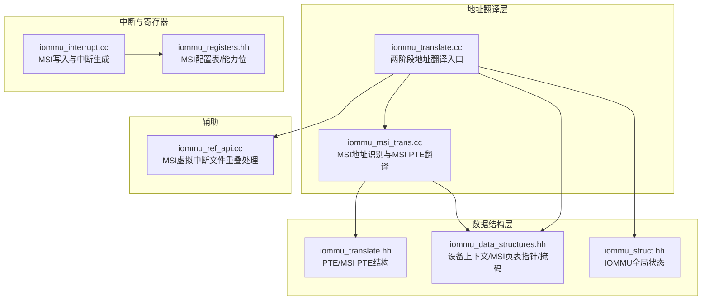
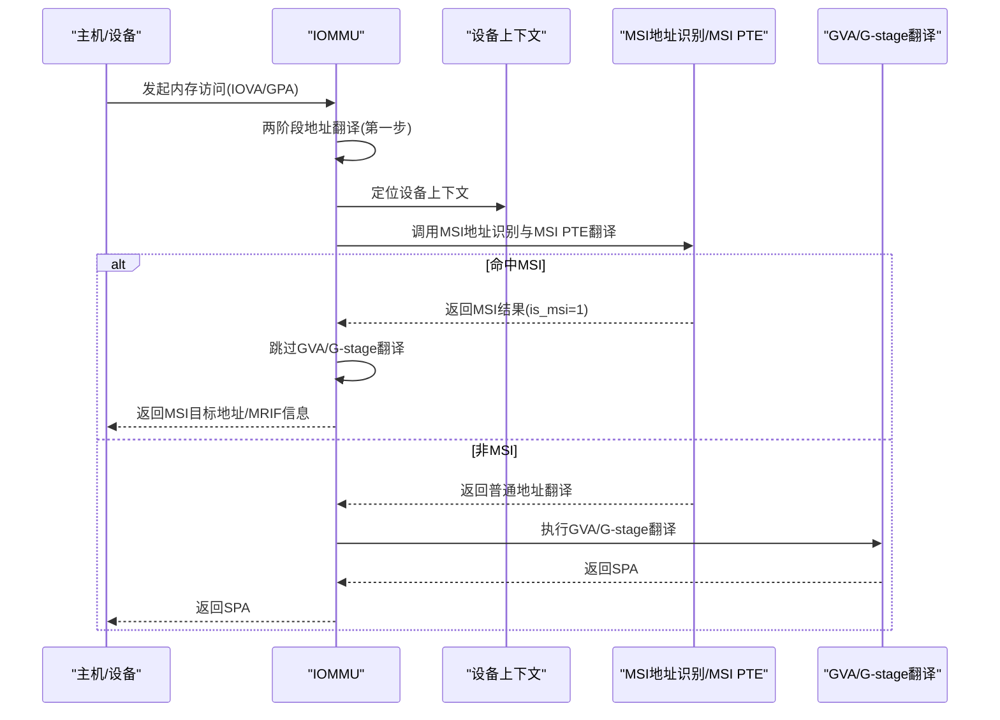
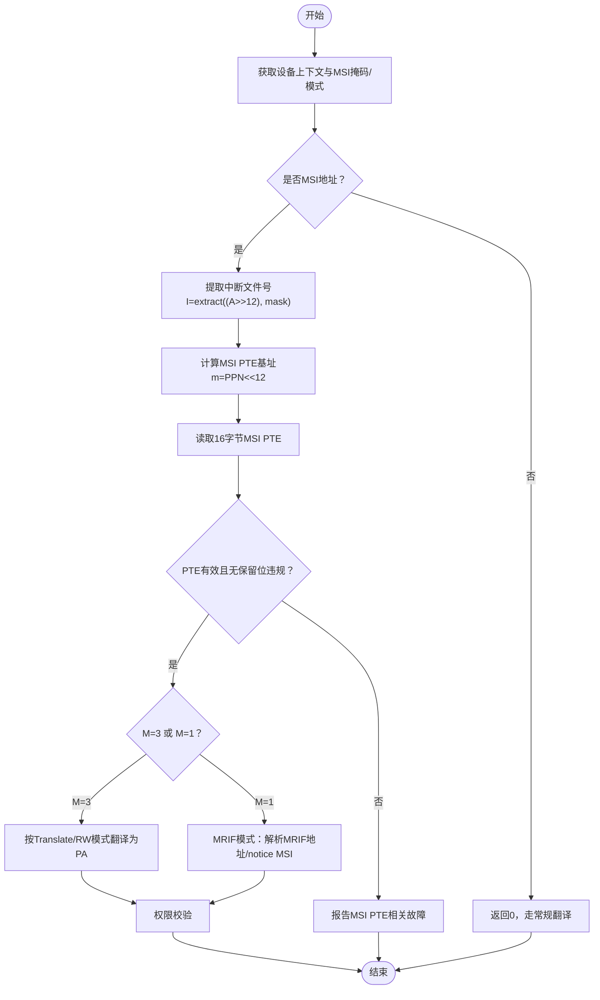
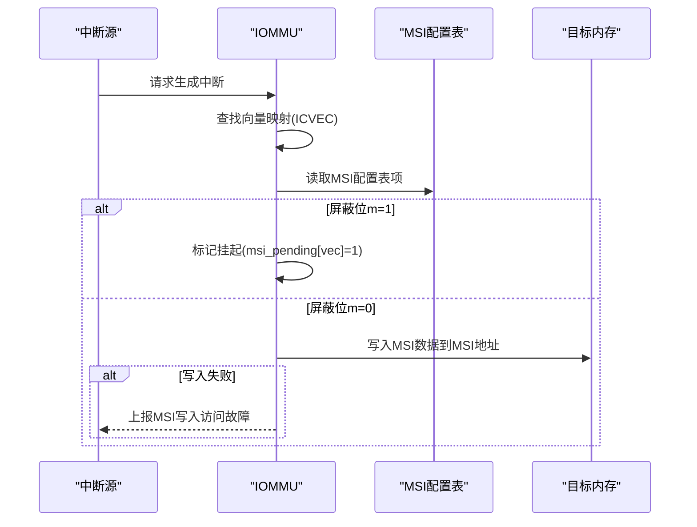
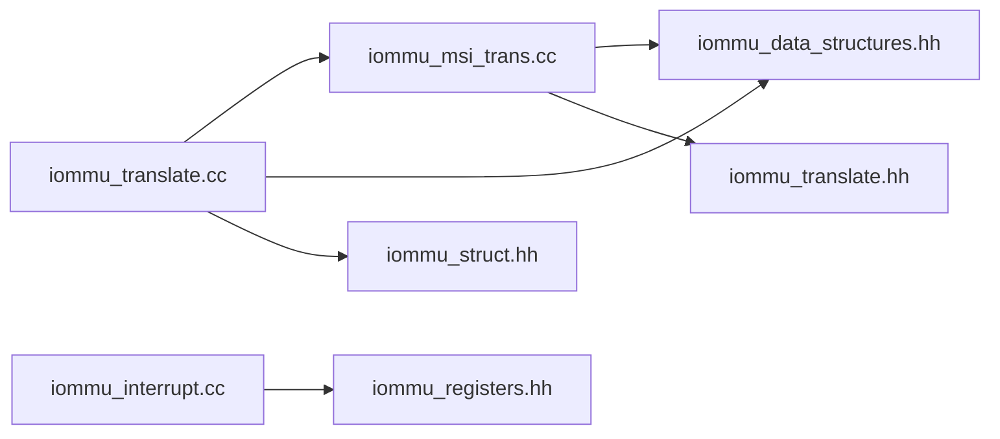

# MSI地址翻译

<cite>
**本文引用的文件**
- [iommu_msi_trans.cc](file://iommu/iommu_fun_model/iommu_msi_trans.cc)
- [iommu_translate.cc](file://iommu/iommu_fun_model/iommu_translate.cc)
- [iommu_translate.hh](file://iommu/include/iommu_translate.hh)
- [iommu_data_structures.hh](file://iommu/include/iommu_data_structures.hh)
- [iommu_struct.hh](file://iommu/include/iommu_struct.hh)
- [iommu_interrupt.cc](file://iommu/iommu_fun_model/iommu_interrupt.cc)
- [iommu_registers.hh](file://iommu/include/iommu_registers.hh)
- [iommu_ref_api.cc](file://iommu/iommu_perf_model/iommu_ref_api.cc)
</cite>

## 目录
1. [简介](#简介)
2. [项目结构](#项目结构)
3. [核心组件](#核心组件)
4. [架构总览](#架构总览)
5. [详细组件分析](#详细组件分析)
6. [依赖关系分析](#依赖关系分析)
7. [性能考量](#性能考量)
8. [故障排查指南](#故障排查指南)
9. [结论](#结论)
10. [附录](#附录)

## 简介
本文件系统性阐述RISC-V IOMMU中MSI（Message Signaled Interrupt）地址翻译机制，重点覆盖：
- MSI地址识别算法与MSI页表（MSI PTE）翻译流程
- MRIF（Memory Resident Interrupt File）模式的特殊处理
- MSI地址翻译与普通地址转换的区别
- MSI中断路由机制与异常处理
- 最佳实践与性能优化建议

## 项目结构
围绕MSI地址翻译的相关代码主要分布在以下模块：
- 地址翻译与MSI路径：iommu_translate.cc、iommu_msi_trans.cc
- 数据结构定义：iommu_translate.hh、iommu_data_structures.hh、iommu_struct.hh
- 中断生成与MSI写入：iommu_interrupt.cc
- 寄存器与MSI配置表：iommu_registers.hh
- MRIF重叠处理辅助：iommu_ref_api.cc

图表来源
- [iommu_translate.cc:1-732](file://iommu/iommu_fun_model/iommu_translate.cc#L1-L732)
- [iommu_msi_trans.cc:1-294](file://iommu/iommu_fun_model/iommu_msi_trans.cc#L1-L294)
- [iommu_translate.hh:1-132](file://iommu/include/iommu_translate.hh#L1-L132)
- [iommu_data_structures.hh:1-415](file://iommu/include/iommu_data_structures.hh#L1-L415)
- [iommu_struct.hh:1-102](file://iommu/include/iommu_struct.hh#L1-L102)
- [iommu_interrupt.cc:1-121](file://iommu/iommu_fun_model/iommu_interrupt.cc#L1-L121)
- [iommu_registers.hh:730-987](file://iommu/include/iommu_registers.hh#L730-L987)
- [iommu_ref_api.cc:209-226](file://iommu/iommu_perf_model/iommu_ref_api.cc#L209-L226)

章节来源
- [iommu_translate.cc:1-732](file://iommu/iommu_fun_model/iommu_translate.cc#L1-L732)
- [iommu_msi_trans.cc:1-294](file://iommu/iommu_fun_model/iommu_msi_trans.cc#L1-L294)
- [iommu_translate.hh:1-132](file://iommu/include/iommu_translate.hh#L1-L132)
- [iommu_data_structures.hh:1-415](file://iommu/include/iommu_data_structures.hh#L1-L415)
- [iommu_struct.hh:1-102](file://iommu/include/iommu_struct.hh#L1-L102)
- [iommu_interrupt.cc:1-121](file://iommu/iommu_fun_model/iommu_interrupt.cc#L1-L121)
- [iommu_registers.hh:730-987](file://iommu/include/iommu_registers.hh#L730-L987)
- [iommu_ref_api.cc:209-226](file://iommu/iommu_perf_model/iommu_ref_api.cc#L209-L226)

## 核心组件
- MSI地址识别与MSI PTE翻译：负责判断访问是否为MSI、提取中断文件号、读取MSI PTE并进行MRIF模式处理或直接翻译。
- 两阶段地址翻译入口：在常规GPA翻译前插入MSI地址翻译路径，若命中MSI则短路后续GVA/G-stage翻译。
- MSI PTE结构与字段：包含有效位、模式位（M）、保留位、MRIF目标地址、notice MSI数据等。
- 设备上下文与MSI页表指针：MSI地址掩码/模式用于识别MSI写入，MSI页表指针决定是否启用MSI地址翻译。
- MSI写入与中断生成：通过MSI配置表选择向何处发送MSI，支持屏蔽位与挂起队列。
- MRIF重叠处理：在非4K页场景下，根据MSI地址掩码/模式动态调整页大小以匹配MSI虚拟中断文件区域。

章节来源
- [iommu_msi_trans.cc:20-294](file://iommu/iommu_fun_model/iommu_msi_trans.cc#L20-L294)
- [iommu_translate.cc:388-441](file://iommu/iommu_fun_model/iommu_translate.cc#L388-L441)
- [iommu_translate.hh:61-92](file://iommu/include/iommu_translate.hh#L61-L92)
- [iommu_data_structures.hh:260-335](file://iommu/include/iommu_data_structures.hh#L260-L335)
- [iommu_interrupt.cc:27-121](file://iommu/iommu_fun_model/iommu_interrupt.cc#L27-L121)
- [iommu_ref_api.cc:212-226](file://iommu/iommu_perf_model/iommu_ref_api.cc#L212-L226)

## 架构总览
MSI地址翻译在两阶段地址翻译流程中的位置如下：

图表来源
- [iommu_translate.cc:388-441](file://iommu/iommu_fun_model/iommu_translate.cc#L388-L441)
- [iommu_msi_trans.cc:20-294](file://iommu/iommu_fun_model/iommu_msi_trans.cc#L20-L294)

## 详细组件分析

### MSI地址识别与MSI PTE翻译（核心流程）
- 步骤概览
  1) 从设备上下文获取MSI地址掩码与模式，计算MGPAW掩码。
  2) 判断访问地址是否符合MSI模式：(A>>12)&~mask == pattern&~mask。
  3) 若非MSI，返回0，交由常规翻译路径处理。
  4) 若为MSI，提取中断文件号I=extract((A>>12), mask)。
  5) 计算MSI PTE基址m=DC.msiptp.PPN<<12，读取16字节MSI PTE。
  6) 校验MSI PTE有效性、保留位、数据一致性。
  7) 根据M字段处理：
     - M=3：按“Translate/RW”模式直接翻译为物理地址。
     - M=1：MRIF模式，解析MRIF目标地址、notice MSI数据，设置is_mrif=1。
  8) 权限校验：执行读取/执行场景下的权限检查。
  9) 返回翻译结果与错误码。

图表来源
- [iommu_msi_trans.cc:20-294](file://iommu/iommu_fun_model/iommu_msi_trans.cc#L20-L294)

章节来源
- [iommu_msi_trans.cc:20-294](file://iommu/iommu_fun_model/iommu_msi_trans.cc#L20-L294)

### MSI PTE格式与处理逻辑
- MSI PTE结构
  - 通用字段：V（有效）、M（模式）、C（自定义/保留扩展位）、upperQW（高64位）。
  - Translate/RW模式（M=3）：包含PPN字段，用于直接翻译。
  - MRIF模式（M=1）：包含MRIF目标地址、notice MSI数据（N10/N90/NPPN）等。
- 处理要点
  - 仅当V=1且无保留位违规时才视为有效。
  - M=3时，直接组合MSI PTE.PPN与A低12位得到PA。
  - M=1时，需检查MRIF能力位与保留位，解析MRIF地址与notice MSI数据。
  - 权限方面，MSI翻译结果等效于R=W=U=1且X=0的PTE属性。

章节来源
- [iommu_translate.hh:61-92](file://iommu/include/iommu_translate.hh#L61-L92)
- [iommu_msi_trans.cc:155-273](file://iommu/iommu_fun_model/iommu_msi_trans.cc#L155-L273)

### MRIF模式特殊处理
- MRIF模式启用条件：MSI PTE的M=1且IOMMU能力位支持MSI_MRIF。
- 关键字段
  - MRIF地址：MSI PTE中MRIF_ADDR_55_9左移9位得到MRIF基地址。
  - Notice MSI数据：N10<<10 | N90作为notice MSI的11位数据，零扩展为32位。
  - Notice MSI目标：NPPN<<12作为notice MSI写入的目标物理地址。
- 行为特征
  - MRIF模式不缓存在ATC/IOTLB，避免与普通地址翻译混淆。
  - 当MSI被判定为MRIF模式时，两阶段翻译流程会短路，直接返回MRIF相关信息。

章节来源
- [iommu_msi_trans.cc:219-273](file://iommu/iommu_fun_model/iommu_msi_trans.cc#L219-L273)
- [iommu_translate.cc:406-418](file://iommu/iommu_fun_model/iommu_translate.cc#L406-L418)

### MSI地址翻译与普通地址转换的区别
- 触发时机不同
  - MSI路径在两阶段地址翻译之前调用，优先于GVA/G-stage翻译。
  - 普通地址转换在MSI路径未命中后执行。
- 结果差异
  - MSI路径可能直接返回PA（M=3）或MRIF信息（M=1），无需进一步G-stage翻译。
  - 普通地址转换需要完成G-stage翻译，得到最终SPA。
- 缓存策略
  - MSI路径（特别是MRIF模式）不缓存于ATC/IOTLB，以避免与普通地址翻译冲突。

章节来源
- [iommu_translate.cc:388-441](file://iommu/iommu_fun_model/iommu_translate.cc#L388-L441)
- [iommu_translate.cc:458-492](file://iommu/iommu_fun_model/iommu_translate.cc#L458-L492)

### MSI中断路由机制
- MSI配置表
  - IOMMU提供16项MSI配置表项，每项包含MSI地址、MSI数据与向量控制。
  - 向量控制包含屏蔽位，支持挂起未发送的MSI并在解除屏蔽后补发。
- 中断生成流程
  - 根据中断源映射到向量，查询MSI配置表。
  - 若屏蔽位为1，则将该向量标记为挂起；否则直接写入MSI地址与数据。
  - MSI写入失败时，上报“MSI写入访问故障”。

图表来源
- [iommu_interrupt.cc:27-121](file://iommu/iommu_fun_model/iommu_interrupt.cc#L27-L121)
- [iommu_registers.hh:730-987](file://iommu/include/iommu_registers.hh#L730-L987)

章节来源
- [iommu_interrupt.cc:27-121](file://iommu/iommu_fun_model/iommu_interrupt.cc#L27-L121)
- [iommu_registers.hh:730-987](file://iommu/include/iommu_registers.hh#L730-L987)

### MSI地址翻译失败的异常处理
- 常见故障类型
  - MSI PTE加载访问故障（cause=261）
  - MSI PTE无效（cause=262）
  - MSI PTE配置错误（cause=263）
  - MSI PT数据损坏（cause=270）
  - MSI写入访问故障（cause=273）
- 处理策略
  - 在MSI路径中立即返回错误码并终止翻译。
  - 在两阶段翻译入口处，依据错误码生成相应响应（UR/CA）或记录故障队列。

章节来源
- [iommu_msi_trans.cc:136-153](file://iommu/iommu_fun_model/iommu_msi_trans.cc#L136-L153)
- [iommu_msi_trans.cc:155-184](file://iommu/iommu_fun_model/iommu_msi_trans.cc#L155-L184)
- [iommu_translate.cc:628-707](file://iommu/iommu_fun_model/iommu_translate.cc#L628-L707)

### MRIF模式与MSI虚拟中断文件重叠处理
- 场景背景
  - 当MSI虚拟中断文件跨越多级页表时，需要根据MSI地址掩码/模式动态调整页大小以匹配MSI区域。
- 处理逻辑
  - 从最大页开始向下遍历，若MSI地址满足掩码/模式匹配，则缩小页大小。
  - 该过程确保MSI虚拟中断文件区域的页大小与MSI地址识别一致。

章节来源
- [iommu_ref_api.cc:212-226](file://iommu/iommu_perf_model/iommu_ref_api.cc#L212-L226)

## 依赖关系分析
- 组件耦合
  - iommu_translate.cc依赖iommu_msi_trans.cc进行MSI路径判定与翻译。
  - iommu_msi_trans.cc依赖设备上下文（MSI掩码/模式、MSI页表指针）与MSI PTE结构。
  - iommu_interrupt.cc依赖MSI配置表与寄存器能力位。
- 外部依赖
  - 寄存器布局与MSI配置表定义来自iommu_registers.hh。
  - 全局IOMMU状态与端口接口来自iommu_struct.hh。

图表来源
- [iommu_translate.cc:1-732](file://iommu/iommu_fun_model/iommu_translate.cc#L1-L732)
- [iommu_msi_trans.cc:1-294](file://iommu/iommu_fun_model/iommu_msi_trans.cc#L1-L294)
- [iommu_data_structures.hh:1-415](file://iommu/include/iommu_data_structures.hh#L1-L415)
- [iommu_translate.hh:1-132](file://iommu/include/iommu_translate.hh#L1-L132)
- [iommu_struct.hh:1-102](file://iommu/include/iommu_struct.hh#L1-L102)
- [iommu_interrupt.cc:1-121](file://iommu/iommu_fun_model/iommu_interrupt.cc#L1-L121)
- [iommu_registers.hh:730-987](file://iommu/include/iommu_registers.hh#L730-L987)

章节来源
- [iommu_translate.cc:1-732](file://iommu/iommu_fun_model/iommu_translate.cc#L1-L732)
- [iommu_msi_trans.cc:1-294](file://iommu/iommu_fun_model/iommu_msi_trans.cc#L1-L294)
- [iommu_data_structures.hh:1-415](file://iommu/include/iommu_data_structures.hh#L1-L415)
- [iommu_translate.hh:1-132](file://iommu/include/iommu_translate.hh#L1-L132)
- [iommu_struct.hh:1-102](file://iommu/include/iommu_struct.hh#L1-L102)
- [iommu_interrupt.cc:1-121](file://iommu/iommu_fun_model/iommu_interrupt.cc#L1-L121)
- [iommu_registers.hh:730-987](file://iommu/include/iommu_registers.hh#L730-L987)

## 性能考量
- 缓存策略
  - MSI路径（尤其是MRIF模式）不缓存于ATC/IOTLB，避免与普通地址翻译冲突。
  - 对于Translate/RW模式的MSI PTE，可按需缓存以减少重复读取。
- 页大小匹配
  - 使用MRIF重叠处理逻辑动态调整页大小，减少不必要的页表遍历。
- I/O QoS
  - MSI写入使用RCID/MCID配置，便于IO桥区分IOMMU发起的请求优先级。

章节来源
- [iommu_translate.cc:458-492](file://iommu/iommu_fun_model/iommu_translate.cc#L458-L492)
- [iommu_ref_api.cc:212-226](file://iommu/iommu_perf_model/iommu_ref_api.cc#L212-L226)
- [iommu_registers.hh:752-769](file://iommu/include/iommu_registers.hh#L752-L769)

## 故障排查指南
- 常见问题定位
  - MSI PTE加载访问故障：检查MSI页表基址与页表权限。
  - MSI PTE无效/配置错误：核对V/C/M/保留位。
  - MSI PT数据损坏：确认内存一致性与RAS支持。
  - MSI写入访问故障：检查MSI地址越界与目标内存可写性。
- 响应与日志
  - 两阶段翻译入口根据错误码生成UR/CA响应或记录故障队列。
  - MSI写入失败时，上报“MSI写入访问故障”，并携带原始MSI地址。

章节来源
- [iommu_msi_trans.cc:136-153](file://iommu/iommu_fun_model/iommu_msi_trans.cc#L136-L153)
- [iommu_translate.cc:628-707](file://iommu/iommu_fun_model/iommu_translate.cc#L628-L707)
- [iommu_interrupt.cc:19-25](file://iommu/iommu_fun_model/iommu_interrupt.cc#L19-L25)

## 结论
- MSI地址翻译在两阶段地址翻译中扮演“前置过滤器”的角色，显著简化了MSI写入的处理路径。
- MSI PTE的两种模式（Translate/RW与MRIF）分别面向直写与内存驻留中断文件场景，需严格遵循保留位与能力位约束。
- MRIF模式通过向量控制与挂起队列实现可靠的中断投递，同时避免与普通地址翻译缓存冲突。
- 通过合理的页大小匹配与缓存策略，可在保证正确性的前提下提升MSI路径的性能。

## 附录
- 关键数据结构与寄存器
  - MSI PTE结构与字段：参见MSI PTE定义与MRIF字段。
  - 设备上下文与MSI页表指针：参见MSI页表指针与MSI地址掩码/模式。
  - MSI配置表：参见MSI配置表项与向量控制。

章节来源
- [iommu_translate.hh:61-92](file://iommu/include/iommu_translate.hh#L61-L92)
- [iommu_data_structures.hh:260-335](file://iommu/include/iommu_data_structures.hh#L260-L335)
- [iommu_registers.hh:730-987](file://iommu/include/iommu_registers.hh#L730-L987)