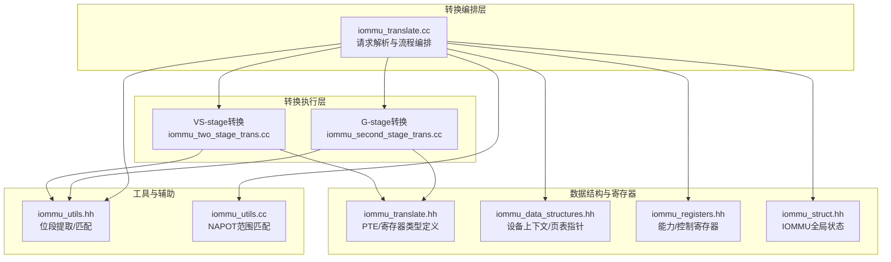
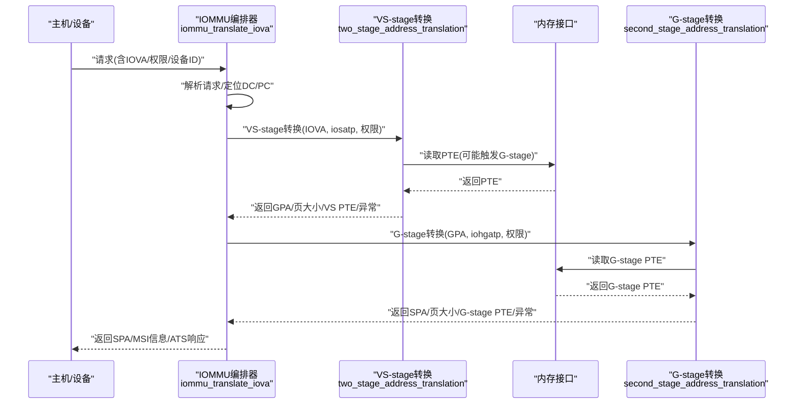
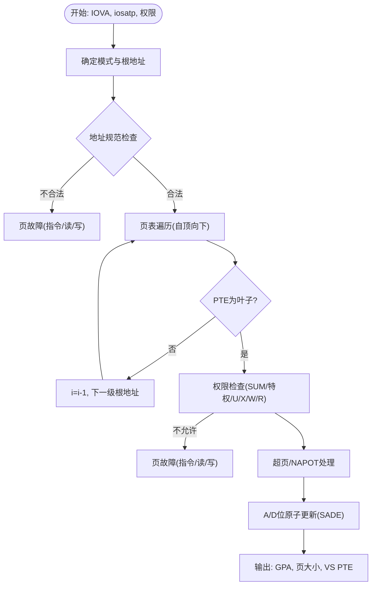
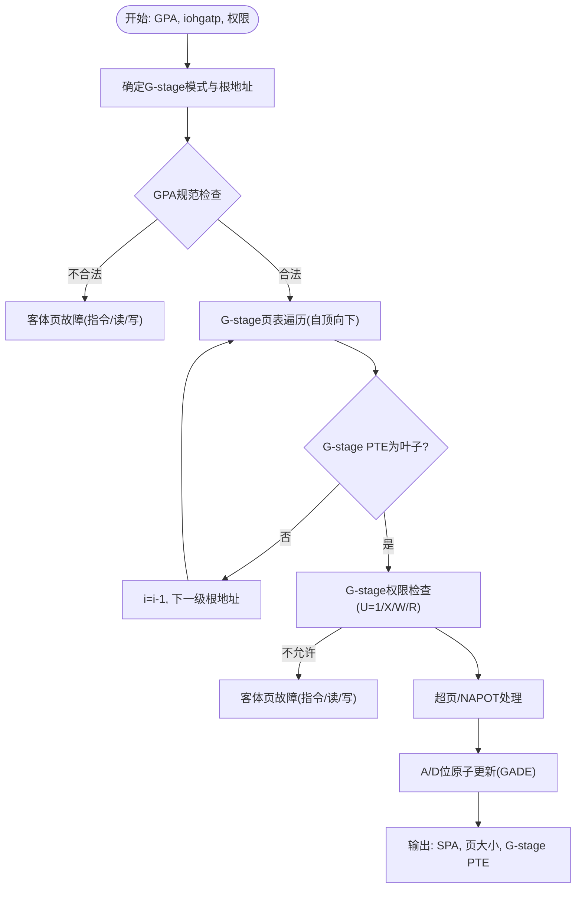
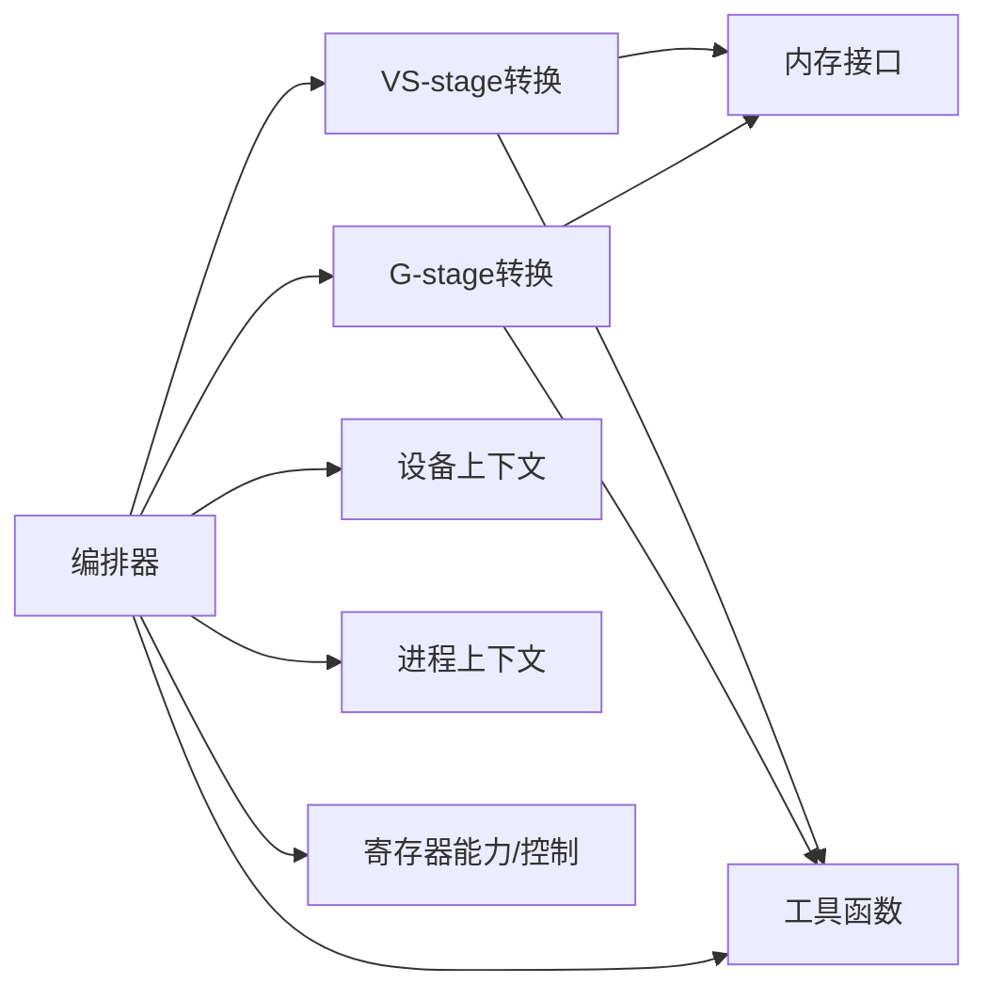

# 两级地址转换

<cite>
**本文档引用的文件**
- [iommu_two_stage_trans.cc](file://iommu/iommu_fun_model/iommu_two_stage_trans.cc)
- [iommu_second_stage_trans.cc](file://iommu/iommu_fun_model/iommu_second_stage_trans.cc)
- [iommu_translate.cc](file://iommu/iommu_fun_model/iommu_translate.cc)
- [iommu_translate.hh](file://iommu/include/iommu_translate.hh)
- [iommu_data_structures.hh](file://iommu/include/iommu_data_structures.hh)
- [iommu_struct.hh](file://iommu/include/iommu_struct.hh)
- [iommu_registers.hh](file://iommu/include/iommu_registers.hh)
- [iommu_utils.hh](file://iommu/include/iommu_utils.hh)
- [iommu_utils.cc](file://iommu/iommu_fun_model/iommu_utils.cc)
</cite>

## 目录
1. [简介](#简介)
2. [项目结构](#项目结构)
3. [核心组件](#核心组件)
4. [架构总览](#架构总览)
5. [详细组件分析](#详细组件分析)
6. [依赖关系分析](#依赖关系分析)
7. [性能考虑](#性能考虑)
8. [故障排查指南](#故障排查指南)
9. [结论](#结论)

## 简介
本文件系统性阐述RISC-V IOMMU两级地址转换（两阶段地址转换）的实现与工作机制，覆盖VS-stage（虚拟化阶段）与G-stage（全局/宿主阶段）的完整转换流程。内容包括：
- 第一阶段：从IOVA到GPA的转换，涉及页表遍历、权限校验、NAPOT处理、A/D位原子更新等
- 第二阶段：从GPA到SPA的转换，同样包含页表遍历、权限校验、NAPOT处理、A/D位原子更新
- 页表格式差异与嵌套页表结构处理
- 异常与错误分类、iotval/iotval2编码规则
- 性能优化策略与缓存利用

## 项目结构
围绕两级地址转换的核心源码主要分布在以下模块：
- 转换入口与编排：iommu_translate.cc
- VS-stage转换：iommu_two_stage_trans.cc
- G-stage转换：iommu_second_stage_trans.cc
- 数据结构与寄存器定义：iommu_translate.hh、iommu_data_structures.hh、iommu_registers.hh、iommu_struct.hh
- 工具函数：iommu_utils.hh、iommu_utils.cc

**图表来源**
- [iommu_translate.cc:1-732](file://iommu/iommu_fun_model/iommu_translate.cc#L1-L732)
- [iommu_two_stage_trans.cc:1-600](file://iommu/iommu_fun_model/iommu_two_stage_trans.cc#L1-L600)
- [iommu_second_stage_trans.cc:1-424](file://iommu/iommu_fun_model/iommu_second_stage_trans.cc#L1-L424)
- [iommu_translate.hh:1-132](file://iommu/include/iommu_translate.hh#L1-L132)
- [iommu_data_structures.hh:1-415](file://iommu/include/iommu_data_structures.hh#L1-L415)
- [iommu_registers.hh:1-800](file://iommu/include/iommu_registers.hh#L1-L800)
- [iommu_struct.hh:1-102](file://iommu/include/iommu_struct.hh#L1-L102)
- [iommu_utils.hh:1-11](file://iommu/include/iommu_utils.hh#L1-L11)
- [iommu_utils.cc:1-18](file://iommu/iommu_fun_model/iommu_utils.cc#L1-L18)

**章节来源**
- [iommu_translate.cc:1-732](file://iommu/iommu_fun_model/iommu_translate.cc#L1-L732)
- [iommu_two_stage_trans.cc:1-600](file://iommu/iommu_fun_model/iommu_two_stage_trans.cc#L1-L600)
- [iommu_second_stage_trans.cc:1-424](file://iommu/iommu_fun_model/iommu_second_stage_trans.cc#L1-L424)
- [iommu_translate.hh:1-132](file://iommu/include/iommu_translate.hh#L1-L132)
- [iommu_data_structures.hh:1-415](file://iommu/include/iommu_data_structures.hh#L1-L415)
- [iommu_registers.hh:1-800](file://iommu/include/iommu_registers.hh#L1-L800)
- [iommu_struct.hh:1-102](file://iommu/include/iommu_struct.hh#L1-L102)
- [iommu_utils.hh:1-11](file://iommu/include/iommu_utils.hh#L1-L11)
- [iommu_utils.cc:1-18](file://iommu/iommu_fun_model/iommu_utils.cc#L1-L18)

## 核心组件
- VS-stage转换器（two_stage_address_translation）
  - 功能：完成从IOVA到GPA的转换，含页表遍历、权限检查、NAPOT处理、A/D位原子更新、超页大小计算
  - 关键输入：IOVA、iosatp、权限属性、SADE、SXL、端序等
  - 关键输出：GPA、页大小、VS-stage PTE、异常原因码
- G-stage转换器（second_stage_address_translation）
  - 功能：完成从GPA到SPA的转换，含页表遍历、权限检查、NAPOT处理、A/D位原子更新、超页大小计算
  - 关键输入：GPA、iohgatp、权限属性、GADE、SADE、SXL、端序等
  - 关键输出：SPA、页大小、G-stage PTE、异常原因码
- 转换编排器（iommu_translate_iova）
  - 功能：解析请求、定位设备/进程上下文、选择页表模式、调用两阶段转换、处理MSI地址翻译、填充响应
  - 关键流程：设备上下文查找、进程上下文查找、两阶段转换、MSI翻译、缓存写入

**章节来源**
- [iommu_two_stage_trans.cc:8-600](file://iommu/iommu_fun_model/iommu_two_stage_trans.cc#L8-L600)
- [iommu_second_stage_trans.cc:8-424](file://iommu/iommu_fun_model/iommu_second_stage_trans.cc#L8-L424)
- [iommu_translate.cc:8-732](file://iommu/iommu_fun_model/iommu_translate.cc#L8-L732)

## 架构总览
两阶段地址转换在IOMMU内部的调用关系如下：

**图表来源**
- [iommu_translate.cc:332-440](file://iommu/iommu_fun_model/iommu_translate.cc#L332-L440)
- [iommu_two_stage_trans.cc:183-189](file://iommu/iommu_fun_model/iommu_two_stage_trans.cc#L183-L189)
- [iommu_second_stage_trans.cc:429-439](file://iommu/iommu_fun_model/iommu_second_stage_trans.cc#L429-L439)

## 详细组件分析

### VS-stage转换流程（从IOVA到GPA）
VS-stage转换负责将设备发起的IOVA映射为GPA，流程要点：
- 模式识别与页表根定位：根据iosatp.MODE选择Sv32/Sv39/Sv48/Sv57，计算根地址PPN×页大小
- 地址合法性检查：SXL与SvNx条件下对IOVA进行非规范地址检查
- 页表遍历：按LEVELS从高到低逐级索引，读取PTE；若PTE为叶子则进入权限检查，否则继续下一级
- 权限检查：依据特权级别、SUM、U位、X/W/R位决定是否允许访问
- 超页与NAPOT：根据i值与PPN字段判断超页大小；NAPOT时按规则修正PPN
- A/D位原子更新：当SADE启用且G-stage PTE允许写时，通过原子读改写更新A/D位
- 输出：GPA、页大小、VS-stage PTE、异常原因码

**图表来源**
- [iommu_two_stage_trans.cc:84-306](file://iommu/iommu_fun_model/iommu_two_stage_trans.cc#L84-L306)
- [iommu_two_stage_trans.cc:308-502](file://iommu/iommu_fun_model/iommu_two_stage_trans.cc#L308-L502)
- [iommu_two_stage_trans.cc:504-598](file://iommu/iommu_fun_model/iommu_two_stage_trans.cc#L504-L598)

**章节来源**
- [iommu_two_stage_trans.cc:8-600](file://iommu/iommu_fun_model/iommu_two_stage_trans.cc#L8-L600)

### G-stage转换流程（从GPA到SPA）
G-stage转换负责将VS-stage得到的GPA映射为最终的SPA，流程要点：
- 模式识别与根定位：根据iohgatp.MODE选择Sv32x4/Sv39x4/Sv48x4/Sv57x4，计算根地址PPN×页大小
- 地址合法性检查：SXL条件下对GPA进行非规范地址检查
- 页表遍历：逐级索引，读取G-stage PTE；若叶子则进入权限检查，否则继续下一级
- 权限检查：G-stage要求U位必须为1；对X/W/R进行检查
- 超页与NAPOT：根据i值与PPN字段判断超页大小；NAPOT时按规则修正PPN
- A/D位原子更新：当GADE启用且PTE允许写时，通过原子读改写更新A/D位
- 输出：SPA、页大小、G-stage PTE、异常原因码

**图表来源**
- [iommu_second_stage_trans.cc:77-255](file://iommu/iommu_fun_model/iommu_second_stage_trans.cc#L77-L255)
- [iommu_second_stage_trans.cc:257-422](file://iommu/iommu_fun_model/iommu_second_stage_trans.cc#L257-L422)
- [iommu_second_stage_trans.cc:563-598](file://iommu/iommu_fun_model/iommu_second_stage_trans.cc#L563-L598)

**章节来源**
- [iommu_second_stage_trans.cc:8-424](file://iommu/iommu_fun_model/iommu_second_stage_trans.cc#L8-L424)

### 页表格式差异与嵌套页表
- VS-stage与G-stage页表字段一致（spte_t/gpte_t），均包含V/R/W/X/U/G/A/D/PBMT/N等位
- 嵌套页表：VS-stage根位于GPA空间（由G-stage转换后得到），G-stage根位于S/VS-stage页表之上
- 模式差异：
  - VS-stage：Sv32/Sv39/Sv48/Sv57，根地址PPN×页大小
  - G-stage：Sv32x4/Sv39x4/Sv48x4/Sv57x4，根地址PPN×页大小
- SXL与GXL：影响地址合法性检查与最大支持位宽

**章节来源**
- [iommu_translate.hh:23-60](file://iommu/include/iommu_translate.hh#L23-L60)
- [iommu_data_structures.hh:139-156](file://iommu/include/iommu_data_structures.hh#L139-L156)
- [iommu_data_structures.hh:187-200](file://iommu/include/iommu_data_structures.hh#L187-L200)

### 权限检查与内存类型解析
- VS-stage权限：特权级别、SUM、U位、X/W/R位共同决定访问许可
- G-stage权限：强制U=1；X/W/R位决定访问许可
- 内存类型（PBMT）：VS-stage优先覆盖G-stage的PMA；最终由IO桥解析

**章节来源**
- [iommu_two_stage_trans.cc:329-366](file://iommu/iommu_fun_model/iommu_two_stage_trans.cc#L329-L366)
- [iommu_second_stage_trans.cc:277-284](file://iommu/iommu_fun_model/iommu_second_stage_trans.cc#L277-L284)
- [iommu_translate.cc:443-451](file://iommu/iommu_fun_model/iommu_translate.cc#L443-L451)

### 异常处理机制
- 页故障（page fault）：指令/读/写页故障
- 访问故障（access fault）：PMA/PMP违规或物理地址越界
- 客体页故障（guest page fault）：VS-stage隐式访问失败或G-stage写权限不足
- 数据损坏（data corruption）：页表读取数据损坏
- ATS场景：部分权限缺失返回成功但置零相应权限位，不记录故障队列

**章节来源**
- [iommu_two_stage_trans.cc:504-561](file://iommu/iommu_fun_model/iommu_two_stage_trans.cc#L504-L561)
- [iommu_second_stage_trans.cc:149-172](file://iommu/iommu_fun_model/iommu_second_stage_trans.cc#L149-L172)
- [iommu_translate.cc:628-730](file://iommu/iommu_fun_model/iommu_translate.cc#L628-L730)

### 编排与缓存（IOTLB/IOATC）
- 编排器在两阶段转换后，将结果缓存至IOATC/IOTLB，使用NAPOT格式存储以支持超页
- ATS场景下可按配置缓存T2GPA或IOVA->SPA映射
- MSI地址翻译独立于两阶段转换，但结果与两阶段页大小取较小者

**章节来源**
- [iommu_translate.cc:458-492](file://iommu/iommu_fun_model/iommu_translate.cc#L458-L492)
- [iommu_translate.cc:406-440](file://iommu/iommu_fun_model/iommu_translate.cc#L406-L440)

## 依赖关系分析
- VS-stage依赖G-stage进行PTE地址转换（隐式访问），确保A/D位更新一致性
- 两阶段转换共享内存访问接口（read_memory/read_memory_for_AMO/write_memory）
- 编排器依赖设备/进程上下文、寄存器能力、端序设置等

**图表来源**
- [iommu_translate.cc:376-439](file://iommu/iommu_fun_model/iommu_translate.cc#L376-L439)
- [iommu_two_stage_trans.cc:183-189](file://iommu/iommu_fun_model/iommu_two_stage_trans.cc#L183-L189)
- [iommu_second_stage_trans.cc:159-161](file://iommu/iommu_fun_model/iommu_second_stage_trans.cc#L159-L161)

**章节来源**
- [iommu_translate.cc:1-732](file://iommu/iommu_fun_model/iommu_translate.cc#L1-L732)
- [iommu_two_stage_trans.cc:1-600](file://iommu/iommu_fun_model/iommu_two_stage_trans.cc#L1-L600)
- [iommu_second_stage_trans.cc:1-424](file://iommu/iommu_fun_model/iommu_second_stage_trans.cc#L1-L424)

## 性能考虑
- 页表缓存：通过IOATC/IOTLB缓存两阶段转换结果，减少重复页表遍历
- NAPOT：使用NAPOT格式缓存超页范围，提升命中率
- 原子更新：SADE/GADE启用时，A/D位原子更新避免多次重试
- 端序与字节序：根据fctl与SBE配置选择端序，减少不必要的转换
- 事件计数：统计页表遍历次数与TLB缺失，便于性能分析与优化

[本节提供通用指导，无需特定文件引用]

## 故障排查指南
- 常见原因码定位
  - 页故障：指令/读/写页故障（12/13/15）
  - 访问故障：指令/读/写访问故障（1/5/7）
  - 客体页故障：指令/读/写客体页故障（20/21/23）
  - 数据损坏：首/二阶段页表数据损坏（274）
- ATS场景特殊处理：权限不足返回成功但清零相应权限位，不写入故障队列
- iotval/iotval2：客体页故障时，iotval2携带被隐式访问的GPA高位信息

**章节来源**
- [iommu_translate.cc:628-730](file://iommu/iommu_fun_model/iommu_translate.cc#L628-L730)
- [iommu_two_stage_trans.cc:504-598](file://iommu/iommu_fun_model/iommu_two_stage_trans.cc#L504-L598)
- [iommu_second_stage_trans.cc:563-598](file://iommu/iommu_fun_model/iommu_second_stage_trans.cc#L563-L598)

## 结论
该IOMMU两级地址转换模型严格遵循RISC-V特权规范，通过清晰的VS-stage与G-stage职责划分，实现了从IOVA到SPA的可靠映射。其特性包括：
- 完整的页表遍历与权限检查
- NAPOT与超页支持
- A/D位原子更新保障一致性
- ATS友好响应与缓存优化
- 明确的异常分类与iotval/iotval2编码

这些设计使得系统在虚拟化与安全隔离场景中具备良好的可移植性与可维护性。