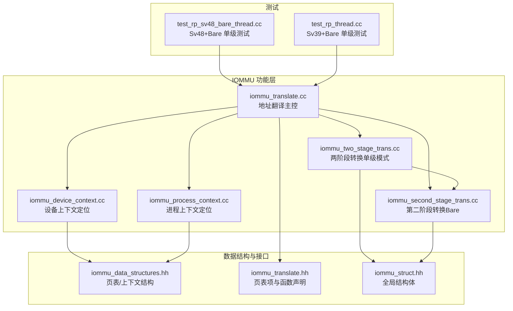
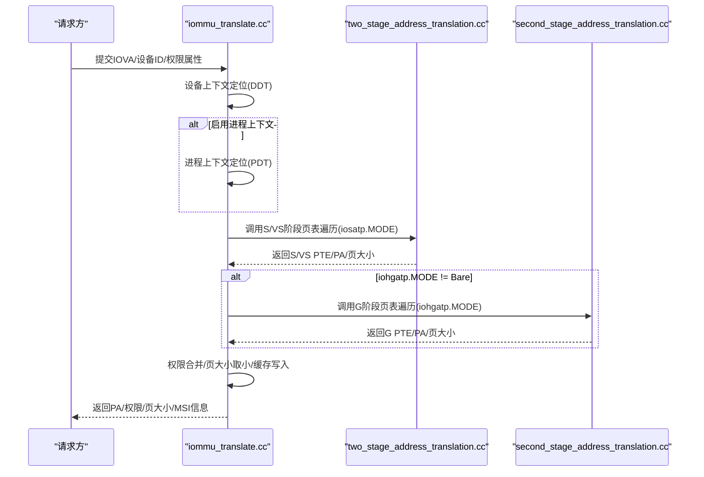
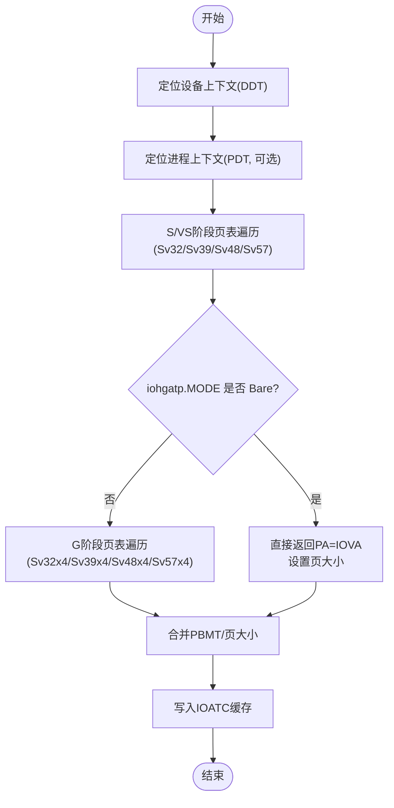
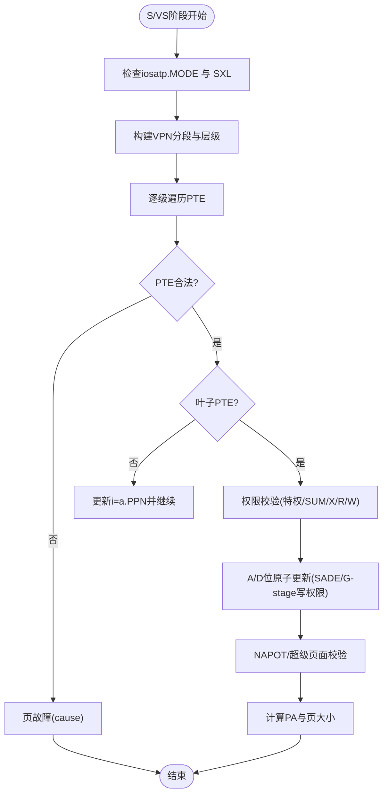
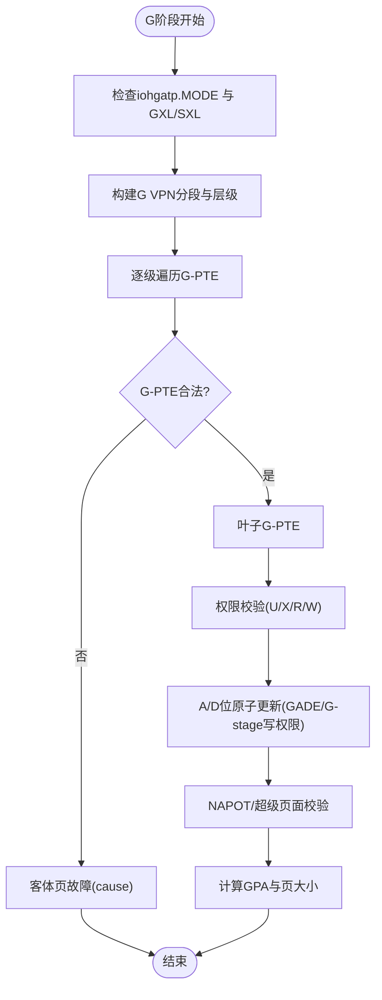
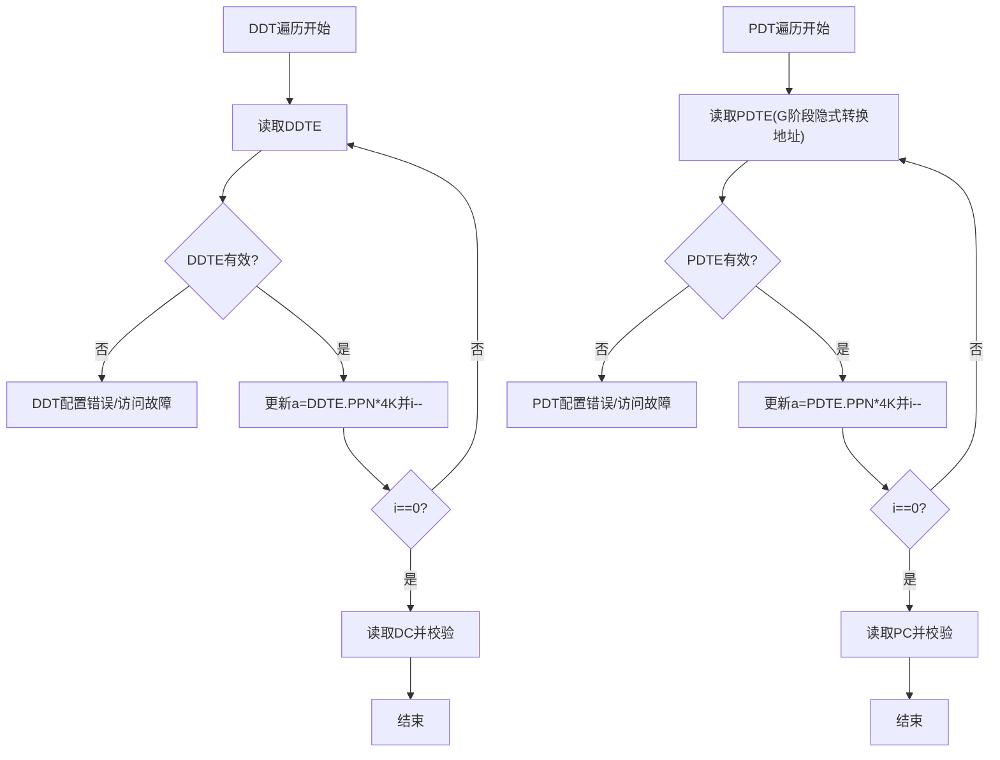
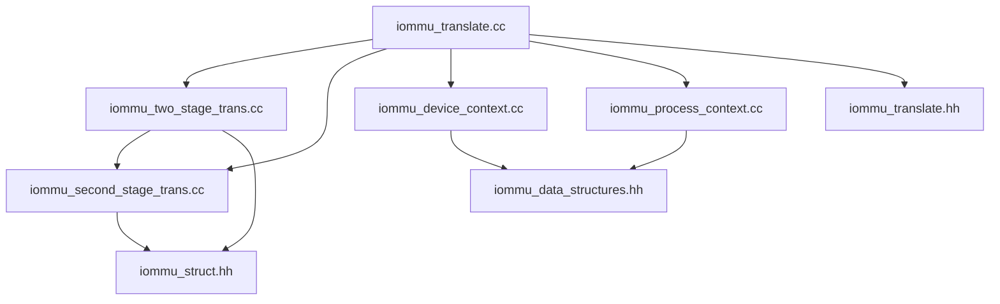

# 单级地址转换

<cite>
**本文引用的文件**
- [iommu_translate.cc](file://iommu/iommu_fun_model/iommu_translate.cc)
- [iommu_two_stage_trans.cc](file://iommu/iommu_fun_model/iommu_two_stage_trans.cc)
- [iommu_second_stage_trans.cc](file://iommu/iommu_fun_model/iommu_second_stage_trans.cc)
- [iommu_device_context.cc](file://iommu/iommu_perf_model/iommu_device_context.cc)
- [iommu_process_context.cc](file://iommu/iommu_fun_model/iommu_process_context.cc)
- [iommu_translate.hh](file://iommu/include/iommu_translate.hh)
- [iommu_data_structures.hh](file://iommu/include/iommu_data_structures.hh)
- [iommu_struct.hh](file://iommu/include/iommu_struct.hh)
- [test_rp_sv48_bare_thread.cc](file://rp/test_rp_sv48_bare_thread.cc)
- [test_rp_thread.cc](file://rp/test_rp_thread.cc)
</cite>

## 目录
1. [简介](#简介)
2. [项目结构](#项目结构)
3. [核心组件](#核心组件)
4. [架构总览](#架构总览)
5. [详细组件分析](#详细组件分析)
6. [依赖关系分析](#依赖关系分析)
7. [性能考量](#性能考量)
8. [故障排除指南](#故障排除指南)
9. [结论](#结论)
10. [附录](#附录)

## 简介
本文件聚焦于RISC-V IOMMU在“单级地址转换”场景下的实现与使用，即Sv39、Sv48、Sv57三种页表格式在仅启用第一阶段（S/VS）页表、不启用第二阶段（G）页表时的地址转换流程。文档从系统架构、组件关系、数据流、处理逻辑、集成点、错误处理与性能特征等方面进行深入解析，并结合测试用例路径说明典型用法与验证方式。

## 项目结构
该仓库以模块化方式组织IOMMU功能，其中与单级地址转换直接相关的核心文件如下：
- 地址翻译主控：iommu_translate.cc
- 两阶段地址转换（含单级模式分支）：iommu_two_stage_trans.cc
- 第二阶段地址转换（含Bare模式）：iommu_second_stage_trans.cc
- 设备上下文定位：iommu_device_context.cc
- 进程上下文定位：iommu_process_context.cc
- 数据结构与类型定义：iommu_data_structures.hh、iommu_translate.hh、iommu_struct.hh
- 测试用例：test_rp_sv48_bare_thread.cc、test_rp_thread.cc

图表来源
- [iommu_translate.cc:1-732](file://iommu/iommu_fun_model/iommu_translate.cc#L1-L732)
- [iommu_two_stage_trans.cc:1-600](file://iommu/iommu_fun_model/iommu_two_stage_trans.cc#L1-L600)
- [iommu_second_stage_trans.cc:1-424](file://iommu/iommu_fun_model/iommu_second_stage_trans.cc#L1-L424)
- [iommu_device_context.cc:1-419](file://iommu/iommu_perf_model/iommu_device_context.cc#L1-L419)
- [iommu_process_context.cc:1-236](file://iommu/iommu_fun_model/iommu_process_context.cc#L1-L236)
- [iommu_data_structures.hh:1-415](file://iommu/include/iommu_data_structures.hh#L1-L415)
- [iommu_translate.hh:1-132](file://iommu/include/iommu_translate.hh#L1-L132)
- [iommu_struct.hh:1-102](file://iommu/include/iommu_struct.hh#L1-L102)
- [test_rp_sv48_bare_thread.cc:1-230](file://rp/test_rp_sv48_bare_thread.cc#L1-L230)
- [test_rp_thread.cc:1-301](file://rp/test_rp_thread.cc#L1-L301)

章节来源
- [iommu_translate.cc:1-732](file://iommu/iommu_fun_model/iommu_translate.cc#L1-L732)
- [iommu_data_structures.hh:1-415](file://iommu/include/iommu_data_structures.hh#L1-L415)

## 核心组件
- 地址翻译主控（iommu_translate.cc）
  - 负责设备上下文查找、进程上下文定位、两阶段地址转换调用、MSI地址翻译、第二阶段地址转换、结果缓存与响应生成。
  - 关键流程：设备ID分解与DDT查找、DC配置校验、PC定位（可选）、S/VS阶段页表遍历、权限检查、G阶段页表遍历（若启用）、MSI识别与处理、最终PA计算与响应封装。
- 两阶段地址转换（iommu_two_stage_trans.cc）
  - 在S/VS阶段执行页表遍历，支持Sv32/Sv39/Sv48/Sv57；当iosatp.MODE为Bare时，直接返回IOVA作为PA并设置页大小。
  - 处理PTE读取、合法性检查、权限校验、A/D位原子更新、NAPOT处理、超级页面对齐与大小计算。
- 第二阶段地址转换（iommu_second_stage_trans.cc）
  - 在G阶段执行页表遍历，支持Sv32x4/Sv39x4/Sv48x4/Sv57x4；当iohgatp.MODE为Bare时，直接映射为PA并设置页大小。
  - 处理PTE读取、合法性检查、权限校验、A/D位原子更新、NAPOT处理、超级页面对齐与大小计算。
- 设备上下文定位（iommu_device_context.cc）
  - 基于DDT-radix树按DDI索引遍历，支持1/2/3级目录；校验DC有效性与配置一致性。
- 进程上下文定位（iommu_process_context.cc）
  - 基于PDT-radix树按PDI索引遍历，支持1/2/3级目录；校验PC有效性与配置一致性；必要时通过G阶段页表隐式转换PDT根地址。

章节来源
- [iommu_translate.cc:1-732](file://iommu/iommu_fun_model/iommu_translate.cc#L1-L732)
- [iommu_two_stage_trans.cc:1-600](file://iommu/iommu_fun_model/iommu_two_stage_trans.cc#L1-L600)
- [iommu_second_stage_trans.cc:1-424](file://iommu/iommu_fun_model/iommu_second_stage_trans.cc#L1-L424)
- [iommu_device_context.cc:1-419](file://iommu/iommu_perf_model/iommu_device_context.cc#L1-L419)
- [iommu_process_context.cc:1-236](file://iommu/iommu_fun_model/iommu_process_context.cc#L1-L236)

## 架构总览
单级地址转换的关键在于：当iohgatp.MODE为Bare时，IOMMU仅执行S/VS阶段页表转换，无需G阶段；此时S/VS阶段的MODE可为Sv32/Sv39/Sv48/Sv57，分别对应不同的VPN划分与页表层级。

图表来源
- [iommu_translate.cc:332-493](file://iommu/iommu_fun_model/iommu_translate.cc#L332-L493)
- [iommu_two_stage_trans.cc:8-17](file://iommu/iommu_fun_model/iommu_two_stage_trans.cc#L8-L17)
- [iommu_second_stage_trans.cc:7-15](file://iommu/iommu_fun_model/iommu_second_stage_trans.cc#L7-L15)

## 详细组件分析

### 组件A：单级地址转换主流程（Sv39/Sv48/Sv57）
- 设备上下文定位与配置校验
  - 按DDI[2:0]索引遍历DDT-radix树，读取DC并进行配置一致性检查。
- 进程上下文定位（可选）
  - 若PDTV=0或需要按进程区分，则按PDI[2:0]索引遍历PDT-radix树，读取PC。
- S/VS阶段页表遍历（单级）
  - 支持Sv32/Sv39/Sv48/Sv57，根据MODE计算VPN分段与层级，逐级读取PTE，完成权限校验与A/D位原子更新。
- Bare模式（S/VS阶段Bare）
  - 直接将IOVA作为PA，按能力选择页大小返回。
- 结果处理与缓存
  - 将S/VS与G阶段的PBMT与页大小合并，写入IOATC缓存（除某些MSI MRIF场景外）。

图表来源
- [iommu_translate.cc:187-493](file://iommu/iommu_fun_model/iommu_translate.cc#L187-L493)
- [iommu_two_stage_trans.cc:39-82](file://iommu/iommu_fun_model/iommu_two_stage_trans.cc#L39-L82)
- [iommu_second_stage_trans.cc:34-75](file://iommu/iommu_fun_model/iommu_second_stage_trans.cc#L34-L75)

章节来源
- [iommu_translate.cc:187-493](file://iommu/iommu_fun_model/iommu_translate.cc#L187-L493)
- [iommu_two_stage_trans.cc:39-82](file://iommu/iommu_fun_model/iommu_two_stage_trans.cc#L39-L82)
- [iommu_second_stage_trans.cc:34-75](file://iommu/iommu_fun_model/iommu_second_stage_trans.cc#L34-L75)

### 组件B：两阶段地址转换（S/VS阶段）
- 支持Sv32/Sv39/Sv48/Sv57，按MODE计算VPN分段与层级。
- 对每个PTE进行合法性检查（V/R/W编码、保留位、PBMT支持），非叶子节点禁止非法标志位。
- 权限校验：根据特权级别与SUM位决定是否允许访问；执行/读/写分别检查X/R/W。
- A/D位原子更新：当SADE=1且G-stage PTE提供写权限时，通过AMO原子更新A/D位。
- NAPOT处理与超级页面：对NAPOT编码进行校验，确保超级页面对齐与大小正确。
- 返回PA与页大小，页大小为各级别最小值。

图表来源
- [iommu_two_stage_trans.cc:8-502](file://iommu/iommu_fun_model/iommu_two_stage_trans.cc#L8-L502)

章节来源
- [iommu_two_stage_trans.cc:8-502](file://iommu/iommu_fun_model/iommu_two_stage_trans.cc#L8-L502)

### 组件C：第二阶段地址转换（G阶段）
- 支持Sv32x4/Sv39x4/Sv48x4/Sv57x4，按MODE计算VPN分段与层级。
- 对每个G-PTE进行合法性检查（V/R/W编码、保留位、PBMT支持），非叶子节点禁止非法标志位。
- 权限校验：G阶段始终要求U=1；执行/读/写分别检查X/R/W。
- A/D位原子更新：当GADE=1且G-stage PTE提供写权限时，通过AMO原子更新A/D位。
- 返回GPA与页大小，页大小为各级别最小值。

图表来源
- [iommu_second_stage_trans.cc:7-424](file://iommu/iommu_fun_model/iommu_second_stage_trans.cc#L7-L424)

章节来源
- [iommu_second_stage_trans.cc:7-424](file://iommu/iommu_fun_model/iommu_second_stage_trans.cc#L7-L424)

### 组件D：设备/进程上下文定位
- 设备上下文（DDT-radix树）
  - 按DDI[2:0]索引遍历，读取DDTE与DC，进行访问权限与配置一致性检查。
- 进程上下文（PDT-radix树）
  - 按PDI[2:0]索引遍历，读取PDTE与PC；当iohgatp.MODE!=Bare时，需通过G阶段页表隐式转换PDT根地址。

图表来源
- [iommu_device_context.cc:9-229](file://iommu/iommu_perf_model/iommu_device_context.cc#L9-L229)
- [iommu_process_context.cc:11-196](file://iommu/iommu_fun_model/iommu_process_context.cc#L11-L196)

章节来源
- [iommu_device_context.cc:9-229](file://iommu/iommu_perf_model/iommu_device_context.cc#L9-L229)
- [iommu_process_context.cc:11-196](file://iommu/iommu_fun_model/iommu_process_context.cc#L11-L196)

### 组件E：页表格式与地址结构差异（Sv39/Sv48/Sv57）
- VPN分段与层级
  - Sv39：3级，VPN[2:0]，每级9位。
  - Sv48：4级，VPN[3:0]，前两级9位，第三级9位，第四级10位。
  - Sv57：5级，VPN[4:0]，前四级9位，第五级9位。
  - Sv32：2级，VPN[1:0]，每级10位（SXL=1）。
- 页大小与超级页面
  - 叶子PTE可形成2MiB/1GiB/512GiB/256TiB等超级页面，具体由各级ppn[i]域与PTESIZE决定。
- 页号提取与PTE访问
  - 使用get_bits从VA中抽取各层级VPN，计算PTE地址a+vpn[i]*PTESIZE，按PTESIZE读取PTE。
- 权限验证
  - 执行/读/写分别检查X/R/W；特权级别与SUM位影响U位访问；G阶段要求U=1。

章节来源
- [iommu_two_stage_trans.cc:87-139](file://iommu/iommu_fun_model/iommu_two_stage_trans.cc#L87-L139)
- [iommu_second_stage_trans.cc:80-113](file://iommu/iommu_fun_model/iommu_second_stage_trans.cc#L80-L113)
- [iommu_data_structures.hh:187-258](file://iommu/include/iommu_data_structures.hh#L187-L258)

### 组件F：异常处理与代码示例路径
- 访问违例（Access Fault）
  - PTE读取或地址越界导致的访问故障，返回相应cause码。
- 页面故障（Page Fault）
  - PTE无效、权限不足、非对齐超级页面、非规范地址等触发。
- 数据损坏（Data Corruption）
  - PTE数据被污染检测到，返回统一cause码。
- 典型处理流程（代码路径）
  - 访问故障：two_stage_address_translation.cc中的访问故障分支。
  - 页面故障：two_stage_address_translation.cc中的页面故障分支。
  - 数据损坏：two_stage_address_translation.cc中的数据损坏分支。
  - 客体页故障：second_stage_address_translation.cc中的客体页故障分支。

章节来源
- [iommu_two_stage_trans.cc:504-599](file://iommu/iommu_fun_model/iommu_two_stage_trans.cc#L504-L599)
- [iommu_second_stage_trans.cc:149-172](file://iommu/iommu_fun_model/iommu_second_stage_trans.cc#L149-L172)

### 组件G：测试用例与典型场景
- Sv48+Bare 单级测试
  - 配置设备上下文为Sv48+S阶段，Bare G阶段，连续发送1000个WRITE请求，验证PA=IOVA+offset映射。
  - 测试路径：test_rp_sv48_bare_thread.cc
- Sv39+Bare 单级测试
  - 配置设备上下文为Sv39+S阶段，Bare G阶段，连续发送2000个请求，验证PA=IOVA+offset映射。
  - 测试路径：test_rp_thread.cc

章节来源
- [test_rp_sv48_bare_thread.cc:1-230](file://rp/test_rp_sv48_bare_thread.cc#L1-L230)
- [test_rp_thread.cc:1-301](file://rp/test_rp_thread.cc#L1-L301)

## 依赖关系分析
- 模块耦合
  - iommu_translate.cc是主控，依赖两阶段转换与上下文定位模块。
  - 两阶段转换模块内部再依赖第二阶段转换模块。
  - 上下文定位模块依赖数据结构定义与寄存器/内存访问接口。
- 外部依赖
  - 通过iommu_struct.hh统一引用寄存器、数据结构、请求响应等头文件。
  - 通过iommu_translate.hh声明页表项与函数原型。

图表来源
- [iommu_translate.cc:6-6](file://iommu/iommu_fun_model/iommu_translate.cc#L6-L6)
- [iommu_two_stage_trans.cc:6-6](file://iommu/iommu_fun_model/iommu_two_stage_trans.cc#L6-L6)
- [iommu_second_stage_trans.cc:6-6](file://iommu/iommu_fun_model/iommu_second_stage_trans.cc#L6-L6)
- [iommu_device_context.cc:6-6](file://iommu/iommu_perf_model/iommu_device_context.cc#L6-L6)
- [iommu_process_context.cc:6-6](file://iommu/iommu_fun_model/iommu_process_context.cc#L6-L6)
- [iommu_data_structures.hh:24-37](file://iommu/include/iommu_data_structures.hh#L24-L37)
- [iommu_translate.hh:8-15](file://iommu/include/iommu_translate.hh#L8-L15)
- [iommu_struct.hh:24-37](file://iommu/include/iommu_struct.hh#L24-L37)

章节来源
- [iommu_translate.cc:6-6](file://iommu/iommu_fun_model/iommu_translate.cc#L6-L6)
- [iommu_struct.hh:24-37](file://iommu/include/iommu_struct.hh#L24-L37)

## 性能考量
- 缓存命中与TLB
  - IOATC命中可跳过页表遍历，显著降低延迟；测试用例展示了大量连续请求的缓存效果验证。
- 页大小选择
  - 单级模式下，优先选择较大的页大小（如2MiB/1GiB）可减少页表层级与PTE访问次数。
- A/D位原子更新
  - SADE/GADE开启时，通过AMO原子更新A/D位，避免额外写回；但可能引入一次额外读取与写回，需权衡。
- 并发注入
  - 测试用例采用背靠背注入策略，观察缓存与队列压力；实际部署应考虑系统带宽与I/O桥接限制。

## 故障排除指南
- 常见原因与定位
  - 访问故障：检查PMA/PMP限制、地址越界、PTE读取失败。
  - 页面故障：检查PTE有效性、权限位、非对齐超级页面、非规范地址。
  - 数据损坏：检查内存数据污染、RAS能力与错误上报。
- 建议排查步骤
  - 确认设备上下文与进程上下文配置一致且有效。
  - 检查S/VS与G阶段PTE链路，确认VPN分段与层级正确。
  - 开启调试输出，定位具体步骤与PTE状态。
  - 使用测试用例验证单级映射（如Sv48+Bare）是否正常工作。

章节来源
- [iommu_translate.cc:628-731](file://iommu/iommu_fun_model/iommu_translate.cc#L628-L731)
- [iommu_two_stage_trans.cc:504-599](file://iommu/iommu_fun_model/iommu_two_stage_trans.cc#L504-L599)
- [iommu_second_stage_trans.cc:149-172](file://iommu/iommu_fun_model/iommu_second_stage_trans.cc#L149-L172)

## 结论
单级地址转换在RISC-V IOMMU中通过S/VS阶段Sv39/Sv48/Sv57页表实现，当iohgatp.MODE为Bare时，G阶段被省略，简化了转换路径并提升性能。实现中严格遵循PTE合法性检查、权限验证与A/D位原子更新机制，同时提供完善的异常处理与缓存策略。测试用例覆盖了典型单级映射场景，验证了PA=IOVA+offset的正确性与缓存命中率。

## 附录
- 术语
  - IOVA：输入I/O虚拟地址
  - PA：物理地址
  - PTE：页表项
  - VPN：虚拟页号
  - PPN：物理页号
  - SXL：Supervisor XLEN控制位
  - SADE/GADE：A/D位原子更新使能
- 参考路径
  - 单级映射测试（Sv48+Bare）：[test_rp_sv48_bare_thread.cc:1-230](file://rp/test_rp_sv48_bare_thread.cc#L1-L230)
  - 单级映射测试（Sv39+Bare）：[test_rp_thread.cc:1-301](file://rp/test_rp_thread.cc#L1-L301)