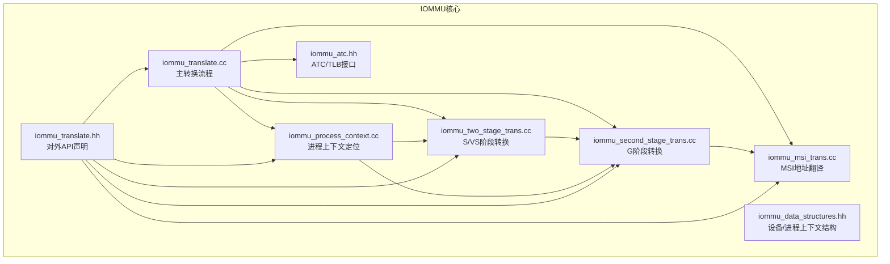
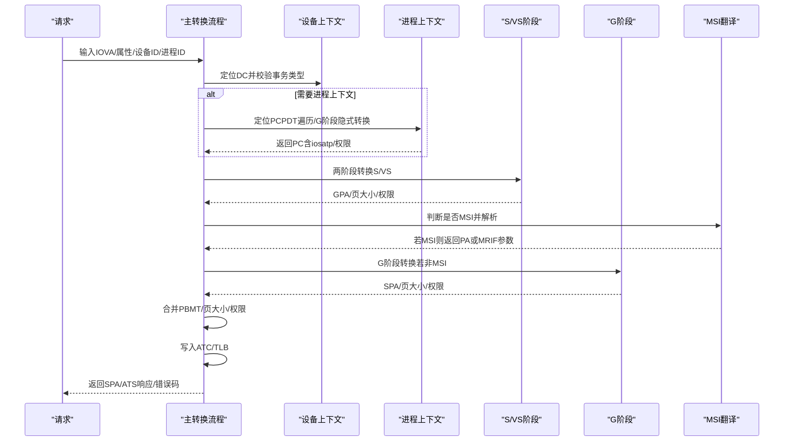
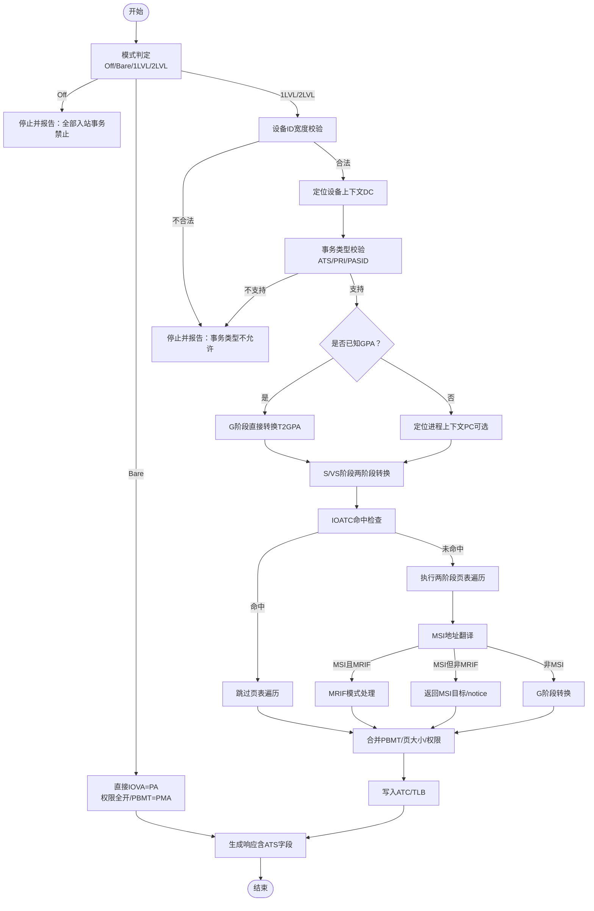
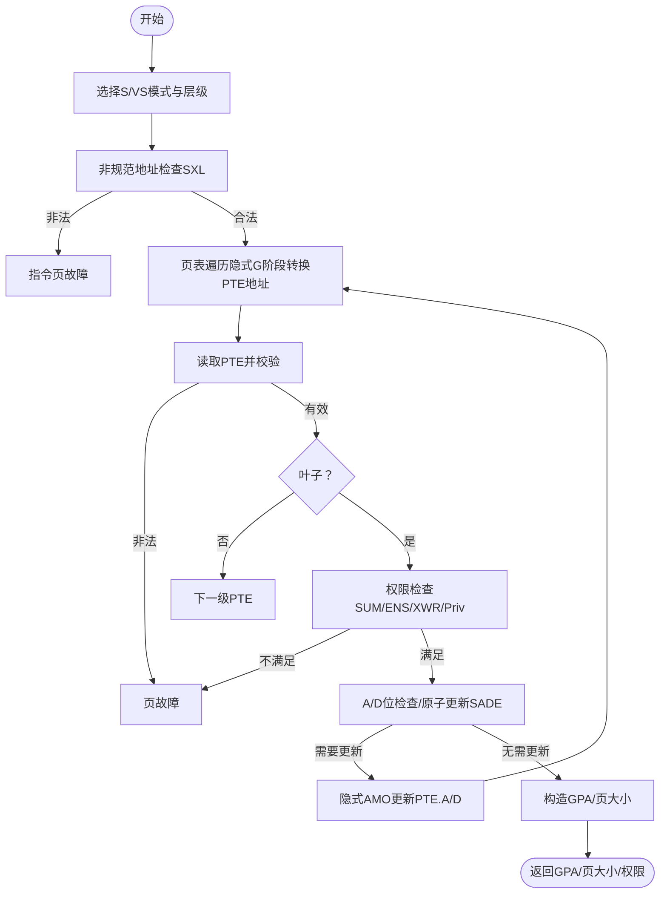
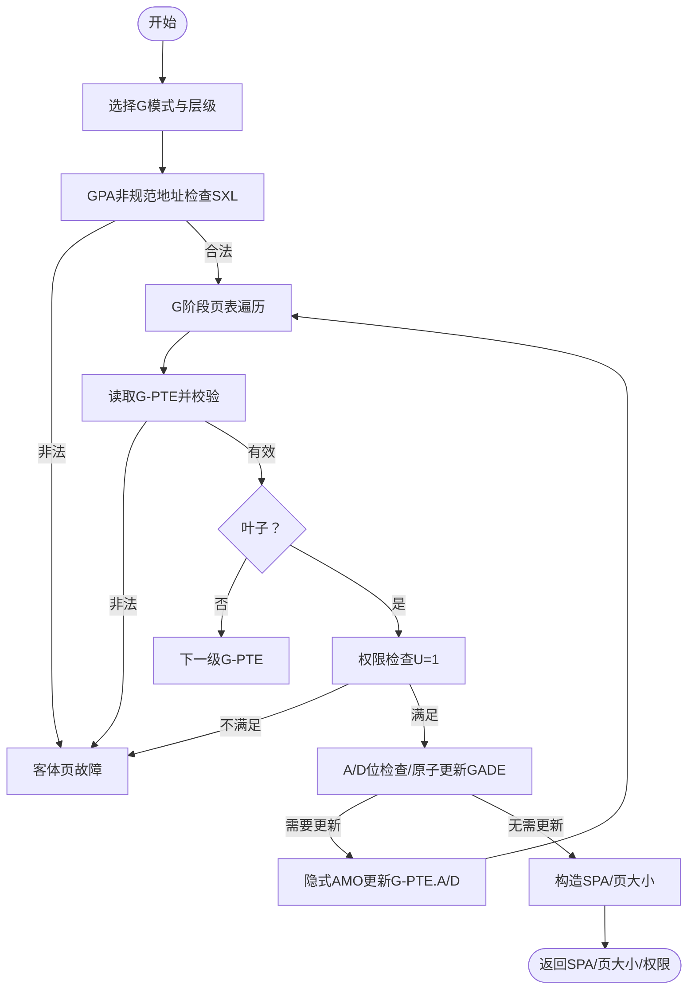
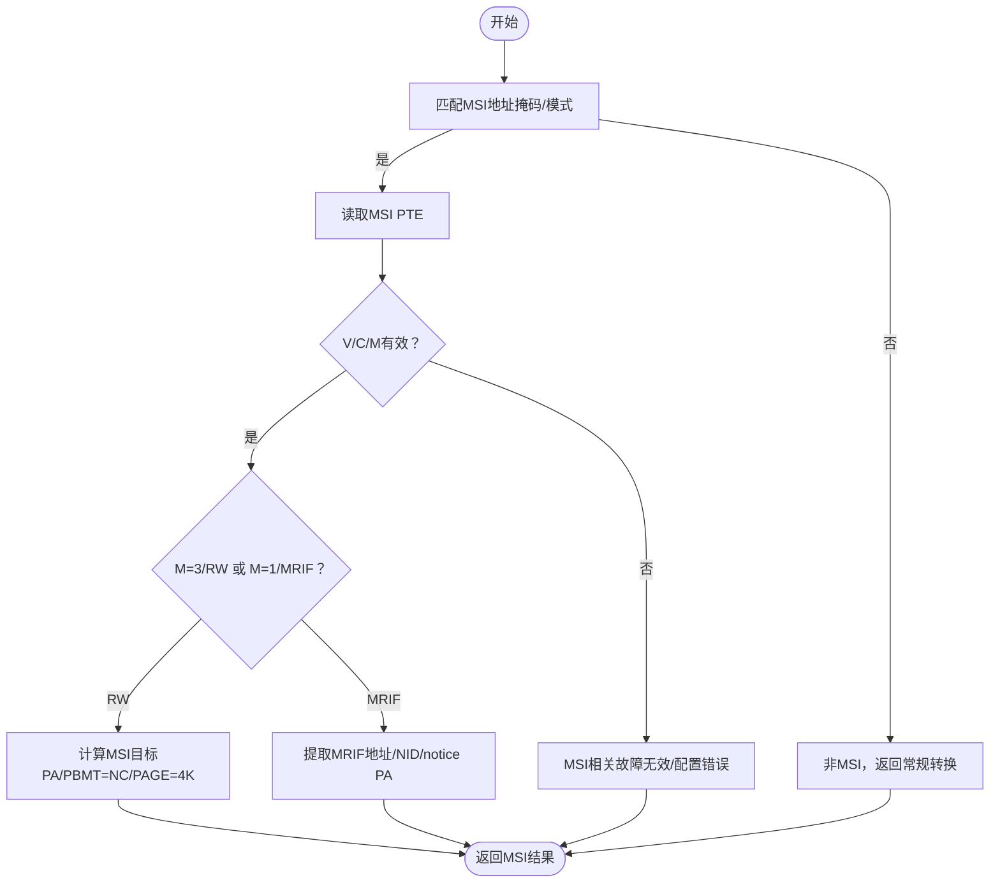
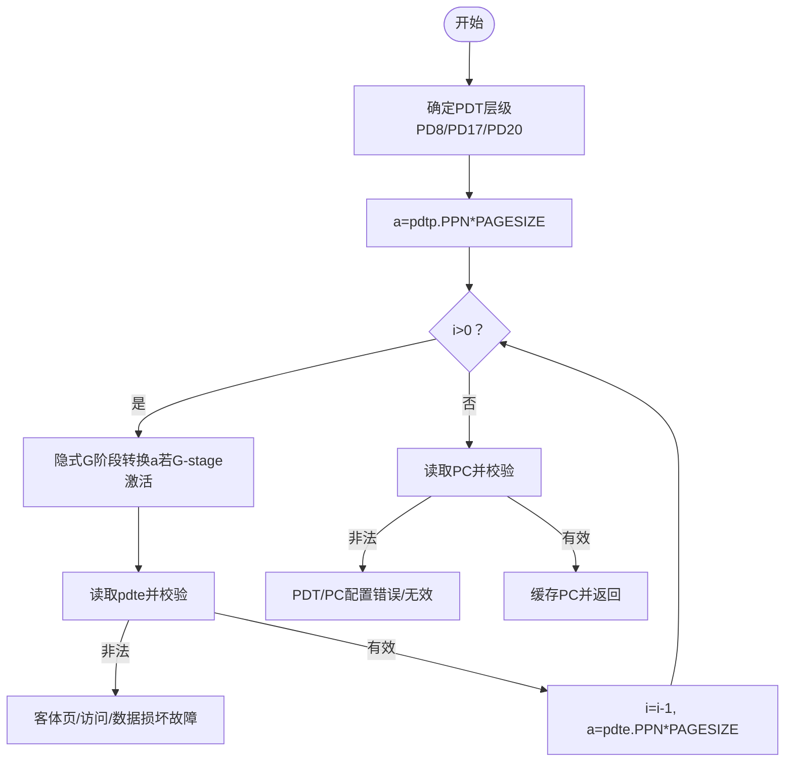
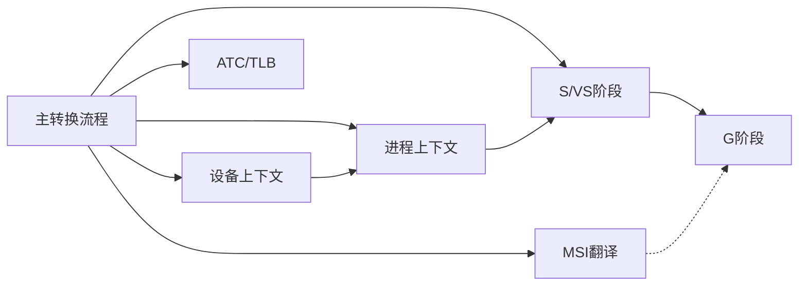

# 地址转换引擎

<cite>
**本文引用的文件**
- [README.md](file://README.md)
- [iommu_translate.hh](file://iommu/include/iommu_translate.hh)
- [iommu_translate.cc](file://iommu/iommu_fun_model/iommu_translate.cc)
- [iommu_two_stage_trans.cc](file://iommu/iommu_fun_model/iommu_two_stage_trans.cc)
- [iommu_second_stage_trans.cc](file://iommu/iommu_fun_model/iommu_second_stage_trans.cc)
- [iommu_msi_trans.cc](file://iommu/iommu_fun_model/iommu_msi_trans.cc)
- [iommu_process_context.cc](file://iommu/iommu_fun_model/iommu_process_context.cc)
- [iommu_struct.hh](file://iommu/include/iommu_struct.hh)
- [iommu_data_structures.hh](file://iommu/include/iommu_data_structures.hh)
- [iommu_atc.hh](file://iommu/include/iommu_atc.hh)
- [iommu_utils.cc](file://iommu/iommu_fun_model/iommu_utils.cc)
</cite>

## 目录
1. [简介](#简介)
2. [项目结构](#项目结构)
3. [核心组件](#核心组件)
4. [架构总览](#架构总览)
5. [详细组件分析](#详细组件分析)
6. [依赖关系分析](#依赖关系分析)
7. [性能考量](#性能考量)
8. [故障排除指南](#故障排除指南)
9. [结论](#结论)
10. [附录](#附录)

## 简介
本文件面向RISC-V IOMMU地址转换引擎，系统性阐述从IOVA到SPA的完整地址转换流程，覆盖单级地址转换（Sv39/Sv48/Sv57）与两级地址转换（VS-stage + G-stage），并详细解析21步地址转换过程中的关键节点：设备上下文查找、进程上下文定位、页表遍历、权限检查、MSI地址翻译与MRIF模式处理、异常与故障分类与响应策略。同时给出不同模式（Off、Bare、1LVL、2LVL）下的行为差异、页表数据损坏与访问违例的处理方式、性能优化建议与故障排除要点。

## 项目结构
该仓库为基于SystemC的RISC-V IOMMU参考模型，核心位于iommu子目录，包含：
- 头文件：定义寄存器、数据结构、接口声明（如地址转换API）
- 功能实现：地址转换引擎（两阶段、MSI）、进程上下文定位、ATC缓存接口等
- 性能模型与统计：计数事件、缓存命中率分析等（辅助理解）

图表来源
- [iommu_translate.cc:1-732](file://iommu/iommu_fun_model/iommu_translate.cc#L1-L732)
- [iommu_two_stage_trans.cc:1-600](file://iommu/iommu_fun_model/iommu_two_stage_trans.cc#L1-L600)
- [iommu_second_stage_trans.cc:1-424](file://iommu/iommu_fun_model/iommu_second_stage_trans.cc#L1-L424)
- [iommu_msi_trans.cc:1-294](file://iommu/iommu_fun_model/iommu_msi_trans.cc#L1-L294)
- [iommu_process_context.cc:1-236](file://iommu/iommu_fun_model/iommu_process_context.cc#L1-L236)
- [iommu_atc.hh:1-98](file://iommu/include/iommu_atc.hh#L1-L98)
- [iommu_data_structures.hh:1-415](file://iommu/include/iommu_data_structures.hh#L1-L415)
- [iommu_translate.hh:1-132](file://iommu/include/iommu_translate.hh#L1-L132)

章节来源
- [README.md:63-92](file://README.md#L63-L92)

## 核心组件
- 设备上下文（DC）与进程上下文（PC）：决定第一阶段页表根位置、进程软上下文ID（PSCID）、是否启用多进程目录（PDTV）、MSI页表指针等
- 两阶段地址转换引擎：S/VS阶段（第一阶段）与G阶段（第二阶段）的统一实现
- MSI地址翻译：识别虚拟中断文件写入、MSI页表读取、MRIF模式目标解析
- ATC/TLB：IOATC缓存IOVA到SPA映射，加速重复访问；DC/PC缓存减少页表遍历

章节来源
- [iommu_data_structures.hh:324-335](file://iommu/include/iommu_data_structures.hh#L324-L335)
- [iommu_data_structures.hh:409-412](file://iommu/include/iommu_data_structures.hh#L409-L412)
- [iommu_translate.hh:95-130](file://iommu/include/iommu_translate.hh#L95-L130)
- [iommu_atc.hh:70-96](file://iommu/include/iommu_atc.hh#L70-L96)

## 架构总览
地址转换从请求进入开始，按以下顺序执行：
1) 模式判定（Off/Bare/1LVL/2LVL）
2) 设备上下文定位与事务类型校验
3) 进程上下文定位（可选）
4) 两阶段地址转换（S/VS → G）
5) MSI地址翻译（可选）
6) 权限与页大小合并
7) 写回ATC/TLB缓存
8) 返回响应或错误

图表来源
- [iommu_translate.cc:8-731](file://iommu/iommu_fun_model/iommu_translate.cc#L8-L731)
- [iommu_process_context.cc:12-196](file://iommu/iommu_fun_model/iommu_process_context.cc#L12-L196)
- [iommu_two_stage_trans.cc:9-599](file://iommu/iommu_fun_model/iommu_two_stage_trans.cc#L9-L599)
- [iommu_second_stage_trans.cc:8-423](file://iommu/iommu_fun_model/iommu_second_stage_trans.cc#L8-L423)
- [iommu_msi_trans.cc:20-293](file://iommu/iommu_fun_model/iommu_msi_trans.cc#L20-L293)

## 详细组件分析

### 主转换流程（21步）
主转换流程负责端到端调度，涵盖模式判定、上下文定位、两阶段转换、MSI翻译、权限与页大小合并、ATC缓存与响应生成。

图表来源
- [iommu_translate.cc:9-731](file://iommu/iommu_fun_model/iommu_translate.cc#L9-L731)

章节来源
- [iommu_translate.cc:9-731](file://iommu/iommu_fun_model/iommu_translate.cc#L9-L731)

### 两阶段地址转换（S/VS阶段）
S/VS阶段实现单级页表遍历，支持Sv32/Sv39/Sv48/Sv57，处理NAPOT、A/D位原子更新、权限检查、超页与对齐约束、非规范地址检测等。

图表来源
- [iommu_two_stage_trans.cc:9-599](file://iommu/iommu_fun_model/iommu_two_stage_trans.cc#L9-L599)

章节来源
- [iommu_two_stage_trans.cc:9-599](file://iommu/iommu_fun_model/iommu_two_stage_trans.cc#L9-L599)

### G阶段地址转换（G-stage）
G阶段实现第二阶段页表遍历，支持Sv32x4/Sv39x4/Sv48x4/Sv57x4，处理NAPOT、A/D位原子更新（GADE）、权限检查、超页与对齐约束、GPA非规范地址检测。

图表来源
- [iommu_second_stage_trans.cc:8-423](file://iommu/iommu_fun_model/iommu_second_stage_trans.cc#L8-L423)

章节来源
- [iommu_second_stage_trans.cc:8-423](file://iommu/iommu_fun_model/iommu_second_stage_trans.cc#L8-L423)

### MSI地址翻译与MRIF模式
MSI翻译识别虚拟中断文件写入，解析MSI页表（Basic/RW或MRIF），返回MSI目标物理地址或MRIF参数，执行权限检查（仅R/W，禁X）。

图表来源
- [iommu_msi_trans.cc:20-293](file://iommu/iommu_fun_model/iommu_msi_trans.cc#L20-L293)

章节来源
- [iommu_msi_trans.cc:20-293](file://iommu/iommu_fun_model/iommu_msi_trans.cc#L20-L293)

### 进程上下文定位（PDT遍历）
当DC启用多进程目录（PDTV=1）时，通过PDT（1/2/3级）根据process_id分段索引定位PC，必要时经G阶段隐式转换PDT条目地址。

图表来源
- [iommu_process_context.cc:12-196](file://iommu/iommu_fun_model/iommu_process_context.cc#L12-L196)

章节来源
- [iommu_process_context.cc:12-196](file://iommu/iommu_fun_model/iommu_process_context.cc#L12-L196)

### 数据结构与模式差异
- 设备上下文（DC）：包含tc/iohgatp/ta/fsc/msiptp/msi掩码/模式等，决定S/VS与G阶段模式、是否启用多进程目录、MSI页表等
- 进程上下文（PC）：包含ta（ENS/SUM/PSCID）与fsc（iosatp），决定S/VS阶段模式与权限
- 模式编码：IOSATP/IOHGATP MODE枚举对应Sv32/Sv39/Sv48/Sv57与Sv32x4/Sv39x4/Sv48x4/Sv57x4
- Bare模式：无页表转换，IOVA直接作为PA（受页大小策略影响）

章节来源
- [iommu_data_structures.hh:139-200](file://iommu/include/iommu_data_structures.hh#L139-L200)
- [iommu_data_structures.hh:324-335](file://iommu/include/iommu_data_structures.hh#L324-L335)
- [iommu_data_structures.hh:350-412](file://iommu/include/iommu_data_structures.hh#L350-L412)

## 依赖关系分析
- 主转换流程依赖：设备上下文定位、进程上下文定位、两阶段转换、MSI翻译、ATC/TLB接口
- 两阶段转换相互协作：S/VS阶段隐式调用G阶段以转换PTE地址；G阶段独立执行第二阶段转换
- MSI翻译与G阶段：MSI路径可能绕过G阶段（RW模式），也可能返回MRIF参数
- 缓存：IOATC/TLB缓存IOVA→SPA映射；DC/PC缓存减少频繁查找

图表来源
- [iommu_translate.cc:332-489](file://iommu/iommu_fun_model/iommu_translate.cc#L332-L489)
- [iommu_process_context.cc:12-196](file://iommu/iommu_fun_model/iommu_process_context.cc#L12-L196)
- [iommu_two_stage_trans.cc:183-189](file://iommu/iommu_fun_model/iommu_two_stage_trans.cc#L183-L189)
- [iommu_second_stage_trans.cc:139-172](file://iommu/iommu_fun_model/iommu_second_stage_trans.cc#L139-L172)
- [iommu_msi_trans.cc:20-46](file://iommu/iommu_fun_model/iommu_msi_trans.cc#L20-L46)
- [iommu_atc.hh:70-96](file://iommu/include/iommu_atc.hh#L70-L96)

章节来源
- [iommu_translate.cc:332-489](file://iommu/iommu_fun_model/iommu_translate.cc#L332-L489)
- [iommu_process_context.cc:12-196](file://iommu/iommu_fun_model/iommu_process_context.cc#L12-L196)
- [iommu_two_stage_trans.cc:183-189](file://iommu/iommu_fun_model/iommu_two_stage_trans.cc#L183-L189)
- [iommu_second_stage_trans.cc:139-172](file://iommu/iommu_fun_model/iommu_second_stage_trans.cc#L139-L172)
- [iommu_msi_trans.cc:20-46](file://iommu/iommu_fun_model/iommu_msi_trans.cc#L20-L46)
- [iommu_atc.hh:70-96](file://iommu/include/iommu_atc.hh#L70-L96)

## 性能考量
- 缓存优先：IOATC/TLB命中可避免页表遍历；DC/PC缓存减少PDT/G阶段隐式转换
- 页大小合并：最终页大小取S/VS与G阶段较小者；PBMT按VS优先策略合并
- AMO原子更新：SADE/GADE开启时，A/D位更新通过隐式AMO减少多次访存
- 事件计数：统计S/VS/G/PDT页表遍历次数，辅助热点分析与优化
- ATS响应：Bare模式下推荐较大的翻译范围（实现定义），降低TLB抖动

章节来源
- [iommu_translate.cc:442-477](file://iommu/iommu_fun_model/iommu_translate.cc#L442-L477)
- [iommu_translate.cc:502-531](file://iommu/iommu_fun_model/iommu_translate.cc#L502-L531)
- [iommu_two_stage_trans.cc:449-468](file://iommu/iommu_fun_model/iommu_two_stage_trans.cc#L449-L468)
- [iommu_second_stage_trans.cc:373-391](file://iommu/iommu_fun_model/iommu_second_stage_trans.cc#L373-L391)

## 故障排除指南
- 常见故障分类
  - 页故障（指令/读/写/客体页）：由S/VS或G阶段PTE无效、权限不足、非规范地址、超页对齐错误触发
  - 访问故障（指令/读/写）：PTE地址越界、PMA/PMP违规
  - 数据损坏：PTE/MSI PTE/PC/PDT数据损坏
  - 配置错误：MSI PTE配置错误、PDT/PC配置错误、事务类型不允许、DDT/DC配置错误
- ATS场景特例
  - Off模式下ATS请求返回Unsupported Request
  - ATS翻译请求遇到特定故障（如访问/页故障、MSI/PC/DDT配置错误）返回Completer Abort
  - 其余ATS请求成功但权限不足时返回Success，但R/W/X相应位清零
- 排查步骤
  - 检查设备ID宽度与IOMMU模式匹配
  - 核对DC/PC配置（ENS/SUM/iosatp/giosatp/mode）
  - 观察S/VS/G/PDT遍历计数与TLB命中率
  - 分析MSI掩码/模式匹配与MSI PTE配置
  - 关注A/D位更新失败（SADE/GADE）导致的重试

章节来源
- [iommu_translate.cc:628-731](file://iommu/iommu_fun_model/iommu_translate.cc#L628-L731)
- [iommu_two_stage_trans.cc:504-598](file://iommu/iommu_fun_model/iommu_two_stage_trans.cc#L504-L598)
- [iommu_second_stage_trans.cc:140-172](file://iommu/iommu_fun_model/iommu_second_stage_trans.cc#L140-L172)
- [iommu_msi_trans.cc:136-153](file://iommu/iommu_fun_model/iommu_msi_trans.cc#L136-L153)

## 结论
本地址转换引擎完整实现了RISC-V IOMMU的两阶段地址转换，覆盖Sv39/Sv48/Sv57与Sv32/Sv32x4等模式，结合MSI/RW与MRIF两种地址翻译路径，提供细粒度的权限控制与页大小合并策略。通过IOATC/TLB与DC/PC缓存显著提升性能；完善的故障分类与ATS响应策略确保系统稳定性与兼容性。建议在实际部署中结合事件计数与缓存分析持续优化热点路径与页表布局。

## 附录
- 术语
  - IOVA：输入输出虚拟地址
  - GPA：客体物理地址（Guest Physical Address）
  - SPA：系统物理地址（System Physical Address）
  - PTE：页表项
  - ATS：PCIe地址转换服务
  - MRIF：内存驻留中断文件
- 相关实现路径
  - 主转换流程：[iommu_translate.cc:9-731](file://iommu/iommu_fun_model/iommu_translate.cc#L9-L731)
  - S/VS阶段：[iommu_two_stage_trans.cc:9-599](file://iommu/iommu_fun_model/iommu_two_stage_trans.cc#L9-L599)
  - G阶段：[iommu_second_stage_trans.cc:8-423](file://iommu/iommu_fun_model/iommu_second_stage_trans.cc#L8-L423)
  - MSI翻译：[iommu_msi_trans.cc:20-293](file://iommu/iommu_fun_model/iommu_msi_trans.cc#L20-L293)
  - 进程上下文：[iommu_process_context.cc:12-196](file://iommu/iommu_fun_model/iommu_process_context.cc#L12-L196)
  - 数据结构：[iommu_data_structures.hh:1-415](file://iommu/include/iommu_data_structures.hh#L1-L415)
  - ATC接口：[iommu_atc.hh:1-98](file://iommu/include/iommu_atc.hh#L1-L98)
  - 匹配函数：[iommu_utils.cc:7-17](file://iommu/iommu_fun_model/iommu_utils.cc#L7-L17)