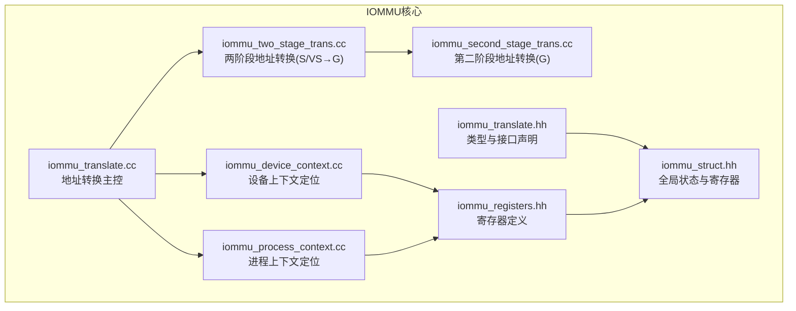
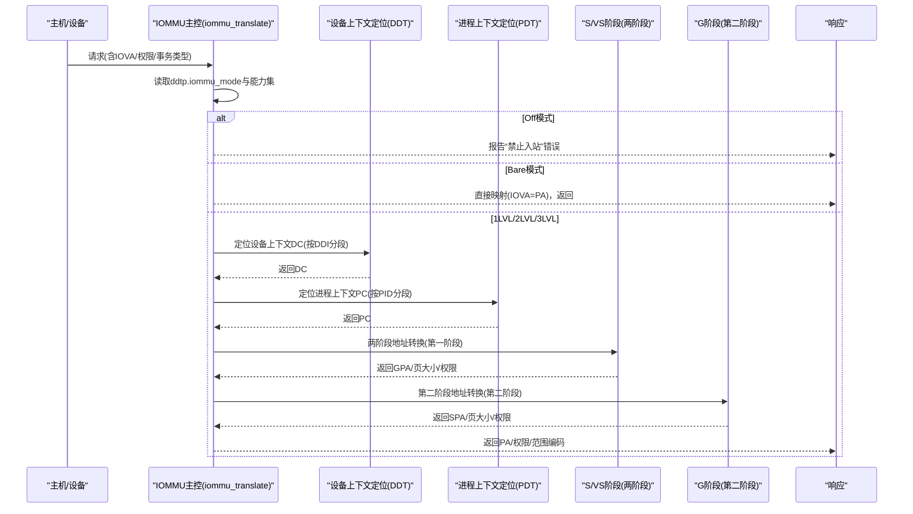
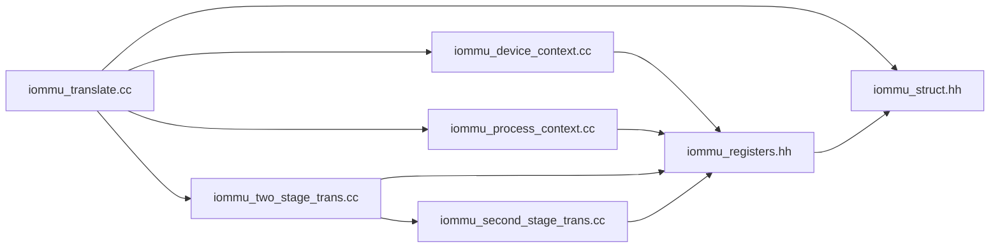

# 转换模式处理

<cite>
**本文引用的文件**
- [iommu_translate.hh](file://iommu/include/iommu_translate.hh)
- [iommu_translate.cc](file://iommu/iommu_fun_model/iommu_translate.cc)
- [iommu_two_stage_trans.cc](file://iommu/iommu_fun_model/iommu_two_stage_trans.cc)
- [iommu_second_stage_trans.cc](file://iommu/iommu_fun_model/iommu_second_stage_trans.cc)
- [iommu_process_context.cc](file://iommu/iommu_fun_model/iommu_process_context.cc)
- [iommu_device_context.cc](file://iommu/iommu_perf_model/iommu_device_context.cc)
- [iommu_struct.hh](file://iommu/include/iommu_struct.hh)
- [iommu_registers.hh](file://iommu/include/iommu_registers.hh)
- [README.md](file://README.md)
</cite>

## 目录
1. [简介](#简介)
2. [项目结构](#项目结构)
3. [核心组件](#核心组件)
4. [架构总览](#架构总览)
5. [详细组件分析](#详细组件分析)
6. [依赖关系分析](#依赖关系分析)
7. [性能考量](#性能考量)
8. [故障排除指南](#故障排除指南)
9. [结论](#结论)
10. [附录](#附录)

## 简介
本文件聚焦于RISC-V IOMMU的“转换模式处理”，系统性阐述不同IOMMU模式下的地址转换行为差异，覆盖Off模式、Bare模式、1LVL模式、2LVL模式与3LVL模式的实现逻辑；详细说明设备ID宽度限制、上下文查找规则、页表格式选择；文档化模式切换对地址转换流程的影响及模式组合下的特殊处理逻辑；并提供模式配置最佳实践与故障排除指南。

## 项目结构
该仓库为基于SystemC的RISC-V IOMMU参考模型，核心转换逻辑集中在以下模块：
- 地址转换主控：iommu_translate.cc
- 两阶段地址转换（S/VS → G）：iommu_two_stage_trans.cc
- 第二阶段地址转换（G）：iommu_second_stage_trans.cc
- 设备上下文定位：iommu_device_context.cc
- 进程上下文定位与校验：iommu_process_context.cc
- 接口与数据结构定义：iommu_translate.hh、iommu_struct.hh、iommu_registers.hh

**图表来源**
- [iommu_translate.cc:1-732](file://iommu/iommu_fun_model/iommu_translate.cc#L1-L732)
- [iommu_two_stage_trans.cc:1-600](file://iommu/iommu_fun_model/iommu_two_stage_trans.cc#L1-L600)
- [iommu_second_stage_trans.cc:1-424](file://iommu/iommu_fun_model/iommu_second_stage_trans.cc#L1-L424)
- [iommu_device_context.cc:1-419](file://iommu/iommu_perf_model/iommu_device_context.cc#L1-L419)
- [iommu_process_context.cc:1-236](file://iommu/iommu_fun_model/iommu_process_context.cc#L1-L236)
- [iommu_translate.hh:1-132](file://iommu/include/iommu_translate.hh#L1-L132)
- [iommu_struct.hh:1-102](file://iommu/include/iommu_struct.hh#L1-L102)
- [iommu_registers.hh:1-987](file://iommu/include/iommu_registers.hh#L1-L987)

**章节来源**
- [README.md:63-92](file://README.md#L63-L92)

## 核心组件
- 模式识别与入口控制：在地址转换主控中依据ddtp.iommu_mode与事务类型进行分支，决定是否允许翻译、是否直接走Bare映射或进入多级目录查找。
- 设备上下文定位（DDT）：根据设备ID与DDT层级（1LVL/2LVL/3LVL），定位设备上下文DC；同时校验设备ID宽度与能力集支持。
- 进程上下文定位（PDT）：根据进程ID与PDT层级（PD8/PD17/PD20），定位进程上下文PC；并进行模式与能力一致性检查。
- 两阶段地址转换：S/VS阶段（第一阶段）与G阶段（第二阶段）分别进行页表遍历、权限检查、A/D位原子更新等。
- MSI地址翻译：在GPA确定后，判断是否为MSI目标，必要时按MRIF模式处理。

**章节来源**
- [iommu_translate.cc:94-142](file://iommu/iommu_fun_model/iommu_translate.cc#L94-L142)
- [iommu_device_context.cc:100-120](file://iommu/iommu_perf_model/iommu_device_context.cc#L100-L120)
- [iommu_process_context.cc:12-78](file://iommu/iommu_fun_model/iommu_process_context.cc#L12-L78)
- [iommu_two_stage_trans.cc:8-82](file://iommu/iommu_fun_model/iommu_two_stage_trans.cc#L8-L82)
- [iommu_second_stage_trans.cc:7-75](file://iommu/iommu_fun_model/iommu_second_stage_trans.cc#L7-L75)

## 架构总览
下图展示从请求到最终物理地址的端到端流程，以及各模式下的关键差异点。

**图表来源**
- [iommu_translate.cc:94-142](file://iommu/iommu_fun_model/iommu_translate.cc#L94-L142)
- [iommu_device_context.cc:100-120](file://iommu/iommu_perf_model/iommu_device_context.cc#L100-L120)
- [iommu_process_context.cc:12-78](file://iommu/iommu_fun_model/iommu_process_context.cc#L12-L78)
- [iommu_two_stage_trans.cc:8-82](file://iommu/iommu_fun_model/iommu_two_stage_trans.cc#L8-L82)
- [iommu_second_stage_trans.cc:7-75](file://iommu/iommu_fun_model/iommu_second_stage_trans.cc#L7-L75)

## 详细组件分析

### Off模式
- 行为特征：完全禁止入站内存事务；任何请求直接报错。
- 触发条件：ddtp.iommu_mode == Off。
- ATS请求特殊处理：Off模式下ATS翻译请求返回Unsupported Request。
- 错误码：All inbound transactions disallowed（256）。

**章节来源**
- [iommu_translate.cc:97-113](file://iommu/iommu_fun_model/iommu_translate.cc#L97-L113)
- [iommu_translate.cc:620-707](file://iommu/iommu_fun_model/iommu_translate.cc#L620-L707)

### Bare模式
- 行为特征：无翻译/保护；IOVA即为PA；可返回较大页面范围（实现定义）。
- 触发条件：ddtp.iommu_mode == Bare。
- 事务限制：不支持Translated/ATS Translation/PCIe Page Request；仅支持Untranslated。
- 设备ID宽度：无DDT层级，DDI高位字段不参与；但设备ID仍受能力集约束。
- 返回值：is_bare_mode标志置位；PPN按PA>>12或NAPOT格式返回。

**章节来源**
- [iommu_translate.cc:120-142](file://iommu/iommu_fun_model/iommu_translate.cc#L120-L142)
- [iommu_translate.cc:502-531](file://iommu/iommu_fun_model/iommu_translate.cc#L502-L531)
- [iommu_two_stage_trans.cc:39-82](file://iommu/iommu_fun_model/iommu_two_stage_trans.cc#L39-L82)

### 1LVL模式
- 设备ID宽度：DDI[2]与DDI[1]必须为0，否则报“事务类型不允许”（260）。
- 设备上下文定位：DDT为1级，仅用DDI[0]索引。
- 进程上下文定位：PDT可为PD8/PD17/PD20，按PCID分段。
- 页表格式：S/VS与G阶段支持Sv39/Sv48/Sv57（SXL=0）或Sv32（SXL=1）。

**章节来源**
- [iommu_translate.cc:176-182](file://iommu/iommu_fun_model/iommu_translate.cc#L176-L182)
- [iommu_device_context.cc:106-108](file://iommu/iommu_perf_model/iommu_device_context.cc#L106-L108)
- [iommu_process_context.cc:75-77](file://iommu/iommu_fun_model/iommu_process_context.cc#L75-L77)
- [iommu_registers.hh:286-330](file://iommu/include/iommu_registers.hh#L286-L330)

### 2LVL模式
- 设备ID宽度：仅允许DDI[2]为0，否则报错。
- 设备上下文定位：DDT为2级，用DDI[1]与DDI[0]索引。
- 进程上下文定位：同上。
- 页表格式：同上。

**章节来源**
- [iommu_translate.cc:168-174](file://iommu/iommu_fun_model/iommu_translate.cc#L168-L174)
- [iommu_device_context.cc:105-107](file://iommu/iommu_perf_model/iommu_device_context.cc#L105-L107)
- [iommu_perf_parser.cc:79-90](file://iommu/iommu_perf_model/iommu_perf_parser.cc#L79-L90)

### 3LVL模式
- 设备ID宽度：DDT为3级，DDI[2]/DDI[1]可使用，但通常受限于具体实现。
- 设备上下文定位：DDT为3级，用DDI[2]/DDI[1]/DDI[0]索引。
- 进程上下文定位：同上。
- 页表格式：同上。

**章节来源**
- [iommu_device_context.cc:105-107](file://iommu/iommu_perf_model/iommu_device_context.cc#L105-L107)
- [iommu_perf_xdtw.cc:51-52](file://iommu/iommu_perf_model/iommu_perf_xdtw.cc#L51-L52)

### 设备ID宽度与DDT层级关系
- 1LVL：DDI[2]==0 且 DDI[1]==0
- 2LVL：DDI[2]==0
- 3LVL：DDI[2]与DDI[1]可使用（取决于实现）
- 超宽设备ID将触发“事务类型不允许”（260）

**章节来源**
- [iommu_translate.cc:159-182](file://iommu/iommu_fun_model/iommu_translate.cc#L159-L182)
- [iommu_perf_parser.cc:79-90](file://iommu/iommu_perf_model/iommu_perf_parser.cc#L79-L90)

### 上下文定位与页表选择
- 设备上下文（DC）定位：按DDI分段遍历DDT，叶子节点为DC；若DC中G-stage非Bare，则访问地址需经G-stage转换。
- 进程上下文（PC）定位：按PDI分段遍历PDT，叶子节点为PC；PC中的S/VS阶段MODE需与能力集匹配。
- 页表格式选择：
  - S/VS阶段：SXL=0时支持Sv39/Sv48/Sv57；SXL=1时支持Sv32。
  - G阶段：GXL=0时支持Sv39x4/Sv48x4/Sv57x4；GXL=1时支持Sv32x4。
- 权限与A/D位：SADE/GADE控制A/D位原子更新；隐式访问时需满足写权限。

**章节来源**
- [iommu_device_context.cc:100-120](file://iommu/iommu_perf_model/iommu_device_context.cc#L100-L120)
- [iommu_process_context.cc:12-78](file://iommu/iommu_fun_model/iommu_process_context.cc#L12-L78)
- [iommu_process_context.cc:198-235](file://iommu/iommu_fun_model/iommu_process_context.cc#L198-L235)
- [iommu_two_stage_trans.cc:87-139](file://iommu/iommu_fun_model/iommu_two_stage_trans.cc#L87-L139)
- [iommu_second_stage_trans.cc:80-113](file://iommu/iommu_fun_model/iommu_second_stage_trans.cc#L80-L113)

### 两阶段地址转换（S/VS → G）
- Bare模式：S/VS阶段直接返回IOVA=PA，设置权限位与页大小。
- 非Bare模式：按MODE/SXL计算VPN分段，逐级读取PTE，校验V/R/W/X/U、NAPOT编码、对齐与保留位。
- A/D位更新：SADE=1时，通过原子AMO更新PTE的A/D位；隐式写入需G-stage PTE具备写权限。
- 页大小：根据非叶子PTE的连续高位0确定超页大小，SXL=1时Sv32额外考虑4MiB。

**章节来源**
- [iommu_two_stage_trans.cc:39-82](file://iommu/iommu_fun_model/iommu_two_stage_trans.cc#L39-L82)
- [iommu_two_stage_trans.cc:163-306](file://iommu/iommu_fun_model/iommu_two_stage_trans.cc#L163-L306)
- [iommu_two_stage_trans.cc:437-471](file://iommu/iommu_fun_model/iommu_two_stage_trans.cc#L437-L471)

### 第二阶段地址转换（G）
- Bare模式：GPA直接作为PPN，设置权限位与页大小。
- 非Bare模式：按MODE/GXL计算VPN分段，逐级读取G-PTE，校验V/R/W/X/U、NAPOT编码、对齐与保留位。
- A/D位更新：GADE=1时，通过原子AMO更新G-PTE的A/D位；隐式写入需满足写权限。
- 页大小：根据非叶子G-PTE的连续高位0确定超页大小，GXL=1时Sv32x4额外考虑4MiB。

**章节来源**
- [iommu_second_stage_trans.cc:34-75](file://iommu/iommu_fun_model/iommu_second_stage_trans.cc#L34-L75)
- [iommu_second_stage_trans.cc:139-255](file://iommu/iommu_fun_model/iommu_second_stage_trans.cc#L139-L255)
- [iommu_second_stage_trans.cc:365-396](file://iommu/iommu_fun_model/iommu_second_stage_trans.cc#L365-L396)

### MSI地址翻译与MRIF处理
- 在GPA确定后，若命中MSI PTE，则进一步判断是否为MRIF模式。
- MRIF模式下，若IOMMU处于某些配置，可能拒绝该事务（例如虚拟中断文件重叠场景）。
- MRIF与普通MSI的处理路径不同，MRIF涉及目标节点与地址映射。

**章节来源**
- [iommu_translate.cc:397-418](file://iommu/iommu_fun_model/iommu_translate.cc#L397-L418)
- [iommu_translate.cc:409-412](file://iommu/iommu_fun_model/iommu_translate.cc#L409-L412)

## 依赖关系分析
- 模块耦合：
  - iommu_translate.cc是主控，依赖DDT/PDT定位、两阶段转换与MSI翻译。
  - 两阶段转换依赖第二阶段转换模块；两者共享PTE格式与页表遍历逻辑。
  - 设备/进程上下文定位模块依赖寄存器能力集与页表遍历。
- 外部依赖：
  - 寄存器定义（capabilities/fctl/ddtp等）决定模式与能力集。
  - 全局状态（页大小策略、端序等）影响返回值与访问顺序。

**图表来源**
- [iommu_translate.cc:1-732](file://iommu/iommu_fun_model/iommu_translate.cc#L1-L732)
- [iommu_device_context.cc:1-419](file://iommu/iommu_perf_model/iommu_device_context.cc#L1-L419)
- [iommu_process_context.cc:1-236](file://iommu/iommu_fun_model/iommu_process_context.cc#L1-L236)
- [iommu_two_stage_trans.cc:1-600](file://iommu/iommu_fun_model/iommu_two_stage_trans.cc#L1-L600)
- [iommu_second_stage_trans.cc:1-424](file://iommu/iommu_fun_model/iommu_second_stage_trans.cc#L1-L424)
- [iommu_registers.hh:1-987](file://iommu/include/iommu_registers.hh#L1-L987)
- [iommu_struct.hh:1-102](file://iommu/include/iommu_struct.hh#L1-L102)

**章节来源**
- [iommu_translate.cc:1-732](file://iommu/iommu_fun_model/iommu_translate.cc#L1-L732)
- [iommu_registers.hh:172-330](file://iommu/include/iommu_registers.hh#L172-L330)

## 性能考量
- TLB命中：优先从IOATC/IOTLB命中，避免页表遍历。
- 页表缓存：支持PT缓存与Walker缓存，减少重复访问。
- 超页策略：在Bare模式下，建议返回较大页以提升TLB效率；在两阶段转换中，按PTE高位确定超页大小。
- 端序与原子更新：端序由fctl控制；SADE/GADE开启可减少多次访存，提高吞吐。

[本节为通用指导，无需特定文件引用]

## 故障排除指南
- 常见错误码与含义
  - 256：All inbound transactions disallowed（Off模式）
  - 260：Transaction type disallowed（设备ID超宽/事务类型不被允许）
  - 257-259：DDT条目加载/有效/配置错误
  - 262-263：MSI PTE未生效/配置错误
  - 265-267：PDT条目加载/有效/配置错误
  - 268-269：DDT/PDT数据损坏
  - 270-271：MSI PTE/MSI MRIF数据损坏
  - 272：内部数据路径错误
  - 274：一/二级页表数据损坏
- ATS请求特例
  - Off模式下ATS返回Unsupported Request
  - 访问/页故障（1/5/7或20/21/23）返回Completer Abort
  - 其余错误返回Unsupported Request
- 排查步骤
  - 确认ddtp.iommu_mode与设备ID宽度是否匹配
  - 检查DC/PC的MODE与能力集一致性
  - 校验PTE的V/R/W/X/U/NAPOT编码与对齐
  - 若启用SADE/GADE，确认G-stage PTE具备写权限
  - 关注隐式访问导致的A/D位更新与回退

**章节来源**
- [iommu_translate.cc:654-730](file://iommu/iommu_fun_model/iommu_translate.cc#L654-L730)
- [iommu_device_context.cc:136-161](file://iommu/iommu_perf_model/iommu_device_context.cc#L136-L161)
- [iommu_process_context.cc:125-157](file://iommu/iommu_fun_model/iommu_process_context.cc#L125-L157)
- [iommu_two_stage_trans.cc:227-237](file://iommu/iommu_fun_model/iommu_two_stage_trans.cc#L227-L237)
- [iommu_second_stage_trans.cc:174-191](file://iommu/iommu_fun_model/iommu_second_stage_trans.cc#L174-L191)

## 结论
- 不同IOMMU模式决定了设备ID宽度上限、上下文查找深度与页表格式选择。
- Off模式严格禁用；Bare模式提供直通映射；1LVL/2LVL/3LVL模式支持多级目录与两阶段地址转换。
- 正确配置ddtp与DC/PC的MODE/能力集是保证转换正确的前提。
- 合理利用TLB与超页策略可显著提升性能；谨慎启用SADE/GADE以平衡正确性与性能。

[本节为总结，无需特定文件引用]

## 附录

### 模式配置最佳实践
- Off模式：仅用于完全隔离场景；确保软件不会发起入站请求。
- Bare模式：适用于简单直通或调试；注意事务类型限制。
- 1LVL/2LVL/3LVL：根据设备ID宽度与系统规模选择；确保DDI分段与ddtp.iommu_mode一致。
- MODE与能力集：SXL/GXL与MODE需与capabilities匹配；SADE/GADE仅在支持原子更新时启用。
- ATS/MSI：合理配置DC/PC以启用ATS/PRI与MSI；MRIF需谨慎使用。

**章节来源**
- [iommu_translate.cc:159-182](file://iommu/iommu_fun_model/iommu_translate.cc#L159-L182)
- [iommu_device_context.cc:232-418](file://iommu/iommu_perf_model/iommu_device_context.cc#L232-L418)
- [iommu_process_context.cc:198-235](file://iommu/iommu_fun_model/iommu_process_context.cc#L198-L235)
- [iommu_registers.hh:172-330](file://iommu/include/iommu_registers.hh#L172-L330)