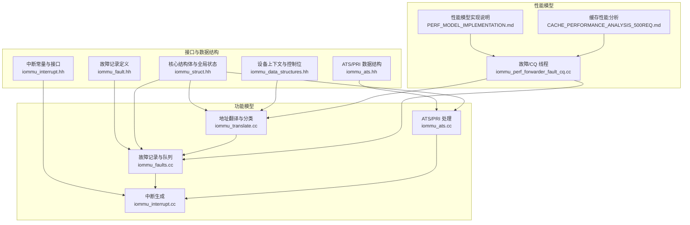
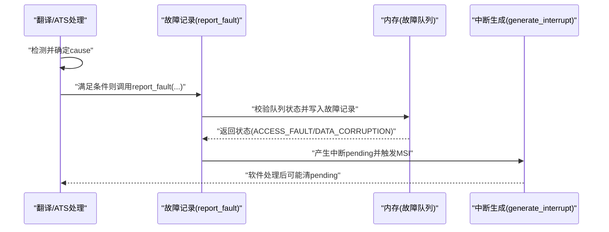
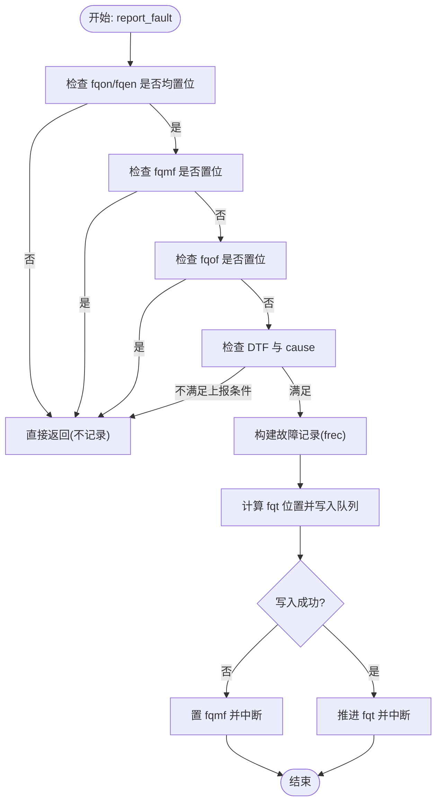
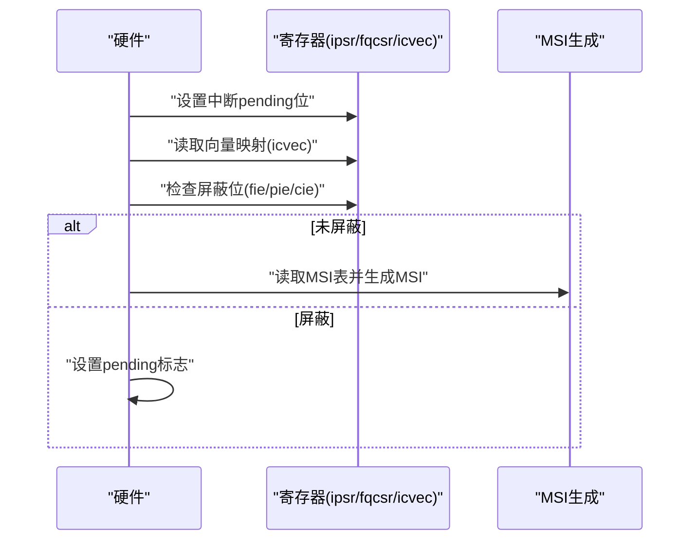
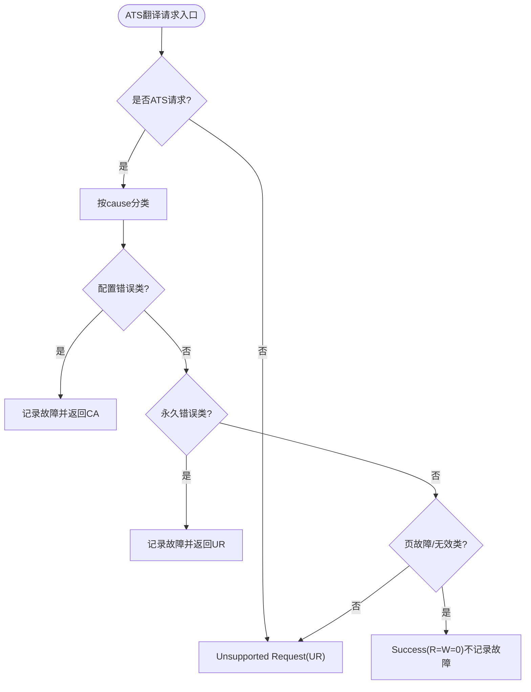
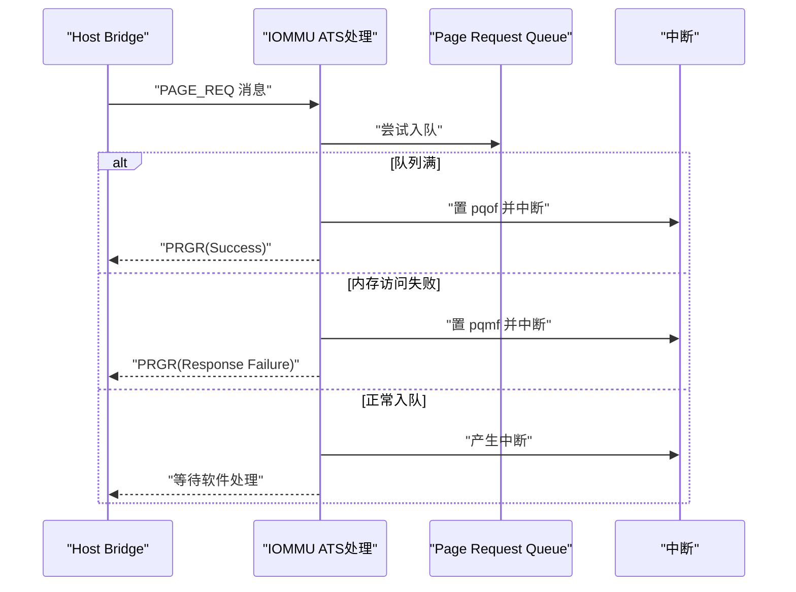
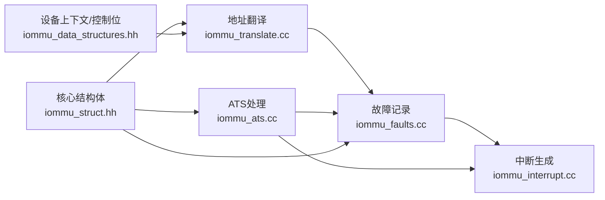

# 故障处理系统

<cite>
**本文引用的文件**
- [iommu_fault.hh](file://iommu/include/iommu_fault.hh)
- [iommu_faults.cc](file://iommu/iommu_fun_model/iommu_faults.cc)
- [iommu_interrupt.hh](file://iommu/include/iommu_interrupt.hh)
- [iommu_interrupt.cc](file://iommu/iommu_fun_model/iommu_interrupt.cc)
- [iommu_ats.hh](file://iommu/include/iommu_ats.hh)
- [iommu_ats.cc](file://iommu/iommu_fun_model/iommu_ats.cc)
- [iommu_translate.cc](file://iommu/iommu_fun_model/iommu_translate.cc)
- [iommu_struct.hh](file://iommu/include/iommu_struct.hh)
- [iommu_perf_forwarder_fault_cq.cc](file://iommu/iommu_perf_model/iommu_perf_forwarder_fault_cq.cc)
- [iommu_data_structures.hh](file://iommu/include/iommu_data_structures.hh)
- [iommu_device_context.cc](file://iommu/iommu_perf_model/iommu_device_context.cc)
- [PERF_MODEL_IMPLEMENTATION.md](file://PERF_MODEL_IMPLEMENTATION.md)
- [CACHE_PERFORMANCE_ANALYSIS_500REQ.md](file://CACHE_PERFORMANCE_ANALYSIS_500REQ.md)
</cite>

## 目录
1. [简介](#简介)
2. [项目结构](#项目结构)
3. [核心组件](#核心组件)
4. [架构总览](#架构总览)
5. [详细组件分析](#详细组件分析)
6. [依赖关系分析](#依赖关系分析)
7. [性能考量](#性能考量)
8. [故障诊断指南](#故障诊断指南)
9. [结论](#结论)
10. [附录](#附录)

## 简介
本文件系统化梳理 IOMMU 故障处理系统，涵盖故障检测机制、故障分类与报告流程、队列管理与优先级、响应策略（含 PCIe ATS 翻译请求的特殊处理）、诊断方法、常见原因与解决方案，以及性能影响与优化建议。文档面向工程实践，既适合深入研究者也适合一线开发者。

## 项目结构
IOMMU 故障处理涉及以下关键模块：
- 故障记录与队列：fault_rec_t、故障队列寄存器与写入逻辑
- 中断与通知：MSI 生成、中断挂起与向量映射
- ATS 与 PRI：PCIe ATS 翻译请求与 Page Request Group Response（PRGR）
- 翻译与故障分类：地址翻译过程中的故障判定与响应
- 性能模型：故障记录与响应在性能线程中的实现

**图表来源**
- [iommu_faults.cc:1-160](file://iommu/iommu_fun_model/iommu_faults.cc#L1-160)
- [iommu_interrupt.cc:1-121](file://iommu/iommu_fun_model/iommu_interrupt.cc#L1-121)
- [iommu_ats.cc:1-374](file://iommu/iommu_fun_model/iommu_ats.cc#L1-374)
- [iommu_translate.cc:650-732](file://iommu/iommu_fun_model/iommu_translate.cc#L650-732)
- [iommu_fault.hh:63-77](file://iommu/include/iommu_fault.hh#L63-77)
- [iommu_interrupt.hh:16-25](file://iommu/include/iommu_interrupt.hh#L16-25)
- [iommu_ats.hh:47-91](file://iommu/include/iommu_ats.hh#L47-91)
- [iommu_struct.hh:42-99](file://iommu/include/iommu_struct.hh#L42-99)
- [iommu_perf_forwarder_fault_cq.cc:121-179](file://iommu/iommu_perf_model/iommu_perf_forwarder_fault_cq.cc#L121-179)
- [PERF_MODEL_IMPLEMENTATION.md:88-97](file://PERF_MODEL_IMPLEMENTATION.md#L88-97)
- [CACHE_PERFORMANCE_ANALYSIS_500REQ.md:13-34](file://CACHE_PERFORMANCE_ANALYSIS_500REQ.md#L13-34)

**章节来源**
- [iommu_fault.hh:1-90](file://iommu/include/iommu_fault.hh#L1-90)
- [iommu_faults.cc:1-160](file://iommu/iommu_fun_model/iommu_faults.cc#L1-160)
- [iommu_interrupt.hh:1-26](file://iommu/include/iommu_interrupt.hh#L1-26)
- [iommu_interrupt.cc:1-121](file://iommu/iommu_fun_model/iommu_interrupt.cc#L1-121)
- [iommu_ats.hh:1-98](file://iommu/include/iommu_ats.hh#L1-98)
- [iommu_ats.cc:1-374](file://iommu/iommu_fun_model/iommu_ats.cc#L1-374)
- [iommu_translate.cc:650-732](file://iommu/iommu_fun_model/iommu_translate.cc#L650-732)
- [iommu_struct.hh:1-102](file://iommu/include/iommu_struct.hh#L1-102)
- [iommu_perf_forwarder_fault_cq.cc:121-179](file://iommu/iommu_perf_model/iommu_perf_forwarder_fault_cq.cc#L121-179)
- [PERF_MODEL_IMPLEMENTATION.md:88-97](file://PERF_MODEL_IMPLEMENTATION.md#L88-97)
- [CACHE_PERFORMANCE_ANALYSIS_500REQ.md:13-34](file://CACHE_PERFORMANCE_ANALYSIS_500REQ.md#L13-34)

## 核心组件
- 故障记录与队列
  - 故障记录格式：包含原因码、进程/设备信息、事务类型、iotval/iotval2 等字段，固定 128 位大小。
  - 故障队列：基于内存的环形队列，由 fqb/base、fqh/head、fqt/tail 控制；满/溢出、内存访问故障等条件触发 fqof/fqmf，并产生中断。
- 中断与通知
  - 中断挂起寄存器与向量映射，支持 MSI 生成与掩码控制；中断 pending 位需软件清零。
- ATS 与 PRI
  - ATS 翻译请求：区分配置错误（Completer Abort）与永久错误（Unsupported Request）；成功但页故障返回 R=W=0。
  - PRI：Page Request 消息入队，支持溢出与内存访问故障处理，必要时自动生成 PRGR 响应。
- 翻译与故障分类
  - 在地址翻译过程中根据 cause 分类，决定是否记录故障队列、返回 UR/CA 或 Success(R=W=0)。

**章节来源**
- [iommu_fault.hh:63-88](file://iommu/include/iommu_fault.hh#L63-88)
- [iommu_faults.cc:113-158](file://iommu/iommu_fun_model/iommu_faults.cc#L113-158)
- [iommu_interrupt.hh:16-25](file://iommu/include/iommu_interrupt.hh#L16-25)
- [iommu_interrupt.cc:28-106](file://iommu/iommu_fun_model/iommu_interrupt.cc#L28-106)
- [iommu_ats.hh:47-91](file://iommu/include/iommu_ats.hh#L47-91)
- [iommu_ats.cc:96-373](file://iommu/iommu_fun_model/iommu_ats.cc#L96-373)
- [iommu_translate.cc:654-730](file://iommu/iommu_fun_model/iommu_translate.cc#L654-730)

## 架构总览
IOMMU 故障处理贯穿“检测—分类—记录—通知—响应”的闭环：
- 检测：翻译阶段或 ATS/PRI 处理中识别 cause。
- 分类：区分页故障、访问违例、数据损坏、配置错误、永久错误等。
- 记录：满足条件时写入故障队列，否则在 ATS 特殊路径中不记录。
- 通知：设置中断 pending 并通过 MSI 通知软件。
- 响应：对 ATS 请求返回 UR/CA/Success，对普通请求返回错误响应。

**图表来源**
- [iommu_translate.cc:654-730](file://iommu/iommu_fun_model/iommu_translate.cc#L654-730)
- [iommu_faults.cc:8-159](file://iommu/iommu_fun_model/iommu_faults.cc#L8-159)
- [iommu_interrupt.cc:28-106](file://iommu/iommu_fun_model/iommu_interrupt.cc#L28-106)

## 详细组件分析

### 故障记录与队列管理
- 队列状态与保护
  - 需同时满足 fqon/fqen 为 1 才允许写入；若 fqmf/fqof 已置位则丢弃后续记录。
  - 队列满条件：(fqt+1) mod size == fqh；满时置 fqof 并中断。
  - 内存访问故障：当写入队列地址越界或内存访问失败时置 fqmf 并中断。
- DTF 控制
  - 当 DTF=1 且 cause 不属于特定“总是上报”列表时，不记录故障队列，但仍可生成错误响应。
- 记录字段
  - 包含 CAUSE、DID、PID、PV、PRIV、TTYP、iotval/iotval2 等，便于软件定位与分析。

**图表来源**
- [iommu_faults.cc:23-158](file://iommu/iommu_fun_model/iommu_faults.cc#L23-158)

**章节来源**
- [iommu_faults.cc:8-159](file://iommu/iommu_fun_model/iommu_faults.cc#L8-159)
- [iommu_fault.hh:63-88](file://iommu/include/iommu_fault.hh#L63-88)

### 中断与通知机制
- 中断挂起与屏蔽
  - 每个中断源有独立 pending 位，需软件写 1 清除；屏蔽位决定是否产生中断。
- MSI 生成
  - 根据向量映射与 MSI 表配置生成消息；若向量被掩码，则暂存 pending，待解除掩码后补发。
- 故障队列中断
  - 故障记录写入后触发 FAULT_QUEUE 中断，软件轮询 FQH/FQT 并处理记录。

**图表来源**
- [iommu_interrupt.cc:28-106](file://iommu/iommu_fun_model/iommu_interrupt.cc#L28-106)
- [iommu_interrupt.hh:16-25](file://iommu/include/iommu_interrupt.hh#L16-25)

**章节来源**
- [iommu_interrupt.cc:1-121](file://iommu/iommu_fun_model/iommu_interrupt.cc#L1-121)
- [iommu_interrupt.hh:1-26](file://iommu/include/iommu_interrupt.hh#L1-26)

### ATS 翻译请求的特殊处理
- 不支持请求
  - 非 ATS 的翻译请求一律返回 Unsupported Request。
- 配置错误（Completer Abort）
  - 对应若干访问/页故障与内部错误 cause，返回 CA 并记录故障。
- 成功但页故障（R=W=0）
  - 若 cause 属于页故障或 PTE 无效等，返回 Success 但 R=W=0，不记录故障。
- 永久错误（Unsupported Request）
  - 如 IOMMU 关闭、设备上下文无效、事务类型不允许等，返回 UR 并记录故障。

**图表来源**
- [iommu_translate.cc:657-707](file://iommu/iommu_fun_model/iommu_translate.cc#L657-707)

**章节来源**
- [iommu_translate.cc:654-732](file://iommu/iommu_fun_model/iommu_translate.cc#L654-732)

### ATS Page Request 与 PRGR 响应
- 入队与溢出
  - PRI 消息入队前检查 pqon/pqen、pqmf、pqof；满则置 pqof 并中断。
- 内存访问故障
  - 写入 PQ 地址越界或访问失败时置 pqmf 并中断，随后可自动生成 PRGR。
- PRGR 状态
  - Response Failure：IOMMU 关闭、DC 无效、PQ 禁用或内存故障。
  - Invalid Request：事务类型不允许。
  - Success：PQ 满导致无法入队但允许继续。

**图表来源**
- [iommu_ats.cc:265-298](file://iommu/iommu_fun_model/iommu_ats.cc#L265-298)
- [iommu_ats.cc:300-373](file://iommu/iommu_fun_model/iommu_ats.cc#L300-373)

**章节来源**
- [iommu_ats.cc:96-373](file://iommu/iommu_fun_model/iommu_ats.cc#L96-373)
- [iommu_ats.hh:47-91](file://iommu/include/iommu_ats.hh#L47-91)

### 故障分类与报告流程
- 故障分类依据
  - 访问违例、数据损坏、页故障、Guest 页故障、配置错误、内部错误、MSI/PT 错误等。
- 报告策略
  - DTF 控制是否记录；ATS 成功路径不记录故障；其他路径按 cause 决定是否记录与响应类型。
- ATS 特例
  - ATS 成功但页故障返回 Success(R=W=0)，不记录故障；配置错误返回 CA 并记录故障。

**章节来源**
- [iommu_faults.cc:46-90](file://iommu/iommu_fun_model/iommu_faults.cc#L46-90)
- [iommu_translate.cc:654-730](file://iommu/iommu_fun_model/iommu_translate.cc#L654-730)

### 性能模型中的故障处理
- 线程职责
  - fault_cq_proc_thread：调用 report_fault 记录故障，依据 cause 选择 UR/CA/Success 并回传。
- 与功能模型一致性
  - 性能模型严格对应功能模型的故障分类与响应逻辑，确保仿真与实现一致。

**章节来源**
- [iommu_perf_forwarder_fault_cq.cc:121-179](file://iommu/iommu_perf_model/iommu_perf_forwarder_fault_cq.cc#L121-179)
- [PERF_MODEL_IMPLEMENTATION.md:88-97](file://PERF_MODEL_IMPLEMENTATION.md#L88-97)

## 依赖关系分析
- 组件耦合
  - 故障记录依赖寄存器状态（fqb/fqh/fqt/fqcsr 等）与内存访问接口。
  - ATS 处理依赖设备上下文（DC）与 PRI 队列寄存器。
  - 中断模块与 MSI 表配置解耦，通过向量映射与屏蔽位控制。
- 关键依赖链
  - 翻译 → 故障分类 → 故障记录 → 中断生成 → 软件处理。
  - ATS → 设备上下文定位 → PRI 入队/溢出/故障 → PRGR 响应。

**图表来源**
- [iommu_translate.cc:654-730](file://iommu/iommu_fun_model/iommu_translate.cc#L654-730)
- [iommu_faults.cc:8-159](file://iommu/iommu_fun_model/iommu_faults.cc#L8-159)
- [iommu_ats.cc:96-373](file://iommu/iommu_fun_model/iommu_ats.cc#L96-373)
- [iommu_struct.hh:42-99](file://iommu/include/iommu_struct.hh#L42-99)
- [iommu_data_structures.hh:30-130](file://iommu/include/iommu_data_structures.hh#L30-130)

**章节来源**
- [iommu_struct.hh:42-99](file://iommu/include/iommu_struct.hh#L42-99)
- [iommu_data_structures.hh:30-130](file://iommu/include/iommu_data_structures.hh#L30-130)

## 性能考量
- 故障队列写入延迟
  - 写入内存的延时受队列深度、内存带宽与仲裁影响；满/溢出路径会触发中断与潜在丢包。
- ATS/PRI 队列
  - PRI 入队失败（满/内存故障）会产生 pqof/pqmf，软件需及时处理并可能生成 PRGR。
- 性能模型观察
  - 故障处理线程与翻译线程并行，故障记录写入与响应生成在性能模型中有明确时序。
- 优化建议
  - 提升队列容量与内存带宽，避免频繁溢出。
  - 优化中断合并与 MSI 批量发送，降低中断开销。
  - ATS 成功路径不记录故障，减少队列压力。

**章节来源**
- [iommu_perf_forwarder_fault_cq.cc:121-179](file://iommu/iommu_perf_model/iommu_perf_forwarder_fault_cq.cc#L121-179)
- [PERF_MODEL_IMPLEMENTATION.md:88-97](file://PERF_MODEL_IMPLEMENTATION.md#L88-97)
- [CACHE_PERFORMANCE_ANALYSIS_500REQ.md:145-178](file://CACHE_PERFORMANCE_ANALYSIS_500REQ.md#L145-178)

## 故障诊断指南
- 常见原因与定位
  - 故障队列满/溢出：检查 fqof 状态与队列深度；确认软件及时推进 fqh。
  - 内存访问故障：检查 iotval/iommu 地址越界；核对 PMA/PMP 规则。
  - ATS 配置错误：检查 DC.tc.EN_ATS/EN_PRI；核对设备上下文有效性。
  - ATS 永久错误：检查 IOMMU 模式、设备 ID 宽度与事务类型。
- 诊断步骤
  - 读取故障记录：FQB/FQT/FQH，逐条核对 CAUSE/DID/PID/TTYP/iotval。
  - 检查中断状态：ipsr 与屏蔽位；MSI 是否正确投递。
  - ATS 路径：PRI 队列状态（pqb/pqh/pqt/pqcsr），必要时生成 PRGR。
- 验证与回归
  - 使用测试脚本读取并校验故障记录字段，确保与期望一致。

**章节来源**
- [iommu_faults.cc:113-158](file://iommu/iommu_fun_model/iommu_faults.cc#L113-158)
- [iommu_ats.cc:265-298](file://iommu/iommu_fun_model/iommu_ats.cc#L265-298)
- [rp/test_rp_func.cc:101-134](file://rp/test_rp_func.cc#L101-134)

## 结论
IOMMU 故障处理系统通过严格的故障分类、可靠的队列管理与中断通知机制，实现了对页故障、访问违例、数据损坏、配置错误与永久错误的差异化处理。ATS 特殊路径进一步细化了响应策略，确保系统在复杂 PCIe 环境下的稳定性与可诊断性。结合性能模型与缓存分析，可在保障功能正确的同时优化系统吞吐与延迟。

## 附录
- 关键寄存器与状态位
  - 故障队列：fqb/fqh/fqt/fqcsr.fqon/fqen/fqof/fqmf/fie
  - ATS/PRI：pqb/pqh/pqt/pqcsr.pqon/pqen/pqof/pqmf/pie
  - 中断：ipsr（fip/pip/cip/pmip）、icvec（fiv/piv/civ/pmiv）、fctl（WSI/BE）
- 建议的软件处理流程
  - 定期轮询 FQH/FQT，及时推进 fqh 并处理记录。
  - 针对 ATS/PRI 溢出与内存故障，生成 PRGR 并恢复服务。
  - 在 DTF=1 场景下，关注不入队的故障并结合日志定位。