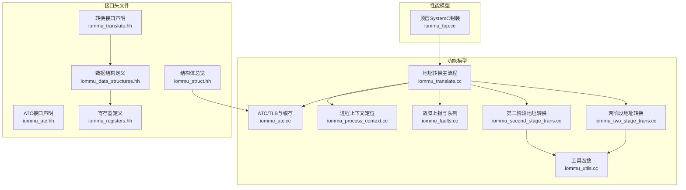
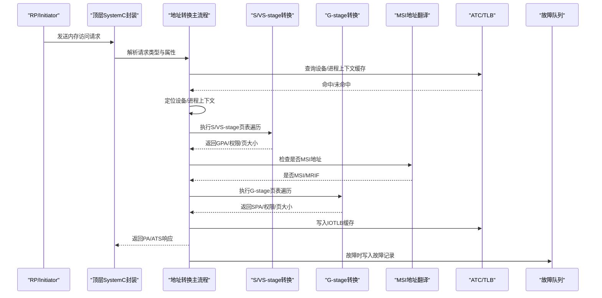
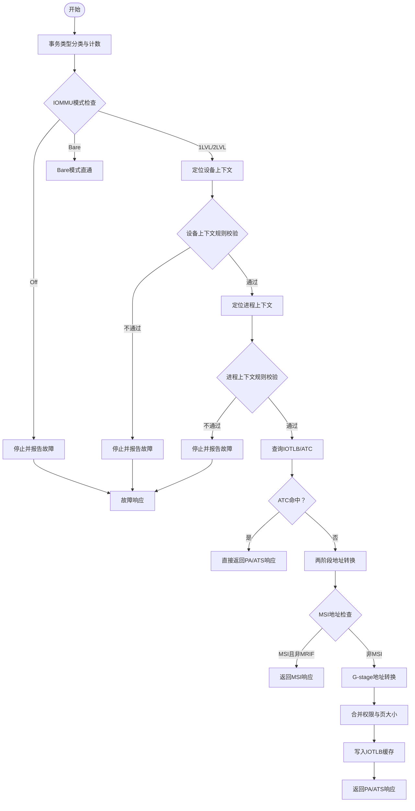
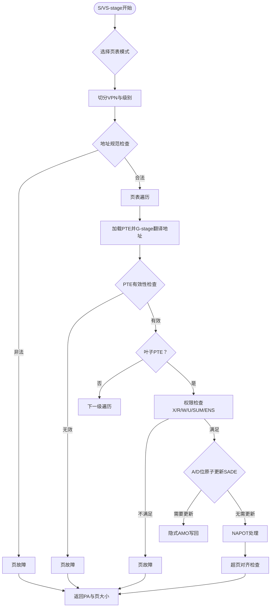
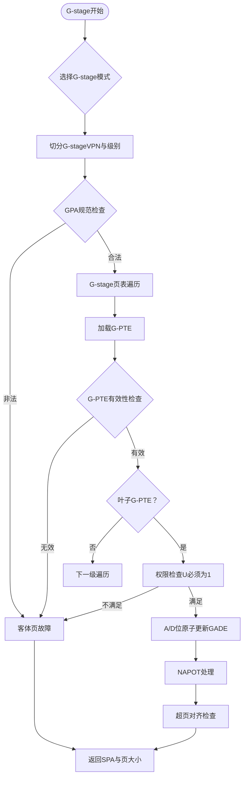
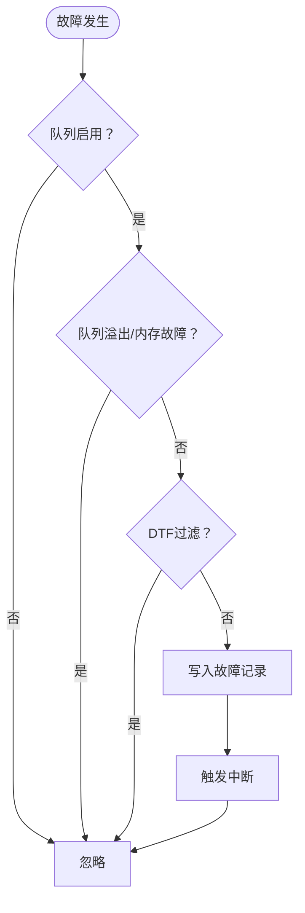
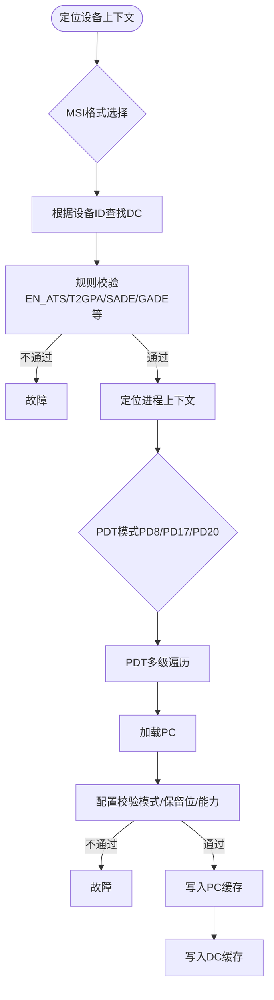
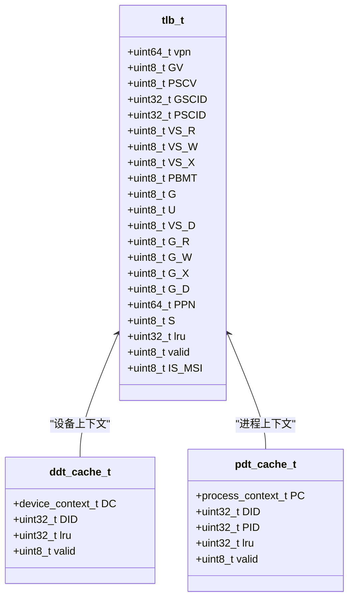
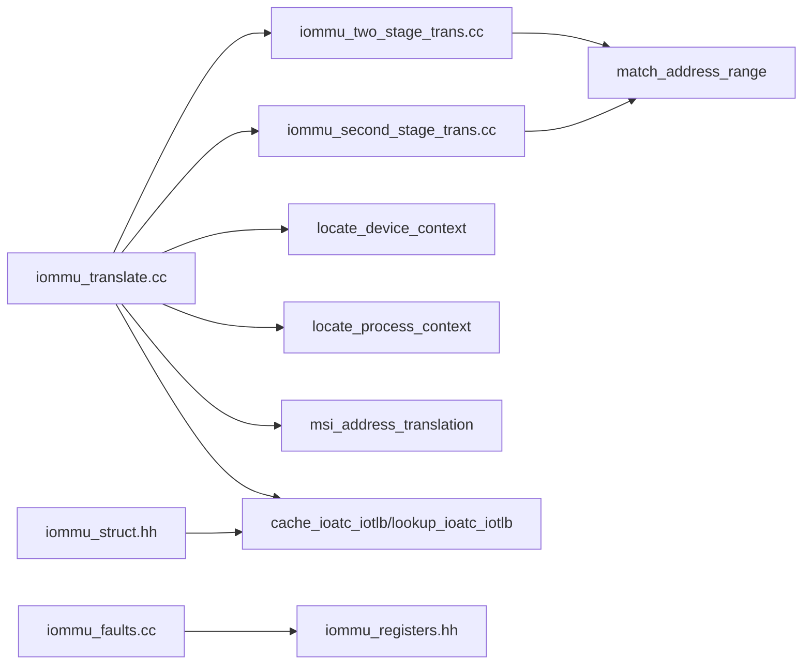

# 核心功能模块

<cite>
**本文档引用的文件**
- [iommu_translate.cc](file://iommu/iommu_fun_model/iommu_translate.cc)
- [iommu_two_stage_trans.cc](file://iommu/iommu_fun_model/iommu_two_stage_trans.cc)
- [iommu_second_stage_trans.cc](file://iommu/iommu_fun_model/iommu_second_stage_trans.cc)
- [iommu_faults.cc](file://iommu/iommu_fun_model/iommu_faults.cc)
- [iommu_atc.cc](file://iommu/iommu_fun_model/iommu_atc.cc)
- [iommu_process_context.cc](file://iommu/iommu_fun_model/iommu_process_context.cc)
- [iommu_utils.cc](file://iommu/iommu_fun_model/iommu_utils.cc)
- [iommu_translate.hh](file://iommu/include/iommu_translate.hh)
- [iommu_atc.hh](file://iommu/include/iommu_atc.hh)
- [iommu_data_structures.hh](file://iommu/include/iommu_data_structures.hh)
- [iommu_registers.hh](file://iommu/include/iommu_registers.hh)
- [iommu_struct.hh](file://iommu/include/iommu_struct.hh)
- [iommu_top.cc](file://iommu/iommu_top.cc)
</cite>

## 目录
1. [简介](#简介)
2. [项目结构](#项目结构)
3. [核心组件](#核心组件)
4. [架构总览](#架构总览)
5. [详细组件分析](#详细组件分析)
6. [依赖关系分析](#依赖关系分析)
7. [性能考虑](#性能考虑)
8. [故障排查指南](#故障排查指南)
9. [结论](#结论)

## 简介
本文件面向RISC-V IOMMU核心功能模块，系统性阐述地址转换引擎的实现与工作机制，覆盖单级转换（Sv39/Sv48/Sv57）与两级转换（VS-stage + G-stage）的完整流程，以及故障处理、设备上下文管理与地址转换缓存（ATC）的实现细节。文档以代码为依据，结合图示与调用关系，帮助初学者快速理解，同时为有经验的开发者提供深入的技术参考。

## 项目结构
IOMMU核心功能位于 `iommu/` 目录下，采用“功能模型 + 性能模型 + 接口头文件”的分层组织：
- 功能模型：实现地址转换、故障处理、ATC等核心逻辑
- 性能模型：SystemC封装与流水线调度
- 接口头文件：数据结构、寄存器定义、接口声明

图表来源
- [iommu_translate.cc:1-732](file://iommu/iommu_fun_model/iommu_translate.cc#L1-L732)
- [iommu_two_stage_trans.cc:1-600](file://iommu/iommu_fun_model/iommu_two_stage_trans.cc#L1-L600)
- [iommu_second_stage_trans.cc:1-424](file://iommu/iommu_fun_model/iommu_second_stage_trans.cc#L1-L424)
- [iommu_faults.cc:1-160](file://iommu/iommu_fun_model/iommu_faults.cc#L1-L160)
- [iommu_atc.cc:1-233](file://iommu/iommu_fun_model/iommu_atc.cc#L1-L233)
- [iommu_process_context.cc:1-236](file://iommu/iommu_fun_model/iommu_process_context.cc#L1-L236)
- [iommu_utils.cc:1-18](file://iommu/iommu_fun_model/iommu_utils.cc#L1-L18)
- [iommu_translate.hh:1-132](file://iommu/include/iommu_translate.hh#L1-L132)
- [iommu_atc.hh:1-98](file://iommu/include/iommu_atc.hh#L1-L98)
- [iommu_data_structures.hh:1-415](file://iommu/include/iommu_data_structures.hh#L1-L415)
- [iommu_registers.hh:1-987](file://iommu/include/iommu_registers.hh#L1-L987)
- [iommu_struct.hh:1-102](file://iommu/include/iommu_struct.hh#L1-L102)
- [iommu_top.cc:1-540](file://iommu/iommu_top.cc#L1-L540)

章节来源
- [iommu_translate.cc:1-732](file://iommu/iommu_fun_model/iommu_translate.cc#L1-L732)
- [iommu_struct.hh:1-102](file://iommu/include/iommu_struct.hh#L1-L102)

## 核心组件
- 地址转换主流程：负责事务分类、设备/进程上下文定位、两阶段地址转换、MSI地址翻译、ATC缓存与响应生成
- 两阶段地址转换引擎：实现S/VS-stage与G-stage的页表遍历、权限检查、A/D位原子更新、NAPOT处理
- 故障处理与上报：将故障记录写入故障队列，触发中断，支持DTF控制
- 设备/进程上下文管理：DDT/PDT查找、配置校验、缓存
- 地址转换缓存（ATC/TLB）：设备目录缓存、进程目录缓存、IOTLB（NAPOT格式）
- 工具函数：地址范围匹配（NAPOT）

章节来源
- [iommu_translate.cc:1-732](file://iommu/iommu_fun_model/iommu_translate.cc#L1-L732)
- [iommu_two_stage_trans.cc:1-600](file://iommu/iommu_fun_model/iommu_two_stage_trans.cc#L1-L600)
- [iommu_second_stage_trans.cc:1-424](file://iommu/iommu_fun_model/iommu_second_stage_trans.cc#L1-L424)
- [iommu_faults.cc:1-160](file://iommu/iommu_fun_model/iommu_faults.cc#L1-L160)
- [iommu_atc.cc:1-233](file://iommu/iommu_fun_model/iommu_atc.cc#L1-L233)
- [iommu_process_context.cc:1-236](file://iommu/iommu_fun_model/iommu_process_context.cc#L1-L236)
- [iommu_utils.cc:1-18](file://iommu/iommu_fun_model/iommu_utils.cc#L1-L18)

## 架构总览
IOMMU核心由“请求入口 → 上下文解析 → 两阶段转换 → MSI处理 → 缓存/响应 → 故障上报”构成的流水线式处理链路。

图表来源
- [iommu_translate.cc:1-732](file://iommu/iommu_fun_model/iommu_translate.cc#L1-L732)
- [iommu_two_stage_trans.cc:1-600](file://iommu/iommu_fun_model/iommu_two_stage_trans.cc#L1-L600)
- [iommu_second_stage_trans.cc:1-424](file://iommu/iommu_fun_model/iommu_second_stage_trans.cc#L1-L424)
- [iommu_atc.cc:1-233](file://iommu/iommu_fun_model/iommu_atc.cc#L1-L233)
- [iommu_faults.cc:1-160](file://iommu/iommu_fun_model/iommu_faults.cc#L1-L160)

## 详细组件分析

### 地址转换主流程（iommu_translate_iova）
- 职责：统一入口，完成事务分类、上下文定位、两阶段转换、MSI处理、ATC缓存与响应生成
- 关键步骤：
  - 事务类型识别与计数
  - IOMMU模式检查（Off/Bare/1LVL/2LVL）
  - 设备上下文定位与规则校验
  - 进程上下文定位与权限检查
  - 两阶段地址转换（S/VS + G）
  - MSI地址翻译（含MRIF模式）
  - G-stage权限与页大小合并
  - IOTLB缓存（NAPOT格式）
  - ATS响应字段填充（Priv/N/CXL_IO/Global/R/W/X等）
  - 故障路径与错误码映射
- 接口规范：
  - 输入：hb_to_iommu_req_t（请求）
  - 输出：iommu_to_hb_rsp_t（响应）
  - 返回状态：SUCCESS/UNSUPPORTED_REQUEST/COMPLETER_ABORT

图表来源
- [iommu_translate.cc:1-732](file://iommu/iommu_fun_model/iommu_translate.cc#L1-L732)

章节来源
- [iommu_translate.cc:1-732](file://iommu/iommu_fun_model/iommu_translate.cc#L1-L732)

### 两阶段地址转换引擎（two_stage_address_translation）
- 职责：实现S/VS-stage页表遍历，支持Sv32/Sv39/Sv48/Sv57，NAPOT处理，A/D位原子更新，权限检查
- 关键点：
  - 根据iosatp.MODE选择页表级别与VPN切分
  - 非法地址（非规范）检测
  - PTE有效性与保留位检查
  - 叶子PTE权限校验（执行/读/写/U位/SUM/ENS）
  - A/D位原子更新（SADE），必要时隐式写回
  - NAPOT编码处理与范围匹配
  - 超页对齐检查
  - 返回PA与页大小（支持超页）

图表来源
- [iommu_two_stage_trans.cc:1-600](file://iommu/iommu_fun_model/iommu_two_stage_trans.cc#L1-L600)

章节来源
- [iommu_two_stage_trans.cc:1-600](file://iommu/iommu_fun_model/iommu_two_stage_trans.cc#L1-L600)

### 第二阶段地址转换（second_stage_address_translation）
- 职责：实现G-stage页表遍历，支持Sv32x4/Sv39x4/Sv48x4/Sv57x4，MRIF与MSI处理
- 关键点：
  - 根据iohgatp.MODE选择G-stage页表级别
  - 入口GPA规范检查（SXL/GXL约束）
  - PTE有效性与保留位检查
  - 叶子PTE权限校验（U位必须为1）
  - A/D位原子更新（GADE），隐式写回
  - NAPOT处理与超页对齐
  - 返回SPA与G-stage页大小

图表来源
- [iommu_second_stage_trans.cc:1-424](file://iommu/iommu_fun_model/iommu_second_stage_trans.cc#L1-L424)

章节来源
- [iommu_second_stage_trans.cc:1-424](file://iommu/iommu_fun_model/iommu_second_stage_trans.cc#L1-L424)

### 故障处理与上报（report_fault）
- 职责：在满足条件时将故障记录写入故障队列，触发中断；支持DTF控制
- 关键点：
  - 队列启用与溢出/内存故障保护
  - DTF过滤策略（仅部分故障可被屏蔽）
  - 记录字段：DID/PID/PV/PRIV/TTYP/CAUSE/iotval/iotval2
  - 队列满/内存访问失败处理

图表来源
- [iommu_faults.cc:1-160](file://iommu/iommu_fun_model/iommu_faults.cc#L1-L160)

章节来源
- [iommu_faults.cc:1-160](file://iommu/iommu_fun_model/iommu_faults.cc#L1-L160)

### 设备/进程上下文管理
- 设备上下文（DC）：包含tc/iohgatp/ta/fsc/msiptp等，决定S/VS-stage与G-stage参数
- 进程上下文（PC）：包含ta/fsc，决定PSCID与S/VS-stage参数
- 定位流程：
  - 设备上下文定位：根据设备ID与MSI格式（Base/Extended）选择索引
  - 进程上下文定位：根据PDT（PD8/PD17/PD20）多级目录树定位PC
  - 配置校验：模式合法性、保留位、能力支持
  - 缓存：DDT/PDT缓存提升后续命中率

图表来源
- [iommu_process_context.cc:1-236](file://iommu/iommu_fun_model/iommu_process_context.cc#L1-L236)
- [iommu_atc.cc:1-233](file://iommu/iommu_fun_model/iommu_atc.cc#L1-L233)

章节来源
- [iommu_process_context.cc:1-236](file://iommu/iommu_fun_model/iommu_process_context.cc#L1-L236)
- [iommu_atc.cc:1-233](file://iommu/iommu_fun_model/iommu_atc.cc#L1-L233)

### 地址转换缓存（ATC/TLB）
- IOTLB（TLB）：存储NAPOT格式的IOVA→PPN映射，带权限与页大小信息
- 设备目录缓存（DDT Cache）：加速DC查找
- 进程目录缓存（PDT Cache）：加速PC查找
- 匹配算法：基于VPN与S字段的NAPOT范围匹配

图表来源
- [iommu_atc.hh:1-98](file://iommu/include/iommu_atc.hh#L1-L98)
- [iommu_struct.hh:1-102](file://iommu/include/iommu_struct.hh#L1-L102)

章节来源
- [iommu_atc.cc:1-233](file://iommu/iommu_fun_model/iommu_atc.cc#L1-L233)
- [iommu_atc.hh:1-98](file://iommu/include/iommu_atc.hh#L1-L98)

### MSI地址翻译与MRIF处理
- MSI识别：基于msi_addr_mask与msi_addr_pattern匹配
- MSI PTE模式：Flat（基本翻译）与MRIF（内存驻留中断文件）
- MRIF模式：不缓存于IOTLB，需在缺页时进行页表遍历
- ATS场景：MRIF模式下返回U=1的特殊响应

章节来源
- [iommu_translate.cc:388-418](file://iommu/iommu_fun_model/iommu_translate.cc#L388-L418)
- [iommu_translate.hh:261-306](file://iommu/include/iommu_translate.hh#L261-L306)

## 依赖关系分析
- 组件耦合：
  - iommu_translate.cc 依赖 two_stage_address_translation、second_stage_address_translation、locate_device_context、locate_process_context、msi_address_translation、cache_ioatc_iotlb、lookup_ioatc_iotlb
  - iommu_two_stage_trans.cc 与 iommu_second_stage_trans.cc 依赖通用工具函数（如match_address_range）
  - iommu_faults.cc 依赖寄存器与队列结构
- 外部依赖：
  - 寄存器与数据结构定义来自 iommu_registers.hh、iommu_data_structures.hh
  - SystemC封装在 iommu_top.cc 中协调请求与缓存子系统

图表来源
- [iommu_translate.cc:1-732](file://iommu/iommu_fun_model/iommu_translate.cc#L1-L732)
- [iommu_two_stage_trans.cc:1-600](file://iommu/iommu_fun_model/iommu_two_stage_trans.cc#L1-L600)
- [iommu_second_stage_trans.cc:1-424](file://iommu/iommu_fun_model/iommu_second_stage_trans.cc#L1-L424)
- [iommu_faults.cc:1-160](file://iommu/iommu_fun_model/iommu_faults.cc#L1-L160)
- [iommu_utils.cc:1-18](file://iommu/iommu_fun_model/iommu_utils.cc#L1-L18)
- [iommu_registers.hh:1-987](file://iommu/include/iommu_registers.hh#L1-L987)
- [iommu_struct.hh:1-102](file://iommu/include/iommu_struct.hh#L1-L102)

章节来源
- [iommu_translate.cc:1-732](file://iommu/iommu_fun_model/iommu_translate.cc#L1-L732)
- [iommu_struct.hh:1-102](file://iommu/include/iommu_struct.hh#L1-L102)

## 性能考虑
- ATC命中率优化：
  - IOTLB采用NAPOT格式扩大匹配范围，减少页表遍历
  - ATS场景下可缓存GPA→SPA或IOVA→SPA，取决于T2GPA配置
- 页表遍历开销：
  - S/VS-stage与G-stage均支持超页，减少遍历层级
  - A/D位原子更新（SADE/GADE）减少隐式写回次数
- 缓存子系统：
  - DDT/PDT缓存降低DC/PC查找延迟
  - VA去重（PT_CACHE_VA_DEDUP_ENABLED）可显著减少重复PTW任务

章节来源
- [iommu_translate.cc:458-492](file://iommu/iommu_fun_model/iommu_translate.cc#L458-L492)
- [iommu_top.cc:462-515](file://iommu/iommu_top.cc#L462-L515)

## 故障排查指南
- 常见故障类型与原因：
  - Off模式下的请求：All inbound transactions disallowed（256）
  - Bare模式不支持的事务：Transaction type disallowed（260）
  - PTE无效/损坏：PDT entry not valid（266）、PDT data corruption（269）、S/VS/G-stage PT data corruption（274）
  - 权限不足：Instruction/Read/Write access fault（1/5/7）
  - 客体页故障：Instruction/Read/Write guest page fault（20/21/23）
- ATS特例：
  - ATS翻译请求遇到配置错误时返回Completer Abort（CA）
  - ATS成功但权限不足时仍返回Success，但R/W/X置零
- 排查步骤：
  - 检查IOMMU模式与设备/进程上下文配置
  - 查看故障队列记录（DID/PID/TTYP/CAUSE/iotval/iotval2）
  - 确认页表级别与VPN切分是否符合SXL/GXL约束
  - 核对A/D位更新策略（SADE/GADE）与隐式写回路径

章节来源
- [iommu_translate.cc:620-730](file://iommu/iommu_fun_model/iommu_translate.cc#L620-L730)
- [iommu_faults.cc:1-160](file://iommu/iommu_fun_model/iommu_faults.cc#L1-L160)

## 结论
本模块以清晰的层次化设计实现了RISC-V IOMMU的核心功能：从请求入口到上下文解析，再到两阶段地址转换与MSI处理，最终通过ATC缓存与故障上报形成完整的闭环。通过对Sv39/Sv48/Sv57与VS-stage/G-stage的统一建模，以及对NAPOT、A/D位原子更新、MRIF等特性的支持，既保证了功能完整性，也兼顾了性能与可维护性。建议在实际部署中结合ATS与缓存策略，进一步优化吞吐与延迟表现。