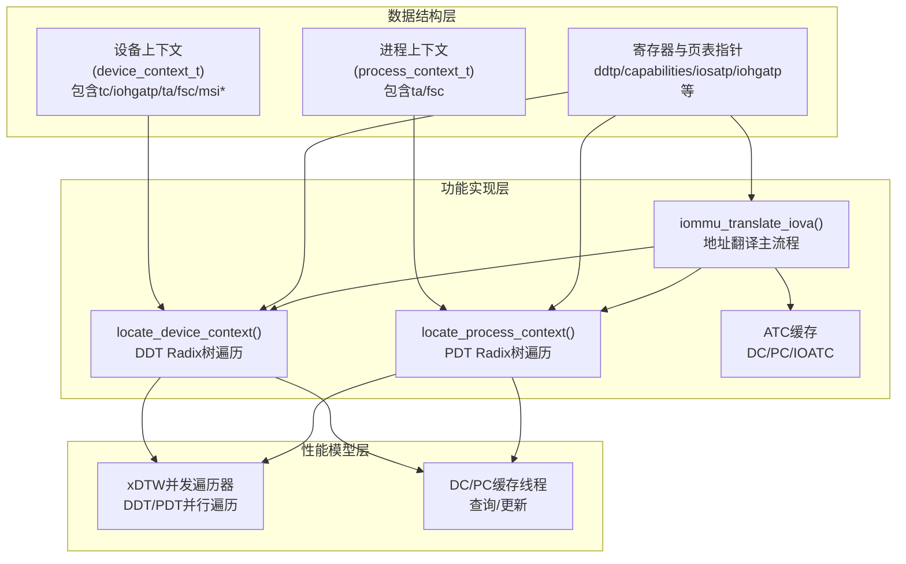
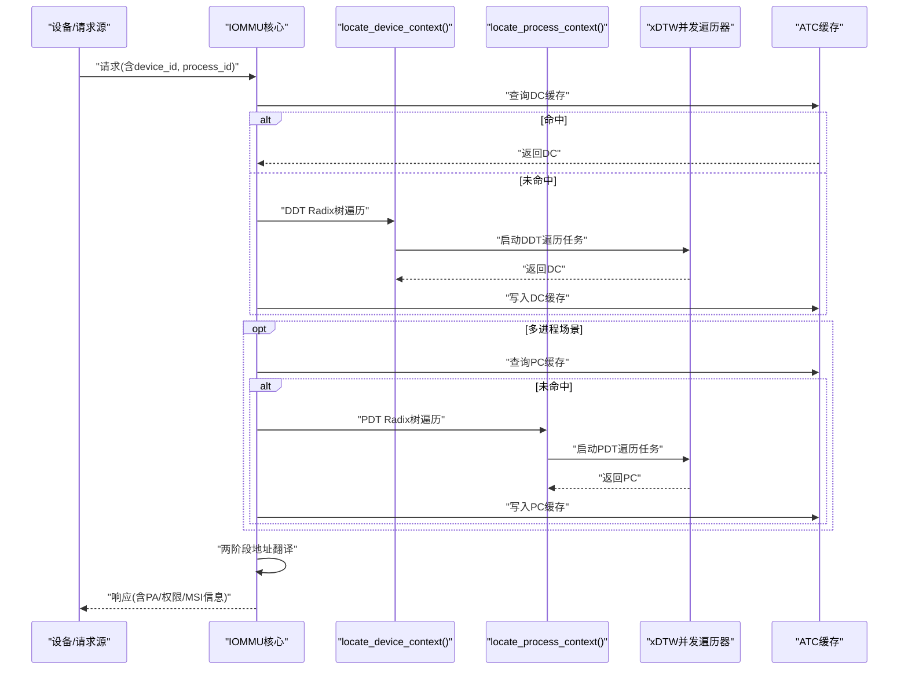
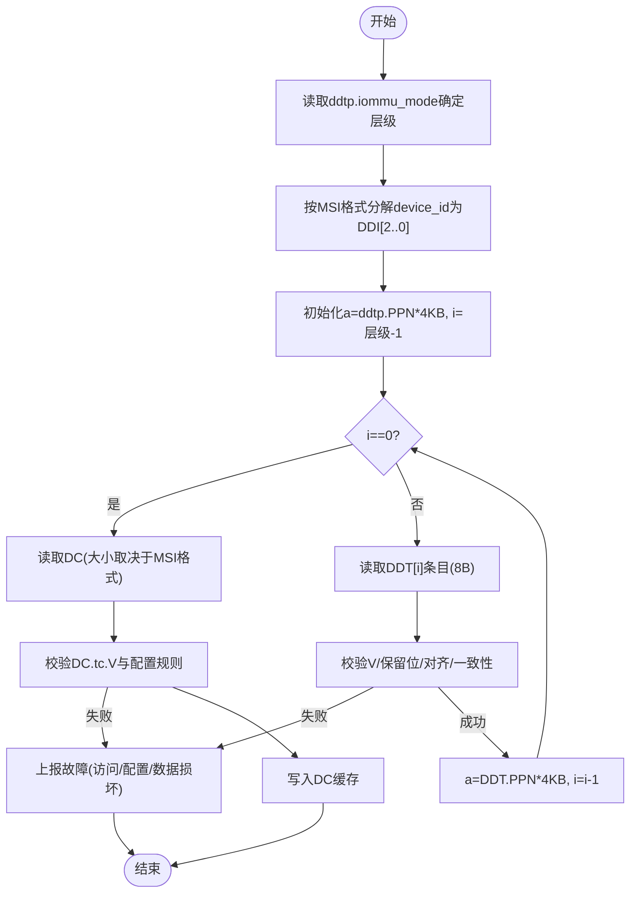
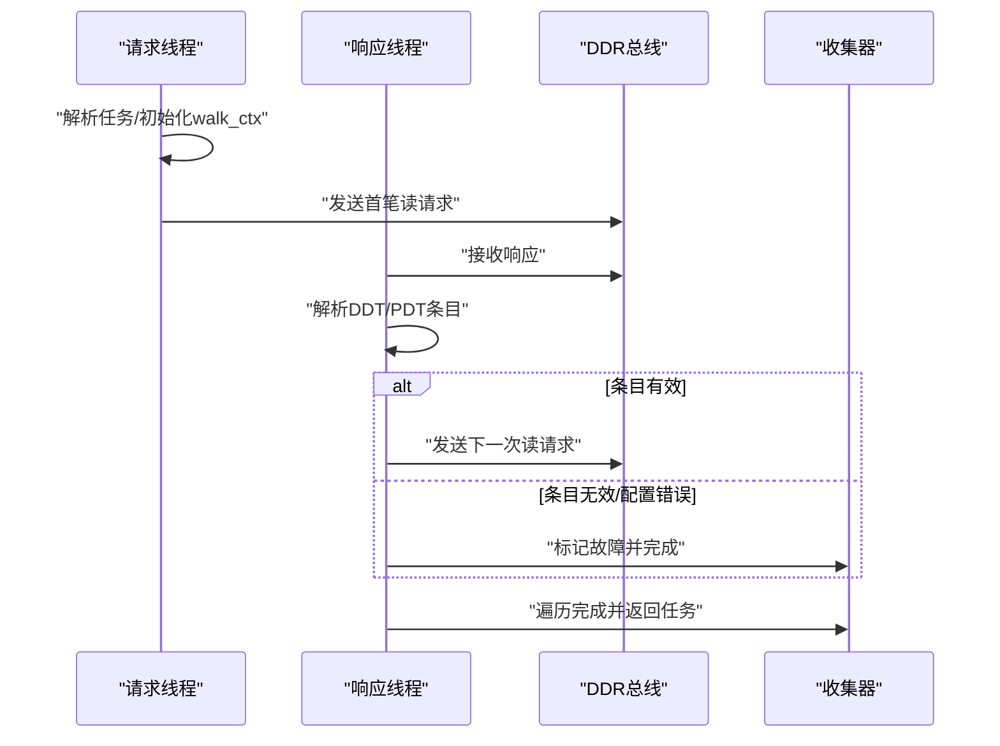
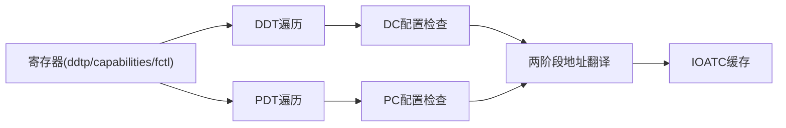

# 设备上下文管理

<cite>
**本文档引用的文件**
- [iommu_device_context.cc](file://iommu/iommu_perf_model/iommu_device_context.cc)
- [iommu_process_context.cc](file://iommu/iommu_fun_model/iommu_process_context.cc)
- [iommu_perf_xdtw.cc](file://iommu/iommu_perf_model/iommu_perf_xdtw.cc)
- [iommu_translate.cc](file://iommu/iommu_fun_model/iommu_translate.cc)
- [iommu_atc.cc](file://iommu/iommu_fun_model/iommu_atc.cc)
- [iommu_atc.hh](file://iommu/include/iommu_atc.hh)
- [iommu_data_structures.hh](file://iommu/include/iommu_data_structures.hh)
- [iommu_registers.hh](file://iommu/include/iommu_registers.hh)
- [iommu_struct.hh](file://iommu/include/iommu_struct.hh)
- [iommu_perf_dc_pc_cache.cc](file://iommu/iommu_perf_model/iommu_perf_dc_pc_cache.cc)
</cite>

## 目录
1. [简介](#简介)
2. [项目结构](#项目结构)
3. [核心组件](#核心组件)
4. [架构总览](#架构总览)
5. [详细组件分析](#详细组件分析)
6. [依赖关系分析](#依赖关系分析)
7. [性能考虑](#性能考虑)
8. [故障排查指南](#故障排查指南)
9. [结论](#结论)

## 简介
本文件面向IOMMU模型中的“设备上下文管理”子系统，系统性阐述设备上下文（Device Context，简称DC）的结构与职责、设备标识符（device_id）在不同MSI格式（Base-format与Extended-format）下的分解差异、DDT（设备目录表）Radix树遍历与xDTW（扩展目录表遍历器）并发实现、以及DC在地址转换流程中的关键作用（含ATS启用、PRI支持、进程ID验证等）。同时提供最佳实践与性能优化建议，帮助读者在功能正确性与性能之间取得平衡。

## 项目结构
围绕设备上下文管理的关键代码分布在以下模块：
- 数据结构定义：设备上下文、进程上下文、寄存器与页表指针等
- 功能实现：设备上下文定位、进程上下文定位、地址翻译主流程、ATC缓存
- 性能模型：xDTW并发遍历器、DC/PC缓存查询与更新线程

图示来源
- [iommu_device_context.cc:10-229](file://iommu/iommu_perf_model/iommu_device_context.cc#L10-L229)
- [iommu_process_context.cc:12-196](file://iommu/iommu_fun_model/iommu_process_context.cc#L12-L196)
- [iommu_translate.cc:9-732](file://iommu/iommu_fun_model/iommu_translate.cc#L9-L732)
- [iommu_perf_xdtw.cc:12-367](file://iommu/iommu_perf_model/iommu_perf_xdtw.cc#L12-L367)
- [iommu_perf_dc_pc_cache.cc:11-123](file://iommu/iommu_perf_model/iommu_perf_dc_pc_cache.cc#L11-L123)

章节来源
- [iommu_data_structures.hh:324-335](file://iommu/include/iommu_data_structures.hh#L324-L335)
- [iommu_registers.hh:286-330](file://iommu/include/iommu_registers.hh#L286-L330)
- [iommu_struct.hh:42-99](file://iommu/include/iommu_struct.hh#L42-L99)

## 核心组件
- 设备上下文（DC）：承载设备级地址翻译控制、G-stage根指针、属性与第一阶段上下文；在Extended-format下还包含MSI页表指针与MSI地址掩码/模式字段。
- 进程上下文（PC）：在多进程场景中为特定process_id选择对应的S/VS-stage页表与PSCID。
- DDT/PDT Radix树：通过device_id或process_id的位域分解作为索引，逐级遍历非叶子节点，最终定位DC/PC。
- xDTW并发遍历器：将DDT/PDT遍历拆分为两个独立线程，分别处理设备上下文与进程上下文，提升吞吐。
- ATC缓存：DC/PC与IOATC（TLB）缓存，减少重复遍历与内存访问。

章节来源
- [iommu_data_structures.hh:324-335](file://iommu/include/iommu_data_structures.hh#L324-L335)
- [iommu_device_context.cc:10-229](file://iommu/iommu_perf_model/iommu_device_context.cc#L10-L229)
- [iommu_process_context.cc:12-196](file://iommu/iommu_fun_model/iommu_process_context.cc#L12-L196)
- [iommu_perf_xdtw.cc:12-367](file://iommu/iommu_perf_model/iommu_perf_xdtw.cc#L12-L367)
- [iommu_atc.cc:36-94](file://iommu/iommu_fun_model/iommu_atc.cc#L36-L94)

## 架构总览
设备上下文管理贯穿请求进入IOMMU后的首个关键步骤：基于device_id与可选process_id，通过DDT/PDT Radix树定位DC/PC，并结合ATS/PRI/MSI等能力进行权限与模式校验，最终驱动两阶段地址翻译。

图示来源
- [iommu_translate.cc:193-330](file://iommu/iommu_fun_model/iommu_translate.cc#L193-L330)
- [iommu_device_context.cc:10-229](file://iommu/iommu_perf_model/iommu_device_context.cc#L10-L229)
- [iommu_process_context.cc:12-196](file://iommu/iommu_fun_model/iommu_process_context.cc#L12-L196)
- [iommu_perf_xdtw.cc:12-367](file://iommu/iommu_perf_model/iommu_perf_xdtw.cc#L12-L367)
- [iommu_perf_dc_pc_cache.cc:11-123](file://iommu/iommu_perf_model/iommu_perf_dc_pc_cache.cc#L11-L123)

## 详细组件分析

### 设备上下文（DC）结构与MSI格式差异
- 结构组成：tc（控制）、iohgatp（G-stage根指针）、ta（属性，含QoS ID）、fsc（第一阶段上下文，S/VS-stage或PDT根），Extended-format额外包含msiptp、msi_addr_mask、msi_addr_pattern。
- MSI格式差异：
  - Base-format：DC大小为32字节，不包含MSI相关字段。
  - Extended-format：DC大小为64字节，新增MSI页表指针与MSI地址识别字段，支持Flat MSI页表。
- 能力约束：Extended-format要求MSI页表指针MODE仅允许Off或Flat；当iohgatp.MODE为Bare时，msiptp.MODE必须为Off。

章节来源
- [iommu_data_structures.hh:324-335](file://iommu/include/iommu_data_structures.hh#L324-L335)
- [iommu_device_context.cc:231-418](file://iommu/iommu_perf_model/iommu_device_context.cc#L231-L418)

### 设备标识符分解与DDT Radix树遍历
- device_id分解：
  - Base-format：DDI[0]=device_id[6:0]、DDI[1]=device_id[15:7]、DDI[2]=device_id[23:16]。
  - Extended-format：DDI[0]=device_id[5:0]、DDI[1]=device_id[14:6]、DDI[2]=device_id[23:15]。
- DDT遍历：
  - 支持1/2/3级Radix树，由ddtp.iommu_mode决定层级数。
  - 非叶子节点占8字节，保存下一级表PPN；叶子节点直接持有DC。
  - 每级遍历前执行PMA/PMP检查与数据一致性校验，失败则上报对应故障。
- DC定位后进行配置检查（见下一节），通过后写入DC缓存。

图示来源
- [iommu_device_context.cc:10-229](file://iommu/iommu_perf_model/iommu_device_context.cc#L10-L229)
- [iommu_device_context.cc:231-418](file://iommu/iommu_perf_model/iommu_device_context.cc#L231-L418)

章节来源
- [iommu_device_context.cc:10-229](file://iommu/iommu_perf_model/iommu_device_context.cc#L10-L229)
- [iommu_device_context.cc:231-418](file://iommu/iommu_perf_model/iommu_device_context.cc#L231-L418)

### DC配置检查与能力约束
- 关键检查点：
  - 保留位与编码合法性。
  - ATS/PRI/T2GPA能力启用条件：若capabilities.ats=0，则不允许DC.tc.EN_ATS/EN_PRI/PRPR=1；EN_ATS=0时不允许T2GPA=1。
  - PDT模式与G-stage模式一致性：PDTV=1时pdtp.MODE需受capabilites.PD8/PD17/PD20支持；PDTV=0时iosatp.MODE需合法且受capabilities.Sv39/48/57或Sv32支持。
  - ioHGATP模式与根页表对齐：MODE非Bare时，PPN需16KB对齐。
  - MSI模式限制：Extended-format下msiptp.MODE仅允许Off/Flat；iohgatp.Mode=Bare时msiptp.Mode必须为Off。
  - END/GXL一致性：fctl.BE与DC.tc.SBE一致；fctl.GXL=1时DC.tc.SXL必须为1。
- 任一不满足即上报“DDT条目配置错误”。

章节来源
- [iommu_device_context.cc:231-418](file://iommu/iommu_perf_model/iommu_device_context.cc#L231-L418)

### 进程上下文（PC）与PDT Radix树遍历
- process_id分解（固定为PD20/PD17/PD8模式）：
  - PDI[0]=process_id[7:0]、PDI[1]=process_id[16:8]、PDI[2]=process_id[19:17]。
- PDT遍历：
  - 若DC.iohgatp.Mode非Bare，需先对a进行G-stage隐式翻译（可能触发G-stage页故障）。
  - 非叶子节点8字节，叶子节点16字节持有PC。
  - 同样进行PMA/PMP与一致性检查。
- PC定位后进行配置检查（MODE合法性与capabilities支持），通过后写入PC缓存。

章节来源
- [iommu_process_context.cc:12-196](file://iommu/iommu_fun_model/iommu_process_context.cc#L12-L196)
- [iommu_process_context.cc:198-235](file://iommu/iommu_fun_model/iommu_process_context.cc#L198-L235)

### 地址翻译流程中的DC关键作用
- ATS/PRI支持：DC.tc.EN_ATS/EN_PRI/PRPR控制是否启用PCIe ATS与PRI；T2GPA控制返回GPA还是SPA。
- 多进程支持：PDTV=1时，使用PDT选择PC；DPE=1且无有效PID时可采用默认PID=0。
- 两阶段翻译参数：根据DC选择iosatp/pc.fsc与iohgatp，决定S/VS-stage与G-stage路径。
- IOATC缓存：优先从IOATC命中，否则执行两阶段地址翻译并写回缓存。

章节来源
- [iommu_translate.cc:193-330](file://iommu/iommu_fun_model/iommu_translate.cc#L193-L330)
- [iommu_translate.cc:376-440](file://iommu/iommu_fun_model/iommu_translate.cc#L376-L440)

### xDTW并发遍历器实现
- 两个请求线程：
  - 请求线程：解析任务，初始化遍历上下文（基址、层级、索引、读地址/长度），发送首笔DDR请求。
  - 响应线程：解析DDR响应，按状态机推进DDT/PDT遍历，遇到配置错误或访问错误即终止并上报。
- 并发策略：DDT与PDT任务分别计数，避免拥塞；完成或出错后通知收集器。

图示来源
- [iommu_perf_xdtw.cc:12-367](file://iommu/iommu_perf_model/iommu_perf_xdtw.cc#L12-L367)

章节来源
- [iommu_perf_xdtw.cc:12-367](file://iommu/iommu_perf_model/iommu_perf_xdtw.cc#L12-L367)

### ATC缓存与性能模型线程
- DC/PC缓存线程：查询命中则快速返回，未命中则等待xDTW完成后再写入缓存。
- IOATC（TLB）：缓存VPN到PPN映射及权限属性，支持NAPOT范围匹配与权限校验。
- 缓存替换策略：LRU；命中时更新LRU时间戳。

章节来源
- [iommu_perf_dc_pc_cache.cc:11-123](file://iommu/iommu_perf_model/iommu_perf_dc_pc_cache.cc#L11-L123)
- [iommu_atc.cc:36-94](file://iommu/iommu_fun_model/iommu_atc.cc#L36-L94)
- [iommu_atc.cc:96-233](file://iommu/iommu_fun_model/iommu_atc.cc#L96-L233)
- [iommu_atc.hh:38-51](file://iommu/include/iommu_atc.hh#L38-L51)

## 依赖关系分析
- locate_device_context依赖：
  - 寄存器：ddtp、capabilities、fctl
  - 内存访问：按PA对齐与PMA/PMP检查
  - 配置检查：do_device_context_configuration_checks
- locate_process_context依赖：
  - DC.fsc.pdtp（PDT根）
  - 可选G-stage隐式翻译（DC.iohgatp）
  - 配置检查：do_process_context_configuration_checks
- 地址翻译主流程：
  - 统一调用locate_device_context/locate_process_context
  - 使用两阶段地址翻译函数
  - IOATC命中则跳过页表遍历

图示来源
- [iommu_device_context.cc:10-229](file://iommu/iommu_perf_model/iommu_device_context.cc#L10-L229)
- [iommu_process_context.cc:12-196](file://iommu/iommu_fun_model/iommu_process_context.cc#L12-L196)
- [iommu_translate.cc:376-440](file://iommu/iommu_fun_model/iommu_translate.cc#L376-L440)

章节来源
- [iommu_device_context.cc:10-229](file://iommu/iommu_perf_model/iommu_device_context.cc#L10-L229)
- [iommu_process_context.cc:12-196](file://iommu/iommu_fun_model/iommu_process_context.cc#L12-L196)
- [iommu_translate.cc:376-440](file://iommu/iommu_fun_model/iommu_translate.cc#L376-L440)

## 性能考虑
- 并发遍历：xDTW将DDT/PDT遍历解耦为两条线程，显著降低尾延迟。
- 缓存命中：DC/PC/IOATC命中可绕过内存访问与页表遍历，建议合理设置缓存容量与替换策略。
- 扇出控制：DDT/PDT最大层级与索引宽度直接影响内存带宽与延迟，需结合设备数量与进程数量规划。
- 能力开关：仅启用所需能力（如MSI Flat、ATS、PRI），减少不必要的检查与路径切换。
- 访问模式：尽量连续访问同一设备/进程，提升缓存局部性。

## 故障排查指南
- 常见故障与原因：
  - DDT条目加载访问故障（257）：地址越界或PMA/PMP违规。
  - DDT条目无效（258）：V=0或保留位非法。
  - DDT条目配置错误（259）：能力不匹配或模式非法。
  - ATS/PRI/事务类型禁用（260）：DC.tc.EN_ATS/EN_PRI未启用或请求类型不被支持。
  - MSI页表相关故障（261/263/270/271）：MSI页表加载/配置/数据损坏。
  - PDT相关故障（265/266/267/269）：PDT条目加载/无效/配置/数据损坏。
  - 第二阶段页表数据损坏（274）：G-stage或VS-stage页表数据损坏。
- 排查步骤：
  - 确认ddtp.iommu_mode与device_id宽度匹配。
  - 检查capabilities与fctl设置是否与DC配置一致。
  - 核对Extended-format下MSI相关字段与iohgatp.Mode约束。
  - 观察xDTW输出与DDR访问次数，定位具体遍历层级。
  - 利用统计事件与日志定位热点与异常。

章节来源
- [iommu_device_context.cc:128-161](file://iommu/iommu_perf_model/iommu_device_context.cc#L128-L161)
- [iommu_device_context.cc:200-222](file://iommu/iommu_perf_model/iommu_device_context.cc#L200-L222)
- [iommu_process_context.cc:125-152](file://iommu/iommu_fun_model/iommu_process_context.cc#L125-L152)
- [iommu_process_context.cc:170-184](file://iommu/iommu_fun_model/iommu_process_context.cc#L170-L184)

## 结论
设备上下文管理以DC为核心，通过DDT Radix树与xDTW并发遍历实现高效定位；Extended-format在支持MSI的同时引入更严格的模式与对齐约束。配合DC/PC/IOATC缓存与两阶段地址翻译，系统在功能完整性与性能之间取得良好平衡。部署时应依据设备规模与进程复杂度合理配置能力与缓存策略，并严格遵循MSI与模式约束，确保稳定运行。